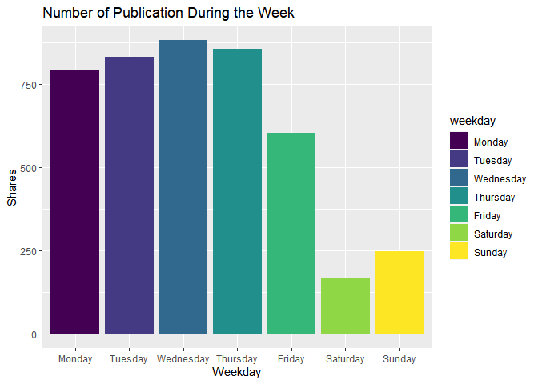
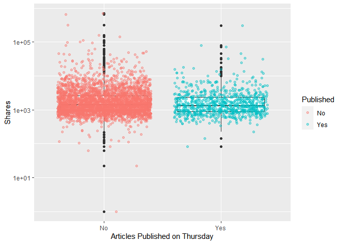

ST558 Project 3 Group F: Business Summary Report
================
Magaritte Nguyen & Matthew Sookoo
2022-11-12

-   <a href="#introduction" id="toc-introduction">Introduction</a>
    -   <a href="#more-about-the-variables"
        id="toc-more-about-the-variables">More about the variables</a>
        -   <a href="#response-variable" id="toc-response-variable">Response
            variable</a>
        -   <a href="#independent-or-predictor-variables"
            id="toc-independent-or-predictor-variables">Independent or predictor
            variables</a>
-   <a href="#required-packages" id="toc-required-packages">Required
    Packages</a>
-   <a href="#data" id="toc-data">Data</a>
    -   <a href="#reading-in-the-data" id="toc-reading-in-the-data">Reading in
        the data</a>
-   <a href="#eda-and-summarizations" id="toc-eda-and-summarizations">EDA
    and Summarizations</a>
-   <a href="#modelling" id="toc-modelling">Modelling</a>
    -   <a href="#first-linear-model" id="toc-first-linear-model">First Linear
        Model</a>
    -   <a href="#second-linear-model" id="toc-second-linear-model">Second
        Linear Model</a>
    -   <a href="#random-forest-model" id="toc-random-forest-model">Random
        Forest Model</a>
    -   <a href="#boosted-tree-model" id="toc-boosted-tree-model">Boosted Tree
        Model</a>
-   <a href="#comaprison" id="toc-comaprison">Comaprison</a>

<!-- setup -->

# Introduction

Our goal with this project is to take the data about articles published
by [Mashable](https://www.mashable.com) and create predictive models for
the number of shares in social networks (popularity) then automating our
Markdown reports.

This dataset summarizes a heterogeneous set of features in a period of
two years.

Then we will do an Exploratory Data Analysis (EDA) and summarize the
data and try to predict the number of shares in two linear regression
models, a random forest model, and a boosting model. Lastly we will
compare the four models and declare a winner (the model with the lowest
root mean squared error (RMSE)).

The dataset we will be using is [Online News Popularity Data
Set](https://archive.ics.uci.edu/ml/datasets/Online+News+Popularity).

## More about the variables

The data has 39644 rows of observations and contains 61 variables (58
predictive attributes, 2 non-predictive, 1 goal field) and we are
interested in the number of shares (goal) of the online news.

We only mention the variables we use in our project.

### Response variable

-   “shares” (Number of shares (target))

### Independent or predictor variables

-   “data_channel_is\_\*” (Lifestyle, Entertainment, Business, Social
    Media, Tech, World)

-   “n_tokens_title” (Number of words in the title),

-   “n_tokens_content” (Number of words in the content)

-   “num_imgs” (Number of images)

-   “num_videos” (Number of videos)

-   “is_weekend” (Was the article published on the weekend?)

-   “num_hrefs” (Number of links)

-   “weekday_is_monday” (Was the article published on a Monday?)

-   “weekday_is_tuesday” (Was the article published on a Tuesday?)

-   “weekday_is_wednesday” (Was the article published on a Wednesday?)

-   “weekday_is_thursday” (Was the article published on a Thursday?)

-   “weekday_is_friday” (Was the article published on a Friday?)

-   “self_reference_avg_sharess” (Avg. shares of referenced articles in
    Mashable)

# Required Packages

The following packages are used for our data manipulation, prediction,
etc.:

-   `tidyverse`: Tons of useful features for data manipulation and
    visualization!
-   `caret` : Used for predictive modelling.
-   `shiny` : makes it easy to build interactive web apps straight from
    R
-   `rmarkdown`: create dynamic analysis documents that combine codes
    and rendered output
-   `corrplot` : provides a visual exploratory tool on correlation
    matrix

<!-- packages that we installed and are calling via library() function -->

# Data

## Reading in the data

Firstly, we set up a relative path and read in the
OnlineNewsPopularity.csv data file found
[here](https://archive.ics.uci.edu/ml/datasets/Online+News+Popularity)
using `read_csv()`.

For this channel, we will subset the data using the data_channel_is_bus:
Is data channel ‘Business’? variable.

<!-- read in the data  -->

``` r
#check working directory
getwd()
```

    ## [1] "D:/ST558/Project 3/ST558_Project3_GroupF"

``` r
#read in data set .csv file in full
#make sure that this is a relative path used
# ./ stays in the same file directory
OnlineNewsPopularity<-read_csv("./OnlineNewsPopularity.csv", show_col_types = FALSE)
#call object OnlineNewsPopularity - our full raw data
OnlineNewsPopularity
```

    ## # A tibble: 39,644 × 61
    ##    url      timed…¹ n_tok…² n_tok…³ n_uni…⁴ n_non…⁵ n_non…⁶ num_h…⁷ num_s…⁸ num_i…⁹ num_v…˟
    ##    <chr>      <dbl>   <dbl>   <dbl>   <dbl>   <dbl>   <dbl>   <dbl>   <dbl>   <dbl>   <dbl>
    ##  1 http://…     731      12     219   0.664    1.00   0.815       4       2       1       0
    ##  2 http://…     731       9     255   0.605    1.00   0.792       3       1       1       0
    ##  3 http://…     731       9     211   0.575    1.00   0.664       3       1       1       0
    ##  4 http://…     731       9     531   0.504    1.00   0.666       9       0       1       0
    ##  5 http://…     731      13    1072   0.416    1.00   0.541      19      19      20       0
    ##  6 http://…     731      10     370   0.560    1.00   0.698       2       2       0       0
    ##  7 http://…     731       8     960   0.418    1.00   0.550      21      20      20       0
    ##  8 http://…     731      12     989   0.434    1.00   0.572      20      20      20       0
    ##  9 http://…     731      11      97   0.670    1.00   0.837       2       0       0       0
    ## 10 http://…     731      10     231   0.636    1.00   0.797       4       1       1       1
    ## # … with 39,634 more rows, 50 more variables: average_token_length <dbl>,
    ## #   num_keywords <dbl>, data_channel_is_lifestyle <dbl>,
    ## #   data_channel_is_entertainment <dbl>, data_channel_is_bus <dbl>,
    ## #   data_channel_is_socmed <dbl>, data_channel_is_tech <dbl>, data_channel_is_world <dbl>,
    ## #   kw_min_min <dbl>, kw_max_min <dbl>, kw_avg_min <dbl>, kw_min_max <dbl>,
    ## #   kw_max_max <dbl>, kw_avg_max <dbl>, kw_min_avg <dbl>, kw_max_avg <dbl>,
    ## #   kw_avg_avg <dbl>, self_reference_min_shares <dbl>, self_reference_max_shares <dbl>, …

We now subset the data for the data channel of interest: Business.

``` r
#subsetting the OnlineNewsPopularity full raw data for the data channel of interest 
Channel <- OnlineNewsPopularity %>% 
               filter(get(params$channel) == 1) %>%
               # removing non-predictive variables per data set description
                select( ! c(url, timedelta ) )

#calling the Channel object to view
Channel
```

    ## # A tibble: 6,258 × 59
    ##    n_toke…¹ n_tok…² n_uni…³ n_non…⁴ n_non…⁵ num_h…⁶ num_s…⁷ num_i…⁸ num_v…⁹ avera…˟ num_k…˟
    ##       <dbl>   <dbl>   <dbl>   <dbl>   <dbl>   <dbl>   <dbl>   <dbl>   <dbl>   <dbl>   <dbl>
    ##  1        9     255   0.605    1.00   0.792       3       1       1       0    4.91       4
    ##  2        9     211   0.575    1.00   0.664       3       1       1       0    4.39       6
    ##  3        8     397   0.625    1.00   0.806      11       0       1       0    5.45       6
    ##  4       13     244   0.560    1.00   0.680       3       2       1       0    4.42       4
    ##  5       11     723   0.491    1.00   0.642      18       1       1       0    5.23       6
    ##  6        8     708   0.482    1.00   0.688       8       3       1       1    4.62       7
    ##  7       10     142   0.655    1.00   0.792       2       1       1       0    4.27       5
    ##  8       12     444   0.601    1.00   0.755       9       8      23       0    4.81      10
    ##  9        6     109   0.667    1.00   0.737       3       2       1       0    4.73       6
    ## 10       13     306   0.535    1.00   0.705       3       2       1       0    4.58      10
    ## # … with 6,248 more rows, 48 more variables: data_channel_is_lifestyle <dbl>,
    ## #   data_channel_is_entertainment <dbl>, data_channel_is_bus <dbl>,
    ## #   data_channel_is_socmed <dbl>, data_channel_is_tech <dbl>, data_channel_is_world <dbl>,
    ## #   kw_min_min <dbl>, kw_max_min <dbl>, kw_avg_min <dbl>, kw_min_max <dbl>,
    ## #   kw_max_max <dbl>, kw_avg_max <dbl>, kw_min_avg <dbl>, kw_max_avg <dbl>,
    ## #   kw_avg_avg <dbl>, self_reference_min_shares <dbl>, self_reference_max_shares <dbl>,
    ## #   self_reference_avg_sharess <dbl>, weekday_is_monday <dbl>, weekday_is_tuesday <dbl>, …

Here we can see that after subsetting for the Data_channel_is_bus
variable, that we have 59 observations.

# EDA and Summarizations

Now we split the Channel data set that we’ve created into a 70% training
data set called “ChannelTrain” and a 30% testing data set called
“ChannelTest”. We will be using the `caret` package with p = 0.7 to
achieve the 70% training and 30% testing split.

Note: A seed was set for reproducibility purposes.

<!-- splitting into train and test data  -->

``` r
#seed is set for reproducibility 
set.seed(123)

#indices to split on
ChannelIndex <- createDataPartition(Channel$shares, p = 0.70, list = FALSE)

#subset
ChannelTrain <- Channel[ ChannelIndex, ]
ChannelTest  <- Channel[-ChannelIndex, ]
```

We begin by doing some Exploratory Data Analysis (EDA) below. It should
be noted that for the following EDA and summaries are being performed on
our training data set – `ChannelTrain`.

Let’s begin by plotting the correlation between a few notable numeric
variables.

``` r
#performing correlations between variables of interest
cor_mat <- cor(ChannelTrain %>% 
                 select(shares, n_tokens_title, n_tokens_content, num_imgs,
                        num_videos, num_hrefs), method = "pearson")

#correlation plot below
corrplot(cor_mat, 
         hc.order = TRUE,
         type = "lower",
         tl.pos = "lt",
         title = "Correlation Coefficients plot",
         subtitle = "Correlation Coefficients plot",
         mar=c(0,0,2,0)
         )
```

<!-- -->

From the above plot, if we do not see large blue or red circles in the
plot, then we will note that none of our selected variables appear to
share any meaningful correlation.

Next, lets create a few scatter plots to get a better visual of this
correlation.

We start by examining the following:

-   Trend of Number of words in the content vs. Number of shares

-   Trend of Number of images vs. Number of shares

-   Trend of Number of videos vs. Number of shares

-   Trend of Number of links vs. Number of shares.

<!-- plot 1 -->

``` r
ggplot(data = ChannelTrain, aes(y = shares, x = n_tokens_content)) +
       geom_point(aes(color = num_imgs)) +
       geom_smooth(method = "lm") +
       ggtitle("Trend of Number of words in the content vs Number of shares")+
       labs(x = "Number of words in the content" , y = "Number of shares")
```

<!-- -->

<!-- plot 2 -->

``` r
ggplot(data = ChannelTrain, aes(y = shares, x = num_imgs)) +
       geom_point(aes(color = n_tokens_content)) +
       geom_smooth(method = "lm") +
       ggtitle("Trend of Number of images vs Number of shares")+
       labs(x = "Number of images" , y = "Number of shares")
```

<!-- -->

<!-- plot 3 -->

``` r
ggplot(data = ChannelTrain, aes(y = shares, x = num_videos)) +
       geom_point(aes(color = n_tokens_content)) +
       geom_smooth(method = "lm") +
       ggtitle("Trend of Number of videos vs Number of shares")+
       labs(x = "Number of videos" , y = "Number of shares")
```

<!-- -->

<!-- plot 4 -->

``` r
ggplot(data = ChannelTrain, aes(y = shares, x = num_hrefs)) +
       geom_point(aes(color = n_tokens_content)) +
       geom_smooth(method = "lm") +
       ggtitle("Trend of Number of links vs Number of shares")+
       labs(x = "Number of links" , y = "Number of shares")
```

<!-- -->

<!-- plot 5 -->

``` r
ggplot(data = ChannelTrain, aes(y = num_imgs, x = n_tokens_content)) +
       geom_point(aes(color = shares)) +
       geom_smooth(method = "lm") +
       ggtitle("Trend of Number of words in the content vs Number of images")+
       labs(x = "Number of words in the content" , y = "Number of images")
```

<!-- -->

From the plots above, if we observe a trend line that is more horizontal
and has no noticeable slope, then we can say that there is not a strong
correlation between our variables of interest. If there is a noticeable
slope in our trend line, then depending on the direction it is pointing,
we will have a positive (form left to right, the line slopes upwards) or
negative (form left to right, the line slopes downwards) correlation.

Next lets calculate some summary statistics about the Business data.

The following tibble shows the mean and standard deviation statistics
concerning training data for a number of variables.

``` r
meanSD1 <- tibble(Variable = c("Number of shares"), 
                  Mean = c(mean(ChannelTrain$shares)), 
                  std_dev = c(sd(ChannelTrain$shares)))

meanSD2 <- tibble(Variable = c("Number of words in the title"), 
                  Mean = c(mean(ChannelTrain$n_tokens_title)), 
                  std_dev = c(sd(ChannelTrain$n_tokens_title)))

meanSD3 <- tibble(Variable = c("Number of words in the content"), 
                  Mean = c(mean(ChannelTrain$n_tokens_content)), 
                  std_dev = c(sd(ChannelTrain$n_tokens_content)))

meanSD4 <- tibble(Variable = c("Number of images"), 
                  Mean = c(mean(ChannelTrain$num_imgs)), 
                  std_dev = c(sd(ChannelTrain$num_imgs)))

meanSD5 <- tibble(Variable = c("Number of videos"), 
                  Mean = c(mean(ChannelTrain$num_videos)), 
                  std_dev = c(sd(ChannelTrain$num_videos)))

#tibble of our summary statistics
rbind(meanSD1, meanSD2, meanSD3, meanSD4, meanSD5)
```

    ## # A tibble: 5 × 3
    ##   Variable                           Mean  std_dev
    ##   <chr>                             <dbl>    <dbl>
    ## 1 Number of shares               3147.    16908.  
    ## 2 Number of words in the title     10.3       2.16
    ## 3 Number of words in the content  541.      447.  
    ## 4 Number of images                  1.82      3.55
    ## 5 Number of videos                  0.642     3.28

Next, we use the `summary()` function on some more of our variables of
interest to get statistics.

``` r
#weekday_is_monday: Was the article published on a Monday?
summary(ChannelTrain$weekday_is_monday)
```

    ##    Min. 1st Qu.  Median    Mean 3rd Qu.    Max. 
    ##  0.0000  0.0000  0.0000  0.1807  0.0000  1.0000

``` r
#weekday_is_tuesday: Was the article published on a Tuesday?
summary(ChannelTrain$weekday_is_tuesday)
```

    ##    Min. 1st Qu.  Median    Mean 3rd Qu.    Max. 
    ##  0.0000  0.0000  0.0000  0.1899  0.0000  1.0000

``` r
#weekday_is_wednesday: Was the article published on a Wednesday?
summary(ChannelTrain$weekday_is_wednesday)
```

    ##    Min. 1st Qu.  Median    Mean 3rd Qu.    Max. 
    ##  0.0000  0.0000  0.0000  0.2013  0.0000  1.0000

``` r
#weekday_is_thursday: Was the article published on a Thursday?
summary(ChannelTrain$weekday_is_thursday)
```

    ##    Min. 1st Qu.  Median    Mean 3rd Qu.    Max. 
    ##  0.0000  0.0000  0.0000  0.1956  0.0000  1.0000

``` r
#weekday_is_friday: Was the article published on a Friday?
summary(ChannelTrain$weekday_is_friday)
```

    ##    Min. 1st Qu.  Median    Mean 3rd Qu.    Max. 
    ##  0.0000  0.0000  0.0000  0.1378  0.0000  1.0000

``` r
#weekday_is_saturday: Was the article published on a Saturday?
summary(ChannelTrain$weekday_is_saturday)
```

    ##    Min. 1st Qu.  Median    Mean 3rd Qu.    Max. 
    ## 0.00000 0.00000 0.00000 0.03811 0.00000 1.00000

``` r
#weekday_is_sunday: Was the article published on a Sunday?
summary(ChannelTrain$weekday_is_sunday)
```

    ##    Min. 1st Qu.  Median    Mean 3rd Qu.    Max. 
    ##  0.0000  0.0000  0.0000  0.0566  0.0000  1.0000

``` r
#is_weekend: Was the article published on the weekend? 
summary(ChannelTrain$is_weekend)
```

    ##    Min. 1st Qu.  Median    Mean 3rd Qu.    Max. 
    ## 0.00000 0.00000 0.00000 0.09471 0.00000 1.00000

``` r
#shares: Number of shares (target)
summary(ChannelTrain$shares)
```

    ##     Min.  1st Qu.   Median     Mean  3rd Qu.     Max. 
    ##      1.0    952.2   1400.0   3146.5   2500.0 690400.0

Next we create some contingency tables for Business.

``` r
weekend <- table(ChannelTrain$is_weekend)
weekend
```

    ## 
    ##    0    1 
    ## 3967  415

The above table shows that for our training data, 415 online news
articles were published during the weekend and 3967 were published
during the week.

``` r
mon_tue <- table(ChannelTrain$weekday_is_monday, ChannelTrain$weekday_is_tuesday)
mon_tue
```

    ##    
    ##        0    1
    ##   0 2758  832
    ##   1  792    0

From the above table we see that for our training data, 792 online news
articles were published on a Monday, 832 were published on a Tuesday and
2758 were published the rest of the week.

Since Monday is considered the beginning of the work week, it is
interesting to see how Monday publications “stack up” in comparison to
the other days of the week. For the contingency tables below, we can use
a similar interpretation as we did for the previous table.

``` r
table(ChannelTrain$weekday_is_monday, ChannelTrain$weekday_is_wednesday)
```

    ##    
    ##        0    1
    ##   0 2708  882
    ##   1  792    0

``` r
table(ChannelTrain$weekday_is_monday, ChannelTrain$weekday_is_thursday)
```

    ##    
    ##        0    1
    ##   0 2733  857
    ##   1  792    0

``` r
table(ChannelTrain$weekday_is_monday, ChannelTrain$weekday_is_friday)
```

    ##    
    ##        0    1
    ##   0 2986  604
    ##   1  792    0

``` r
table(ChannelTrain$weekday_is_monday, ChannelTrain$weekday_is_saturday)
```

    ##    
    ##        0    1
    ##   0 3423  167
    ##   1  792    0

``` r
table(ChannelTrain$weekday_is_monday, ChannelTrain$weekday_is_sunday)
```

    ##    
    ##        0    1
    ##   0 3342  248
    ##   1  792    0

Next, let us examine the number of publications for the different days
of the week using a contingency table and a bar plot.

``` r
#manipulating/mutating the variables to create one weekday_weekend variable
plot_data_weekday_weekend <- ChannelTrain %>%
                               mutate ( weekday = case_when(
                                          weekday_is_monday    == 1 ~ "Monday"   ,
                                          weekday_is_tuesday   == 1 ~ "Tuesday"  ,
                                          weekday_is_wednesday == 1 ~ "Wednesday",
                                          weekday_is_thursday  == 1 ~ "Thursday" ,
                                          weekday_is_friday    == 1 ~ "Friday"   ,
                                          weekday_is_saturday  == 1 ~ "Saturday" ,
                                          weekday_is_sunday    == 1 ~ "Sunday"   ,
                                          TRUE ~ NA_character_
                                      ),
                                        weekday = factor(
                                          x = weekday,
                                          levels = c("Monday", "Tuesday",
                                                     "Wednesday",
                                                     "Thursday", "Friday",
                                                     "Saturday",
                                                     "Sunday"),
                                          ordered = TRUE
                                          ) )
#contingency table - Monday through Sunday
table(plot_data_weekday_weekend$weekday)
```

    ## 
    ##    Monday   Tuesday Wednesday  Thursday    Friday  Saturday    Sunday 
    ##       792       832       882       857       604       167       248

``` r
#bar plot 
ggplot(data = plot_data_weekday_weekend, aes(x = weekday)) + 
       geom_bar(aes(fill= weekday)) + 
       ggtitle("Number of Publication During the Week") +
       labs(x="Weekday", y="Shares")
```

<!-- -->

The highest value in the contingency table and the highest bar in the
bar plot, above, will indicate the day of the week in which the most
articles were published and vice versa.

Next we create some scatter plots with box plots overlaid to better
visualize the distribution of our data.

Note: Here we had to take the log of the data to better visualize it /
it is visually more intuitive with this transformation; otherwise, it
would be too small to see anything meaningful.

``` r
#A scatter plot with boxplots
ggplot(data=plot_data_weekday_weekend, 
            aes(y=shares, x=weekday)) + 
            labs(x="Articles Published on Certain Days of the Week", y="Shares") +
            geom_boxplot() + scale_y_log10() +
            geom_point(aes(color=weekday), position="jitter") 
```

<!-- -->

This side by side scatter and box plot shows the distribution of the
number of shares on the y-axis and the days of the week in which a
article was published on the x-axis. We are able to roughly see the
minimum, maximum, first and third quadrilles, as well as where the
median lies. This will help us spot any outliers or influential points
that we can further investigate with other plotting tools.

Next, we break the scatter and box plots down by day and look at whether
or not a article was shared on the day they were published or not.

``` r
#weekday_is_monday: Was the article published on a Monday?
ggplot(data=ChannelTrain %>% 
            mutate(weekday_fctr = factor(x=weekday_is_monday,  
            levels=c(0,1), labels = c("No", "Yes"))), 
            aes(y=shares, x=weekday_fctr)) + 
            labs(x="Articles Published on Monday", y="Shares", 
                 color = "Published") +
            geom_boxplot() + scale_y_log10() +
            geom_point(aes(color=weekday_fctr), position="jitter", alpha=0.4) 
```

<!-- -->

``` r
#weekday_is_tuesday: Was the article published on a Tuesday
ggplot(data=ChannelTrain %>% 
            mutate(weekday_fctr = factor(x=weekday_is_tuesday,  
            levels=c(0,1), labels = c("No", "Yes"))), 
            aes(y=shares, x=weekday_fctr)) + 
            labs(x="Articles Published on Tuesday", y="Shares", 
                 color = "Published") +
            geom_boxplot() + scale_y_log10() +
            geom_point(aes(color=weekday_fctr), position="jitter", alpha=0.4) 
```

<!-- -->

``` r
#weekday_is_wednesday: Was the article published on a Wednesday?
ggplot(data=ChannelTrain %>% 
            mutate(weekday_fctr = factor(x=weekday_is_wednesday,  
            levels=c(0,1), labels = c("No", "Yes"))), 
            aes(y=shares, x=weekday_fctr)) + 
            labs(x="Articles Published on Wednesday", y="Shares", 
                 color = "Published") +
            geom_boxplot() + scale_y_log10() +
            geom_point(aes(color=weekday_fctr), position="jitter", alpha=0.4) 
```

<!-- -->

``` r
#weekday_is_thursday: Was the article published on a Thursday?
ggplot(data=ChannelTrain %>% 
            mutate(weekday_fctr = factor(x=weekday_is_thursday,  
            levels=c(0,1), labels = c("No", "Yes"))), 
            aes(y=shares, x=weekday_fctr)) + 
            labs(x="Articles Published on Thursday", y="Shares", 
                 color = "Published") +
            geom_boxplot() + scale_y_log10() +
            geom_point(aes(color=weekday_fctr), position="jitter", alpha=0.4) 
```

<!-- -->

``` r
#weekday_is_friday: Was the article published on a Friday?
ggplot(data=ChannelTrain %>% 
            mutate(weekday_fctr = factor(x=weekday_is_friday,  
            levels=c(0,1), labels = c("No", "Yes"))), 
            aes(y=shares, x=weekday_fctr)) + 
            labs(x="Articles Published on Friday", y="Shares", 
                 color = "Published") +
            geom_boxplot() + scale_y_log10() +
            geom_point(aes(color=weekday_fctr), position="jitter", alpha=0.4) 
```

<!-- -->

``` r
#weekday_is_saturday: Was the article published on a Saturday?
ggplot(data=ChannelTrain %>% 
            mutate(weekday_fctr = factor(x=weekday_is_saturday,  
            levels=c(0,1), labels = c("No", "Yes"))), 
            aes(y=shares, x=weekday_fctr)) + 
            labs(x="Articles Published on Saturday", y="Shares", 
                 color = "Published") +
            geom_boxplot() + scale_y_log10() +
            geom_point(aes(color=weekday_fctr), position="jitter", alpha=0.4) 
```

<!-- -->

``` r
#weekday_is_sunday: Was the article published on a Sunday?
ggplot(data=ChannelTrain %>% 
            mutate(weekday_fctr = factor(x=weekday_is_sunday,  
            levels=c(0,1), labels = c("No", "Yes"))), 
            aes(y=shares, x=weekday_fctr)) + 
            labs(x="Articles Published on Sunday", y="Shares", 
                 color = "Published") +
            geom_boxplot() + scale_y_log10() +
            geom_point(aes(color=weekday_fctr), position="jitter", alpha=0.4) 
```

<!-- -->

We can inspect the trend of shares as a function of the different days
of the week that the articles are published.

If you see a presence of outliers, this may cause the mean to shift in
that direction, but the median will not be effected as much. If you see
that the median is not centered within the box, then there is a presence
of skewness in that particular direction. Also, if you see that there
are more observations / dots on one graph while comparing the
publication status (Yes/No), this is meaningful within the plot itself
and also across the different days of the week.

# Modelling

The data is already split into 70% training and 30% test. Our main goal
is to predict the number of shares. This will be our response variable.
We will create four models each using 5-fold cross-validation.

Two models will be multiple linear regression models, one will be a
random forest model, and the final model will be a boosted tree model.
We will then compare the models and declare a winner based on the model
with the lowest (Root Mean Squared Error (RMSE) ) .

We firstly give a brief explanation of a linear regression model.

Linear regression is a supervised learning technique that uses a linear
approach for modelling the relationship between a scalar response
(dependent variable) and one or more predictor variables (independent
variables).

In the case of one predictor variable, this is called a simple linear
regression and in the case where there are more than one predictor
variables, this is called multiple linear regression.

Linear regression models are fitted to the data by minimizing the sum of
squared residuals.

## First Linear Model

For this first model, we will model the number of shares using multiple
linear regression, then summarize, and predict on the testing data
called ‘ChannelTest’. and use the `postResample()` function to get
useful metrics.

The selected independent variables for this model are:

-   “n_tokens_title” (Number of words in the title),

-   “n_tokens_content” (Number of words in the content)

-   “num_imgs” (Number of images) : we use the square of this variable

-   “num_videos” (Number of videos) : we use the square of this variable

-   “is_weekend” (Was the article published on the weekend?)

``` r
#linear regression model 1
l_m1 <- train(shares ~ n_tokens_title +  n_tokens_content + I(num_imgs^2) +
                       I(num_videos^2) + is_weekend, 
              data = ChannelTrain, 
              method = "lm", 
              preProcess = c("center", "scale"),
              trControl = trainControl(method= "cv", number = 5))
#calling the l_m1 object
l_m1
```

    ## Linear Regression 
    ## 
    ## 4382 samples
    ##    5 predictor
    ## 
    ## Pre-processing: centered (5), scaled (5) 
    ## Resampling: Cross-Validated (5 fold) 
    ## Summary of sample sizes: 3506, 3506, 3506, 3505, 3505 
    ## Resampling results:
    ## 
    ##   RMSE      Rsquared    MAE     
    ##   14360.84  0.00233805  2851.702
    ## 
    ## Tuning parameter 'intercept' was held constant at a value of TRUE

``` r
#summary statistics
summary(l_m1)
```

    ## 
    ## Call:
    ## lm(formula = .outcome ~ ., data = dat)
    ## 
    ## Residuals:
    ##    Min     1Q Median     3Q    Max 
    ## -10902  -2032  -1597   -671 686917 
    ## 
    ## Coefficients:
    ##                   Estimate Std. Error t value Pr(>|t|)    
    ## (Intercept)        3146.52     255.36  12.322   <2e-16 ***
    ## n_tokens_title      -25.37     255.50  -0.099   0.9209    
    ## n_tokens_content    475.08     267.24   1.778   0.0755 .  
    ## `I(num_imgs^2)`     238.14     258.54   0.921   0.3571    
    ## `I(num_videos^2)`   143.00     259.20   0.552   0.5812    
    ## is_weekend          229.93     260.58   0.882   0.3776    
    ## ---
    ## Signif. codes:  0 '***' 0.001 '**' 0.01 '*' 0.05 '.' 0.1 ' ' 1
    ## 
    ## Residual standard error: 16900 on 4376 degrees of freedom
    ## Multiple R-squared:  0.001606,   Adjusted R-squared:  0.0004654 
    ## F-statistic: 1.408 on 5 and 4376 DF,  p-value: 0.2179

``` r
#predicting on the ChannelTest data with linear regression model 1
test_pred_l_m1 <- predict(l_m1, newdata = ChannelTest)

#best model chosen - RMSE reported explicitly
#goal is to compare RMSE and see which one is the lowest!
m1 <- postResample(test_pred_l_m1, ChannelTest$shares)
#output object m1
m1
```

    ##         RMSE     Rsquared          MAE 
    ## 9.359332e+03 6.506219e-04 2.568411e+03

## Second Linear Model

For this second model, we will model the number of shares using multiple
linear regression, then summarize, and predict on the testing data
called ‘ChannelTest’. and use the `postResample()` function to get
useful metrics.

The selected independent variables for this model are:

-   “num_hrefs” (Number of links)

-   “weekday_is_monday” (Was the article published on a Monday?)

-   “weekday_is_tuesday” (Was the article published on a Tuesday?)

-   “weekday_is_wednesday” (Was the article published on a Wednesday?)

-   “weekday_is_thursday” (Was the article published on a Thursday?)

-   “weekday_is_friday” (Was the article published on a Friday?)

-   “self_reference_avg_sharess” (Avg. shares of referenced articles in
    Mashable)

``` r
#linear regression model 2
l_m2 <- train(shares ~ num_hrefs + weekday_is_monday + weekday_is_tuesday +
                       weekday_is_wednesday + weekday_is_thursday +
                       weekday_is_friday + self_reference_avg_sharess,
              data = ChannelTrain, 
              method = "lm", 
              preProcess = c("center", "scale"),
              trControl = trainControl(method= "cv", number = 5))
#calling the l_m2 object
l_m2
```

    ## Linear Regression 
    ## 
    ## 4382 samples
    ##    7 predictor
    ## 
    ## Pre-processing: centered (7), scaled (7) 
    ## Resampling: Cross-Validated (5 fold) 
    ## Summary of sample sizes: 3505, 3506, 3505, 3506, 3506 
    ## Resampling results:
    ## 
    ##   RMSE      Rsquared     MAE     
    ##   14685.37  0.006254791  2887.449
    ## 
    ## Tuning parameter 'intercept' was held constant at a value of TRUE

``` r
#summary statistics
summary(l_m2)
```

    ## 
    ## Call:
    ## lm(formula = .outcome ~ ., data = dat)
    ## 
    ## Residuals:
    ##    Min     1Q Median     3Q    Max 
    ## -44764  -2008  -1226   -333 685572 
    ## 
    ## Coefficients:
    ##                            Estimate Std. Error t value Pr(>|t|)    
    ## (Intercept)                  3146.5      253.7  12.401  < 2e-16 ***
    ## num_hrefs                     686.2      257.8   2.661  0.00781 ** 
    ## weekday_is_monday             123.9      395.4   0.313  0.75404    
    ## weekday_is_tuesday           -329.7      400.7  -0.823  0.41057    
    ## weekday_is_wednesday         -493.9      406.3  -1.216  0.22420    
    ## weekday_is_thursday          -453.2      402.9  -1.125  0.26069    
    ## weekday_is_friday            -539.2      373.5  -1.443  0.14896    
    ## self_reference_avg_sharess   1791.5      254.0   7.054 2.01e-12 ***
    ## ---
    ## Signif. codes:  0 '***' 0.001 '**' 0.01 '*' 0.05 '.' 0.1 ' ' 1
    ## 
    ## Residual standard error: 16800 on 4374 degrees of freedom
    ## Multiple R-squared:  0.01474,    Adjusted R-squared:  0.01317 
    ## F-statistic:  9.35 on 7 and 4374 DF,  p-value: 1.5e-11

``` r
#predictions based on linear model 2 for the ChannelTest data
test_pred_l_m2 <- predict(l_m2, newdata = ChannelTest)

#best model chosen - RMSE reported explicitly
#goal is to compare RMSE and see which one is the lowest!
m2 <- postResample(test_pred_l_m2, ChannelTest$shares)
#calling m2 object
m2
```

    ##         RMSE     Rsquared          MAE 
    ## 9347.8656899    0.0136459 2616.3884567

## Random Forest Model

The idea behind the random forest model is the same as bagging, but we
use a random subset of predictors for each bootstrap sample tree fit
(indicated by “mtry”).

More specifically, it involves:

-   creating a boothstrap sample (same size with replacement)
-   training the tree on this sample (no pruning necessary)
-   repeating the process a large number of times and the final
    prediction is the average of those predictions

Finding the average of predictions decreases variance, which improves
predictions, but unfortunately we lose interpretability.

For our random forest, we model the number of shares by the selected
independent variables:

-   “num_hrefs” (Number of links)

-   “n_tokens_content” (Number of words in the content)

-   “num_videos” (Number of videos)

-   “is_weekend” (Was the article published on the weekend?)

``` r
#Random Forrest Model
r_f <- train(shares ~ num_hrefs +  n_tokens_content + num_videos + 
                      is_weekend, data = ChannelTrain, method = "rf",
             trControl=trainControl(method = "cv", number = 5),
             preProcess = c("center", "scale"),
             tuneGrid = data.frame(mtry = 1:3))
#calling r_f object
r_f
```

    ## Random Forest 
    ## 
    ## 4382 samples
    ##    4 predictor
    ## 
    ## Pre-processing: centered (4), scaled (4) 
    ## Resampling: Cross-Validated (5 fold) 
    ## Summary of sample sizes: 3506, 3506, 3506, 3505, 3505 
    ## Resampling results across tuning parameters:
    ## 
    ##   mtry  RMSE      Rsquared     MAE     
    ##   1     15289.37  0.008867959  2850.748
    ##   2     16160.89  0.008269161  2992.123
    ##   3     16615.24  0.006007193  3142.954
    ## 
    ## RMSE was used to select the optimal model using the smallest value.
    ## The final value used for the model was mtry = 1.

``` r
#best model chosen - RMSE reported explicitly
#goal is to compare RMSE and see which one is the lowest!
test_pred_r_f <- predict(r_f, newdata = ChannelTest)
m3 <- postResample(test_pred_r_f, ChannelTest$shares)
#calling m3 object
m3
```

    ##         RMSE     Rsquared          MAE 
    ## 9.661386e+03 2.583548e-03 2.550364e+03

## Boosted Tree Model

The idea behind the boosting tree model is to train our tree slowly in a
sequential manner so each tree that is created will be based on the
previous one with predictions updated.

More formally, boosting (for regression trees) involves:

-   Initializing predictions

-   Finding the residuals

-   Fit a tree with (say) d splits (d+1 terminal nodes) treating the
    residuals as the response

-   Update predictions

-   Update residuals for new prediction and repeat.

For our boosting tree we model the number of shares by the selected
independent variables

-   “num_imgs” (Number of images)

-   “weekday_is_monday” (Was the article published on a Monday?)

-   “weekday_is_tuesday” (Was the article published on a Tuesday?)

-   “weekday_is_wednesday” (Was the article published on a Wednesday?)

-   “weekday_is_thursday” (Was the article published on a Thursday?)

-   “weekday_is_friday” (Was the article published on a Friday?)

-   “self_reference_avg_sharess” (Avg. shares of referenced articles in
    Mashable)

Additionally, we choose to use all combinations of the tuning parameters
n.trees = 50, interaction.depth = 1, shrinkage = 0.1 and n.minobsinnode
= 10.

``` r
#tuning parameters
tune1<- 50
tune2<- 1
tune3<- 0.1
tune4<- 10

#Boosted Tree Model
boosted <- train(shares ~ num_imgs + weekday_is_monday + weekday_is_tuesday +
                          weekday_is_wednesday + weekday_is_thursday +
                          weekday_is_friday + self_reference_avg_sharess, 
           data = ChannelTrain, method = "gbm",
           trControl=trainControl(method = "cv", number = 5),
           preProcess = c("center", "scale"),
           tuneGrid = expand.grid(n.trees = tune1, interaction.depth = tune2,
                                  shrinkage = tune3,    n.minobsinnode = tune4))
```

    ## Iter   TrainDeviance   ValidDeviance   StepSize   Improve
    ##      1 317532631.4472             nan     0.1000 531416.6455
    ##      2 317058060.9403             nan     0.1000 383299.7096
    ##      3 314950475.9146             nan     0.1000 43990.0095
    ##      4 314624384.8142             nan     0.1000 292238.6782
    ##      5 314402154.7943             nan     0.1000 261367.5048
    ##      6 312801835.9127             nan     0.1000 -721142.7225
    ##      7 311674830.8841             nan     0.1000 -802776.7170
    ##      8 310962416.9854             nan     0.1000 -1155518.3482
    ##      9 311309235.4986             nan     0.1000 -1425081.4661
    ##     10 310764602.0152             nan     0.1000 -1205422.8999
    ##     20 310341526.8713             nan     0.1000 -1613105.5788
    ##     40 308749598.2421             nan     0.1000 -1487947.2965
    ##     50 310143063.6022             nan     0.1000 -826976.8281
    ## 
    ## Iter   TrainDeviance   ValidDeviance   StepSize   Improve
    ##      1 205440478.8971             nan     0.1000 94670.5445
    ##      2 205172872.7831             nan     0.1000 -67191.3060
    ##      3 205080105.1825             nan     0.1000 95442.5596
    ##      4 203245265.4846             nan     0.1000 -66534.9749
    ##      5 201931971.7816             nan     0.1000 -727425.0086
    ##      6 202221447.1776             nan     0.1000 -780883.2321
    ##      7 201243140.8892             nan     0.1000 -463165.9475
    ##      8 200460826.3967             nan     0.1000 -805616.8746
    ##      9 199991977.2585             nan     0.1000 -2132937.1773
    ##     10 200213372.6423             nan     0.1000 -1380769.5017
    ##     20 200651397.9730             nan     0.1000 -976659.2292
    ##     40 198673335.9996             nan     0.1000 -1498639.9000
    ##     50 198560721.1363             nan     0.1000 -1584763.4467
    ## 
    ## Iter   TrainDeviance   ValidDeviance   StepSize   Improve
    ##      1 231232342.5157             nan     0.1000 83366.3180
    ##      2 231001694.7833             nan     0.1000 -84446.0383
    ##      3 230710203.6472             nan     0.1000 140593.9746
    ##      4 230609216.6915             nan     0.1000 50584.3985
    ##      5 230528527.6877             nan     0.1000 52911.3815
    ##      6 230307666.9848             nan     0.1000 141890.0236
    ##      7 230128133.4806             nan     0.1000 -154079.2967
    ##      8 230024746.4020             nan     0.1000 -159973.2164
    ##      9 229882038.7123             nan     0.1000 -90702.5165
    ##     10 229796148.9428             nan     0.1000 -56322.0977
    ##     20 229175165.1161             nan     0.1000 -212200.1436
    ##     40 228445674.6582             nan     0.1000 -166802.8311
    ##     50 228154885.8854             nan     0.1000 -146323.9357
    ## 
    ## Iter   TrainDeviance   ValidDeviance   StepSize   Improve
    ##      1 321244616.3286             nan     0.1000 335763.8523
    ##      2 318674801.7062             nan     0.1000 -76819.9712
    ##      3 318418793.5554             nan     0.1000 -72318.5194
    ##      4 318260951.1992             nan     0.1000 -119329.4719
    ##      5 316518592.5047             nan     0.1000 -141568.6164
    ##      6 315029751.1200             nan     0.1000 -840162.4256
    ##      7 313988254.8335             nan     0.1000 -1183456.8523
    ##      8 313368039.5637             nan     0.1000 -1532357.7636
    ##      9 313673682.0433             nan     0.1000 -1426097.4140
    ##     10 313940959.2022             nan     0.1000 -1097980.8087
    ##     20 312239451.3296             nan     0.1000 -291089.3669
    ##     40 311382474.0973             nan     0.1000 -2185178.8458
    ##     50 311263233.1089             nan     0.1000 -438509.5001
    ## 
    ## Iter   TrainDeviance   ValidDeviance   StepSize   Improve
    ##      1 347623837.4748             nan     0.1000 -457632.6673
    ##      2 347379416.2494             nan     0.1000 -54551.7822
    ##      3 345684120.8776             nan     0.1000 -308018.6368
    ##      4 345442852.9989             nan     0.1000 -184855.3280
    ##      5 344183352.8416             nan     0.1000 -525984.5606
    ##      6 343642158.6783             nan     0.1000 -766832.0899
    ##      7 342779942.4165             nan     0.1000 -454881.0277
    ##      8 342952505.7249             nan     0.1000 -851626.2802
    ##      9 342489053.2824             nan     0.1000 322112.6079
    ##     10 341952712.8223             nan     0.1000 -964041.1640
    ##     20 340531593.7806             nan     0.1000 -67190.5407
    ##     40 339720930.1636             nan     0.1000 -811878.2947
    ##     50 339735688.0253             nan     0.1000 -1467599.6548
    ## 
    ## Iter   TrainDeviance   ValidDeviance   StepSize   Improve
    ##      1 284005243.4052             nan     0.1000 11763.2590
    ##      2 282445891.4881             nan     0.1000 -248704.8915
    ##      3 282064885.9808             nan     0.1000 305698.1812
    ##      4 281906587.0132             nan     0.1000 -44593.7920
    ##      5 281796917.9966             nan     0.1000 -66877.4276
    ##      6 280770464.0711             nan     0.1000 -551882.0984
    ##      7 280037666.2768             nan     0.1000 -717944.6970
    ##      8 279567245.2493             nan     0.1000 -804826.5857
    ##      9 279298787.7486             nan     0.1000 -1414219.6181
    ##     10 279394478.4068             nan     0.1000 -993410.4591
    ##     20 279021432.9806             nan     0.1000 -912620.5698
    ##     40 277962795.6973             nan     0.1000 -920205.8289
    ##     50 277591872.0117             nan     0.1000 -124318.4610

``` r
#calling boosted object
boosted
```

    ## Stochastic Gradient Boosting 
    ## 
    ## 4382 samples
    ##    7 predictor
    ## 
    ## Pre-processing: centered (7), scaled (7) 
    ## Resampling: Cross-Validated (5 fold) 
    ## Summary of sample sizes: 3505, 3506, 3506, 3506, 3505 
    ## Resampling results:
    ## 
    ##   RMSE      Rsquared     MAE     
    ##   15589.38  0.003957583  2938.183
    ## 
    ## Tuning parameter 'n.trees' was held constant at a value of 50
    ## Tuning
    ##  parameter 'shrinkage' was held constant at a value of 0.1
    ## Tuning
    ##  parameter 'n.minobsinnode' was held constant at a value of 10

``` r
#best model chosen - RMSE reported explicitly
#goal is to compare RMSE and see which one is the lowest!
test_pred_boosted <- predict(boosted, newdata = ChannelTest)
m4 <- postResample(test_pred_boosted, ChannelTest$shares)
#calling m4 object
m4
```

    ##         RMSE     Rsquared          MAE 
    ## 9.289902e+03 2.753031e-02 2.628690e+03

Next we do a comparison of the four models

# Comaprison

The `postResample()` function was used to calculate useful statistics
such as RMSE and R squared values for each one of the four models. We
summarize them in the tibble below.

``` r
#creating tibble with RMSE and R-squared values
lm1 <- tibble(model = c("First Linear Regression"), RMSE = c(m1[[1]]), R2 = c(m1[[2]]))

lm2 <- tibble(model = c("Second Linear Regression"), RMSE = c(m2[[1]]), R2 = c(m2[[2]]))

rf <- tibble(model = c("Random Forest"), RMSE = c(m3[[1]]), R2 = c(m3[[2]]))

Bos <- tibble(model = c("Boosting"), RMSE = c(m4[[1]]), R2 = c(m4[[2]]))

#creating tibble for all results for the 4 models
RMSE_table <- rbind(lm1, lm2, rf, Bos)
RMSE_table
```

    ## # A tibble: 4 × 3
    ##   model                     RMSE       R2
    ##   <chr>                    <dbl>    <dbl>
    ## 1 First Linear Regression  9359. 0.000651
    ## 2 Second Linear Regression 9348. 0.0136  
    ## 3 Random Forest            9661. 0.00258 
    ## 4 Boosting                 9290. 0.0275

RMSE is a metric that tells us how far apart the predicted values are
from the observed values in a dataset, on average. The lower the RMSE,
the better a model fits a dataset.

As for the R2 value we have (R-squared), this is a metric that indicates
the proportion of the variance in the response variable of a regression
model that can be explained by the predictor variables. The higher the
R2 value, the better a model fits a dataset. This value ranges from 0 to
1.

It should be noted that our best model is selected from a model that has
results reflecting the lowest RMSE and the highest R2 value. But, there
are times when the results from the lowest RMSE and highest R2 are not
from the same model; therefore, we will use RMSE to pick our final
winner.

``` r
#pick the smallest RMSE for the best model
final_result <- RMSE_table %>%
                filter ( min(RMSE) == RMSE )
final_result
```

    ## # A tibble: 1 × 3
    ##   model     RMSE     R2
    ##   <chr>    <dbl>  <dbl>
    ## 1 Boosting 9290. 0.0275

When comparing all 4 of our models, we are looking for the smallest
value of RMSE to tell us which model is the best. In this situation for
the Business channel, we can say that the smallest RMSE value is
9289.9019952 and this value comes from the Boosting model.
