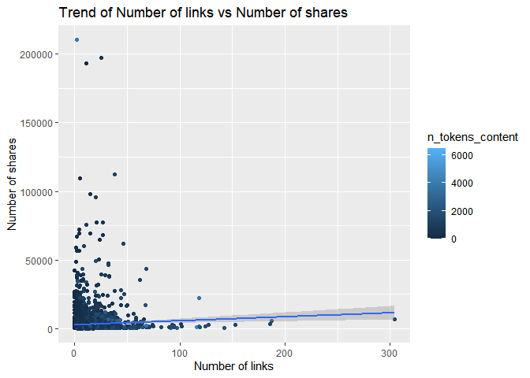
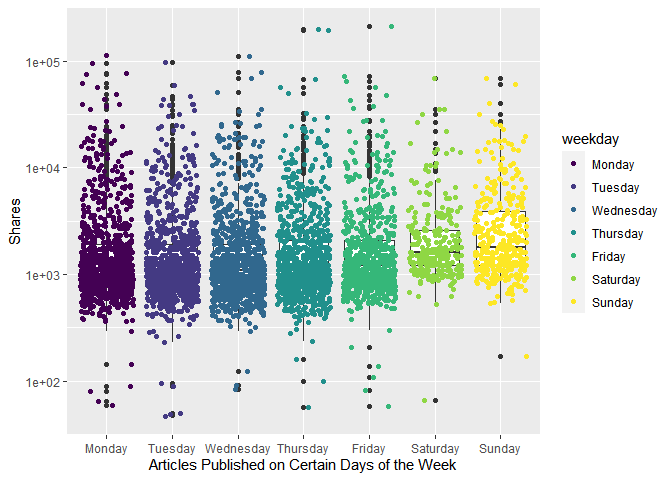

ST558 Project 3 Group F: Entertainment Summary Report
================
Magaritte Nguyen & Matthew Sookoo
2022-11-12

-   <a href="#introduction" id="toc-introduction">Introduction</a>
    -   <a href="#more-about-the-variables"
        id="toc-more-about-the-variables">More about the variables</a>
        -   <a href="#response-variable" id="toc-response-variable">Response
            variable</a>
        -   <a href="#independent-or-predictor-variables"
            id="toc-independent-or-predictor-variables">Independent or predictor
            variables</a>
-   <a href="#required-packages" id="toc-required-packages">Required
    Packages</a>
-   <a href="#data" id="toc-data">Data</a>
    -   <a href="#reading-in-the-data" id="toc-reading-in-the-data">Reading in
        the data</a>
-   <a href="#eda-and-summarizations" id="toc-eda-and-summarizations">EDA
    and Summarizations</a>
-   <a href="#modelling" id="toc-modelling">Modelling</a>
    -   <a href="#first-linear-model" id="toc-first-linear-model">First Linear
        Model</a>
    -   <a href="#second-linear-model" id="toc-second-linear-model">Second
        Linear Model</a>
    -   <a href="#random-forest-model" id="toc-random-forest-model">Random
        Forest Model</a>
    -   <a href="#boosted-tree-model" id="toc-boosted-tree-model">Boosted Tree
        Model</a>
-   <a href="#comaprison" id="toc-comaprison">Comaprison</a>

<!-- setup -->

# Introduction

Our goal with this project is to take the data about articles published
by [Mashable](https://www.mashable.com) and create predictive models for
the number of shares in social networks (popularity) then automating our
Markdown reports.

This dataset summarizes a heterogeneous set of features in a period of
two years.

Then we will do an Exploratory Data Analysis (EDA) and summarize the
data and try to predict the number of shares in two linear regression
models, a random forest model, and a boosting model. Lastly we will
compare the four models and declare a winner (the model with the lowest
root mean squared error (RMSE)).

The dataset we will be using is [Online News Popularity Data
Set](https://archive.ics.uci.edu/ml/datasets/Online+News+Popularity).

## More about the variables

The data has 39644 rows of observations and contains 61 variables (58
predictive attributes, 2 non-predictive, 1 goal field) and we are
interested in the number of shares (goal) of the online news.

We only mention the variables we use in our project.

### Response variable

-   “shares” (Number of shares (target))

### Independent or predictor variables

-   “data_channel_is\_\*” (Lifestyle, Entertainment, Business, Social
    Media, Tech, World)

-   “n_tokens_title” (Number of words in the title),

-   “n_tokens_content” (Number of words in the content)

-   “num_imgs” (Number of images)

-   “num_videos” (Number of videos)

-   “is_weekend” (Was the article published on the weekend?)

-   “num_hrefs” (Number of links)

-   “weekday_is_monday” (Was the article published on a Monday?)

-   “weekday_is_tuesday” (Was the article published on a Tuesday?)

-   “weekday_is_wednesday” (Was the article published on a Wednesday?)

-   “weekday_is_thursday” (Was the article published on a Thursday?)

-   “weekday_is_friday” (Was the article published on a Friday?)

-   “self_reference_avg_sharess” (Avg. shares of referenced articles in
    Mashable)

# Required Packages

The following packages are used for our data manipulation, prediction,
etc.:

-   `tidyverse`: Tons of useful features for data manipulation and
    visualization!
-   `caret` : Used for predictive modelling.
-   `shiny` : makes it easy to build interactive web apps straight from
    R
-   `rmarkdown`: create dynamic analysis documents that combine codes
    and rendered output
-   `corrplot` : provides a visual exploratory tool on correlation
    matrix

<!-- packages that we installed and are calling via library() function -->

# Data

## Reading in the data

Firstly, we set up a relative path and read in the
OnlineNewsPopularity.csv data file found
[here](https://archive.ics.uci.edu/ml/datasets/Online+News+Popularity)
using `read_csv()`.

For this channel, we will subset the data using the
data_channel_is_entertainment: Is data channel ‘Entertainment’?
variable.

<!-- read in the data  -->

``` r
#check working directory
getwd()
```

    ## [1] "D:/ST558/Project 3/ST558_Project3_GroupF"

``` r
#read in data set .csv file in full
#make sure that this is a relative path used
# ./ stays in the same file directory
OnlineNewsPopularity<-read_csv("./OnlineNewsPopularity.csv", show_col_types = FALSE)
#call object OnlineNewsPopularity - our full raw data
OnlineNewsPopularity
```

    ## # A tibble: 39,644 × 61
    ##    url      timed…¹ n_tok…² n_tok…³ n_uni…⁴ n_non…⁵ n_non…⁶ num_h…⁷ num_s…⁸ num_i…⁹ num_v…˟
    ##    <chr>      <dbl>   <dbl>   <dbl>   <dbl>   <dbl>   <dbl>   <dbl>   <dbl>   <dbl>   <dbl>
    ##  1 http://…     731      12     219   0.664    1.00   0.815       4       2       1       0
    ##  2 http://…     731       9     255   0.605    1.00   0.792       3       1       1       0
    ##  3 http://…     731       9     211   0.575    1.00   0.664       3       1       1       0
    ##  4 http://…     731       9     531   0.504    1.00   0.666       9       0       1       0
    ##  5 http://…     731      13    1072   0.416    1.00   0.541      19      19      20       0
    ##  6 http://…     731      10     370   0.560    1.00   0.698       2       2       0       0
    ##  7 http://…     731       8     960   0.418    1.00   0.550      21      20      20       0
    ##  8 http://…     731      12     989   0.434    1.00   0.572      20      20      20       0
    ##  9 http://…     731      11      97   0.670    1.00   0.837       2       0       0       0
    ## 10 http://…     731      10     231   0.636    1.00   0.797       4       1       1       1
    ## # … with 39,634 more rows, 50 more variables: average_token_length <dbl>,
    ## #   num_keywords <dbl>, data_channel_is_lifestyle <dbl>,
    ## #   data_channel_is_entertainment <dbl>, data_channel_is_bus <dbl>,
    ## #   data_channel_is_socmed <dbl>, data_channel_is_tech <dbl>, data_channel_is_world <dbl>,
    ## #   kw_min_min <dbl>, kw_max_min <dbl>, kw_avg_min <dbl>, kw_min_max <dbl>,
    ## #   kw_max_max <dbl>, kw_avg_max <dbl>, kw_min_avg <dbl>, kw_max_avg <dbl>,
    ## #   kw_avg_avg <dbl>, self_reference_min_shares <dbl>, self_reference_max_shares <dbl>, …

We now subset the data for the data channel of interest: Entertainment.

``` r
#subsetting the OnlineNewsPopularity full raw data for the data channel of interest 
Channel <- OnlineNewsPopularity %>% 
               filter(get(params$channel) == 1) %>%
               # removing non-predictive variables per data set description
                select( ! c(url, timedelta ) )

#calling the Channel object to view
Channel
```

    ## # A tibble: 7,057 × 59
    ##    n_toke…¹ n_tok…² n_uni…³ n_non…⁴ n_non…⁵ num_h…⁶ num_s…⁷ num_i…⁸ num_v…⁹ avera…˟ num_k…˟
    ##       <dbl>   <dbl>   <dbl>   <dbl>   <dbl>   <dbl>   <dbl>   <dbl>   <dbl>   <dbl>   <dbl>
    ##  1       12     219   0.664    1.00   0.815       4       2       1       0    4.68       5
    ##  2        9     531   0.504    1.00   0.666       9       0       1       0    4.40       7
    ##  3       14     194   0.765    1.00   0.840       4       4       0       1    4.52       6
    ##  4       12     161   0.669    1.00   0.752       5       4       0       6    4.45      10
    ##  5       11     454   0.566    1.00   0.755       5       3       1       0    4.89       6
    ##  6       12     177   0.741    1.00   0.823       4       3       1       0    5.06       9
    ##  7        5     356   0.618    1.00   0.766       3       3      12       1    4.47      10
    ##  8       11     281   0.611    1.00   0.766       5       4       1       0    4.61       4
    ##  9       10     909   0.450    1.00   0.670       3       2       1       1    4.34       5
    ## 10       10     413   0.606    1.00   0.729       6       1      13       0    4.70       6
    ## # … with 7,047 more rows, 48 more variables: data_channel_is_lifestyle <dbl>,
    ## #   data_channel_is_entertainment <dbl>, data_channel_is_bus <dbl>,
    ## #   data_channel_is_socmed <dbl>, data_channel_is_tech <dbl>, data_channel_is_world <dbl>,
    ## #   kw_min_min <dbl>, kw_max_min <dbl>, kw_avg_min <dbl>, kw_min_max <dbl>,
    ## #   kw_max_max <dbl>, kw_avg_max <dbl>, kw_min_avg <dbl>, kw_max_avg <dbl>,
    ## #   kw_avg_avg <dbl>, self_reference_min_shares <dbl>, self_reference_max_shares <dbl>,
    ## #   self_reference_avg_sharess <dbl>, weekday_is_monday <dbl>, weekday_is_tuesday <dbl>, …

Here we can see that after subsetting for the
Data_channel_is_entertainment variable, that we have 59 observations.

# EDA and Summarizations

Now we split the Channel data set that we’ve created into a 70% training
data set called “ChannelTrain” and a 30% testing data set called
“ChannelTest”. We will be using the `caret` package with p = 0.7 to
achieve the 70% training and 30% testing split.

Note: A seed was set for reproducibility purposes.

<!-- splitting into train and test data  -->

``` r
#seed is set for reproducibility 
set.seed(123)

#indices to split on
ChannelIndex <- createDataPartition(Channel$shares, p = 0.70, list = FALSE)

#subset
ChannelTrain <- Channel[ ChannelIndex, ]
ChannelTest  <- Channel[-ChannelIndex, ]
```

We begin by doing some Exploratory Data Analysis (EDA) below. It should
be noted that for the following EDA and summaries are being performed on
our training data set – `ChannelTrain`.

Let’s begin by plotting the correlation between a few notable numeric
variables.

``` r
#performing correlations between variables of interest
cor_mat <- cor(ChannelTrain %>% 
                 select(shares, n_tokens_title, n_tokens_content, num_imgs,
                        num_videos, num_hrefs), method = "pearson")

#correlation plot below
corrplot(cor_mat, 
         hc.order = TRUE,
         type = "lower",
         tl.pos = "lt",
         title = "Correlation Coefficients plot",
         subtitle = "Correlation Coefficients plot",
         mar=c(0,0,2,0)
         )
```

<!-- -->

From the above plot, if we do not see large blue or red circles in the
plot, then we will note that none of our selected variables appear to
share any meaningful correlation.

Next, lets create a few scatter plots to get a better visual of this
correlation.

We start by examining the following:

-   Trend of Number of words in the content vs. Number of shares

-   Trend of Number of images vs. Number of shares

-   Trend of Number of videos vs. Number of shares

-   Trend of Number of links vs. Number of shares.

<!-- plot 1 -->

``` r
ggplot(data = ChannelTrain, aes(y = shares, x = n_tokens_content)) +
       geom_point(aes(color = num_imgs)) +
       geom_smooth(method = "lm") +
       ggtitle("Trend of Number of words in the content vs Number of shares")+
       labs(x = "Number of words in the content" , y = "Number of shares")
```

<!-- -->

<!-- plot 2 -->

``` r
ggplot(data = ChannelTrain, aes(y = shares, x = num_imgs)) +
       geom_point(aes(color = n_tokens_content)) +
       geom_smooth(method = "lm") +
       ggtitle("Trend of Number of images vs Number of shares")+
       labs(x = "Number of images" , y = "Number of shares")
```

<!-- -->

<!-- plot 3 -->

``` r
ggplot(data = ChannelTrain, aes(y = shares, x = num_videos)) +
       geom_point(aes(color = n_tokens_content)) +
       geom_smooth(method = "lm") +
       ggtitle("Trend of Number of videos vs Number of shares")+
       labs(x = "Number of videos" , y = "Number of shares")
```

<!-- -->

<!-- plot 4 -->

``` r
ggplot(data = ChannelTrain, aes(y = shares, x = num_hrefs)) +
       geom_point(aes(color = n_tokens_content)) +
       geom_smooth(method = "lm") +
       ggtitle("Trend of Number of links vs Number of shares")+
       labs(x = "Number of links" , y = "Number of shares")
```

<!-- -->

<!-- plot 5 -->

``` r
ggplot(data = ChannelTrain, aes(y = num_imgs, x = n_tokens_content)) +
       geom_point(aes(color = shares)) +
       geom_smooth(method = "lm") +
       ggtitle("Trend of Number of words in the content vs Number of images")+
       labs(x = "Number of words in the content" , y = "Number of images")
```

<!-- -->

From the plots above, if we observe a trend line that is more horizontal
and has no noticeable slope, then we can say that there is not a strong
correlation between our variables of interest. If there is a noticeable
slope in our trend line, then depending on the direction it is pointing,
we will have a positive (form left to right, the line slopes upwards) or
negative (form left to right, the line slopes downwards) correlation.

Next lets calculate some summary statistics about the Entertainment
data.

The following tibble shows the mean and standard deviation statistics
concerning training data for a number of variables.

``` r
meanSD1 <- tibble(Variable = c("Number of shares"), 
                  Mean = c(mean(ChannelTrain$shares)), 
                  std_dev = c(sd(ChannelTrain$shares)))

meanSD2 <- tibble(Variable = c("Number of words in the title"), 
                  Mean = c(mean(ChannelTrain$n_tokens_title)), 
                  std_dev = c(sd(ChannelTrain$n_tokens_title)))

meanSD3 <- tibble(Variable = c("Number of words in the content"), 
                  Mean = c(mean(ChannelTrain$n_tokens_content)), 
                  std_dev = c(sd(ChannelTrain$n_tokens_content)))

meanSD4 <- tibble(Variable = c("Number of images"), 
                  Mean = c(mean(ChannelTrain$num_imgs)), 
                  std_dev = c(sd(ChannelTrain$num_imgs)))

meanSD5 <- tibble(Variable = c("Number of videos"), 
                  Mean = c(mean(ChannelTrain$num_videos)), 
                  std_dev = c(sd(ChannelTrain$num_videos)))

#tibble of our summary statistics
rbind(meanSD1, meanSD2, meanSD3, meanSD4, meanSD5)
```

    ## # A tibble: 5 × 3
    ##   Variable                          Mean std_dev
    ##   <chr>                            <dbl>   <dbl>
    ## 1 Number of shares               2958.   8041.  
    ## 2 Number of words in the title     11.0     2.08
    ## 3 Number of words in the content  612.    535.  
    ## 4 Number of images                  6.24   11.6 
    ## 5 Number of videos                  2.55    6.17

Next, we use the `summary()` function on some more of our variables of
interest to get statistics.

``` r
#weekday_is_monday: Was the article published on a Monday?
summary(ChannelTrain$weekday_is_monday)
```

    ##    Min. 1st Qu.  Median    Mean 3rd Qu.    Max. 
    ##  0.0000  0.0000  0.0000  0.1872  0.0000  1.0000

``` r
#weekday_is_tuesday: Was the article published on a Tuesday?
summary(ChannelTrain$weekday_is_tuesday)
```

    ##    Min. 1st Qu.  Median    Mean 3rd Qu.    Max. 
    ##  0.0000  0.0000  0.0000  0.1852  0.0000  1.0000

``` r
#weekday_is_wednesday: Was the article published on a Wednesday?
summary(ChannelTrain$weekday_is_wednesday)
```

    ##    Min. 1st Qu.  Median    Mean 3rd Qu.    Max. 
    ##   0.000   0.000   0.000   0.187   0.000   1.000

``` r
#weekday_is_thursday: Was the article published on a Thursday?
summary(ChannelTrain$weekday_is_thursday)
```

    ##    Min. 1st Qu.  Median    Mean 3rd Qu.    Max. 
    ##  0.0000  0.0000  0.0000  0.1759  0.0000  1.0000

``` r
#weekday_is_friday: Was the article published on a Friday?
summary(ChannelTrain$weekday_is_friday)
```

    ##    Min. 1st Qu.  Median    Mean 3rd Qu.    Max. 
    ##   0.000   0.000   0.000   0.137   0.000   1.000

``` r
#weekday_is_saturday: Was the article published on a Saturday?
summary(ChannelTrain$weekday_is_saturday)
```

    ##    Min. 1st Qu.  Median    Mean 3rd Qu.    Max. 
    ## 0.00000 0.00000 0.00000 0.05485 0.00000 1.00000

``` r
#weekday_is_sunday: Was the article published on a Sunday?
summary(ChannelTrain$weekday_is_sunday)
```

    ##    Min. 1st Qu.  Median    Mean 3rd Qu.    Max. 
    ## 0.00000 0.00000 0.00000 0.07286 0.00000 1.00000

``` r
#is_weekend: Was the article published on the weekend? 
summary(ChannelTrain$is_weekend)
```

    ##    Min. 1st Qu.  Median    Mean 3rd Qu.    Max. 
    ##  0.0000  0.0000  0.0000  0.1277  0.0000  1.0000

``` r
#shares: Number of shares (target)
summary(ChannelTrain$shares)
```

    ##    Min. 1st Qu.  Median    Mean 3rd Qu.    Max. 
    ##      47     833    1200    2958    2100  210300

Next we create some contingency tables for Entertainment.

``` r
weekend <- table(ChannelTrain$is_weekend)
weekend
```

    ## 
    ##    0    1 
    ## 4310  631

The above table shows that for our training data, 631 online news
articles were published during the weekend and 4310 were published
during the week.

``` r
mon_tue <- table(ChannelTrain$weekday_is_monday, ChannelTrain$weekday_is_tuesday)
mon_tue
```

    ##    
    ##        0    1
    ##   0 3101  915
    ##   1  925    0

From the above table we see that for our training data, 925 online news
articles were published on a Monday, 915 were published on a Tuesday and
3101 were published the rest of the week.

Since Monday is considered the beginning of the work week, it is
interesting to see how Monday publications “stack up” in comparison to
the other days of the week. For the contingency tables below, we can use
a similar interpretation as we did for the previous table.

``` r
table(ChannelTrain$weekday_is_monday, ChannelTrain$weekday_is_wednesday)
```

    ##    
    ##        0    1
    ##   0 3092  924
    ##   1  925    0

``` r
table(ChannelTrain$weekday_is_monday, ChannelTrain$weekday_is_thursday)
```

    ##    
    ##        0    1
    ##   0 3147  869
    ##   1  925    0

``` r
table(ChannelTrain$weekday_is_monday, ChannelTrain$weekday_is_friday)
```

    ##    
    ##        0    1
    ##   0 3339  677
    ##   1  925    0

``` r
table(ChannelTrain$weekday_is_monday, ChannelTrain$weekday_is_saturday)
```

    ##    
    ##        0    1
    ##   0 3745  271
    ##   1  925    0

``` r
table(ChannelTrain$weekday_is_monday, ChannelTrain$weekday_is_sunday)
```

    ##    
    ##        0    1
    ##   0 3656  360
    ##   1  925    0

Next, let us examine the number of publications for the different days
of the week using a contingency table and a bar plot.

``` r
#manipulating/mutating the variables to create one weekday_weekend variable
plot_data_weekday_weekend <- ChannelTrain %>%
                               mutate ( weekday = case_when(
                                          weekday_is_monday    == 1 ~ "Monday"   ,
                                          weekday_is_tuesday   == 1 ~ "Tuesday"  ,
                                          weekday_is_wednesday == 1 ~ "Wednesday",
                                          weekday_is_thursday  == 1 ~ "Thursday" ,
                                          weekday_is_friday    == 1 ~ "Friday"   ,
                                          weekday_is_saturday  == 1 ~ "Saturday" ,
                                          weekday_is_sunday    == 1 ~ "Sunday"   ,
                                          TRUE ~ NA_character_
                                      ),
                                        weekday = factor(
                                          x = weekday,
                                          levels = c("Monday", "Tuesday",
                                                     "Wednesday",
                                                     "Thursday", "Friday",
                                                     "Saturday",
                                                     "Sunday"),
                                          ordered = TRUE
                                          ) )
#contingency table - Monday through Sunday
table(plot_data_weekday_weekend$weekday)
```

    ## 
    ##    Monday   Tuesday Wednesday  Thursday    Friday  Saturday    Sunday 
    ##       925       915       924       869       677       271       360

``` r
#bar plot 
ggplot(data = plot_data_weekday_weekend, aes(x = weekday)) + 
       geom_bar(aes(fill= weekday)) + 
       ggtitle("Number of Publication During the Week") +
       labs(x="Weekday", y="Shares")
```

<!-- -->

The highest value in the contingency table and the highest bar in the
bar plot, above, will indicate the day of the week in which the most
articles were published and vice versa.

Next we create some scatter plots with box plots overlaid to better
visualize the distribution of our data.

Note: Here we had to take the log of the data to better visualize it /
it is visually more intuitive with this transformation; otherwise, it
would be too small to see anything meaningful.

``` r
#A scatter plot with boxplots
ggplot(data=plot_data_weekday_weekend, 
            aes(y=shares, x=weekday)) + 
            labs(x="Articles Published on Certain Days of the Week", y="Shares") +
            geom_boxplot() + scale_y_log10() +
            geom_point(aes(color=weekday), position="jitter") 
```

<!-- -->

This side by side scatter and box plot shows the distribution of the
number of shares on the y-axis and the days of the week in which a
article was published on the x-axis. We are able to roughly see the
minimum, maximum, first and third quadrilles, as well as where the
median lies. This will help us spot any outliers or influential points
that we can further investigate with other plotting tools.

Next, we break the scatter and box plots down by day and look at whether
or not a article was shared on the day they were published or not.

``` r
#weekday_is_monday: Was the article published on a Monday?
ggplot(data=ChannelTrain %>% 
            mutate(weekday_fctr = factor(x=weekday_is_monday,  
            levels=c(0,1), labels = c("No", "Yes"))), 
            aes(y=shares, x=weekday_fctr)) + 
            labs(x="Articles Published on Monday", y="Shares", 
                 color = "Published") +
            geom_boxplot() + scale_y_log10() +
            geom_point(aes(color=weekday_fctr), position="jitter", alpha=0.4) 
```

<!-- -->

``` r
#weekday_is_tuesday: Was the article published on a Tuesday
ggplot(data=ChannelTrain %>% 
            mutate(weekday_fctr = factor(x=weekday_is_tuesday,  
            levels=c(0,1), labels = c("No", "Yes"))), 
            aes(y=shares, x=weekday_fctr)) + 
            labs(x="Articles Published on Tuesday", y="Shares", 
                 color = "Published") +
            geom_boxplot() + scale_y_log10() +
            geom_point(aes(color=weekday_fctr), position="jitter", alpha=0.4) 
```

<!-- -->

``` r
#weekday_is_wednesday: Was the article published on a Wednesday?
ggplot(data=ChannelTrain %>% 
            mutate(weekday_fctr = factor(x=weekday_is_wednesday,  
            levels=c(0,1), labels = c("No", "Yes"))), 
            aes(y=shares, x=weekday_fctr)) + 
            labs(x="Articles Published on Wednesday", y="Shares", 
                 color = "Published") +
            geom_boxplot() + scale_y_log10() +
            geom_point(aes(color=weekday_fctr), position="jitter", alpha=0.4) 
```

<!-- -->

``` r
#weekday_is_thursday: Was the article published on a Thursday?
ggplot(data=ChannelTrain %>% 
            mutate(weekday_fctr = factor(x=weekday_is_thursday,  
            levels=c(0,1), labels = c("No", "Yes"))), 
            aes(y=shares, x=weekday_fctr)) + 
            labs(x="Articles Published on Thursday", y="Shares", 
                 color = "Published") +
            geom_boxplot() + scale_y_log10() +
            geom_point(aes(color=weekday_fctr), position="jitter", alpha=0.4) 
```

<!-- -->

``` r
#weekday_is_friday: Was the article published on a Friday?
ggplot(data=ChannelTrain %>% 
            mutate(weekday_fctr = factor(x=weekday_is_friday,  
            levels=c(0,1), labels = c("No", "Yes"))), 
            aes(y=shares, x=weekday_fctr)) + 
            labs(x="Articles Published on Friday", y="Shares", 
                 color = "Published") +
            geom_boxplot() + scale_y_log10() +
            geom_point(aes(color=weekday_fctr), position="jitter", alpha=0.4) 
```

<!-- -->

``` r
#weekday_is_saturday: Was the article published on a Saturday?
ggplot(data=ChannelTrain %>% 
            mutate(weekday_fctr = factor(x=weekday_is_saturday,  
            levels=c(0,1), labels = c("No", "Yes"))), 
            aes(y=shares, x=weekday_fctr)) + 
            labs(x="Articles Published on Saturday", y="Shares", 
                 color = "Published") +
            geom_boxplot() + scale_y_log10() +
            geom_point(aes(color=weekday_fctr), position="jitter", alpha=0.4) 
```

<!-- -->

``` r
#weekday_is_sunday: Was the article published on a Sunday?
ggplot(data=ChannelTrain %>% 
            mutate(weekday_fctr = factor(x=weekday_is_sunday,  
            levels=c(0,1), labels = c("No", "Yes"))), 
            aes(y=shares, x=weekday_fctr)) + 
            labs(x="Articles Published on Sunday", y="Shares", 
                 color = "Published") +
            geom_boxplot() + scale_y_log10() +
            geom_point(aes(color=weekday_fctr), position="jitter", alpha=0.4) 
```

<!-- -->

We can inspect the trend of shares as a function of the different days
of the week that the articles are published.

If you see a presence of outliers, this may cause the mean to shift in
that direction, but the median will not be effected as much. If you see
that the median is not centered within the box, then there is a presence
of skewness in that particular direction. Also, if you see that there
are more observations / dots on one graph while comparing the
publication status (Yes/No), this is meaningful within the plot itself
and also across the different days of the week.

# Modelling

The data is already split into 70% training and 30% test. Our main goal
is to predict the number of shares. This will be our response variable.
We will create four models each using 5-fold cross-validation.

Two models will be multiple linear regression models, one will be a
random forest model, and the final model will be a boosted tree model.
We will then compare the models and declare a winner based on the model
with the lowest (Root Mean Squared Error (RMSE) ) .

We firstly give a brief explanation of a linear regression model.

Linear regression is a supervised learning technique that uses a linear
approach for modelling the relationship between a scalar response
(dependent variable) and one or more predictor variables (independent
variables).

In the case of one predictor variable, this is called a simple linear
regression and in the case where there are more than one predictor
variables, this is called multiple linear regression.

Linear regression models are fitted to the data by minimizing the sum of
squared residuals.

## First Linear Model

For this first model, we will model the number of shares using multiple
linear regression, then summarize, and predict on the testing data
called ‘ChannelTest’. and use the `postResample()` function to get
useful metrics.

The selected independent variables for this model are:

-   “n_tokens_title” (Number of words in the title),

-   “n_tokens_content” (Number of words in the content)

-   “num_imgs” (Number of images) : we use the square of this variable

-   “num_videos” (Number of videos) : we use the square of this variable

-   “is_weekend” (Was the article published on the weekend?)

``` r
#linear regression model 1
l_m1 <- train(shares ~ n_tokens_title +  n_tokens_content + I(num_imgs^2) +
                       I(num_videos^2) + is_weekend, 
              data = ChannelTrain, 
              method = "lm", 
              preProcess = c("center", "scale"),
              trControl = trainControl(method= "cv", number = 5))
#calling the l_m1 object
l_m1
```

    ## Linear Regression 
    ## 
    ## 4941 samples
    ##    5 predictor
    ## 
    ## Pre-processing: centered (5), scaled (5) 
    ## Resampling: Cross-Validated (5 fold) 
    ## Summary of sample sizes: 3953, 3952, 3953, 3953, 3953 
    ## Resampling results:
    ## 
    ##   RMSE      Rsquared      MAE     
    ##   7668.378  0.0006404891  2927.351
    ## 
    ## Tuning parameter 'intercept' was held constant at a value of TRUE

``` r
#summary statistics
summary(l_m1)
```

    ## 
    ## Call:
    ## lm(formula = .outcome ~ ., data = dat)
    ## 
    ## Residuals:
    ##    Min     1Q Median     3Q    Max 
    ##  -4255  -2095  -1747   -841 206323 
    ## 
    ## Coefficients:
    ##                   Estimate Std. Error t value Pr(>|t|)    
    ## (Intercept)       2958.344    114.344  25.872   <2e-16 ***
    ## n_tokens_title      -5.051    114.567  -0.044    0.965    
    ## n_tokens_content   182.495    127.944   1.426    0.154    
    ## `I(num_imgs^2)`     -1.084    125.509  -0.009    0.993    
    ## `I(num_videos^2)` -127.754    117.582  -1.087    0.277    
    ## is_weekend         262.500    114.561   2.291    0.022 *  
    ## ---
    ## Signif. codes:  0 '***' 0.001 '**' 0.01 '*' 0.05 '.' 0.1 ' ' 1
    ## 
    ## Residual standard error: 8037 on 4935 degrees of freedom
    ## Multiple R-squared:  0.00176,    Adjusted R-squared:  0.0007485 
    ## F-statistic:  1.74 on 5 and 4935 DF,  p-value: 0.1218

``` r
#predicting on the ChannelTest data with linear regression model 1
test_pred_l_m1 <- predict(l_m1, newdata = ChannelTest)

#best model chosen - RMSE reported explicitly
#goal is to compare RMSE and see which one is the lowest!
m1 <- postResample(test_pred_l_m1, ChannelTest$shares)
#output object m1
m1
```

    ##         RMSE     Rsquared          MAE 
    ## 7.415586e+03 4.555618e-04 2.958408e+03

## Second Linear Model

For this second model, we will model the number of shares using multiple
linear regression, then summarize, and predict on the testing data
called ‘ChannelTest’. and use the `postResample()` function to get
useful metrics.

The selected independent variables for this model are:

-   “num_hrefs” (Number of links)

-   “weekday_is_monday” (Was the article published on a Monday?)

-   “weekday_is_tuesday” (Was the article published on a Tuesday?)

-   “weekday_is_wednesday” (Was the article published on a Wednesday?)

-   “weekday_is_thursday” (Was the article published on a Thursday?)

-   “weekday_is_friday” (Was the article published on a Friday?)

-   “self_reference_avg_sharess” (Avg. shares of referenced articles in
    Mashable)

``` r
#linear regression model 2
l_m2 <- train(shares ~ num_hrefs + weekday_is_monday + weekday_is_tuesday +
                       weekday_is_wednesday + weekday_is_thursday +
                       weekday_is_friday + self_reference_avg_sharess,
              data = ChannelTrain, 
              method = "lm", 
              preProcess = c("center", "scale"),
              trControl = trainControl(method= "cv", number = 5))
#calling the l_m2 object
l_m2
```

    ## Linear Regression 
    ## 
    ## 4941 samples
    ##    7 predictor
    ## 
    ## Pre-processing: centered (7), scaled (7) 
    ## Resampling: Cross-Validated (5 fold) 
    ## Summary of sample sizes: 3954, 3953, 3951, 3953, 3953 
    ## Resampling results:
    ## 
    ##   RMSE     Rsquared    MAE     
    ##   7924.53  0.00800218  2897.827
    ## 
    ## Tuning parameter 'intercept' was held constant at a value of TRUE

``` r
#summary statistics
summary(l_m2)
```

    ## 
    ## Call:
    ## lm(formula = .outcome ~ ., data = dat)
    ## 
    ## Residuals:
    ##    Min     1Q Median     3Q    Max 
    ## -18114  -2044  -1590   -775 207625 
    ## 
    ## Coefficients:
    ##                            Estimate Std. Error t value Pr(>|t|)    
    ## (Intercept)                  2958.3      114.0  25.960  < 2e-16 ***
    ## num_hrefs                     336.7      114.4   2.944  0.00326 ** 
    ## weekday_is_monday            -229.2      161.4  -1.420  0.15557    
    ## weekday_is_tuesday           -405.4      161.1  -2.517  0.01188 *  
    ## weekday_is_wednesday         -362.7      161.5  -2.245  0.02479 *  
    ## weekday_is_thursday          -223.3      159.6  -1.399  0.16194    
    ## weekday_is_friday            -158.7      152.5  -1.040  0.29819    
    ## self_reference_avg_sharess    566.2      114.2   4.957 7.41e-07 ***
    ## ---
    ## Signif. codes:  0 '***' 0.001 '**' 0.01 '*' 0.05 '.' 0.1 ' ' 1
    ## 
    ## Residual standard error: 8010 on 4933 degrees of freedom
    ## Multiple R-squared:  0.008862,   Adjusted R-squared:  0.007455 
    ## F-statistic: 6.301 on 7 and 4933 DF,  p-value: 2.203e-07

``` r
#predictions based on linear model 2 for the ChannelTest data
test_pred_l_m2 <- predict(l_m2, newdata = ChannelTest)

#best model chosen - RMSE reported explicitly
#goal is to compare RMSE and see which one is the lowest!
m2 <- postResample(test_pred_l_m2, ChannelTest$shares)
#calling m2 object
m2
```

    ##         RMSE     Rsquared          MAE 
    ## 7.350320e+03 1.904407e-02 2.922560e+03

## Random Forest Model

The idea behind the random forest model is the same as bagging, but we
use a random subset of predictors for each bootstrap sample tree fit
(indicated by “mtry”).

More specifically, it involves:

-   creating a boothstrap sample (same size with replacement)
-   training the tree on this sample (no pruning necessary)
-   repeating the process a large number of times and the final
    prediction is the average of those predictions

Finding the average of predictions decreases variance, which improves
predictions, but unfortunately we lose interpretability.

For our random forest, we model the number of shares by the selected
independent variables:

-   “num_hrefs” (Number of links)

-   “n_tokens_content” (Number of words in the content)

-   “num_videos” (Number of videos)

-   “is_weekend” (Was the article published on the weekend?)

``` r
#Random Forrest Model
r_f <- train(shares ~ num_hrefs +  n_tokens_content + num_videos + 
                      is_weekend, data = ChannelTrain, method = "rf",
             trControl=trainControl(method = "cv", number = 5),
             preProcess = c("center", "scale"),
             tuneGrid = data.frame(mtry = 1:3))
#calling r_f object
r_f
```

    ## Random Forest 
    ## 
    ## 4941 samples
    ##    4 predictor
    ## 
    ## Pre-processing: centered (4), scaled (4) 
    ## Resampling: Cross-Validated (5 fold) 
    ## Summary of sample sizes: 3952, 3953, 3954, 3953, 3952 
    ## Resampling results across tuning parameters:
    ## 
    ##   mtry  RMSE      Rsquared     MAE     
    ##   1     7971.421  0.005312812  2914.427
    ##   2     8325.563  0.004314409  3044.293
    ##   3     8562.374  0.003615494  3178.562
    ## 
    ## RMSE was used to select the optimal model using the smallest value.
    ## The final value used for the model was mtry = 1.

``` r
#best model chosen - RMSE reported explicitly
#goal is to compare RMSE and see which one is the lowest!
test_pred_r_f <- predict(r_f, newdata = ChannelTest)
m3 <- postResample(test_pred_r_f, ChannelTest$shares)
#calling m3 object
m3
```

    ##         RMSE     Rsquared          MAE 
    ## 7.446342e+03 3.348018e-03 2.946471e+03

## Boosted Tree Model

The idea behind the boosting tree model is to train our tree slowly in a
sequential manner so each tree that is created will be based on the
previous one with predictions updated.

More formally, boosting (for regression trees) involves:

-   Initializing predictions

-   Finding the residuals

-   Fit a tree with (say) d splits (d+1 terminal nodes) treating the
    residuals as the response

-   Update predictions

-   Update residuals for new prediction and repeat.

For our boosting tree we model the number of shares by the selected
independent variables

-   “num_imgs” (Number of images)

-   “weekday_is_monday” (Was the article published on a Monday?)

-   “weekday_is_tuesday” (Was the article published on a Tuesday?)

-   “weekday_is_wednesday” (Was the article published on a Wednesday?)

-   “weekday_is_thursday” (Was the article published on a Thursday?)

-   “weekday_is_friday” (Was the article published on a Friday?)

-   “self_reference_avg_sharess” (Avg. shares of referenced articles in
    Mashable)

Additionally, we choose to use all combinations of the tuning parameters
n.trees = 50, interaction.depth = 1, shrinkage = 0.1 and n.minobsinnode
= 10.

``` r
#tuning parameters
tune1<- 50
tune2<- 1
tune3<- 0.1
tune4<- 10

#Boosted Tree Model
boosted <- train(shares ~ num_imgs + weekday_is_monday + weekday_is_tuesday +
                          weekday_is_wednesday + weekday_is_thursday +
                          weekday_is_friday + self_reference_avg_sharess, 
           data = ChannelTrain, method = "gbm",
           trControl=trainControl(method = "cv", number = 5),
           preProcess = c("center", "scale"),
           tuneGrid = expand.grid(n.trees = tune1, interaction.depth = tune2,
                                  shrinkage = tune3,    n.minobsinnode = tune4))
```

    ## Iter   TrainDeviance   ValidDeviance   StepSize   Improve
    ##      1 71327755.7088             nan     0.1000 98256.2200
    ##      2 71172023.9150             nan     0.1000 63378.5003
    ##      3 71068473.4678             nan     0.1000 -10771.4183
    ##      4 71003081.6512             nan     0.1000 53819.7990
    ##      5 70953661.6557             nan     0.1000 42063.6613
    ##      6 70887020.6511             nan     0.1000 24217.2394
    ##      7 70838486.7152             nan     0.1000 38419.8051
    ##      8 70774185.2170             nan     0.1000 -28158.9639
    ##      9 70755394.9578             nan     0.1000 -1363.8440
    ##     10 70739581.7321             nan     0.1000 -27914.4452
    ##     20 70475659.9606             nan     0.1000 -7734.1031
    ##     40 70252403.2547             nan     0.1000 -20418.3693
    ##     50 70098253.3588             nan     0.1000 11169.9202
    ## 
    ## Iter   TrainDeviance   ValidDeviance   StepSize   Improve
    ##      1 61350478.6774             nan     0.1000 190689.0663
    ##      2 61212933.1869             nan     0.1000 110180.1506
    ##      3 61033913.3693             nan     0.1000 37783.1760
    ##      4 60903896.7082             nan     0.1000 -26007.2833
    ##      5 60790259.2187             nan     0.1000 85147.2563
    ##      6 60691216.2034             nan     0.1000 86677.5960
    ##      7 60602294.3062             nan     0.1000 64449.5442
    ##      8 60512201.0559             nan     0.1000 29042.0706
    ##      9 60425910.2924             nan     0.1000 63308.4741
    ##     10 60358764.5762             nan     0.1000 -10790.4637
    ##     20 60060348.9710             nan     0.1000 17890.0194
    ##     40 59826858.4823             nan     0.1000 -60739.3985
    ##     50 59726727.3106             nan     0.1000 -13625.0077
    ## 
    ## Iter   TrainDeviance   ValidDeviance   StepSize   Improve
    ##      1 67754320.4612             nan     0.1000 42504.4170
    ##      2 67603764.7975             nan     0.1000 82879.6472
    ##      3 67514035.7794             nan     0.1000 69144.5181
    ##      4 67457900.1644             nan     0.1000 63391.6795
    ##      5 67386476.7333             nan     0.1000 23572.9822
    ##      6 67319846.8261             nan     0.1000 28363.8953
    ##      7 67283823.1783             nan     0.1000 18426.6145
    ##      8 67244995.4146             nan     0.1000 25522.6607
    ##      9 67228316.4027             nan     0.1000 -25024.3234
    ##     10 67191295.8613             nan     0.1000 -9930.2889
    ##     20 66989297.7354             nan     0.1000 -46130.1111
    ##     40 66704155.0391             nan     0.1000 -40378.9929
    ##     50 66594710.8548             nan     0.1000 -32630.0645
    ## 
    ## Iter   TrainDeviance   ValidDeviance   StepSize   Improve
    ##      1 62745886.5566             nan     0.1000 64456.9862
    ##      2 62619814.7522             nan     0.1000 103841.8214
    ##      3 62562932.8340             nan     0.1000 61265.5074
    ##      4 62474480.3325             nan     0.1000 77474.5016
    ##      5 62394433.1723             nan     0.1000 2802.8883
    ##      6 62343200.0558             nan     0.1000 32606.5698
    ##      7 62259536.3594             nan     0.1000 -5001.5211
    ##      8 62197821.4740             nan     0.1000 -38728.3257
    ##      9 62136552.1764             nan     0.1000 27806.5532
    ##     10 62100005.4537             nan     0.1000 -6467.4747
    ##     20 61879810.4663             nan     0.1000 2588.2594
    ##     40 61597473.4568             nan     0.1000 17905.4495
    ##     50 61508212.4608             nan     0.1000 -3146.4170
    ## 
    ## Iter   TrainDeviance   ValidDeviance   StepSize   Improve
    ##      1 59422606.7104             nan     0.1000 112151.2636
    ##      2 59292076.4938             nan     0.1000 114553.3083
    ##      3 59214904.3262             nan     0.1000 92684.9321
    ##      4 59101981.7494             nan     0.1000 84179.0042
    ##      5 58987446.3664             nan     0.1000 106212.8789
    ##      6 58887920.4501             nan     0.1000 74442.4375
    ##      7 58791364.7065             nan     0.1000 -20644.7639
    ##      8 58711655.9454             nan     0.1000 24886.8538
    ##      9 58668040.5424             nan     0.1000 31963.1369
    ##     10 58614522.3764             nan     0.1000 45584.3867
    ##     20 58374906.6161             nan     0.1000 24855.2571
    ##     40 58042154.6108             nan     0.1000 -47440.6955
    ##     50 57904112.9920             nan     0.1000 -82493.1062
    ## 
    ## Iter   TrainDeviance   ValidDeviance   StepSize   Improve
    ##      1 64534427.8163             nan     0.1000 100629.1311
    ##      2 64404798.2433             nan     0.1000 119482.1052
    ##      3 64301303.5703             nan     0.1000 81199.8937
    ##      4 64162844.8102             nan     0.1000 1952.6399
    ##      5 64091916.9849             nan     0.1000 70945.0312
    ##      6 64021694.0078             nan     0.1000 52681.4098
    ##      7 63954361.1847             nan     0.1000 26052.0968
    ##      8 63905610.6616             nan     0.1000 40300.2233
    ##      9 63863733.1687             nan     0.1000 13097.3258
    ##     10 63813363.8932             nan     0.1000 -27412.6310
    ##     20 63612903.8993             nan     0.1000  185.9144
    ##     40 63374141.7454             nan     0.1000 -30884.9374
    ##     50 63276111.1436             nan     0.1000 -14994.0781

``` r
#calling boosted object
boosted
```

    ## Stochastic Gradient Boosting 
    ## 
    ## 4941 samples
    ##    7 predictor
    ## 
    ## Pre-processing: centered (7), scaled (7) 
    ## Resampling: Cross-Validated (5 fold) 
    ## Summary of sample sizes: 3952, 3953, 3954, 3953, 3952 
    ## Resampling results:
    ## 
    ##   RMSE      Rsquared    MAE     
    ##   7918.023  0.01713936  2891.272
    ## 
    ## Tuning parameter 'n.trees' was held constant at a value of 50
    ## Tuning
    ##  parameter 'shrinkage' was held constant at a value of 0.1
    ## Tuning
    ##  parameter 'n.minobsinnode' was held constant at a value of 10

``` r
#best model chosen - RMSE reported explicitly
#goal is to compare RMSE and see which one is the lowest!
test_pred_boosted <- predict(boosted, newdata = ChannelTest)
m4 <- postResample(test_pred_boosted, ChannelTest$shares)
#calling m4 object
m4
```

    ##         RMSE     Rsquared          MAE 
    ## 7.311456e+03 2.839576e-02 2.923627e+03

Next we do a comparison of the four models

# Comaprison

The `postResample()` function was used to calculate useful statistics
such as RMSE and R squared values for each one of the four models. We
summarize them in the tibble below.

``` r
#creating tibble with RMSE and R-squared values
lm1 <- tibble(model = c("First Linear Regression"), RMSE = c(m1[[1]]), R2 = c(m1[[2]]))

lm2 <- tibble(model = c("Second Linear Regression"), RMSE = c(m2[[1]]), R2 = c(m2[[2]]))

rf <- tibble(model = c("Random Forest"), RMSE = c(m3[[1]]), R2 = c(m3[[2]]))

Bos <- tibble(model = c("Boosting"), RMSE = c(m4[[1]]), R2 = c(m4[[2]]))

#creating tibble for all results for the 4 models
RMSE_table <- rbind(lm1, lm2, rf, Bos)
RMSE_table
```

    ## # A tibble: 4 × 3
    ##   model                     RMSE       R2
    ##   <chr>                    <dbl>    <dbl>
    ## 1 First Linear Regression  7416. 0.000456
    ## 2 Second Linear Regression 7350. 0.0190  
    ## 3 Random Forest            7446. 0.00335 
    ## 4 Boosting                 7311. 0.0284

RMSE is a metric that tells us how far apart the predicted values are
from the observed values in a dataset, on average. The lower the RMSE,
the better a model fits a dataset.

As for the R2 value we have (R-squared), this is a metric that indicates
the proportion of the variance in the response variable of a regression
model that can be explained by the predictor variables. The higher the
R2 value, the better a model fits a dataset. This value ranges from 0 to
1.

It should be noted that our best model is selected from a model that has
results reflecting the lowest RMSE and the highest R2 value. But, there
are times when the results from the lowest RMSE and highest R2 are not
from the same model; therefore, we will use RMSE to pick our final
winner.

``` r
#pick the smallest RMSE for the best model
final_result <- RMSE_table %>%
                filter ( min(RMSE) == RMSE )
final_result
```

    ## # A tibble: 1 × 3
    ##   model     RMSE     R2
    ##   <chr>    <dbl>  <dbl>
    ## 1 Boosting 7311. 0.0284

When comparing all 4 of our models, we are looking for the smallest
value of RMSE to tell us which model is the best. In this situation for
the Entertainment channel, we can say that the smallest RMSE value is
7311.4559789 and this value comes from the Boosting model.
