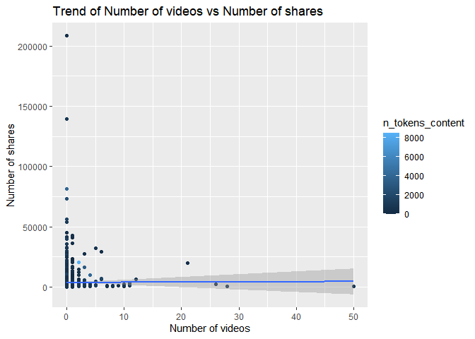

ST558 Project 3 Group F: Lifestyle Summary Report
================
Magaritte Nguyen & Matthew Sookoo
2022-11-12

-   <a href="#introduction" id="toc-introduction">Introduction</a>
    -   <a href="#more-about-the-variables"
        id="toc-more-about-the-variables">More about the variables</a>
        -   <a href="#response-variable" id="toc-response-variable">Response
            variable</a>
        -   <a href="#independent-or-predictor-variables"
            id="toc-independent-or-predictor-variables">Independent or predictor
            variables</a>
-   <a href="#required-packages" id="toc-required-packages">Required
    Packages</a>
-   <a href="#data" id="toc-data">Data</a>
    -   <a href="#reading-in-the-data" id="toc-reading-in-the-data">Reading in
        the data</a>
-   <a href="#eda-and-summarizations" id="toc-eda-and-summarizations">EDA
    and Summarizations</a>
-   <a href="#modelling" id="toc-modelling">Modelling</a>
    -   <a href="#first-linear-model" id="toc-first-linear-model">First Linear
        Model</a>
    -   <a href="#second-linear-model" id="toc-second-linear-model">Second
        Linear Model</a>
    -   <a href="#random-forest-model" id="toc-random-forest-model">Random
        Forest Model</a>
    -   <a href="#boosted-tree-model" id="toc-boosted-tree-model">Boosted Tree
        Model</a>
-   <a href="#comaprison" id="toc-comaprison">Comaprison</a>

<!-- setup -->

# Introduction

Our goal with this project is to take the data about articles published
by [Mashable](https://www.mashable.com) and create predictive models for
the number of shares in social networks (popularity) then automating our
Markdown reports.

This dataset summarizes a heterogeneous set of features in a period of
two years.

Then we will do an Exploratory Data Analysis (EDA) and summarize the
data and try to predict the number of shares in two linear regression
models, a random forest model, and a boosting model. Lastly we will
compare the four models and declare a winner (the model with the lowest
root mean squared error (RMSE)).

The dataset we will be using is [Online News Popularity Data
Set](https://archive.ics.uci.edu/ml/datasets/Online+News+Popularity).

## More about the variables

The data has 39644 rows of observations and contains 61 variables (58
predictive attributes, 2 non-predictive, 1 goal field) and we are
interested in the number of shares (goal) of the online news.

We only mention the variables we use in our project.

### Response variable

-   “shares” (Number of shares (target))

### Independent or predictor variables

-   “data_channel_is\_\*” (Lifestyle, Entertainment, Business, Social
    Media, Tech, World)

-   “n_tokens_title” (Number of words in the title),

-   “n_tokens_content” (Number of words in the content)

-   “num_imgs” (Number of images)

-   “num_videos” (Number of videos)

-   “is_weekend” (Was the article published on the weekend?)

-   “num_hrefs” (Number of links)

-   “weekday_is_monday” (Was the article published on a Monday?)

-   “weekday_is_tuesday” (Was the article published on a Tuesday?)

-   “weekday_is_wednesday” (Was the article published on a Wednesday?)

-   “weekday_is_thursday” (Was the article published on a Thursday?)

-   “weekday_is_friday” (Was the article published on a Friday?)

-   “self_reference_avg_sharess” (Avg. shares of referenced articles in
    Mashable)

# Required Packages

The following packages are used for our data manipulation, prediction,
etc.:

-   `tidyverse`: Tons of useful features for data manipulation and
    visualization!
-   `caret` : Used for predictive modelling.
-   `shiny` : makes it easy to build interactive web apps straight from
    R
-   `rmarkdown`: create dynamic analysis documents that combine codes
    and rendered output
-   `corrplot` : provides a visual exploratory tool on correlation
    matrix

<!-- packages that we installed and are calling via library() function -->

# Data

## Reading in the data

Firstly, we set up a relative path and read in the
OnlineNewsPopularity.csv data file found
[here](https://archive.ics.uci.edu/ml/datasets/Online+News+Popularity)
using `read_csv()`.

For this channel, we will subset the data using the
data_channel_is_lifestyle: Is data channel ‘Lifestyle’? variable.

<!-- read in the data  -->

``` r
#check working directory
getwd()
```

    ## [1] "D:/ST558/Project 3/ST558_Project3_GroupF"

``` r
#read in data set .csv file in full
#make sure that this is a relative path used
# ./ stays in the same file directory
OnlineNewsPopularity<-read_csv("./OnlineNewsPopularity.csv", show_col_types = FALSE)
#call object OnlineNewsPopularity - our full raw data
OnlineNewsPopularity
```

    ## # A tibble: 39,644 × 61
    ##    url      timed…¹ n_tok…² n_tok…³ n_uni…⁴ n_non…⁵ n_non…⁶ num_h…⁷ num_s…⁸ num_i…⁹ num_v…˟
    ##    <chr>      <dbl>   <dbl>   <dbl>   <dbl>   <dbl>   <dbl>   <dbl>   <dbl>   <dbl>   <dbl>
    ##  1 http://…     731      12     219   0.664    1.00   0.815       4       2       1       0
    ##  2 http://…     731       9     255   0.605    1.00   0.792       3       1       1       0
    ##  3 http://…     731       9     211   0.575    1.00   0.664       3       1       1       0
    ##  4 http://…     731       9     531   0.504    1.00   0.666       9       0       1       0
    ##  5 http://…     731      13    1072   0.416    1.00   0.541      19      19      20       0
    ##  6 http://…     731      10     370   0.560    1.00   0.698       2       2       0       0
    ##  7 http://…     731       8     960   0.418    1.00   0.550      21      20      20       0
    ##  8 http://…     731      12     989   0.434    1.00   0.572      20      20      20       0
    ##  9 http://…     731      11      97   0.670    1.00   0.837       2       0       0       0
    ## 10 http://…     731      10     231   0.636    1.00   0.797       4       1       1       1
    ## # … with 39,634 more rows, 50 more variables: average_token_length <dbl>,
    ## #   num_keywords <dbl>, data_channel_is_lifestyle <dbl>,
    ## #   data_channel_is_entertainment <dbl>, data_channel_is_bus <dbl>,
    ## #   data_channel_is_socmed <dbl>, data_channel_is_tech <dbl>, data_channel_is_world <dbl>,
    ## #   kw_min_min <dbl>, kw_max_min <dbl>, kw_avg_min <dbl>, kw_min_max <dbl>,
    ## #   kw_max_max <dbl>, kw_avg_max <dbl>, kw_min_avg <dbl>, kw_max_avg <dbl>,
    ## #   kw_avg_avg <dbl>, self_reference_min_shares <dbl>, self_reference_max_shares <dbl>, …

We now subset the data for the data channel of interest: Lifestyle.

``` r
#subsetting the OnlineNewsPopularity full raw data for the data channel of interest 
Channel <- OnlineNewsPopularity %>% 
               filter(get(params$channel) == 1) %>%
               # removing non-predictive variables per data set description
                select( ! c(url, timedelta ) )

#calling the Channel object to view
Channel
```

    ## # A tibble: 2,099 × 59
    ##    n_toke…¹ n_tok…² n_uni…³ n_non…⁴ n_non…⁵ num_h…⁶ num_s…⁷ num_i…⁸ num_v…⁹ avera…˟ num_k…˟
    ##       <dbl>   <dbl>   <dbl>   <dbl>   <dbl>   <dbl>   <dbl>   <dbl>   <dbl>   <dbl>   <dbl>
    ##  1        8     960   0.418    1.00   0.550      21      20      20       0    4.65      10
    ##  2       10     187   0.667    1.00   0.800       7       0       1       0    4.66       7
    ##  3       11     103   0.689    1.00   0.806       3       1       1       0    4.84       6
    ##  4       10     243   0.619    1.00   0.824       1       1       0       0    4.38      10
    ##  5        8     204   0.586    1.00   0.698       7       2       1       0    4.67       8
    ##  6       11     315   0.551    1.00   0.702       4       4       1       0    4.38      10
    ##  7       10    1190   0.409    1.00   0.561      25      24      20       0    4.62       8
    ##  8        6     374   0.641    1.00   0.828       7       0       1       0    4.91       8
    ##  9       12     499   0.513    1.00   0.662      14       1       1       0    5.08      10
    ## 10       11     223   0.662    1.00   0.826       5       3       0       0    4.55       6
    ## # … with 2,089 more rows, 48 more variables: data_channel_is_lifestyle <dbl>,
    ## #   data_channel_is_entertainment <dbl>, data_channel_is_bus <dbl>,
    ## #   data_channel_is_socmed <dbl>, data_channel_is_tech <dbl>, data_channel_is_world <dbl>,
    ## #   kw_min_min <dbl>, kw_max_min <dbl>, kw_avg_min <dbl>, kw_min_max <dbl>,
    ## #   kw_max_max <dbl>, kw_avg_max <dbl>, kw_min_avg <dbl>, kw_max_avg <dbl>,
    ## #   kw_avg_avg <dbl>, self_reference_min_shares <dbl>, self_reference_max_shares <dbl>,
    ## #   self_reference_avg_sharess <dbl>, weekday_is_monday <dbl>, weekday_is_tuesday <dbl>, …

Here we can see that after subsetting for the Data_channel_is_lifestyle
variable, that we have 2099 observations.

# EDA and Summarizations

Now we split the Channel data set that we’ve created into a 70% training
data set called “ChannelTrain” and a 30% testing data set called
“ChannelTest”. We will be using the `caret` package with p = 0.7 to
achieve the 70% training and 30% testing split.

Note: A seed was set for reproducibility purposes.

<!-- splitting into train and test data  -->

``` r
#seed is set for reproducibility 
set.seed(123)

#indices to split on
ChannelIndex <- createDataPartition(Channel$shares, p = 0.70, list = FALSE)

#subset
ChannelTrain <- Channel[ ChannelIndex, ]
ChannelTest  <- Channel[-ChannelIndex, ]
```

We begin by doing some Exploratory Data Analysis (EDA) below. It should
be noted that for the following EDA and summaries are being performed on
our training data set – `ChannelTrain`.

Let’s begin by plotting the correlation between a few notable numeric
variables.

``` r
#performing correlations between variables of interest
cor_mat <- cor(ChannelTrain %>% 
                 select(shares, n_tokens_title, n_tokens_content, num_imgs,
                        num_videos, num_hrefs), method = "pearson")

#correlation plot below
corrplot(cor_mat, 
         hc.order = TRUE,
         type = "lower",
         tl.pos = "lt",
         title = "Correlation Coefficients plot",
         subtitle = "Correlation Coefficients plot",
         mar=c(0,0,2,0)
         )
```

<!-- -->

From the above plot, if we do not see large blue or red circles in the
plot, then we will note that none of our selected variables appear to
share any meaningful correlation.

Next, lets create a few scatter plots to get a better visual of this
correlation.

We start by examining the following:

-   Trend of Number of words in the content vs. Number of shares

-   Trend of Number of images vs. Number of shares

-   Trend of Number of videos vs. Number of shares

-   Trend of Number of links vs. Number of shares.

<!-- plot 1 -->

``` r
ggplot(data = ChannelTrain, aes(y = shares, x = n_tokens_content)) +
       geom_point(aes(color = num_imgs)) +
       geom_smooth(method = "lm") +
       ggtitle("Trend of Number of words in the content vs Number of shares")+
       labs(x = "Number of words in the content" , y = "Number of shares")
```

<!-- -->

<!-- plot 2 -->

``` r
ggplot(data = ChannelTrain, aes(y = shares, x = num_imgs)) +
       geom_point(aes(color = n_tokens_content)) +
       geom_smooth(method = "lm") +
       ggtitle("Trend of Number of images vs Number of shares")+
       labs(x = "Number of images" , y = "Number of shares")
```

<!-- -->

<!-- plot 3 -->

``` r
ggplot(data = ChannelTrain, aes(y = shares, x = num_videos)) +
       geom_point(aes(color = n_tokens_content)) +
       geom_smooth(method = "lm") +
       ggtitle("Trend of Number of videos vs Number of shares")+
       labs(x = "Number of videos" , y = "Number of shares")
```

<!-- -->

<!-- plot 4 -->

``` r
ggplot(data = ChannelTrain, aes(y = shares, x = num_hrefs)) +
       geom_point(aes(color = n_tokens_content)) +
       geom_smooth(method = "lm") +
       ggtitle("Trend of Number of links vs Number of shares")+
       labs(x = "Number of links" , y = "Number of shares")
```

<!-- -->

<!-- plot 5 -->

``` r
ggplot(data = ChannelTrain, aes(y = num_imgs, x = n_tokens_content)) +
       geom_point(aes(color = shares)) +
       geom_smooth(method = "lm") +
       ggtitle("Trend of Number of words in the content vs Number of images")+
       labs(x = "Number of words in the content" , y = "Number of images")
```

<!-- -->

From the plots above, if we observe a trend line that is more horizontal
and has no noticeable slope, then we can say that there is not a strong
correlation between our variables of interest. If there is a noticeable
slope in our trend line, then depending on the direction it is pointing,
we will have a positive (form left to right, the line slopes upwards) or
negative (form left to right, the line slopes downwards) correlation.

Next lets calculate some summary statistics about the Lifestyle data.

The following tibble shows the mean and standard deviation statistics
concerning training data for a number of variables.

``` r
meanSD1 <- tibble(Variable = c("Number of shares"), 
                  Mean = c(mean(ChannelTrain$shares)), 
                  std_dev = c(sd(ChannelTrain$shares)))

meanSD2 <- tibble(Variable = c("Number of words in the title"), 
                  Mean = c(mean(ChannelTrain$n_tokens_title)), 
                  std_dev = c(sd(ChannelTrain$n_tokens_title)))

meanSD3 <- tibble(Variable = c("Number of words in the content"), 
                  Mean = c(mean(ChannelTrain$n_tokens_content)), 
                  std_dev = c(sd(ChannelTrain$n_tokens_content)))

meanSD4 <- tibble(Variable = c("Number of images"), 
                  Mean = c(mean(ChannelTrain$num_imgs)), 
                  std_dev = c(sd(ChannelTrain$num_imgs)))

meanSD5 <- tibble(Variable = c("Number of videos"), 
                  Mean = c(mean(ChannelTrain$num_videos)), 
                  std_dev = c(sd(ChannelTrain$num_videos)))

#tibble of our summary statistics
rbind(meanSD1, meanSD2, meanSD3, meanSD4, meanSD5)
```

    ## # A tibble: 5 × 3
    ##   Variable                           Mean std_dev
    ##   <chr>                             <dbl>   <dbl>
    ## 1 Number of shares               3737.    8796.  
    ## 2 Number of words in the title      9.76     1.89
    ## 3 Number of words in the content  633.     592.  
    ## 4 Number of images                  5.06     8.71
    ## 5 Number of videos                  0.485    2.08

Next, we use the `summary()` function on some more of our variables of
interest to get statistics.

``` r
#weekday_is_monday: Was the article published on a Monday?
summary(ChannelTrain$weekday_is_monday)
```

    ##    Min. 1st Qu.  Median    Mean 3rd Qu.    Max. 
    ##  0.0000  0.0000  0.0000  0.1508  0.0000  1.0000

``` r
#weekday_is_tuesday: Was the article published on a Tuesday?
summary(ChannelTrain$weekday_is_tuesday)
```

    ##    Min. 1st Qu.  Median    Mean 3rd Qu.    Max. 
    ##   0.000   0.000   0.000   0.163   0.000   1.000

``` r
#weekday_is_wednesday: Was the article published on a Wednesday?
summary(ChannelTrain$weekday_is_wednesday)
```

    ##    Min. 1st Qu.  Median    Mean 3rd Qu.    Max. 
    ##  0.0000  0.0000  0.0000  0.1882  0.0000  1.0000

``` r
#weekday_is_thursday: Was the article published on a Thursday?
summary(ChannelTrain$weekday_is_thursday)
```

    ##    Min. 1st Qu.  Median    Mean 3rd Qu.    Max. 
    ##  0.0000  0.0000  0.0000  0.1651  0.0000  1.0000

``` r
#weekday_is_friday: Was the article published on a Friday?
summary(ChannelTrain$weekday_is_friday)
```

    ##    Min. 1st Qu.  Median    Mean 3rd Qu.    Max. 
    ##  0.0000  0.0000  0.0000  0.1433  0.0000  1.0000

``` r
#weekday_is_saturday: Was the article published on a Saturday?
summary(ChannelTrain$weekday_is_saturday)
```

    ##    Min. 1st Qu.  Median    Mean 3rd Qu.    Max. 
    ##  0.0000  0.0000  0.0000  0.0856  0.0000  1.0000

``` r
#weekday_is_sunday: Was the article published on a Sunday?
summary(ChannelTrain$weekday_is_sunday)
```

    ##    Min. 1st Qu.  Median    Mean 3rd Qu.    Max. 
    ##  0.0000  0.0000  0.0000  0.1039  0.0000  1.0000

``` r
#is_weekend: Was the article published on the weekend? 
summary(ChannelTrain$is_weekend)
```

    ##    Min. 1st Qu.  Median    Mean 3rd Qu.    Max. 
    ##  0.0000  0.0000  0.0000  0.1895  0.0000  1.0000

``` r
#shares: Number of shares (target)
summary(ChannelTrain$shares)
```

    ##    Min. 1st Qu.  Median    Mean 3rd Qu.    Max. 
    ##      78    1100    1700    3737    3225  208300

Next we create some contingency tables for Lifestyle.

``` r
weekend <- table(ChannelTrain$is_weekend)
weekend
```

    ## 
    ##    0    1 
    ## 1193  279

The above table shows that for our training data, 279 online news
articles were published during the weekend and 1193 were published
during the week.

``` r
mon_tue <- table(ChannelTrain$weekday_is_monday, ChannelTrain$weekday_is_tuesday)
mon_tue
```

    ##    
    ##        0    1
    ##   0 1010  240
    ##   1  222    0

From the above table we see that for our training data, 222 online news
articles were published on a Monday, 240 were published on a Tuesday and
1010 were published the rest of the week.

Since Monday is considered the beginning of the work week, it is
interesting to see how Monday publications “stack up” in comparison to
the other days of the week. For the contingency tables below, we can use
a similar interpretation as we did for the previous table.

``` r
table(ChannelTrain$weekday_is_monday, ChannelTrain$weekday_is_wednesday)
```

    ##    
    ##       0   1
    ##   0 973 277
    ##   1 222   0

``` r
table(ChannelTrain$weekday_is_monday, ChannelTrain$weekday_is_thursday)
```

    ##    
    ##        0    1
    ##   0 1007  243
    ##   1  222    0

``` r
table(ChannelTrain$weekday_is_monday, ChannelTrain$weekday_is_friday)
```

    ##    
    ##        0    1
    ##   0 1039  211
    ##   1  222    0

``` r
table(ChannelTrain$weekday_is_monday, ChannelTrain$weekday_is_saturday)
```

    ##    
    ##        0    1
    ##   0 1124  126
    ##   1  222    0

``` r
table(ChannelTrain$weekday_is_monday, ChannelTrain$weekday_is_sunday)
```

    ##    
    ##        0    1
    ##   0 1097  153
    ##   1  222    0

Next, let us examine the number of publications for the different days
of the week using a contingency table and a bar plot.

``` r
#manipulating/mutating the variables to create one weekday_weekend variable
plot_data_weekday_weekend <- ChannelTrain %>%
                               mutate ( weekday = case_when(
                                          weekday_is_monday    == 1 ~ "Monday"   ,
                                          weekday_is_tuesday   == 1 ~ "Tuesday"  ,
                                          weekday_is_wednesday == 1 ~ "Wednesday",
                                          weekday_is_thursday  == 1 ~ "Thursday" ,
                                          weekday_is_friday    == 1 ~ "Friday"   ,
                                          weekday_is_saturday  == 1 ~ "Saturday" ,
                                          weekday_is_sunday    == 1 ~ "Sunday"   ,
                                          TRUE ~ NA_character_
                                      ),
                                        weekday = factor(
                                          x = weekday,
                                          levels = c("Monday", "Tuesday",
                                                     "Wednesday",
                                                     "Thursday", "Friday",
                                                     "Saturday",
                                                     "Sunday"),
                                          ordered = TRUE
                                          ) )
#contingency table - Monday through Sunday
table(plot_data_weekday_weekend$weekday)
```

    ## 
    ##    Monday   Tuesday Wednesday  Thursday    Friday  Saturday    Sunday 
    ##       222       240       277       243       211       126       153

``` r
#bar plot 
ggplot(data = plot_data_weekday_weekend, aes(x = weekday)) + 
       geom_bar(aes(fill= weekday)) + 
       ggtitle("Number of Publication During the Week") +
       labs(x="Weekday", y="Shares")
```

<!-- -->

The highest value in the contingency table and the highest bar in the
bar plot, above, will indicate the day of the week in which the most
articles were published and vice versa.

Next we create some scatter plots with box plots overlaid to better
visualize the distribution of our data.

Note: Here we had to take the log of the data to better visualize it /
it is visually more intuitive with this transformation; otherwise, it
would be too small to see anything meaningful.

``` r
#A scatter plot with boxplots
ggplot(data=plot_data_weekday_weekend, 
            aes(y=shares, x=weekday)) + 
            labs(x="Articles Published on Certain Days of the Week", y="Shares") +
            geom_boxplot() + scale_y_log10() +
            geom_point(aes(color=weekday), position="jitter") 
```

<!-- -->

This side by side scatter and box plot shows the distribution of the
number of shares on the y-axis and the days of the week in which a
article was published on the x-axis. We are able to roughly see the
minimum, maximum, first and third quadrilles, as well as where the
median lies. This will help us spot any outliers or influential points
that we can further investigate with other plotting tools.

Next, we break the scatter and box plots down by day and look at whether
or not a article was shared on the day they were published or not.

``` r
#weekday_is_monday: Was the article published on a Monday?
ggplot(data=ChannelTrain %>% 
            mutate(weekday_fctr = factor(x=weekday_is_monday,  
            levels=c(0,1), labels = c("No", "Yes"))), 
            aes(y=shares, x=weekday_fctr)) + 
            labs(x="Articles Published on Monday", y="Shares", 
                 color = "Published") +
            geom_boxplot() + scale_y_log10() +
            geom_point(aes(color=weekday_fctr), position="jitter", alpha=0.4) 
```

<!-- -->

``` r
#weekday_is_tuesday: Was the article published on a Tuesday
ggplot(data=ChannelTrain %>% 
            mutate(weekday_fctr = factor(x=weekday_is_tuesday,  
            levels=c(0,1), labels = c("No", "Yes"))), 
            aes(y=shares, x=weekday_fctr)) + 
            labs(x="Articles Published on Tuesday", y="Shares", 
                 color = "Published") +
            geom_boxplot() + scale_y_log10() +
            geom_point(aes(color=weekday_fctr), position="jitter", alpha=0.4) 
```

<!-- -->

``` r
#weekday_is_wednesday: Was the article published on a Wednesday?
ggplot(data=ChannelTrain %>% 
            mutate(weekday_fctr = factor(x=weekday_is_wednesday,  
            levels=c(0,1), labels = c("No", "Yes"))), 
            aes(y=shares, x=weekday_fctr)) + 
            labs(x="Articles Published on Wednesday", y="Shares", 
                 color = "Published") +
            geom_boxplot() + scale_y_log10() +
            geom_point(aes(color=weekday_fctr), position="jitter", alpha=0.4) 
```

<!-- -->

``` r
#weekday_is_thursday: Was the article published on a Thursday?
ggplot(data=ChannelTrain %>% 
            mutate(weekday_fctr = factor(x=weekday_is_thursday,  
            levels=c(0,1), labels = c("No", "Yes"))), 
            aes(y=shares, x=weekday_fctr)) + 
            labs(x="Articles Published on Thursday", y="Shares", 
                 color = "Published") +
            geom_boxplot() + scale_y_log10() +
            geom_point(aes(color=weekday_fctr), position="jitter", alpha=0.4) 
```

<!-- -->

``` r
#weekday_is_friday: Was the article published on a Friday?
ggplot(data=ChannelTrain %>% 
            mutate(weekday_fctr = factor(x=weekday_is_friday,  
            levels=c(0,1), labels = c("No", "Yes"))), 
            aes(y=shares, x=weekday_fctr)) + 
            labs(x="Articles Published on Friday", y="Shares", 
                 color = "Published") +
            geom_boxplot() + scale_y_log10() +
            geom_point(aes(color=weekday_fctr), position="jitter", alpha=0.4) 
```

<!-- -->

``` r
#weekday_is_saturday: Was the article published on a Saturday?
ggplot(data=ChannelTrain %>% 
            mutate(weekday_fctr = factor(x=weekday_is_saturday,  
            levels=c(0,1), labels = c("No", "Yes"))), 
            aes(y=shares, x=weekday_fctr)) + 
            labs(x="Articles Published on Saturday", y="Shares", 
                 color = "Published") +
            geom_boxplot() + scale_y_log10() +
            geom_point(aes(color=weekday_fctr), position="jitter", alpha=0.4) 
```

<!-- -->

``` r
#weekday_is_sunday: Was the article published on a Sunday?
ggplot(data=ChannelTrain %>% 
            mutate(weekday_fctr = factor(x=weekday_is_sunday,  
            levels=c(0,1), labels = c("No", "Yes"))), 
            aes(y=shares, x=weekday_fctr)) + 
            labs(x="Articles Published on Sunday", y="Shares", 
                 color = "Published") +
            geom_boxplot() + scale_y_log10() +
            geom_point(aes(color=weekday_fctr), position="jitter", alpha=0.4) 
```

<!-- -->

We can inspect the trend of shares as a function of the different days
of the week that the articles are published.

If you see a presence of outliers, this may cause the mean to shift in
that direction, but the median will not be effected as much. If you see
that the median is not centered within the box, then there is a presence
of skewness in that particular direction. Also, if you see that there
are more observations / dots on one graph while comparing the
publication status (Yes/No), this is meaningful within the plot itself
and also across the different days of the week.

# Modelling

The data is already split into 70% training and 30% test. Our main goal
is to predict the number of shares. This will be our response variable.
We will create four models each using 5-fold cross-validation.

Two models will be multiple linear regression models, one will be a
random forest model, and the final model will be a boosted tree model.
We will then compare the models and declare a winner based on the model
with the lowest (Root Mean Squared Error (RMSE) ) .

We firstly give a brief explanation of a linear regression model.

Linear regression is a supervised learning technique that uses a linear
approach for modelling the relationship between a scalar response
(dependent variable) and one or more predictor variables (independent
variables).

In the case of one predictor variable, this is called a simple linear
regression and in the case where there are more than one predictor
variables, this is called multiple linear regression.

Linear regression models are fitted to the data by minimizing the sum of
squared residuals.

## First Linear Model

For this first model, we will model the number of shares using multiple
linear regression, then summarize, and predict on the testing data
called ‘ChannelTest’. and use the `postResample()` function to get
useful metrics.

The selected independent variables for this model are:

-   “n_tokens_title” (Number of words in the title),

-   “n_tokens_content” (Number of words in the content)

-   “num_imgs” (Number of images) : we use the square of this variable

-   “num_videos” (Number of videos) : we use the square of this variable

-   “is_weekend” (Was the article published on the weekend?)

``` r
#linear regression model 1
l_m1 <- train(shares ~ n_tokens_title +  n_tokens_content + I(num_imgs^2) +
                       I(num_videos^2) + is_weekend, 
              data = ChannelTrain, 
              method = "lm", 
              preProcess = c("center", "scale"),
              trControl = trainControl(method= "cv", number = 5))
#calling the l_m1 object
l_m1
```

    ## Linear Regression 
    ## 
    ## 1472 samples
    ##    5 predictor
    ## 
    ## Pre-processing: centered (5), scaled (5) 
    ## Resampling: Cross-Validated (5 fold) 
    ## Summary of sample sizes: 1178, 1177, 1177, 1179, 1177 
    ## Resampling results:
    ## 
    ##   RMSE     Rsquared     MAE     
    ##   8202.38  0.006596152  3418.034
    ## 
    ## Tuning parameter 'intercept' was held constant at a value of TRUE

``` r
#summary statistics
summary(l_m1)
```

    ## 
    ## Call:
    ## lm(formula = .outcome ~ ., data = dat)
    ## 
    ## Residuals:
    ##    Min     1Q Median     3Q    Max 
    ##  -6953  -2551  -1930   -431 205125 
    ## 
    ## Coefficients:
    ##                   Estimate Std. Error t value Pr(>|t|)    
    ## (Intercept)        3737.07     228.78  16.335  < 2e-16 ***
    ## n_tokens_title       92.27     228.97   0.403  0.68701    
    ## n_tokens_content    949.66     308.92   3.074  0.00215 ** 
    ## `I(num_imgs^2)`    -380.04     310.03  -1.226  0.22047    
    ## `I(num_videos^2)`   -42.51     228.92  -0.186  0.85272    
    ## is_weekend          134.63     230.01   0.585  0.55841    
    ## ---
    ## Signif. codes:  0 '***' 0.001 '**' 0.01 '*' 0.05 '.' 0.1 ' ' 1
    ## 
    ## Residual standard error: 8777 on 1466 degrees of freedom
    ## Multiple R-squared:  0.007597,   Adjusted R-squared:  0.004212 
    ## F-statistic: 2.244 on 5 and 1466 DF,  p-value: 0.04773

``` r
#predicting on the ChannelTest data with linear regression model 1
test_pred_l_m1 <- predict(l_m1, newdata = ChannelTest)

#best model chosen - RMSE reported explicitly
#goal is to compare RMSE and see which one is the lowest!
m1 <- postResample(test_pred_l_m1, ChannelTest$shares)
#output object m1
m1
```

    ##         RMSE     Rsquared          MAE 
    ## 9.093686e+03 1.627483e-03 3.195253e+03

## Second Linear Model

For this second model, we will model the number of shares using multiple
linear regression, then summarize, and predict on the testing data
called ‘ChannelTest’. and use the `postResample()` function to get
useful metrics.

The selected independent variables for this model are:

-   “num_hrefs” (Number of links)

-   “weekday_is_monday” (Was the article published on a Monday?)

-   “weekday_is_tuesday” (Was the article published on a Tuesday?)

-   “weekday_is_wednesday” (Was the article published on a Wednesday?)

-   “weekday_is_thursday” (Was the article published on a Thursday?)

-   “weekday_is_friday” (Was the article published on a Friday?)

-   “self_reference_avg_sharess” (Avg. shares of referenced articles in
    Mashable)

``` r
#linear regression model 2
l_m2 <- train(shares ~ num_hrefs + weekday_is_monday + weekday_is_tuesday +
                       weekday_is_wednesday + weekday_is_thursday +
                       weekday_is_friday + self_reference_avg_sharess,
              data = ChannelTrain, 
              method = "lm", 
              preProcess = c("center", "scale"),
              trControl = trainControl(method= "cv", number = 5))
#calling the l_m2 object
l_m2
```

    ## Linear Regression 
    ## 
    ## 1472 samples
    ##    7 predictor
    ## 
    ## Pre-processing: centered (7), scaled (7) 
    ## Resampling: Cross-Validated (5 fold) 
    ## Summary of sample sizes: 1178, 1179, 1178, 1177, 1176 
    ## Resampling results:
    ## 
    ##   RMSE      Rsquared   MAE     
    ##   7928.368  0.0129287  3406.026
    ## 
    ## Tuning parameter 'intercept' was held constant at a value of TRUE

``` r
#summary statistics
summary(l_m2)
```

    ## 
    ## Call:
    ## lm(formula = .outcome ~ ., data = dat)
    ## 
    ## Residuals:
    ##    Min     1Q Median     3Q    Max 
    ## -10402  -2617  -1821   -235 203595 
    ## 
    ## Coefficients:
    ##                            Estimate Std. Error t value Pr(>|t|)    
    ## (Intercept)                 3737.07     228.58  16.349  < 2e-16 ***
    ## num_hrefs                    639.96     231.86   2.760  0.00585 ** 
    ## weekday_is_monday            -26.52     284.36  -0.093  0.92571    
    ## weekday_is_tuesday           340.28     287.72   1.183  0.23713    
    ## weekday_is_wednesday        -195.03     292.72  -0.666  0.50535    
    ## weekday_is_thursday           39.31     288.85   0.136  0.89176    
    ## weekday_is_friday           -295.05     281.47  -1.048  0.29470    
    ## self_reference_avg_sharess   393.03     229.07   1.716  0.08641 .  
    ## ---
    ## Signif. codes:  0 '***' 0.001 '**' 0.01 '*' 0.05 '.' 0.1 ' ' 1
    ## 
    ## Residual standard error: 8770 on 1464 degrees of freedom
    ## Multiple R-squared:  0.01063,    Adjusted R-squared:  0.005902 
    ## F-statistic: 2.248 on 7 and 1464 DF,  p-value: 0.02825

``` r
#predictions based on linear model 2 for the ChannelTest data
test_pred_l_m2 <- predict(l_m2, newdata = ChannelTest)

#best model chosen - RMSE reported explicitly
#goal is to compare RMSE and see which one is the lowest!
m2 <- postResample(test_pred_l_m2, ChannelTest$shares)
#calling m2 object
m2
```

    ##         RMSE     Rsquared          MAE 
    ## 9.112152e+03 3.521337e-04 3.195064e+03

## Random Forest Model

The idea behind the random forest model is the same as bagging, but we
use a random subset of predictors for each bootstrap sample tree fit
(indicated by “mtry”).

More specifically, it involves:

-   creating a boothstrap sample (same size with replacement)
-   training the tree on this sample (no pruning necessary)
-   repeating the process a large number of times and the final
    prediction is the average of those predictions

Finding the average of predictions decreases variance, which improves
predictions, but unfortunately we lose interpretability.

For our random forest, we model the number of shares by the selected
independent variables:

-   “num_hrefs” (Number of links)

-   “n_tokens_content” (Number of words in the content)

-   “num_videos” (Number of videos)

-   “is_weekend” (Was the article published on the weekend?)

``` r
#Random Forrest Model
r_f <- train(shares ~ num_hrefs +  n_tokens_content + num_videos + 
                      is_weekend, data = ChannelTrain, method = "rf",
             trControl=trainControl(method = "cv", number = 5),
             preProcess = c("center", "scale"),
             tuneGrid = data.frame(mtry = 1:3))
#calling r_f object
r_f
```

    ## Random Forest 
    ## 
    ## 1472 samples
    ##    4 predictor
    ## 
    ## Pre-processing: centered (4), scaled (4) 
    ## Resampling: Cross-Validated (5 fold) 
    ## Summary of sample sizes: 1177, 1177, 1179, 1178, 1177 
    ## Resampling results across tuning parameters:
    ## 
    ##   mtry  RMSE      Rsquared     MAE     
    ##   1     8101.611  0.006234362  3420.160
    ##   2     8565.901  0.002173998  3671.666
    ##   3     8768.876  0.001499001  3819.567
    ## 
    ## RMSE was used to select the optimal model using the smallest value.
    ## The final value used for the model was mtry = 1.

``` r
#best model chosen - RMSE reported explicitly
#goal is to compare RMSE and see which one is the lowest!
test_pred_r_f <- predict(r_f, newdata = ChannelTest)
m3 <- postResample(test_pred_r_f, ChannelTest$shares)
#calling m3 object
m3
```

    ##         RMSE     Rsquared          MAE 
    ## 9.115087e+03 1.020827e-03 3.172692e+03

## Boosted Tree Model

The idea behind the boosting tree model is to train our tree slowly in a
sequential manner so each tree that is created will be based on the
previous one with predictions updated.

More formally, boosting (for regression trees) involves:

-   Initializing predictions

-   Finding the residuals

-   Fit a tree with (say) d splits (d+1 terminal nodes) treating the
    residuals as the response

-   Update predictions

-   Update residuals for new prediction and repeat.

For our boosting tree we model the number of shares by the selected
independent variables

-   “num_imgs” (Number of images)

-   “weekday_is_monday” (Was the article published on a Monday?)

-   “weekday_is_tuesday” (Was the article published on a Tuesday?)

-   “weekday_is_wednesday” (Was the article published on a Wednesday?)

-   “weekday_is_thursday” (Was the article published on a Thursday?)

-   “weekday_is_friday” (Was the article published on a Friday?)

-   “self_reference_avg_sharess” (Avg. shares of referenced articles in
    Mashable)

Additionally, we choose to use all combinations of the tuning parameters
n.trees = 50, interaction.depth = 1, shrinkage = 0.1 and n.minobsinnode
= 10.

``` r
#tuning parameters
tune1<- 50
tune2<- 1
tune3<- 0.1
tune4<- 10

#Boosted Tree Model
boosted <- train(shares ~ num_imgs + weekday_is_monday + weekday_is_tuesday +
                          weekday_is_wednesday + weekday_is_thursday +
                          weekday_is_friday + self_reference_avg_sharess, 
           data = ChannelTrain, method = "gbm",
           trControl=trainControl(method = "cv", number = 5),
           preProcess = c("center", "scale"),
           tuneGrid = expand.grid(n.trees = tune1, interaction.depth = tune2,
                                  shrinkage = tune3,    n.minobsinnode = tune4))
```

    ## Iter   TrainDeviance   ValidDeviance   StepSize   Improve
    ##      1 87118102.6819             nan     0.1000 -50821.3248
    ##      2 87030732.7687             nan     0.1000 25469.0485
    ##      3 86894153.3753             nan     0.1000 26091.4062
    ##      4 86777056.7607             nan     0.1000 -51261.8849
    ##      5 86714495.6785             nan     0.1000 1636.8358
    ##      6 86636379.6431             nan     0.1000 -53679.9798
    ##      7 86560329.2285             nan     0.1000 -21131.0106
    ##      8 86529761.4827             nan     0.1000 -104967.1502
    ##      9 86470031.1400             nan     0.1000 -26244.7938
    ##     10 86425002.3067             nan     0.1000 -183.9688
    ##     20 86021079.0205             nan     0.1000 -20694.7060
    ##     40 85781073.9471             nan     0.1000 -65560.9800
    ##     50 85709357.3244             nan     0.1000 -84525.3065
    ## 
    ## Iter   TrainDeviance   ValidDeviance   StepSize   Improve
    ##      1 87302580.8014             nan     0.1000 27088.9834
    ##      2 87228605.6220             nan     0.1000 12381.2694
    ##      3 87143044.8263             nan     0.1000 -27419.2255
    ##      4 87023366.4500             nan     0.1000 52707.4499
    ##      5 86919235.7942             nan     0.1000 -31619.6889
    ##      6 86839153.9903             nan     0.1000  301.7285
    ##      7 86791627.2351             nan     0.1000 -3787.0899
    ##      8 86705475.8202             nan     0.1000 -173287.2817
    ##      9 86663575.0144             nan     0.1000 -53279.1056
    ##     10 86582612.9656             nan     0.1000 7942.8166
    ##     20 86271933.9804             nan     0.1000 -23256.0791
    ##     40 85976515.0417             nan     0.1000 -113839.1691
    ##     50 85905230.2354             nan     0.1000 -123065.3481
    ## 
    ## Iter   TrainDeviance   ValidDeviance   StepSize   Improve
    ##      1 85912355.9315             nan     0.1000 -24711.3658
    ##      2 85808454.4408             nan     0.1000 -23177.9442
    ##      3 85802658.1341             nan     0.1000 -80501.0082
    ##      4 85754485.8473             nan     0.1000 -89594.6642
    ##      5 85654337.4594             nan     0.1000 -9471.0615
    ##      6 85621161.0241             nan     0.1000 -123673.0166
    ##      7 85585206.3736             nan     0.1000 -54231.8344
    ##      8 85506207.6108             nan     0.1000 -42233.0797
    ##      9 85424183.6934             nan     0.1000 16305.3121
    ##     10 85370342.1305             nan     0.1000 -81535.0126
    ##     20 85074825.0451             nan     0.1000 -79398.8889
    ##     40 84815583.1372             nan     0.1000 -105444.8579
    ##     50 84728326.5092             nan     0.1000 -77757.8959
    ## 
    ## Iter   TrainDeviance   ValidDeviance   StepSize   Improve
    ##      1 86067338.0859             nan     0.1000 55123.8523
    ##      2 85983546.2726             nan     0.1000 -185131.8432
    ##      3 85914360.0691             nan     0.1000 18837.9727
    ##      4 85838889.2746             nan     0.1000 12979.7526
    ##      5 85730200.2883             nan     0.1000 -64431.5833
    ##      6 85638139.8407             nan     0.1000 6832.7612
    ##      7 85499208.1980             nan     0.1000 -14510.2625
    ##      8 85416593.1148             nan     0.1000 -53130.5036
    ##      9 85380139.4175             nan     0.1000 -113797.4737
    ##     10 85307259.2227             nan     0.1000 -123864.6618
    ##     20 84875470.7885             nan     0.1000 -60644.5022
    ##     40 84527578.1910             nan     0.1000 -48079.3172
    ##     50 84398830.3677             nan     0.1000 -68831.4493
    ## 
    ## Iter   TrainDeviance   ValidDeviance   StepSize   Improve
    ##      1 39600215.5291             nan     0.1000 40799.2104
    ##      2 39536160.4476             nan     0.1000 61326.4743
    ##      3 39411177.3445             nan     0.1000 -25723.3047
    ##      4 39307299.6426             nan     0.1000 67405.9795
    ##      5 39235094.4932             nan     0.1000 -28757.2800
    ##      6 39157103.1148             nan     0.1000 -17075.8582
    ##      7 39112378.6706             nan     0.1000 29064.5025
    ##      8 39018122.6734             nan     0.1000 -10947.4309
    ##      9 38956620.4821             nan     0.1000 -887.1484
    ##     10 38912400.2752             nan     0.1000 -12939.0749
    ##     20 38626897.6136             nan     0.1000 -45739.5418
    ##     40 38471386.5695             nan     0.1000 -215826.1863
    ##     50 38354204.4253             nan     0.1000 -45126.5588
    ## 
    ## Iter   TrainDeviance   ValidDeviance   StepSize   Improve
    ##      1 77165947.2073             nan     0.1000 -27181.9574
    ##      2 77096963.4391             nan     0.1000 10036.1140
    ##      3 77030278.4014             nan     0.1000 1423.7991
    ##      4 76965971.4897             nan     0.1000 -80309.5307
    ##      5 76875987.9658             nan     0.1000 -35054.4929
    ##      6 76827696.9720             nan     0.1000  272.8593
    ##      7 76795688.3301             nan     0.1000 -9356.4339
    ##      8 76719520.1465             nan     0.1000 -33771.6020
    ##      9 76672749.5646             nan     0.1000 41185.1197
    ##     10 76626189.6048             nan     0.1000 -43663.1626
    ##     20 76352441.9660             nan     0.1000 -34114.5534
    ##     40 76092629.3123             nan     0.1000 -72135.7336
    ##     50 76055960.2600             nan     0.1000 -82614.0823

``` r
#calling boosted object
boosted
```

    ## Stochastic Gradient Boosting 
    ## 
    ## 1472 samples
    ##    7 predictor
    ## 
    ## Pre-processing: centered (7), scaled (7) 
    ## Resampling: Cross-Validated (5 fold) 
    ## Summary of sample sizes: 1178, 1178, 1177, 1177, 1178 
    ## Resampling results:
    ## 
    ##   RMSE      Rsquared     MAE     
    ##   8107.476  0.003124434  3402.452
    ## 
    ## Tuning parameter 'n.trees' was held constant at a value of 50
    ## Tuning
    ##  parameter 'shrinkage' was held constant at a value of 0.1
    ## Tuning
    ##  parameter 'n.minobsinnode' was held constant at a value of 10

``` r
#best model chosen - RMSE reported explicitly
#goal is to compare RMSE and see which one is the lowest!
test_pred_boosted <- predict(boosted, newdata = ChannelTest)
m4 <- postResample(test_pred_boosted, ChannelTest$shares)
#calling m4 object
m4
```

    ##         RMSE     Rsquared          MAE 
    ## 9.102887e+03 1.755446e-03 3.202517e+03

Next we do a comparison of the four models

# Comaprison

The `postResample()` function was used to calculate useful statistics
such as RMSE and R squared values for each one of the four models. We
summarize them in the tibble below.

``` r
#creating tibble with RMSE and R-squared values
lm1 <- tibble(model = c("First Linear Regression"), RMSE = c(m1[[1]]), R2 = c(m1[[2]]))

lm2 <- tibble(model = c("Second Linear Regression"), RMSE = c(m2[[1]]), R2 = c(m2[[2]]))

rf <- tibble(model = c("Random Forest"), RMSE = c(m3[[1]]), R2 = c(m3[[2]]))

Bos <- tibble(model = c("Boosting"), RMSE = c(m4[[1]]), R2 = c(m4[[2]]))

#creating tibble for all results for the 4 models
RMSE_table <- rbind(lm1, lm2, rf, Bos)
RMSE_table
```

    ## # A tibble: 4 × 3
    ##   model                     RMSE       R2
    ##   <chr>                    <dbl>    <dbl>
    ## 1 First Linear Regression  9094. 0.00163 
    ## 2 Second Linear Regression 9112. 0.000352
    ## 3 Random Forest            9115. 0.00102 
    ## 4 Boosting                 9103. 0.00176

RMSE is a metric that tells us how far apart the predicted values are
from the observed values in a dataset, on average. The lower the RMSE,
the better a model fits a dataset.

As for the R2 value we have (R-squared), this is a metric that indicates
the proportion of the variance in the response variable of a regression
model that can be explained by the predictor variables. The higher the
R2 value, the better a model fits a dataset. This value ranges from 0 to
1.

It should be noted that our best model is selected from a model that has
results reflecting the lowest RMSE and the highest R2 value. But, there
are times when the results from the lowest RMSE and highest R2 are not
from the same model; therefore, we will use RMSE to pick our final
winner.

``` r
#pick the smallest RMSE for the best model
final_result <- RMSE_table %>%
                filter ( min(RMSE) == RMSE )
final_result
```

    ## # A tibble: 1 × 3
    ##   model                    RMSE      R2
    ##   <chr>                   <dbl>   <dbl>
    ## 1 First Linear Regression 9094. 0.00163

When comparing all 4 of our models, we are looking for the smallest
value of RMSE to tell us which model is the best. In this situation for
the Lifestyle channel, we can say that the smallest RMSE value is
9093.6858409 and this value comes from the First Linear Regression
model.
