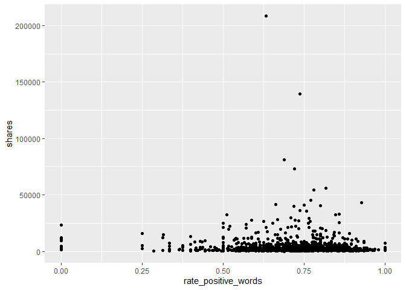

ST558 Project 3 Group F
================
Magaritte Nguyen and Matthew Sookoo
2022-11-12

-   <a href="#introduction" id="toc-introduction">Introduction</a>
-   <a href="#required-packages" id="toc-required-packages">Required
    Packages</a>
-   <a href="#data" id="toc-data">Data</a>
-   <a href="#summarizations" id="toc-summarizations">Summarizations</a>
-   <a href="#modelling" id="toc-modelling">Modelling</a>
    -   <a href="#first-linear-model" id="toc-first-linear-model">First linear
        model.</a>
    -   <a href="#second-linear-model" id="toc-second-linear-model">Second
        linear model</a>
    -   <a href="#random-forest-model" id="toc-random-forest-model">Random
        forest model</a>
    -   <a href="#boosted-tree-model" id="toc-boosted-tree-model">Boosted tree
        model</a>
-   <a href="#comaprison" id="toc-comaprison">Comaprison</a>
-   <a href="#project-work" id="toc-project-work">Project Work</a>
-   <a href="#repo-setting" id="toc-repo-setting">Repo Setting</a>
-   <a href="#blog" id="toc-blog">Blog</a>
-   <a href="#topic" id="toc-topic">Topic</a>
-   <a href="#report" id="toc-report">Report</a>
-   <a href="#summarizations-1" id="toc-summarizations-1">Summarizations</a>
-   <a href="#modeling" id="toc-modeling">Modeling</a>
-   <a href="#comparison" id="toc-comparison">Comparison</a>
-   <a href="#automation" id="toc-automation">Automation</a>
-   <a href="#submission" id="toc-submission">Submission</a>

<!-- 
############################################################# 
#############################################################
### Project 3 Group F
############################################################# 
############################################################# 
-->
<!-- setup -->

# Introduction

Our goal with this project is to create predictive models and automating
Markdown reports. This dataset summarizes a heterogeneous set of
features about articles published by Mashable (www.mashable.com) in a
period of two years. We will summarize the data and try to predict the
number of shares using linear regression, Random forest and boosting
(will add more later)

This dataset summarizes a heterogeneous set of features about articles
published by Mashable in a period of two years. The goal is to predict
the number of shares in social networks (popularity).

-   briefly describes the data and the variables you have to work with
    (just discuss the ones you want to use).

-   Your target variables is the shares variable.

-   mention the purpose of your analysis and the methods you’ll use to
    model the response.

-   You’ll describe those in more detail later.

Data Set Information:

-   The articles were published by Mashable (www.mashable.com) and their
    content as the rights to reproduce it belongs to them. Hence, this
    dataset does not share the original content but some statistics
    associated with it. The original content be publicly accessed and
    retrieved using the provided urls.

-   Acquisition date: January 8, 2015

-   The estimated relative performance values were estimated by the
    authors using a Random Forest classifier and a rolling windows as
    assessment method. See their article for more details on how the
    relative performance values were set.

# Required Packages

The following packages are used:

-   `tidyverse`: Tons of useful features for data manipulation and
    visualization!
-   `caret`: Used for predictive modelling.

MORE ADDED LATER AS REQUIRED…

<!-- packages that we are calling via library() function -->

# Data

Firstly, we read in the data using `read_csv()`

``` r
#check working directory
getwd()
```

    ## [1] "C:/Users/Home Pc/Desktop/ST558 Project 3 new/ST558_Project3_GroupF"

``` r
#reassign working directory
#Magaritte's directory
#setwd("D:/ST558/Project 3/ST558_Project3_GroupF")
#Matthew's directory
setwd("C:\\Users\\Home Pc\\Desktop\\ST558 Project 3 new\\ST558_Project3_GroupF\\")

#read in data set .csv file in full
#make sure that this is a relative path used...
# ./ stays in the same file directory
OnlineNewsPopularity<-read_csv("./OnlineNewsPopularity.csv", show_col_types = FALSE)

#call object OnlineNewsPopularity - our full raw data
OnlineNewsPopularity
```

    ## # A tibble: 39,644 × 61
    ##    url        timed…¹ n_tok…² n_tok…³ n_uni…⁴ n_non…⁵ n_non…⁶ num_h…⁷ num_s…⁸ num_i…⁹ num_v…˟
    ##    <chr>        <dbl>   <dbl>   <dbl>   <dbl>   <dbl>   <dbl>   <dbl>   <dbl>   <dbl>   <dbl>
    ##  1 http://ma…     731      12     219   0.664    1.00   0.815       4       2       1       0
    ##  2 http://ma…     731       9     255   0.605    1.00   0.792       3       1       1       0
    ##  3 http://ma…     731       9     211   0.575    1.00   0.664       3       1       1       0
    ##  4 http://ma…     731       9     531   0.504    1.00   0.666       9       0       1       0
    ##  5 http://ma…     731      13    1072   0.416    1.00   0.541      19      19      20       0
    ##  6 http://ma…     731      10     370   0.560    1.00   0.698       2       2       0       0
    ##  7 http://ma…     731       8     960   0.418    1.00   0.550      21      20      20       0
    ##  8 http://ma…     731      12     989   0.434    1.00   0.572      20      20      20       0
    ##  9 http://ma…     731      11      97   0.670    1.00   0.837       2       0       0       0
    ## 10 http://ma…     731      10     231   0.636    1.00   0.797       4       1       1       1
    ## # … with 39,634 more rows, 50 more variables: average_token_length <dbl>,
    ## #   num_keywords <dbl>, data_channel_is_lifestyle <dbl>,
    ## #   data_channel_is_entertainment <dbl>, data_channel_is_bus <dbl>,
    ## #   data_channel_is_socmed <dbl>, data_channel_is_tech <dbl>, data_channel_is_world <dbl>,
    ## #   kw_min_min <dbl>, kw_max_min <dbl>, kw_avg_min <dbl>, kw_min_max <dbl>,
    ## #   kw_max_max <dbl>, kw_avg_max <dbl>, kw_min_avg <dbl>, kw_max_avg <dbl>,
    ## #   kw_avg_avg <dbl>, self_reference_min_shares <dbl>, self_reference_max_shares <dbl>, …

We now subset the data for the channel of interest lifestyle

``` r
#subsetting the OnlineNewsPopularity full raw data for the data channel of interest -- Lifestyle
Lifestyle <- OnlineNewsPopularity %>% 
               filter(data_channel_is_lifestyle == 1) %>%
               # removing non-predictive variables per dataset description
               # remove all data_channel_is_* variables because we already filtered on them and we do not want them included in the model!
               select( ! c(url, timedelta, starts_with("data_channel_is_" ) ) )

#tidyverse way of looking at the dataset -- similar to str()
#glimpse(Lifestyle)

#calling the Lifestyle object to view
Lifestyle
```

    ## # A tibble: 2,099 × 53
    ##    n_tokens…¹ n_tok…² n_uni…³ n_non…⁴ n_non…⁵ num_h…⁶ num_s…⁷ num_i…⁸ num_v…⁹ avera…˟ num_k…˟
    ##         <dbl>   <dbl>   <dbl>   <dbl>   <dbl>   <dbl>   <dbl>   <dbl>   <dbl>   <dbl>   <dbl>
    ##  1          8     960   0.418    1.00   0.550      21      20      20       0    4.65      10
    ##  2         10     187   0.667    1.00   0.800       7       0       1       0    4.66       7
    ##  3         11     103   0.689    1.00   0.806       3       1       1       0    4.84       6
    ##  4         10     243   0.619    1.00   0.824       1       1       0       0    4.38      10
    ##  5          8     204   0.586    1.00   0.698       7       2       1       0    4.67       8
    ##  6         11     315   0.551    1.00   0.702       4       4       1       0    4.38      10
    ##  7         10    1190   0.409    1.00   0.561      25      24      20       0    4.62       8
    ##  8          6     374   0.641    1.00   0.828       7       0       1       0    4.91       8
    ##  9         12     499   0.513    1.00   0.662      14       1       1       0    5.08      10
    ## 10         11     223   0.662    1.00   0.826       5       3       0       0    4.55       6
    ## # … with 2,089 more rows, 42 more variables: kw_min_min <dbl>, kw_max_min <dbl>,
    ## #   kw_avg_min <dbl>, kw_min_max <dbl>, kw_max_max <dbl>, kw_avg_max <dbl>,
    ## #   kw_min_avg <dbl>, kw_max_avg <dbl>, kw_avg_avg <dbl>, self_reference_min_shares <dbl>,
    ## #   self_reference_max_shares <dbl>, self_reference_avg_sharess <dbl>,
    ## #   weekday_is_monday <dbl>, weekday_is_tuesday <dbl>, weekday_is_wednesday <dbl>,
    ## #   weekday_is_thursday <dbl>, weekday_is_friday <dbl>, weekday_is_saturday <dbl>,
    ## #   weekday_is_sunday <dbl>, is_weekend <dbl>, LDA_00 <dbl>, LDA_01 <dbl>, LDA_02 <dbl>, …

# Summarizations

\<\<\<\<\<\<\< HEAD Now split the data set we’ve created into a training
and testing set. Use p = 0.7.

Here, we are splitting our created data, Lifestyle, into a training and
test set with p = 0.7. These datasets will be called `LifestyleTrain`
and `LifestyleTest`.

Note: a seed was set for reproduciblility purposes.

``` r
#seed is set for reproducability 
set.seed(123)

#another way to split train and test data below
# #indices to split on
# train <- sample(1:nrow(my_heart), size = nrow(my_heart)*0.70)
# test <- dplyr::setdiff(1:nrow(my_heart), train)
# #subset
# heartTrain <- my_heart[train, ]
# heartTest <- my_heart[test, ]

#indices to split on
LifestyleIndex <- createDataPartition(Lifestyle$shares, p = 0.70, list = FALSE)
#subset
LifestyleTrain <- Lifestyle[ LifestyleIndex, ]
LifestyleTest  <- Lifestyle[-LifestyleIndex, ]
```

``` r
#what question are we trying to answer here? 
#response variable is shares, but what does that mean given certain variables available to us?
#maybe look at days of the week variables?
#figure out what kind of object we want to make to answer our question...
#tibble keeping what kind of vars, matrix?

#need to do some sort of type of EDA in order to see if variables are highly correlated
#here we need to summary statistics via summary() and plots

#this shows the summary stats for each variable in our dataset...
Lifestlye_sumstats_Train <- summary(LifestyleTrain)
#calling Lifestlye_sumstats_Train object to see our summary stats
Lifestlye_sumstats_Train
```

    ##  n_tokens_title   n_tokens_content n_unique_tokens  n_non_stop_words
    ##  Min.   : 3.000   Min.   :   0.0   Min.   :0.0000   Min.   :0.0000  
    ##  1st Qu.: 8.000   1st Qu.: 315.0   1st Qu.:0.4626   1st Qu.:1.0000  
    ##  Median :10.000   Median : 501.5   Median :0.5178   Median :1.0000  
    ##  Mean   : 9.762   Mean   : 633.3   Mean   :0.5211   Mean   :0.9891  
    ##  3rd Qu.:11.000   3rd Qu.: 801.5   3rd Qu.:0.5886   3rd Qu.:1.0000  
    ##  Max.   :17.000   Max.   :8474.0   Max.   :0.8248   Max.   :1.0000  
    ##  n_non_stop_unique_tokens   num_hrefs      num_self_hrefs      num_imgs      
    ##  Min.   :0.0000           Min.   :  0.00   Min.   : 0.000   Min.   :  0.000  
    ##  1st Qu.:0.6292           1st Qu.:  6.00   1st Qu.: 1.000   1st Qu.:  1.000  
    ##  Median :0.6829           Median : 10.00   Median : 2.000   Median :  1.000  
    ##  Mean   :0.6818           Mean   : 13.61   Mean   : 2.566   Mean   :  5.058  
    ##  3rd Qu.:0.7514           3rd Qu.: 19.00   3rd Qu.: 3.000   3rd Qu.:  8.000  
    ##  Max.   :0.9697           Max.   :145.00   Max.   :27.000   Max.   :111.000  
    ##    num_videos     average_token_length  num_keywords      kw_min_min       kw_max_min   
    ##  Min.   : 0.000   Min.   :0.000        Min.   : 3.000   Min.   : -1.00   Min.   :    0  
    ##  1st Qu.: 0.000   1st Qu.:4.449        1st Qu.: 7.000   1st Qu.: -1.00   1st Qu.:  488  
    ##  Median : 0.000   Median :4.620        Median : 8.000   Median :  4.00   Median :  803  
    ##  Mean   : 0.485   Mean   :4.584        Mean   : 8.235   Mean   : 41.06   Mean   : 1580  
    ##  3rd Qu.: 0.000   3rd Qu.:4.791        3rd Qu.:10.000   3rd Qu.:  4.00   3rd Qu.: 1300  
    ##  Max.   :50.000   Max.   :5.947        Max.   :10.000   Max.   :377.00   Max.   :80400  
    ##    kw_avg_min        kw_min_max       kw_max_max       kw_avg_max       kw_min_avg  
    ##  Min.   :   -1.0   Min.   :     0   Min.   :     0   Min.   :     0   Min.   :   0  
    ##  1st Qu.:  185.5   1st Qu.:     0   1st Qu.:690400   1st Qu.:118866   1st Qu.:   0  
    ##  Median :  296.3   Median :     0   Median :843300   Median :182440   Median :   0  
    ##  Mean   :  408.7   Mean   :  7057   Mean   :705830   Mean   :183327   Mean   :1052  
    ##  3rd Qu.:  444.9   3rd Qu.:  6300   3rd Qu.:843300   3rd Qu.:248253   3rd Qu.:2264  
    ##  Max.   :13744.8   Max.   :208300   Max.   :843300   Max.   :491771   Max.   :3594  
    ##    kw_max_avg      kw_avg_avg    self_reference_min_shares self_reference_max_shares
    ##  Min.   :    0   Min.   :    0   Min.   :     0.0          Min.   :     0           
    ##  1st Qu.: 4061   1st Qu.: 2638   1st Qu.:   648.8          1st Qu.:  1000           
    ##  Median : 5034   Median : 3227   Median :  1700.0          Median :  2800           
    ##  Mean   : 6583   Mean   : 3401   Mean   :  4440.8          Mean   :  8445           
    ##  3rd Qu.: 7303   3rd Qu.: 3953   3rd Qu.:  3600.0          3rd Qu.:  6800           
    ##  Max.   :95422   Max.   :20378   Max.   :138700.0          Max.   :690400           
    ##  self_reference_avg_sharess weekday_is_monday weekday_is_tuesday weekday_is_wednesday
    ##  Min.   :     0.0           Min.   :0.0000    Min.   :0.000      Min.   :0.0000      
    ##  1st Qu.:   996.8           1st Qu.:0.0000    1st Qu.:0.000      1st Qu.:0.0000      
    ##  Median :  2485.1           Median :0.0000    Median :0.000      Median :0.0000      
    ##  Mean   :  6136.0           Mean   :0.1508    Mean   :0.163      Mean   :0.1882      
    ##  3rd Qu.:  5400.4           3rd Qu.:0.0000    3rd Qu.:0.000      3rd Qu.:0.0000      
    ##  Max.   :401450.0           Max.   :1.0000    Max.   :1.000      Max.   :1.0000      
    ##  weekday_is_thursday weekday_is_friday weekday_is_saturday weekday_is_sunday
    ##  Min.   :0.0000      Min.   :0.0000    Min.   :0.0000      Min.   :0.0000   
    ##  1st Qu.:0.0000      1st Qu.:0.0000    1st Qu.:0.0000      1st Qu.:0.0000   
    ##  Median :0.0000      Median :0.0000    Median :0.0000      Median :0.0000   
    ##  Mean   :0.1651      Mean   :0.1433    Mean   :0.0856      Mean   :0.1039   
    ##  3rd Qu.:0.0000      3rd Qu.:0.0000    3rd Qu.:0.0000      3rd Qu.:0.0000   
    ##  Max.   :1.0000      Max.   :1.0000    Max.   :1.0000      Max.   :1.0000   
    ##    is_weekend         LDA_00            LDA_01            LDA_02            LDA_03       
    ##  Min.   :0.0000   Min.   :0.01818   Min.   :0.01819   Min.   :0.01819   Min.   :0.01820  
    ##  1st Qu.:0.0000   1st Qu.:0.02250   1st Qu.:0.02222   1st Qu.:0.02222   1st Qu.:0.02260  
    ##  Median :0.0000   Median :0.02913   Median :0.02507   Median :0.02523   Median :0.02925  
    ##  Mean   :0.1895   Mean   :0.17892   Mean   :0.06751   Mean   :0.07769   Mean   :0.14188  
    ##  3rd Qu.:0.0000   3rd Qu.:0.25060   3rd Qu.:0.04001   3rd Qu.:0.06667   3rd Qu.:0.19724  
    ##  Max.   :1.0000   Max.   :0.91980   Max.   :0.68825   Max.   :0.67623   Max.   :0.91892  
    ##      LDA_04        global_subjectivity global_sentiment_polarity global_rate_positive_words
    ##  Min.   :0.02014   Min.   :0.0000      Min.   :-0.30000          Min.   :0.00000           
    ##  1st Qu.:0.32329   1st Qu.:0.4265      1st Qu.: 0.09929          1st Qu.:0.03493           
    ##  Median :0.56851   Median :0.4780      Median : 0.15023          Median :0.04424           
    ##  Mean   :0.53400   Mean   :0.4734      Mean   : 0.15143          Mean   :0.04457           
    ##  3rd Qu.:0.79956   3rd Qu.:0.5273      3rd Qu.: 0.20511          3rd Qu.:0.05378           
    ##  Max.   :0.92707   Max.   :0.7778      Max.   : 0.51389          Max.   :0.10791           
    ##  global_rate_negative_words rate_positive_words rate_negative_words avg_positive_polarity
    ##  Min.   :0.00000            Min.   :0.0000      Min.   :0.0000      Min.   :0.0000       
    ##  1st Qu.:0.01025            1st Qu.:0.6667      1st Qu.:0.1852      1st Qu.:0.3358       
    ##  Median :0.01521            Median :0.7399      Median :0.2560      Median :0.3836       
    ##  Mean   :0.01632            Mean   :0.7235      Mean   :0.2657      Mean   :0.3824       
    ##  3rd Qu.:0.02094            3rd Qu.:0.8125      3rd Qu.:0.3333      3rd Qu.:0.4335       
    ##  Max.   :0.06180            Max.   :1.0000      Max.   :1.0000      Max.   :0.7553       
    ##  min_positive_polarity max_positive_polarity avg_negative_polarity min_negative_polarity
    ##  Min.   :0.00000       Min.   :0.0000        Min.   :-1.0000       Min.   :-1.0000      
    ##  1st Qu.:0.05000       1st Qu.:0.7000        1st Qu.:-0.3250       1st Qu.:-0.7143      
    ##  Median :0.10000       Median :0.9000        Median :-0.2625       Median :-0.5000      
    ##  Mean   :0.09207       Mean   :0.8297        Mean   :-0.2671       Mean   :-0.5633      
    ##  3rd Qu.:0.10000       3rd Qu.:1.0000        3rd Qu.:-0.2039       3rd Qu.:-0.4000      
    ##  Max.   :0.50000       Max.   :1.0000        Max.   : 0.0000       Max.   : 0.0000      
    ##  max_negative_polarity title_subjectivity title_sentiment_polarity abs_title_subjectivity
    ##  Min.   :-1.0000       Min.   :0.0000     Min.   :-1.0000          Min.   :0.0000        
    ##  1st Qu.:-0.1250       1st Qu.:0.0000     1st Qu.: 0.0000          1st Qu.:0.1667        
    ##  Median :-0.1000       Median :0.1389     Median : 0.0000          Median :0.5000        
    ##  Mean   :-0.1046       Mean   :0.2928     Mean   : 0.1101          Mean   :0.3438        
    ##  3rd Qu.:-0.0500       3rd Qu.:0.5000     3rd Qu.: 0.2143          3rd Qu.:0.5000        
    ##  Max.   : 0.0000       Max.   :1.0000     Max.   : 1.0000          Max.   :0.5000        
    ##  abs_title_sentiment_polarity     shares      
    ##  Min.   :0.0000               Min.   :    78  
    ##  1st Qu.:0.0000               1st Qu.:  1100  
    ##  Median :0.0000               Median :  1700  
    ##  Mean   :0.1803               Mean   :  3737  
    ##  3rd Qu.:0.3000               3rd Qu.:  3225  
    ##  Max.   :1.0000               Max.   :208300

``` r
#check structure of objects
str(LifestyleTrain)
```

    ## tibble [1,472 × 53] (S3: tbl_df/tbl/data.frame)
    ##  $ n_tokens_title              : num [1:1472] 10 11 10 6 11 7 11 9 10 7 ...
    ##  $ n_tokens_content            : num [1:1472] 187 315 1190 374 223 ...
    ##  $ n_unique_tokens             : num [1:1472] 0.667 0.551 0.409 0.641 0.662 ...
    ##  $ n_non_stop_words            : num [1:1472] 1 1 1 1 1 ...
    ##  $ n_non_stop_unique_tokens    : num [1:1472] 0.8 0.702 0.561 0.828 0.826 ...
    ##  $ num_hrefs                   : num [1:1472] 7 4 25 7 5 24 28 10 2 9 ...
    ##  $ num_self_hrefs              : num [1:1472] 0 4 24 0 3 23 24 5 1 6 ...
    ##  $ num_imgs                    : num [1:1472] 1 1 20 1 0 20 20 1 11 1 ...
    ##  $ num_videos                  : num [1:1472] 0 0 0 0 0 0 0 0 0 0 ...
    ##  $ average_token_length        : num [1:1472] 4.66 4.38 4.62 4.91 4.55 ...
    ##  $ num_keywords                : num [1:1472] 7 10 8 8 6 10 10 9 9 10 ...
    ##  $ kw_min_min                  : num [1:1472] 0 0 0 0 217 217 217 217 217 217 ...
    ##  $ kw_max_min                  : num [1:1472] 0 0 0 0 1900 2600 823 2600 695 2600 ...
    ##  $ kw_avg_min                  : num [1:1472] 0 0 0 0 748 ...
    ##  $ kw_min_max                  : num [1:1472] 0 0 0 0 0 0 0 0 0 0 ...
    ##  $ kw_max_max                  : num [1:1472] 0 0 0 0 17100 17100 17100 17100 17100 17100 ...
    ##  $ kw_avg_max                  : num [1:1472] 0 0 0 0 4517 ...
    ##  $ kw_min_avg                  : num [1:1472] 0 0 0 0 0 0 0 0 0 0 ...
    ##  $ kw_max_avg                  : num [1:1472] 0 0 0 0 1953 ...
    ##  $ kw_avg_avg                  : num [1:1472] 0 0 0 0 1207 ...
    ##  $ self_reference_min_shares   : num [1:1472] 0 6200 545 0 6700 543 545 2000 0 1100 ...
    ##  $ self_reference_max_shares   : num [1:1472] 0 6200 16000 0 16700 16000 16000 4900 0 6000 ...
    ##  $ self_reference_avg_sharess  : num [1:1472] 0 6200 3151 0 11700 ...
    ##  $ weekday_is_monday           : num [1:1472] 1 1 1 1 0 0 0 0 0 0 ...
    ##  $ weekday_is_tuesday          : num [1:1472] 0 0 0 0 0 0 0 0 0 0 ...
    ##  $ weekday_is_wednesday        : num [1:1472] 0 0 0 0 1 1 1 1 1 1 ...
    ##  $ weekday_is_thursday         : num [1:1472] 0 0 0 0 0 0 0 0 0 0 ...
    ##  $ weekday_is_friday           : num [1:1472] 0 0 0 0 0 0 0 0 0 0 ...
    ##  $ weekday_is_saturday         : num [1:1472] 0 0 0 0 0 0 0 0 0 0 ...
    ##  $ weekday_is_sunday           : num [1:1472] 0 0 0 0 0 0 0 0 0 0 ...
    ##  $ is_weekend                  : num [1:1472] 0 0 0 0 0 0 0 0 0 0 ...
    ##  $ LDA_00                      : num [1:1472] 0.0286 0.0201 0.025 0.2066 0.0335 ...
    ##  $ LDA_01                      : num [1:1472] 0.0286 0.0206 0.1595 0.1461 0.217 ...
    ##  $ LDA_02                      : num [1:1472] 0.0286 0.0205 0.025 0.276 0.0334 ...
    ##  $ LDA_03                      : num [1:1472] 0.0287 0.1208 0.025 0.0251 0.0335 ...
    ##  $ LDA_04                      : num [1:1472] 0.885 0.818 0.765 0.346 0.683 ...
    ##  $ global_subjectivity         : num [1:1472] 0.477 0.554 0.507 0.399 0.372 ...
    ##  $ global_sentiment_polarity   : num [1:1472] 0.15 0.177 0.244 0.122 0.103 ...
    ##  $ global_rate_positive_words  : num [1:1472] 0.0267 0.0349 0.0639 0.0374 0.0493 ...
    ##  $ global_rate_negative_words  : num [1:1472] 0.0107 0.0127 0.0151 0.0187 0.0179 ...
    ##  $ rate_positive_words         : num [1:1472] 0.714 0.733 0.809 0.667 0.733 ...
    ##  $ rate_negative_words         : num [1:1472] 0.286 0.267 0.191 0.333 0.267 ...
    ##  $ avg_positive_polarity       : num [1:1472] 0.435 0.401 0.403 0.361 0.255 ...
    ##  $ min_positive_polarity       : num [1:1472] 0.2 0.1364 0.0333 0.1 0.1 ...
    ##  $ max_positive_polarity       : num [1:1472] 0.7 0.5 1 0.8 0.5 1 1 0.8 0.6 0.6 ...
    ##  $ avg_negative_polarity       : num [1:1472] -0.263 -0.32 -0.236 -0.13 -0.188 ...
    ##  $ min_negative_polarity       : num [1:1472] -0.4 -0.5 -0.5 -0.2 -0.4 ...
    ##  $ max_negative_polarity       : num [1:1472] -0.125 -0.125 -0.05 -0.05 -0.1 ...
    ##  $ title_subjectivity          : num [1:1472] 0 0.55 0 0 0 ...
    ##  $ title_sentiment_polarity    : num [1:1472] 0 0.35 0 0 0 ...
    ##  $ abs_title_subjectivity      : num [1:1472] 0.5 0.05 0.5 0.5 0.5 ...
    ##  $ abs_title_sentiment_polarity: num [1:1472] 0 0.35 0 0 0 ...
    ##  $ shares                      : num [1:1472] 1900 343 507 552 1900 1100 1200 2300 752 1000 ...

``` r
str(Lifestlye_sumstats_Train)
```

    ##  'table' chr [1:6, 1:53] "Min.   : 3.000  " "1st Qu.: 8.000  " "Median :10.000  " ...
    ##  - attr(*, "dimnames")=List of 2
    ##   ..$ : chr [1:6] "" "" "" "" ...
    ##   ..$ : chr [1:53] "n_tokens_title" "n_tokens_content" "n_unique_tokens" "n_non_stop_words" ...

``` r
#plots include - scatter plots, correlation plots -- plots for continuous data...
#do we need bar plots?

#A scatter plot with the number of shares on the y-axis and the positive word rate on the x-axis is created below
ggplot(data=LifestyleTrain, aes(y=shares, x=rate_positive_words)) + geom_point()
```

<!-- -->

# Modelling

The data is already split into 70% training and 30% test. Our main goal
is to predict the number of shares. This will be our response variable.
We will create four models each using 5-fold cross-validation.

Two models (first linear and random forest) will be multiple linear
regression models, one will be a random forest model and the final model
will be a boosted tree model.

A Linear regression model is a supervised learning technique that is
used to predict the value of a variable based on the value of other
variable(s). The variable you want to predict is called the dependent
variable or the response. The variable(s) you are using to predict is
called the independent variable(s) or the predictor(s).

## First linear model.

We model the number of shares by the selected independent variables

-   “n_tokens_title” (Number of words in the title),

-   “n_tokens_content” (Number of words in the content)

-   “num_imgs” (Number of images)

-   “num_videos” (Number of videos)

-   “is_weekend” (Was the article published on the weekend?)

``` r
l_m1 <- train(shares ~ n_tokens_title +  n_tokens_content + num_imgs + num_videos + is_weekend, data = LifestyleTrain, method = "lm", 
preProcess = c("center", "scale"),
trControl = trainControl(method= "cv", number = 5))

test_pred_l_m1 <- predict(l_m1, newdata = LifestyleTest)

m1 <- postResample(test_pred_l_m1, LifestyleTest$shares)
m1
```

    ##         RMSE     Rsquared          MAE 
    ## 9.076276e+03 3.142305e-03 3.179992e+03

## Second linear model

We model the number of shares by the selected independent variables

-   “num_hrefs” (Number of links)

-   “weekday_is_monday” (Was the article published on a Monday?)

-   “weekday_is_tuesday” (Was the article published on a Tuesday?)

-   “weekday_is_wednesday” {Was the article published on a Wednesday?)

-   “weekday_is_thursday” (Was the article published on a Thursday?)

-   “weekday_is_friday” (Was the article published on a Friday?)

-   “self_reference_avg_sharess” (Avg. shares of referenced articles in
    Mashable)

``` r
l_m2 <- train(shares ~ num_hrefs + weekday_is_monday + weekday_is_tuesday + weekday_is_wednesday + weekday_is_thursday + weekday_is_friday + self_reference_avg_sharess,
data = LifestyleTrain, method = "lm", 
preProcess = c("center", "scale"),
trControl = trainControl(method= "cv", number = 5))

test_pred_l_m2 <- predict(l_m2, newdata = LifestyleTest)

m2 <- postResample(test_pred_l_m2, LifestyleTest$shares)
m2
```

    ##         RMSE     Rsquared          MAE 
    ## 9.112152e+03 3.521337e-04 3.195064e+03

## Random forest model

The idea behind the random forest model is the same as bagging but we
use a random subset of predictors for each bootstrap sample tree fit
(indicated by “mtry”). More specifically, it involves creating a
boothstrap sample (same size with replacement), training the tree on
this sample (no pruning necessary), repeating the process a large number
of times and the final prediction is the average of those predictions.
Finding the average of predictions decreases variance which improves
predictions but unfortunately we lose interpretability.

For our random forest We model the number of shares by the selected
independent variables

-   “n_tokens_title” (Number of words in the title),

-   “n_tokens_content” (Number of words in the content)

-   “num_imgs” (Number of images)

-   “num_videos” (Number of videos)

-   “is_weekend” (Was the article published on the weekend?)

``` r
r_f <- train(shares ~ n_tokens_title +  n_tokens_content + num_imgs + num_videos + is_weekend , data = LifestyleTrain, method = "rf",
 trControl=trainControl(method = "cv", number = 5),
 preProcess = c("center", "scale"),
 tuneGrid = data.frame(mtry = 1:3))


test_pred_r_f <- predict(r_f, newdata = LifestyleTest)

m3 <- postResample(test_pred_r_f, LifestyleTest$shares)
m3
```

    ##         RMSE     Rsquared          MAE 
    ## 9.107637e+03 1.704950e-03 3.168616e+03

## Boosted tree model

The idea behind the boosting tree model is to train our tree slowly in a
sequential manner so each tree that is created will be based on the
previous one with predictions updated.

For our boosting tree we model the number of shares by the selected
independent variables

-   “num_hrefs” (Number of links)

-   “weekday_is_monday” (Was the article published on a Monday?)

-   “weekday_is_tuesday” (Was the article published on a Tuesday?)

-   “weekday_is_wednesday” {Was the article published on a Wednesday?)

-   “weekday_is_thursday” (Was the article published on a Thursday?)

-   “weekday_is_friday” (Was the article published on a Friday?)

-   “self_reference_avg_sharess” (Avg. shares of referenced articles in
    Mashable)

Additionally we choose to use all combinations of the tuning parameters
n.trees = c(25, 50, 100, 150, 200), interaction.depth = 1:4, shrinkage =
0.1 and n.minobsinnode = 10.

``` r
tune1<- c(25, 50, 100, 150, 200)
tune2<- 1:4
tune3<- 0.1
tune4<- 10

boosted <- train(shares ~ num_hrefs + weekday_is_monday + weekday_is_tuesday + weekday_is_wednesday + weekday_is_thursday + weekday_is_friday + self_reference_avg_sharess, 
data = LifestyleTrain, method = "gbm",
 trControl=trainControl(method = "cv", number = 5),
 preProcess = c("center", "scale"),
 tuneGrid = expand.grid(n.trees = tune1, interaction.depth = tune2, shrinkage = tune3,    n.minobsinnode = tune4))
```

    ## Iter   TrainDeviance   ValidDeviance   StepSize   Improve
    ##      1 53668999.3858             nan     0.1000 223986.6097
    ##      2 53382294.9012             nan     0.1000 215634.5453
    ##      3 53052851.0273             nan     0.1000 -71690.5902
    ##      4 52877660.8200             nan     0.1000 96400.3044
    ##      5 52686842.3168             nan     0.1000 -27080.3481
    ##      6 52562812.2047             nan     0.1000 -7898.5108
    ##      7 52399298.4967             nan     0.1000 5228.2178
    ##      8 52305967.5238             nan     0.1000 79751.7247
    ##      9 52124863.5592             nan     0.1000 -219687.9754
    ##     10 52059219.1710             nan     0.1000 38007.3789
    ##     20 51670112.4797             nan     0.1000 -152361.9398
    ##     40 51235598.5315             nan     0.1000 -40580.0777
    ##     60 50970389.5758             nan     0.1000 -43992.7968
    ##     80 50791873.2735             nan     0.1000 -132068.3304
    ##    100 50397489.6261             nan     0.1000 -103758.2531
    ##    120 50218752.3507             nan     0.1000 -40981.6267
    ##    140 50090995.0514             nan     0.1000 -119062.6625
    ##    160 49857967.1472             nan     0.1000 -271759.9171
    ##    180 49705621.7759             nan     0.1000 -105525.6380
    ##    200 49645691.0203             nan     0.1000 -75168.9147
    ## 
    ## Iter   TrainDeviance   ValidDeviance   StepSize   Improve
    ##      1 53532434.3050             nan     0.1000 355941.7527
    ##      2 53208845.3925             nan     0.1000 209842.9576
    ##      3 52812451.2591             nan     0.1000 -115039.7117
    ##      4 52728230.8431             nan     0.1000 24910.0500
    ##      5 52403763.3123             nan     0.1000 63941.6509
    ##      6 52323707.8655             nan     0.1000 -55542.9237
    ##      7 52230443.1594             nan     0.1000 70053.7198
    ##      8 52132462.9372             nan     0.1000 77180.3564
    ##      9 51921145.7117             nan     0.1000 -189658.3892
    ##     10 51797816.1916             nan     0.1000 -202829.9268
    ##     20 51127699.2884             nan     0.1000 24438.7052
    ##     40 50231891.2147             nan     0.1000 -151279.6864
    ##     60 49038598.5237             nan     0.1000 -224407.1828
    ##     80 48343185.4607             nan     0.1000 -55016.3624
    ##    100 47722524.6277             nan     0.1000 -62604.0407
    ##    120 46935533.9594             nan     0.1000 -158634.7595
    ##    140 46498091.8125             nan     0.1000 -306444.3624
    ##    160 46141062.3342             nan     0.1000 -146644.3884
    ##    180 45606350.0390             nan     0.1000 -68160.0925
    ##    200 45107062.4301             nan     0.1000 28473.5471
    ## 
    ## Iter   TrainDeviance   ValidDeviance   StepSize   Improve
    ##      1 53510705.7596             nan     0.1000 -43001.6997
    ##      2 53355961.0952             nan     0.1000 130334.9610
    ##      3 53025543.6029             nan     0.1000 98454.3607
    ##      4 52781102.5997             nan     0.1000 16753.3119
    ##      5 52565275.1960             nan     0.1000 26562.8605
    ##      6 52271979.9841             nan     0.1000 -28122.4218
    ##      7 51983123.3521             nan     0.1000 -86776.9544
    ##      8 51832383.3563             nan     0.1000 -120871.2529
    ##      9 51316671.6603             nan     0.1000 -124994.8367
    ##     10 50964280.9116             nan     0.1000 -108373.6901
    ##     20 49548604.0594             nan     0.1000 -117512.1536
    ##     40 48263041.9168             nan     0.1000 -120275.0710
    ##     60 47134010.1511             nan     0.1000 -96148.9596
    ##     80 45993651.2396             nan     0.1000 -527217.6350
    ##    100 45344956.9038             nan     0.1000 -189338.9684
    ##    120 44272182.0503             nan     0.1000 -56390.8134
    ##    140 43425495.4063             nan     0.1000 -356451.1512
    ##    160 42851165.9405             nan     0.1000 -157098.7018
    ##    180 42044245.8305             nan     0.1000 -43814.9543
    ##    200 41403232.2524             nan     0.1000 -49697.4973
    ## 
    ## Iter   TrainDeviance   ValidDeviance   StepSize   Improve
    ##      1 53416274.5704             nan     0.1000 338534.6383
    ##      2 52905802.3058             nan     0.1000 168106.4048
    ##      3 52416349.5713             nan     0.1000 95342.8732
    ##      4 52075472.8924             nan     0.1000 3593.0492
    ##      5 51813765.2936             nan     0.1000 134639.3602
    ##      6 51489116.9218             nan     0.1000 -93749.3134
    ##      7 51370666.8520             nan     0.1000 20955.9375
    ##      8 51096705.7046             nan     0.1000 -171101.9933
    ##      9 51006659.8435             nan     0.1000 11173.1076
    ##     10 50869167.3656             nan     0.1000 -107434.1226
    ##     20 49632008.0552             nan     0.1000 -125726.6309
    ##     40 47147654.5192             nan     0.1000 -139044.7617
    ##     60 45571547.2670             nan     0.1000 -225512.5677
    ##     80 44642948.5639             nan     0.1000 -159026.2758
    ##    100 43231457.0357             nan     0.1000 -138844.7821
    ##    120 42242719.7597             nan     0.1000 -182380.3880
    ##    140 40947645.4562             nan     0.1000 -109444.0560
    ##    160 40082031.9517             nan     0.1000 -228177.2127
    ##    180 39393244.4241             nan     0.1000 -87783.3776
    ##    200 38612306.7393             nan     0.1000 -142821.7590
    ## 
    ## Iter   TrainDeviance   ValidDeviance   StepSize   Improve
    ##      1 87844052.2543             nan     0.1000 131513.3501
    ##      2 87647661.1480             nan     0.1000 -32238.0657
    ##      3 87167762.3977             nan     0.1000 -161654.8542
    ##      4 87086521.0644             nan     0.1000 28670.0508
    ##      5 86980422.4426             nan     0.1000 118282.0797
    ##      6 86813815.4432             nan     0.1000 -101320.0722
    ##      7 86740800.4201             nan     0.1000 -7132.4017
    ##      8 86688253.5800             nan     0.1000 27315.3515
    ##      9 86506878.3572             nan     0.1000 -39579.9576
    ##     10 86373323.8414             nan     0.1000 -475046.7070
    ##     20 85992146.8291             nan     0.1000 -34261.5548
    ##     40 85663528.4527             nan     0.1000 -135506.6864
    ##     60 85225156.0043             nan     0.1000 -113866.3293
    ##     80 84986187.0642             nan     0.1000 -64278.7102
    ##    100 84808389.2367             nan     0.1000 -83434.1732
    ##    120 84650602.5824             nan     0.1000 -46894.9774
    ##    140 84486986.8696             nan     0.1000 -129228.9997
    ##    160 84279209.4394             nan     0.1000 2708.1819
    ##    180 84047981.1986             nan     0.1000 -126257.0014
    ##    200 83822713.6761             nan     0.1000 -142955.7280
    ## 
    ## Iter   TrainDeviance   ValidDeviance   StepSize   Improve
    ##      1 88256128.0364             nan     0.1000 -80535.0577
    ##      2 87691060.2595             nan     0.1000 97121.2305
    ##      3 87302589.7114             nan     0.1000 37044.9146
    ##      4 87124173.4991             nan     0.1000 -59535.4812
    ##      5 86886939.7014             nan     0.1000 56281.1198
    ##      6 86752574.8130             nan     0.1000 -155138.2842
    ##      7 86626770.9583             nan     0.1000 -86107.1415
    ##      8 86504596.8422             nan     0.1000 74183.0189
    ##      9 86362896.3936             nan     0.1000 -155882.5467
    ##     10 86297612.4572             nan     0.1000 -58420.3307
    ##     20 84996514.8823             nan     0.1000 -231303.4801
    ##     40 82758412.6127             nan     0.1000 -334730.0568
    ##     60 81894263.2247             nan     0.1000 -97869.1954
    ##     80 80939216.2713             nan     0.1000 -314873.3028
    ##    100 80438079.6160             nan     0.1000 -40968.4778
    ##    120 79823381.8131             nan     0.1000 -214106.6953
    ##    140 79304715.1429             nan     0.1000 -156314.8064
    ##    160 78852269.5347             nan     0.1000 -184124.0312
    ##    180 78456874.8535             nan     0.1000 -224346.7641
    ##    200 78161612.8590             nan     0.1000 -444913.5798
    ## 
    ## Iter   TrainDeviance   ValidDeviance   StepSize   Improve
    ##      1 87974410.4928             nan     0.1000 177397.1655
    ##      2 87168191.5806             nan     0.1000 91652.5739
    ##      3 87050959.5315             nan     0.1000 -20258.8757
    ##      4 86336325.9464             nan     0.1000 -233360.2053
    ##      5 86130201.5670             nan     0.1000 -89169.6093
    ##      6 85865018.7753             nan     0.1000 -167880.1369
    ##      7 85698946.7548             nan     0.1000 -23053.2122
    ##      8 85567799.5541             nan     0.1000 -131362.4972
    ##      9 85446402.3702             nan     0.1000 -17782.1063
    ##     10 85007764.8580             nan     0.1000 -158961.1745
    ##     20 83598327.4415             nan     0.1000 -149703.3432
    ##     40 81528345.1798             nan     0.1000 -134622.3992
    ##     60 79326904.2230             nan     0.1000 -265960.1817
    ##     80 77483361.6069             nan     0.1000 -421538.3230
    ##    100 76250476.1099             nan     0.1000 -113109.8068
    ##    120 74855386.5600             nan     0.1000 -335741.0682
    ##    140 73869820.6298             nan     0.1000 -138725.5637
    ##    160 72976002.1310             nan     0.1000 -321892.5501
    ##    180 70938010.7203             nan     0.1000 -256079.2567
    ##    200 69992436.9490             nan     0.1000 -399503.9251
    ## 
    ## Iter   TrainDeviance   ValidDeviance   StepSize   Improve
    ##      1 87976654.6983             nan     0.1000 257021.0734
    ##      2 87345178.1228             nan     0.1000 -116996.3807
    ##      3 86438291.5141             nan     0.1000 -296235.7312
    ##      4 86036769.8032             nan     0.1000 110709.6092
    ##      5 85454087.2174             nan     0.1000 -101967.6359
    ##      6 85112534.1416             nan     0.1000 -167659.0869
    ##      7 84619444.2781             nan     0.1000 -82538.5264
    ##      8 84391890.1446             nan     0.1000 -71909.4895
    ##      9 83958492.0511             nan     0.1000 -227658.0347
    ##     10 83889064.4654             nan     0.1000 -261469.0691
    ##     20 80601863.1245             nan     0.1000 -46561.6602
    ##     40 78132798.0849             nan     0.1000 -210664.7975
    ##     60 75560929.6453             nan     0.1000 -652981.1727
    ##     80 74084019.1540             nan     0.1000 -243038.0656
    ##    100 72802175.0170             nan     0.1000 -177227.3333
    ##    120 70541065.9801             nan     0.1000 -202693.5869
    ##    140 68564607.4166             nan     0.1000 -231756.0507
    ##    160 67584681.3674             nan     0.1000 -113290.8292
    ##    180 66131040.4342             nan     0.1000 -461610.2615
    ##    200 64191358.2798             nan     0.1000 -239587.8355
    ## 
    ## Iter   TrainDeviance   ValidDeviance   StepSize   Improve
    ##      1 90392021.0626             nan     0.1000 -19784.0670
    ##      2 90256066.1714             nan     0.1000 51054.0009
    ##      3 90180939.2664             nan     0.1000 -93382.9508
    ##      4 90015523.9176             nan     0.1000 -27302.4290
    ##      5 89899084.1789             nan     0.1000 36180.1929
    ##      6 89645956.0656             nan     0.1000 -101993.8686
    ##      7 89483657.0229             nan     0.1000 -150572.9778
    ##      8 89408619.8920             nan     0.1000 30392.5274
    ##      9 89327926.8313             nan     0.1000 -129758.1845
    ##     10 89188802.0009             nan     0.1000 -71246.1905
    ##     20 88747265.4562             nan     0.1000 -236039.6784
    ##     40 88265014.5215             nan     0.1000 -157679.5442
    ##     60 87946700.6750             nan     0.1000 -56884.6112
    ##     80 87679636.7494             nan     0.1000 -323483.7481
    ##    100 87506292.3089             nan     0.1000 -139486.2472
    ##    120 87301533.2316             nan     0.1000 -74105.8974
    ##    140 87198832.4937             nan     0.1000 -55518.8383
    ##    160 87011010.2625             nan     0.1000 -22280.5567
    ##    180 86846353.6702             nan     0.1000 -59650.4317
    ##    200 86680370.9771             nan     0.1000 -6578.6946
    ## 
    ## Iter   TrainDeviance   ValidDeviance   StepSize   Improve
    ##      1 90350055.6581             nan     0.1000 249066.3555
    ##      2 89930046.6651             nan     0.1000 7004.2603
    ##      3 89744230.0676             nan     0.1000 -182442.9210
    ##      4 89509294.1926             nan     0.1000 122751.8109
    ##      5 89295911.6415             nan     0.1000 -47417.9145
    ##      6 89135686.2071             nan     0.1000 -22000.3874
    ##      7 89011431.3135             nan     0.1000 -179820.2617
    ##      8 88479117.3657             nan     0.1000 19405.3508
    ##      9 88285021.2069             nan     0.1000 -149659.7305
    ##     10 87949989.4100             nan     0.1000 -113804.9784
    ##     20 87039853.1556             nan     0.1000 -87874.7743
    ##     40 85622782.7846             nan     0.1000 -327838.9838
    ##     60 84417556.6899             nan     0.1000 -167784.5169
    ##     80 83754752.3429             nan     0.1000 -392907.6125
    ##    100 83159276.6307             nan     0.1000 -169430.5311
    ##    120 81999496.2623             nan     0.1000 -94131.4876
    ##    140 81245119.5296             nan     0.1000 -117321.6604
    ##    160 80648707.9710             nan     0.1000 -205194.5127
    ##    180 79921967.7293             nan     0.1000 -320094.8853
    ##    200 79686711.5018             nan     0.1000 36334.7626
    ## 
    ## Iter   TrainDeviance   ValidDeviance   StepSize   Improve
    ##      1 90337269.9628             nan     0.1000 -124356.3339
    ##      2 89818234.8285             nan     0.1000 20912.6642
    ##      3 89526399.7981             nan     0.1000 -95020.4868
    ##      4 89169630.5707             nan     0.1000 -166292.9837
    ##      5 88937118.4250             nan     0.1000 -118058.4415
    ##      6 88238968.1831             nan     0.1000 -160630.0136
    ##      7 87557310.8349             nan     0.1000 -305306.9612
    ##      8 87086561.9875             nan     0.1000 -230490.7406
    ##      9 86666242.2852             nan     0.1000 -463480.6525
    ##     10 86179531.8944             nan     0.1000 -294785.8776
    ##     20 83602580.1156             nan     0.1000 -148968.9083
    ##     40 80885413.7864             nan     0.1000 -121232.0453
    ##     60 79513623.4356             nan     0.1000 -171673.3532
    ##     80 77431078.6211             nan     0.1000 -204605.0556
    ##    100 75900445.0687             nan     0.1000 -648345.7927
    ##    120 74303742.1635             nan     0.1000 -179354.5514
    ##    140 73295653.7975             nan     0.1000 -204224.3299
    ##    160 72317611.4583             nan     0.1000 -226503.9079
    ##    180 71510873.4088             nan     0.1000 -752573.8018
    ##    200 70465022.6197             nan     0.1000 -344061.1509
    ## 
    ## Iter   TrainDeviance   ValidDeviance   StepSize   Improve
    ##      1 90236008.9160             nan     0.1000 10556.3915
    ##      2 89401105.1179             nan     0.1000 -221626.9780
    ##      3 88490281.4155             nan     0.1000 -41813.5743
    ##      4 88203553.6615             nan     0.1000 -66321.5787
    ##      5 87858071.4594             nan     0.1000 -132546.0513
    ##      6 87698202.2490             nan     0.1000 -32306.1884
    ##      7 87310881.8947             nan     0.1000 -314203.2010
    ##      8 86976520.9189             nan     0.1000 -274398.6924
    ##      9 86821996.3557             nan     0.1000 -215237.3020
    ##     10 86745980.8963             nan     0.1000 -41439.9964
    ##     20 83462926.1913             nan     0.1000 -455434.1515
    ##     40 80329574.6397             nan     0.1000 -259071.6783
    ##     60 78148802.3558             nan     0.1000 -615170.5219
    ##     80 76285213.8931             nan     0.1000 -88728.7356
    ##    100 74629249.7804             nan     0.1000 -400012.8517
    ##    120 72994089.0308             nan     0.1000 -310709.1028
    ##    140 70644718.1110             nan     0.1000 -150953.5414
    ##    160 69340728.9959             nan     0.1000 -355758.9173
    ##    180 68261754.1668             nan     0.1000 -495646.6807
    ##    200 66576583.7979             nan     0.1000 -336792.8540
    ## 
    ## Iter   TrainDeviance   ValidDeviance   StepSize   Improve
    ##      1 86445721.2844             nan     0.1000 -29311.6446
    ##      2 86277411.5128             nan     0.1000  875.5313
    ##      3 86116819.9143             nan     0.1000 17386.0516
    ##      4 86067689.3409             nan     0.1000  956.3372
    ##      5 85990175.1010             nan     0.1000 25152.7515
    ##      6 85862207.3539             nan     0.1000 4635.1390
    ##      7 85859375.8004             nan     0.1000 -81414.9296
    ##      8 85760529.2719             nan     0.1000 12927.6804
    ##      9 85678057.5108             nan     0.1000 -28804.5872
    ##     10 85652801.7850             nan     0.1000 -6255.2696
    ##     20 84952279.4217             nan     0.1000 -27462.7046
    ##     40 84320879.4099             nan     0.1000 -41566.9722
    ##     60 84072389.1467             nan     0.1000 -78787.8364
    ##     80 83845514.8090             nan     0.1000 -58097.8586
    ##    100 83541800.2814             nan     0.1000 -66165.4220
    ##    120 83284570.4175             nan     0.1000 -120707.0031
    ##    140 83072494.3788             nan     0.1000 -103648.1620
    ##    160 82918732.5012             nan     0.1000 -84941.6969
    ##    180 82770547.6409             nan     0.1000 -91859.3675
    ##    200 82611115.8500             nan     0.1000 -156685.5649
    ## 
    ## Iter   TrainDeviance   ValidDeviance   StepSize   Improve
    ##      1 86457405.8750             nan     0.1000 -1212.7678
    ##      2 86344278.0243             nan     0.1000 11760.8423
    ##      3 85746584.7448             nan     0.1000 -108941.6222
    ##      4 85602340.2795             nan     0.1000 -106011.5449
    ##      5 85106049.9832             nan     0.1000 -88315.7230
    ##      6 84950408.1664             nan     0.1000 -56733.0976
    ##      7 84610956.5229             nan     0.1000 -406334.9733
    ##      8 84411543.7524             nan     0.1000 -84125.8602
    ##      9 83909027.5728             nan     0.1000 -319339.7178
    ##     10 83783844.4501             nan     0.1000 -24534.6334
    ##     20 82519021.3513             nan     0.1000 -83881.2090
    ##     40 81286264.1931             nan     0.1000 -30307.8335
    ##     60 80498488.3855             nan     0.1000 -110655.7868
    ##     80 79378301.9779             nan     0.1000 -229683.3306
    ##    100 78737128.1551             nan     0.1000 -198849.3995
    ##    120 77970454.9698             nan     0.1000 -96052.3668
    ##    140 77393622.1348             nan     0.1000 -89674.8482
    ##    160 76924977.6046             nan     0.1000 -78674.4144
    ##    180 76400161.0970             nan     0.1000 -94407.1317
    ##    200 75931553.2620             nan     0.1000 -278709.0774
    ## 
    ## Iter   TrainDeviance   ValidDeviance   StepSize   Improve
    ##      1 86202981.3825             nan     0.1000 -97130.1708
    ##      2 86005775.1192             nan     0.1000 -69973.5258
    ##      3 85248122.1999             nan     0.1000 -46591.5201
    ##      4 84720265.0028             nan     0.1000 54170.3371
    ##      5 84558758.4792             nan     0.1000 -61296.8714
    ##      6 84416955.4335             nan     0.1000 -100531.6046
    ##      7 84152460.2717             nan     0.1000 -21143.0156
    ##      8 83777633.5119             nan     0.1000 40172.1052
    ##      9 83430386.8570             nan     0.1000 -179949.5892
    ##     10 83070698.7984             nan     0.1000 -220412.7029
    ##     20 80414858.3372             nan     0.1000 -283451.9001
    ##     40 77689083.3005             nan     0.1000 -458836.8418
    ##     60 75317530.6909             nan     0.1000 -92045.1901
    ##     80 73617994.2822             nan     0.1000 -495728.2183
    ##    100 72158443.3276             nan     0.1000 -101862.9330
    ##    120 70452842.0677             nan     0.1000 -310627.1628
    ##    140 69498725.4551             nan     0.1000 -338283.3399
    ##    160 68304863.4408             nan     0.1000 -182672.5669
    ##    180 67616161.4054             nan     0.1000 -220001.6168
    ##    200 66628469.2060             nan     0.1000 -235077.9208
    ## 
    ## Iter   TrainDeviance   ValidDeviance   StepSize   Improve
    ##      1 86306963.8226             nan     0.1000 -87556.5072
    ##      2 85848194.7790             nan     0.1000 -67355.0854
    ##      3 85600289.8525             nan     0.1000 -42668.8690
    ##      4 84811125.1803             nan     0.1000 -289739.3960
    ##      5 84582549.9078             nan     0.1000 -141536.1145
    ##      6 83990370.8895             nan     0.1000 -249355.0078
    ##      7 83527494.9769             nan     0.1000 -163348.2099
    ##      8 83043904.8316             nan     0.1000 -47243.9278
    ##      9 82840240.0791             nan     0.1000 -96435.0028
    ##     10 82548871.3240             nan     0.1000 -167873.0883
    ##     20 79858812.1087             nan     0.1000 -195280.4797
    ##     40 75710959.2188             nan     0.1000 -300700.0658
    ##     60 73340370.4135             nan     0.1000 -207153.9327
    ##     80 71134379.4059             nan     0.1000 -185028.9264
    ##    100 69970517.2950             nan     0.1000 -401497.8540
    ##    120 67770440.3971             nan     0.1000 -82818.0390
    ##    140 66062522.5375             nan     0.1000 -289313.6656
    ##    160 64877419.8552             nan     0.1000 -165127.8296
    ##    180 63481990.3393             nan     0.1000 -124816.8870
    ##    200 62655079.6195             nan     0.1000 -392876.0815
    ## 
    ## Iter   TrainDeviance   ValidDeviance   StepSize   Improve
    ##      1 66849899.0744             nan     0.1000 -11851.9250
    ##      2 66779092.7044             nan     0.1000 -6818.1891
    ##      3 66717640.9219             nan     0.1000 -40779.3989
    ##      4 66683857.9802             nan     0.1000 -24936.9892
    ##      5 66552563.0165             nan     0.1000 38586.3209
    ##      6 66515061.7947             nan     0.1000 -2404.3770
    ##      7 66406190.9133             nan     0.1000 -94575.6805
    ##      8 66338904.2576             nan     0.1000 -647.9973
    ##      9 66298246.4733             nan     0.1000  228.9524
    ##     10 66242002.3912             nan     0.1000 15742.8216
    ##     20 66012331.5032             nan     0.1000 -23105.5996
    ##     40 65691725.6184             nan     0.1000 -63438.2416
    ##     60 65461633.7553             nan     0.1000 -28349.2957
    ##     80 65227552.0615             nan     0.1000 -12115.6581
    ##    100 65054926.4188             nan     0.1000 -38236.9465
    ##    120 64743235.2985             nan     0.1000 -63636.0906
    ##    140 64603867.6282             nan     0.1000 -64192.2527
    ##    160 64435679.9456             nan     0.1000 -49749.3792
    ##    180 64272958.8203             nan     0.1000 -41114.8253
    ##    200 64140183.0725             nan     0.1000 -200994.3462
    ## 
    ## Iter   TrainDeviance   ValidDeviance   StepSize   Improve
    ##      1 66658277.6199             nan     0.1000 4843.8334
    ##      2 66586560.0181             nan     0.1000 -3907.4443
    ##      3 66528391.3701             nan     0.1000 -17618.4389
    ##      4 66343401.1024             nan     0.1000 -56941.1545
    ##      5 66163074.8972             nan     0.1000 -6132.1302
    ##      6 66048613.1405             nan     0.1000 35604.4275
    ##      7 65898372.8652             nan     0.1000 -196645.7247
    ##      8 65777233.1644             nan     0.1000 -119489.1651
    ##      9 65624135.0865             nan     0.1000 -127337.9967
    ##     10 65562711.1218             nan     0.1000 -174276.8816
    ##     20 64794481.2008             nan     0.1000 -50850.8489
    ##     40 63053915.2954             nan     0.1000 -90371.3523
    ##     60 62170714.9161             nan     0.1000 -207847.8741
    ##     80 61237301.9903             nan     0.1000 -43488.9659
    ##    100 60923192.4689             nan     0.1000 -195305.3203
    ##    120 60477492.9646             nan     0.1000 -251738.2025
    ##    140 59957191.7521             nan     0.1000 -39379.4506
    ##    160 59638843.9836             nan     0.1000 -120840.2314
    ##    180 59291007.9115             nan     0.1000 -210941.5099
    ##    200 59056985.1332             nan     0.1000 -48082.4004
    ## 
    ## Iter   TrainDeviance   ValidDeviance   StepSize   Improve
    ##      1 66674016.0065             nan     0.1000 56034.3174
    ##      2 66458705.0946             nan     0.1000 -35116.6969
    ##      3 66381115.4182             nan     0.1000 -48120.6620
    ##      4 66161834.1281             nan     0.1000 -136397.8824
    ##      5 65994827.2417             nan     0.1000 -85590.4825
    ##      6 65361940.6585             nan     0.1000 -411183.4080
    ##      7 65268425.8962             nan     0.1000 -99461.3796
    ##      8 65137184.8033             nan     0.1000 -150254.1378
    ##      9 65094182.6350             nan     0.1000 -67116.5808
    ##     10 64626339.4231             nan     0.1000 -210743.1078
    ##     20 63317950.7507             nan     0.1000 -111776.7203
    ##     40 60480432.7810             nan     0.1000 -434321.5590
    ##     60 59396809.6641             nan     0.1000 -258021.9758
    ##     80 58150901.6093             nan     0.1000 -245526.6006
    ##    100 56737991.5019             nan     0.1000 -218856.7132
    ##    120 55813066.1851             nan     0.1000 -65196.7312
    ##    140 54954907.9444             nan     0.1000 -480551.9887
    ##    160 54607287.5581             nan     0.1000 -363828.8416
    ##    180 53766922.3123             nan     0.1000 -200020.9069
    ##    200 53017920.1008             nan     0.1000 -682999.9589
    ## 
    ## Iter   TrainDeviance   ValidDeviance   StepSize   Improve
    ##      1 66258913.5145             nan     0.1000 -113970.1582
    ##      2 65340505.7730             nan     0.1000 -237121.9748
    ##      3 65246883.9321             nan     0.1000 -77757.7610
    ##      4 64719587.4204             nan     0.1000 -95293.9446
    ##      5 64098705.6901             nan     0.1000 -206601.0251
    ##      6 64013414.7359             nan     0.1000 -115063.6884
    ##      7 63865686.5351             nan     0.1000 -135635.9701
    ##      8 63750504.4298             nan     0.1000 -115379.2051
    ##      9 63144786.2769             nan     0.1000 -626062.5474
    ##     10 62740178.4398             nan     0.1000 -632084.6333
    ##     20 60733179.1651             nan     0.1000 -223592.8537
    ##     40 57811239.6206             nan     0.1000 -536918.0252
    ##     60 56516513.1079             nan     0.1000 -158869.1872
    ##     80 55121257.0584             nan     0.1000 -204662.2786
    ##    100 53690974.4135             nan     0.1000 -330702.1411
    ##    120 52882075.7160             nan     0.1000 -285884.9569
    ##    140 52116734.2783             nan     0.1000 -134474.3458
    ##    160 51349549.3970             nan     0.1000 -408686.9648
    ##    180 50206316.9010             nan     0.1000 -554387.7582
    ##    200 49408782.0356             nan     0.1000 -151656.5035
    ## 
    ## Iter   TrainDeviance   ValidDeviance   StepSize   Improve
    ##      1 77048921.8428             nan     0.1000 189594.6347
    ##      2 76925627.5687             nan     0.1000 -80198.5929
    ##      3 76818144.5924             nan     0.1000 -12854.4037
    ##      4 76676744.0638             nan     0.1000 -21197.7027
    ##      5 76583319.9188             nan     0.1000 87987.9359
    ##      6 76504161.7987             nan     0.1000 -10716.3795
    ##      7 76342493.1680             nan     0.1000 -48982.9382
    ##      8 76246370.8706             nan     0.1000 54471.6054
    ##      9 76120922.4360             nan     0.1000 -219958.7888
    ##     10 76048231.0538             nan     0.1000 -98711.7984
    ##     20 75622848.5390             nan     0.1000 -94270.8096
    ##     40 75257062.0409             nan     0.1000 -115890.5344
    ##     50 75074371.5514             nan     0.1000 -24556.1217

``` r
test_pred_boosted <- predict(boosted, newdata = LifestyleTest)

m4 <- postResample(test_pred_boosted, LifestyleTest$shares)
m4
```

    ##         RMSE     Rsquared          MAE 
    ## 9.167059e+03 1.284044e-04 3.272172e+03

Next we do a comparison of the four models

# Comaprison

The `postResample()` function was used to calculate useful statistics
such as rmse and R squared values for each one of the four models. We
summarize them in the tibble below.

``` r
lm1 <- tibble(model = c("First linear regression"), RMSE = c(m1[[1]]), R2 = c(m1[[2]]))

lm2 <- tibble(model = c("Second linear regression"), RMSE = c(m2[[1]]), R2 = c(m2[[2]]))

rf <- tibble(model = c("Random Forest"), RMSE = c(m3[[1]]), R2 = c(m3[[2]]))

Bos <- tibble(model = c("Boosting"), RMSE = c(m4[[1]]), R2 = c(m4[[2]]))

rbind(lm1, lm2, rf, Bos)
```

    ## # A tibble: 4 × 3
    ##   model                     RMSE       R2
    ##   <chr>                    <dbl>    <dbl>
    ## 1 First linear regression  9076. 0.00314 
    ## 2 Second linear regression 9112. 0.000352
    ## 3 Random Forest            9108. 0.00170 
    ## 4 Boosting                 9167. 0.000128

RMSE is a metric that tells us how far apart the predicted values are
from the observed values in a dataset, on average. The lower the RMSE,
the better a model fits a dataset.

R2 is a metric that tells us the proportion of the variance in the
response variable of a regression model that can be explained by the
predictor variables. This value ranges from 0 to 1. The higher the R2
value, the better a model fits a dataset.

From the table above the First linear regession model has the lowest
RMSE and the hightest R2 and is therefore our winner.

# Project Work

The first step is for the first group member to create a github repo and
add the second group member as a collaborator. The second group member
then needs to accept the membership. This gives everyone access to push
changes up to the repository. All project work should be done within
this repo.

Each time you go to work on the project, you should pull down any of the
latest changes using git pull. You should then upload any changes you’ve
made via the usual workflow done previously. There may occasionally be
merge conflicts that have to be dealt with. This can be done with the
Git tab in RStudio. Let us know if you are having issues with conflicts
that you can’t resolve!

# Repo Setting

On your project repo you should go into the settings and enable github
pages (feel free to select a theme too!). This will make it so your repo
can be accessed like your blog (username.github.io/repo-name). Be sure
to choose the master or main branch as the one to use if you have
choices there.

You’ll be automating the creation of documents using R Markdown (one for
each data_channel_is\_\* setting, i.e. type of article in the data set
provided). Each document should be rendered as a github_document from a
single .Rmd file. In the README.md file you should create links to each
of the documents you will create (Lifestyle analysis, Entertainment
analysis, etc.). Links can be made to the sub-documents using relative
paths. For instance, if you have all of the outputted .md files in the
main directory you would just use markdown linking:

-   The analysis for [Lifestyle articles is available
    here](LifestyleAnalysis.html). Note we link to the html file even
    though the file we create is a .md file - github creates the .html
    for us.

In the repo’s README.md file (which doesn’t need to be created from a
.Rmd file, just use the one you initialize into the repo if you want)
give a brief description of the purpose of the repo, a list of R
packages used, links to the generated analyses, and the code used to
create the analyses from a single .Rmd file (i.e. the render() code).

# Blog

Once you’ve completed the project each of you should write a brief blog
post outlining your project and two links to the
username.github.io/repo-name site and the repo itself (the username may
correspond to your partner). You should then also reflect on the process
you went through. Discuss the following:

-   what would you do differently?  
-   what was the most difficult part for you?  
-   what are your big take-aways from this project?

# Topic

What are you actually doing? You’ll read in and analyze an online news
popularity data set. You’ll subset the data by data_channel_is\_\* (one
of six groups). Then you’ll summarize the data and try to predict the
number of shares using predictive models.

1.  Read in the OnlineNewsPopularity.csv data file – subset for
    data_channel_is_lifestyle: Is data channel ‘Lifestyle’?

Here, `read_csv()` is used to read in the OnlineNewsPopularity.csv data
and we are subsetting for the `data_channel_is_lifestyle`: Is data
channel ‘Lifestyle’? variable.

``` r
#install one time thing
#install.packages("caret")

#read in data set .csv file in full
#OnlineNewsPopularity <- readr::read_csv(file="OnlineNewsPopularity.csv", 
#                                        show_col_types = FALSE)
```

``` r
#subsetting the data for`data_channel_is_lifestyle`: Is data channel 'Lifestyle'?
#Lifestyle <- OnlineNewsPopularity %>% 
#              filter( data_channel_is_lifestyle == 1)
```

# Report

Recommendation: At first, consider just using data from a single
data_channel_is\_\* source. Once you have all of the below steps done
for that data, then you can automate it to work with any chosen data
channel. Note: It may be easier to create a single variable representing
the data channel when automating the subsetting (although there are many
ways to do this).

-   All code chunks should be shown unless they are setup code chunks.

<!-- # Introduction section -->
<!-- You should have an introduction section that briefly describes the data and the variables you have to work with (just discuss the ones you want to use). Your target variables is the shares variable. -->
<!-- You should also mention the purpose of your analysis and the methods you’ll use to model the response. You’ll describe those in more detail later. -->
<!-- **This section should be done by the ‘second’ group member.** -->
<!-- # Data -->
<!-- Use a relative path to import the data. Subset the data to work on the data channel of interest. -->
<!-- **This section should be done by whoever can get to it first.** -->

# Summarizations

You should produce some basic (but meaningful) summary statistics and
plots about the training data you are working with (especially as it
relates to your response).

As you will automate this same analysis across other data, you can’t
describe the trends you see in the graph (unless you want to try to
automate that!). You should describe what to look for in the summary
statistics/plots to help the reader understand the summary or graph. Ex:
A scatter plot with the number of shares on the y-axis and the positive
word rate on the x-axis is created:

‘We can inspect the trend of shares as a function of the positive word
rate. If the points show an upward trend, then articles with more
positive words tend to be shared more often. If we see a negative trend
then articles with more positive words tend to be shared less often.’

Each group member is responsible for producing some summary statistics
(means, sds, contingency tables, etc.) and for producing at least three
graphs (each) of the data.

# Modeling

You’ll need to split the data into a training (70% of the data) and test
set (30% of the data). Use set.seed() to make things reproducible.

The goal is to create models for predicting the number of shares in some
way. Each group member should contribute a linear regression model and
an ensemble tree-based model. As we are automating things, describing
the chosen model is tough, so no need to worry about that.

The first group member should fit a random forest model and the second
group member should fit a boosted tree model. Both models should be
chosen using cross-validation.

Prior to the models fit using linear regression, the first group member
should provide a short but thorough explanation of the idea of a linear
regression model.

Prior to each ensemble model, you should provide a short but reasonably
thorough explanation of the ensemble model you are using (so one for
each group member).

# Comparison

All four of the models should be compared on the test set and a winner
declared (this should be automated to be correct across all the created
documents).

This can be done by one group member and the automation done by the
other (see below).

# Automation

Once you’ve completed the above for a particular data channel, adapt the
code so that you can use a parameter in your build process. You should
be able to automatically generate an analysis report for each
data_channel_is\_\* variable - although again, you may want to create a
new variable to help with the subsetting. You’ll end up with six total
outputted documents.

This should be done by the group member that doesn’t automate the
comparison of models part.

# Submission

In the project submission, you should simply put a link to your blog
post (which will have a link to your github pages and github repo).

<!-- # Group Issues -->
<!-- Please notify me ASAP of any group member issues. You should look over your partner’s work/explanations and discuss that with them if you have any issues with what they’ve done. Both group members are graded on all the work done regardless of who was assigned to do it. -->
<!--
Rubric for Grading (total = 100 points)
Item                               Points           Notes
Introduction                       10               Worth either 0, 5, or 10
Data split                          5               Worth either 0 or 5
Summarizations & discussions       20               Worth either 0, 5,. . . , or 20
Modeling, selection, & discussion  35               Worth either 0, 5, . . . , 35
Test set prediction and automation 10               Worth either 0, 5, or 10
Automation                         15               Worth either 0, 5, 10, or 15
Blog post and repo setup           10               Worth either 0, 5, or 10
-->
<!--
Notes on grading:
• For each item in the rubric, your grade will be lowered one level for each each error (syntax, logical, or other) in the code and for each required item that is missing or lacking a description.  
• If your work was not completed and documented using your github repo you will lose 50
points on the project.  
• You should use Good Programming Practices when coding (see wolfware). If you do not follow GPP you can lose up to 40 points on the project.  
• You should use appropriate markdown options/formatting (you can lose up to 20 points) for not doing so.
-->
<!-- code needed to render pdf file  -->
