ST558 Project 3
================
Magaritte Nguyen and Matthew Sookoo
2022-11-12

-   <a href="#introduction" id="toc-introduction">Introduction</a>
    -   <a href="#more-about-the-variables"
        id="toc-more-about-the-variables">More about the variables</a>
        -   <a href="#response-variable" id="toc-response-variable">Response
            variable</a>
        -   <a href="#independent-or-predictor-variables"
            id="toc-independent-or-predictor-variables">Independent or predictor
            variables</a>
-   <a href="#required-packages" id="toc-required-packages">Required
    Packages</a>
-   <a href="#data" id="toc-data">Data</a>
    -   <a href="#reading-in-the-data" id="toc-reading-in-the-data">Reading in
        the data</a>
-   <a href="#summarizations" id="toc-summarizations">Summarizations</a>
-   <a href="#modelling" id="toc-modelling">Modelling</a>
    -   <a href="#first-linear-model" id="toc-first-linear-model">First linear
        model.</a>
    -   <a href="#second-linear-model" id="toc-second-linear-model">Second
        linear model</a>
    -   <a href="#random-forest-model" id="toc-random-forest-model">Random
        forest model</a>
    -   <a href="#boosted-tree-model" id="toc-boosted-tree-model">Boosted tree
        model</a>
-   <a href="#comaprison" id="toc-comaprison">Comaprison</a>
-   <a href="#blog" id="toc-blog">Blog</a>
-   <a href="#summarizations-1" id="toc-summarizations-1">Summarizations</a>
-   <a href="#modeling" id="toc-modeling">Modeling</a>
-   <a href="#comparison" id="toc-comparison">Comparison</a>
-   <a href="#automation" id="toc-automation">Automation</a>
-   <a href="#submission" id="toc-submission">Submission</a>

<!-- testing automation form yaml header -->
<!-- it works -->
<!-- 
############################################################# 
#############################################################
### Project 3 Group F
############################################################# 
############################################################# 
-->
<!-- setup -->

# Introduction

Our goal with this project is to take the data about articles published
by Mashable (www.mashable.com) and create predictive models for the
number of shares in social networks (popularity) then automating our
Markdown reports. This dataset summarizes a heterogeneous set of
features in a period of two years.

The way we will summarize the data and try to predict the number of
shares is via linear regression, random forest, and boosting (will add
more later)

-   briefly describes the data and the variables you have to work with
    (just discuss the ones you want to use).

-   Your target variables is the shares variable.

-   mention the purpose of your analysis and the methods you’ll use to
    model the response.

-   You’ll describe those in more detail later.

Data Set Information:

-   The articles were published by Mashable (www.mashable.com) and their
    content as the rights to reproduce it belongs to them. Hence, this
    dataset does not share the original content but some statistics
    associated with it. The original content be publicly accessed and
    retrieved using the provided urls.

-   Acquisition date: January 8, 2015

-   The estimated relative performance values were estimated by the
    authors using a Random Forest classifier and a rolling windows as
    assessment method. See their article for more details on how the
    relative performance values were set.

Our goal with this project is to create predictive models and automating
Markdown reports. We are using this [Online News Popularity Data
Set](https://archive.ics.uci.edu/ml/datasets/Online+News+Popularity).

This dataset summarizes a heterogeneous set of features about articles
published by [Mashable](http://www.mashable.com) in a period of two
years.

## More about the variables

The data contains 39644 observations and 61 variables (58 predictive
attributes, 2 non-predictive, 1 goal field) and we are interested in the
number of shares of the online news. We only mention the one we use in
our project.

### Response variable

-   “shares” (Number of shares (target))

### Independent or predictor variables

-   “data_channel_is\_\*” (Lifestyle, Entertainment, Business, Social
    Media, Tech, World)

-   “n_tokens_title” (Number of words in the title),

-   “n_tokens_content” (Number of words in the content)

-   “num_imgs” (Number of images)

-   “num_videos” (Number of videos)

-   “is_weekend” (Was the article published on the weekend?)

-   “num_hrefs” (Number of links)

-   “weekday_is_monday” (Was the article published on a Monday?)

-   “weekday_is_tuesday” (Was the article published on a Tuesday?)

-   “weekday_is_wednesday” {Was the article published on a Wednesday?)

-   “weekday_is_thursday” (Was the article published on a Thursday?)

-   “weekday_is_friday” (Was the article published on a Friday?)

-   “self_reference_avg_sharess” (Avg. shares of referenced articles in
    Mashable)

# Required Packages

The following packages are used for our data manipulation, prediction,
etc.:

-   `tidyverse`: Tons of useful features for data manipulation and
    visualization!
-   `caret`: Used for predictive modelling.
-   `shiny`
-   `rmarkdown`

MORE ADDED LATER AS REQUIRED…

<!-- packages that we installed and are calling via library() function -->

# Data

## Reading in the data

Read in the OnlineNewsPopularity.csv data file – subset for
data_channel_is_entertainment: Is data channel ’’?
<!-- str_to_title("social media") ->> "Social Media" -->

Here, `read_csv()` is used to read in the OnlineNewsPopularity.csv data
and we are subsetting for the data_channel_is_entertainment: Is data
channel ’’? variable.

Firstly, we read in the data using `read_csv()`.

``` r
#check working directory
getwd()
```

    ## [1] "C:/Users/Home Pc/Desktop/ST558 Project 3 new/ST558_Project3_GroupF"

``` r
#reassign working directory
#Magaritte's directory
#setwd("D:/ST558/Project 3/ST558_Project3_GroupF")
#Matthew's directory
setwd("C:\\Users\\Home Pc\\Desktop\\ST558 Project 3 new\\ST558_Project3_GroupF\\")
#read in data set .csv file in full
#make sure that this is a relative path used...
# ./ stays in the same file directory
OnlineNewsPopularity<-read_csv("./OnlineNewsPopularity.csv", show_col_types = FALSE)
#call object OnlineNewsPopularity - our full raw data
OnlineNewsPopularity
```

    ## # A tibble: 39,644 × 61
    ##    url   timed…¹ n_tok…² n_tok…³ n_uni…⁴ n_non…⁵ n_non…⁶ num_h…⁷ num_s…⁸ num_i…⁹
    ##    <chr>   <dbl>   <dbl>   <dbl>   <dbl>   <dbl>   <dbl>   <dbl>   <dbl>   <dbl>
    ##  1 http…     731      12     219   0.664    1.00   0.815       4       2       1
    ##  2 http…     731       9     255   0.605    1.00   0.792       3       1       1
    ##  3 http…     731       9     211   0.575    1.00   0.664       3       1       1
    ##  4 http…     731       9     531   0.504    1.00   0.666       9       0       1
    ##  5 http…     731      13    1072   0.416    1.00   0.541      19      19      20
    ##  6 http…     731      10     370   0.560    1.00   0.698       2       2       0
    ##  7 http…     731       8     960   0.418    1.00   0.550      21      20      20
    ##  8 http…     731      12     989   0.434    1.00   0.572      20      20      20
    ##  9 http…     731      11      97   0.670    1.00   0.837       2       0       0
    ## 10 http…     731      10     231   0.636    1.00   0.797       4       1       1
    ## # … with 39,634 more rows, 51 more variables: num_videos <dbl>,
    ## #   average_token_length <dbl>, num_keywords <dbl>,
    ## #   data_channel_is_lifestyle <dbl>, data_channel_is_entertainment <dbl>,
    ## #   data_channel_is_bus <dbl>, data_channel_is_socmed <dbl>,
    ## #   data_channel_is_tech <dbl>, data_channel_is_world <dbl>, kw_min_min <dbl>,
    ## #   kw_max_min <dbl>, kw_avg_min <dbl>, kw_min_max <dbl>, kw_max_max <dbl>,
    ## #   kw_avg_max <dbl>, kw_min_avg <dbl>, kw_max_avg <dbl>, kw_avg_avg <dbl>, …

We now subset the data for the data channel of interest: .

``` r
#subsetting the OnlineNewsPopularity full raw data for the data channel of interest -- Lifestyle
Channel <- OnlineNewsPopularity %>% 
               #filter(data_channel_is_lifestyle == 1) %>%
               filter(get(params$channel) == 1) %>%
               # removing non-predictive variables per dataset description
               # remove all data_channel_is_* variables because we already filtered on them and we do not want them included in the model!
               #select( ! c(url, timedelta, starts_with("data_channel_is_" ) ) )
                select( ! c(url, timedelta ) )
#tidyverse way of looking at the dataset -- similar to str()
#glimpse(Channel)
#calling the Channel object to view
Channel
```

    ## # A tibble: 7,057 × 59
    ##    n_tokens_ti…¹ n_tok…² n_uni…³ n_non…⁴ n_non…⁵ num_h…⁶ num_s…⁷ num_i…⁸ num_v…⁹
    ##            <dbl>   <dbl>   <dbl>   <dbl>   <dbl>   <dbl>   <dbl>   <dbl>   <dbl>
    ##  1            12     219   0.664    1.00   0.815       4       2       1       0
    ##  2             9     531   0.504    1.00   0.666       9       0       1       0
    ##  3            14     194   0.765    1.00   0.840       4       4       0       1
    ##  4            12     161   0.669    1.00   0.752       5       4       0       6
    ##  5            11     454   0.566    1.00   0.755       5       3       1       0
    ##  6            12     177   0.741    1.00   0.823       4       3       1       0
    ##  7             5     356   0.618    1.00   0.766       3       3      12       1
    ##  8            11     281   0.611    1.00   0.766       5       4       1       0
    ##  9            10     909   0.450    1.00   0.670       3       2       1       1
    ## 10            10     413   0.606    1.00   0.729       6       1      13       0
    ## # … with 7,047 more rows, 50 more variables: average_token_length <dbl>,
    ## #   num_keywords <dbl>, data_channel_is_lifestyle <dbl>,
    ## #   data_channel_is_entertainment <dbl>, data_channel_is_bus <dbl>,
    ## #   data_channel_is_socmed <dbl>, data_channel_is_tech <dbl>,
    ## #   data_channel_is_world <dbl>, kw_min_min <dbl>, kw_max_min <dbl>,
    ## #   kw_avg_min <dbl>, kw_min_max <dbl>, kw_max_max <dbl>, kw_avg_max <dbl>,
    ## #   kw_min_avg <dbl>, kw_max_avg <dbl>, kw_avg_avg <dbl>, …

``` r
#testing
#correct - we expect 2099 vars
table(Channel[[params$channel]])
```

    ## 
    ##    1 
    ## 7057

# Summarizations

Now split the data set we’ve created into a training and testing set.
Use p = 0.7.

Here, we are splitting our created data, Channel, into a training and
test set with p = 0.7. These datasets will be called `ChannelTrain` and
`ChannelTest`.

Note: A seed was set for reproducibility purposes.

``` r
#seed is set for reproducibility 
set.seed(123)
#another way to split train and test data below
# #indices to split on
# train <- sample(1:nrow(my_heart), size = nrow(my_heart)*0.70)
# test <- dplyr::setdiff(1:nrow(my_heart), train)
# #subset
# heartTrain <- my_heart[train, ]
# heartTest <- my_heart[test, ]
#indices to split on
ChannelIndex <- createDataPartition(Channel$shares, p = 0.70, list = FALSE)
#subset
ChannelTrain <- Channel[ ChannelIndex, ]
ChannelTest  <- Channel[-ChannelIndex, ]
```

You should produce some basic (but meaningful) summary statistics and
plots about the training data you are working with (especially as it
relates to your response).

As you will automate this same analysis across other data, you can’t
describe the trends you see in the graph (unless you want to try to
automate that!). You should describe what to look for in the summary
statistics/plots to help the reader understand the summary or graph. Ex:
A scatter plot with the number of shares on the y-axis and the positive
word rate on the x-axis is created:

‘We can inspect the trend of shares as a function of the positive word
rate. If the points show an upward trend, then articles with more
positive words tend to be shared more often. If we see a negative trend
then articles with more positive words tend to be shared less often.’

Each group member is responsible for producing some summary statistics
(means, sds, contingency tables, etc.) and for producing at least three
graphs (each) of the data.

Whenever you start thinking about fitting a regression model, the first
think you want to do is data exploration (EDA - exploratory data
analysis). Best think you can do is create scatter plots for each
explanatory variable against the response variable. Scatter plots give
us useful visualizations. we will look at how to fit the line in R
(overlay), then predict a response using that line.

``` r
#this shows the summary stats for each variable in our dataset...
# 31. weekday_is_monday: Was the article published on a Monday?
summary(ChannelTrain$weekday_is_monday)
```

    ##    Min. 1st Qu.  Median    Mean 3rd Qu.    Max. 
    ##  0.0000  0.0000  0.0000  0.1872  0.0000  1.0000

``` r
# 32. weekday_is_tuesday: Was the article published on a Tuesday?
summary(ChannelTrain$weekday_is_tuesday)
```

    ##    Min. 1st Qu.  Median    Mean 3rd Qu.    Max. 
    ##  0.0000  0.0000  0.0000  0.1852  0.0000  1.0000

``` r
# 33. weekday_is_wednesday: Was the article published on a Wednesday?
summary(ChannelTrain$weekday_is_wednesday)
```

    ##    Min. 1st Qu.  Median    Mean 3rd Qu.    Max. 
    ##   0.000   0.000   0.000   0.187   0.000   1.000

``` r
# 34. weekday_is_thursday: Was the article published on a Thursday?
summary(ChannelTrain$weekday_is_thursday)
```

    ##    Min. 1st Qu.  Median    Mean 3rd Qu.    Max. 
    ##  0.0000  0.0000  0.0000  0.1759  0.0000  1.0000

``` r
# 35. weekday_is_friday: Was the article published on a Friday?
summary(ChannelTrain$weekday_is_friday)
```

    ##    Min. 1st Qu.  Median    Mean 3rd Qu.    Max. 
    ##   0.000   0.000   0.000   0.137   0.000   1.000

``` r
# 36. weekday_is_saturday: Was the article published on a Saturday?
summary(ChannelTrain$weekday_is_saturday)
```

    ##    Min. 1st Qu.  Median    Mean 3rd Qu.    Max. 
    ## 0.00000 0.00000 0.00000 0.05485 0.00000 1.00000

``` r
# 37. weekday_is_sunday: Was the article published on a Sunday?
summary(ChannelTrain$weekday_is_sunday)
```

    ##    Min. 1st Qu.  Median    Mean 3rd Qu.    Max. 
    ## 0.00000 0.00000 0.00000 0.07286 0.00000 1.00000

``` r
# 38. is_weekend: Was the article published on the weekend? 
summary(ChannelTrain$is_weekend)
```

    ##    Min. 1st Qu.  Median    Mean 3rd Qu.    Max. 
    ##  0.0000  0.0000  0.0000  0.1277  0.0000  1.0000

``` r
# 60. shares: Number of shares (target)
summary(ChannelTrain$shares)
```

    ##    Min. 1st Qu.  Median    Mean 3rd Qu.    Max. 
    ##      47     833    1200    2958    2100  210300

``` r
#contigency tables
# example: table (crabs$color, crabs$spine, crabs$y)
# monday is the mot published articels... compare to diff of the week
table(ChannelTrain$weekday_is_monday, ChannelTrain$weekday_is_tuesday)
```

    ##    
    ##        0    1
    ##   0 3101  915
    ##   1  925    0

``` r
table(ChannelTrain$weekday_is_monday, ChannelTrain$weekday_is_wednesday)
```

    ##    
    ##        0    1
    ##   0 3092  924
    ##   1  925    0

``` r
table(ChannelTrain$weekday_is_monday, ChannelTrain$weekday_is_thursday)
```

    ##    
    ##        0    1
    ##   0 3147  869
    ##   1  925    0

``` r
table(ChannelTrain$weekday_is_monday, ChannelTrain$weekday_is_friday)
```

    ##    
    ##        0    1
    ##   0 3339  677
    ##   1  925    0

``` r
#sum stats for all 61 vars - not helpful...
#Lifestlye_sumstats_Train <- summary(ChannelTrain)
#calling Lifestlye_sumstats_Train object to see our summary stats
#Lifestlye_sumstats_Train
#check structure of objects
#str(ChannelTrain)
#str(Lifestlye_sumstats_Train)
#plots include - scatter plots, correlation plots -- plots for continuous data...
#do we need bar plots?
#data for descriptive plots:
plot_data_weekday_weekend <- ChannelTrain %>%
                               mutate ( weekday = case_when(
                                          weekday_is_monday    == 1 ~ "Monday"   ,
                                          weekday_is_tuesday   == 1 ~ "Tuesday"  ,
                                          weekday_is_wednesday == 1 ~ "Wednesday",
                                          weekday_is_thursday  == 1 ~ "Thursday" ,
                                          weekday_is_friday    == 1 ~ "Friday"   ,
                                          weekday_is_saturday  == 1 ~ "Saturday" ,
                                          weekday_is_sunday    == 1 ~ "Sunday"   ,
                                          TRUE ~ NA_character_
                                      ),
                                        weekday = factor(
                                          x = weekday,
                                          levels = c("Monday", "Tuesday", "Wednesday",
                                                     "Thursday", "Friday", "Saturday",
                                                     "Sunday"),
                                          ordered = TRUE
                                          ) )
#A scatter plot with the number of shares on the y-axis and the positive word rate on the x-axis is created below
ggplot(data=plot_data_weekday_weekend, 
            aes(y=shares, x=weekday)) + 
            labs(x="Articles Published on Certain Days of the Week", y="Shares") +
            geom_boxplot() + scale_y_log10() +
            geom_point(aes(color=weekday), position="jitter") 
```

<!-- -->

``` r
# when we take the log of the data, we can see easier... Poisson...
# plot scatter after boxplot because we want to see where the majority of the dots are...
#total articles published is actually higher Monday and fewer on the weekend. but boxplots look like they are lower on the weekdays because more articles are published but less shares are occurring...
#plots - scatter plot with boxplot overlayed
# 31. weekday_is_monday: Was the article published on a Monday?
#this one doesnt work bc we need levels...
#ggplot(data=ChannelTrain, aes(y=shares, x=weekday_is_monday)) + geom_point()
# the y - axis is using a log axis not a linear axis, but the plots are more easily interpretable /  visually more ituitive with this transformation.
ggplot(data=ChannelTrain %>% 
              mutate(weekday_fctr = factor(x=weekday_is_monday,  
              levels=c(0,1), labels = c("No", "Yes"))), 
            aes(y=shares, x=weekday_fctr)) + 
            labs(x="Articles Published on Monday", y="Shares", color = "Published") +
            geom_boxplot() + scale_y_log10() +
            geom_point(aes(color=weekday_fctr), position="jitter", alpha=0.4) 
```

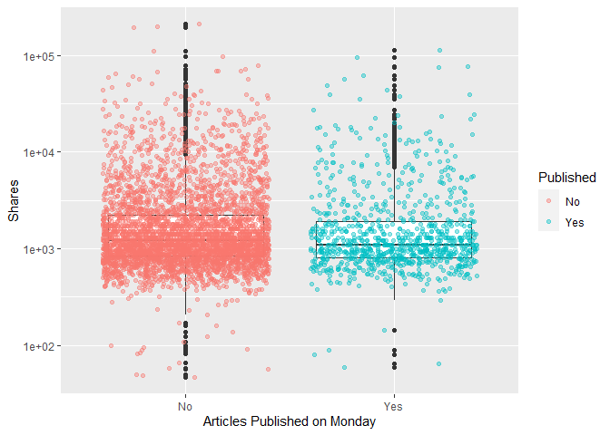<!-- -->

``` r
# 32. weekday_is_tuesday: Was the article published on a Tuesday
ggplot(data=ChannelTrain %>% 
              mutate(weekday_fctr = factor(x=weekday_is_tuesday,  
              levels=c(0,1), labels = c("No", "Yes"))), 
            aes(y=shares, x=weekday_fctr)) + 
            labs(x="Articles Published on Tuesday", y="Shares", color = "Published") +
            geom_boxplot() + scale_y_log10() +
            geom_point(aes(color=weekday_fctr), position="jitter", alpha=0.4) 
```

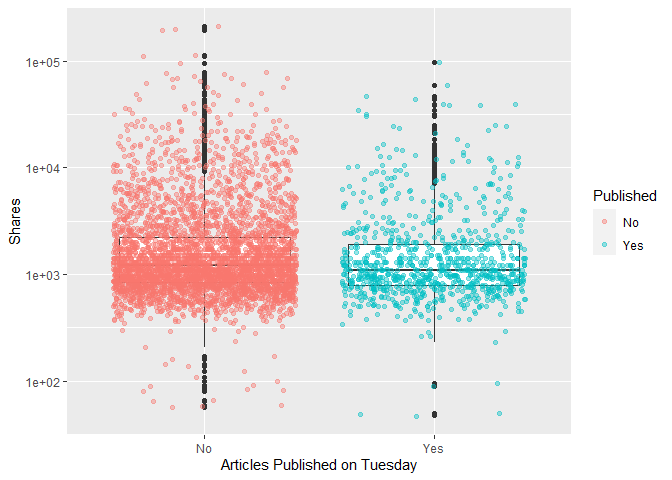<!-- -->

``` r
# 33. weekday_is_wednesday: Was the article published on a Wednesday?
ggplot(data=ChannelTrain %>% 
              mutate(weekday_fctr = factor(x=weekday_is_wednesday,  
              levels=c(0,1), labels = c("No", "Yes"))), 
            aes(y=shares, x=weekday_fctr)) + 
            labs(x="Articles Published on Wednesday", y="Shares", color = "Published") +
            geom_boxplot() + scale_y_log10() +
            geom_point(aes(color=weekday_fctr), position="jitter", alpha=0.4) 
```

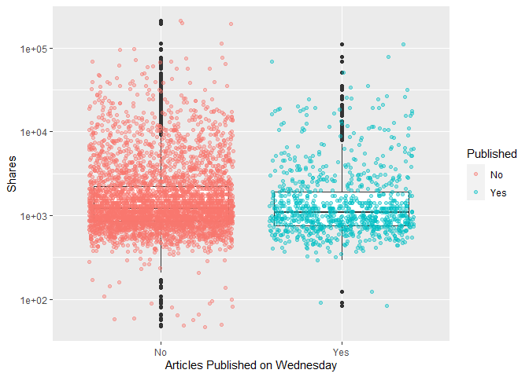<!-- -->

``` r
# 34. weekday_is_thursday: Was the article published on a Thursday?
ggplot(data=ChannelTrain %>% 
              mutate(weekday_fctr = factor(x=weekday_is_thursday,  
              levels=c(0,1), labels = c("No", "Yes"))), 
            aes(y=shares, x=weekday_fctr)) + 
            labs(x="Articles Published on Thursday", y="Shares", color = "Published") +
            geom_boxplot() + scale_y_log10() +
            geom_point(aes(color=weekday_fctr), position="jitter", alpha=0.4) 
```

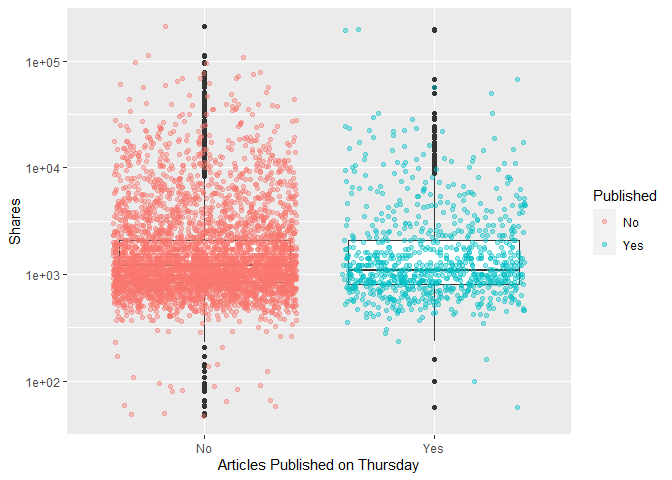<!-- -->

``` r
# 35. weekday_is_friday: Was the article published on a Friday?
ggplot(data=ChannelTrain %>% 
              mutate(weekday_fctr = factor(x=weekday_is_friday,  
              levels=c(0,1), labels = c("No", "Yes"))), 
            aes(y=shares, x=weekday_fctr)) + 
            labs(x="Articles Published on Friday", y="Shares", color = "Published") +
            geom_boxplot() + scale_y_log10() +
            geom_point(aes(color=weekday_fctr), position="jitter", alpha=0.4) 
```

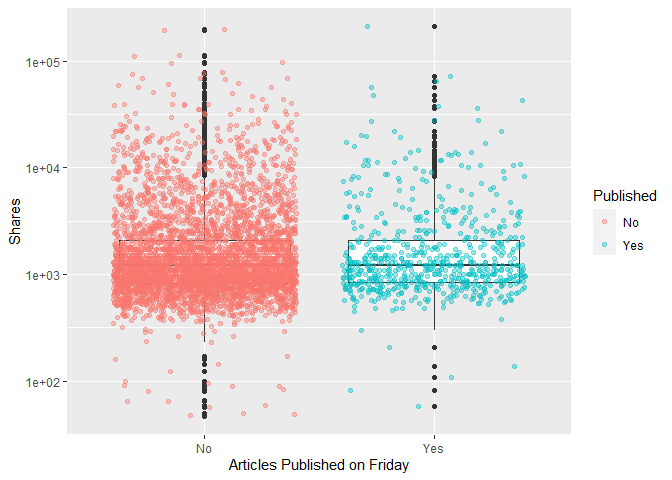<!-- -->

``` r
# 36. weekday_is_saturday: Was the article published on a Saturday?
ggplot(data=ChannelTrain %>% 
              mutate(weekday_fctr = factor(x=weekday_is_saturday,  
              levels=c(0,1), labels = c("No", "Yes"))), 
            aes(y=shares, x=weekday_fctr)) + 
            labs(x="Articles Published on Saturday", y="Shares", color = "Published") +
            geom_boxplot() + scale_y_log10() +
            geom_point(aes(color=weekday_fctr), position="jitter", alpha=0.4) 
```

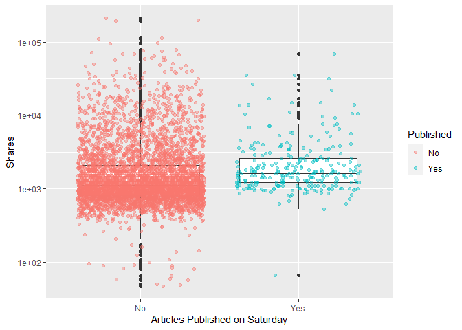<!-- -->

``` r
# 37. weekday_is_sunday: Was the article published on a Sunday?
ggplot(data=ChannelTrain %>% 
              mutate(weekday_fctr = factor(x=weekday_is_sunday,  
              levels=c(0,1), labels = c("No", "Yes"))), 
            aes(y=shares, x=weekday_fctr)) + 
            labs(x="Articles Published on Sunday", y="Shares", color = "Published") +
            geom_boxplot() + scale_y_log10() +
            geom_point(aes(color=weekday_fctr), position="jitter", alpha=0.4) 
```

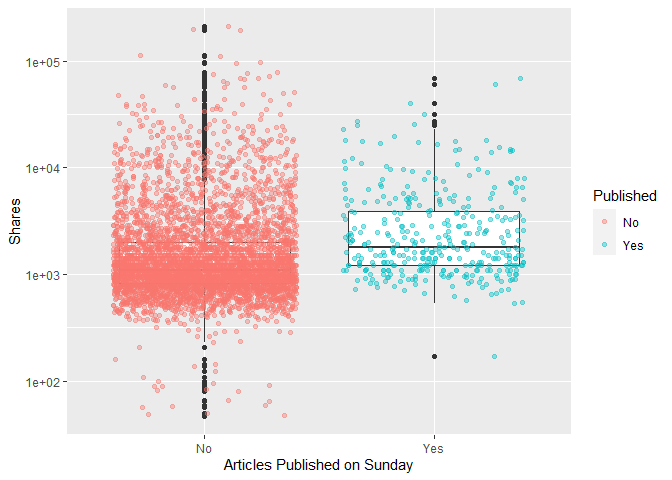<!-- -->

``` r
# # 38. is_weekend: Was the article published on the weekend? 
# ggplot(data=ChannelTrain %>% 
#               mutate(weekday_fctr = factor(x=is_weekend,  
#               levels=c(0,1), labels = c("No", "Yes"))), 
#             aes(y=shares, x=weekday_fctr)) + 
#             labs(x="Articles Published on Monday", y="Shares", color = "Published") +
#             geom_boxplot() + scale_y_log10() +
#             geom_point(aes(color=weekday_fctr), position="jitter") 
# i can make conclusions based on summary() median, min, max, bc i trasfomred for visibility
```

The y - axis is using a log axis not a linear axis, but the plots are
more easily interpretable / visually more intuitive with this
transformation.The general shape of the plots is correct.

We can inspect the trend of shares as a function of the different days
of the week that the articles are published.

If you see a presence of outliers, this may cause the mean to shift in
that direction, but the meidan will not be effected as much. If you see
that the median is not centered within the box, then there is a presence
of skewness in that particular direction. Also, if you see that there
are more observations / dots on one graph while comparing publication
(Yes/No), this is meaningful within the plot itself and also across the
different days of the week.

<!-- might use this later dont delete yet -->

``` r
#what question are we trying to answer here? 
# how to predict shares given the variables you have...
#fitting the model
fit_Channel <- lm(shares ~ . , data = Channel)
#call fit_Lifestyle object - remember this is an lm object
fit_Channel
```

    ## 
    ## Call:
    ## lm(formula = shares ~ ., data = Channel)
    ## 
    ## Coefficients:
    ##                   (Intercept)                 n_tokens_title  
    ##                     3.903e+06                      2.166e+01  
    ##              n_tokens_content                n_unique_tokens  
    ##                     1.019e+00                      7.534e+03  
    ##              n_non_stop_words       n_non_stop_unique_tokens  
    ##                    -6.152e+03                     -4.268e+03  
    ##                     num_hrefs                 num_self_hrefs  
    ##                     2.006e+01                     -7.822e+01  
    ##                      num_imgs                     num_videos  
    ##                     8.539e+00                     -1.598e+01  
    ##          average_token_length                   num_keywords  
    ##                     5.204e+02                     -5.870e+01  
    ##     data_channel_is_lifestyle  data_channel_is_entertainment  
    ##                            NA                             NA  
    ##           data_channel_is_bus         data_channel_is_socmed  
    ##                            NA                             NA  
    ##          data_channel_is_tech          data_channel_is_world  
    ##                            NA                             NA  
    ##                    kw_min_min                     kw_max_min  
    ##                     4.843e+00                      8.716e-01  
    ##                    kw_avg_min                     kw_min_max  
    ##                    -3.910e+00                     -6.674e-03  
    ##                    kw_max_max                     kw_avg_max  
    ##                    -9.099e-04                     -1.111e-03  
    ##                    kw_min_avg                     kw_max_avg  
    ##                    -3.911e-01                     -1.119e-01  
    ##                    kw_avg_avg      self_reference_min_shares  
    ##                     1.682e+00                      4.066e-02  
    ##     self_reference_max_shares     self_reference_avg_sharess  
    ##                     4.413e-03                      1.972e-02  
    ##             weekday_is_monday             weekday_is_tuesday  
    ##                    -6.512e+02                     -8.893e+02  
    ##          weekday_is_wednesday            weekday_is_thursday  
    ##                    -6.191e+02                     -7.486e+02  
    ##             weekday_is_friday            weekday_is_saturday  
    ##                    -5.563e+02                     -2.382e+02  
    ##             weekday_is_sunday                     is_weekend  
    ##                            NA                             NA  
    ##                        LDA_00                         LDA_01  
    ##                    -3.905e+06                     -3.903e+06  
    ##                        LDA_02                         LDA_03  
    ##                    -3.904e+06                     -3.904e+06  
    ##                        LDA_04            global_subjectivity  
    ##                    -3.904e+06                      3.396e+03  
    ##     global_sentiment_polarity     global_rate_positive_words  
    ##                     2.630e+03                     -2.209e+04  
    ##    global_rate_negative_words            rate_positive_words  
    ##                     2.413e+04                      1.956e+03  
    ##           rate_negative_words          avg_positive_polarity  
    ##                            NA                     -4.115e+02  
    ##         min_positive_polarity          max_positive_polarity  
    ##                     5.747e+02                     -1.689e+02  
    ##         avg_negative_polarity          min_negative_polarity  
    ##                    -4.152e+02                     -9.701e+01  
    ##         max_negative_polarity             title_subjectivity  
    ##                     5.554e+02                      2.379e+02  
    ##      title_sentiment_polarity         abs_title_subjectivity  
    ##                    -2.627e+02                      2.013e+02  
    ##  abs_title_sentiment_polarity  
    ##                     5.432e+02

``` r
# check fit_Lifestyle attributes
attributes(fit_Channel)
```

    ## $names
    ##  [1] "coefficients"  "residuals"     "effects"       "rank"         
    ##  [5] "fitted.values" "assign"        "qr"            "df.residual"  
    ##  [9] "xlevels"       "call"          "terms"         "model"        
    ## 
    ## $class
    ## [1] "lm"

``` r
fit_Channel[["residuals"]]
```

    ##             1             2             3             4             5 
    ##  1.375023e+03  2.207197e+03  1.846303e+03  1.320758e+03  5.470026e+03 
    ##             6             7             8             9            10 
    ##  7.548079e+02  2.217902e+03  9.402858e+02  5.234419e+02 -3.248781e+02 
    ##            11            12            13            14            15 
    ##  5.542209e+03  1.787362e+03  1.709041e+03  3.261208e+02  1.509888e+03 
    ##            16            17            18            19            20 
    ## -8.998434e+02  3.227651e+02 -3.786444e+03  1.814623e+04 -6.871586e+02 
    ##            21            22            23            24            25 
    ##  1.032433e+03  1.980816e+03  2.227219e+02  2.433816e+03  4.430447e+03 
    ##            26            27            28            29            30 
    ##  1.182744e+04 -4.964547e+01  3.553547e+03 -2.488299e+03  1.700518e+03 
    ##            31            32            33            34            35 
    ## -1.311218e+02 -6.147377e+03  6.869947e+03  2.278092e+02 -7.535430e+02 
    ##            36            37            38            39            40 
    ## -5.664592e+02 -1.257751e+03 -8.520359e+02 -2.125131e+03 -3.199207e+03 
    ##            41            42            43            44            45 
    ## -3.236946e+03  3.229599e+04  1.650500e+04 -2.267476e+03 -3.503363e+03 
    ##            46            47            48            49            50 
    ## -3.473031e+03 -5.101432e+02 -1.667189e+03 -1.163021e+03 -3.822064e+03 
    ##            51            52            53            54            55 
    ## -5.720216e+03 -1.983281e+03  4.827520e+03 -2.166213e+03  3.789963e+02 
    ##            56            57            58            59            60 
    ## -2.387955e+03 -1.134462e+03  4.306582e+02 -3.826069e+03 -3.716237e+03 
    ##            61            62            63            64            65 
    ##  2.625826e+02 -1.228133e+03  5.398467e+02  3.673375e+04 -8.294347e+02 
    ##            66            67            68            69            70 
    ## -1.698141e+03 -1.408024e+03 -1.807139e+03 -2.293606e+03 -8.950938e+02 
    ##            71            72            73            74            75 
    ## -1.785489e+03 -1.345525e+03 -2.668716e+03 -1.215870e+03  3.097043e+03 
    ##            76            77            78            79            80 
    ## -1.182247e+03 -2.202541e+03  9.356215e+02 -2.427815e+03  9.851584e+02 
    ##            81            82            83            84            85 
    ## -1.520905e+03 -6.731381e+03 -2.495291e+02 -3.208753e+03  4.011378e+02 
    ##            86            87            88            89            90 
    ##  9.455787e+02 -1.232157e+02 -1.354951e+03  2.102203e+03 -3.517210e+03 
    ##            91            92            93            94            95 
    ## -8.985706e+02  1.955077e+03 -2.472680e+03  1.454735e+04  5.290418e+02 
    ##            96            97            98            99           100 
    ## -2.211938e+03 -5.358657e+03 -1.350109e+03  3.523648e+02  1.159833e+02 
    ##           101           102           103           104           105 
    ## -1.586124e+03 -5.652715e+01 -5.946805e+02  1.692122e+02 -8.600974e+02 
    ##           106           107           108           109           110 
    ##  7.537128e+03 -1.831279e+03 -1.898123e+03 -3.288678e+03 -6.019516e+03 
    ##           111           112           113           114           115 
    ## -1.940462e+03 -8.611038e+02 -3.231373e+03 -1.886962e+03  2.746063e+03 
    ##           116           117           118           119           120 
    ## -2.360022e+03 -1.529039e+03 -2.263312e+03 -6.320411e+02 -4.898537e+02 
    ##           121           122           123           124           125 
    ## -1.577818e+03 -1.372024e+03  3.242259e+03 -4.430600e+01 -7.380586e+02 
    ##           126           127           128           129           130 
    ## -1.015586e+03 -1.117093e+03 -4.346702e+03  3.523567e+02 -9.884339e+02 
    ##           131           132           133           134           135 
    ## -2.375997e+03 -1.258548e+03 -1.778923e+03 -3.565695e+03 -1.742996e+03 
    ##           136           137           138           139           140 
    ## -2.502162e+03 -2.497751e+03 -2.499409e+03 -1.611876e+03 -4.489862e+02 
    ##           141           142           143           144           145 
    ## -5.766059e+02  2.987312e+03 -1.026070e+03  1.664532e+02 -1.120224e+03 
    ##           146           147           148           149           150 
    ##  4.539918e+03  1.632257e+03 -1.225492e+03 -1.284957e+03 -1.707499e+03 
    ##           151           152           153           154           155 
    ## -8.554723e+02 -9.365633e+01 -5.086766e+02  1.154983e+02 -2.814754e+03 
    ##           156           157           158           159           160 
    ##  7.864681e+03 -7.184610e+02 -9.727751e+01 -1.303075e+03 -1.225841e+03 
    ##           161           162           163           164           165 
    ## -7.949309e+02 -2.672507e+03 -1.220194e+03 -2.143611e+03 -1.733974e+03 
    ##           166           167           168           169           170 
    ##  2.432153e+03  6.971865e+02 -3.714778e+03 -2.873233e+03 -2.085968e+03 
    ##           171           172           173           174           175 
    ## -1.205709e+03 -2.482856e+02 -1.195082e+03 -2.735703e+03 -1.655041e+03 
    ##           176           177           178           179           180 
    ##  1.621535e+02 -6.949512e+03 -3.129410e+03  6.948683e+01  2.820118e+03 
    ##           181           182           183           184           185 
    ## -1.281362e+03 -3.088785e+02 -3.709381e+02 -5.802160e+02  9.546163e+02 
    ##           186           187           188           189           190 
    ## -7.566656e+02 -8.973526e+02 -3.815515e+03 -1.581348e+03 -1.124395e+03 
    ##           191           192           193           194           195 
    ## -7.181789e+01 -1.231350e+03 -1.757136e+03 -1.889386e+03 -1.929345e+03 
    ##           196           197           198           199           200 
    ## -9.725071e+02  1.018286e+03 -1.648005e+03 -3.219769e+03  6.714707e+04 
    ##           201           202           203           204           205 
    ## -7.875504e+02 -1.545848e+03 -1.222011e+02 -1.275119e+03  3.364249e+03 
    ##           206           207           208           209           210 
    ## -2.024676e+03 -1.568246e+03  1.027989e+03 -1.501317e+03 -1.264775e+03 
    ##           211           212           213           214           215 
    ## -1.664469e+03  4.109865e+02  1.609991e+01  2.103871e+03 -1.496129e+03 
    ##           216           217           218           219           220 
    ## -3.720085e+02 -2.706423e+03 -1.761662e+03 -3.498047e+03 -1.729807e+02 
    ##           221           222           223           224           225 
    ## -7.062661e+03  8.755074e+02 -6.220315e+01  2.495416e+03 -1.738149e+03 
    ##           226           227           228           229           230 
    ## -5.428499e+02 -2.932075e+03 -3.692240e+02 -1.612253e+03 -3.630338e+03 
    ##           231           232           233           234           235 
    ## -3.290310e+03 -5.860648e+02 -2.138141e+03 -3.511102e+03 -3.778638e+03 
    ##           236           237           238           239           240 
    ## -2.537530e+02  5.778718e+03 -2.313311e+03 -2.219667e+03 -2.095633e+03 
    ##           241           242           243           244           245 
    ## -7.896651e+02 -4.232311e+03 -6.079693e+02 -2.205136e+03 -1.969745e+03 
    ##           246           247           248           249           250 
    ## -1.885276e+03 -1.643405e+03  1.298301e+03  3.637209e+02 -2.489940e+03 
    ##           251           252           253           254           255 
    ## -1.965741e+03  2.841112e+03  2.573784e+02 -2.332286e+03  2.237895e+03 
    ##           256           257           258           259           260 
    ## -6.895547e+02  1.901356e+03 -7.715294e+02 -9.698155e+01  2.702976e+03 
    ##           261           262           263           264           265 
    ## -5.546632e+02 -2.103885e+03 -6.390857e+03  8.273929e+01 -4.166270e+02 
    ##           266           267           268           269           270 
    ## -1.419878e+02 -1.218036e+03 -1.025819e+03  5.454300e+02  4.484078e+01 
    ##           271           272           273           274           275 
    ## -1.302324e+03 -1.206396e+03  2.174006e+03 -3.588760e+03 -3.928724e+02 
    ##           276           277           278           279           280 
    ##  1.217432e+04 -1.136010e+03 -2.093312e+03 -3.753738e+02 -2.730287e+02 
    ##           281           282           283           284           285 
    ## -1.069094e+03 -2.595742e+03 -1.316071e+02  2.094182e+01 -1.577004e+03 
    ##           286           287           288           289           290 
    ## -2.271479e+03  3.410124e+02 -7.322763e+02 -1.363808e+03 -2.741078e+03 
    ##           291           292           293           294           295 
    ## -1.517797e+03  8.969566e+02 -8.732436e+02  9.871410e+02  9.366995e+02 
    ##           296           297           298           299           300 
    ## -2.503279e+02 -2.346006e+03 -2.425604e+03 -1.706025e+03 -4.227840e+02 
    ##           301           302           303           304           305 
    ## -2.588472e+03 -6.257017e+02 -2.212657e+03 -9.706997e+02  2.709336e+03 
    ##           306           307           308           309           310 
    ## -2.505495e+02 -2.079255e+03 -1.729756e+03 -1.244592e+03 -8.367598e+02 
    ##           311           312           313           314           315 
    ## -2.076966e+03 -1.004584e+03  2.570553e+04 -2.988662e+03 -2.113281e+03 
    ##           316           317           318           319           320 
    ## -1.936981e+03 -1.546295e+03  1.170805e+04  7.825836e+03 -5.435290e+03 
    ##           321           322           323           324           325 
    ## -3.721691e+03 -1.550824e+03 -3.429857e+03 -2.705256e+02 -1.073009e+03 
    ##           326           327           328           329           330 
    ## -1.434989e+03 -1.947409e+03 -1.569801e+02 -1.804785e+03 -1.207608e+03 
    ##           331           332           333           334           335 
    ## -2.668148e+03  7.626311e+03 -5.933880e+02  6.212890e+04 -1.614318e+03 
    ##           336           337           338           339           340 
    ## -2.008181e+03  1.135085e+03 -5.192240e+03 -1.285429e+02 -3.683572e+03 
    ##           341           342           343           344           345 
    ## -5.986043e+02 -2.152239e+03 -1.692459e+03 -1.777817e+03 -2.043787e+03 
    ##           346           347           348           349           350 
    ##  4.267981e+02 -3.817880e+03 -1.236197e+03  1.328067e+03  1.142765e+04 
    ##           351           352           353           354           355 
    ## -1.324281e+03  1.093154e+04 -3.439807e+03 -1.414259e+03  5.015968e+03 
    ##           356           357           358           359           360 
    ## -2.070607e+03 -3.103610e+02  3.448784e+04 -3.743873e+02 -5.399534e+02 
    ##           361           362           363           364           365 
    ## -1.658476e+03 -3.030928e+03 -2.828386e+03 -1.898656e+03 -2.913127e+03 
    ##           366           367           368           369           370 
    ## -1.772542e+03 -3.868888e+02 -7.234898e+03 -1.091186e+03 -1.815229e+03 
    ##           371           372           373           374           375 
    ## -1.055291e+03 -8.549106e+02 -9.354677e+02 -2.311214e+03 -2.440035e+03 
    ##           376           377           378           379           380 
    ## -8.512146e+01 -2.764984e+03 -2.778272e+03 -1.290063e+03 -2.059333e+03 
    ##           381           382           383           384           385 
    ## -1.183278e+03 -1.247175e+02 -3.210803e+03 -2.082856e+03 -5.923148e+03 
    ##           386           387           388           389           390 
    ## -4.352904e+03 -1.240752e+03 -2.777363e+02 -2.640728e+03 -3.273821e+02 
    ##           391           392           393           394           395 
    ##  8.442973e+03 -1.261975e+03 -4.577776e+02 -1.421929e+03  1.922125e+03 
    ##           396           397           398           399           400 
    ## -2.738932e+03  1.423139e+03 -3.608216e+03 -3.260028e+03 -2.644612e+03 
    ##           401           402           403           404           405 
    ## -2.797776e+03 -3.566703e+02 -1.725249e+03 -2.545563e+03 -7.776846e+02 
    ##           406           407           408           409           410 
    ## -4.162292e+03 -1.425101e+03 -4.857987e+03 -4.011881e+03 -3.656498e+03 
    ##           411           412           413           414           415 
    ## -1.130828e+03 -3.410328e+03 -1.934063e+03 -2.247834e+03 -4.224928e+03 
    ##           416           417           418           419           420 
    ## -2.044638e+03 -1.763570e+03  1.058731e+04 -1.405677e+03 -1.783476e+03 
    ##           421           422           423           424           425 
    ## -1.350558e+03 -1.938239e+03 -2.894232e+03 -2.381971e+03 -2.194785e+03 
    ##           426           427           428           429           430 
    ## -3.254128e+02 -3.604923e+02 -8.774931e+02 -3.304856e+02 -7.699221e+02 
    ##           431           432           433           434           435 
    ## -1.027194e+03 -3.389453e+03 -1.395573e+03  1.961025e+02 -2.052228e+03 
    ##           436           437           438           439           440 
    ## -2.259450e+03 -1.961270e+03 -2.505746e+03 -1.122299e+03 -2.597162e+03 
    ##           441           442           443           444           445 
    ## -4.032117e+02 -1.236977e+03 -2.004221e+03 -3.078902e+03 -1.165121e+03 
    ##           446           447           448           449           450 
    ## -1.119946e+03 -1.300422e+03  4.758514e+03 -3.364195e+03 -1.169506e+03 
    ##           451           452           453           454           455 
    ## -3.100167e+03 -2.683657e+03 -3.216049e+03 -3.602584e+03 -1.212781e+03 
    ##           456           457           458           459           460 
    ## -1.618572e+03  2.556048e+03 -1.724888e+03  3.194982e+04 -2.475606e+03 
    ##           461           462           463           464           465 
    ## -2.863563e+03 -1.848962e+03 -1.431812e+03 -1.142779e+03 -4.222115e+03 
    ##           466           467           468           469           470 
    ##  2.376376e+04 -1.829073e+03  2.979945e+03 -1.786012e+03 -2.403707e+03 
    ##           471           472           473           474           475 
    ## -2.624731e+03 -2.311258e+03  4.268665e+03  4.096042e+02 -3.439655e+03 
    ##           476           477           478           479           480 
    ## -1.383433e+03 -4.934451e+02 -4.277246e+02 -1.585866e+03 -1.983055e+03 
    ##           481           482           483           484           485 
    ##  1.785285e+02 -1.292358e+03  3.860310e+02 -6.055011e+02 -1.493240e+03 
    ##           486           487           488           489           490 
    ##  5.720246e+03  2.270285e+03 -1.651223e+03  1.896728e+02 -3.380825e+02 
    ##           491           492           493           494           495 
    ## -1.826289e+03  9.337813e+03  1.842393e+04 -6.309985e+02 -8.063859e+01 
    ##           496           497           498           499           500 
    ##  1.780323e+02  7.426390e+02  2.450906e+01  6.836357e+03 -1.442950e+03 
    ##           501           502           503           504           505 
    ##  1.715766e+03  1.959691e+02 -1.829781e+03 -1.462698e+03 -5.665032e+02 
    ##           506           507           508           509           510 
    ## -7.987945e+02 -8.283373e+02  1.970461e+03  6.991589e+02 -8.032747e+02 
    ##           511           512           513           514           515 
    ## -4.410353e+03  1.363299e+04 -7.772030e+02 -1.564774e+03  2.792709e+03 
    ##           516           517           518           519           520 
    ##  2.888067e+01 -5.658816e+03  7.501595e+02 -6.220164e+02 -9.653520e+02 
    ##           521           522           523           524           525 
    ## -6.101646e+02 -1.166046e+03  2.008287e+03 -6.767019e+02 -1.920912e+03 
    ##           526           527           528           529           530 
    ##  3.630792e+02 -2.401443e+01 -9.980666e+02 -1.850570e+03 -1.599361e+03 
    ##           531           532           533           534           535 
    ## -1.561415e+03 -2.554113e+02  1.568343e+03 -2.426519e+03  9.283063e+02 
    ##           536           537           538           539           540 
    ## -1.145428e+03 -1.532671e+03 -1.379726e+03 -1.655372e+02  9.764730e+03 
    ##           541           542           543           544           545 
    ## -9.838854e+02 -1.223233e+03 -2.837240e+03  2.184955e+03 -7.592135e+02 
    ##           546           547           548           549           550 
    ##  1.257445e+04  5.936462e+02 -2.821044e+03 -3.224438e+02 -1.707746e+03 
    ##           551           552           553           554           555 
    ## -3.636899e+03 -2.640077e+03 -4.709736e+02 -4.960412e+03 -7.315233e+02 
    ##           556           557           558           559           560 
    ##  1.045835e+04 -8.442304e+02 -2.683585e+03 -4.380853e+02  1.329253e+03 
    ##           561           562           563           564           565 
    ## -3.101031e+03 -3.055911e+03 -1.514519e+03 -1.882827e+03 -2.338437e+02 
    ##           566           567           568           569           570 
    ## -1.626171e+03 -1.250336e+03 -1.002642e+04 -3.491850e+03 -2.273194e+03 
    ##           571           572           573           574           575 
    ## -1.982635e+03 -2.553916e+03 -1.206028e+03  2.867364e+03 -3.830203e+02 
    ##           576           577           578           579           580 
    ## -2.911332e+03 -1.427915e+03 -2.554269e+03 -2.874423e+03 -2.108449e+03 
    ##           581           582           583           584           585 
    ## -4.786409e+02  2.491479e+03  1.564725e+04 -3.735042e+02 -2.484019e+02 
    ##           586           587           588           589           590 
    ## -9.876439e+02  1.622281e+03 -1.644142e+03 -6.037727e+02 -1.324986e+03 
    ##           591           592           593           594           595 
    ## -9.771170e+02 -1.662429e+03 -3.081071e+03 -1.902558e+03  3.603125e+03 
    ##           596           597           598           599           600 
    ## -2.409126e+03 -2.434524e+02 -1.254557e+03  1.781270e+04 -1.563924e+03 
    ##           601           602           603           604           605 
    ##  8.754986e+03 -1.588129e+03 -1.085444e+03 -1.958618e+03  1.742405e+04 
    ##           606           607           608           609           610 
    ## -3.669021e+03 -1.346383e+03 -2.302535e+03 -1.428102e+03 -2.937476e+03 
    ##           611           612           613           614           615 
    ##  1.250333e+04 -1.950607e+03 -6.943665e+03  5.614567e+03  9.053144e+03 
    ##           616           617           618           619           620 
    ## -3.569340e+02  1.717770e+04 -1.608684e+03 -1.778924e+03 -1.569886e+03 
    ##           621           622           623           624           625 
    ## -2.184135e+02 -1.922202e+03 -5.161417e+03 -2.226397e+03 -1.071885e+03 
    ##           626           627           628           629           630 
    ## -4.544288e+02 -4.001989e+02 -5.887958e+03 -5.141774e+03  8.070685e+02 
    ##           631           632           633           634           635 
    ## -2.521656e+03 -1.510655e+03  1.056483e+04  7.015967e+02 -1.058461e+03 
    ##           636           637           638           639           640 
    ## -3.470280e+03  1.598301e+03 -2.107640e+03 -2.311851e+03 -3.562317e+02 
    ##           641           642           643           644           645 
    ##  1.209985e+03  2.757583e+01 -3.153315e+03 -1.489616e+02 -2.048395e+03 
    ##           646           647           648           649           650 
    ## -2.448982e+03 -1.356920e+03  2.225813e+03 -8.707565e+02 -1.968905e+03 
    ##           651           652           653           654           655 
    ##  3.243539e+04 -2.678938e+03  6.469586e+04 -1.730887e+03 -1.955046e+03 
    ##           656           657           658           659           660 
    ## -2.879999e+03 -2.524214e+03 -2.274808e+03 -2.793229e+03 -7.744691e+03 
    ##           661           662           663           664           665 
    ## -4.669401e+03 -1.081733e+03 -3.904760e+03 -3.400963e+03 -1.526781e+03 
    ##           666           667           668           669           670 
    ## -9.967072e+02 -3.830707e+03 -6.191041e+03 -5.279866e+02 -7.576033e+02 
    ##           671           672           673           674           675 
    ## -6.871651e+02  8.308368e+03  2.801059e+04 -4.397096e+02  8.071878e+03 
    ##           676           677           678           679           680 
    ## -1.502928e+02  3.869661e+02  5.159133e+02 -1.709769e+02 -1.329976e+03 
    ##           681           682           683           684           685 
    ## -3.294284e+02  7.788024e+02 -8.390230e+03  4.636722e+02 -1.969002e+03 
    ##           686           687           688           689           690 
    ##  2.287599e+02  3.366106e+03 -8.726368e+02 -5.171012e+02 -1.361895e+03 
    ##           691           692           693           694           695 
    ##  5.665948e+02 -1.693826e+03 -1.178666e+03  3.970844e+03 -1.544735e+02 
    ##           696           697           698           699           700 
    ##  1.036366e+03  3.124139e+03 -4.731908e+02 -4.306155e+02  1.660466e+03 
    ##           701           702           703           704           705 
    ##  8.832098e+03 -2.630072e+02 -3.042931e+03  1.400285e+04 -5.911973e+01 
    ##           706           707           708           709           710 
    ## -2.409911e+03  4.235754e+03 -4.210503e+02  5.083568e+02 -2.776447e+03 
    ##           711           712           713           714           715 
    ## -3.536133e+03 -7.288846e+01  6.948051e+02 -2.495641e+03 -4.051116e+03 
    ##           716           717           718           719           720 
    ## -2.557694e+03 -2.979414e+03 -1.629274e+03 -1.393197e+03 -3.885575e+03 
    ##           721           722           723           724           725 
    ##  1.970021e+03  3.299852e+03  7.786593e+03  2.184254e+03  1.117201e+04 
    ##           726           727           728           729           730 
    ##  6.117788e+03  1.754126e+04 -1.103802e+03  1.647124e+02  5.204625e+02 
    ##           731           732           733           734           735 
    ##  1.173606e+03 -6.377384e+02  1.340468e+03 -2.231717e+02  5.281299e+02 
    ##           736           737           738           739           740 
    ## -2.614159e+03 -1.103817e+03 -2.075135e+02 -9.272320e+02 -1.587780e+02 
    ##           741           742           743           744           745 
    ##  3.382625e+03  7.232654e+02 -1.529973e+03 -1.815696e+03  2.075958e+02 
    ##           746           747           748           749           750 
    ## -1.959647e+03 -2.122870e+02 -2.902609e+03 -1.425901e+03 -6.693365e+01 
    ##           751           752           753           754           755 
    ## -2.258363e+03  2.804949e+02 -9.799549e+02 -4.949869e+02  6.363387e+02 
    ##           756           757           758           759           760 
    ##  2.678529e+02 -1.686314e+03 -4.709212e+02 -1.892378e+03 -4.756464e+02 
    ##           761           762           763           764           765 
    ## -2.720876e+02  3.260375e+03  7.657492e+02 -1.975897e+03 -6.136106e+02 
    ##           766           767           768           769           770 
    ## -4.158775e+02  1.411304e+03  8.799372e+03 -1.444448e+03 -8.412619e+02 
    ##           771           772           773           774           775 
    ## -1.993694e+02  2.876002e+03 -5.445036e+02 -6.285524e+02 -1.722053e+03 
    ##           776           777           778           779           780 
    ## -8.043436e+02  1.503594e+04 -8.850754e+02  5.801256e+03  6.219748e+02 
    ##           781           782           783           784           785 
    ##  9.932561e+03  1.337050e+04  2.696948e+03 -1.220356e+03 -1.192025e+03 
    ##           786           787           788           789           790 
    ## -1.932583e+02 -2.750542e+03  9.130493e+03 -1.543055e+03  2.550762e+03 
    ##           791           792           793           794           795 
    ##  2.985500e+02  2.911268e+03  4.615860e+03  2.488406e+03 -2.734884e+03 
    ##           796           797           798           799           800 
    ##  5.634740e+02  6.930633e+02 -8.694244e+02  4.714459e+02  1.862329e+04 
    ##           801           802           803           804           805 
    ## -7.750318e+01 -1.563736e+03 -1.653989e+03  6.900626e+01 -8.718895e+02 
    ##           806           807           808           809           810 
    ## -2.082132e+03  8.710310e+01  2.526971e+03 -1.213078e+03 -4.269575e+02 
    ##           811           812           813           814           815 
    ## -9.866337e+01  2.464446e+03 -2.759614e+03  3.361370e+03 -8.585291e+02 
    ##           816           817           818           819           820 
    ## -3.241512e+02  2.682338e+03  1.545044e+02 -2.853747e+02  1.049411e+03 
    ##           821           822           823           824           825 
    ##  7.821900e+02  1.164529e+03 -3.373774e+03 -1.716498e+02 -4.643169e+02 
    ##           826           827           828           829           830 
    ## -1.553190e+03 -9.453777e+02  1.987386e+03 -1.141712e+03 -9.024467e+02 
    ##           831           832           833           834           835 
    ## -8.216892e+02  5.739365e+03  2.365119e+03  8.015844e+03 -1.370572e+03 
    ##           836           837           838           839           840 
    ##  1.450149e+04 -3.595470e+02  1.140510e+03 -9.632207e+02  2.467114e+03 
    ##           841           842           843           844           845 
    ## -1.057357e+04  3.114794e+03  2.537770e+02  6.001061e+02 -6.375974e+02 
    ##           846           847           848           849           850 
    ## -5.788340e+02  8.071340e+01 -6.800939e+02 -7.197762e+02 -1.035363e+03 
    ##           851           852           853           854           855 
    ## -7.665750e+02  4.147999e+03  9.722967e+02  5.628020e+03 -6.386852e+02 
    ##           856           857           858           859           860 
    ## -1.095506e+03  1.509402e+04  3.665421e+02 -4.550751e+02 -9.859525e+02 
    ##           861           862           863           864           865 
    ##  1.399426e+03 -2.386433e+02  4.157375e+01 -2.013126e+03 -2.634212e+02 
    ##           866           867           868           869           870 
    ## -1.123726e+03  1.101704e+03  4.169011e+01  6.608817e+02 -5.467307e+02 
    ##           871           872           873           874           875 
    ##  3.964754e+02 -5.958363e+02 -6.041518e+02 -3.690195e+02 -8.599327e+01 
    ##           876           877           878           879           880 
    ## -7.540629e+02 -1.046845e+03  2.490491e+04  2.274194e+01 -7.182843e+02 
    ##           881           882           883           884           885 
    ## -7.145919e+02  4.108637e+02 -5.649898e+02  3.897776e+02 -1.080012e+03 
    ##           886           887           888           889           890 
    ## -3.176511e+03  8.379379e+02 -4.854110e+03 -1.177289e+02  1.867059e+04 
    ##           891           892           893           894           895 
    ##  6.106942e+02 -1.193720e+03  1.612599e+03  1.117522e+03 -1.879956e+03 
    ##           896           897           898           899           900 
    ##  5.554282e+02 -1.608206e+03  6.341904e+03  7.949839e+02 -1.949058e+03 
    ##           901           902           903           904           905 
    ## -7.381063e+02 -1.620324e+03 -8.879220e+02  3.147195e+01 -4.832177e+02 
    ##           906           907           908           909           910 
    ## -1.176031e+01 -7.069794e+02 -1.185018e+03  1.476959e+03 -1.248026e+02 
    ##           911           912           913           914           915 
    ##  3.691056e+02  1.103374e+04 -1.791356e+02 -9.580653e+02 -1.571673e+03 
    ##           916           917           918           919           920 
    ## -5.151870e+02  1.407701e+04 -8.054649e+02 -6.241468e+03  1.053397e+03 
    ##           921           922           923           924           925 
    ## -1.000878e+03  1.036742e+03 -1.941984e+03  1.166647e+03 -4.913004e+02 
    ##           926           927           928           929           930 
    ## -5.546800e+01 -1.619834e+03 -1.778617e+03 -4.629686e+03 -8.296493e+02 
    ##           931           932           933           934           935 
    ## -9.703074e+01  5.990804e+02 -1.406999e+03 -2.987354e+02 -2.788401e+03 
    ##           936           937           938           939           940 
    ## -1.297399e+03 -1.368041e+03 -1.585168e+03 -2.307238e+03  6.705221e+02 
    ##           941           942           943           944           945 
    ##  1.872891e+03  8.427845e+01  8.943706e+02 -4.866718e+02  5.607381e+01 
    ##           946           947           948           949           950 
    ##  4.865028e+02 -3.064866e+02 -2.125434e+03 -9.351817e+02  6.728102e+03 
    ##           951           952           953           954           955 
    ## -4.595982e+01  2.402307e+03 -3.588775e+03 -1.913351e+03 -7.866215e+01 
    ##           956           957           958           959           960 
    ##  2.307978e+03 -1.252437e+03  3.467172e+03  1.733568e+04  3.899666e+01 
    ##           961           962           963           964           965 
    ## -8.377354e+02 -1.450268e+03  7.620437e+02 -1.722048e+03 -1.704416e+03 
    ##           966           967           968           969           970 
    ##  5.709927e+02 -1.375090e+01 -4.367712e+02  6.544363e+02 -1.926813e+03 
    ##           971           972           973           974           975 
    ##  7.592298e+02 -1.311841e+03 -1.084814e+03 -1.373387e+03  6.648507e+02 
    ##           976           977           978           979           980 
    ##  1.403158e+03  4.709297e+03  9.172676e+02 -5.508950e+03 -4.493424e+02 
    ##           981           982           983           984           985 
    ##  4.567982e+02  1.124393e+02  3.009341e+02 -1.631870e+03  6.283633e+02 
    ##           986           987           988           989           990 
    ## -2.462132e+03 -1.558545e+03 -2.650230e+03 -2.239296e+03 -2.632349e+03 
    ##           991           992           993           994           995 
    ##  4.554324e+02 -9.284901e+02 -2.637747e+03 -1.772055e+03  6.675003e+03 
    ##           996           997           998           999          1000 
    ## -6.599148e+02 -1.062135e+03 -1.112644e+03 -1.386521e+03  7.530490e+03 
    ##          1001          1002          1003          1004          1005 
    ## -1.678782e+03 -5.949512e+02  7.035401e+01  7.790978e+01  3.906721e+02 
    ##          1006          1007          1008          1009          1010 
    ##  6.072399e+03 -8.723760e+02 -2.130645e+03 -2.639752e+03 -3.600053e+03 
    ##          1011          1012          1013          1014          1015 
    ##  1.064459e+03 -1.749572e+03 -2.249214e+03 -5.342733e+03 -1.629770e+03 
    ##          1016          1017          1018          1019          1020 
    ##  4.401156e+03 -2.255401e+03  7.581922e+03 -3.580819e+03 -2.115040e+03 
    ##          1021          1022          1023          1024          1025 
    ## -9.996150e+03 -6.292165e+01 -3.190081e+02  7.470066e+03 -6.290255e+02 
    ##          1026          1027          1028          1029          1030 
    ##  1.480148e+03 -3.128622e+03 -1.898311e+03 -3.919273e+03 -2.558427e+03 
    ##          1031          1032          1033          1034          1035 
    ## -5.527588e+03  5.726628e+02  1.936841e+02 -9.705550e+02 -2.731760e+03 
    ##          1036          1037          1038          1039          1040 
    ## -6.110911e+02 -6.479429e+02  1.431754e+03  2.464541e+02  2.734500e+02 
    ##          1041          1042          1043          1044          1045 
    ## -2.940959e+03 -1.382010e+03 -3.748015e+02 -9.364419e+02 -9.119341e+02 
    ##          1046          1047          1048          1049          1050 
    ## -1.797024e+03 -3.764232e+02  3.146689e+02  9.380280e+02 -2.676102e+03 
    ##          1051          1052          1053          1054          1055 
    ## -1.390970e+03 -1.179889e+03  4.918657e+01 -7.400027e+02 -1.059831e+03 
    ##          1056          1057          1058          1059          1060 
    ## -3.035852e+02  1.720705e+02 -1.266105e+03 -2.160841e+03 -3.310416e+03 
    ##          1061          1062          1063          1064          1065 
    ##  1.427037e+04  3.814829e+03 -6.818356e+02 -3.269241e+03 -2.686709e+03 
    ##          1066          1067          1068          1069          1070 
    ##  2.326624e+02 -6.590583e+02 -1.141765e+03 -8.480223e+02 -1.196105e+03 
    ##          1071          1072          1073          1074          1075 
    ## -1.099061e+03 -1.694462e+03 -1.781098e+03 -3.544535e+03  7.263491e+02 
    ##          1076          1077          1078          1079          1080 
    ## -1.642824e+03 -2.486571e+02 -1.624677e+03 -1.223352e+03  1.089088e+04 
    ##          1081          1082          1083          1084          1085 
    ## -5.669432e+02 -4.508958e+03 -6.969637e+02 -1.701425e+02 -1.502057e+03 
    ##          1086          1087          1088          1089          1090 
    ## -5.935389e+02 -1.304528e+03 -2.018831e+03 -7.908805e+01 -3.522157e+02 
    ##          1091          1092          1093          1094          1095 
    ## -2.832969e+03  3.333949e+03  5.519760e+03 -5.571545e+02 -9.755651e+03 
    ##          1096          1097          1098          1099          1100 
    ##  3.205289e+03 -1.029618e+03 -3.890834e+02 -6.314110e+02 -4.128715e+03 
    ##          1101          1102          1103          1104          1105 
    ##  2.867137e+03 -1.421314e+03 -2.226207e+03 -3.746116e+03 -1.184662e+03 
    ##          1106          1107          1108          1109          1110 
    ## -9.051841e+01 -6.733344e+03 -1.040897e+03  1.462495e+03  3.105963e+03 
    ##          1111          1112          1113          1114          1115 
    ##  1.902949e+02  1.028280e+04 -2.142757e+03  8.796619e+02 -6.061959e+01 
    ##          1116          1117          1118          1119          1120 
    ## -1.132026e+03  1.823346e+03 -9.981549e+02 -8.469646e+01  1.932233e+03 
    ##          1121          1122          1123          1124          1125 
    ## -2.099349e+03  4.615046e+02  1.501682e+03 -1.688888e+03 -4.441409e+03 
    ##          1126          1127          1128          1129          1130 
    ##  7.300727e+02 -7.816756e+03  5.456691e+03  1.673578e+03 -1.092774e+03 
    ##          1131          1132          1133          1134          1135 
    ## -2.380110e+03 -2.708796e+03 -2.692432e+02 -5.680684e+02 -6.617653e+02 
    ##          1136          1137          1138          1139          1140 
    ## -1.302895e+03  1.221600e+04 -1.187641e+03  3.020534e+03 -5.510128e+03 
    ##          1141          1142          1143          1144          1145 
    ##  1.269472e+04 -1.086422e+03  4.903029e+03  2.392273e+03  6.605049e+03 
    ##          1146          1147          1148          1149          1150 
    ## -5.264005e+02 -5.454509e+02  1.047657e+03  2.414956e+03  2.069383e+03 
    ##          1151          1152          1153          1154          1155 
    ##  5.580754e+04  2.031743e+03  6.143605e+03 -4.545326e+02 -4.387948e+02 
    ##          1156          1157          1158          1159          1160 
    ## -1.393640e+01  3.836399e+02 -2.075975e+02 -2.210129e+03 -1.851164e+02 
    ##          1161          1162          1163          1164          1165 
    ## -2.746852e+02 -8.802700e+01 -2.536964e+03  2.114569e+02  4.593899e+02 
    ##          1166          1167          1168          1169          1170 
    ##  1.443532e+03 -1.520706e+03 -1.144801e+03 -3.706079e+02 -1.229498e+03 
    ##          1171          1172          1173          1174          1175 
    ## -2.895421e+03  2.396792e+02 -9.640598e+02 -2.616283e+03 -2.138563e+02 
    ##          1176          1177          1178          1179          1180 
    ## -2.377791e+02  1.025141e+04 -1.655825e+03 -7.465817e+02 -2.427885e+03 
    ##          1181          1182          1183          1184          1185 
    ## -1.813013e+03 -1.315578e+03  1.114248e+03  1.228346e+03  9.712247e+02 
    ##          1186          1187          1188          1189          1190 
    ## -1.521062e+03 -2.159788e+03 -1.746290e+03 -1.504534e+03 -1.226000e+03 
    ##          1191          1192          1193          1194          1195 
    ##  4.268916e+03 -2.315096e+03  1.457059e+04 -1.530078e+03  7.064962e+02 
    ##          1196          1197          1198          1199          1200 
    ## -1.336157e+03 -2.971537e+03  1.876919e+04 -5.391551e+02  1.546363e+03 
    ##          1201          1202          1203          1204          1205 
    ## -1.539387e+03 -2.022764e+03  8.493907e+02 -1.144151e+03  5.514254e+03 
    ##          1206          1207          1208          1209          1210 
    ## -1.656766e+03 -5.320198e+02 -1.137799e+03 -3.214642e+03 -2.866389e+03 
    ##          1211          1212          1213          1214          1215 
    ## -2.883060e+03 -1.185397e+03 -8.621662e+02 -2.920176e+03 -1.184501e+03 
    ##          1216          1217          1218          1219          1220 
    ## -5.889482e+01 -1.468299e+03 -8.609437e+02 -4.634908e+02 -8.527716e+02 
    ##          1221          1222          1223          1224          1225 
    ##  2.561570e+02  8.570355e+02  1.708927e+02  3.331485e+02  2.787992e+03 
    ##          1226          1227          1228          1229          1230 
    ## -1.653487e+03 -8.108089e+02  1.595700e+03 -1.835657e+01  1.828943e+03 
    ##          1231          1232          1233          1234          1235 
    ## -1.684629e+03 -7.288463e+01 -2.638980e+03 -5.044185e+02 -2.002404e+03 
    ##          1236          1237          1238          1239          1240 
    ##  5.801559e+02 -1.311647e+03 -7.961639e+02 -9.649671e+02 -4.217111e+03 
    ##          1241          1242          1243          1244          1245 
    ##  4.032260e+03 -9.946891e+02 -2.305571e+03 -7.370129e+02 -1.121356e+03 
    ##          1246          1247          1248          1249          1250 
    ## -1.697624e+03 -5.128614e+03 -1.939668e+03 -9.676974e+02  1.234647e+03 
    ##          1251          1252          1253          1254          1255 
    ## -8.353426e+02 -6.340234e+02 -3.572076e+02 -6.726121e+02 -3.449465e+02 
    ##          1256          1257          1258          1259          1260 
    ## -1.165583e+03  2.805907e+02 -6.509065e+02  4.801034e+02 -1.539423e+03 
    ##          1261          1262          1263          1264          1265 
    ## -5.163588e+02  1.293477e+02 -8.865848e+02 -3.353195e+02  3.007519e+02 
    ##          1266          1267          1268          1269          1270 
    ## -2.374937e+03  1.292723e+03 -1.537125e+03  3.038133e+02  5.893449e+01 
    ##          1271          1272          1273          1274          1275 
    ## -5.595519e+02 -2.148030e+03 -2.320711e+03 -1.464117e+03 -2.053006e+02 
    ##          1276          1277          1278          1279          1280 
    ## -2.089768e+03 -9.999591e+01 -8.211031e+02 -1.323782e+03 -1.461367e+02 
    ##          1281          1282          1283          1284          1285 
    ##  1.815179e+02 -2.200206e+03 -9.514239e+01 -1.362096e+03 -1.207156e+03 
    ##          1286          1287          1288          1289          1290 
    ##  7.424224e+03 -2.222442e+02  1.106495e+02  8.133857e+02 -1.536777e+03 
    ##          1291          1292          1293          1294          1295 
    ##  1.193537e+03 -2.644131e+03  5.802658e+03  1.581281e+03 -2.769854e+03 
    ##          1296          1297          1298          1299          1300 
    ## -5.959609e+02 -7.626054e+02 -2.166148e+03 -9.664732e+02 -9.858687e+02 
    ##          1301          1302          1303          1304          1305 
    ##  4.073016e+03 -9.859772e+02  2.159633e+03  2.309944e+02 -1.444979e+03 
    ##          1306          1307          1308          1309          1310 
    ## -6.393851e+01  9.308628e+02 -5.084931e+02  4.815904e+02 -2.611723e+02 
    ##          1311          1312          1313          1314          1315 
    ## -2.186913e+03 -1.003003e+03 -6.727924e+02 -5.147883e+02 -1.238632e+03 
    ##          1316          1317          1318          1319          1320 
    ##  1.802343e+03 -1.701927e+03 -3.848606e+03 -1.185255e+03 -1.292568e+03 
    ##          1321          1322          1323          1324          1325 
    ##  1.175844e+03 -9.812479e+02 -8.070942e+01 -7.969690e+02  6.626647e+03 
    ##          1326          1327          1328          1329          1330 
    ## -4.035740e+02 -1.471349e+03 -4.207568e+03 -5.363559e+00 -1.128272e+03 
    ##          1331          1332          1333          1334          1335 
    ## -1.399279e+04 -3.862294e+02  4.169040e+03 -4.497409e+02 -2.056397e+03 
    ##          1336          1337          1338          1339          1340 
    ## -5.105186e+02 -1.348164e+03 -4.225195e+03 -1.104301e+03 -3.345073e+03 
    ##          1341          1342          1343          1344          1345 
    ## -2.528323e+03 -1.931157e+03 -4.750119e+02  4.354852e+03 -6.579109e+02 
    ##          1346          1347          1348          1349          1350 
    ## -6.333421e+02  2.655979e+03 -1.040746e+03 -2.387964e+03 -3.305609e+03 
    ##          1351          1352          1353          1354          1355 
    ##  1.800444e+01 -1.639116e+03  2.887794e+02  4.769681e+03 -1.978175e+03 
    ##          1356          1357          1358          1359          1360 
    ## -9.374333e+02 -1.662701e+03 -1.673029e+03  2.068626e+04 -1.710216e+03 
    ##          1361          1362          1363          1364          1365 
    ## -7.012026e+02  1.361639e+03 -1.239425e+03 -1.341211e+02 -1.831602e+03 
    ##          1366          1367          1368          1369          1370 
    ## -3.590376e+03 -1.303289e+03  7.853779e+03 -7.846211e+02 -8.992392e+02 
    ##          1371          1372          1373          1374          1375 
    ## -1.006768e+03  4.985404e+03 -1.711689e+03 -1.931999e+03 -1.363639e+03 
    ##          1376          1377          1378          1379          1380 
    ## -1.955320e+03  4.840304e+02 -3.836762e+02 -1.074077e+03 -8.710295e+02 
    ##          1381          1382          1383          1384          1385 
    ## -2.616233e+02 -2.994730e+03 -1.359607e+03 -1.029909e+03 -6.850203e+02 
    ##          1386          1387          1388          1389          1390 
    ##  3.461047e+03 -7.778217e+02  3.002572e+03 -1.686157e+03 -1.658850e+03 
    ##          1391          1392          1393          1394          1395 
    ## -6.793353e+02 -4.399508e+03 -1.385536e+03  3.305114e+02 -2.107555e+03 
    ##          1396          1397          1398          1399          1400 
    ## -3.849731e+02 -3.734838e+03 -1.282481e+03 -1.133025e+03 -1.504698e+03 
    ##          1401          1402          1403          1404          1405 
    ## -1.507988e+03 -3.230335e+02 -1.669673e+03 -2.370099e+02 -8.578463e+02 
    ##          1406          1407          1408          1409          1410 
    ##  4.479781e+03 -9.590922e+02 -2.989143e+03 -2.886703e+03 -1.396697e+03 
    ##          1411          1412          1413          1414          1415 
    ## -1.868522e+03 -2.534491e+03 -6.333574e+02 -4.486484e+02  1.089187e+04 
    ##          1416          1417          1418          1419          1420 
    ## -5.623291e+02  4.358095e+02 -1.728420e+03 -2.578710e+03 -3.024421e+03 
    ##          1421          1422          1423          1424          1425 
    ## -2.212708e+03  1.107674e+04  4.186486e+03 -2.593845e+03 -1.577832e+03 
    ##          1426          1427          1428          1429          1430 
    ##  3.384020e+03 -2.792806e+03 -1.445333e+03 -8.889871e+02 -2.004617e+03 
    ##          1431          1432          1433          1434          1435 
    ##  9.464045e+02 -1.464296e+03 -6.610347e+02 -3.677145e+03  3.943977e+03 
    ##          1436          1437          1438          1439          1440 
    ## -2.749384e+03 -2.535547e+03 -2.796746e+02  2.024593e+03 -2.943119e+02 
    ##          1441          1442          1443          1444          1445 
    ##  2.370902e+03 -2.167891e+03 -3.003605e+02 -2.063818e+03 -5.676409e+02 
    ##          1446          1447          1448          1449          1450 
    ## -3.962695e+02 -2.563096e+03 -5.484198e+03  1.443309e+01 -1.242091e+03 
    ##          1451          1452          1453          1454          1455 
    ##  8.289987e+01 -8.751101e+02 -1.177717e+03 -1.354905e+03 -1.984669e+03 
    ##          1456          1457          1458          1459          1460 
    ## -1.227801e+03 -8.403875e+02 -1.301920e+03 -1.623575e+03 -5.625426e+02 
    ##          1461          1462          1463          1464          1465 
    ##  1.027878e+03  9.692422e+02 -1.874559e+03 -3.845747e+03 -2.163925e+03 
    ##          1466          1467          1468          1469          1470 
    ## -1.610912e+03 -1.237846e+03  2.178861e+03 -2.381025e+03 -1.791849e+03 
    ##          1471          1472          1473          1474          1475 
    ## -5.571791e+02 -6.356903e+02  3.307028e+03  1.025570e+03 -1.712360e+03 
    ##          1476          1477          1478          1479          1480 
    ##  1.268304e+01  1.824886e+03 -3.198099e+03 -3.874627e+03 -2.212104e+03 
    ##          1481          1482          1483          1484          1485 
    ## -1.286329e+03  1.915910e+03 -1.159844e+03 -7.769762e+02  8.500050e+02 
    ##          1486          1487          1488          1489          1490 
    ## -3.371555e+03  3.712184e+03 -1.068407e+03 -4.330509e+01 -3.970235e+03 
    ##          1491          1492          1493          1494          1495 
    ## -1.809981e+03 -8.558636e+02 -3.055434e+03 -2.116618e+01 -2.602639e+03 
    ##          1496          1497          1498          1499          1500 
    ## -2.298037e+02  1.876954e+02  7.643112e+03 -2.235258e+03 -2.170882e+03 
    ##          1501          1502          1503          1504          1505 
    ## -8.638931e+02 -1.657579e+03  6.479027e+03  3.527913e+03 -1.533312e+03 
    ##          1506          1507          1508          1509          1510 
    ## -1.226475e+03 -8.404192e+01 -1.216972e+03 -2.190538e+02 -4.751331e+01 
    ##          1511          1512          1513          1514          1515 
    ## -6.156943e+02 -2.319872e+03 -1.347776e+02 -3.771848e+03 -3.590046e+02 
    ##          1516          1517          1518          1519          1520 
    ## -1.281423e+03  5.224091e+03  5.508967e+02 -5.308869e+02 -7.174454e+02 
    ##          1521          1522          1523          1524          1525 
    ## -7.431816e+02 -8.748664e+02 -3.367439e+02 -1.513741e+03 -2.416945e+02 
    ##          1526          1527          1528          1529          1530 
    ## -3.432155e+03  2.066491e+05 -1.973484e+03 -8.480130e+02  1.258952e+04 
    ##          1531          1532          1533          1534          1535 
    ## -2.966167e+03 -1.309452e+03 -1.244839e+03 -1.424709e+03 -6.000824e+02 
    ##          1536          1537          1538          1539          1540 
    ##  8.903020e+02 -1.849191e+03  6.985914e+03 -3.489658e+03 -2.714861e+03 
    ##          1541          1542          1543          1544          1545 
    ## -2.618894e+03 -1.550175e+03 -2.372224e+03 -9.636135e+02  1.260688e+03 
    ##          1546          1547          1548          1549          1550 
    ## -2.166909e+03  3.752156e+03 -2.292624e+02  1.893626e+02  3.334852e+03 
    ##          1551          1552          1553          1554          1555 
    ##  2.894593e+04  1.005429e+03  4.026222e+02 -3.374283e+02 -6.675168e+01 
    ##          1556          1557          1558          1559          1560 
    ## -4.808225e+03 -6.098419e+02 -2.916256e+02  1.505243e+02 -2.728643e+03 
    ##          1561          1562          1563          1564          1565 
    ##  2.116128e+02  9.878566e+01 -8.524504e+02 -2.741299e+02  1.393685e+04 
    ##          1566          1567          1568          1569          1570 
    ##  6.140198e+02  3.758033e+03 -3.360769e+03 -5.691015e+02 -2.118574e+03 
    ##          1571          1572          1573          1574          1575 
    ## -4.188196e+02 -1.413154e+03  7.758429e+03 -1.043555e+03 -2.304816e+03 
    ##          1576          1577          1578          1579          1580 
    ## -5.115416e+02 -7.964585e+02  1.132396e+04 -1.161040e+02  9.482238e+02 
    ##          1581          1582          1583          1584          1585 
    ## -2.738751e+03  2.250468e+02 -1.371979e+03 -1.257405e+03 -9.775727e+02 
    ##          1586          1587          1588          1589          1590 
    ##  4.837933e+02  2.138826e+03 -1.681706e+03 -8.181746e+02 -8.625316e+02 
    ##          1591          1592          1593          1594          1595 
    ## -5.816704e+02 -2.947566e+03  4.625437e+03 -1.513381e+03 -2.009259e+03 
    ##          1596          1597          1598          1599          1600 
    ## -9.045358e+02 -7.071113e+02 -6.895434e+02 -3.210824e+03  9.963516e+02 
    ##          1601          1602          1603          1604          1605 
    ## -1.155987e+03  1.216657e+02 -7.495090e+02 -2.767158e+03  1.744166e+03 
    ##          1606          1607          1608          1609          1610 
    ## -4.609737e+03  2.131097e+03 -2.536225e+03 -8.677524e+03 -6.555589e+02 
    ##          1611          1612          1613          1614          1615 
    ## -2.282349e+03 -4.692978e+03  8.288118e+03 -2.093825e+03 -2.776103e+03 
    ##          1616          1617          1618          1619          1620 
    ## -1.992146e+02 -1.486429e+03  2.537178e+03  5.546884e+03 -9.322383e+02 
    ##          1621          1622          1623          1624          1625 
    ## -2.040681e+03 -1.743076e+03  6.135619e+02 -3.224395e+03 -3.734730e+02 
    ##          1626          1627          1628          1629          1630 
    ## -3.103392e+03  2.150784e+04  1.585872e+04 -4.459626e+03 -1.677457e+03 
    ##          1631          1632          1633          1634          1635 
    ## -3.886228e+03 -1.452215e+03 -1.110820e+03 -8.169533e+03 -7.265382e+02 
    ##          1636          1637          1638          1639          1640 
    ## -1.093216e+03 -1.154312e+03 -2.048665e+03 -9.932133e+02 -8.921676e+01 
    ##          1641          1642          1643          1644          1645 
    ## -8.000288e+02  1.266397e+03 -2.657839e+03 -5.885813e+02 -1.862373e+03 
    ##          1646          1647          1648          1649          1650 
    ## -2.793526e+02 -2.270809e+03 -2.588120e+02 -1.598049e+03 -1.073644e+02 
    ##          1651          1652          1653          1654          1655 
    ## -9.757156e+02 -8.425298e+02 -1.439834e+03 -1.390634e+03 -6.805131e+02 
    ##          1656          1657          1658          1659          1660 
    ## -1.790522e+03  2.163904e+04 -2.013179e+03  1.225891e+03 -3.729774e+02 
    ##          1661          1662          1663          1664          1665 
    ## -3.686068e+03 -3.928620e+02 -5.714528e+02  5.923539e+03  1.877655e+01 
    ##          1666          1667          1668          1669          1670 
    ##  1.259078e+03  6.330382e+03 -2.102930e+03 -1.544233e+03 -6.440662e+03 
    ##          1671          1672          1673          1674          1675 
    ##  6.382411e+03 -1.352099e+03 -3.234143e+03 -1.061488e+02 -2.446695e+03 
    ##          1676          1677          1678          1679          1680 
    ## -1.938244e+03 -4.282254e+03 -1.923143e+03 -8.921455e+02 -3.174427e+03 
    ##          1681          1682          1683          1684          1685 
    ## -1.171241e+03 -1.638839e+03 -3.705679e+02 -1.107541e+03 -2.612647e+03 
    ##          1686          1687          1688          1689          1690 
    ## -2.820226e+03 -9.736023e+02  2.089204e+02 -4.325048e+02  1.270699e+04 
    ##          1691          1692          1693          1694          1695 
    ##  1.047147e+03  4.525160e+02 -1.936172e+03 -1.652084e+03  1.389871e+03 
    ##          1696          1697          1698          1699          1700 
    ## -3.218764e+01  4.237326e+02 -5.394752e+02  8.945042e+03 -3.626665e+03 
    ##          1701          1702          1703          1704          1705 
    ## -2.434499e+03 -3.217405e+03  1.054087e+04 -7.060639e+03  1.067204e+04 
    ##          1706          1707          1708          1709          1710 
    ## -3.459268e+03  7.757900e+01 -2.784560e+02 -5.104888e+02 -9.474621e+02 
    ##          1711          1712          1713          1714          1715 
    ## -1.820173e+03 -3.512528e+02 -1.030401e+03 -1.461104e+02 -1.572205e+03 
    ##          1716          1717          1718          1719          1720 
    ## -1.177870e+03 -2.088357e+03 -3.222843e+02 -4.195163e+02 -1.284668e+03 
    ##          1721          1722          1723          1724          1725 
    ## -9.508551e+02  3.240824e+01  4.745522e+04 -4.250421e+03 -2.408820e+03 
    ##          1726          1727          1728          1729          1730 
    ## -4.516187e+02 -2.115726e+03 -2.403834e+03 -3.524249e+03  5.857309e+02 
    ##          1731          1732          1733          1734          1735 
    ##  8.890943e+03 -1.022445e+03 -1.778633e+03 -2.877740e+01 -1.681715e+03 
    ##          1736          1737          1738          1739          1740 
    ## -9.986045e+02 -1.306487e+03 -3.008618e+03  8.056667e+03  1.028640e+04 
    ##          1741          1742          1743          1744          1745 
    ## -6.701101e+03 -6.736735e+02 -1.617825e+03 -4.416567e+03  5.422658e+03 
    ##          1746          1747          1748          1749          1750 
    ##  1.257000e+03 -3.708200e+03 -5.741386e+01  1.509938e+04 -6.668160e+02 
    ##          1751          1752          1753          1754          1755 
    ## -9.558042e+02 -5.715206e+02 -3.736994e+03  1.059279e+03 -8.959924e+01 
    ##          1756          1757          1758          1759          1760 
    ##  1.046738e+04 -4.068628e+03  1.350452e+03 -1.384803e+03  1.984489e+03 
    ##          1761          1762          1763          1764          1765 
    ## -7.002086e+02 -1.607682e+03  1.033745e+04 -2.235685e+03 -2.400245e+03 
    ##          1766          1767          1768          1769          1770 
    ## -1.896921e+03 -3.025079e+03 -1.089115e+03 -7.592228e+02 -2.047614e+03 
    ##          1771          1772          1773          1774          1775 
    ## -4.468390e+03 -3.944456e+03 -7.460161e+02 -5.313331e+03 -3.793579e+03 
    ##          1776          1777          1778          1779          1780 
    ##  1.934938e+03  1.955457e+04 -1.512857e+04  4.360506e+02 -1.009541e+03 
    ##          1781          1782          1783          1784          1785 
    ## -1.215789e+03 -1.708850e+03 -1.411628e+03 -2.747591e+03  2.588423e+02 
    ##          1786          1787          1788          1789          1790 
    ## -2.214314e+03 -2.469584e+03 -3.461824e+03 -5.220809e+02  5.073501e+01 
    ##          1791          1792          1793          1794          1795 
    ## -1.225351e+03 -2.830952e+03 -1.857058e+03 -3.306258e+03 -2.952187e+02 
    ##          1796          1797          1798          1799          1800 
    ## -1.993813e+03 -1.149438e+03  9.229439e+01 -3.754392e+02  8.892176e+02 
    ##          1801          1802          1803          1804          1805 
    ##  2.862950e+01 -1.115542e+01 -2.201881e+03  1.416505e+03 -1.544968e+03 
    ##          1806          1807          1808          1809          1810 
    ## -1.433727e+03 -2.559753e+03  1.761498e+03 -4.117262e+03  8.350169e+03 
    ##          1811          1812          1813          1814          1815 
    ## -3.597731e+03 -1.109964e+03  1.939741e+03 -1.221468e+03  9.841527e+02 
    ##          1816          1817          1818          1819          1820 
    ## -1.779681e+03 -5.035318e+01 -1.621526e+03  9.508078e+01 -1.365035e+03 
    ##          1821          1822          1823          1824          1825 
    ## -1.054407e+03  2.096033e+02 -3.052619e+02 -1.473739e+03 -9.337492e+02 
    ##          1826          1827          1828          1829          1830 
    ##  6.199691e+02 -9.507377e+02 -5.620757e+02 -1.372548e+03 -5.401141e+02 
    ##          1831          1832          1833          1834          1835 
    ## -1.241619e+02 -1.503674e+02  9.183342e+02 -2.688364e+03 -2.127912e+03 
    ##          1836          1837          1838          1839          1840 
    ## -9.226586e+02 -1.948990e+02 -7.819318e+01 -2.483053e+01 -1.333501e+03 
    ##          1841          1842          1843          1844          1845 
    ## -4.409569e+02 -1.090798e+03  2.959550e+03 -9.323486e+01 -1.693351e+03 
    ##          1846          1847          1848          1849          1850 
    ## -9.161235e+02 -2.310377e+03 -6.223714e+02 -3.591399e+03 -1.389588e+03 
    ##          1851          1852          1853          1854          1855 
    ## -1.595023e+03  2.586631e+03 -5.715887e+02 -1.283650e+03 -2.840111e+03 
    ##          1856          1857          1858          1859          1860 
    ## -1.574735e+03 -1.115766e+03  2.048163e+03  6.534618e+00 -3.717426e+03 
    ##          1861          1862          1863          1864          1865 
    ## -1.285841e+03 -4.761843e+03 -8.174313e+02 -8.170480e+01 -1.103410e+03 
    ##          1866          1867          1868          1869          1870 
    ## -7.941714e+02 -1.315557e+03 -3.098852e+03 -6.021202e+02 -2.484442e+03 
    ##          1871          1872          1873          1874          1875 
    ## -1.806054e+03 -2.357661e+03 -9.220506e+02  1.792991e+01 -2.199859e+03 
    ##          1876          1877          1878          1879          1880 
    ## -7.879067e+02  3.921040e+03 -1.872243e+03 -7.170782e+02 -1.048625e+03 
    ##          1881          1882          1883          1884          1885 
    ##  3.610530e+03 -3.160253e+02 -1.552267e+03 -1.349777e+03  2.032555e+02 
    ##          1886          1887          1888          1889          1890 
    ## -1.426759e+03 -5.823852e+02 -1.418701e+03 -1.811413e+03 -3.916332e+03 
    ##          1891          1892          1893          1894          1895 
    ## -1.258869e+03 -3.412727e+02 -7.917649e+02  1.477673e+03 -2.454779e+03 
    ##          1896          1897          1898          1899          1900 
    ## -2.264923e+01  7.322691e+03  6.270385e+03 -4.766422e+02  1.303830e+02 
    ##          1901          1902          1903          1904          1905 
    ##  8.505472e+03 -1.718687e+03 -1.315919e+03 -1.833179e+03 -8.224928e+02 
    ##          1906          1907          1908          1909          1910 
    ## -8.057489e+02 -2.616126e+03  1.650993e+03 -9.194117e+02  3.007811e+04 
    ##          1911          1912          1913          1914          1915 
    ##  3.609330e+03 -1.480400e+03 -2.801223e+03 -1.452254e+03 -1.313128e+03 
    ##          1916          1917          1918          1919          1920 
    ## -7.180970e+02  3.209570e+03 -1.697710e+02 -2.262216e+03  1.185350e+03 
    ##          1921          1922          1923          1924          1925 
    ## -1.230996e+03 -1.147691e+03  1.096954e+03 -8.034346e+02 -1.145355e+03 
    ##          1926          1927          1928          1929          1930 
    ## -9.677527e+02  2.325919e+02 -1.854469e+03 -7.975434e+03 -1.575037e+03 
    ##          1931          1932          1933          1934          1935 
    ##  2.142218e+03 -3.486855e+02 -8.313655e+03 -3.676782e+03 -1.730036e+03 
    ##          1936          1937          1938          1939          1940 
    ## -3.404958e+02  8.744022e+03 -7.015684e+02  1.362584e+05 -2.137601e+03 
    ##          1941          1942          1943          1944          1945 
    ## -2.030357e+03 -1.032112e+03 -4.695316e+03 -2.226743e+03 -2.109342e+03 
    ##          1946          1947          1948          1949          1950 
    ## -3.195000e+03  3.884939e+03 -2.777462e+03 -3.702348e+02  2.057074e+04 
    ##          1951          1952          1953          1954          1955 
    ## -8.432534e+02 -7.418027e+02 -1.457300e+03 -1.302492e+03 -4.913865e+02 
    ##          1956          1957          1958          1959          1960 
    ## -2.626470e+03 -7.629837e+03 -3.014527e+04  2.452941e+03  1.767987e+03 
    ##          1961          1962          1963          1964          1965 
    ## -5.986455e+02 -8.804543e+02 -1.329413e+03  9.462969e+02 -1.389633e+03 
    ##          1966          1967          1968          1969          1970 
    ## -1.864811e+02  1.935410e+03 -1.219624e+03 -1.225621e+03  1.504561e+04 
    ##          1971          1972          1973          1974          1975 
    ## -1.864386e+03 -6.834868e+02  2.274910e+03 -1.661623e+03  3.316888e+02 
    ##          1976          1977          1978          1979          1980 
    ## -1.359572e+03 -7.353871e+01  1.167413e+03 -1.600019e+02  2.253090e+04 
    ##          1981          1982          1983          1984          1985 
    ## -6.225835e+02 -1.788015e+03 -4.990799e+02  3.214040e+02 -1.415642e+03 
    ##          1986          1987          1988          1989          1990 
    ## -1.022780e+03 -6.354186e+02 -3.408642e+03  3.504018e+03  9.481018e+02 
    ##          1991          1992          1993          1994          1995 
    ## -6.044421e+02 -2.473368e+03 -1.478269e+03 -7.361246e+02 -2.326003e+03 
    ##          1996          1997          1998          1999          2000 
    ## -1.236382e+02 -2.426690e+03 -1.956797e+03 -7.883624e+02 -1.004297e+03 
    ##          2001          2002          2003          2004          2005 
    ##  2.318256e+01 -3.404262e+03 -2.108677e+03 -9.764190e+02 -8.826760e+02 
    ##          2006          2007          2008          2009          2010 
    ## -1.719219e+03 -3.263181e+03 -1.620024e+03 -2.045651e+03 -2.901303e+03 
    ##          2011          2012          2013          2014          2015 
    ## -1.265553e+03 -2.712216e+03 -6.634725e+02  1.002514e+04 -3.433599e+02 
    ##          2016          2017          2018          2019          2020 
    ## -3.211023e+03  3.784507e+03 -3.265208e+02 -5.449351e+02  1.007916e+02 
    ##          2021          2022          2023          2024          2025 
    ## -2.013602e+03 -1.649615e+03  1.011133e+04 -2.786245e+03  7.292990e+03 
    ##          2026          2027          2028          2029          2030 
    ## -2.227563e+03 -5.892802e+02  6.160805e+02 -7.123450e+02 -2.473983e+03 
    ##          2031          2032          2033          2034          2035 
    ## -1.932946e+03  8.980047e+02 -3.803048e+02 -2.127763e+02 -8.622501e+02 
    ##          2036          2037          2038          2039          2040 
    ## -1.516836e+03  1.593325e+04  2.696756e+03 -9.163971e+02 -4.933540e+02 
    ##          2041          2042          2043          2044          2045 
    ## -8.971894e+02 -1.127184e+03 -9.223020e+02  1.580528e+02 -5.109177e+02 
    ##          2046          2047          2048          2049          2050 
    ## -6.943632e+02 -3.621744e+03 -9.045643e+02 -4.138660e+02 -4.839229e+02 
    ##          2051          2052          2053          2054          2055 
    ##  7.556538e+02 -1.718455e+03  4.920165e+03  6.087472e+03  9.968646e+03 
    ##          2056          2057          2058          2059          2060 
    ##  1.148817e+03 -3.447898e+03 -9.809865e+02 -1.746569e+03 -4.788779e+03 
    ##          2061          2062          2063          2064          2065 
    ##  2.067665e+03  1.916263e+03 -1.447020e+03 -1.684666e+03  6.836796e+02 
    ##          2066          2067          2068          2069          2070 
    ## -1.830703e+03  8.189912e+02 -2.683845e+03 -2.659154e+03  8.749105e+02 
    ##          2071          2072          2073          2074          2075 
    ## -9.940085e+02 -6.722588e+02 -3.480299e+02  9.727650e+02 -2.423558e+03 
    ##          2076          2077          2078          2079          2080 
    ## -2.046288e+03 -1.948738e+03  4.064669e+02 -2.843130e+03  2.676491e+03 
    ##          2081          2082          2083          2084          2085 
    ## -1.794407e+03 -3.632544e+03 -2.247279e+03 -6.464778e+02 -7.432744e+02 
    ##          2086          2087          2088          2089          2090 
    ## -3.643501e+03 -4.086065e+02 -9.267138e+02 -3.629264e+02 -5.067839e+02 
    ##          2091          2092          2093          2094          2095 
    ## -1.161392e+03 -9.179335e+02 -2.811753e+03 -7.605027e+02  2.648509e+04 
    ##          2096          2097          2098          2099          2100 
    ##  6.696340e+03 -1.599516e+03 -1.972335e+03 -6.245815e+02 -1.182731e+03 
    ##          2101          2102          2103          2104          2105 
    ## -4.534835e+02 -6.248100e+02  3.028676e+02  5.175845e+03 -1.673380e+03 
    ##          2106          2107          2108          2109          2110 
    ## -3.679766e+03 -1.718103e+03 -1.149379e+04 -8.018315e+02 -2.575534e+03 
    ##          2111          2112          2113          2114          2115 
    ##  2.297768e+02 -4.626257e+03 -1.612702e+03 -1.665192e+03 -1.194905e+03 
    ##          2116          2117          2118          2119          2120 
    ##  2.604378e+03 -1.192928e+03 -7.973391e+02 -2.977720e+03 -8.479365e+02 
    ##          2121          2122          2123          2124          2125 
    ## -1.717297e+03 -1.185122e+02 -1.232814e+03  1.964411e+04 -2.046083e+03 
    ##          2126          2127          2128          2129          2130 
    ## -2.275496e+03 -1.366973e+03 -2.254634e+03  3.657141e+04 -5.274800e+02 
    ##          2131          2132          2133          2134          2135 
    ##  4.705514e+01 -1.580882e+03 -1.001013e+03  1.725778e+02 -1.029948e+03 
    ##          2136          2137          2138          2139          2140 
    ## -1.909627e+03 -2.037204e+03  6.291432e+03  1.103347e+03 -1.068048e+03 
    ##          2141          2142          2143          2144          2145 
    ## -1.303425e+03 -7.885330e+02 -1.671162e+03  2.280143e+04 -1.602364e+03 
    ##          2146          2147          2148          2149          2150 
    ## -1.048323e+03 -8.194677e+02 -1.293278e+03 -2.957464e+02 -3.126974e+03 
    ##          2151          2152          2153          2154          2155 
    ## -2.116310e+03 -4.272669e+01 -1.075790e+03  4.850572e+03 -6.449162e+01 
    ##          2156          2157          2158          2159          2160 
    ## -1.507385e+02 -2.208183e+03 -4.358314e+03 -4.663740e+02 -1.063071e+03 
    ##          2161          2162          2163          2164          2165 
    ## -3.522437e+03 -2.602456e+03 -2.735841e+03 -1.461894e+03 -2.365090e+03 
    ##          2166          2167          2168          2169          2170 
    ## -3.997680e+02  5.955649e+04 -3.453780e+03 -3.338301e+03 -2.070059e+03 
    ##          2171          2172          2173          2174          2175 
    ## -2.055315e+03 -3.604809e+03 -1.955601e+03 -2.057379e+03 -1.821120e+03 
    ##          2176          2177          2178          2179          2180 
    ## -1.397243e+03 -1.125269e+03 -2.441424e+02 -4.512649e+02  1.637905e+02 
    ##          2181          2182          2183          2184          2185 
    ##  1.446311e+03 -1.854294e+03 -2.509191e+03 -1.747773e+03 -4.876147e+02 
    ##          2186          2187          2188          2189          2190 
    ## -1.243795e+04  2.333390e+03  7.643768e+02 -3.351200e+02  4.430422e+03 
    ##          2191          2192          2193          2194          2195 
    ##  2.877291e+02  6.558822e+02  4.352074e+02 -1.669544e+03 -1.158542e+03 
    ##          2196          2197          2198          2199          2200 
    ## -1.491189e+02  6.544157e+02 -9.114591e+02 -1.104711e+03 -2.986464e+03 
    ##          2201          2202          2203          2204          2205 
    ## -9.675287e+02 -2.993623e+03 -1.529600e+02  4.755896e+03 -4.594521e+02 
    ##          2206          2207          2208          2209          2210 
    ## -8.962843e+02 -4.887370e+03  6.147159e+02 -3.201095e+03 -1.524710e+03 
    ##          2211          2212          2213          2214          2215 
    ## -1.051201e+03 -1.260877e+03  2.181252e+03 -9.157456e+02 -1.625835e+03 
    ##          2216          2217          2218          2219          2220 
    ## -2.809123e+03 -9.557727e+02 -1.556263e+03 -2.840692e+03 -1.314319e+03 
    ##          2221          2222          2223          2224          2225 
    ## -1.454978e+03 -5.502945e+02  3.618632e+03 -1.105746e+03 -1.700854e+03 
    ##          2226          2227          2228          2229          2230 
    ## -3.431141e+02  7.155512e+03 -1.450054e+03 -6.894340e+02 -3.230148e+03 
    ##          2231          2232          2233          2234          2235 
    ## -7.274637e+02 -1.807676e+03 -1.267119e+03  3.601853e+03 -2.101852e+03 
    ##          2236          2237          2238          2239          2240 
    ## -2.651893e+03 -1.279131e+03 -3.172017e+03 -6.135195e+02  1.131637e+04 
    ##          2241          2242          2243          2244          2245 
    ## -3.030140e+02 -1.362413e+03 -4.156478e+02 -2.253515e+03  1.241763e+03 
    ##          2246          2247          2248          2249          2250 
    ## -2.143587e+03 -1.046976e+03 -6.967499e+03  3.109287e+01 -6.867257e+02 
    ##          2251          2252          2253          2254          2255 
    ## -1.060423e+03 -1.796997e+03  4.388224e+03 -2.127178e+02 -3.683846e+03 
    ##          2256          2257          2258          2259          2260 
    ##  1.929039e+01  1.328360e+02 -6.316107e+02 -1.353489e+03 -1.717179e+03 
    ##          2261          2262          2263          2264          2265 
    ## -1.930894e+03 -2.350662e+02 -4.488592e+02 -1.972365e+03 -7.364484e+02 
    ##          2266          2267          2268          2269          2270 
    ## -6.458306e+02 -1.585984e+03 -1.444396e+03  1.887190e+01  2.570915e+03 
    ##          2271          2272          2273          2274          2275 
    ##  2.458303e+04 -1.819010e+03  2.197745e+04 -1.227891e+03  1.317566e+03 
    ##          2276          2277          2278          2279          2280 
    ## -2.104690e+03 -3.181885e+03  2.239491e+03 -1.340473e+03  2.697369e+03 
    ##          2281          2282          2283          2284          2285 
    ## -3.268103e+03  2.837618e+03  1.397448e+04  2.205601e+02 -4.785347e+03 
    ##          2286          2287          2288          2289          2290 
    ## -4.714011e+03 -2.634311e+03 -2.538474e+03  1.713143e+04 -1.134099e+03 
    ##          2291          2292          2293          2294          2295 
    ## -1.866816e+03  2.413836e+02 -1.302023e+03 -3.563163e+03 -2.263196e+03 
    ##          2296          2297          2298          2299          2300 
    ## -1.123920e+03  2.587126e+02 -5.229709e+03 -1.843423e+03 -5.383225e+03 
    ##          2301          2302          2303          2304          2305 
    ## -4.292002e+03 -1.745003e+02 -3.393986e+03 -8.102149e+02 -2.761028e+03 
    ##          2306          2307          2308          2309          2310 
    ## -4.036794e+03 -2.761872e+03 -3.311430e+02 -5.104486e+02 -3.280587e+01 
    ##          2311          2312          2313          2314          2315 
    ## -2.534494e+03  2.142177e+03 -2.511949e+03 -1.528731e+03 -2.259860e+03 
    ##          2316          2317          2318          2319          2320 
    ## -1.497833e+03 -1.285387e+03 -2.040588e+02  2.728283e+02  4.740924e+02 
    ##          2321          2322          2323          2324          2325 
    ## -2.139534e+03 -1.014862e+03 -3.131155e+02 -2.122322e+03 -2.283016e+03 
    ##          2326          2327          2328          2329          2330 
    ## -8.535040e+02 -1.481590e+03  8.562668e+02 -5.887137e+02 -2.491237e+03 
    ##          2331          2332          2333          2334          2335 
    ##  1.464778e+04  1.477466e+02 -7.446429e+02 -5.199260e+02 -1.042432e+03 
    ##          2336          2337          2338          2339          2340 
    ## -2.889837e+03 -2.517510e+03 -2.709880e+03 -3.137086e+03 -3.724119e+03 
    ##          2341          2342          2343          2344          2345 
    ##  1.009933e+03  8.436299e+02  2.557453e+02 -1.023746e+03 -2.363209e+03 
    ##          2346          2347          2348          2349          2350 
    ## -4.168510e+02 -2.038628e+03 -9.626873e+02 -1.390330e+03 -9.687091e+02 
    ##          2351          2352          2353          2354          2355 
    ## -1.253798e+03 -8.215905e+03  3.385086e+02 -5.342774e+03 -1.561877e+03 
    ##          2356          2357          2358          2359          2360 
    ## -1.144609e+03 -1.458336e+02 -1.830239e+03 -3.247333e+03 -2.708130e+02 
    ##          2361          2362          2363          2364          2365 
    ## -1.527801e+03 -2.778919e+03  7.786611e+02 -1.372379e+03 -3.860368e+03 
    ##          2366          2367          2368          2369          2370 
    ## -2.788292e+03 -2.089462e+03  1.257579e+03 -5.988726e+02 -6.941535e+02 
    ##          2371          2372          2373          2374          2375 
    ##  6.201644e+01 -1.517296e+03  2.236334e+04  7.803827e+03  4.363762e+02 
    ##          2376          2377          2378          2379          2380 
    ## -9.103325e+02 -1.398313e+03 -1.171379e+03 -2.277137e+03 -2.225992e+03 
    ##          2381          2382          2383          2384          2385 
    ## -2.061108e+03 -5.634862e+02  9.719849e+03 -1.186668e+03  4.534471e+02 
    ##          2386          2387          2388          2389          2390 
    ## -2.002179e+03 -1.892537e+03 -1.302085e+02 -6.058647e+02 -2.220123e+03 
    ##          2391          2392          2393          2394          2395 
    ## -6.273081e+02 -2.166090e+03  1.346403e+04  6.565884e+02 -1.743971e+03 
    ##          2396          2397          2398          2399          2400 
    ##  3.194098e+03  3.811671e+02 -5.509243e+03  7.456313e+04 -1.503324e+03 
    ##          2401          2402          2403          2404          2405 
    ## -1.686159e+03 -5.938639e+03 -1.414114e+03 -9.964935e+02 -1.068541e+03 
    ##          2406          2407          2408          2409          2410 
    ## -1.011259e+03 -2.461118e+03 -1.586976e+03  1.436955e+04 -2.682065e+02 
    ##          2411          2412          2413          2414          2415 
    ## -1.314967e+01 -2.214018e+03  4.818799e+01 -3.076239e+02 -1.006076e+03 
    ##          2416          2417          2418          2419          2420 
    ## -6.552507e+02 -2.015747e+03  1.056958e+04 -1.732045e+03 -5.626164e+02 
    ##          2421          2422          2423          2424          2425 
    ## -5.858694e+02 -2.425797e+03 -1.671446e+03  1.363016e+03 -2.499848e+03 
    ##          2426          2427          2428          2429          2430 
    ## -1.901154e+03 -8.024720e+02 -2.507336e+03 -1.073963e+03 -8.527559e+02 
    ##          2431          2432          2433          2434          2435 
    ## -7.653827e+02 -3.619139e+03 -1.733997e+02 -3.537679e+03  5.700829e+02 
    ##          2436          2437          2438          2439          2440 
    ## -5.557589e+02 -1.982101e+03 -2.505039e+03 -3.179720e+02  3.709301e+02 
    ##          2441          2442          2443          2444          2445 
    ## -1.402956e+03 -4.454847e+02 -2.022029e+03 -2.654451e+03  1.903769e+01 
    ##          2446          2447          2448          2449          2450 
    ##  3.177174e+03 -1.193172e+03 -6.127534e+02  1.566686e+03  7.911291e+03 
    ##          2451          2452          2453          2454          2455 
    ## -7.720646e+02 -9.355930e+02 -1.816697e+03 -5.274917e+02 -2.581199e+02 
    ##          2456          2457          2458          2459          2460 
    ## -3.352033e+03  8.464261e+03  3.034769e+02 -5.869680e+02 -1.736379e+03 
    ##          2461          2462          2463          2464          2465 
    ## -1.711412e+03 -3.565787e+02 -1.966951e+02 -1.946437e+03  3.849209e+03 
    ##          2466          2467          2468          2469          2470 
    ##  3.026238e+02 -2.535543e+02 -1.681588e+03 -5.965608e+03  1.196754e+03 
    ##          2471          2472          2473          2474          2475 
    ## -1.429866e+03 -2.791091e+02 -1.197409e+03 -9.457835e+02 -8.535910e+02 
    ##          2476          2477          2478          2479          2480 
    ## -1.936195e+03 -2.325732e+03 -1.697716e+03  1.436337e+04  2.409117e+03 
    ##          2481          2482          2483          2484          2485 
    ##  3.889189e+02 -6.887459e+02 -4.306547e+03 -1.976134e+03 -1.006429e+03 
    ##          2486          2487          2488          2489          2490 
    ## -8.954059e+02 -1.673273e+02  7.934909e+01  5.296989e+03  6.596739e+02 
    ##          2491          2492          2493          2494          2495 
    ## -9.392590e+02 -2.107575e+03  8.219555e+02  2.199260e+03 -7.458967e+02 
    ##          2496          2497          2498          2499          2500 
    ##  1.592551e+01 -2.317526e+03 -3.773339e+03 -2.185190e+03 -2.533342e+02 
    ##          2501          2502          2503          2504          2505 
    ## -3.564243e+03  5.380436e+03 -3.198166e+03 -8.698082e+02 -1.179528e+03 
    ##          2506          2507          2508          2509          2510 
    ## -8.223088e+02 -2.468148e+03 -1.028908e+03 -2.137007e+03 -1.186282e+03 
    ##          2511          2512          2513          2514          2515 
    ## -2.345506e+03 -7.074053e+02 -3.187817e+03 -7.398091e+02 -1.917755e+03 
    ##          2516          2517          2518          2519          2520 
    ## -3.400661e+02 -1.949052e+03 -1.533945e+03  3.916869e+00 -4.527101e+01 
    ##          2521          2522          2523          2524          2525 
    ##  2.800779e+03 -1.537055e+03 -1.919196e+03 -4.100020e+02 -4.537819e+00 
    ##          2526          2527          2528          2529          2530 
    ## -1.481220e+03 -2.460274e+02 -1.046202e+03 -2.050422e+03 -1.544235e+03 
    ##          2531          2532          2533          2534          2535 
    ## -1.349108e+03 -2.928815e+03 -2.095134e+03  9.002792e+02  3.471727e+03 
    ##          2536          2537          2538          2539          2540 
    ## -2.562673e+03 -4.343801e+03 -5.460694e+02 -7.623929e+02 -1.150587e+03 
    ##          2541          2542          2543          2544          2545 
    ##  1.532484e+03 -4.903483e+02 -2.058853e+03 -2.465736e+03 -1.375060e+03 
    ##          2546          2547          2548          2549          2550 
    ##  4.401104e+02 -7.176135e+02  8.704879e+02 -1.619662e+03  7.930431e+03 
    ##          2551          2552          2553          2554          2555 
    ## -7.696830e+02 -1.845401e+03 -6.141303e+02 -4.368540e+02 -1.758051e+02 
    ##          2556          2557          2558          2559          2560 
    ## -3.674951e+03  1.542841e+03  3.560535e+03 -2.178109e+03 -3.121245e+03 
    ##          2561          2562          2563          2564          2565 
    ## -3.208087e+03 -3.014642e+03 -8.699296e+03  9.685665e+01 -7.376506e+02 
    ##          2566          2567          2568          2569          2570 
    ## -1.880337e+03  8.419880e+02  2.765392e+04 -1.218442e+04 -4.356737e+03 
    ##          2571          2572          2573          2574          2575 
    ##  4.057605e+02 -1.948029e+03 -3.808247e+03  5.175899e+03 -1.326825e+03 
    ##          2576          2577          2578          2579          2580 
    ## -2.166202e+03 -8.465146e+03 -9.505659e+02  5.372630e+04 -1.308596e+03 
    ##          2581          2582          2583          2584          2585 
    ##  1.690304e+03 -6.667714e+02 -2.860464e+03  1.872513e+03 -1.514317e+03 
    ##          2586          2587          2588          2589          2590 
    ## -2.003912e+02  1.004860e+03 -4.718566e+02 -1.522543e+03 -2.710434e+03 
    ##          2591          2592          2593          2594          2595 
    ## -1.014296e+03  8.105110e+02 -1.366566e+03 -3.834308e+03 -1.852005e+03 
    ##          2596          2597          2598          2599          2600 
    ## -1.179145e+02 -1.160892e+03  2.923276e+01 -2.740806e+02 -2.612374e+03 
    ##          2601          2602          2603          2604          2605 
    ## -1.529594e+03 -1.090727e+03  3.369502e+03  2.202643e+02 -3.974705e+03 
    ##          2606          2607          2608          2609          2610 
    ## -6.290790e+02 -6.743009e+02  1.221601e+02 -1.360886e+03  4.043643e+04 
    ##          2611          2612          2613          2614          2615 
    ##  8.037817e+03 -6.320564e+02 -7.037270e+02 -2.930710e+03  2.319398e+02 
    ##          2616          2617          2618          2619          2620 
    ## -1.995531e+03  2.212855e+03 -2.430328e+03 -1.971665e+02  2.715979e+02 
    ##          2621          2622          2623          2624          2625 
    ## -6.125905e+02 -1.853621e+03  1.084499e+04  5.769141e+03  7.705980e+02 
    ##          2626          2627          2628          2629          2630 
    ## -9.205317e+03  2.757588e+03 -1.958266e+02 -1.317109e+03  7.033935e+03 
    ##          2631          2632          2633          2634          2635 
    ##  7.842353e+03 -4.323556e+03 -2.807927e+03  1.298533e+04  1.057669e+04 
    ##          2636          2637          2638          2639          2640 
    ##  7.704746e+02 -1.129325e+02  7.463935e+02 -1.454691e+03  1.241811e+04 
    ##          2641          2642          2643          2644          2645 
    ##  3.439078e+01 -1.336021e+03 -2.489718e+03 -3.452756e+03 -7.032293e+02 
    ##          2646          2647          2648          2649          2650 
    ## -6.666779e+02 -2.059575e+03 -1.254374e+03 -2.396448e+03 -3.680153e+03 
    ##          2651          2652          2653          2654          2655 
    ##  2.611950e+04  3.515990e+03  2.640606e+01 -1.691797e+03  1.681727e+04 
    ##          2656          2657          2658          2659          2660 
    ## -1.435568e+03 -1.641807e+03 -2.168886e+03 -6.835697e+02 -1.851008e+03 
    ##          2661          2662          2663          2664          2665 
    ## -2.879992e+03 -4.439101e+02 -3.043196e+03 -2.534722e+03 -1.318193e+03 
    ##          2666          2667          2668          2669          2670 
    ## -3.987202e+03 -1.779463e+03 -4.473369e+02 -4.092065e+03  1.610595e+04 
    ##          2671          2672          2673          2674          2675 
    ## -1.077359e+03  2.350346e+04 -1.895655e+03 -1.057985e+03 -1.749796e+03 
    ##          2676          2677          2678          2679          2680 
    ## -7.004976e+02 -1.758713e+03 -2.964159e+03 -3.115334e+03 -1.050438e+03 
    ##          2681          2682          2683          2684          2685 
    ## -1.900402e+03  2.798682e+02  1.992176e+04 -1.757326e+03 -1.862905e+03 
    ##          2686          2687          2688          2689          2690 
    ##  3.211941e+03  2.330617e+03 -9.681066e+02 -1.108719e+03 -2.078399e+03 
    ##          2691          2692          2693          2694          2695 
    ## -1.513507e+03 -1.993149e+03 -5.927609e+03 -5.153204e+02 -3.208216e+03 
    ##          2696          2697          2698          2699          2700 
    ## -3.533444e+03 -1.576313e+03 -1.061613e+02 -2.039177e+03  6.691481e+02 
    ##          2701          2702          2703          2704          2705 
    ## -2.242070e+03 -2.607058e+03 -8.325144e+02 -2.150551e+03  2.650076e+04 
    ##          2706          2707          2708          2709          2710 
    ##  1.487399e+03 -2.162484e+03 -4.970636e+03 -2.918992e+02 -1.863956e+03 
    ##          2711          2712          2713          2714          2715 
    ##  5.528639e+02 -1.317402e+03  9.128668e+03 -3.639100e+03 -1.991344e+03 
    ##          2716          2717          2718          2719          2720 
    ## -2.114103e+03  6.943111e+02 -2.983603e+03 -8.610474e+03 -1.785796e+03 
    ##          2721          2722          2723          2724          2725 
    ## -3.101343e+03 -2.352729e+03 -2.219350e+03 -2.797288e+03 -2.175024e+03 
    ##          2726          2727          2728          2729          2730 
    ## -3.187293e+03 -8.739946e+02 -7.856683e+02 -2.326405e+03 -2.878316e+03 
    ##          2731          2732          2733          2734          2735 
    ## -3.638390e+03  3.002935e+03 -2.446627e+03 -2.314001e+03  1.796276e+04 
    ##          2736          2737          2738          2739          2740 
    ## -5.425074e+03 -1.664170e+03 -1.980351e+02 -7.194485e+02 -5.083205e+03 
    ##          2741          2742          2743          2744          2745 
    ##  2.142454e+04 -4.933214e+03 -1.734961e+03 -1.240959e+03 -2.489851e+03 
    ##          2746          2747          2748          2749          2750 
    ##  9.620503e+03 -8.833471e+02 -1.974856e+03 -7.056466e+02  6.242251e+02 
    ##          2751          2752          2753          2754          2755 
    ## -2.202007e+03 -1.989214e+03 -6.948776e+02  9.287598e+02 -2.218292e+03 
    ##          2756          2757          2758          2759          2760 
    ## -4.607131e+02  8.664024e+03 -7.030126e+02  6.698894e+03 -2.508812e+03 
    ##          2761          2762          2763          2764          2765 
    ##  9.822659e+03 -3.217020e+03 -3.061933e+03  5.426524e+02 -2.699637e+03 
    ##          2766          2767          2768          2769          2770 
    ##  1.550704e+02 -2.350664e+03 -9.284103e+02 -2.033806e+03 -6.018494e+02 
    ##          2771          2772          2773          2774          2775 
    ##  5.575449e+02  3.384646e+03  8.045549e+03  7.972716e+03 -6.631772e+02 
    ##          2776          2777          2778          2779          2780 
    ## -2.535399e+03 -5.827298e+03 -2.646534e+03 -7.290484e+03 -3.994193e+02 
    ##          2781          2782          2783          2784          2785 
    ## -1.724238e+02  8.273189e+02 -9.709558e+02 -2.242855e+03 -2.691437e+03 
    ##          2786          2787          2788          2789          2790 
    ## -3.391012e+03 -2.383939e+03 -1.093317e+02 -1.827551e+03 -1.283650e+03 
    ##          2791          2792          2793          2794          2795 
    ## -2.289955e+03 -8.462325e+02  5.188160e+03 -1.955156e+03 -1.112862e+03 
    ##          2796          2797          2798          2799          2800 
    ##  2.604054e+02 -4.039276e+03 -3.555254e+03 -3.247599e+03 -1.358123e+03 
    ##          2801          2802          2803          2804          2805 
    ## -3.773007e+03 -4.387299e+02 -1.770680e+03 -1.107670e+03 -1.252412e+03 
    ##          2806          2807          2808          2809          2810 
    ## -2.096874e+03 -6.594223e+02 -4.249433e+03 -3.616635e+02 -2.228409e+03 
    ##          2811          2812          2813          2814          2815 
    ## -1.895708e+03 -8.615324e+03 -2.999915e+03 -1.019938e+03 -4.281469e+03 
    ##          2816          2817          2818          2819          2820 
    ## -1.089472e+03 -7.622989e+02  1.678345e+02  1.160653e+03 -8.315072e+03 
    ##          2821          2822          2823          2824          2825 
    ##  5.911810e+02 -9.506050e+02 -2.272256e+03  4.352574e+03  1.386367e+03 
    ##          2826          2827          2828          2829          2830 
    ## -2.656725e+03  3.076978e+02  2.204056e+03 -3.818505e+03 -1.652882e+03 
    ##          2831          2832          2833          2834          2835 
    ## -2.574278e+03  2.827950e+03 -2.061906e+03 -4.042720e+03  7.744406e+03 
    ##          2836          2837          2838          2839          2840 
    ##  7.147364e+03 -4.314039e+02 -9.335853e+02  1.451053e+05  7.372243e+02 
    ##          2841          2842          2843          2844          2845 
    ##  2.532589e+02 -1.255224e+03  1.818164e+05 -2.631719e+03  7.214068e+02 
    ##          2846          2847          2848          2849          2850 
    ## -1.451926e+03 -2.638743e+03  3.674536e+03 -1.378470e+03  3.195335e+04 
    ##          2851          2852          2853          2854          2855 
    ##  7.919299e+03 -6.125006e+03 -1.938734e+03 -4.664431e+03 -2.458838e+03 
    ##          2856          2857          2858          2859          2860 
    ## -2.689273e+03 -9.678950e+02  6.336987e+01 -8.694056e+02 -2.277988e+03 
    ##          2861          2862          2863          2864          2865 
    ##  4.658719e+02  4.615276e+04  4.560779e+02 -1.595647e+03 -4.705491e+02 
    ##          2866          2867          2868          2869          2870 
    ## -2.578915e+03 -6.587424e+02 -3.006970e+03  8.241539e+03 -2.890168e+02 
    ##          2871          2872          2873          2874          2875 
    ##  2.413135e+02 -6.698801e+03  4.349096e+03 -9.467536e+02  5.978423e+03 
    ##          2876          2877          2878          2879          2880 
    ##  3.797638e+04  7.871424e+03 -1.470438e+03 -1.142267e+03  5.081369e+01 
    ##          2881          2882          2883          2884          2885 
    ##  8.944061e+03 -5.175604e+03  3.259100e+03  1.512325e+03 -1.740122e+03 
    ##          2886          2887          2888          2889          2890 
    ## -3.608838e+03 -2.700384e+03 -3.068350e+03 -5.405484e+03  7.932598e+03 
    ##          2891          2892          2893          2894          2895 
    ## -2.480304e+03 -4.504100e+03  7.236235e+02  3.807529e+03 -2.503986e+03 
    ##          2896          2897          2898          2899          2900 
    ## -1.034684e+03 -4.462201e+03 -1.762963e+03  8.153402e+02 -3.398610e+03 
    ##          2901          2902          2903          2904          2905 
    ## -1.732621e+03  2.612803e+03 -3.860032e+03  1.392148e+03  1.044649e+04 
    ##          2906          2907          2908          2909          2910 
    ## -6.186523e+03 -2.141058e+03 -1.106604e+03  2.948281e+04 -1.259022e+03 
    ##          2911          2912          2913          2914          2915 
    ## -1.067967e+03  2.001133e+04 -4.490505e+02 -1.469368e+03  2.312374e+03 
    ##          2916          2917          2918          2919          2920 
    ## -5.708029e+03 -2.290042e+03 -7.692854e+03  7.386791e+02  7.638197e+03 
    ##          2921          2922          2923          2924          2925 
    ##  1.518193e+04  1.311708e+03 -4.489447e+03 -2.171366e+03 -4.638240e+02 
    ##          2926          2927          2928          2929          2930 
    ## -2.137453e+03 -1.015041e+03 -2.202516e+03 -1.340680e+03 -2.463119e+01 
    ##          2931          2932          2933          2934          2935 
    ## -1.035002e+03  2.997815e+04 -5.653091e+03 -3.582621e+02 -4.324868e+03 
    ##          2936          2937          2938          2939          2940 
    ## -3.024278e+03 -4.420649e+03  9.002862e+03 -5.287845e+03 -2.990710e+03 
    ##          2941          2942          2943          2944          2945 
    ##  6.432865e+03  1.099971e+04 -6.966127e+02 -2.641907e+03 -3.491195e+03 
    ##          2946          2947          2948          2949          2950 
    ## -3.622426e+03 -2.587338e+03  7.751535e+01 -2.182781e+03  8.997900e+03 
    ##          2951          2952          2953          2954          2955 
    ## -2.140538e+03 -2.166938e+03 -4.247238e+02  9.180252e+03  2.452321e+03 
    ##          2956          2957          2958          2959          2960 
    ##  2.826661e+03  1.768833e+04 -3.261952e+03 -6.513463e+02 -1.467029e+03 
    ##          2961          2962          2963          2964          2965 
    ##  9.024064e+04  5.351677e+02  1.706148e+03 -6.229176e+02  3.518837e+02 
    ##          2966          2967          2968          2969          2970 
    ## -2.941031e+03  3.345668e+03 -2.627041e+03 -1.524347e+03  7.866709e+03 
    ##          2971          2972          2973          2974          2975 
    ##  1.521936e+02 -7.749639e+03 -1.700422e+03 -3.030848e+02 -2.964734e+03 
    ##          2976          2977          2978          2979          2980 
    ## -2.088956e+03 -1.286286e+03 -1.026545e+03  1.722348e+03 -3.854898e+03 
    ##          2981          2982          2983          2984          2985 
    ##  6.048626e+01 -2.754155e+02 -5.324581e+02  3.263927e+02  1.118357e+03 
    ##          2986          2987          2988          2989          2990 
    ## -5.123329e+03 -4.381618e+03 -1.852996e+03 -4.148490e+03  2.705026e+03 
    ##          2991          2992          2993          2994          2995 
    ## -1.297821e+03 -2.534396e+03 -2.495048e+03  4.657363e+02 -3.396121e+03 
    ##          2996          2997          2998          2999          3000 
    ## -1.587432e+03 -3.182640e+03 -9.927481e+02 -1.185431e+03 -3.777522e+03 
    ##          3001          3002          3003          3004          3005 
    ## -1.832373e+03 -1.328505e+02 -1.867370e+03 -1.762228e+02  1.643094e+04 
    ##          3006          3007          3008          3009          3010 
    ## -1.200051e+03 -5.181418e+01 -1.935155e+03  1.769988e+04  8.186933e+02 
    ##          3011          3012          3013          3014          3015 
    ##  3.445585e+02  4.099880e+03 -2.700902e+03 -1.136283e+03  8.867959e+02 
    ##          3016          3017          3018          3019          3020 
    ## -3.222336e+03 -3.329691e+03 -1.886899e+03 -2.740993e+03 -7.752814e+02 
    ##          3021          3022          3023          3024          3025 
    ## -2.817420e+03 -4.816940e+03 -3.358960e+03 -6.563961e+02  2.407885e+03 
    ##          3026          3027          3028          3029          3030 
    ## -1.477240e+03 -4.434498e+02 -4.676155e+02  1.136433e+03 -2.797518e+03 
    ##          3031          3032          3033          3034          3035 
    ## -5.033979e+02 -1.224701e+03  3.669105e+02  9.567608e+02 -6.747156e+02 
    ##          3036          3037          3038          3039          3040 
    ## -2.034092e+03  3.578693e+03 -6.490216e+02 -3.060329e+03 -5.284035e+02 
    ##          3041          3042          3043          3044          3045 
    ##  2.574351e+04 -3.206380e+03 -2.091021e+03 -3.021958e+03 -2.435525e+03 
    ##          3046          3047          3048          3049          3050 
    ## -6.260516e+02 -1.974090e+03  1.211189e+03 -8.559679e+02 -2.033789e+03 
    ##          3051          3052          3053          3054          3055 
    ##  7.190948e+03 -2.015259e+03 -3.791094e+03 -2.964453e+03 -1.160205e+03 
    ##          3056          3057          3058          3059          3060 
    ## -1.314816e+03 -1.187437e+03 -2.947096e+03 -1.644780e+03  4.078315e+03 
    ##          3061          3062          3063          3064          3065 
    ## -1.186484e+03 -1.803540e+03 -2.045461e+03 -1.527292e+03 -1.611411e+03 
    ##          3066          3067          3068          3069          3070 
    ## -5.702521e+02 -2.613176e+03 -1.225765e+03 -1.947759e+02 -2.651399e+03 
    ##          3071          3072          3073          3074          3075 
    ## -1.807708e+03 -4.799745e+03 -8.853874e+01 -1.261557e+03 -5.574870e+02 
    ##          3076          3077          3078          3079          3080 
    ## -2.118596e+03  8.526404e+03 -1.681910e+03 -6.193062e+02  1.101629e+04 
    ##          3081          3082          3083          3084          3085 
    ## -2.298237e+03 -5.240009e+02 -1.118494e+03 -6.792200e+03  4.248881e+03 
    ##          3086          3087          3088          3089          3090 
    ## -1.669208e+03 -4.230618e+03 -2.472573e+03  2.369402e+03 -1.828750e+03 
    ##          3091          3092          3093          3094          3095 
    ## -2.133851e+03 -2.301506e+03 -1.847187e+03 -9.600575e+02 -2.525514e+03 
    ##          3096          3097          3098          3099          3100 
    ##  1.720964e+04 -1.950098e+03 -9.016713e+02  3.013907e+02 -1.456189e+03 
    ##          3101          3102          3103          3104          3105 
    ## -2.153100e+03 -2.654150e+03 -2.703745e+02 -2.024397e+03 -3.131903e+02 
    ##          3106          3107          3108          3109          3110 
    ##  5.260917e+03 -2.672106e+03 -2.094739e+03 -1.704496e+03  1.239675e+03 
    ##          3111          3112          3113          3114          3115 
    ## -5.094432e+02 -1.707927e+03  2.794112e+03 -2.516894e+03  1.606563e+04 
    ##          3116          3117          3118          3119          3120 
    ## -1.332557e+03 -2.199359e+03 -1.144299e+03 -1.445356e+03 -7.032912e+02 
    ##          3121          3122          3123          3124          3125 
    ## -1.997734e+03  1.953356e+02  1.514052e+04 -2.611249e+03 -3.081807e+03 
    ##          3126          3127          3128          3129          3130 
    ## -3.921231e+03 -1.668957e+03 -1.639166e+03 -2.693132e+03 -2.856101e+03 
    ##          3131          3132          3133          3134          3135 
    ##  1.914670e+03 -1.964510e+03 -1.112016e+03  1.006960e+03 -2.404407e+03 
    ##          3136          3137          3138          3139          3140 
    ## -7.443407e+02 -3.556217e+02  1.199169e+03 -2.233702e+03 -4.197795e+03 
    ##          3141          3142          3143          3144          3145 
    ##  2.884267e+02  1.110276e+03 -7.363957e+02 -3.956614e+02 -2.691509e+03 
    ##          3146          3147          3148          3149          3150 
    ##  8.586634e+02 -3.056477e+02 -2.170196e+03 -1.351481e+03  3.499875e+02 
    ##          3151          3152          3153          3154          3155 
    ## -1.196221e+04  5.789329e+04 -7.841614e+02 -2.883291e+03 -1.584593e+03 
    ##          3156          3157          3158          3159          3160 
    ## -3.650211e+03  1.036575e+04 -1.088576e+02 -1.453383e+03 -2.693379e+03 
    ##          3161          3162          3163          3164          3165 
    ## -6.615612e+00 -3.376537e+03 -2.378951e+03 -3.451946e+03 -1.986575e+02 
    ##          3166          3167          3168          3169          3170 
    ##  3.086980e+03  2.176292e+03 -5.113609e+02 -4.121325e+03  2.117181e+03 
    ##          3171          3172          3173          3174          3175 
    ## -1.509347e+03 -1.903340e+03  1.426541e+02 -2.737743e+03 -1.770604e+03 
    ##          3176          3177          3178          3179          3180 
    ## -2.582258e+03 -2.511403e+03 -4.705168e+02 -2.966876e+02 -3.062715e+03 
    ##          3181          3182          3183          3184          3185 
    ## -2.230316e+03 -8.107627e+02 -2.910681e+03 -7.825796e+01 -2.354385e+03 
    ##          3186          3187          3188          3189          3190 
    ## -2.107389e+03 -8.529404e+02 -2.188027e+03 -2.416020e+03  1.052725e+03 
    ##          3191          3192          3193          3194          3195 
    ##  1.067799e+05  1.249635e+02  1.064799e+03 -3.097059e+02 -1.539584e+03 
    ##          3196          3197          3198          3199          3200 
    ## -4.846271e+03  8.228711e+03 -1.603640e+03 -2.444797e+03  1.305982e+04 
    ##          3201          3202          3203          3204          3205 
    ## -1.290536e+03  4.341308e+03 -5.771634e+03  6.395368e+02 -1.492928e+03 
    ##          3206          3207          3208          3209          3210 
    ##  5.944263e+02 -4.236708e+03 -1.950608e+03 -4.100847e+03 -1.704867e+03 
    ##          3211          3212          3213          3214          3215 
    ## -1.704670e+03 -4.511530e+03 -2.892851e+03 -2.975914e+02 -2.377284e+03 
    ##          3216          3217          3218          3219          3220 
    ## -8.825043e+02 -1.810804e+03  1.429001e+03 -2.567945e+03 -1.121975e+03 
    ##          3221          3222          3223          3224          3225 
    ## -2.168056e+03 -8.463115e+02 -8.321745e+02 -2.200118e+03  1.645825e+03 
    ##          3226          3227          3228          3229          3230 
    ## -7.490336e+01 -1.207664e+03 -1.363370e+03 -2.270177e+03 -2.856736e+03 
    ##          3231          3232          3233          3234          3235 
    ## -5.559656e+03 -3.200842e+03  1.864912e+03 -9.706122e+02 -2.010201e+03 
    ##          3236          3237          3238          3239          3240 
    ## -3.741259e+03 -1.355258e+03 -1.783049e+03 -2.070576e+03  7.248168e+03 
    ##          3241          3242          3243          3244          3245 
    ##  6.401312e+02 -8.562225e+02  1.952181e+03 -1.372606e+03 -1.268593e+03 
    ##          3246          3247          3248          3249          3250 
    ## -1.285230e+03 -2.533733e+03 -1.067591e+02 -6.206235e+02 -1.078039e+03 
    ##          3251          3252          3253          3254          3255 
    ## -2.061128e+03 -1.265168e+03 -2.918826e+03 -3.069991e+03 -1.114522e+03 
    ##          3256          3257          3258          3259          3260 
    ## -1.754355e+03  2.076718e+02 -1.850370e+03  1.659449e+03 -2.073887e+03 
    ##          3261          3262          3263          3264          3265 
    ## -2.836813e+03 -2.770668e+03 -1.986965e+03 -2.135508e+03 -8.789406e+02 
    ##          3266          3267          3268          3269          3270 
    ## -8.632118e+02 -2.951917e+03 -3.105506e+02 -1.455161e+03 -1.964709e+03 
    ##          3271          3272          3273          3274          3275 
    ##  1.062252e+04 -2.321636e+03 -2.142126e+03  3.084041e+03 -2.031077e+01 
    ##          3276          3277          3278          3279          3280 
    ## -2.685460e+03 -6.373759e+02 -2.125121e+03 -2.191957e+03 -1.460908e+03 
    ##          3281          3282          3283          3284          3285 
    ##  3.569153e+02 -1.554801e+03  1.387923e+02 -1.710470e+03 -2.494970e+03 
    ##          3286          3287          3288          3289          3290 
    ## -6.571679e+02 -3.407589e+03 -6.658059e+02 -3.455439e+03 -1.828050e+02 
    ##          3291          3292          3293          3294          3295 
    ## -1.114777e+03 -1.071130e+03 -2.411201e+03 -1.903011e+03  2.290836e+02 
    ##          3296          3297          3298          3299          3300 
    ## -2.388998e+03 -5.921712e+02 -3.747676e+03  1.156474e+04  2.273889e+03 
    ##          3301          3302          3303          3304          3305 
    ## -9.995476e+02  1.790295e+03 -2.344632e+03 -7.221484e+02 -1.867001e+03 
    ##          3306          3307          3308          3309          3310 
    ## -1.914102e+03 -2.095645e+03 -3.441243e+03 -1.514710e+03 -1.865368e+03 
    ##          3311          3312          3313          3314          3315 
    ## -2.371929e+03  1.373333e+03  2.960235e+02 -2.584403e+03 -2.742359e+03 
    ##          3316          3317          3318          3319          3320 
    ## -1.668653e+03 -5.865482e+02 -1.735561e+03 -2.978330e+03 -1.965187e+03 
    ##          3321          3322          3323          3324          3325 
    ##  1.419282e+04 -1.031983e+03 -2.847427e+03  2.295868e+02 -1.775083e+03 
    ##          3326          3327          3328          3329          3330 
    ## -2.491436e+03 -7.074222e+02 -7.715760e+02 -4.004729e+03  2.756963e+02 
    ##          3331          3332          3333          3334          3335 
    ## -1.028273e+03 -1.268347e+03 -1.277844e+03 -1.235571e+04 -2.365447e+03 
    ##          3336          3337          3338          3339          3340 
    ##  3.897662e+02 -7.271468e+02 -3.093508e+03 -2.640136e+03 -2.494811e+03 
    ##          3341          3342          3343          3344          3345 
    ## -2.407586e+02  4.063414e+03 -1.000734e+04 -2.408722e+03 -2.192586e+03 
    ##          3346          3347          3348          3349          3350 
    ## -9.643362e+02 -1.747163e+03 -6.628828e+02 -6.439042e+03 -3.716066e+03 
    ##          3351          3352          3353          3354          3355 
    ## -1.909904e+03  3.123884e+04 -3.355253e+03 -3.802726e+03 -1.784922e+03 
    ##          3356          3357          3358          3359          3360 
    ##  2.872525e+02 -7.261936e+02 -1.976430e+03 -3.003945e+02 -2.247549e+03 
    ##          3361          3362          3363          3364          3365 
    ## -1.179712e+03 -3.419609e+03 -5.522294e+03 -2.385022e+03 -1.645977e+03 
    ##          3366          3367          3368          3369          3370 
    ## -1.605017e+03 -1.457788e+03  1.209549e+03 -1.681762e+03 -1.379612e+03 
    ##          3371          3372          3373          3374          3375 
    ##  4.780062e+03 -2.194264e+03 -8.887409e+02 -2.542158e+03 -7.108398e+02 
    ##          3376          3377          3378          3379          3380 
    ## -1.245385e+03 -1.550105e+03 -1.198568e+03  1.539359e+03 -2.963832e+03 
    ##          3381          3382          3383          3384          3385 
    ## -2.393170e+03 -3.103164e+03 -3.071850e+03  4.070659e+03 -1.705877e+02 
    ##          3386          3387          3388          3389          3390 
    ## -1.292742e+03 -1.446220e+03 -1.502791e+03 -2.888025e+03 -4.712598e+03 
    ##          3391          3392          3393          3394          3395 
    ## -1.695069e+03 -1.854398e+03 -8.562299e+02 -4.508167e+03 -6.282596e+02 
    ##          3396          3397          3398          3399          3400 
    ## -2.860870e+01  8.272136e+03 -7.172868e+02 -1.255153e+03 -1.531191e+03 
    ##          3401          3402          3403          3404          3405 
    ## -3.508011e+02 -1.856366e+03  6.960459e+02  1.025946e+04 -3.370733e+03 
    ##          3406          3407          3408          3409          3410 
    ## -5.318647e+03 -1.641818e+03  3.557957e+02 -1.900498e+01 -1.107552e+03 
    ##          3411          3412          3413          3414          3415 
    ## -1.467848e+03  5.556502e+02 -1.987259e+03 -2.637520e+02 -1.311782e+03 
    ##          3416          3417          3418          3419          3420 
    ## -5.709733e+03  2.492310e+03 -1.389291e+03 -1.109842e+03  1.084985e+04 
    ##          3421          3422          3423          3424          3425 
    ## -1.618138e+03  2.609087e+03  1.312309e+04 -2.969169e+02  5.509820e+04 
    ##          3426          3427          3428          3429          3430 
    ##  3.218887e+03  3.029342e+03 -7.772625e+02 -4.864612e+02 -6.854807e+02 
    ##          3431          3432          3433          3434          3435 
    ## -3.746743e+03 -4.266088e+03  2.350267e+03 -2.343821e+03 -3.814378e+02 
    ##          3436          3437          3438          3439          3440 
    ## -2.018516e+03 -1.437809e+03 -2.700042e+03 -3.742008e+03 -3.173721e+03 
    ##          3441          3442          3443          3444          3445 
    ## -1.899249e+03  2.092069e+03  9.309499e+03 -1.142637e+03 -3.425599e+03 
    ##          3446          3447          3448          3449          3450 
    ##  3.478475e+04 -4.420708e+03  2.991554e+04 -1.434621e+03 -3.191237e+03 
    ##          3451          3452          3453          3454          3455 
    ## -6.137721e+02 -1.389149e+03 -1.411230e+03 -5.212737e+02 -7.231046e+02 
    ##          3456          3457          3458          3459          3460 
    ## -8.476405e+02 -2.984444e+03 -1.986405e+03 -4.564584e+02 -1.970178e+03 
    ##          3461          3462          3463          3464          3465 
    ## -5.396307e+03 -7.902565e+02  4.440897e+01  2.731634e+03 -3.632197e+03 
    ##          3466          3467          3468          3469          3470 
    ##  6.524071e+03 -1.366301e+03 -2.740769e+03 -3.283220e+02  9.954265e+03 
    ##          3471          3472          3473          3474          3475 
    ##  1.897840e+04  1.568113e+04 -1.450208e+03 -2.356208e+02 -1.516776e+03 
    ##          3476          3477          3478          3479          3480 
    ## -9.836691e+02 -5.444354e+03 -3.389571e+03 -4.042176e+03  2.558048e+03 
    ##          3481          3482          3483          3484          3485 
    ## -1.517764e+03  2.088312e+04  1.619503e+01  6.013576e+02 -1.611994e+03 
    ##          3486          3487          3488          3489          3490 
    ##  4.085720e+03 -2.003884e+03 -1.071334e+03 -2.149130e+03 -2.032084e+02 
    ##          3491          3492          3493          3494          3495 
    ##  9.599090e+03 -1.691670e+03  7.834394e+01  6.629178e+03 -2.983540e+03 
    ##          3496          3497          3498          3499          3500 
    ## -3.178541e+02  4.196602e+02  2.095984e+04 -3.225088e+02 -1.550714e+03 
    ##          3501          3502          3503          3504          3505 
    ## -3.982050e+02 -1.364741e+03 -1.127775e+03 -3.144554e+03 -2.191241e+02 
    ##          3506          3507          3508          3509          3510 
    ## -3.134003e+03 -2.563933e+02 -3.430241e+03 -1.930123e+03 -3.599340e+03 
    ##          3511          3512          3513          3514          3515 
    ## -1.716774e+03  2.160615e+03  1.466910e+03  2.909968e+02 -2.618952e+03 
    ##          3516          3517          3518          3519          3520 
    ## -2.413066e+03  7.221293e+02 -2.546736e+02 -3.525302e+02 -3.064987e+03 
    ##          3521          3522          3523          3524          3525 
    ## -3.490663e+02 -9.491695e+02 -2.438536e+03 -7.981752e+02  9.203104e+01 
    ##          3526          3527          3528          3529          3530 
    ## -1.740153e+03  6.302854e+03 -4.759999e+01  2.672879e+03 -2.414098e+02 
    ##          3531          3532          3533          3534          3535 
    ## -2.518681e+03  7.027326e+03 -4.477614e+03  3.159614e+02 -2.414724e+03 
    ##          3536          3537          3538          3539          3540 
    ##  1.018652e+03 -2.783394e+03 -4.322795e+03 -1.399120e+02 -1.846912e+02 
    ##          3541          3542          3543          3544          3545 
    ##  1.553161e+04 -1.221436e+03 -5.492277e+02 -2.711486e+03 -1.059038e+03 
    ##          3546          3547          3548          3549          3550 
    ##  1.445589e+04 -1.246503e+03 -2.901502e+03  2.426673e+03 -2.624643e+03 
    ##          3551          3552          3553          3554          3555 
    ## -2.257353e+03 -3.011349e+03 -2.851347e+03 -1.475962e+03 -9.162734e+02 
    ##          3556          3557          3558          3559          3560 
    ## -1.848479e+03 -3.676919e+03 -3.663776e+01 -2.396771e+03 -1.006914e+03 
    ##          3561          3562          3563          3564          3565 
    ## -3.116969e+03 -1.128560e+03  3.215679e+03  2.964073e+03 -7.203315e+02 
    ##          3566          3567          3568          3569          3570 
    ## -9.004157e+02 -1.593763e+03 -3.990612e+03 -1.280937e+03  6.199727e+02 
    ##          3571          3572          3573          3574          3575 
    ## -3.527661e+02 -2.036918e+02 -2.850963e+03 -4.446210e+03 -1.360475e+03 
    ##          3576          3577          3578          3579          3580 
    ## -2.235721e+03 -2.566170e+03 -3.584961e+03  5.745179e+03 -3.207432e+03 
    ##          3581          3582          3583          3584          3585 
    ##  8.915819e+02 -3.088472e+03 -1.266843e+03 -2.787942e+03 -9.412074e+02 
    ##          3586          3587          3588          3589          3590 
    ## -4.745317e+03 -6.383453e+01 -3.872022e+03 -1.518459e+03  9.335380e+03 
    ##          3591          3592          3593          3594          3595 
    ## -1.540243e+03  2.785559e+02 -2.296147e+03 -2.686464e+03 -2.373098e+03 
    ##          3596          3597          3598          3599          3600 
    ## -1.232407e+03 -5.011548e+02 -2.998285e+03 -1.279801e+03  2.522899e+02 
    ##          3601          3602          3603          3604          3605 
    ## -9.593886e+02 -2.502409e+03  1.950722e+03 -2.995083e+03 -2.881776e+03 
    ##          3606          3607          3608          3609          3610 
    ## -8.290825e+02 -8.584287e+02  9.595050e+01  4.824669e+02 -9.402806e+02 
    ##          3611          3612          3613          3614          3615 
    ## -1.207455e+03 -8.957826e+02 -2.661639e+03 -2.932160e+03 -2.311268e+03 
    ##          3616          3617          3618          3619          3620 
    ##  3.089027e+01  1.292682e+03 -6.155223e+02  9.074999e+02  2.176935e+03 
    ##          3621          3622          3623          3624          3625 
    ## -6.889225e+02 -4.050254e+03  1.616530e+04 -1.839516e+03 -6.561479e+02 
    ##          3626          3627          3628          3629          3630 
    ##  4.291156e+03  5.990485e+03 -1.474848e+02 -1.127410e+03 -2.362391e+03 
    ##          3631          3632          3633          3634          3635 
    ## -2.337903e+03 -1.456807e+03  7.360388e+02 -4.230370e+03 -2.688102e+03 
    ##          3636          3637          3638          3639          3640 
    ## -5.847027e+02 -3.575799e+03 -2.506805e+03 -2.870226e+03 -5.876685e+02 
    ##          3641          3642          3643          3644          3645 
    ## -4.902022e+02 -1.675096e+03 -3.346140e+03 -7.704223e+02 -1.734218e+03 
    ##          3646          3647          3648          3649          3650 
    ## -2.628667e+02 -3.524158e+03 -8.583191e+03 -6.001534e+03 -2.232674e+03 
    ##          3651          3652          3653          3654          3655 
    ##  1.280716e+03 -1.242692e+03 -2.664797e+03 -2.196831e+02 -7.082266e+01 
    ##          3656          3657          3658          3659          3660 
    ##  6.926333e+04 -7.058582e+03 -1.266249e+04 -1.931179e+03  5.583930e+03 
    ##          3661          3662          3663          3664          3665 
    ## -4.556922e+02  1.110442e+03 -2.790850e+04 -3.084736e+03  1.220827e+03 
    ##          3666          3667          3668          3669          3670 
    ## -1.737754e+03 -2.629239e+03 -4.300589e+03 -1.470247e+03 -1.621597e+03 
    ##          3671          3672          3673          3674          3675 
    ##  9.398399e+03 -2.226367e+03 -7.957067e+03 -1.053012e+03 -3.624248e+03 
    ##          3676          3677          3678          3679          3680 
    ## -4.695366e+02  1.783239e+04 -2.784487e+02 -2.431824e+03 -3.686607e+03 
    ##          3681          3682          3683          3684          3685 
    ## -3.379227e+03 -8.671120e+02 -1.096602e+03 -4.236574e+03 -2.060130e+03 
    ##          3686          3687          3688          3689          3690 
    ## -2.045170e+03 -5.653352e+02 -1.613376e+03  1.022091e+03 -2.713657e+03 
    ##          3691          3692          3693          3694          3695 
    ## -4.080425e+03 -2.441056e+02 -8.208964e+02 -7.558506e+02 -4.858520e+02 
    ##          3696          3697          3698          3699          3700 
    ## -3.783733e+03  7.747353e+03 -1.982593e+03 -1.756565e+03 -4.432838e+03 
    ##          3701          3702          3703          3704          3705 
    ## -3.323674e+03 -1.002417e+03 -1.482685e+03  4.566398e+02 -5.808957e+02 
    ##          3706          3707          3708          3709          3710 
    ## -3.068983e+03 -2.686907e+03 -3.589303e+03 -2.032657e+03 -1.373506e+03 
    ##          3711          3712          3713          3714          3715 
    ##  2.804182e+02  3.440336e+02 -1.366843e+03 -1.667770e+03 -2.990730e+02 
    ##          3716          3717          3718          3719          3720 
    ## -3.038193e+03  1.064371e+03  1.688975e+03 -1.959943e+03 -3.228042e+03 
    ##          3721          3722          3723          3724          3725 
    ## -2.685078e+03  2.510328e+04 -6.522213e+02  1.167925e+03 -1.029731e+04 
    ##          3726          3727          3728          3729          3730 
    ##  1.265037e+04 -3.426711e+02  6.807849e+03  1.132696e+04  1.730275e+04 
    ##          3731          3732          3733          3734          3735 
    ##  2.057601e+04  6.970129e+02 -2.668300e+03 -2.009811e+03 -1.061443e+04 
    ##          3736          3737          3738          3739          3740 
    ## -5.235212e+02 -8.449962e+02 -8.651008e+02  1.428214e+03 -2.746451e+03 
    ##          3741          3742          3743          3744          3745 
    ## -6.467215e+03  1.333102e+03 -1.099693e+03 -1.074833e+03  2.825627e+04 
    ##          3746          3747          3748          3749          3750 
    ## -2.157574e+03  9.022246e+01 -7.101404e+02  1.162011e+03 -1.850537e+03 
    ##          3751          3752          3753          3754          3755 
    ## -1.070025e+03 -2.145746e+02 -5.936353e+02 -5.277154e+03  8.016378e+03 
    ##          3756          3757          3758          3759          3760 
    ## -1.239840e+03  1.794006e+03  2.547396e+04 -4.735283e+03 -8.292328e+02 
    ##          3761          3762          3763          3764          3765 
    ## -4.851402e+02  9.080500e+01 -1.301666e+03 -2.423213e+03 -1.072760e+03 
    ##          3766          3767          3768          3769          3770 
    ## -1.605502e+03 -4.096044e+03 -4.458327e+02 -4.711328e+02 -5.182403e+02 
    ##          3771          3772          3773          3774          3775 
    ## -4.859581e+02 -7.639263e+03  8.365345e+03  8.296357e+02 -3.462504e+03 
    ##          3776          3777          3778          3779          3780 
    ## -6.847608e+02 -9.241866e+02  3.216823e+02 -2.070396e+02 -4.758096e+03 
    ##          3781          3782          3783          3784          3785 
    ## -8.549497e+02 -1.086134e+03  3.168347e+03 -8.354027e+02 -1.694450e+03 
    ##          3786          3787          3788          3789          3790 
    ## -8.213317e+02 -1.024010e+03 -1.989656e+03  8.684805e+03 -2.329868e+03 
    ##          3791          3792          3793          3794          3795 
    ## -1.012736e+02 -1.543213e+03  1.411040e+04 -1.918567e+03 -4.587130e+03 
    ##          3796          3797          3798          3799          3800 
    ##  3.021791e+03  5.619405e+02 -5.289888e+03 -1.490180e+03 -4.636582e+03 
    ##          3801          3802          3803          3804          3805 
    ## -4.984817e+03 -4.350951e+03 -2.033686e+03 -1.888500e+03  2.246267e+03 
    ##          3806          3807          3808          3809          3810 
    ## -6.754543e+03 -5.979155e+03 -1.477100e+03 -3.502929e+02 -1.480049e+03 
    ##          3811          3812          3813          3814          3815 
    ## -4.003596e+03 -1.839492e+03  2.810195e+03 -1.954037e+03 -4.539896e+03 
    ##          3816          3817          3818          3819          3820 
    ## -2.798180e+03 -1.979115e+03 -7.439687e+02 -1.587909e+03  1.046195e+04 
    ##          3821          3822          3823          3824          3825 
    ## -2.544296e+03  4.884534e+02 -1.025170e+03 -2.803921e+03 -1.058394e+02 
    ##          3826          3827          3828          3829          3830 
    ## -2.613929e+03 -3.724214e+03 -1.521208e+03 -1.665650e+03 -2.107904e+03 
    ##          3831          3832          3833          3834          3835 
    ## -6.972076e+02  4.826171e+01 -2.123380e+03  3.504487e+03  4.304437e+02 
    ##          3836          3837          3838          3839          3840 
    ## -4.025752e+03 -1.078583e+03 -2.038580e+03 -1.834528e+03 -2.425507e+03 
    ##          3841          3842          3843          3844          3845 
    ## -1.597883e+03 -1.891670e+03  3.913088e+02 -3.000673e+03 -2.941547e+03 
    ##          3846          3847          3848          3849          3850 
    ##  1.510487e+03 -3.101388e+03  4.077689e+02 -7.804506e+02 -2.638494e+03 
    ##          3851          3852          3853          3854          3855 
    ##  1.190417e+04 -1.510853e+03 -6.279630e+02  2.269632e+04 -1.402788e+03 
    ##          3856          3857          3858          3859          3860 
    ## -3.732214e+02  1.668522e+03 -2.020529e+03 -6.373333e+02 -7.560613e+02 
    ##          3861          3862          3863          3864          3865 
    ##  2.347694e+02 -1.425836e+03 -1.920973e+03  1.129124e+03 -2.627901e+03 
    ##          3866          3867          3868          3869          3870 
    ## -2.521272e+03 -3.736861e+03 -1.130919e+03 -1.439397e+02 -1.629582e+03 
    ##          3871          3872          3873          3874          3875 
    ## -1.080701e+03  3.121804e+03 -1.204139e+03  8.233552e+02 -8.518002e+02 
    ##          3876          3877          3878          3879          3880 
    ## -1.894711e+03 -1.220434e+03 -9.724277e+02 -6.439910e+02  5.943725e+03 
    ##          3881          3882          3883          3884          3885 
    ## -1.044454e+04  6.339538e+02  5.202030e+03 -2.246016e+03 -7.143225e+02 
    ##          3886          3887          3888          3889          3890 
    ##  1.837346e+03  3.609021e+02 -2.154218e+03 -1.413811e+03 -5.696473e+02 
    ##          3891          3892          3893          3894          3895 
    ## -4.084696e+03 -4.744808e+02 -4.091718e+02 -1.911351e+03 -1.441447e+03 
    ##          3896          3897          3898          3899          3900 
    ## -2.316019e+03  1.098920e+03 -3.053393e+03 -1.926456e+03 -1.051340e+03 
    ##          3901          3902          3903          3904          3905 
    ## -2.435474e+03 -4.211582e+03 -1.291291e+03 -2.999976e+02 -1.621796e+03 
    ##          3906          3907          3908          3909          3910 
    ## -4.680193e+02  1.977788e+01 -1.422949e+03 -1.774174e+03 -2.902489e+02 
    ##          3911          3912          3913          3914          3915 
    ## -2.894162e+03 -2.540429e+03  2.064330e+02 -5.603691e+02  6.931420e+02 
    ##          3916          3917          3918          3919          3920 
    ##  1.151869e+02 -9.950084e+02 -2.464308e+03 -2.621839e+03 -2.599468e+03 
    ##          3921          3922          3923          3924          3925 
    ## -9.366530e+02 -3.264639e+03 -1.729054e+03 -2.420988e+03 -9.446291e+02 
    ##          3926          3927          3928          3929          3930 
    ## -6.879453e+02 -4.996207e+03 -2.129097e+02  3.742753e+03 -2.279712e+03 
    ##          3931          3932          3933          3934          3935 
    ## -2.083472e+03  7.826478e+01  1.566044e+04 -1.612781e+03  1.818328e+03 
    ##          3936          3937          3938          3939          3940 
    ## -2.231027e+02  3.822974e+02 -2.006573e+03  5.165875e+03  2.815360e+02 
    ##          3941          3942          3943          3944          3945 
    ## -4.693476e+01  3.027419e+03 -2.524784e+03  1.164040e+03 -3.976499e+03 
    ##          3946          3947          3948          3949          3950 
    ## -1.334542e+03 -1.180057e+03  7.480976e+02 -9.451816e+02 -9.985191e+02 
    ##          3951          3952          3953          3954          3955 
    ## -1.096481e+03 -3.920374e+02 -2.261649e+02 -9.934651e+02 -3.415865e+03 
    ##          3956          3957          3958          3959          3960 
    ## -1.185330e+03 -1.551599e+03 -2.014219e+03 -2.170273e+02 -3.765680e+03 
    ##          3961          3962          3963          3964          3965 
    ## -2.418900e+03 -1.577153e+03 -1.091675e+03 -1.865488e+03 -1.300521e+03 
    ##          3966          3967          3968          3969          3970 
    ##  5.516851e+04 -8.132987e+02 -2.703985e+02 -4.211954e+02  7.084360e+03 
    ##          3971          3972          3973          3974          3975 
    ## -1.301956e+03 -2.222825e+03  5.426913e+01 -1.716176e+03  1.506544e+02 
    ##          3976          3977          3978          3979          3980 
    ## -8.707348e+02 -1.926300e+03 -1.500691e+03 -1.906283e+03  2.923321e+04 
    ##          3981          3982          3983          3984          3985 
    ## -1.765039e+03 -3.679337e+03 -2.514078e+03 -2.511214e+03 -1.496646e+03 
    ##          3986          3987          3988          3989          3990 
    ## -2.722944e+03 -2.003022e+03  5.487970e+02 -1.979398e+03 -3.415750e+03 
    ##          3991          3992          3993          3994          3995 
    ## -2.291482e+02 -2.686114e+03 -5.006562e+02 -1.548110e+03 -2.027662e+03 
    ##          3996          3997          3998          3999          4000 
    ## -1.638019e+03 -4.240226e+03 -6.703214e+02 -2.894841e+03  2.717861e+02 
    ##          4001          4002          4003          4004          4005 
    ## -2.408514e+03 -4.139992e+03  1.225221e+03 -8.902707e+02 -1.332871e+03 
    ##          4006          4007          4008          4009          4010 
    ## -5.825742e+02 -1.040434e+02 -3.634999e+03 -4.191267e+01 -1.540103e+03 
    ##          4011          4012          4013          4014          4015 
    ## -1.677699e+03 -3.783283e+03  1.335491e+04 -7.485144e+01 -2.716276e+03 
    ##          4016          4017          4018          4019          4020 
    ##  5.975175e+03 -1.845648e+03  9.274085e+04 -3.501079e+03  9.573555e+02 
    ##          4021          4022          4023          4024          4025 
    ## -7.494468e+03 -3.135582e+03  7.614636e+02 -1.154539e+03  4.281469e+03 
    ##          4026          4027          4028          4029          4030 
    ## -1.150055e+03 -1.575186e+03 -1.544145e+03  3.952696e+04 -1.702558e+03 
    ##          4031          4032          4033          4034          4035 
    ##  2.059029e+04 -1.823232e+03  3.082574e+02 -1.535325e+03 -2.326069e+03 
    ##          4036          4037          4038          4039          4040 
    ##  3.489742e+02 -2.155846e+03 -8.371174e+02 -1.312419e+03 -1.910926e+03 
    ##          4041          4042          4043          4044          4045 
    ##  3.799589e+03  1.824202e+03  3.763937e+03  2.374233e+03  1.713297e+04 
    ##          4046          4047          4048          4049          4050 
    ## -2.626478e+03 -1.529612e+03 -7.988805e+02 -1.170502e+03  3.186837e+03 
    ##          4051          4052          4053          4054          4055 
    ## -1.769784e+03 -5.068594e+03 -9.830948e+02 -4.806301e+02 -2.560978e+03 
    ##          4056          4057          4058          4059          4060 
    ## -9.544608e+03 -1.435029e+03  4.972086e+03 -1.299617e+03 -5.552295e+02 
    ##          4061          4062          4063          4064          4065 
    ## -7.969623e+02 -2.052939e+03 -6.165667e+02 -2.670711e+03 -7.402816e+02 
    ##          4066          4067          4068          4069          4070 
    ## -3.708415e+03 -1.956405e+02 -2.244466e+03 -2.861629e+02 -4.128501e+03 
    ##          4071          4072          4073          4074          4075 
    ##  1.217316e+03  9.726598e+01  1.135150e+03  3.962744e+03 -3.143354e+03 
    ##          4076          4077          4078          4079          4080 
    ##  5.998161e+02  8.847061e+01 -1.021229e+03  1.115765e+03  3.884028e+01 
    ##          4081          4082          4083          4084          4085 
    ## -1.608756e+03  1.577105e+03  2.650099e+04 -2.728131e+02 -1.236521e+03 
    ##          4086          4087          4088          4089          4090 
    ## -5.378684e+02 -3.022536e+03 -1.423193e+02 -2.696745e+02 -1.661937e+02 
    ##          4091          4092          4093          4094          4095 
    ## -1.609599e+03 -2.046595e+03 -3.552705e+03 -2.637671e+03 -6.127655e+02 
    ##          4096          4097          4098          4099          4100 
    ## -1.497262e+03 -2.887236e+03 -3.173694e+03 -4.175888e+02 -1.350018e+03 
    ##          4101          4102          4103          4104          4105 
    ## -1.340037e+03 -1.736108e+03 -2.998037e+03 -1.924598e+03  3.359127e+03 
    ##          4106          4107          4108          4109          4110 
    ## -8.279503e+02  9.532089e+02 -2.421813e+03 -1.416944e+03 -1.806038e+03 
    ##          4111          4112          4113          4114          4115 
    ##  2.353546e+03  5.947326e+03  1.286208e+04 -3.784101e+03  4.704154e+04 
    ##          4116          4117          4118          4119          4120 
    ## -2.261179e+03 -9.989011e+02  8.713039e+02  4.176326e+02 -6.302805e+02 
    ##          4121          4122          4123          4124          4125 
    ## -1.535586e+03 -1.739086e+03 -1.550779e+03  9.532371e+03 -1.492030e+03 
    ##          4126          4127          4128          4129          4130 
    ##  1.485169e+04 -3.150563e+03 -1.691522e+03 -1.428297e+03 -2.458879e+03 
    ##          4131          4132          4133          4134          4135 
    ## -9.666423e+02 -8.299202e+02 -9.650297e+02 -1.319514e+03 -1.273019e+03 
    ##          4136          4137          4138          4139          4140 
    ##  2.580191e+03 -3.223381e+03  2.079798e+02 -9.883519e+02 -1.344499e+02 
    ##          4141          4142          4143          4144          4145 
    ## -2.482045e+03 -3.464280e+03 -2.258028e+03 -7.380470e+02  2.713348e+03 
    ##          4146          4147          4148          4149          4150 
    ## -9.215434e+02 -1.969689e+03 -9.430698e+02 -1.764223e+03  6.376195e+03 
    ##          4151          4152          4153          4154          4155 
    ## -2.360722e+03 -2.165908e+03 -1.928033e+03  9.493534e+02 -1.351827e+03 
    ##          4156          4157          4158          4159          4160 
    ## -4.589718e+03 -9.029948e+02 -1.244836e+03 -1.811880e+03 -3.037303e+03 
    ##          4161          4162          4163          4164          4165 
    ## -2.562960e+02 -3.846692e+03 -2.924212e+03 -7.737758e+02 -1.953242e+03 
    ##          4166          4167          4168          4169          4170 
    ## -2.986176e+03 -1.602187e+02  1.421040e+03  1.116351e+03  8.712978e+02 
    ##          4171          4172          4173          4174          4175 
    ##  4.737407e+02  4.502662e+03 -2.554800e+03  5.189514e+03 -5.578659e+02 
    ##          4176          4177          4178          4179          4180 
    ## -2.894506e+03 -2.643940e+03 -2.556106e+03  3.412639e+02 -2.716107e+03 
    ##          4181          4182          4183          4184          4185 
    ## -1.805427e+03 -3.182706e+03 -6.891692e+02 -2.160690e+03 -3.613590e+03 
    ##          4186          4187          4188          4189          4190 
    ## -1.930882e+03  9.826693e+02 -6.992106e+02 -2.848500e+03 -2.510537e+03 
    ##          4191          4192          4193          4194          4195 
    ## -2.928709e+02 -2.471037e+03 -2.562704e+03 -1.127416e+02 -1.830811e+03 
    ##          4196          4197          4198          4199          4200 
    ## -9.576879e+02 -1.152611e+03 -1.457582e+03 -1.454616e+03 -2.779663e+03 
    ##          4201          4202          4203          4204          4205 
    ## -1.050447e+03 -2.269574e+03 -9.899548e+02 -1.063526e+03 -3.667946e+03 
    ##          4206          4207          4208          4209          4210 
    ## -1.023043e+03  9.359812e+02 -9.240605e+02 -1.918671e+03 -1.871290e+03 
    ##          4211          4212          4213          4214          4215 
    ## -1.578267e+03 -1.224561e+03 -5.969117e+02 -4.191720e+02  1.721693e+04 
    ##          4216          4217          4218          4219          4220 
    ## -1.195849e+03 -1.997738e+03 -2.598578e+03 -4.813328e+03 -2.013348e+03 
    ##          4221          4222          4223          4224          4225 
    ## -1.494287e+03 -4.945593e+03 -1.293346e+03 -3.631745e+03 -1.338988e+03 
    ##          4226          4227          4228          4229          4230 
    ## -1.079211e+03 -9.667148e+02 -1.762040e+03 -2.165123e+03 -2.028367e+03 
    ##          4231          4232          4233          4234          4235 
    ## -2.443456e+03  2.466784e+02 -6.144653e+02  8.523031e+03 -1.040565e+03 
    ##          4236          4237          4238          4239          4240 
    ## -2.034698e+03  4.097704e+03 -2.213427e+03  6.857784e+04 -4.533902e+03 
    ##          4241          4242          4243          4244          4245 
    ## -1.684788e+03  3.775503e+02 -1.712213e+03 -4.374951e+03  8.189361e+02 
    ##          4246          4247          4248          4249          4250 
    ## -5.891494e+02 -2.447447e+03 -2.910553e+03  5.946388e+02 -1.663687e+03 
    ##          4251          4252          4253          4254          4255 
    ## -1.036981e+03 -1.584467e+03 -3.971969e+03 -1.437208e+03 -1.362079e+03 
    ##          4256          4257          4258          4259          4260 
    ## -1.552935e+03 -1.114999e+03 -1.992782e+03 -1.056433e+03 -1.020610e+03 
    ##          4261          4262          4263          4264          4265 
    ## -2.051140e+03 -6.128117e+03  1.725805e+00 -1.261219e+03 -5.677162e+02 
    ##          4266          4267          4268          4269          4270 
    ## -3.330847e+02 -2.333823e+03  4.631406e+02 -1.494621e+03 -2.593103e+03 
    ##          4271          4272          4273          4274          4275 
    ## -1.480743e+03 -2.018983e+03 -9.833999e+02 -5.550461e+02 -2.094970e+03 
    ##          4276          4277          4278          4279          4280 
    ##  2.168720e+04 -1.899414e+03  2.245236e+04 -4.010344e+03  1.032817e+05 
    ##          4281          4282          4283          4284          4285 
    ## -2.576559e+03 -1.106102e+03 -1.052034e+03 -1.226207e+03 -7.852145e+02 
    ##          4286          4287          4288          4289          4290 
    ## -8.668354e+02 -3.855972e+03 -6.575202e+02  4.692443e+03  3.486994e+01 
    ##          4291          4292          4293          4294          4295 
    ## -2.144358e+03 -1.195432e+02 -1.387653e+03 -1.207805e+03 -5.085785e+03 
    ##          4296          4297          4298          4299          4300 
    ## -3.033790e+03 -1.249144e+03 -1.066575e+03 -2.039353e+03 -7.112907e+02 
    ##          4301          4302          4303          4304          4305 
    ## -1.360003e+03  7.640525e+03 -9.989841e+02  4.734326e+03  6.459281e+04 
    ##          4306          4307          4308          4309          4310 
    ## -1.973497e+03 -1.511108e+03 -1.939736e+03 -9.778924e+02 -1.389707e+03 
    ##          4311          4312          4313          4314          4315 
    ## -1.905563e+03 -2.164527e+03 -9.530792e+02 -7.605539e+02 -3.260589e+03 
    ##          4316          4317          4318          4319          4320 
    ## -1.174337e+03 -3.602504e+03  6.853422e+03 -4.857440e+03 -2.159410e+03 
    ##          4321          4322          4323          4324          4325 
    ## -8.119365e+02 -9.698816e+00 -5.750997e+03  1.640701e+02  1.340343e+02 
    ##          4326          4327          4328          4329          4330 
    ##  5.135296e+02 -4.118260e+03  2.112303e+02 -9.995296e+02 -1.215606e+03 
    ##          4331          4332          4333          4334          4335 
    ##  1.083105e+04 -7.152745e+03 -1.841225e+03 -5.298926e+02 -1.433517e+03 
    ##          4336          4337          4338          4339          4340 
    ## -2.353175e+03 -1.667562e+04 -2.082282e+02 -1.590329e+03 -2.431524e+03 
    ##          4341          4342          4343          4344          4345 
    ##  1.354694e+03 -2.951365e+03  2.207020e+02 -5.610550e+02 -1.167658e+03 
    ##          4346          4347          4348          4349          4350 
    ##  3.634785e+03  7.202691e+03 -1.730435e+03  6.846355e+02 -1.261071e+03 
    ##          4351          4352          4353          4354          4355 
    ## -1.212129e+03 -1.930866e+03 -2.294484e+03 -4.481894e+03 -2.117898e+03 
    ##          4356          4357          4358          4359          4360 
    ## -3.803704e+03 -7.238194e+02  1.177034e+02 -2.648356e+03 -2.013169e+02 
    ##          4361          4362          4363          4364          4365 
    ## -3.032786e+03 -1.273330e+03 -8.447745e+02 -1.081252e+03 -2.332714e+03 
    ##          4366          4367          4368          4369          4370 
    ## -3.036895e+02  1.219330e+03  1.372447e+03  5.309194e+04 -1.327619e+03 
    ##          4371          4372          4373          4374          4375 
    ## -2.309573e+03 -4.426011e+03 -5.476791e+02 -3.836285e+03 -9.428312e+02 
    ##          4376          4377          4378          4379          4380 
    ## -3.912039e+02 -1.495097e+02 -1.499963e+03 -4.039952e+03  5.213723e+01 
    ##          4381          4382          4383          4384          4385 
    ## -1.863262e+03 -3.255941e+03  4.813087e+03 -6.576294e+02 -2.034150e+02 
    ##          4386          4387          4388          4389          4390 
    ## -1.129746e+03 -2.613467e+03 -1.741020e+03 -1.243031e+03 -3.121548e+03 
    ##          4391          4392          4393          4394          4395 
    ## -2.521442e+02 -1.622539e+03  1.385389e+03 -9.163170e+02  1.442644e+00 
    ##          4396          4397          4398          4399          4400 
    ## -1.054519e+04 -1.314681e+03  4.486852e+02 -4.150751e+02 -1.439056e+03 
    ##          4401          4402          4403          4404          4405 
    ## -1.113543e+03 -8.915625e+02 -3.254842e+02 -2.087795e+03 -2.370934e+03 
    ##          4406          4407          4408          4409          4410 
    ## -4.017173e+03 -1.528819e+03 -4.764627e+02 -1.557835e+03  3.254698e+02 
    ##          4411          4412          4413          4414          4415 
    ## -1.820370e+03 -2.792878e+03 -2.925383e+02 -3.240595e+03 -1.019182e+03 
    ##          4416          4417          4418          4419          4420 
    ##  1.097012e+04 -4.021209e+03 -4.665889e+03 -5.678019e+02  2.428768e+02 
    ##          4421          4422          4423          4424          4425 
    ## -3.268007e+03 -8.228484e+02 -1.079994e+03 -2.028951e+03 -1.467534e+03 
    ##          4426          4427          4428          4429          4430 
    ## -7.832608e+01 -1.621090e+03 -1.405536e+03 -1.788732e+03 -1.689797e+03 
    ##          4431          4432          4433          4434          4435 
    ## -1.624701e+03  5.090669e+03 -5.055958e+03 -3.329494e+03 -2.131829e+03 
    ##          4436          4437          4438          4439          4440 
    ## -1.926585e+03  1.843835e+03 -5.689666e+03 -3.103367e+02  2.088436e+02 
    ##          4441          4442          4443          4444          4445 
    ## -3.632924e+03 -7.130714e+02 -4.663680e+03 -1.343319e+03 -4.320276e+00 
    ##          4446          4447          4448          4449          4450 
    ## -3.492584e+03  1.457738e+02 -1.380928e+03 -1.907841e+03 -1.148753e+03 
    ##          4451          4452          4453          4454          4455 
    ## -1.049203e+03 -1.164644e+03 -1.074179e+03 -1.239015e+03 -3.585373e+02 
    ##          4456          4457          4458          4459          4460 
    ## -9.793921e+02 -4.520651e+02 -7.357645e+02 -8.826839e+02 -9.358135e+02 
    ##          4461          4462          4463          4464          4465 
    ## -3.679732e+03 -1.727714e+04  1.423462e+03 -2.670974e+02  3.373439e+03 
    ##          4466          4467          4468          4469          4470 
    ## -4.576248e+03  1.138239e+03 -2.373900e+03 -2.234052e+03 -2.175149e+02 
    ##          4471          4472          4473          4474          4475 
    ##  2.897809e+02  2.752247e+02 -1.830509e+03 -4.290714e+02 -2.649210e+03 
    ##          4476          4477          4478          4479          4480 
    ## -2.691508e+03 -3.394198e+02 -2.217474e+03 -5.842611e+02 -1.184463e+03 
    ##          4481          4482          4483          4484          4485 
    ## -2.907022e+03 -2.795476e+03 -2.651716e+03 -2.880646e+03 -9.494599e+02 
    ##          4486          4487          4488          4489          4490 
    ## -2.176833e+03 -1.181956e+03 -2.299913e+03 -1.847058e+03 -8.195450e+02 
    ##          4491          4492          4493          4494          4495 
    ## -3.017167e+03 -8.424282e+02 -1.826243e+03 -3.305146e+02 -3.959790e+03 
    ##          4496          4497          4498          4499          4500 
    ## -6.687098e+02 -1.489335e+03 -2.236052e+03 -2.863115e+03 -1.112976e+03 
    ##          4501          4502          4503          4504          4505 
    ##  3.198341e+03 -1.584069e+03 -2.070645e+03  4.440005e+04  7.856185e+03 
    ##          4506          4507          4508          4509          4510 
    ## -1.750414e+03 -1.175857e+03 -3.773646e+01 -1.175252e+02  2.309859e+02 
    ##          4511          4512          4513          4514          4515 
    ## -1.363622e+04 -1.705533e+03 -1.204655e+03  3.270275e+03  2.478011e+04 
    ##          4516          4517          4518          4519          4520 
    ## -2.580895e+02 -1.184219e+03 -2.523773e+03 -1.820372e+03 -1.088185e+03 
    ##          4521          4522          4523          4524          4525 
    ##  1.839858e+03 -1.958105e+03 -1.666479e+03 -1.851100e+02 -2.815174e+01 
    ##          4526          4527          4528          4529          4530 
    ## -3.307836e+03 -1.511293e+03 -2.253753e+02  9.390685e+02 -1.872791e+03 
    ##          4531          4532          4533          4534          4535 
    ## -1.744453e+03  1.111987e+04 -2.757652e+03 -4.790860e+02 -1.829099e+03 
    ##          4536          4537          4538          4539          4540 
    ##  4.560868e+02 -1.560801e+02 -4.338895e+02 -2.459173e+03 -1.318610e+03 
    ##          4541          4542          4543          4544          4545 
    ## -1.919270e+03 -5.523343e+02  7.185075e+02 -2.582616e+03 -3.156163e+03 
    ##          4546          4547          4548          4549          4550 
    ## -3.178327e+02 -6.345634e+02  2.027291e+02 -2.391942e+03 -2.911210e+02 
    ##          4551          4552          4553          4554          4555 
    ## -2.257830e+02  8.410686e+02 -4.276216e+02  1.912425e+03 -1.861918e+03 
    ##          4556          4557          4558          4559          4560 
    ## -1.293965e+03 -4.077784e+02 -3.024063e+03  2.776012e+02 -3.998508e+03 
    ##          4561          4562          4563          4564          4565 
    ## -3.242449e+02  8.842130e+02 -1.270563e+03 -3.871432e+02 -2.788315e+03 
    ##          4566          4567          4568          4569          4570 
    ##  2.366341e+02 -4.813888e+03 -1.222091e+04 -3.363686e+03 -2.927890e+03 
    ##          4571          4572          4573          4574          4575 
    ## -5.469987e+02 -1.470337e+03 -6.572765e+02 -2.959803e+03 -3.007417e+03 
    ##          4576          4577          4578          4579          4580 
    ## -3.480450e+03 -4.029491e+03 -1.096885e+03 -1.462904e+03 -6.716678e+02 
    ##          4581          4582          4583          4584          4585 
    ## -2.615392e+03 -1.528773e+03 -1.298077e+02 -1.432720e+03 -1.304409e+03 
    ##          4586          4587          4588          4589          4590 
    ## -2.188826e+03 -3.162626e+03 -1.893762e+03 -1.569571e+03 -2.562631e+03 
    ##          4591          4592          4593          4594          4595 
    ##  1.974825e+02 -1.816344e+03 -7.203516e+02 -2.915069e+03 -3.595659e+03 
    ##          4596          4597          4598          4599          4600 
    ## -2.059635e+03 -1.076906e+03  8.888880e+01  5.039196e+02 -1.712816e+03 
    ##          4601          4602          4603          4604          4605 
    ## -2.031409e+03 -2.757114e+03 -1.015580e+03 -4.349115e+03 -8.990655e+02 
    ##          4606          4607          4608          4609          4610 
    ## -2.436762e+03  1.594073e+04 -7.093107e+02 -8.947397e+02  4.088801e+03 
    ##          4611          4612          4613          4614          4615 
    ## -2.055671e+03  1.332256e+04 -3.388262e+03  7.525657e+02 -8.575815e+02 
    ##          4616          4617          4618          4619          4620 
    ##  1.188264e+04 -1.038340e+03 -5.067106e+02 -3.196271e+03 -2.009066e+03 
    ##          4621          4622          4623          4624          4625 
    ## -1.574691e+03 -2.844465e+03 -4.255066e+01 -3.423189e+03 -1.298338e+03 
    ##          4626          4627          4628          4629          4630 
    ## -4.038092e+03 -2.744326e+03 -1.191880e+03 -3.119615e+03 -2.903574e+03 
    ##          4631          4632          4633          4634          4635 
    ## -8.175820e+02 -2.654046e+03 -1.202344e+03 -2.310886e+03 -3.867516e+03 
    ##          4636          4637          4638          4639          4640 
    ## -3.374465e+03 -7.427473e+02 -1.951519e+03  6.054050e+03  6.137861e+03 
    ##          4641          4642          4643          4644          4645 
    ## -5.600798e+03 -2.276646e+03 -5.377719e+03 -3.693177e+03  1.516399e+02 
    ##          4646          4647          4648          4649          4650 
    ##  9.196575e+01 -1.454501e+03 -9.115746e+02 -9.960921e+02 -7.957809e+02 
    ##          4651          4652          4653          4654          4655 
    ## -1.811212e+03 -1.666174e+03 -8.879181e+02 -1.551191e+03 -3.334180e+03 
    ##          4656          4657          4658          4659          4660 
    ##  2.617633e+02 -4.820350e+02 -5.146268e+03 -8.560783e+02 -1.207581e+03 
    ##          4661          4662          4663          4664          4665 
    ## -1.071870e+03 -4.570048e+02 -1.051218e+03 -5.782779e+02 -1.342150e+03 
    ##          4666          4667          4668          4669          4670 
    ## -2.947163e+03 -1.276052e+03 -8.214879e+02 -3.112678e+02 -1.887425e+03 
    ##          4671          4672          4673          4674          4675 
    ##  2.928410e+04 -8.915857e+02 -8.026797e+01 -1.538170e+03  4.844215e+03 
    ##          4676          4677          4678          4679          4680 
    ## -2.098011e+03  3.459211e+01 -2.815432e+02 -9.285041e+02  1.278408e+03 
    ##          4681          4682          4683          4684          4685 
    ## -9.402072e+02 -1.575608e+03 -3.016399e+03 -2.267600e+03  6.960119e+03 
    ##          4686          4687          4688          4689          4690 
    ## -1.915721e+03  9.479554e+00 -2.990940e+03 -2.060389e+02 -7.250001e+02 
    ##          4691          4692          4693          4694          4695 
    ## -2.036304e+03 -4.428011e+03 -9.451677e+02 -1.275689e+04 -1.776084e+03 
    ##          4696          4697          4698          4699          4700 
    ## -3.168178e+03 -2.811114e+03 -2.305831e+03 -3.030600e+03 -6.414666e+03 
    ##          4701          4702          4703          4704          4705 
    ## -3.224821e+02 -2.108137e+03 -1.825836e+03 -5.124754e+02 -2.232155e+03 
    ##          4706          4707          4708          4709          4710 
    ## -9.223755e+02 -7.099896e+03 -1.840307e+03 -6.777117e+02 -2.167344e+02 
    ##          4711          4712          4713          4714          4715 
    ## -4.261608e+03 -4.552727e+03 -4.381058e+02 -1.414324e+03 -2.225221e+03 
    ##          4716          4717          4718          4719          4720 
    ## -1.968818e+03 -1.875314e+02 -1.124468e+03 -6.857511e+02 -2.308787e+03 
    ##          4721          4722          4723          4724          4725 
    ## -1.067719e+03 -5.964792e+02 -1.101862e+03 -9.812635e+02  7.297584e+02 
    ##          4726          4727          4728          4729          4730 
    ## -1.017633e+03 -1.861769e+03 -1.763284e+03 -3.093551e+03 -1.841434e+03 
    ##          4731          4732          4733          4734          4735 
    ## -8.278052e+02  1.453169e+02 -1.126789e+03 -1.760238e+03 -1.580088e+03 
    ##          4736          4737          4738          4739          4740 
    ## -4.099678e+02 -1.699499e+03 -3.053340e+02 -2.049260e+03 -3.578789e+03 
    ##          4741          4742          4743          4744          4745 
    ## -2.156879e+03 -1.024267e+03 -1.218566e+03 -2.688330e+03 -2.999055e+03 
    ##          4746          4747          4748          4749          4750 
    ## -1.439502e+03 -1.482739e+03 -8.106411e+01 -7.787608e+02 -1.247762e+04 
    ##          4751          4752          4753          4754          4755 
    ## -1.840085e+03  2.944677e+02 -2.315146e+03 -1.503103e+03 -1.583475e+03 
    ##          4756          4757          4758          4759          4760 
    ## -9.232707e+02 -1.987610e+03 -6.587866e+02 -1.536693e+03 -6.760526e+02 
    ##          4761          4762          4763          4764          4765 
    ## -4.919780e+01 -1.760630e+03 -5.774397e+02 -8.011541e+02 -3.591116e+02 
    ##          4766          4767          4768          4769          4770 
    ##  4.582951e+03 -2.662065e+03 -3.858756e+02  2.361741e+03 -8.464412e+02 
    ##          4771          4772          4773          4774          4775 
    ## -3.053166e+03  6.809766e+02 -3.653602e+02  1.063167e+04 -1.812865e+02 
    ##          4776          4777          4778          4779          4780 
    ##  7.691843e+02  7.873331e+03  1.306027e+04 -3.873109e+02 -3.847266e+03 
    ##          4781          4782          4783          4784          4785 
    ## -1.167132e+02 -2.077309e+03 -6.827899e+03 -1.537547e+03 -7.001967e+02 
    ##          4786          4787          4788          4789          4790 
    ## -6.587034e+02 -1.681557e+03 -1.775781e+03 -1.887185e+03 -5.509495e+03 
    ##          4791          4792          4793          4794          4795 
    ## -2.274782e+03 -2.626260e+03 -4.913092e+02 -1.268046e+03 -1.018176e+03 
    ##          4796          4797          4798          4799          4800 
    ## -2.952013e+03 -6.164224e+02  2.686020e+03 -1.517010e+03  1.460800e+02 
    ##          4801          4802          4803          4804          4805 
    ##  1.096295e+03 -5.928734e+02  1.000968e+02 -1.438706e+03  9.345492e+01 
    ##          4806          4807          4808          4809          4810 
    ##  1.069231e+04  1.407514e+04 -3.130866e+03  7.624922e+02  8.433088e+02 
    ##          4811          4812          4813          4814          4815 
    ## -3.679673e+02 -2.210022e+03 -2.086160e+03 -2.426478e+03  1.421450e+02 
    ##          4816          4817          4818          4819          4820 
    ## -9.525365e+02 -1.352482e+03 -1.871563e+03 -1.096220e+03 -2.900506e+03 
    ##          4821          4822          4823          4824          4825 
    ## -1.661687e+03 -8.229304e+02  2.314403e+04 -1.441210e+03 -1.084171e+03 
    ##          4826          4827          4828          4829          4830 
    ##  2.750494e+02 -2.356356e+03 -1.874113e+03 -1.524994e+03  1.296160e+03 
    ##          4831          4832          4833          4834          4835 
    ## -9.584866e+02 -8.641540e+02 -5.107168e+03 -1.696311e+03 -2.893583e+03 
    ##          4836          4837          4838          4839          4840 
    ## -1.067633e+03 -2.506378e+03 -1.620045e+03  1.027518e+04 -2.556341e+03 
    ##          4841          4842          4843          4844          4845 
    ## -2.419352e+03 -1.524383e+03 -3.773990e+03 -3.249235e+03 -5.551200e+01 
    ##          4846          4847          4848          4849          4850 
    ## -1.666858e+03  4.219408e+02 -2.142001e+03 -2.147968e+03 -1.699481e+03 
    ##          4851          4852          4853          4854          4855 
    ## -2.604483e+03 -5.805286e+02 -1.599058e+02 -3.506748e+03 -2.693977e+03 
    ##          4856          4857          4858          4859          4860 
    ## -2.752640e+03  1.728705e+02  3.422535e+03 -5.579312e+02 -1.423125e+03 
    ##          4861          4862          4863          4864          4865 
    ## -9.485296e+02  5.945056e+03 -3.156997e+03 -1.337504e+03 -5.359579e+03 
    ##          4866          4867          4868          4869          4870 
    ## -2.612478e+03 -1.449027e+03 -3.237307e+03  1.844440e+02  5.260546e+02 
    ##          4871          4872          4873          4874          4875 
    ## -4.556461e+02 -1.401832e+03 -2.092612e+03  2.029536e+03  3.466344e+02 
    ##          4876          4877          4878          4879          4880 
    ## -2.139134e+03 -9.043073e+02  3.505427e+02 -1.346086e+03 -2.352150e+02 
    ##          4881          4882          4883          4884          4885 
    ##  5.560128e+02 -9.439476e+02 -2.646476e+03  5.225024e+03 -2.626783e+03 
    ##          4886          4887          4888          4889          4890 
    ## -1.819823e+03 -4.535185e+03 -2.131662e+03 -1.069619e+03 -1.159782e+03 
    ##          4891          4892          4893          4894          4895 
    ## -1.602310e+03  5.095663e+03 -3.667944e+03 -6.672500e+02 -2.098036e+03 
    ##          4896          4897          4898          4899          4900 
    ## -2.140042e+03 -4.179671e+03 -6.645781e+02 -7.710312e+02  6.313621e+02 
    ##          4901          4902          4903          4904          4905 
    ## -3.491519e+03  4.421938e+02 -4.474029e+02 -2.837375e+03 -2.985723e+03 
    ##          4906          4907          4908          4909          4910 
    ## -3.983105e+02 -2.430427e+03 -1.949772e+02 -1.908465e+03 -2.799766e+03 
    ##          4911          4912          4913          4914          4915 
    ## -8.504876e+02  4.723041e+03  1.856091e+03 -9.248033e+02 -1.160562e+03 
    ##          4916          4917          4918          4919          4920 
    ##  3.437878e+04 -4.052168e+02  5.340409e+03  2.651182e+02 -1.117735e+03 
    ##          4921          4922          4923          4924          4925 
    ## -4.627892e+03 -2.912662e+03 -4.004093e+02 -1.467531e+03 -2.638659e+03 
    ##          4926          4927          4928          4929          4930 
    ##  9.605571e+02 -6.149571e+03 -3.357746e+03  3.820134e+01 -7.229505e+02 
    ##          4931          4932          4933          4934          4935 
    ## -1.073084e+03 -5.142840e+02 -1.486677e+03 -3.614175e+02 -4.994227e+03 
    ##          4936          4937          4938          4939          4940 
    ## -1.255879e+03 -1.191644e+03 -2.412029e+03 -3.506397e+03 -4.357256e+03 
    ##          4941          4942          4943          4944          4945 
    ## -6.560685e+02 -1.333730e+02 -2.742938e+03 -1.919661e+03 -5.250375e+03 
    ##          4946          4947          4948          4949          4950 
    ## -6.053294e+02 -6.214959e+02 -2.085600e+03 -2.175857e+03  6.832496e+02 
    ##          4951          4952          4953          4954          4955 
    ##  5.048076e+02  6.125782e+02 -3.502046e+03  8.185134e+03 -4.590117e+03 
    ##          4956          4957          4958          4959          4960 
    ## -4.309300e+03 -1.134843e+03  1.069631e+03 -4.864453e+03 -2.933131e+02 
    ##          4961          4962          4963          4964          4965 
    ## -2.709782e+03 -5.198746e+02 -5.186224e+03 -1.536070e+03 -1.440825e+03 
    ##          4966          4967          4968          4969          4970 
    ## -2.302528e+03  4.704446e+03 -1.481453e+03 -1.009614e+03 -2.151383e+02 
    ##          4971          4972          4973          4974          4975 
    ## -1.765288e+03 -1.075312e+03 -7.179628e+02 -2.377954e+03 -4.873701e+02 
    ##          4976          4977          4978          4979          4980 
    ## -1.254188e+03 -1.725343e+03 -2.843530e+03 -1.295065e+03 -3.208455e+02 
    ##          4981          4982          4983          4984          4985 
    ## -6.749508e+02 -1.960980e+03  1.146669e+03  9.501895e+03 -1.765725e+03 
    ##          4986          4987          4988          4989          4990 
    ## -2.317419e+03 -1.845738e+03 -4.036360e+03 -2.003433e+03 -1.883617e+03 
    ##          4991          4992          4993          4994          4995 
    ## -1.688152e+03  4.093611e+03 -3.104610e+03 -1.260712e+03  1.244731e+03 
    ##          4996          4997          4998          4999          5000 
    ## -8.488360e+02 -9.348406e+02  3.790889e+02 -1.637276e+03 -2.904415e+03 
    ##          5001          5002          5003          5004          5005 
    ## -4.093717e+03 -1.810924e+03 -3.248180e+03 -1.800941e+03 -1.340536e+03 
    ##          5006          5007          5008          5009          5010 
    ## -8.276500e+02 -3.065128e+03  1.997597e+03 -4.338495e+03 -1.845982e+03 
    ##          5011          5012          5013          5014          5015 
    ## -1.701888e+03 -3.630067e+03 -1.547869e+03 -1.269315e+03 -1.680115e+03 
    ##          5016          5017          5018          5019          5020 
    ## -2.501275e+02 -1.562605e+03 -2.446316e+03 -1.045090e+03 -2.176017e+03 
    ##          5021          5022          5023          5024          5025 
    ## -4.866462e+03 -2.138061e+03 -3.347157e+03 -2.959575e+02  1.322779e+01 
    ##          5026          5027          5028          5029          5030 
    ##  2.180790e+04 -1.059260e+03 -3.600388e+03  1.667366e+04 -3.762429e+03 
    ##          5031          5032          5033          5034          5035 
    ##  1.545112e+03 -7.486141e+02 -1.235591e+03 -1.431870e+03 -1.370825e+03 
    ##          5036          5037          5038          5039          5040 
    ## -2.163432e+03 -2.494393e+03 -1.526335e+03  8.138147e+03 -7.577449e+02 
    ##          5041          5042          5043          5044          5045 
    ## -2.696952e+03 -7.828593e+02 -2.314030e+03 -2.003292e+03 -8.016594e+02 
    ##          5046          5047          5048          5049          5050 
    ## -1.361758e+03 -2.302603e+02 -1.978882e+03 -1.605614e+03 -3.460111e+03 
    ##          5051          5052          5053          5054          5055 
    ## -2.578643e+03 -2.302190e+03 -6.019376e+02 -1.147344e+03 -1.805102e+03 
    ##          5056          5057          5058          5059          5060 
    ## -1.056283e+03 -8.909145e+02  5.063309e+03 -2.879224e+02 -1.982702e+03 
    ##          5061          5062          5063          5064          5065 
    ## -3.035763e+03 -1.570014e+03 -1.761113e+02  1.282404e+04 -5.153312e+03 
    ##          5066          5067          5068          5069          5070 
    ##  3.962524e+03 -2.350860e+03 -3.460536e+03  3.456669e+03 -1.934419e+03 
    ##          5071          5072          5073          5074          5075 
    ## -1.737270e+03 -2.301697e+03 -3.737921e+02 -6.231328e+02 -1.306754e+03 
    ##          5076          5077          5078          5079          5080 
    ## -2.442158e+03 -1.785262e+03 -4.565687e+03 -8.682707e+01 -1.985579e+03 
    ##          5081          5082          5083          5084          5085 
    ##  2.529067e+02 -4.599130e+03 -2.380674e+03 -1.433875e+03 -1.596242e+03 
    ##          5086          5087          5088          5089          5090 
    ## -2.102587e+03 -2.926011e+03 -6.551213e+02 -3.282454e+03 -4.190902e+03 
    ##          5091          5092          5093          5094          5095 
    ##  7.812957e+02 -1.178688e+03  4.886046e+02 -9.857410e+02 -1.621148e+03 
    ##          5096          5097          5098          5099          5100 
    ## -2.654985e+03  3.076726e+03 -9.793930e+02 -1.111100e+03 -1.626831e+03 
    ##          5101          5102          5103          5104          5105 
    ## -1.766933e+03 -1.478581e+03 -3.315163e+02  8.697718e+02  2.516373e+03 
    ##          5106          5107          5108          5109          5110 
    ## -1.633758e+03 -2.363513e+03 -1.150000e+03 -2.267127e+03 -1.529477e+03 
    ##          5111          5112          5113          5114          5115 
    ## -1.739503e+03 -6.247378e+03 -7.724675e+02 -2.037090e+03 -3.334481e+03 
    ##          5116          5117          5118          5119          5120 
    ## -2.473438e+03  6.728180e+01 -2.482679e+03  3.301604e+02 -1.791832e+03 
    ##          5121          5122          5123          5124          5125 
    ## -2.035994e+03  2.698014e+03  1.184807e+02  2.332687e+03 -1.321622e+03 
    ##          5126          5127          5128          5129          5130 
    ## -2.428447e+03 -6.795210e+03 -8.877615e+02 -2.086569e+03 -1.063550e+03 
    ##          5131          5132          5133          5134          5135 
    ## -2.222513e+03 -3.190843e+03 -2.496581e+03 -7.623206e+02 -1.883412e+03 
    ##          5136          5137          5138          5139          5140 
    ## -2.913756e+03  3.922607e+04 -6.082562e+02 -2.781531e+03 -2.047938e+03 
    ##          5141          5142          5143          5144          5145 
    ## -2.232083e+03  1.767227e+03 -3.182371e+03 -2.004597e+03  6.866205e+03 
    ##          5146          5147          5148          5149          5150 
    ## -1.825441e+03  4.174906e+03 -2.582005e+03 -3.105589e+02 -9.563157e+01 
    ##          5151          5152          5153          5154          5155 
    ## -2.180392e+03 -1.316386e+03 -1.030644e+03 -3.947310e+03 -1.525778e+03 
    ##          5156          5157          5158          5159          5160 
    ## -8.365567e+03 -1.713282e+03 -3.515805e+03 -1.265014e+03 -1.176611e+03 
    ##          5161          5162          5163          5164          5165 
    ## -1.985190e+03 -1.129111e+03 -2.533802e+03 -9.973337e+02 -2.383161e+03 
    ##          5166          5167          5168          5169          5170 
    ##  3.150485e+02 -1.582350e+03 -7.619403e+02 -1.424537e+03 -1.610182e+03 
    ##          5171          5172          5173          5174          5175 
    ## -2.767537e+03 -3.909150e+03 -7.340056e+03 -3.132610e+03 -3.622564e+03 
    ##          5176          5177          5178          5179          5180 
    ## -2.836535e+03 -6.809943e+02 -9.168893e+02 -2.747121e+03 -7.532758e+03 
    ##          5181          5182          5183          5184          5185 
    ## -3.072072e+02 -1.856511e+03 -1.048995e+02 -1.762274e+03 -7.194447e+02 
    ##          5186          5187          5188          5189          5190 
    ## -9.718210e+02 -3.819603e+03 -1.793202e+03 -2.625465e+03 -2.961275e+03 
    ##          5191          5192          5193          5194          5195 
    ## -2.702942e+03 -9.972005e+02 -1.238266e+03 -1.112695e+03 -1.064029e+03 
    ##          5196          5197          5198          5199          5200 
    ##  1.231457e+04 -1.832563e+03 -1.606681e+03 -1.354459e+03 -5.685083e+02 
    ##          5201          5202          5203          5204          5205 
    ## -1.380064e+03 -1.186672e+02 -8.110276e+02 -3.286031e+03  1.015361e+02 
    ##          5206          5207          5208          5209          5210 
    ## -2.750970e+03 -3.303318e+03 -6.731013e+02 -2.222183e+03 -2.128957e+03 
    ##          5211          5212          5213          5214          5215 
    ## -7.781958e+02  4.747323e+03 -1.595802e+03 -1.985394e+03 -2.974192e+03 
    ##          5216          5217          5218          5219          5220 
    ## -2.301974e+03 -1.140699e+03 -3.697278e+03 -3.085819e+03 -2.209340e+03 
    ##          5221          5222          5223          5224          5225 
    ## -1.870674e+03 -3.100476e+03  6.351449e+03 -2.966643e+03 -9.068537e+02 
    ##          5226          5227          5228          5229          5230 
    ## -5.661197e+02 -1.051976e+03 -1.391771e+03 -2.398171e+03  2.120648e+03 
    ##          5231          5232          5233          5234          5235 
    ## -8.897086e+02 -1.280861e+03 -3.720081e+02  1.675445e+02 -2.167099e+03 
    ##          5236          5237          5238          5239          5240 
    ## -4.084128e+02 -1.066660e+03 -1.784495e+03  3.266232e+01 -3.471709e+03 
    ##          5241          5242          5243          5244          5245 
    ## -1.386479e+03  1.840781e+04  7.719469e+03 -1.067504e+02 -1.520539e+03 
    ##          5246          5247          5248          5249          5250 
    ## -3.877059e+02 -1.864128e+03 -5.075252e+03 -2.324651e+03 -3.008108e+02 
    ##          5251          5252          5253          5254          5255 
    ## -3.823998e+03 -1.151495e+03  4.756057e+03 -1.012163e+03 -1.325525e+03 
    ##          5256          5257          5258          5259          5260 
    ## -3.416441e+03 -3.280418e+03 -1.784132e+03 -4.624016e+03 -6.447653e+02 
    ##          5261          5262          5263          5264          5265 
    ##  2.433818e+02 -1.341530e+03  4.667941e+01 -3.342196e+03 -1.162617e+03 
    ##          5266          5267          5268          5269          5270 
    ##  4.185382e+02  4.212979e+03 -1.970377e+03 -1.815361e+02 -9.883800e+02 
    ##          5271          5272          5273          5274          5275 
    ## -4.802360e+03 -1.686830e+03 -3.574576e+03 -3.619430e+03  6.064643e+03 
    ##          5276          5277          5278          5279          5280 
    ## -1.531199e+03 -2.912265e+03 -4.754943e+01 -9.863142e+02 -1.164782e+03 
    ##          5281          5282          5283          5284          5285 
    ##  5.889273e+03 -2.672157e+03 -4.734840e+02 -9.210814e+02 -3.821734e+03 
    ##          5286          5287          5288          5289          5290 
    ##  5.324057e+03 -3.244488e+03 -1.398205e+03 -1.589962e+02 -2.911986e+03 
    ##          5291          5292          5293          5294          5295 
    ## -3.145407e+03 -5.190559e+01 -2.222576e+02 -2.113813e+03  5.939423e+03 
    ##          5296          5297          5298          5299          5300 
    ## -2.036882e+03 -6.208430e+02 -3.929752e+02 -2.681570e+03 -1.854090e+03 
    ##          5301          5302          5303          5304          5305 
    ## -8.607813e+02  9.461646e+02 -1.345670e+03 -1.935031e+03 -9.815531e+02 
    ##          5306          5307          5308          5309          5310 
    ## -1.694316e+03  1.232748e+03 -2.226373e+03 -1.429818e+03  1.164972e+03 
    ##          5311          5312          5313          5314          5315 
    ## -1.331671e+03  2.425799e+04 -2.103265e+03  3.603412e+03 -1.977365e+03 
    ##          5316          5317          5318          5319          5320 
    ## -3.080053e+02 -2.062676e+03 -3.011118e+03 -1.827420e+03 -1.466857e+03 
    ##          5321          5322          5323          5324          5325 
    ## -4.399279e+03  9.411057e+02 -4.638695e+03 -1.383293e+03 -1.107002e+03 
    ##          5326          5327          5328          5329          5330 
    ## -1.739763e+03 -1.187792e+03 -7.391898e+02  4.104343e+03 -2.139386e+03 
    ##          5331          5332          5333          5334          5335 
    ## -3.316482e+03  4.027288e+01  1.442192e-08 -3.546518e+02 -4.636687e+02 
    ##          5336          5337          5338          5339          5340 
    ## -1.712956e+03 -1.709789e+03 -4.749716e+03  4.983390e+02  7.285753e+03 
    ##          5341          5342          5343          5344          5345 
    ## -3.937849e+03 -9.005016e+02  3.330041e+04  5.013268e+01 -1.864720e+03 
    ##          5346          5347          5348          5349          5350 
    ## -3.255726e+03 -1.232895e+03  5.355933e+02 -1.228411e+03 -1.634399e+03 
    ##          5351          5352          5353          5354          5355 
    ## -1.863086e+03 -2.482681e+03 -1.090523e+03  1.953923e+03 -8.902744e+02 
    ##          5356          5357          5358          5359          5360 
    ## -1.557206e+03 -2.318258e+03 -1.410898e+03 -1.968077e+03 -3.791443e+03 
    ##          5361          5362          5363          5364          5365 
    ##  2.435504e+03 -3.243375e+02  6.138310e+02 -8.495748e+02 -4.506946e+03 
    ##          5366          5367          5368          5369          5370 
    ## -5.341615e+03 -2.403356e+03 -5.585306e+02  2.034270e+03 -1.993486e+03 
    ##          5371          5372          5373          5374          5375 
    ## -1.935248e+03  8.003659e+03 -3.959265e+03 -7.323146e+02 -3.521533e+03 
    ##          5376          5377          5378          5379          5380 
    ## -2.325162e+03 -1.652345e+03 -1.642243e+03 -3.194738e+03 -1.244068e+03 
    ##          5381          5382          5383          5384          5385 
    ## -4.336513e+03  1.428390e+03 -4.343804e+02 -2.301043e+03 -5.989415e+01 
    ##          5386          5387          5388          5389          5390 
    ## -1.715268e+02 -1.284406e+03 -1.053706e+03 -4.451788e+03 -2.177611e+03 
    ##          5391          5392          5393          5394          5395 
    ##  1.081097e+04 -3.380348e+02 -2.577168e+03 -6.286456e+02 -8.829028e+02 
    ##          5396          5397          5398          5399          5400 
    ## -4.092287e+03  2.489132e+03 -3.686946e+03 -1.689090e+03 -1.512920e+03 
    ##          5401          5402          5403          5404          5405 
    ## -1.409910e+03  6.659725e+02  5.962704e+02 -2.618391e+03  9.996139e+03 
    ##          5406          5407          5408          5409          5410 
    ## -2.339923e+03  2.233398e+03 -3.162976e+03 -1.798954e+03 -1.102939e+03 
    ##          5411          5412          5413          5414          5415 
    ## -2.851360e+03 -1.191449e+03  1.614670e+04  5.092395e+04 -2.938338e+03 
    ##          5416          5417          5418          5419          5420 
    ## -5.412130e+01 -4.084163e+03 -5.867432e+02  2.517340e+03 -2.893931e+03 
    ##          5421          5422          5423          5424          5425 
    ## -1.774018e+03 -2.168495e+03 -2.473973e+03  1.973408e+04 -1.153397e+03 
    ##          5426          5427          5428          5429          5430 
    ## -3.659849e+03 -2.074376e+03 -4.413276e+02 -1.880466e+03 -2.511493e+03 
    ##          5431          5432          5433          5434          5435 
    ##  4.302645e+02 -1.748942e+03 -1.178547e+03  3.534544e+04  5.804673e+04 
    ##          5436          5437          5438          5439          5440 
    ##  2.559712e+03 -3.332189e+03 -1.493269e+03 -1.760412e+03 -2.876033e+03 
    ##          5441          5442          5443          5444          5445 
    ## -1.483540e+03 -2.432393e+03  1.266727e+03 -2.549367e+03 -2.287979e+03 
    ##          5446          5447          5448          5449          5450 
    ## -3.062504e+02 -3.113596e+03 -3.398279e+02 -1.098432e+03  1.546876e+01 
    ##          5451          5452          5453          5454          5455 
    ## -6.801968e+03 -1.080507e+03 -7.200925e+02 -5.831419e+02  1.544373e+02 
    ##          5456          5457          5458          5459          5460 
    ## -1.681746e+03 -2.956927e+03 -2.146336e+03 -8.136671e+03  4.895688e+04 
    ##          5461          5462          5463          5464          5465 
    ## -1.873819e+03 -1.806707e+03  1.415157e+03 -5.954420e+02 -1.403517e+03 
    ##          5466          5467          5468          5469          5470 
    ##  5.016300e+03  8.030619e+02 -1.427825e+03 -2.553218e+03 -4.024752e+03 
    ##          5471          5472          5473          5474          5475 
    ## -2.775175e+03  1.036600e+03  4.657580e+03 -1.294643e+03 -1.512530e+02 
    ##          5476          5477          5478          5479          5480 
    ## -4.192780e+02  2.187140e+04  2.257686e+03 -2.586216e+03 -2.103856e+03 
    ##          5481          5482          5483          5484          5485 
    ##  6.267746e+02 -2.692299e+03 -1.932962e+03 -1.448068e+03 -4.534194e+03 
    ##          5486          5487          5488          5489          5490 
    ## -8.664029e+01 -1.724621e+03 -7.096343e+02 -1.706741e+03 -2.302868e+03 
    ##          5491          5492          5493          5494          5495 
    ##  3.155000e+02 -3.588361e+01 -1.207538e+04 -8.151597e+02 -1.381746e+03 
    ##          5496          5497          5498          5499          5500 
    ## -1.636634e+03 -2.981989e+03 -1.739731e+03  1.986349e+02  8.929199e+03 
    ##          5501          5502          5503          5504          5505 
    ## -1.257556e+03 -2.440055e+03 -2.760966e+03 -2.069962e+03 -2.298006e+03 
    ##          5506          5507          5508          5509          5510 
    ## -2.010355e+03  2.390066e+03 -1.914521e+03 -5.810301e+03 -2.157599e+03 
    ##          5511          5512          5513          5514          5515 
    ## -3.291514e+03 -5.830944e+02 -2.745699e+03 -2.414366e+02  4.531482e+02 
    ##          5516          5517          5518          5519          5520 
    ##  3.053695e+02 -9.914853e+02  1.008707e+03  1.477221e+03 -2.514332e+02 
    ##          5521          5522          5523          5524          5525 
    ## -1.409691e+03 -5.984320e+02  4.399476e+04 -8.643669e+02  3.807368e+04 
    ##          5526          5527          5528          5529          5530 
    ## -9.261954e+02 -1.292390e+03 -1.105459e+03 -6.845633e+02 -1.375177e+03 
    ##          5531          5532          5533          5534          5535 
    ##  6.112805e+02 -3.597357e+00  7.587783e+02 -6.830781e+03 -2.248403e+03 
    ##          5536          5537          5538          5539          5540 
    ##  1.443736e+04  1.640682e+03 -2.741913e+03 -2.130688e+03  1.598136e+04 
    ##          5541          5542          5543          5544          5545 
    ## -1.328872e+03 -3.694138e+03 -2.794254e+03 -1.860239e+03 -2.387952e+03 
    ##          5546          5547          5548          5549          5550 
    ##  1.614277e+04 -6.831496e+02 -1.251875e+03 -9.042396e+02 -1.061957e+03 
    ##          5551          5552          5553          5554          5555 
    ## -9.852557e+02 -1.407150e+03  4.037876e+03 -1.599999e+03 -2.321938e+03 
    ##          5556          5557          5558          5559          5560 
    ## -3.685919e+03 -2.680194e+03 -1.536842e+03  1.640117e+02  5.033712e+03 
    ##          5561          5562          5563          5564          5565 
    ##  6.516596e+03 -2.664454e+03 -2.516794e+03 -1.965936e+03  6.195084e+03 
    ##          5566          5567          5568          5569          5570 
    ##  3.577424e+03 -8.981651e+02 -6.221133e+03 -7.583903e+02 -1.884409e+02 
    ##          5571          5572          5573          5574          5575 
    ## -1.136852e+03 -2.213756e+03 -1.746633e+03 -1.051942e+03 -2.029628e+03 
    ##          5576          5577          5578          5579          5580 
    ## -2.726451e+03 -1.864050e+03 -2.472449e+03 -2.070529e+03  2.797232e+02 
    ##          5581          5582          5583          5584          5585 
    ##  3.858381e+04 -1.758993e+03 -1.608231e+03  7.795588e+04 -9.129514e+02 
    ##          5586          5587          5588          5589          5590 
    ##  7.651104e+03 -1.865952e+03 -6.371007e+02 -3.870394e+03 -2.089727e+03 
    ##          5591          5592          5593          5594          5595 
    ##  8.402088e+03 -2.073593e+03 -4.700159e+03 -3.340797e+02 -7.586055e+02 
    ##          5596          5597          5598          5599          5600 
    ## -1.877175e+03 -2.053631e+03 -1.398994e+03 -1.304659e+03 -3.361930e+03 
    ##          5601          5602          5603          5604          5605 
    ## -1.441820e+03  4.170402e+03 -2.476852e+03 -3.479257e+03 -2.837292e+03 
    ##          5606          5607          5608          5609          5610 
    ## -2.936163e+03 -8.889130e+02 -1.874121e+03 -1.409657e+03 -1.290294e+01 
    ##          5611          5612          5613          5614          5615 
    ## -1.073279e+03 -1.092506e+03 -1.466641e+03  7.116784e+04 -1.875312e+03 
    ##          5616          5617          5618          5619          5620 
    ## -2.365511e+03 -4.528093e+02 -9.601007e+03 -1.863241e+03 -4.573083e+03 
    ##          5621          5622          5623          5624          5625 
    ## -8.709529e+02 -3.293772e+03 -2.496388e+03  4.086967e+03 -1.278099e+03 
    ##          5626          5627          5628          5629          5630 
    ## -4.743448e+02  7.622213e+03 -3.771449e+02 -1.870183e+03  8.582127e+02 
    ##          5631          5632          5633          5634          5635 
    ## -4.605852e+02 -1.790794e+03 -1.002764e+03 -3.362224e+03 -1.414954e+03 
    ##          5636          5637          5638          5639          5640 
    ## -3.854746e+02 -3.499550e+03  1.570940e+02 -6.224811e+03 -3.232302e+03 
    ##          5641          5642          5643          5644          5645 
    ## -4.330742e+03 -7.717839e+02 -1.264280e+03  1.819472e+03 -7.232938e+02 
    ##          5646          5647          5648          5649          5650 
    ## -2.767329e+03 -1.271135e+03 -1.120101e+03 -9.782861e+02 -1.883265e+03 
    ##          5651          5652          5653          5654          5655 
    ## -2.280119e+03 -2.189239e+03  9.385219e+04 -7.303320e+02 -1.095816e+04 
    ##          5656          5657          5658          5659          5660 
    ## -8.809519e+02 -1.704495e+03 -1.606362e+03 -9.442391e+02 -5.028012e+02 
    ##          5661          5662          5663          5664          5665 
    ##  1.271012e+04 -4.335921e+02 -1.200045e+03 -3.373077e+03 -2.322205e+03 
    ##          5666          5667          5668          5669          5670 
    ##  6.306161e+04  1.991834e+03 -1.956978e+03 -1.644444e+03  5.001819e+03 
    ##          5671          5672          5673          5674          5675 
    ## -1.542542e+03 -1.953712e+03 -3.345296e+03 -6.096924e+02 -7.173163e+02 
    ##          5676          5677          5678          5679          5680 
    ## -1.458239e+03 -2.982737e+02 -5.281294e+02 -1.328624e+03 -1.773388e+03 
    ##          5681          5682          5683          5684          5685 
    ## -1.827836e+03 -3.832016e+03  3.844017e+02 -1.636300e+03 -4.025288e+03 
    ##          5686          5687          5688          5689          5690 
    ## -1.787617e+03 -1.235043e+03 -3.506726e+03 -1.157963e+03 -2.413763e+03 
    ##          5691          5692          5693          5694          5695 
    ##  1.224952e+03 -1.199775e+03 -5.287396e+02 -1.089391e+03 -2.759793e+03 
    ##          5696          5697          5698          5699          5700 
    ## -2.439728e+03 -2.026262e+03 -1.093583e+03  1.442668e+02 -1.261982e+03 
    ##          5701          5702          5703          5704          5705 
    ## -9.235092e+02 -3.341854e+02  5.136574e+01 -4.653655e+02 -3.662437e+03 
    ##          5706          5707          5708          5709          5710 
    ## -8.489053e+02 -2.228409e+03 -1.710704e+03 -3.953167e+03  1.806529e+03 
    ##          5711          5712          5713          5714          5715 
    ## -5.330324e+03  2.841430e+03 -4.372748e+02 -1.147801e+03 -2.341648e+03 
    ##          5716          5717          5718          5719          5720 
    ## -1.122816e+03 -1.638117e+02 -1.752052e+02 -6.142285e+02  4.787332e+04 
    ##          5721          5722          5723          5724          5725 
    ##  3.506521e+03 -4.359945e+03  3.742449e+03  1.228594e+03  2.472924e+03 
    ##          5726          5727          5728          5729          5730 
    ## -2.890234e+03 -3.882669e+03 -3.521049e+03 -1.103123e+03 -1.061860e+03 
    ##          5731          5732          5733          5734          5735 
    ## -1.851979e+03 -1.211607e+03  5.577007e+02  5.538701e+03 -1.620451e+03 
    ##          5736          5737          5738          5739          5740 
    ## -7.412503e+02 -8.605493e+02  5.380945e+03  2.023936e+02 -3.253771e+03 
    ##          5741          5742          5743          5744          5745 
    ## -5.457116e+03 -3.863232e+03 -2.151473e+03 -1.881227e+03 -5.456102e+03 
    ##          5746          5747          5748          5749          5750 
    ## -1.918429e+03 -3.851322e+02 -2.192526e+03 -2.975206e+02 -2.012549e+02 
    ##          5751          5752          5753          5754          5755 
    ## -2.050413e+03 -1.173612e+03  2.808223e+02  2.753211e+04 -2.140038e+03 
    ##          5756          5757          5758          5759          5760 
    ## -1.616125e+03 -8.546929e+02 -1.340356e+03 -2.009419e+03  7.913099e+01 
    ##          5761          5762          5763          5764          5765 
    ## -1.197725e+03 -2.841729e+03 -5.482142e+03 -1.207320e+03  4.396172e+03 
    ##          5766          5767          5768          5769          5770 
    ## -5.669294e+01 -4.643783e+02 -6.613336e+02 -2.408952e+03 -9.447537e+02 
    ##          5771          5772          5773          5774          5775 
    ## -9.775773e+03  2.472889e+03 -2.588514e+03 -2.659055e+02 -2.009768e+03 
    ##          5776          5777          5778          5779          5780 
    ## -1.980558e+03 -3.760891e+03 -1.467071e+03  4.886300e+02 -2.082414e+03 
    ##          5781          5782          5783          5784          5785 
    ## -2.145729e+03 -2.356623e+03 -7.483361e+02 -3.248207e+03 -1.769535e+03 
    ##          5786          5787          5788          5789          5790 
    ## -6.403640e+02 -2.444586e+03  3.500453e+03 -4.464530e+03 -2.556613e+03 
    ##          5791          5792          5793          5794          5795 
    ## -1.889917e+03 -1.024474e+03 -2.719135e+03  5.642517e+02 -2.191021e+03 
    ##          5796          5797          5798          5799          5800 
    ## -3.540244e+03 -6.345899e+03 -6.439050e+02  2.624262e+03 -1.702776e+03 
    ##          5801          5802          5803          5804          5805 
    ## -2.979665e+03 -3.198544e+03 -4.335801e+03 -1.645224e+03  4.940573e+02 
    ##          5806          5807          5808          5809          5810 
    ##  1.291807e+03 -8.808200e+02 -4.957143e+02 -8.495353e+02 -2.653711e+03 
    ##          5811          5812          5813          5814          5815 
    ## -1.617408e+03 -2.000961e+02 -2.463687e+03 -6.405972e+02 -1.376949e+03 
    ##          5816          5817          5818          5819          5820 
    ## -9.357137e+02  3.930286e+02 -1.858025e+03 -2.969911e+03 -1.177716e+03 
    ##          5821          5822          5823          5824          5825 
    ## -2.094173e+03 -1.303870e+03  2.853845e+02 -8.983278e+02 -2.031972e+03 
    ##          5826          5827          5828          5829          5830 
    ## -4.248530e+03 -1.808283e+03 -2.420208e+03 -2.079049e+03 -3.085503e+03 
    ##          5831          5832          5833          5834          5835 
    ## -1.914813e+03 -3.271693e+03 -4.884205e+02 -1.783522e+03 -2.385809e+03 
    ##          5836          5837          5838          5839          5840 
    ## -6.878826e+02 -2.104318e+03 -1.611875e+03 -6.267484e+03  5.816171e+03 
    ##          5841          5842          5843          5844          5845 
    ## -2.490893e+02 -2.009554e+03 -2.261732e+03 -2.294191e+03 -1.333391e+03 
    ##          5846          5847          5848          5849          5850 
    ## -2.183818e+03 -2.002738e+03 -2.557033e+03  2.444968e+02 -1.541088e+03 
    ##          5851          5852          5853          5854          5855 
    ## -1.370171e+03 -1.601737e+03 -3.420936e+03 -2.137134e+03  1.258297e+02 
    ##          5856          5857          5858          5859          5860 
    ## -4.926729e+03  5.735147e+03 -3.042198e+03 -1.445156e+03 -1.706149e+02 
    ##          5861          5862          5863          5864          5865 
    ##  2.862333e+02 -6.180387e+02 -7.582653e+02 -1.357996e+03 -2.611029e+03 
    ##          5866          5867          5868          5869          5870 
    ## -1.886522e+03 -8.982715e+02 -2.894231e+03 -1.966726e+03  1.456675e+02 
    ##          5871          5872          5873          5874          5875 
    ## -1.721148e+03  3.442433e+02 -1.443193e+03 -1.349984e+03 -2.254799e+03 
    ##          5876          5877          5878          5879          5880 
    ## -1.160500e+03 -5.238121e+03 -1.396875e+03 -2.637340e+03 -2.003555e+02 
    ##          5881          5882          5883          5884          5885 
    ## -1.145308e+03 -2.336336e+03 -3.644571e+02 -5.140365e+02 -1.535902e+03 
    ##          5886          5887          5888          5889          5890 
    ## -9.118753e+02 -6.104793e+02 -1.793962e+03 -1.522852e+03 -9.744861e+02 
    ##          5891          5892          5893          5894          5895 
    ## -1.521168e+03 -9.249601e+02 -1.499650e+03 -3.671218e+03 -1.336134e+03 
    ##          5896          5897          5898          5899          5900 
    ## -1.938591e+03 -5.963821e+02 -1.446905e+03  2.326120e+03 -1.859408e+03 
    ##          5901          5902          5903          5904          5905 
    ## -9.045231e+02  5.179605e+03 -8.641602e+01 -2.926812e+03 -2.827173e+03 
    ##          5906          5907          5908          5909          5910 
    ## -1.687861e+03 -2.086617e+03 -1.338810e+03 -2.938182e+03 -1.322428e+03 
    ##          5911          5912          5913          5914          5915 
    ##  1.579734e+04 -2.187090e+03 -2.171942e+03 -1.477919e+03  9.578872e+03 
    ##          5916          5917          5918          5919          5920 
    ## -2.201181e+03 -1.618673e+03 -1.789939e+03 -2.024272e+03 -2.460050e+03 
    ##          5921          5922          5923          5924          5925 
    ## -1.272546e+03 -1.168821e+03  3.844720e+04 -1.624263e+03 -1.970873e+03 
    ##          5926          5927          5928          5929          5930 
    ## -2.956992e+03 -4.219497e+03 -1.243505e+03 -7.210278e+02 -2.292571e+03 
    ##          5931          5932          5933          5934          5935 
    ## -1.859723e+03 -5.336248e+02 -2.836178e+03  9.576693e+02  2.021989e+02 
    ##          5936          5937          5938          5939          5940 
    ## -1.932314e+03 -2.011302e+03 -1.187333e+03  1.011945e+03 -6.963027e+02 
    ##          5941          5942          5943          5944          5945 
    ## -1.409540e+03 -2.262673e+03 -9.164405e+02 -4.871210e+02 -3.316643e+02 
    ##          5946          5947          5948          5949          5950 
    ## -2.817229e+03 -9.478404e+02  1.629101e+03 -1.619486e+03  1.707714e+02 
    ##          5951          5952          5953          5954          5955 
    ## -1.403568e+03 -8.510755e+02  1.552868e+04  4.693449e+01 -2.003904e+02 
    ##          5956          5957          5958          5959          5960 
    ## -4.137728e+02  1.977383e+03 -2.694122e+03 -8.419548e+02 -1.428414e+03 
    ##          5961          5962          5963          5964          5965 
    ## -1.440251e+03 -6.026403e+02 -2.104266e+03 -1.819693e+03  1.206991e+02 
    ##          5966          5967          5968          5969          5970 
    ## -1.407339e+03 -1.094385e+03 -9.340727e+02 -1.977246e+03  1.229575e+03 
    ##          5971          5972          5973          5974          5975 
    ## -2.187517e+03 -2.488079e+03 -1.539319e+03 -1.448781e+03 -1.717022e+03 
    ##          5976          5977          5978          5979          5980 
    ## -7.861001e+02 -9.304924e+02 -8.855417e+02 -4.105371e+03  6.363236e+01 
    ##          5981          5982          5983          5984          5985 
    ## -5.305432e+02 -1.800490e+03 -1.802343e+03 -5.227880e+02 -1.325051e+03 
    ##          5986          5987          5988          5989          5990 
    ## -1.368845e+03 -3.043216e+03  1.581923e+03 -7.425185e+02 -1.611895e+03 
    ##          5991          5992          5993          5994          5995 
    ## -1.146531e+03 -1.398776e+03 -2.084506e+03 -3.165058e+03 -5.484377e+02 
    ##          5996          5997          5998          5999          6000 
    ##  4.322620e+03 -2.655108e+03 -2.018913e+03 -2.495033e+03 -1.034052e+03 
    ##          6001          6002          6003          6004          6005 
    ## -1.426820e+03 -1.339276e+03 -7.365578e+02 -1.513769e+03 -1.210838e+03 
    ##          6006          6007          6008          6009          6010 
    ## -1.454315e+03 -1.233677e+03  5.635782e+03 -1.757239e+03  1.027677e+03 
    ##          6011          6012          6013          6014          6015 
    ## -2.977437e+02 -2.135636e+03 -3.127502e+02 -6.207481e+02 -1.685122e+02 
    ##          6016          6017          6018          6019          6020 
    ## -8.058245e+02  1.108888e+04 -1.928915e+03  5.450598e+01  6.294892e+03 
    ##          6021          6022          6023          6024          6025 
    ##  6.867011e+03  2.682813e+03  1.508531e+03  6.904035e+02 -1.061226e+03 
    ##          6026          6027          6028          6029          6030 
    ## -1.253088e+03  2.169941e+04 -1.179916e+03 -1.879981e+03  5.846888e+02 
    ##          6031          6032          6033          6034          6035 
    ##  8.037197e+02 -8.245307e+02 -3.336086e+03 -6.730242e+02  6.536924e+02 
    ##          6036          6037          6038          6039          6040 
    ## -2.207439e+03 -1.506439e+03  1.326446e+02 -1.173371e+03 -1.659986e+03 
    ##          6041          6042          6043          6044          6045 
    ## -1.849062e+03 -1.618713e+03 -1.252369e+03  1.069558e+03 -4.658625e+02 
    ##          6046          6047          6048          6049          6050 
    ## -5.511767e+02 -4.756946e+03 -1.087938e+03 -7.820113e+02 -2.194148e+03 
    ##          6051          6052          6053          6054          6055 
    ## -9.329037e+02 -5.934791e+02 -1.663519e+03 -3.134693e+03  2.396991e+02 
    ##          6056          6057          6058          6059          6060 
    ## -9.766004e+02 -2.295562e+03  1.002472e+04 -1.563375e+03  1.954195e+02 
    ##          6061          6062          6063          6064          6065 
    ##  1.287966e+02 -1.244053e+03 -1.553594e+03 -3.544796e+03 -3.056680e+03 
    ##          6066          6067          6068          6069          6070 
    ## -2.568754e+03 -7.780112e+02 -3.843988e+03  1.514171e+03 -2.242099e+03 
    ##          6071          6072          6073          6074          6075 
    ##  4.860952e+02 -1.865680e+03 -3.044176e+03 -1.074643e+03 -2.303720e+03 
    ##          6076          6077          6078          6079          6080 
    ## -9.199151e+02  1.010274e+04 -1.258197e+03 -3.059762e+03 -1.840354e+03 
    ##          6081          6082          6083          6084          6085 
    ## -3.116771e+03 -1.037541e+03 -1.165237e+03 -1.818231e+03 -1.601638e+03 
    ##          6086          6087          6088          6089          6090 
    ## -2.658182e+03  2.329071e+02  5.224085e+04 -2.932141e+03  6.408402e+03 
    ##          6091          6092          6093          6094          6095 
    ## -1.548400e+03 -3.531385e+03 -6.791064e+02 -7.233872e+03 -1.552652e+03 
    ##          6096          6097          6098          6099          6100 
    ## -2.517179e+03 -1.858660e+03 -4.282973e+02 -2.169842e+03 -1.951562e+03 
    ##          6101          6102          6103          6104          6105 
    ## -3.022580e+03 -3.426685e+03 -6.908491e+02 -2.295333e+03 -2.798797e+03 
    ##          6106          6107          6108          6109          6110 
    ## -1.626160e+03 -1.771512e+03  7.778586e+00 -2.794121e+03 -7.461420e+02 
    ##          6111          6112          6113          6114          6115 
    ##  5.597796e+02 -1.097074e+03 -1.414758e+03  2.331660e+02 -8.108597e+02 
    ##          6116          6117          6118          6119          6120 
    ## -2.475993e+03 -1.661984e+03 -3.543406e+02 -2.877663e+03 -1.393096e+03 
    ##          6121          6122          6123          6124          6125 
    ##  2.133176e+02 -2.121703e+03  5.512109e+02 -1.279540e+03 -2.922350e+03 
    ##          6126          6127          6128          6129          6130 
    ## -1.537457e+03 -1.269774e+03 -1.754867e+03  3.846889e+02  1.047342e+02 
    ##          6131          6132          6133          6134          6135 
    ## -1.531048e+03  1.100600e+03  8.067811e+03 -1.136757e+03  1.426149e+04 
    ##          6136          6137          6138          6139          6140 
    ## -9.569698e+02 -7.188979e+02 -6.161942e+02 -2.564828e+03  2.775185e+03 
    ##          6141          6142          6143          6144          6145 
    ## -2.001710e+03 -1.264208e+03 -1.796197e+02  1.128180e+02  1.528658e+02 
    ##          6146          6147          6148          6149          6150 
    ## -2.254487e+03 -9.512110e+01 -1.985204e+03 -1.330393e+03 -2.172082e+03 
    ##          6151          6152          6153          6154          6155 
    ##  1.036426e+05 -1.513816e+03 -4.396780e+03 -1.779220e+03 -4.106205e+03 
    ##          6156          6157          6158          6159          6160 
    ##  4.969875e+03 -9.731272e+02  4.552831e+03 -1.315058e+03 -6.540981e+02 
    ##          6161          6162          6163          6164          6165 
    ## -1.009508e+03 -4.233206e+03 -2.173282e+03 -1.449880e+03 -1.980125e+03 
    ##          6166          6167          6168          6169          6170 
    ## -1.588623e+03 -1.146650e+03 -1.167119e+03 -6.426150e+03  1.697551e+03 
    ##          6171          6172          6173          6174          6175 
    ## -1.836671e+03  9.179729e+01 -2.189993e+03 -9.550107e+02 -1.908088e+03 
    ##          6176          6177          6178          6179          6180 
    ##  4.975956e+02 -1.129648e+03 -2.845310e+03 -1.162861e+03 -1.581928e+03 
    ##          6181          6182          6183          6184          6185 
    ## -1.645138e+03 -1.885755e+03 -3.015542e+02 -1.374560e+03 -4.157175e+02 
    ##          6186          6187          6188          6189          6190 
    ## -2.273284e+03  1.430426e+03 -2.982860e+03 -4.502786e+02 -2.013237e+03 
    ##          6191          6192          6193          6194          6195 
    ## -1.062944e+03 -6.198051e+02 -2.047286e+03  9.928551e+02 -2.376915e+03 
    ##          6196          6197          6198          6199          6200 
    ## -1.636420e+03 -5.766456e+02 -1.379378e+03  4.878488e+03 -1.265378e+03 
    ##          6201          6202          6203          6204          6205 
    ## -4.928669e+02 -4.555815e+02 -1.831254e+03 -6.494515e+03 -8.491667e+02 
    ##          6206          6207          6208          6209          6210 
    ##  1.425287e+03 -1.478108e+03 -1.803020e+03  1.254059e+03 -2.373764e+03 
    ##          6211          6212          6213          6214          6215 
    ## -1.045101e+03 -1.131083e+03 -4.108281e+03  6.175098e+02 -1.257785e+03 
    ##          6216          6217          6218          6219          6220 
    ## -3.404326e+03 -7.613761e+02 -3.379425e+02 -1.585730e+03 -1.295747e+03 
    ##          6221          6222          6223          6224          6225 
    ## -2.656162e+03 -2.030112e+03 -1.039687e+04 -6.673730e+02 -2.023335e+02 
    ##          6226          6227          6228          6229          6230 
    ##  1.370170e+03 -9.767383e+02 -3.058412e+03 -7.563114e+02 -9.398281e+02 
    ##          6231          6232          6233          6234          6235 
    ## -2.354316e+03  2.110870e+03 -3.392077e+02 -1.838715e+03 -4.388057e+03 
    ##          6236          6237          6238          6239          6240 
    ##  2.178645e+03 -2.219729e+03 -2.404749e+03 -5.581134e+02 -1.050570e+03 
    ##          6241          6242          6243          6244          6245 
    ## -1.060244e+03 -2.211485e+03 -1.825608e+03 -2.457774e+03 -1.132579e+03 
    ##          6246          6247          6248          6249          6250 
    ## -1.793167e+03 -1.194075e+03 -3.745642e+02  4.038248e+03  1.252235e+03 
    ##          6251          6252          6253          6254          6255 
    ##  6.764713e+01 -1.075196e+02 -5.629275e+02 -5.034394e+02  1.693370e+02 
    ##          6256          6257          6258          6259          6260 
    ##  5.441467e+02 -1.778443e+03 -9.915336e+03 -1.090565e+03 -1.188196e+03 
    ##          6261          6262          6263          6264          6265 
    ##  3.275757e+03 -1.620589e+03 -2.494627e+03 -1.420363e+03  1.092264e+04 
    ##          6266          6267          6268          6269          6270 
    ## -5.798702e+02 -2.966997e+03 -2.827690e+03 -2.603498e+03 -1.100768e+03 
    ##          6271          6272          6273          6274          6275 
    ## -3.175405e+03  4.967345e+03 -2.629731e+03 -1.534829e+03 -9.839847e+02 
    ##          6276          6277          6278          6279          6280 
    ## -2.022668e+03  4.752467e+03 -2.261657e+03 -1.060055e+03 -6.131090e+02 
    ##          6281          6282          6283          6284          6285 
    ## -3.704040e+03 -2.045736e+03  5.928122e+00 -3.046976e+02  4.004053e+03 
    ##          6286          6287          6288          6289          6290 
    ## -8.337836e+02 -4.339671e+02 -4.005413e+03  1.784332e+04 -1.936527e+03 
    ##          6291          6292          6293          6294          6295 
    ##  4.781507e+03  1.743728e+04 -1.043423e+03 -3.240188e+03 -3.912246e+03 
    ##          6296          6297          6298          6299          6300 
    ## -1.483885e+03 -2.075543e+03 -1.145395e+02 -2.066574e+03  6.061265e+03 
    ##          6301          6302          6303          6304          6305 
    ## -8.961902e+02  2.565973e+03 -5.499333e+02 -1.128557e+03 -1.182229e+03 
    ##          6306          6307          6308          6309          6310 
    ## -2.523501e+03 -1.825103e+03 -1.046982e+03 -7.649628e+02  3.960953e+03 
    ##          6311          6312          6313          6314          6315 
    ## -1.074182e+03 -1.466020e+03 -2.374156e+03 -3.187833e+03 -2.347013e+02 
    ##          6316          6317          6318          6319          6320 
    ## -4.560156e+02 -1.116703e+03 -3.134178e+02 -5.170526e+02 -1.223707e+03 
    ##          6321          6322          6323          6324          6325 
    ## -1.023707e+03 -2.556644e+03 -2.168838e+03 -2.294166e+03 -3.241014e+03 
    ##          6326          6327          6328          6329          6330 
    ##  2.703914e+03  1.426440e+02 -1.622097e+03 -3.611527e+02  1.053157e+03 
    ##          6331          6332          6333          6334          6335 
    ## -1.152406e+03  1.191878e+01 -1.655266e+03  1.328930e+03  9.228020e+03 
    ##          6336          6337          6338          6339          6340 
    ## -1.633406e+03 -3.175254e+03 -3.740067e+02 -5.539610e+02 -3.714694e+02 
    ##          6341          6342          6343          6344          6345 
    ## -2.018169e+03 -1.275649e+03 -1.176278e+03  3.573805e+03 -1.834384e+03 
    ##          6346          6347          6348          6349          6350 
    ## -7.233997e+02 -1.743283e+03 -1.722777e+03 -2.531074e+03 -2.105681e+03 
    ##          6351          6352          6353          6354          6355 
    ## -9.778524e+02 -1.875055e+03  7.834318e+02  1.065574e+02 -3.372149e+03 
    ##          6356          6357          6358          6359          6360 
    ## -1.977294e+03  1.562749e+04 -1.779201e+03  3.407702e+02 -1.062891e+03 
    ##          6361          6362          6363          6364          6365 
    ## -1.634056e+03 -9.238305e+02 -2.715069e+03 -3.003583e+02 -6.334506e+02 
    ##          6366          6367          6368          6369          6370 
    ## -1.246880e+03 -4.384120e+03 -9.448886e+02 -1.321359e+03 -2.903235e+03 
    ##          6371          6372          6373          6374          6375 
    ##  5.026739e+03 -2.760734e+00 -1.356081e+03 -2.993668e+03 -1.351265e+03 
    ##          6376          6377          6378          6379          6380 
    ## -1.830256e+03 -5.606400e+03 -2.431295e+03 -1.329737e+03 -1.614877e+03 
    ##          6381          6382          6383          6384          6385 
    ##  1.919123e+03 -5.085801e+02 -1.282971e+03 -2.509796e+03 -3.670866e+02 
    ##          6386          6387          6388          6389          6390 
    ##  8.422030e+02 -3.868988e+03 -2.971189e+03  2.032532e+04 -2.249073e+03 
    ##          6391          6392          6393          6394          6395 
    ## -7.780228e+02 -2.982653e+03 -1.563434e+03 -2.236733e+03 -1.173137e+03 
    ##          6396          6397          6398          6399          6400 
    ## -2.728371e+01 -2.577064e+02  6.622740e+01 -4.946293e+02 -1.567337e+03 
    ##          6401          6402          6403          6404          6405 
    ## -5.801741e+02 -1.937444e+03 -1.605423e+03 -2.250889e+03 -2.952032e+03 
    ##          6406          6407          6408          6409          6410 
    ## -1.072267e+03  2.304389e+03  8.783446e+03 -2.158785e+03 -1.091115e+03 
    ##          6411          6412          6413          6414          6415 
    ## -1.211762e+03 -2.566042e+03 -1.188192e+03 -1.247853e+03 -4.230082e+02 
    ##          6416          6417          6418          6419          6420 
    ## -2.148960e+02 -1.600845e+03 -1.391549e+03 -1.651492e+03 -1.653455e+03 
    ##          6421          6422          6423          6424          6425 
    ## -5.848618e+02 -8.702121e+02  3.995755e+01 -1.799876e+03 -8.541095e+02 
    ##          6426          6427          6428          6429          6430 
    ## -6.689101e+02 -1.303979e+03  1.068415e+03  2.978876e+02 -1.236279e+03 
    ##          6431          6432          6433          6434          6435 
    ## -5.117490e+02  4.288685e+02 -1.016735e+03 -1.165555e+03  1.175924e+04 
    ##          6436          6437          6438          6439          6440 
    ## -2.073098e+03 -8.175431e+02 -2.570357e+03 -1.757509e+03  2.497844e+03 
    ##          6441          6442          6443          6444          6445 
    ## -4.726755e+02 -1.094100e+03 -4.351455e+02 -2.623284e+03 -7.315888e+02 
    ##          6446          6447          6448          6449          6450 
    ## -8.216381e+02 -1.924376e+03 -1.578073e+03  5.788554e+02 -2.576681e+03 
    ##          6451          6452          6453          6454          6455 
    ##  1.073834e+03 -1.659315e+03 -9.562053e+02 -9.578395e+02 -1.474423e+03 
    ##          6456          6457          6458          6459          6460 
    ##  2.935883e+02 -1.539521e+03 -6.677000e+02 -2.722557e+03 -3.686524e+03 
    ##          6461          6462          6463          6464          6465 
    ## -9.908215e+01  1.123588e+03 -7.214093e+01 -2.743924e+03  8.870150e+03 
    ##          6466          6467          6468          6469          6470 
    ## -1.555287e+03 -5.005324e+02 -5.210234e+02  1.569012e+04 -2.752727e+03 
    ##          6471          6472          6473          6474          6475 
    ## -1.687860e+02  8.531745e+02 -1.586023e+03 -2.566745e+03 -3.359127e+03 
    ##          6476          6477          6478          6479          6480 
    ## -3.026364e+03 -2.459233e+02 -6.199019e+02 -1.222923e+03 -1.485039e+03 
    ##          6481          6482          6483          6484          6485 
    ## -2.008451e+03 -3.794048e+03 -1.587962e+03  5.922270e+02 -1.807441e+03 
    ##          6486          6487          6488          6489          6490 
    ## -2.785241e+03 -7.571696e+02 -2.902827e+03 -3.130413e+03 -9.686603e+02 
    ##          6491          6492          6493          6494          6495 
    ##  6.863935e+03 -2.588243e+03 -1.254837e+03 -8.153648e+02 -4.503502e+03 
    ##          6496          6497          6498          6499          6500 
    ## -1.933928e+03 -2.254633e+03 -1.551705e+03 -2.973239e+03 -7.963047e+03 
    ##          6501          6502          6503          6504          6505 
    ## -3.729858e+03 -9.827601e+02 -1.086377e+03 -1.908319e+03  3.549098e+03 
    ##          6506          6507          6508          6509          6510 
    ## -2.481625e+03  5.523465e+02 -1.711550e+03  3.613387e+03 -1.108506e+03 
    ##          6511          6512          6513          6514          6515 
    ## -1.697135e+03 -1.786234e+03 -2.531484e+03 -2.946344e+03 -3.941646e+01 
    ##          6516          6517          6518          6519          6520 
    ## -2.095065e+03  5.620670e+03 -2.253915e+03 -1.182232e+03 -9.686891e+01 
    ##          6521          6522          6523          6524          6525 
    ## -1.534174e+03 -1.064654e+03 -7.207606e+02  2.293297e+03 -5.512660e+02 
    ##          6526          6527          6528          6529          6530 
    ## -6.529620e+02 -7.654975e+02 -1.177309e+03  2.449958e+02 -1.668137e+03 
    ##          6531          6532          6533          6534          6535 
    ## -1.147002e+03  7.650802e+01 -1.005147e+03 -2.729896e+03 -2.510762e+03 
    ##          6536          6537          6538          6539          6540 
    ## -2.310031e+03 -1.121600e+02 -2.488230e+03 -3.108831e+03 -1.838034e+03 
    ##          6541          6542          6543          6544          6545 
    ## -2.655324e+03 -1.069636e+03 -1.260597e+03 -4.946938e+03 -1.915421e+02 
    ##          6546          6547          6548          6549          6550 
    ## -8.019478e+02 -1.483673e+03 -1.644857e+03 -1.448766e+03 -2.043877e+03 
    ##          6551          6552          6553          6554          6555 
    ## -3.266019e+03  7.385734e+03 -2.840624e+03 -6.315399e+03 -6.240222e+02 
    ##          6556          6557          6558          6559          6560 
    ##  1.233335e+04 -1.092077e+03 -2.806328e+03 -4.296661e+03 -8.341656e+01 
    ##          6561          6562          6563          6564          6565 
    ## -1.676449e+03 -1.639367e+03 -2.259645e+03  3.378065e+03 -2.427058e+03 
    ##          6566          6567          6568          6569          6570 
    ## -2.406772e+03  3.642189e+02 -1.872415e+03  1.879189e+02 -9.605575e+03 
    ##          6571          6572          6573          6574          6575 
    ## -3.769831e+03  5.151806e+03 -1.220694e+03 -1.152397e+03 -3.496907e+02 
    ##          6576          6577          6578          6579          6580 
    ## -3.213311e+03 -8.948189e+03 -5.294174e+03 -5.839645e+03 -2.384911e+03 
    ##          6581          6582          6583          6584          6585 
    ## -3.848062e+03 -1.008897e+03 -1.739314e+03 -1.310226e+03 -7.316803e+02 
    ##          6586          6587          6588          6589          6590 
    ##  8.221504e+03 -4.123790e+03 -1.000227e+03 -1.908567e+03 -6.363536e+02 
    ##          6591          6592          6593          6594          6595 
    ## -4.512473e+03 -1.274300e+03 -7.030228e+02  1.679985e+02 -4.773482e+03 
    ##          6596          6597          6598          6599          6600 
    ## -2.537100e+03  1.686093e+03 -8.811566e+02 -7.680731e+02 -1.074372e+03 
    ##          6601          6602          6603          6604          6605 
    ## -2.643654e+03 -1.426287e+04 -2.699053e+03 -1.129443e+03 -8.031300e+02 
    ##          6606          6607          6608          6609          6610 
    ##  5.639788e+03 -1.423987e+03 -1.633351e+03 -1.052620e+03  3.091168e+02 
    ##          6611          6612          6613          6614          6615 
    ## -2.516988e+03  1.181314e+03  2.363277e+03 -5.910961e+02 -7.909416e+02 
    ##          6616          6617          6618          6619          6620 
    ## -2.065522e+03  4.223406e+03 -1.793877e+03 -1.291966e+03 -2.039622e+03 
    ##          6621          6622          6623          6624          6625 
    ## -4.663072e+03 -5.516751e+03  1.505747e+02  1.243748e+04 -3.673760e+02 
    ##          6626          6627          6628          6629          6630 
    ## -1.609609e+03 -2.215225e+03 -2.349573e+02 -1.387429e+03 -1.240222e+03 
    ##          6631          6632          6633          6634          6635 
    ## -3.825656e+03 -1.421657e+03 -5.656831e+03 -1.608106e+03 -2.846934e+03 
    ##          6636          6637          6638          6639          6640 
    ## -1.417726e+03 -7.796889e+02 -3.858807e+03 -5.614675e+02 -2.973131e+02 
    ##          6641          6642          6643          6644          6645 
    ##  3.740088e+02 -4.493098e+02 -1.844525e+03  1.726045e+03 -1.323825e+03 
    ##          6646          6647          6648          6649          6650 
    ## -1.062881e+03 -3.110104e+03  5.501071e+03 -9.971322e+02 -3.811117e+03 
    ##          6651          6652          6653          6654          6655 
    ## -2.738774e+03 -2.968348e+03 -2.439269e+03  1.807706e+04 -8.758141e+02 
    ##          6656          6657          6658          6659          6660 
    ## -1.159330e+03  1.972930e+04 -4.733994e+01 -6.679241e+02 -9.669625e+02 
    ##          6661          6662          6663          6664          6665 
    ## -2.324587e+03 -2.835956e+03 -1.947291e+03 -1.106148e+03 -2.402802e+02 
    ##          6666          6667          6668          6669          6670 
    ## -1.301448e+03 -1.558264e+03 -1.321481e+03 -3.571831e+03  7.658068e+02 
    ##          6671          6672          6673          6674          6675 
    ## -2.131348e+03 -2.757739e+03  3.762864e+02 -4.503492e+01 -2.795494e+03 
    ##          6676          6677          6678          6679          6680 
    ## -1.530819e+03 -1.684198e+03 -2.789026e+01 -8.295158e+03 -1.191432e+03 
    ##          6681          6682          6683          6684          6685 
    ## -3.996606e+03 -3.092614e+03  1.569300e+03  4.845368e+02  1.931881e+04 
    ##          6686          6687          6688          6689          6690 
    ##  1.665033e+03 -3.631963e+03 -2.251156e+03 -1.070126e+03 -1.175413e+03 
    ##          6691          6692          6693          6694          6695 
    ## -1.360375e+03 -2.516722e+03 -1.464325e+03 -1.142253e+03 -8.951933e+03 
    ##          6696          6697          6698          6699          6700 
    ## -1.595402e+03  2.278702e+03 -1.498872e+03 -1.602715e+03 -3.356507e+02 
    ##          6701          6702          6703          6704          6705 
    ## -1.694204e+03 -1.801789e+03 -7.624125e+02 -2.156230e+03 -1.675385e+03 
    ##          6706          6707          6708          6709          6710 
    ## -3.367692e+02  8.511736e+04 -1.014760e+03 -1.841670e+03 -8.216999e+02 
    ##          6711          6712          6713          6714          6715 
    ## -4.668222e+03 -3.091821e+03 -2.059784e+03 -1.911695e+03  8.178605e+03 
    ##          6716          6717          6718          6719          6720 
    ## -8.129022e+02 -6.621095e+02 -1.167792e+03  5.406704e+02 -2.227743e+03 
    ##          6721          6722          6723          6724          6725 
    ## -8.507243e+02 -1.924907e+02  4.750467e+03 -1.335465e+03 -1.591300e+02 
    ##          6726          6727          6728          6729          6730 
    ## -2.062306e+03 -3.979218e+02 -1.192733e+03 -1.099782e+03 -1.410195e+03 
    ##          6731          6732          6733          6734          6735 
    ## -4.774120e+02  2.065015e+03 -1.174823e+03 -2.614305e+02 -1.158938e+03 
    ##          6736          6737          6738          6739          6740 
    ## -1.727713e+03  2.298786e+04  1.363381e+03  4.359516e+01  9.174306e+03 
    ##          6741          6742          6743          6744          6745 
    ## -1.395055e+03 -3.974484e+03 -3.921750e+03  1.985518e+03 -1.119254e+02 
    ##          6746          6747          6748          6749          6750 
    ##  4.201705e+02 -9.836722e+02 -2.774126e+03 -3.219645e+03  3.075625e+03 
    ##          6751          6752          6753          6754          6755 
    ## -1.446884e+03 -1.196113e+01 -2.524322e+02  3.649350e+04 -8.724433e+02 
    ##          6756          6757          6758          6759          6760 
    ## -1.783292e+03 -3.243119e+03 -1.643519e+03 -2.098404e+03  4.691114e+02 
    ##          6761          6762          6763          6764          6765 
    ## -9.327203e+02 -4.775715e+03 -8.956377e+02 -8.559731e+02  2.971210e+03 
    ##          6766          6767          6768          6769          6770 
    ## -1.166256e+03 -1.195147e+03 -1.061450e+03 -1.543929e+03 -1.108105e+03 
    ##          6771          6772          6773          6774          6775 
    ## -5.903838e+01 -6.621606e+02  1.301465e+04 -1.182986e+03  1.771479e+03 
    ##          6776          6777          6778          6779          6780 
    ## -5.652301e+01 -2.436843e+03 -1.173517e+03 -3.246228e+03 -4.333941e+03 
    ##          6781          6782          6783          6784          6785 
    ## -2.497496e+03 -8.001095e+02 -2.939235e+03 -1.460607e+03 -4.432817e+03 
    ##          6786          6787          6788          6789          6790 
    ##  1.738693e+04 -1.074401e+03 -4.903352e+03  6.381180e+03 -2.809668e+03 
    ##          6791          6792          6793          6794          6795 
    ## -2.693298e+03 -2.912464e+03 -3.626072e+02 -4.033437e+03  1.127267e+03 
    ##          6796          6797          6798          6799          6800 
    ##  3.260430e+01 -3.954892e+02 -1.296986e+03 -9.702055e+02  1.424759e+01 
    ##          6801          6802          6803          6804          6805 
    ## -2.071631e+03  2.632446e+01  1.469676e+04  1.064030e+03  2.110678e+03 
    ##          6806          6807          6808          6809          6810 
    ##  1.487286e+04 -1.631976e+03 -1.414634e+03  5.231154e+03 -7.117021e+02 
    ##          6811          6812          6813          6814          6815 
    ## -1.750153e+03 -8.341661e+02  1.336207e+03 -5.795081e+02 -1.065584e+03 
    ##          6816          6817          6818          6819          6820 
    ## -6.705115e+02 -6.440570e+02 -1.077421e+03 -4.243372e+03 -1.247821e+03 
    ##          6821          6822          6823          6824          6825 
    ## -2.430902e+03 -1.227860e+03 -2.180348e+03 -3.040818e+03 -1.616914e+03 
    ##          6826          6827          6828          6829          6830 
    ## -5.510296e+03 -8.341040e+02 -1.641060e+03  1.367600e+03  1.348419e+02 
    ##          6831          6832          6833          6834          6835 
    ## -7.221767e+02  1.328883e+04 -1.419981e+03  4.678835e+02 -5.796392e+02 
    ##          6836          6837          6838          6839          6840 
    ## -7.816886e+02 -2.662627e+03 -1.894577e+03 -1.957433e+03  2.963729e+03 
    ##          6841          6842          6843          6844          6845 
    ##  1.117819e+04  1.352958e+03  1.323773e+03 -2.167038e+03 -2.699510e+02 
    ##          6846          6847          6848          6849          6850 
    ## -1.377081e+03 -2.133212e+03 -1.926949e+03  2.817508e+03  6.334855e+03 
    ##          6851          6852          6853          6854          6855 
    ## -2.001974e+03 -1.104132e+02  4.975155e+02 -7.049652e+02 -4.346342e+01 
    ##          6856          6857          6858          6859          6860 
    ## -2.768979e+02 -9.099296e+01 -1.806509e+03 -7.907169e+02 -1.930806e+03 
    ##          6861          6862          6863          6864          6865 
    ## -2.060290e+03  3.783343e+02 -1.487327e+03 -4.063120e+02 -8.729438e+02 
    ##          6866          6867          6868          6869          6870 
    ## -1.577373e+03  2.479121e+02  1.696056e+03  9.494771e+03 -9.303364e+01 
    ##          6871          6872          6873          6874          6875 
    ## -2.395195e+03 -2.114075e+03 -4.578400e+01 -1.734610e+03 -2.789790e+02 
    ##          6876          6877          6878          6879          6880 
    ## -1.850997e+03 -1.541342e+03 -2.591397e+03  1.927110e+03 -9.537122e+02 
    ##          6881          6882          6883          6884          6885 
    ## -3.206283e+03 -6.166972e+02 -1.800677e+03  1.651596e+04 -3.336042e+03 
    ##          6886          6887          6888          6889          6890 
    ## -9.924905e+01  1.650873e+02 -1.701764e+03 -1.290402e+03 -2.191106e+03 
    ##          6891          6892          6893          6894          6895 
    ## -1.879625e+03 -1.313107e+03 -1.439436e+03  7.190700e+02 -1.170479e+03 
    ##          6896          6897          6898          6899          6900 
    ## -4.510486e+02  5.713168e+03 -1.819846e+03  2.148727e+02  1.645541e+03 
    ##          6901          6902          6903          6904          6905 
    ## -9.677608e+02 -2.476563e+03 -7.153200e+02 -4.703553e+02 -5.576388e+02 
    ##          6906          6907          6908          6909          6910 
    ## -3.023943e+03 -2.885363e+03 -7.308861e+02 -1.485321e+03 -3.624038e+03 
    ##          6911          6912          6913          6914          6915 
    ## -4.699401e+02 -9.222881e+02 -4.996281e+03 -1.385491e+03 -1.863816e+03 
    ##          6916          6917          6918          6919          6920 
    ## -1.535699e+01  4.975317e+03  1.803023e+04 -1.667222e+03 -2.030962e+03 
    ##          6921          6922          6923          6924          6925 
    ## -1.875509e+03  1.685936e+03 -5.110266e+03 -1.446097e+03 -6.895232e+02 
    ##          6926          6927          6928          6929          6930 
    ## -2.882418e+02 -4.303785e+02 -1.111063e+03 -1.358347e+03  6.236688e+02 
    ##          6931          6932          6933          6934          6935 
    ## -3.231933e+02 -3.059011e+02 -3.483596e+03 -2.495192e+03 -1.580598e+03 
    ##          6936          6937          6938          6939          6940 
    ## -1.998341e+03 -1.414767e+03 -5.120480e+02 -1.081043e+03  1.943482e+03 
    ##          6941          6942          6943          6944          6945 
    ##  9.641631e+02 -2.061674e+03 -1.546287e+03 -2.537694e+03 -1.149619e+03 
    ##          6946          6947          6948          6949          6950 
    ##  6.301134e+02 -2.104836e+03 -2.028437e+03 -1.616827e+03  9.627717e+01 
    ##          6951          6952          6953          6954          6955 
    ## -3.821580e+02 -2.905815e+03 -7.704206e+02  3.103095e+03 -2.337623e+03 
    ##          6956          6957          6958          6959          6960 
    ## -2.051629e+03  1.341018e+03 -1.959181e+03 -1.563646e+03 -9.764938e+02 
    ##          6961          6962          6963          6964          6965 
    ## -7.229785e+01 -5.871094e+02 -1.131314e+03 -2.418198e+02  6.799641e+03 
    ##          6966          6967          6968          6969          6970 
    ## -1.146549e+03  2.336758e+02  1.156273e+03  2.317511e+02 -1.257334e+03 
    ##          6971          6972          6973          6974          6975 
    ## -1.197035e+03 -2.743760e+04  6.121944e+03 -4.399099e+02 -1.779503e+03 
    ##          6976          6977          6978          6979          6980 
    ## -1.492699e+03 -4.358594e+02  1.138807e+03 -1.038501e+03 -1.409894e+03 
    ##          6981          6982          6983          6984          6985 
    ## -1.333036e+03 -2.331520e+03  7.579386e+02 -7.583148e+02  1.421723e+02 
    ##          6986          6987          6988          6989          6990 
    ## -1.246573e+03 -1.017567e+03 -1.619607e+02 -3.497832e+02 -5.812709e+02 
    ##          6991          6992          6993          6994          6995 
    ## -1.485947e+03 -2.818913e+03  1.213912e+02 -1.452242e+03 -2.808251e+03 
    ##          6996          6997          6998          6999          7000 
    ##  5.237006e+01  6.571625e+03 -1.705961e+02  5.469065e+02 -1.237141e+03 
    ##          7001          7002          7003          7004          7005 
    ##  7.617160e+03 -2.363739e+02  3.292626e+03  1.477380e+03  3.743902e+03 
    ##          7006          7007          7008          7009          7010 
    ## -3.720798e+02 -2.735820e+03 -2.129310e+03 -4.494244e+02  3.716491e+04 
    ##          7011          7012          7013          7014          7015 
    ## -3.241266e+03 -1.527148e+03  3.055572e+02  1.205915e+03  5.381112e+03 
    ##          7016          7017          7018          7019          7020 
    ## -8.634353e+02  5.233660e+02  5.849583e+03 -4.317021e+03 -8.530955e+02 
    ##          7021          7022          7023          7024          7025 
    ##  4.924548e+03  9.857111e+03 -7.596203e+02 -1.830814e+02  6.656570e+02 
    ##          7026          7027          7028          7029          7030 
    ## -1.637780e+03 -1.198423e+03 -1.256884e+03  1.645678e+03 -6.672668e+02 
    ##          7031          7032          7033          7034          7035 
    ## -9.042844e+02 -2.636210e+03 -1.185564e+03  8.725442e+02 -7.903569e+02 
    ##          7036          7037          7038          7039          7040 
    ## -9.892723e+02 -2.410328e+03 -7.440586e+01  7.457865e+01  1.162062e+03 
    ##          7041          7042          7043          7044          7045 
    ## -3.336474e+03 -1.885464e+03 -1.893100e+03 -4.927389e+02 -1.483895e+03 
    ##          7046          7047          7048          7049          7050 
    ## -1.166051e+03 -2.551986e+02 -4.684646e+03 -2.637206e+01 -1.380215e+03 
    ##          7051          7052          7053          7054          7055 
    ## -1.141012e+03 -9.768703e+02  1.025733e+03 -8.027661e+02 -3.460531e+03 
    ##          7056          7057 
    ## -1.095423e+03  1.742860e+02

``` r
#summary stats for vars of interest - 
plot(fit_Channel)
```

<!-- -->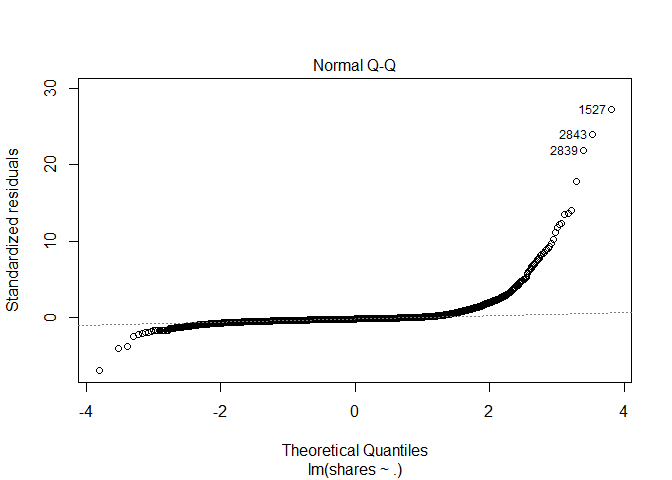<!-- -->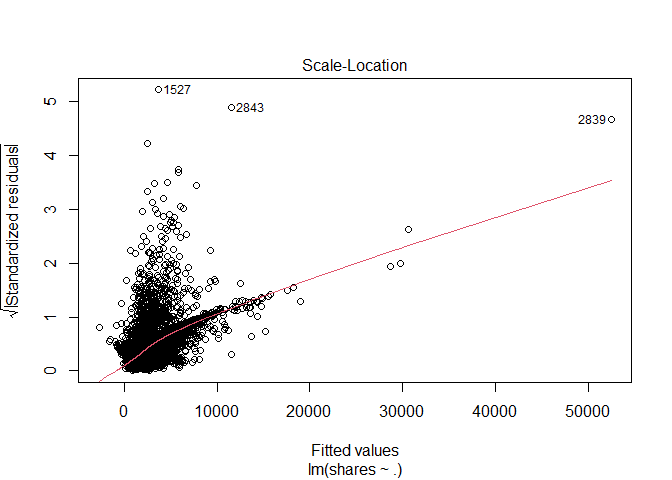<!-- -->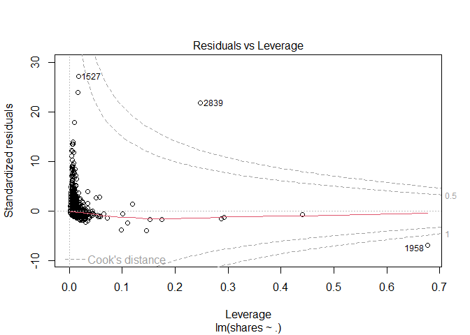<!-- -->

``` r
ggplot(data=fit_Channel, aes(y=shares, x=rate_positive_words)) + geom_point()
```

<!-- -->

``` r
#EDA
#starting point... correlation - shares vs. each var
#every pairwise combo
Channel_corr <- cor(x=Channel %>% 
                          select (shares, starts_with("weekday_is_") ) )
# cor_mat <- cor(data %>% select(RentedBikeCount, Temperature, Humidity, WindSpeed,
# Hour, Visibility, DewPointTemp,
# Rainfall, Snowfall), method = "pearson")
# corrplot(cor_mat, hc.order = TRUE,
# type = "lower",
# tl.pos = "lt",
# title = "Correlation Coefficients for Bike Rental Data",
# subtitle = "Correlation Coefficients for Bike Rental Data",
# mar=c(0,0,2,0)
# )
#call Channel_corr object to look at correlation between vars and shares response var
#drop to keep in matrix and not turn into a vector
shares_corr <- Channel_corr[ ,"shares", drop=FALSE]
#shares_corr <- Channel_corr[ ,"shares"]
is(shares_corr) #matrix with the drop=TRUE option
```

    ## [1] "matrix"    "array"     "mMatrix"   "structure" "vector"

``` r
#convert to tibble
#shares_corr_tibble <- as.tibble(shares_corr)
shares_corr_tibble <- bind_cols( var_names = rownames(shares_corr), shares_corr ) 
#call shares_corr_tibble object that has correlations with shares and vars...
shares_corr_tibble
```

    ## # A tibble: 8 × 2
    ##   var_names              shares
    ##   <chr>                   <dbl>
    ## 1 shares                1      
    ## 2 weekday_is_monday    -0.00245
    ## 3 weekday_is_tuesday   -0.0158 
    ## 4 weekday_is_wednesday -0.00699
    ## 5 weekday_is_thursday  -0.00516
    ## 6 weekday_is_friday     0.00155
    ## 7 weekday_is_saturday   0.0135 
    ## 8 weekday_is_sunday     0.0307

``` r
# condition on +/- 0.9 to see what we should remove as a predictor for the model
# call shares_corr_tibble object
#shares_corr_tibble #this currently does not have row names...
rownames(shares_corr)
```

    ## [1] "shares"               "weekday_is_monday"    "weekday_is_tuesday"  
    ## [4] "weekday_is_wednesday" "weekday_is_thursday"  "weekday_is_friday"   
    ## [7] "weekday_is_saturday"  "weekday_is_sunday"

``` r
#checking structure and type of object
#str(Channel_corr)
#is(Channel_corr)
#finds highly correlated variables and you can set a cutoff (default is +/ 0.9)
#convert to tibble because using drylr chaining / piping
corr_vars <- as.tibble ( Channel_corr[ ,"shares"] ) %>%
             filter ( abs(value) >= 0.9 )
#dont need this anymore...
#corr_vars <- findCorrelation(x=Can_corr, cutoff = +/- 0.9, verbose = TRUE, names = TRUE)
#call corr_vars object
#corr_vars
#columns that are highly correlated and should be removed from the model
#5 13 22
# [1] "n_non_stop_unique_tokens"  "kw_max_min" "self_reference_max_shares"
#response variable is shares, but what does that mean given certain variables available to us?
#maybe look at days of the week variables?
#figure out what kind of object we want to make to answer our question...
#tibble keeping what kind of vars, matrix?
#need to do some sort of type of EDA in order to see if variables are highly correlated
#here we need to summary statistics via summary() and plots
#this shows the summary stats for each variable in our dataset...
Lifestlye_sumstats_Train <- summary(ChannelTrain)
#calling Lifestlye_sumstats_Train object to see our summary stats
Lifestlye_sumstats_Train
```

    ##  n_tokens_title  n_tokens_content n_unique_tokens  n_non_stop_words
    ##  Min.   : 2.00   Min.   :   0.0   Min.   :0.0000   Min.   :0.0000  
    ##  1st Qu.:10.00   1st Qu.: 256.0   1st Qu.:0.4701   1st Qu.:1.0000  
    ##  Median :11.00   Median : 437.0   Median :0.5426   Median :1.0000  
    ##  Mean   :10.99   Mean   : 611.5   Mean   :0.5326   Mean   :0.9719  
    ##  3rd Qu.:12.00   3rd Qu.: 809.0   3rd Qu.:0.6169   3rd Qu.:1.0000  
    ##  Max.   :18.00   Max.   :6505.0   Max.   :0.9355   Max.   :1.0000  
    ##  n_non_stop_unique_tokens   num_hrefs      num_self_hrefs      num_imgs      
    ##  Min.   :0.0000           Min.   :  0.00   Min.   : 0.000   Min.   :  0.000  
    ##  1st Qu.:0.6228           1st Qu.:  4.00   1st Qu.: 1.000   1st Qu.:  1.000  
    ##  Median :0.6918           Median :  7.00   Median : 3.000   Median :  1.000  
    ##  Mean   :0.6724           Mean   : 10.68   Mean   : 3.469   Mean   :  6.237  
    ##  3rd Qu.:0.7604           3rd Qu.: 13.00   3rd Qu.: 5.000   3rd Qu.:  8.000  
    ##  Max.   :1.0000           Max.   :304.00   Max.   :40.000   Max.   :128.000  
    ##    num_videos     average_token_length  num_keywords   
    ##  Min.   : 0.000   Min.   :0.000        Min.   : 2.000  
    ##  1st Qu.: 0.000   1st Qu.:4.426        1st Qu.: 5.000  
    ##  Median : 1.000   Median :4.584        Median : 7.000  
    ##  Mean   : 2.549   Mean   :4.480        Mean   : 6.923  
    ##  3rd Qu.: 1.000   3rd Qu.:4.753        3rd Qu.: 8.000  
    ##  Max.   :74.000   Max.   :7.696        Max.   :10.000  
    ##  data_channel_is_lifestyle data_channel_is_entertainment data_channel_is_bus
    ##  Min.   :0                 Min.   :1                     Min.   :0          
    ##  1st Qu.:0                 1st Qu.:1                     1st Qu.:0          
    ##  Median :0                 Median :1                     Median :0          
    ##  Mean   :0                 Mean   :1                     Mean   :0          
    ##  3rd Qu.:0                 3rd Qu.:1                     3rd Qu.:0          
    ##  Max.   :0                 Max.   :1                     Max.   :0          
    ##  data_channel_is_socmed data_channel_is_tech data_channel_is_world
    ##  Min.   :0              Min.   :0            Min.   :0            
    ##  1st Qu.:0              1st Qu.:0            1st Qu.:0            
    ##  Median :0              Median :0            Median :0            
    ##  Mean   :0              Mean   :0            Mean   :0            
    ##  3rd Qu.:0              3rd Qu.:0            3rd Qu.:0            
    ##  Max.   :0              Max.   :0            Max.   :0            
    ##    kw_min_min       kw_max_min       kw_avg_min        kw_min_max    
    ##  Min.   : -1.00   Min.   :     0   Min.   :   -1.0   Min.   :     0  
    ##  1st Qu.: -1.00   1st Qu.:   417   1st Qu.:  123.7   1st Qu.:     0  
    ##  Median : -1.00   Median :   603   Median :  209.8   Median :  1500  
    ##  Mean   : 21.17   Mean   :  1030   Mean   :  282.6   Mean   : 13344  
    ##  3rd Qu.:  4.00   3rd Qu.:   924   3rd Qu.:  324.5   3rd Qu.: 11500  
    ##  Max.   :217.00   Max.   :138700   Max.   :34855.1   Max.   :210300  
    ##    kw_max_max       kw_avg_max       kw_min_avg     kw_max_avg    
    ##  Min.   :     0   Min.   :     0   Min.   :   0   Min.   :     0  
    ##  1st Qu.:843300   1st Qu.:180910   1st Qu.:   0   1st Qu.:  3655  
    ##  Median :843300   Median :233014   Median :1046   Median :  4427  
    ##  Mean   :765875   Mean   :243711   Mean   :1125   Mean   :  5582  
    ##  3rd Qu.:843300   3rd Qu.:304100   3rd Qu.:2072   3rd Qu.:  6010  
    ##  Max.   :843300   Max.   :670750   Max.   :3281   Max.   :138700  
    ##    kw_avg_avg    self_reference_min_shares self_reference_max_shares
    ##  Min.   :    0   Min.   :     0            Min.   :     0           
    ##  1st Qu.: 2543   1st Qu.:   698            1st Qu.:  1200           
    ##  Median : 2959   Median :  1100            Median :  2700           
    ##  Mean   : 3147   Mean   :  2657            Mean   :  8914           
    ##  3rd Qu.: 3541   3rd Qu.:  2000            3rd Qu.:  9100           
    ##  Max.   :36023   Max.   :143100            Max.   :837700           
    ##  self_reference_avg_sharess weekday_is_monday weekday_is_tuesday
    ##  Min.   :     0             Min.   :0.0000    Min.   :0.0000    
    ##  1st Qu.:  1036             1st Qu.:0.0000    1st Qu.:0.0000    
    ##  Median :  2050             Median :0.0000    Median :0.0000    
    ##  Mean   :  5002             Mean   :0.1872    Mean   :0.1852    
    ##  3rd Qu.:  4900             3rd Qu.:0.0000    3rd Qu.:0.0000    
    ##  Max.   :346100             Max.   :1.0000    Max.   :1.0000    
    ##  weekday_is_wednesday weekday_is_thursday weekday_is_friday weekday_is_saturday
    ##  Min.   :0.000        Min.   :0.0000      Min.   :0.000     Min.   :0.00000    
    ##  1st Qu.:0.000        1st Qu.:0.0000      1st Qu.:0.000     1st Qu.:0.00000    
    ##  Median :0.000        Median :0.0000      Median :0.000     Median :0.00000    
    ##  Mean   :0.187        Mean   :0.1759      Mean   :0.137     Mean   :0.05485    
    ##  3rd Qu.:0.000        3rd Qu.:0.0000      3rd Qu.:0.000     3rd Qu.:0.00000    
    ##  Max.   :1.000        Max.   :1.0000      Max.   :1.000     Max.   :1.00000    
    ##  weekday_is_sunday   is_weekend         LDA_00            LDA_01       
    ##  Min.   :0.00000   Min.   :0.0000   Min.   :0.01843   Min.   :0.01898  
    ##  1st Qu.:0.00000   1st Qu.:0.0000   1st Qu.:0.02506   1st Qu.:0.04141  
    ##  Median :0.00000   Median :0.0000   Median :0.03334   Median :0.44142  
    ##  Mean   :0.07286   Mean   :0.1277   Mean   :0.06506   Mean   :0.42407  
    ##  3rd Qu.:0.00000   3rd Qu.:0.0000   3rd Qu.:0.05000   3rd Qu.:0.73153  
    ##  Max.   :1.00000   Max.   :1.0000   Max.   :0.79221   Max.   :0.91998  
    ##      LDA_02            LDA_03            LDA_04        global_subjectivity
    ##  Min.   :0.01819   Min.   :0.01833   Min.   :0.01820   Min.   :0.0000     
    ##  1st Qu.:0.02501   1st Qu.:0.03369   1st Qu.:0.02500   1st Qu.:0.4122     
    ##  Median :0.03333   Median :0.25323   Median :0.03333   Median :0.4637     
    ##  Mean   :0.08919   Mean   :0.35815   Mean   :0.06352   Mean   :0.4526     
    ##  3rd Qu.:0.05015   3rd Qu.:0.69956   3rd Qu.:0.04049   3rd Qu.:0.5121     
    ##  Max.   :0.78708   Max.   :0.92554   Max.   :0.74302   Max.   :1.0000     
    ##  global_sentiment_polarity global_rate_positive_words
    ##  Min.   :-0.37766          Min.   :0.00000           
    ##  1st Qu.: 0.04826          1st Qu.:0.02941           
    ##  Median : 0.11100          Median :0.04049           
    ##  Mean   : 0.11213          Mean   :0.04043           
    ##  3rd Qu.: 0.17413          3rd Qu.:0.05147           
    ##  Max.   : 0.62500          Max.   :0.10510           
    ##  global_rate_negative_words rate_positive_words rate_negative_words
    ##  Min.   :0.00000            Min.   :0.0000      Min.   :0.0000     
    ##  1st Qu.:0.01087            1st Qu.:0.5778      1st Qu.:0.2000     
    ##  Median :0.01730            Median :0.6875      Median :0.3008     
    ##  Mean   :0.01913            Mean   :0.6648      Mean   :0.3071     
    ##  3rd Qu.:0.02482            3rd Qu.:0.7826      3rd Qu.:0.4074     
    ##  Max.   :0.09358            Max.   :1.0000      Max.   :1.0000     
    ##  avg_positive_polarity min_positive_polarity max_positive_polarity
    ##  Min.   :0.0000        Min.   :0.00000       Min.   :0.0000       
    ##  1st Qu.:0.3203        1st Qu.:0.05000       1st Qu.:0.6000       
    ##  Median :0.3729        Median :0.10000       Median :0.9000       
    ##  Mean   :0.3671        Mean   :0.09384       Mean   :0.8006       
    ##  3rd Qu.:0.4235        3rd Qu.:0.10000       3rd Qu.:1.0000       
    ##  Max.   :1.0000        Max.   :1.00000       Max.   :1.0000       
    ##  avg_negative_polarity min_negative_polarity max_negative_polarity
    ##  Min.   :-1.0000       Min.   :-1.0000       Min.   :-1.0000      
    ##  1st Qu.:-0.3675       1st Qu.:-0.8000       1st Qu.:-0.1250      
    ##  Median :-0.3000       Median :-0.6000       Median :-0.1000      
    ##  Mean   :-0.2933       Mean   :-0.5899       Mean   :-0.1097      
    ##  3rd Qu.:-0.2213       3rd Qu.:-0.4000       3rd Qu.:-0.0500      
    ##  Max.   : 0.0000       Max.   : 0.0000       Max.   : 0.0000      
    ##  title_subjectivity title_sentiment_polarity abs_title_subjectivity
    ##  Min.   :0.0000     Min.   :-1.00000         Min.   :0.0000        
    ##  1st Qu.:0.0000     1st Qu.: 0.00000         1st Qu.:0.1250        
    ##  Median :0.3000     Median : 0.00000         Median :0.4000        
    ##  Mean   :0.3156     Mean   : 0.06616         Mean   :0.3223        
    ##  3rd Qu.:0.5023     3rd Qu.: 0.16818         3rd Qu.:0.5000        
    ##  Max.   :1.0000     Max.   : 1.00000         Max.   :0.5000        
    ##  abs_title_sentiment_polarity     shares      
    ##  Min.   :0.000                Min.   :    47  
    ##  1st Qu.:0.000                1st Qu.:   833  
    ##  Median :0.075                Median :  1200  
    ##  Mean   :0.173                Mean   :  2958  
    ##  3rd Qu.:0.300                3rd Qu.:  2100  
    ##  Max.   :1.000                Max.   :210300

``` r
#check structure of objects
str(ChannelTrain)
```

    ## tibble [4,941 × 59] (S3: tbl_df/tbl/data.frame)
    ##  $ n_tokens_title               : num [1:4941] 12 9 14 12 11 5 11 10 6 7 ...
    ##  $ n_tokens_content             : num [1:4941] 219 531 194 161 454 356 281 909 241 376 ...
    ##  $ n_unique_tokens              : num [1:4941] 0.664 0.504 0.765 0.669 0.566 ...
    ##  $ n_non_stop_words             : num [1:4941] 1 1 1 1 1 ...
    ##  $ n_non_stop_unique_tokens     : num [1:4941] 0.815 0.666 0.84 0.752 0.755 ...
    ##  $ num_hrefs                    : num [1:4941] 4 9 4 5 5 3 5 3 5 3 ...
    ##  $ num_self_hrefs               : num [1:4941] 2 0 4 4 3 3 4 2 5 2 ...
    ##  $ num_imgs                     : num [1:4941] 1 1 0 0 1 12 1 1 1 0 ...
    ##  $ num_videos                   : num [1:4941] 0 0 1 6 0 1 0 1 0 11 ...
    ##  $ average_token_length         : num [1:4941] 4.68 4.4 4.52 4.45 4.89 ...
    ##  $ num_keywords                 : num [1:4941] 5 7 6 10 6 10 4 5 5 9 ...
    ##  $ data_channel_is_lifestyle    : num [1:4941] 0 0 0 0 0 0 0 0 0 0 ...
    ##  $ data_channel_is_entertainment: num [1:4941] 1 1 1 1 1 1 1 1 1 1 ...
    ##  $ data_channel_is_bus          : num [1:4941] 0 0 0 0 0 0 0 0 0 0 ...
    ##  $ data_channel_is_socmed       : num [1:4941] 0 0 0 0 0 0 0 0 0 0 ...
    ##  $ data_channel_is_tech         : num [1:4941] 0 0 0 0 0 0 0 0 0 0 ...
    ##  $ data_channel_is_world        : num [1:4941] 0 0 0 0 0 0 0 0 0 0 ...
    ##  $ kw_min_min                   : num [1:4941] 0 0 0 0 0 0 217 217 217 217 ...
    ##  $ kw_max_min                   : num [1:4941] 0 0 0 0 0 0 593 593 598 1200 ...
    ##  $ kw_avg_min                   : num [1:4941] 0 0 0 0 0 ...
    ##  $ kw_min_max                   : num [1:4941] 0 0 0 0 0 0 0 0 0 0 ...
    ##  $ kw_max_max                   : num [1:4941] 0 0 0 0 0 0 17100 17100 17100 17100 ...
    ##  $ kw_avg_max                   : num [1:4941] 0 0 0 0 0 ...
    ##  $ kw_min_avg                   : num [1:4941] 0 0 0 0 0 0 0 0 0 0 ...
    ##  $ kw_max_avg                   : num [1:4941] 0 0 0 0 0 ...
    ##  $ kw_avg_avg                   : num [1:4941] 0 0 0 0 0 ...
    ##  $ self_reference_min_shares    : num [1:4941] 496 0 6300 638 0 1700 951 20900 475 1100 ...
    ##  $ self_reference_max_shares    : num [1:4941] 496 0 6300 29200 0 2500 951 20900 4400 1100 ...
    ##  $ self_reference_avg_sharess   : num [1:4941] 496 0 6300 8261 0 ...
    ##  $ weekday_is_monday            : num [1:4941] 1 1 1 1 1 1 0 0 0 0 ...
    ##  $ weekday_is_tuesday           : num [1:4941] 0 0 0 0 0 0 1 1 0 0 ...
    ##  $ weekday_is_wednesday         : num [1:4941] 0 0 0 0 0 0 0 0 1 1 ...
    ##  $ weekday_is_thursday          : num [1:4941] 0 0 0 0 0 0 0 0 0 0 ...
    ##  $ weekday_is_friday            : num [1:4941] 0 0 0 0 0 0 0 0 0 0 ...
    ##  $ weekday_is_saturday          : num [1:4941] 0 0 0 0 0 0 0 0 0 0 ...
    ##  $ weekday_is_sunday            : num [1:4941] 0 0 0 0 0 0 0 0 0 0 ...
    ##  $ is_weekend                   : num [1:4941] 0 0 0 0 0 0 0 0 0 0 ...
    ##  $ LDA_00                       : num [1:4941] 0.5003 0.0286 0.0334 0.1258 0.2003 ...
    ##  $ LDA_01                       : num [1:4941] 0.3783 0.4193 0.0345 0.0203 0.3399 ...
    ##  $ LDA_02                       : num [1:4941] 0.04 0.4947 0.215 0.02 0.0333 ...
    ##  $ LDA_03                       : num [1:4941] 0.0413 0.0289 0.6837 0.8139 0.3931 ...
    ##  $ LDA_04                       : num [1:4941] 0.0401 0.0286 0.0333 0.02 0.0333 ...
    ##  $ global_subjectivity          : num [1:4941] 0.522 0.43 0.396 0.572 0.467 ...
    ##  $ global_sentiment_polarity    : num [1:4941] 0.0926 0.1007 0.3471 0.1662 0.1255 ...
    ##  $ global_rate_positive_words   : num [1:4941] 0.0457 0.0414 0.0567 0.0497 0.0441 ...
    ##  $ global_rate_negative_words   : num [1:4941] 0.0137 0.0207 0 0.0186 0.0132 ...
    ##  $ rate_positive_words          : num [1:4941] 0.769 0.667 1 0.727 0.769 ...
    ##  $ rate_negative_words          : num [1:4941] 0.231 0.333 0 0.273 0.231 ...
    ##  $ avg_positive_polarity        : num [1:4941] 0.379 0.386 0.545 0.427 0.363 ...
    ##  $ min_positive_polarity        : num [1:4941] 0.1 0.136 0.1 0.1 0.1 ...
    ##  $ max_positive_polarity        : num [1:4941] 0.7 0.8 1 0.85 1 1 0.5 1 0.5 0.8 ...
    ##  $ avg_negative_polarity        : num [1:4941] -0.35 -0.37 0 -0.364 -0.215 ...
    ##  $ min_negative_polarity        : num [1:4941] -0.6 -0.6 0 -0.8 -0.5 ...
    ##  $ max_negative_polarity        : num [1:4941] -0.2 -0.167 0 -0.125 -0.1 ...
    ##  $ title_subjectivity           : num [1:4941] 0.5 0 0.4 0.583 0.427 ...
    ##  $ title_sentiment_polarity     : num [1:4941] -0.188 0 0.1 0.25 0.168 ...
    ##  $ abs_title_subjectivity       : num [1:4941] 0 0.5 0.1 0.0833 0.0727 ...
    ##  $ abs_title_sentiment_polarity : num [1:4941] 0.188 0 0.1 0.25 0.168 ...
    ##  $ shares                       : num [1:4941] 593 1200 2100 1200 4600 631 1300 1700 6400 1900 ...

``` r
str(Lifestlye_sumstats_Train)
```

    ##  'table' chr [1:6, 1:59] "Min.   : 2.00  " "1st Qu.:10.00  " ...
    ##  - attr(*, "dimnames")=List of 2
    ##   ..$ : chr [1:6] "" "" "" "" ...
    ##   ..$ : chr [1:59] "n_tokens_title" "n_tokens_content" "n_unique_tokens" "n_non_stop_words" ...

``` r
#plots include - scatter plots, correlation plots -- plots for continuous data...
#do we need bar plots?
#A scatter plot with the number of shares on the y-axis and the positive word rate on the x-axis is created below
ggplot(data=ChannelTrain, aes(y=shares, x=rate_positive_words)) + geom_point()
```

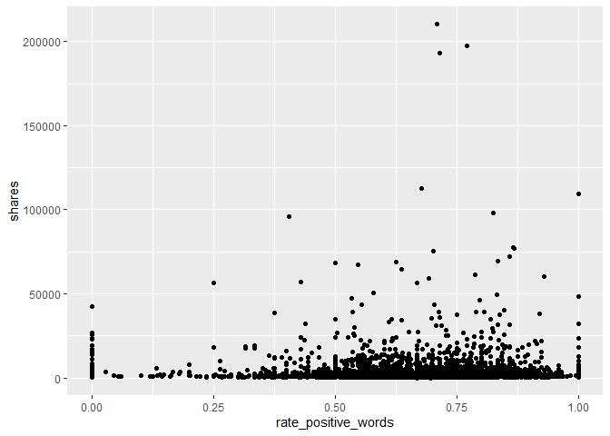<!-- -->
<!-- You’ll be automating the creation of documents using R Markdown (one for each data_channel_is_* setting, i.e. type of article in the data set provided). Each document should be rendered as a github_document from a single .Rmd file. In the README.md file you should create links to each of the documents you will create (Lifestyle analysis, Entertainment analysis, etc.). Links can be made to the sub-documents using relative -->
<!-- paths. For instance, if you have all of the outputted .md files in the main directory you would just use markdown linking: -->

<!-- - The analysis for [Lifestyle articles is available here](LifestyleAnalysis.html). Note we -->
<!-- link to the html file even though the file we create is a .md file - github creates the .html for us. -->
<!-- In the repo’s README.md file (which doesn’t need to be created from a .Rmd file, just use the one you initialize into the repo if you want) give a brief description of the purpose of the repo, a list of R packages used, links to the generated analyses, and the code used to create the analyses from a single .Rmd file (i.e. the render() code). -->

# Modelling

The data is already split into 70% training and 30% test. Our main goal
is to predict the number of shares. This will be our response variable.
We will create four models each using 5-fold cross-validation.

Two models (first linear and random forest) will be multiple linear
regression models, one will be a random forest model and the final model
will be a boosted tree model.

A Linear regression model is a supervised learning technique that is
used to predict the value of a variable based on the value of other
variable(s). The variable you want to predict is called the dependent
variable or the response. The variable(s) you are using to predict is
called the independent variable(s) or the predictor(s).

## First linear model.

We model the number of shares by the selected independent variables

-   “n_tokens_title” (Number of words in the title),

-   “n_tokens_content” (Number of words in the content)

-   “num_imgs” (Number of images)

-   “num_videos” (Number of videos)

-   “is_weekend” (Was the article published on the weekend?)

``` r
#linear regression model 1
l_m1 <- train(shares ~ n_tokens_title +  n_tokens_content + num_imgs + num_videos + 
                       is_weekend, 
              data = ChannelTrain, 
              method = "lm", 
              preProcess = c("center", "scale"),
              trControl = trainControl(method= "cv", number = 5))
#l_m1
#predicting on the ChannelTest data with linear regression model 1
test_pred_l_m1 <- predict(l_m1, newdata = ChannelTest)
#finding the best model - more explicit
m1 <- postResample(test_pred_l_m1, ChannelTest$shares)
m1
```

    ##         RMSE     Rsquared          MAE 
    ## 7.406041e+03 2.397379e-03 2.959776e+03

## Second linear model

We model the number of shares by the selected independent variables

-   “num_hrefs” (Number of links)

-   “weekday_is_monday” (Was the article published on a Monday?)

-   “weekday_is_tuesday” (Was the article published on a Tuesday?)

-   “weekday_is_wednesday” {Was the article published on a Wednesday?)

-   “weekday_is_thursday” (Was the article published on a Thursday?)

-   “weekday_is_friday” (Was the article published on a Friday?)

-   “self_reference_avg_sharess” (Avg. shares of referenced articles in
    Mashable)

``` r
#linear regression model 2
l_m2 <- train(shares ~ num_hrefs + weekday_is_monday + weekday_is_tuesday +
                       weekday_is_wednesday + weekday_is_thursday + weekday_is_friday +
                       self_reference_avg_sharess,
              data = ChannelTrain, 
              method = "lm", 
              preProcess = c("center", "scale"),
              trControl = trainControl(method= "cv", number = 5))
#predictions based on linear model 2 for the ChannelTest data
test_pred_l_m2 <- predict(l_m2, newdata = ChannelTest)
#best model chosen - RMSE reported explicity
#goal is to compare RMSE and see which one is the lowest!
m2 <- postResample(test_pred_l_m2, ChannelTest$shares)
m2
```

    ##         RMSE     Rsquared          MAE 
    ## 7.350320e+03 1.904407e-02 2.922560e+03

## Random forest model

The idea behind the random forest model is the same as bagging but we
use a random subset of predictors for each bootstrap sample tree fit
(indicated by “mtry”). More specifically, it involves creating a
boothstrap sample (same size with replacement), training the tree on
this sample (no pruning necessary), repeating the process a large number
of times and the final prediction is the average of those predictions.
Finding the average of predictions decreases variance which improves
predictions but unfortunately we lose interpretability.

For our random forest We model the number of shares by the selected
independent variables

-   “n_tokens_title” (Number of words in the title),

-   “n_tokens_content” (Number of words in the content)

-   “num_imgs” (Number of images)

-   “num_videos” (Number of videos)

-   “is_weekend” (Was the article published on the weekend?)

``` r
r_f <- train(shares ~ n_tokens_title +  n_tokens_content + num_imgs + num_videos + 
                      is_weekend , data = ChannelTrain, method = "rf",
  
             trControl=trainControl(method = "cv", number = 5),
             preProcess = c("center", "scale"),
             tuneGrid = data.frame(mtry = 1:3))
test_pred_r_f <- predict(r_f, newdata = ChannelTest)
m3 <- postResample(test_pred_r_f, ChannelTest$shares)
m3
```

    ##         RMSE     Rsquared          MAE 
    ## 7.408096e+03 5.230616e-03 2.922525e+03

``` r
#bootstrapping will take some time...
```

## Boosted tree model

The idea behind the boosting tree model is to train our tree slowly in a
sequential manner so each tree that is created will be based on the
previous one with predictions updated.

For our boosting tree we model the number of shares by the selected
independent variables

-   “num_hrefs” (Number of links)

-   “weekday_is_monday” (Was the article published on a Monday?)

-   “weekday_is_tuesday” (Was the article published on a Tuesday?)

-   “weekday_is_wednesday” {Was the article published on a Wednesday?)

-   “weekday_is_thursday” (Was the article published on a Thursday?)

-   “weekday_is_friday” (Was the article published on a Friday?)

-   “self_reference_avg_sharess” (Avg. shares of referenced articles in
    Mashable)

Additionally we choose to use all combinations of the tuning parameters
n.trees = c(25, 50, 100, 150, 200), interaction.depth = 1:4, shrinkage =
0.1 and n.minobsinnode = 10.

``` r
tune1<- c(25, 50, 100, 150, 200)
tune2<- 1:4
tune3<- 0.1
tune4<- 10
boosted <- train(shares ~ num_hrefs + weekday_is_monday + weekday_is_tuesday + weekday_is_wednesday + weekday_is_thursday + weekday_is_friday + self_reference_avg_sharess, 
data = ChannelTrain, method = "gbm",
 trControl=trainControl(method = "cv", number = 5),
 preProcess = c("center", "scale"),
 tuneGrid = expand.grid(n.trees = tune1, interaction.depth = tune2, shrinkage = tune3,    n.minobsinnode = tune4))
```

    ## Iter   TrainDeviance   ValidDeviance   StepSize   Improve
    ##      1 69449043.2328             nan     0.1000 58377.7660
    ##      2 69302203.9893             nan     0.1000 136670.3074
    ##      3 69122663.2674             nan     0.1000 15474.2974
    ##      4 68996421.8784             nan     0.1000 93947.2372
    ##      5 68922324.1366             nan     0.1000 68532.4796
    ##      6 68834894.2526             nan     0.1000 12053.3635
    ##      7 68749700.5403             nan     0.1000 56881.2065
    ##      8 68652511.6749             nan     0.1000 34720.2429
    ##      9 68614166.1907             nan     0.1000 -97671.7901
    ##     10 68554088.8698             nan     0.1000 12576.5601
    ##     20 68304802.2998             nan     0.1000 -59758.9942
    ##     40 68039481.2330             nan     0.1000 -15007.9617
    ##     60 67855974.2717             nan     0.1000 -33150.8837
    ##     80 67582365.7977             nan     0.1000 -77787.8734
    ##    100 67422217.5032             nan     0.1000 -31423.7149
    ##    120 67311823.6635             nan     0.1000 -5982.7717
    ##    140 67145251.8943             nan     0.1000 -27470.8638
    ##    160 66968527.2548             nan     0.1000 16619.5957
    ##    180 66818803.5360             nan     0.1000 -28555.4656
    ##    200 66690101.8751             nan     0.1000 -22495.8411
    ## 
    ## Iter   TrainDeviance   ValidDeviance   StepSize   Improve
    ##      1 69421927.3533             nan     0.1000 94132.6838
    ##      2 69180241.0676             nan     0.1000 55837.2837
    ##      3 69023167.7619             nan     0.1000 33099.3490
    ##      4 68541548.5137             nan     0.1000 -79981.9981
    ##      5 68353096.5640             nan     0.1000 -12865.4847
    ##      6 68201194.3393             nan     0.1000 67562.4213
    ##      7 68022390.9809             nan     0.1000 108192.9011
    ##      8 67833125.9657             nan     0.1000 -60704.5200
    ##      9 67622572.5065             nan     0.1000 -175587.0503
    ##     10 67537464.7772             nan     0.1000 12217.4998
    ##     20 66862048.8173             nan     0.1000 -677.4541
    ##     40 65704997.4460             nan     0.1000 -208352.3507
    ##     60 64733955.0324             nan     0.1000 -70592.0522
    ##     80 64091871.7544             nan     0.1000 -121189.2739
    ##    100 63572378.8418             nan     0.1000 -28858.7437
    ##    120 62886137.8013             nan     0.1000 -61455.9965
    ##    140 62358367.2166             nan     0.1000 -53109.8060
    ##    160 61898191.3162             nan     0.1000 -111831.5792
    ##    180 61332088.3395             nan     0.1000 -79024.1770
    ##    200 60782989.9766             nan     0.1000 -28094.2850
    ## 
    ## Iter   TrainDeviance   ValidDeviance   StepSize   Improve
    ##      1 68789460.7017             nan     0.1000 124940.9844
    ##      2 68394713.2267             nan     0.1000 87374.9417
    ##      3 68079823.1049             nan     0.1000 44035.6105
    ##      4 67972737.4800             nan     0.1000 36236.4899
    ##      5 67750562.3168             nan     0.1000 -90750.5258
    ##      6 67534602.6987             nan     0.1000 -52762.4567
    ##      7 67443660.4192             nan     0.1000 -45347.5163
    ##      8 67265647.7264             nan     0.1000 -48393.0144
    ##      9 67054933.4068             nan     0.1000 -158285.1728
    ##     10 66963579.9909             nan     0.1000 -66011.8251
    ##     20 65414348.5230             nan     0.1000 -8140.4273
    ##     40 63889554.4750             nan     0.1000 -4148.1446
    ##     60 62616608.8184             nan     0.1000 -96415.5779
    ##     80 61426864.9862             nan     0.1000 -67484.1607
    ##    100 60564390.5425             nan     0.1000 69514.0545
    ##    120 59657459.4216             nan     0.1000 -88379.1208
    ##    140 58896269.7166             nan     0.1000 12874.8297
    ##    160 58132805.4824             nan     0.1000 -72609.8162
    ##    180 57725775.7193             nan     0.1000 -90961.9075
    ##    200 56958254.4666             nan     0.1000 -126404.0860
    ## 
    ## Iter   TrainDeviance   ValidDeviance   StepSize   Improve
    ##      1 69348911.4150             nan     0.1000 195906.6470
    ##      2 69155797.9120             nan     0.1000 143024.1891
    ##      3 68570586.1998             nan     0.1000 351494.2325
    ##      4 68055514.4961             nan     0.1000 -51381.3883
    ##      5 67872860.0521             nan     0.1000 59511.3305
    ##      6 67758198.4608             nan     0.1000 1861.2080
    ##      7 67449369.5206             nan     0.1000 49064.4639
    ##      8 67093378.8564             nan     0.1000 19357.7015
    ##      9 66903855.5078             nan     0.1000 136571.2242
    ##     10 66627375.4517             nan     0.1000 2876.2234
    ##     20 65064898.2841             nan     0.1000 -133686.8410
    ##     40 62988142.9462             nan     0.1000 -235223.0223
    ##     60 61377987.2370             nan     0.1000 -186685.8975
    ##     80 59998445.0205             nan     0.1000 -223660.1889
    ##    100 58639531.2985             nan     0.1000 -192024.3692
    ##    120 57559268.3997             nan     0.1000 -134041.6925
    ##    140 56767696.2314             nan     0.1000 -185597.7506
    ##    160 55668919.2069             nan     0.1000 -128681.1308
    ##    180 55094434.8362             nan     0.1000 -117257.6748
    ##    200 54646905.4951             nan     0.1000 -98757.0764
    ## 
    ## Iter   TrainDeviance   ValidDeviance   StepSize   Improve
    ##      1 71542648.8737             nan     0.1000 121523.4624
    ##      2 71404170.4107             nan     0.1000 119300.3396
    ##      3 71246828.1868             nan     0.1000 89502.3200
    ##      4 71135364.2636             nan     0.1000 -5923.0811
    ##      5 71085406.1648             nan     0.1000 41320.5690
    ##      6 71027021.5536             nan     0.1000 72347.6154
    ##      7 70984210.6543             nan     0.1000 10369.9993
    ##      8 70890182.0718             nan     0.1000 7883.2086
    ##      9 70875243.4626             nan     0.1000 -28684.9156
    ##     10 70839592.1334             nan     0.1000 32324.7931
    ##     20 70409727.2862             nan     0.1000 -17022.7297
    ##     40 70106622.1361             nan     0.1000 -60694.4450
    ##     60 69944031.7176             nan     0.1000 -34801.1281
    ##     80 69736864.7288             nan     0.1000 -55431.7671
    ##    100 69578928.4302             nan     0.1000 -18028.2605
    ##    120 69420208.0088             nan     0.1000 -16292.6912
    ##    140 69272778.6973             nan     0.1000 -29392.8487
    ##    160 69090650.5429             nan     0.1000 -26127.8365
    ##    180 68952492.8561             nan     0.1000 -11603.7514
    ##    200 68829067.0732             nan     0.1000 -44539.4039
    ## 
    ## Iter   TrainDeviance   ValidDeviance   StepSize   Improve
    ##      1 71128466.2992             nan     0.1000 86013.0153
    ##      2 70860725.3372             nan     0.1000 90156.6051
    ##      3 70560213.0627             nan     0.1000 26160.5727
    ##      4 70425004.5857             nan     0.1000 -30457.6464
    ##      5 70316564.6777             nan     0.1000 50336.5808
    ##      6 70122953.3896             nan     0.1000 -12402.3466
    ##      7 69995423.6544             nan     0.1000 -86646.6367
    ##      8 69883652.6996             nan     0.1000 24634.6632
    ##      9 69697231.5940             nan     0.1000 34860.7516
    ##     10 69622954.0118             nan     0.1000 -26716.6376
    ##     20 68807971.7898             nan     0.1000 -105555.5304
    ##     40 67463666.5735             nan     0.1000 -62543.6816
    ##     60 66944576.3686             nan     0.1000 -94937.6146
    ##     80 66192988.3756             nan     0.1000 -75323.5710
    ##    100 65773638.7181             nan     0.1000 -127309.7672
    ##    120 65073704.9036             nan     0.1000 -330579.3074
    ##    140 64605469.4858             nan     0.1000 -51022.5513
    ##    160 64068435.6728             nan     0.1000 -55605.8497
    ##    180 63547131.7470             nan     0.1000 -295607.0744
    ##    200 63080687.9247             nan     0.1000 1378.2109
    ## 
    ## Iter   TrainDeviance   ValidDeviance   StepSize   Improve
    ##      1 71358639.1212             nan     0.1000 102777.9314
    ##      2 70909443.7881             nan     0.1000 81222.2318
    ##      3 70189552.7785             nan     0.1000 -118306.6788
    ##      4 69935349.7866             nan     0.1000 122025.3185
    ##      5 69780171.8365             nan     0.1000 -14383.1059
    ##      6 69615997.6936             nan     0.1000 -5091.0651
    ##      7 69560159.4668             nan     0.1000 -88523.4640
    ##      8 69387388.0046             nan     0.1000 -131272.0755
    ##      9 69168884.5135             nan     0.1000 -82013.0905
    ##     10 69073071.6045             nan     0.1000 -125661.3748
    ##     20 67579939.1487             nan     0.1000 -242782.4937
    ##     40 65542707.0002             nan     0.1000 -66299.1654
    ##     60 64394952.2375             nan     0.1000 -101228.1439
    ##     80 63416234.4009             nan     0.1000 -226519.6839
    ##    100 62428733.6474             nan     0.1000 -170994.1025
    ##    120 61548607.2824             nan     0.1000 -145205.9260
    ##    140 60844913.3787             nan     0.1000 -219698.5039
    ##    160 59936766.1158             nan     0.1000 -35886.2407
    ##    180 59283658.6832             nan     0.1000 -217219.7585
    ##    200 58503758.9624             nan     0.1000 -9083.2190
    ## 
    ## Iter   TrainDeviance   ValidDeviance   StepSize   Improve
    ##      1 71312309.5172             nan     0.1000 287328.7810
    ##      2 71004924.7283             nan     0.1000 45746.6709
    ##      3 70667031.0207             nan     0.1000 15902.0573
    ##      4 70512786.8091             nan     0.1000 74797.4802
    ##      5 70269712.3681             nan     0.1000 -9651.7739
    ##      6 69496197.5119             nan     0.1000 -36283.8009
    ##      7 69328539.5509             nan     0.1000 -15718.2829
    ##      8 69138743.7915             nan     0.1000 -23736.4337
    ##      9 68968194.5845             nan     0.1000 -61732.3995
    ##     10 68861017.2354             nan     0.1000 -62540.3991
    ##     20 67244898.0141             nan     0.1000 -190209.6082
    ##     40 64765371.9559             nan     0.1000 -98800.8626
    ##     60 63134781.3920             nan     0.1000 -41799.6610
    ##     80 61892516.0773             nan     0.1000 -57764.4088
    ##    100 61122516.7662             nan     0.1000 -49084.5240
    ##    120 59914129.6025             nan     0.1000 -122161.5765
    ##    140 59250153.3713             nan     0.1000 -64176.4789
    ##    160 58207402.2122             nan     0.1000 -96199.9214
    ##    180 57390048.3812             nan     0.1000 -153976.7246
    ##    200 56705719.1632             nan     0.1000 -112625.2308
    ## 
    ## Iter   TrainDeviance   ValidDeviance   StepSize   Improve
    ##      1 59803771.0841             nan     0.1000 78117.8533
    ##      2 59729638.5568             nan     0.1000 -12757.3119
    ##      3 59674499.3738             nan     0.1000 -17243.0269
    ##      4 59563871.1022             nan     0.1000 85245.7774
    ##      5 59481857.9356             nan     0.1000 27305.7554
    ##      6 59430597.5893             nan     0.1000 -5765.9965
    ##      7 59361102.9341             nan     0.1000 28756.3100
    ##      8 59332031.2786             nan     0.1000 -30229.1483
    ##      9 59261716.0844             nan     0.1000 -24791.4599
    ##     10 59236363.4722             nan     0.1000 16310.9910
    ##     20 59045059.8320             nan     0.1000 -34110.7964
    ##     40 58788278.9862             nan     0.1000 -14145.4043
    ##     60 58611374.1343             nan     0.1000 -23585.2740
    ##     80 58501431.2034             nan     0.1000 -48577.2473
    ##    100 58371770.9763             nan     0.1000 -19866.2149
    ##    120 58220518.6333             nan     0.1000 -3634.3940
    ##    140 58138929.0792             nan     0.1000 -85262.5391
    ##    160 57967773.4740             nan     0.1000 -24950.5534
    ##    180 57837341.7705             nan     0.1000  904.4618
    ##    200 57750403.0346             nan     0.1000 -13089.1887
    ## 
    ## Iter   TrainDeviance   ValidDeviance   StepSize   Improve
    ##      1 59703967.9025             nan     0.1000 51914.4330
    ##      2 59512651.4027             nan     0.1000 82966.9103
    ##      3 59422725.0550             nan     0.1000 55345.8311
    ##      4 59332505.3928             nan     0.1000 51064.3842
    ##      5 59226256.6655             nan     0.1000 -57165.9911
    ##      6 59191149.7570             nan     0.1000 -44028.1366
    ##      7 59115548.3945             nan     0.1000 22520.7824
    ##      8 59027975.3409             nan     0.1000 25674.1676
    ##      9 58944219.2766             nan     0.1000 -7850.9229
    ##     10 58865530.4611             nan     0.1000 -9027.1775
    ##     20 58308429.8500             nan     0.1000 -49062.8589
    ##     40 57569140.7412             nan     0.1000 -9405.2036
    ##     60 57172245.1118             nan     0.1000 -97023.5218
    ##     80 56667281.7192             nan     0.1000 -72841.3231
    ##    100 56358588.3987             nan     0.1000 -15905.2322
    ##    120 56006909.5613             nan     0.1000 -21324.1844
    ##    140 55551068.6836             nan     0.1000 -89440.1087
    ##    160 55283817.8591             nan     0.1000 -36326.7855
    ##    180 55092163.2539             nan     0.1000 -56131.5707
    ##    200 54808887.6199             nan     0.1000 -42438.1582
    ## 
    ## Iter   TrainDeviance   ValidDeviance   StepSize   Improve
    ##      1 59728563.1383             nan     0.1000 87989.7511
    ##      2 59568739.0869             nan     0.1000 43748.8619
    ##      3 59416626.3622             nan     0.1000 69436.4460
    ##      4 59275690.9172             nan     0.1000 31877.1794
    ##      5 59134445.2395             nan     0.1000 41345.4269
    ##      6 58973127.8488             nan     0.1000 -28840.9315
    ##      7 58857779.1868             nan     0.1000 -11560.9121
    ##      8 58747410.5817             nan     0.1000 -516.8346
    ##      9 58673861.4956             nan     0.1000 -23762.8371
    ##     10 58527684.2241             nan     0.1000 -109661.3409
    ##     20 57477556.2117             nan     0.1000 -35364.8349
    ##     40 56531365.0090             nan     0.1000 -31920.0896
    ##     60 55761428.9301             nan     0.1000 -49267.4184
    ##     80 55011279.8814             nan     0.1000 -99711.4845
    ##    100 54397673.5858             nan     0.1000 -93537.9223
    ##    120 53871607.9859             nan     0.1000 -98464.5379
    ##    140 53231071.9723             nan     0.1000 -55947.6582
    ##    160 52898059.3612             nan     0.1000 -67226.4885
    ##    180 52418520.9970             nan     0.1000 -45920.3852
    ##    200 52136255.9846             nan     0.1000 -73096.3545
    ## 
    ## Iter   TrainDeviance   ValidDeviance   StepSize   Improve
    ##      1 59545476.2289             nan     0.1000 107128.2507
    ##      2 59335212.3346             nan     0.1000 55525.5179
    ##      3 59175188.6355             nan     0.1000 -11166.6459
    ##      4 59003395.4105             nan     0.1000 67428.9884
    ##      5 58835088.4506             nan     0.1000 34208.7518
    ##      6 58625980.3307             nan     0.1000 -39437.0399
    ##      7 58417301.2306             nan     0.1000 -9322.0583
    ##      8 58247759.9070             nan     0.1000  450.3081
    ##      9 58090292.3077             nan     0.1000 -54235.5366
    ##     10 57883495.6606             nan     0.1000 -20603.2609
    ##     20 56915919.8112             nan     0.1000 -53156.7209
    ##     40 55370220.7749             nan     0.1000 -92063.3039
    ##     60 54465049.5729             nan     0.1000 -104533.9099
    ##     80 53670607.2607             nan     0.1000 -175730.8902
    ##    100 52837033.0995             nan     0.1000 -103192.5658
    ##    120 52105987.5297             nan     0.1000 -41342.5121
    ##    140 51552216.3256             nan     0.1000 -76679.3722
    ##    160 50980883.1260             nan     0.1000 -62274.0771
    ##    180 50401477.1502             nan     0.1000 -150051.9646
    ##    200 49807224.9712             nan     0.1000 -55194.3159
    ## 
    ## Iter   TrainDeviance   ValidDeviance   StepSize   Improve
    ##      1 71903641.8008             nan     0.1000 16767.1395
    ##      2 71728546.3663             nan     0.1000 97595.7615
    ##      3 71578153.6790             nan     0.1000 64007.9164
    ##      4 71450065.8244             nan     0.1000 28476.4621
    ##      5 71341115.1140             nan     0.1000 102793.6783
    ##      6 71284888.5316             nan     0.1000 12955.1894
    ##      7 71262963.1614             nan     0.1000 -18300.5617
    ##      8 71185330.7087             nan     0.1000 49675.7509
    ##      9 71101660.3921             nan     0.1000 48308.7020
    ##     10 71020169.2727             nan     0.1000 9175.4785
    ##     20 70664891.9222             nan     0.1000 -18944.5725
    ##     40 70304276.2728             nan     0.1000 1813.9429
    ##     60 70082796.3628             nan     0.1000 -120851.8598
    ##     80 69850286.1634             nan     0.1000 -31395.0273
    ##    100 69678295.0798             nan     0.1000 -19065.9983
    ##    120 69499694.4457             nan     0.1000 -94091.8947
    ##    140 69345927.6872             nan     0.1000 -107496.1131
    ##    160 69112189.8793             nan     0.1000 -91931.4652
    ##    180 69000790.1626             nan     0.1000 -26392.7580
    ##    200 68857136.6857             nan     0.1000 -58500.3463
    ## 
    ## Iter   TrainDeviance   ValidDeviance   StepSize   Improve
    ##      1 71627728.8734             nan     0.1000 229315.1321
    ##      2 71125064.2922             nan     0.1000 145860.8717
    ##      3 70977744.9503             nan     0.1000 -98552.9786
    ##      4 70560812.8644             nan     0.1000 91488.5583
    ##      5 70297383.7671             nan     0.1000 55520.4664
    ##      6 70114392.9302             nan     0.1000  658.6883
    ##      7 69969775.8620             nan     0.1000 -55039.7627
    ##      8 69909008.3674             nan     0.1000 49550.7899
    ##      9 69739354.2413             nan     0.1000 -32344.8678
    ##     10 69672689.4219             nan     0.1000 11284.3005
    ##     20 69159492.7233             nan     0.1000 -5797.0970
    ##     40 67951732.2372             nan     0.1000 -64487.5552
    ##     60 67410919.8496             nan     0.1000 -143539.3322
    ##     80 66670942.3692             nan     0.1000 -44435.1240
    ##    100 66027282.6878             nan     0.1000 -46437.4865
    ##    120 65262285.1631             nan     0.1000 -26700.7738
    ##    140 64769405.1304             nan     0.1000 -80264.1180
    ##    160 64164245.0505             nan     0.1000 -38167.8433
    ##    180 63692137.4143             nan     0.1000 -62430.2070
    ##    200 63195008.6621             nan     0.1000 -103252.2931
    ## 
    ## Iter   TrainDeviance   ValidDeviance   StepSize   Improve
    ##      1 71713440.5480             nan     0.1000 84442.8324
    ##      2 71436688.6136             nan     0.1000 -17661.9510
    ##      3 70946979.6488             nan     0.1000 61468.6907
    ##      4 70774909.8644             nan     0.1000 122683.6408
    ##      5 70445474.0172             nan     0.1000 14017.6715
    ##      6 70173928.1674             nan     0.1000 12762.8997
    ##      7 70023062.8895             nan     0.1000 -69316.6642
    ##      8 69953123.5085             nan     0.1000 14729.0944
    ##      9 69589627.8072             nan     0.1000 -129108.9721
    ##     10 69511001.9162             nan     0.1000 -19608.8198
    ##     20 68017103.9887             nan     0.1000 -238727.4047
    ##     40 66627442.4358             nan     0.1000 -88048.7372
    ##     60 65053156.7802             nan     0.1000 -60758.6187
    ##     80 64075857.9312             nan     0.1000 -137694.7418
    ##    100 63418335.3396             nan     0.1000 -125129.6630
    ##    120 62520803.4085             nan     0.1000 -151790.9394
    ##    140 61894930.1932             nan     0.1000 -31842.2838
    ##    160 60880467.5736             nan     0.1000 -64622.0220
    ##    180 60174467.0073             nan     0.1000 -96146.7269
    ##    200 59635790.6182             nan     0.1000 -77947.2383
    ## 
    ## Iter   TrainDeviance   ValidDeviance   StepSize   Improve
    ##      1 71423966.9549             nan     0.1000 86970.9738
    ##      2 70830049.7421             nan     0.1000 351486.7832
    ##      3 70542823.1197             nan     0.1000 100206.4890
    ##      4 69938142.1626             nan     0.1000 -27699.5963
    ##      5 69697320.6238             nan     0.1000 -47668.5850
    ##      6 69501080.7856             nan     0.1000 -49936.8736
    ##      7 69174863.4239             nan     0.1000 -174632.9780
    ##      8 69036735.7116             nan     0.1000 36209.6139
    ##      9 68834525.4356             nan     0.1000 -147665.6748
    ##     10 68645172.6469             nan     0.1000 -10493.4211
    ##     20 67154279.0667             nan     0.1000 -37457.1740
    ##     40 65272906.6714             nan     0.1000 -70353.4470
    ##     60 63647914.4252             nan     0.1000 -311234.6472
    ##     80 62139773.4636             nan     0.1000 -114518.6182
    ##    100 61052739.7050             nan     0.1000 -279787.7266
    ##    120 60227839.9089             nan     0.1000 -153589.0877
    ##    140 59081773.7552             nan     0.1000 -94779.0724
    ##    160 58494579.9883             nan     0.1000 -42886.5610
    ##    180 57512788.1625             nan     0.1000 -134012.3541
    ##    200 56750783.4377             nan     0.1000 -93143.7856
    ## 
    ## Iter   TrainDeviance   ValidDeviance   StepSize   Improve
    ##      1 49882441.7641             nan     0.1000 78914.2975
    ##      2 49761184.7154             nan     0.1000 62261.6810
    ##      3 49681794.8850             nan     0.1000 77662.4097
    ##      4 49615858.6079             nan     0.1000 60247.6917
    ##      5 49539649.6235             nan     0.1000 92324.0067
    ##      6 49426348.2885             nan     0.1000 79208.1494
    ##      7 49362290.1857             nan     0.1000 47704.6654
    ##      8 49298100.5141             nan     0.1000 -24196.2506
    ##      9 49251844.6184             nan     0.1000 31439.7138
    ##     10 49219244.9495             nan     0.1000 28217.4920
    ##     20 48898316.9552             nan     0.1000 -12186.1727
    ##     40 48710215.1108             nan     0.1000 -40839.3777
    ##     60 48577456.1235             nan     0.1000 -33139.2638
    ##     80 48411537.9532             nan     0.1000 -51927.7139
    ##    100 48270549.4697             nan     0.1000 -33175.0762
    ##    120 48139582.8230             nan     0.1000 -42920.4623
    ##    140 48002960.9597             nan     0.1000 -13202.3266
    ##    160 47850271.7547             nan     0.1000 -77839.2835
    ##    180 47739008.7653             nan     0.1000 -51737.8198
    ##    200 47601834.4271             nan     0.1000 -39042.4353
    ## 
    ## Iter   TrainDeviance   ValidDeviance   StepSize   Improve
    ##      1 49744995.4572             nan     0.1000 173218.7132
    ##      2 49593338.1593             nan     0.1000 -25296.7379
    ##      3 49325569.3285             nan     0.1000 148992.7062
    ##      4 49240087.1614             nan     0.1000 66920.0988
    ##      5 48989186.5632             nan     0.1000 -19833.9743
    ##      6 48679774.5966             nan     0.1000 -72773.3440
    ##      7 48367465.6641             nan     0.1000 -82929.4955
    ##      8 48239473.3436             nan     0.1000 -4779.8250
    ##      9 48164518.3270             nan     0.1000 -1798.4331
    ##     10 48117423.1309             nan     0.1000 3517.2365
    ##     20 47708172.6566             nan     0.1000  200.4323
    ##     40 46752909.3130             nan     0.1000 -171117.9558
    ##     60 46055038.0377             nan     0.1000 -167009.5211
    ##     80 45527285.8257             nan     0.1000 -101332.5406
    ##    100 45013193.0906             nan     0.1000 -38315.5658
    ##    120 44419876.4452             nan     0.1000 -122487.3646
    ##    140 43986916.9260             nan     0.1000 -19593.2421
    ##    160 43485562.0879             nan     0.1000 -66912.5151
    ##    180 42875658.6703             nan     0.1000 -51591.8935
    ##    200 42556696.8057             nan     0.1000 -13588.2943
    ## 
    ## Iter   TrainDeviance   ValidDeviance   StepSize   Improve
    ##      1 49649316.5902             nan     0.1000 50470.7539
    ##      2 49382574.8348             nan     0.1000 59031.3581
    ##      3 48744556.7909             nan     0.1000 40107.7481
    ##      4 48283078.5767             nan     0.1000 -21794.8982
    ##      5 48200224.3670             nan     0.1000 57387.7249
    ##      6 47918083.7486             nan     0.1000 -175775.6567
    ##      7 47873520.6570             nan     0.1000 2987.0700
    ##      8 47610265.4747             nan     0.1000 -74690.2107
    ##      9 47451055.9008             nan     0.1000 -96274.1410
    ##     10 47373987.1008             nan     0.1000 4762.1420
    ##     20 46549059.4913             nan     0.1000 -72640.2205
    ##     40 45268871.8900             nan     0.1000 -5810.6215
    ##     60 44063008.7401             nan     0.1000 -71734.2627
    ##     80 43322872.4748             nan     0.1000 -131700.9646
    ##    100 42741643.2521             nan     0.1000 -96539.3186
    ##    120 41873789.6086             nan     0.1000 -20112.8997
    ##    140 41094117.7197             nan     0.1000 -159932.1791
    ##    160 40548131.6290             nan     0.1000 -173623.9407
    ##    180 39647461.0567             nan     0.1000 -62793.3915
    ##    200 39219960.5417             nan     0.1000 -199665.9584
    ## 
    ## Iter   TrainDeviance   ValidDeviance   StepSize   Improve
    ##      1 49533215.5369             nan     0.1000 287040.0848
    ##      2 48991222.6615             nan     0.1000 5765.2045
    ##      3 48816437.0308             nan     0.1000 43556.5795
    ##      4 48679252.4517             nan     0.1000 4402.9057
    ##      5 48207718.1374             nan     0.1000 -72342.5283
    ##      6 48061353.0547             nan     0.1000 26822.8297
    ##      7 48013386.7997             nan     0.1000 10023.6977
    ##      8 47903878.1936             nan     0.1000 -150101.6156
    ##      9 47823546.6750             nan     0.1000 12284.8156
    ##     10 47777335.7144             nan     0.1000 -18308.2836
    ##     20 46646810.8583             nan     0.1000 -90836.0035
    ##     40 44752177.0461             nan     0.1000 -80596.3284
    ##     60 43555771.6721             nan     0.1000 -133599.3994
    ##     80 42710951.9325             nan     0.1000 -56481.7915
    ##    100 41622788.4255             nan     0.1000 -82938.2882
    ##    120 40664077.6467             nan     0.1000 -147257.8814
    ##    140 40057021.5738             nan     0.1000 -50396.3121
    ##    160 39637520.4367             nan     0.1000 -105832.5958
    ##    180 38947198.5941             nan     0.1000 -91023.2219
    ##    200 38213485.8568             nan     0.1000 -59018.2425
    ## 
    ## Iter   TrainDeviance   ValidDeviance   StepSize   Improve
    ##      1 64509553.8913             nan     0.1000 120784.6879
    ##      2 64355607.1474             nan     0.1000 39373.1845
    ##      3 64212121.3692             nan     0.1000 35546.4503
    ##      4 64116096.9775             nan     0.1000 49043.8797
    ##      5 64054975.7430             nan     0.1000 53309.8449
    ##      6 63931742.8256             nan     0.1000 25818.9826
    ##      7 63894120.7384             nan     0.1000 16490.7364
    ##      8 63829045.1489             nan     0.1000 21227.8960
    ##      9 63803670.5602             nan     0.1000 -8386.9759
    ##     10 63750745.4467             nan     0.1000 7442.5275
    ##     20 63505148.0427             nan     0.1000 -27930.8794
    ##     40 63280641.7068             nan     0.1000 -15701.4090
    ##     50 63172628.4097             nan     0.1000 -30579.2550

``` r
test_pred_boosted <- predict(boosted, newdata = ChannelTest)
m4 <- postResample(test_pred_boosted, ChannelTest$shares)
m4
```

    ##         RMSE     Rsquared          MAE 
    ## 7.327452e+03 2.370871e-02 2.957529e+03

Next we do a comparison of the four models

# Comaprison

The `postResample()` function was used to calculate useful statistics
such as rmse and R squared values for each one of the four models. We
summarize them in the tibble below.

``` r
lm1 <- tibble(model = c("First linear regression"), RMSE = c(m1[[1]]), R2 = c(m1[[2]]))
lm2 <- tibble(model = c("Second linear regression"), RMSE = c(m2[[1]]), R2 = c(m2[[2]]))
rf <- tibble(model = c("Random Forest"), RMSE = c(m3[[1]]), R2 = c(m3[[2]]))
Bos <- tibble(model = c("Boosting"), RMSE = c(m4[[1]]), R2 = c(m4[[2]]))
RMSE_table <- rbind(lm1, lm2, rf, Bos)
RMSE_table
```

    ## # A tibble: 4 × 3
    ##   model                     RMSE      R2
    ##   <chr>                    <dbl>   <dbl>
    ## 1 First linear regression  7406. 0.00240
    ## 2 Second linear regression 7350. 0.0190 
    ## 3 Random Forest            7408. 0.00523
    ## 4 Boosting                 7327. 0.0237

RMSE is a metric that tells us how far apart the predicted values are
from the observed values in a dataset, on average. The lower the RMSE,
the better a model fits a dataset.

R2 is a metric that tells us the proportion of the variance in the
response variable of a regression model that can be explained by the
predictor variables. This value ranges from 0 to 1. The higher the R2
value, the better a model fits a dataset.

From the table above the First linear regession model has the lowest
RMSE and the hightest R2 and is therefore our winner.

``` r
#pick the smallest RMSE for the best model...
final_result <- RMSE_table %>%
                filter ( min(RMSE) == RMSE )
final_result
```

    ## # A tibble: 1 × 3
    ##   model     RMSE     R2
    ##   <chr>    <dbl>  <dbl>
    ## 1 Boosting 7327. 0.0237

When comparing all 4 of our models, we are looking for the smallest
value of RMSE to tell us which model is the best. In this situation, we
can say that the smallest RMSE is 7327.4515775 and this comes from the
Boosting model.

<!-- # Project Work -->
<!-- The first step is for the first group member to create a github repo and add the second group member as a collaborator. The second group member then needs to accept the membership. This gives everyone access to push changes up to the repository. All project work should be done within this repo. -->
<!-- Each time you go to work on the project, you should pull down any of the latest changes using git pull. You should then upload any changes you’ve made via the usual workflow done previously. There may occasionally be merge conflicts that have to be dealt with. This can be done with the Git tab in RStudio. Let us know if you are having issues with conflicts that you can’t resolve! -->
<!-- # Repo Setting -->
<!-- On your project repo you should go into the settings and enable github pages (feel free to select a theme too!). This will make it so your repo can be accessed like your blog (username.github.io/repo-name). Be sure to choose the master or main branch as the one to use if you have choices there. -->
<!-- You’ll be automating the creation of documents using R Markdown (one for each data_channel_is_* setting, i.e. type of article in the data set provided). Each document should be rendered as a github_document from a single .Rmd file. In the README.md file you should create links to each of the documents you will create (Lifestyle analysis, Entertainment analysis, etc.). Links can be made to the sub-documents using relative -->
<!-- paths. For instance, if you have all of the outputted .md files in the main directory you would just use markdown linking: -->
<!-- - The analysis for [Lifestyle articles is available here](LifestyleAnalysis.html). Note we -->
<!-- link to the html file even though the file we create is a .md file - github creates the .html for us. -->
<!-- In the repo’s README.md file (which doesn’t need to be created from a .Rmd file, just use the one you initialize into the repo if you want) give a brief description of the purpose of the repo, a list of R packages used, links to the generated analyses, and the code used to create the analyses from a single .Rmd file (i.e. the render() code). -->

# Blog

Once you’ve completed the project each of you should write a brief blog
post outlining your project and two links to the
username.github.io/repo-name site and the repo itself (the username may
correspond to your partner). You should then also reflect on the process
you went through. Discuss the following:

-   what would you do differently?  
-   what was the most difficult part for you?  
-   what are your big take-aways from this project?

<!-- # Topic -->
<!-- What are you actually doing? You’ll read in and analyze an online news popularity data set. You’ll subset the data by data_channel_is_* (one of six groups). Then you’ll summarize the data and try to predict the number of shares using predictive models. -->
<!-- 1. Read in the OnlineNewsPopularity.csv data file -- subset for data_channel_is_lifestyle: Is data channel 'Lifestyle'? -->
<!-- Here, `read_csv()` is used to read in the OnlineNewsPopularity.csv data and we are subsetting for the `data_channel_is_lifestyle`: Is data channel 'Lifestyle'? variable.  -->
<!-- ``` {r, echo=TRUE, eval=TRUE} -->
<!-- #install one time thing -->
<!-- #install.packages("caret") -->
<!-- #read in data set .csv file in full -->
<!-- #OnlineNewsPopularity <- readr::read_csv(file="OnlineNewsPopularity.csv",  -->
<!-- #                                        show_col_types = FALSE) -->
<!-- ``` -->
<!-- ``` {r, echo=TRUE, eval=TRUE} -->
<!-- #subsetting the data for`data_channel_is_lifestyle`: Is data channel 'Lifestyle'? -->
<!-- #Lifestyle <- OnlineNewsPopularity %>%  -->
<!-- #              filter( data_channel_is_lifestyle == 1) -->
<!-- ``` -->
<!-- # Report -->
<!-- Recommendation: At first, consider just using data from a single data_channel_is_* source. Once you have all of the below steps done for that data, then you can automate it to work with any chosen data channel. Note: It may be easier to create a single variable representing the data channel when automating the subsetting (although there are many ways to do this).   -->
<!-- - All code chunks should be shown unless they are setup code chunks.   -->
<!-- # Introduction section -->
<!-- You should have an introduction section that briefly describes the data and the variables you have to work with (just discuss the ones you want to use). Your target variables is the shares variable. -->
<!-- You should also mention the purpose of your analysis and the methods you’ll use to model the response. You’ll describe those in more detail later. -->
<!-- **This section should be done by the ‘second’ group member.** -->
<!-- # Data -->
<!-- Use a relative path to import the data. Subset the data to work on the data channel of interest. -->
<!-- **This section should be done by whoever can get to it first.** -->

# Summarizations

You should produce some basic (but meaningful) summary statistics and
plots about the training data you are working with (especially as it
relates to your response).

As you will automate this same analysis across other data, you can’t
describe the trends you see in the graph (unless you want to try to
automate that!). You should describe what to look for in the summary
statistics/plots to help the reader understand the summary or graph. Ex:
A scatter plot with the number of shares on the y-axis and the positive
word rate on the x-axis is created:

‘We can inspect the trend of shares as a function of the positive word
rate. If the points show an upward trend, then articles with more
positive words tend to be shared more often. If we see a negative trend
then articles with more positive words tend to be shared less often.’

Each group member is responsible for producing some summary statistics
(means, sds, contingency tables, etc.) and for producing at least three
graphs (each) of the data.

# Modeling

You’ll need to split the data into a training (70% of the data) and test
set (30% of the data). Use set.seed() to make things reproducible.

The goal is to create models for predicting the number of shares in some
way. Each group member should contribute a linear regression model and
an ensemble tree-based model. As we are automating things, describing
the chosen model is tough, so no need to worry about that.

The first group member should fit a random forest model and the second
group member should fit a boosted tree model. Both models should be
chosen using cross-validation.

Prior to the models fit using linear regression, the first group member
should provide a short but thorough explanation of the idea of a linear
regression model.

Prior to each ensemble model, you should provide a short but reasonably
thorough explanation of the ensemble model you are using (so one for
each group member).

# Comparison

All four of the models should be compared on the test set and a winner
declared (this should be automated to be correct across all the created
documents).

This can be done by one group member and the automation done by the
other (see below).

# Automation

<!-- Once you’ve completed the above for a particular data channel, adapt the code so that you can use a parameter in your build process. You should be able to automatically generate an analysis report for each data_channel_is_* variable - although again, you may want to create a new variable to help with the subsetting. You’ll end up with six total outputted documents. -->
<!-- This should be done by the group member that doesn’t automate the comparison of models part. -->

# Submission

In the project submission, you should simply put a link to your blog
post (which will have a link to your github pages and github repo).

<!-- # Group Issues -->
<!-- Please notify me ASAP of any group member issues. You should look over your partner’s work/explanations and discuss that with them if you have any issues with what they’ve done. Both group members are graded on all the work done regardless of who was assigned to do it. -->
<!--
Rubric for Grading (total = 100 points)
Item                               Points           Notes
Introduction                       10               Worth either 0, 5, or 10
Data split                          5               Worth either 0 or 5
Summarizations & discussions       20               Worth either 0, 5,. . . , or 20
Modeling, selection, & discussion  35               Worth either 0, 5, . . . , 35
Test set prediction and automation 10               Worth either 0, 5, or 10
Automation                         15               Worth either 0, 5, 10, or 15
Blog post and repo setup           10               Worth either 0, 5, or 10
-->
<!--
Notes on grading:
• For each item in the rubric, your grade will be lowered one level for each each error (syntax, logical, or other) in the code and for each required item that is missing or lacking a description.  
• If your work was not completed and documented using your github repo you will lose 50
points on the project.  
• You should use Good Programming Practices when coding (see wolfware). If you do not follow GPP you can lose up to 40 points on the project.  
• You should use appropriate markdown options/formatting (you can lose up to 20 points) for not doing so.
-->
<!-- code needed to render pdf file -->
