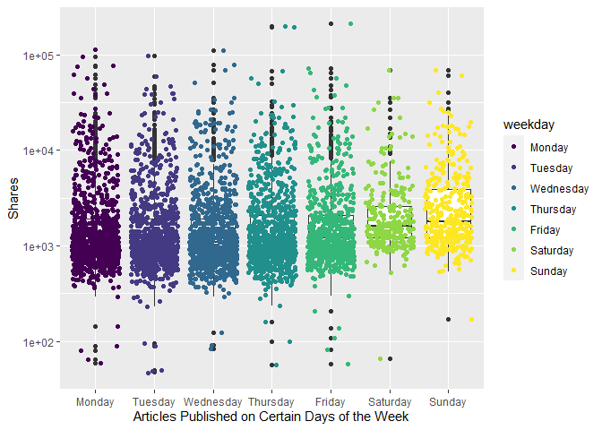
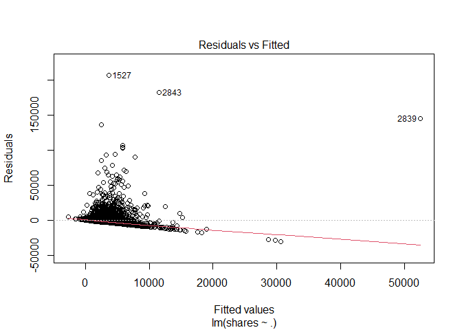

ST558 Project 3 Group F
================
Magaritte Nguyen and Matthew Sookoo
2022-11-12

-   <a href="#introduction" id="toc-introduction">Introduction</a>
    -   <a href="#more-about-the-variables"
        id="toc-more-about-the-variables">More about the variables</a>
        -   <a href="#response-variable" id="toc-response-variable">Response
            variable</a>
        -   <a href="#independent-or-predictor-variables"
            id="toc-independent-or-predictor-variables">Independent or predictor
            variables</a>
-   <a href="#required-packages" id="toc-required-packages">Required
    Packages</a>
-   <a href="#data" id="toc-data">Data</a>
    -   <a href="#reading-in-the-data" id="toc-reading-in-the-data">Reading in
        the data</a>
-   <a href="#eda-and-summarizations" id="toc-eda-and-summarizations">EDA
    and Summarizations</a>
-   <a href="#modelling" id="toc-modelling">Modelling</a>
    -   <a href="#first-linear-model" id="toc-first-linear-model">First linear
        model.</a>
    -   <a href="#second-linear-model" id="toc-second-linear-model">Second
        linear model</a>
    -   <a href="#random-forest-model" id="toc-random-forest-model">Random
        forest model</a>
    -   <a href="#boosted-tree-model" id="toc-boosted-tree-model">Boosted tree
        model</a>
-   <a href="#comaprison" id="toc-comaprison">Comaprison</a>
-   <a href="#blog" id="toc-blog">Blog</a>
-   <a href="#summarizations" id="toc-summarizations">Summarizations</a>
-   <a href="#modeling" id="toc-modeling">Modeling</a>
-   <a href="#comparison" id="toc-comparison">Comparison</a>
-   <a href="#automation" id="toc-automation">Automation</a>
-   <a href="#submission" id="toc-submission">Submission</a>

<!-- testing automation form yaml header -->
<!-- it works -->
<!-- 
############################################################# 
#############################################################
### Project 3 Group F
############################################################# 
############################################################# 
-->
<!-- setup -->

# Introduction

Our goal with this project is to take the data about articles published
by [Mashable](https://www.mashable.com) and create predictive models for
the number of shares in social networks (popularity) then automating our
Markdown reports.

This dataset summarizes a heterogeneous set of features in a period of
two years.

Then we will summarize the data and try to predict the number of shares
is two via linear regression models, a random forest model, and a
boosting model. Lastly we will compare the four models and declare a
winner (the model with the lowest root mean squared error).

The dataset we will be using is [Online News Popularity Data
Set](https://archive.ics.uci.edu/ml/datasets/Online+News+Popularity).

## More about the variables

The data contains 61 variables (58 predictive attributes, 2
non-predictive, 1 goal field) and we are interested in the number of
shares (goal) of the online news.

We only mention the variables we use in our project.

### Response variable

-   “shares” (Number of shares (target))

### Independent or predictor variables

-   “data_channel_is\_\*” (Lifestyle, Entertainment, Business, Social
    Media, Tech, World)

-   “n_tokens_title” (Number of words in the title),

-   “n_tokens_content” (Number of words in the content)

-   “num_imgs” (Number of images)

-   “num_videos” (Number of videos)

-   “is_weekend” (Was the article published on the weekend?)

-   “num_hrefs” (Number of links)

-   “weekday_is_monday” (Was the article published on a Monday?)

-   “weekday_is_tuesday” (Was the article published on a Tuesday?)

-   “weekday_is_wednesday” {Was the article published on a Wednesday?)

-   “weekday_is_thursday” (Was the article published on a Thursday?)

-   “weekday_is_friday” (Was the article published on a Friday?)

-   “self_reference_avg_sharess” (Avg. shares of referenced articles in
    Mashable)

# Required Packages

The following packages are used for our data manipulation, prediction,
etc.:

-   `tidyverse`: Tons of useful features for data manipulation and
    visualization!
-   `caret`: Used for predictive modelling.
-   `shiny`: makes it easy to build interactive web apps straight from R
-   `rmarkdown`: create dynamic analysis documents that combine codes
    and rendered output
-   `corrplot` :

<!-- packages that we installed and are calling via library() function -->

# Data

## Reading in the data

Firstly we set up a relative path, then We read in the
OnlineNewsPopularity.csv data file found
[here](https://archive.ics.uci.edu/ml/datasets/Online+News+Popularity)
using `read_csv()`.

``` r
getwd()
```

    ## [1] "C:/Users/Home Pc/Desktop/ST558 Project 3 new/ST558_Project3_GroupF"

``` r
OnlineNewsPopularity <- read_csv("./OnlineNewsPopularity.csv", show_col_types = FALSE)
#call object OnlineNewsPopularity - our full raw data
OnlineNewsPopularity
```

    ## # A tibble: 39,644 × 61
    ##    url   timed…¹ n_tok…² n_tok…³ n_uni…⁴ n_non…⁵ n_non…⁶ num_h…⁷ num_s…⁸ num_i…⁹
    ##    <chr>   <dbl>   <dbl>   <dbl>   <dbl>   <dbl>   <dbl>   <dbl>   <dbl>   <dbl>
    ##  1 http…     731      12     219   0.664    1.00   0.815       4       2       1
    ##  2 http…     731       9     255   0.605    1.00   0.792       3       1       1
    ##  3 http…     731       9     211   0.575    1.00   0.664       3       1       1
    ##  4 http…     731       9     531   0.504    1.00   0.666       9       0       1
    ##  5 http…     731      13    1072   0.416    1.00   0.541      19      19      20
    ##  6 http…     731      10     370   0.560    1.00   0.698       2       2       0
    ##  7 http…     731       8     960   0.418    1.00   0.550      21      20      20
    ##  8 http…     731      12     989   0.434    1.00   0.572      20      20      20
    ##  9 http…     731      11      97   0.670    1.00   0.837       2       0       0
    ## 10 http…     731      10     231   0.636    1.00   0.797       4       1       1
    ## # … with 39,634 more rows, 51 more variables: num_videos <dbl>,
    ## #   average_token_length <dbl>, num_keywords <dbl>,
    ## #   data_channel_is_lifestyle <dbl>, data_channel_is_entertainment <dbl>,
    ## #   data_channel_is_bus <dbl>, data_channel_is_socmed <dbl>,
    ## #   data_channel_is_tech <dbl>, data_channel_is_world <dbl>, kw_min_min <dbl>,
    ## #   kw_max_min <dbl>, kw_avg_min <dbl>, kw_min_max <dbl>, kw_max_max <dbl>,
    ## #   kw_avg_max <dbl>, kw_min_avg <dbl>, kw_max_avg <dbl>, kw_avg_avg <dbl>, …

We now subset the data for the data channel of interest:
data_channel_is_lifestyle: Is data channel ’’?

``` r
#subsetting the OnlineNewsPopularity full raw data for the data channel of interest -- Lifestyle
Channel <- OnlineNewsPopularity %>% 
               #filter(data_channel_is_lifestyle == 1) %>%
               filter(get(params$channel) == 1) %>%
               # removing non-predictive variables per dataset description
               # remove all data_channel_is_* variables because we already filtered on them and we do not want them included in the model!
               #select( ! c(url, timedelta, starts_with("data_channel_is_" ) ) )
                select( ! c(url, timedelta ) )
#tidyverse way of looking at the dataset -- similar to str()
#glimpse(Channel)
#calling the Channel object to view
Channel
```

    ## # A tibble: 2,099 × 59
    ##    n_tokens_ti…¹ n_tok…² n_uni…³ n_non…⁴ n_non…⁵ num_h…⁶ num_s…⁷ num_i…⁸ num_v…⁹
    ##            <dbl>   <dbl>   <dbl>   <dbl>   <dbl>   <dbl>   <dbl>   <dbl>   <dbl>
    ##  1             8     960   0.418    1.00   0.550      21      20      20       0
    ##  2            10     187   0.667    1.00   0.800       7       0       1       0
    ##  3            11     103   0.689    1.00   0.806       3       1       1       0
    ##  4            10     243   0.619    1.00   0.824       1       1       0       0
    ##  5             8     204   0.586    1.00   0.698       7       2       1       0
    ##  6            11     315   0.551    1.00   0.702       4       4       1       0
    ##  7            10    1190   0.409    1.00   0.561      25      24      20       0
    ##  8             6     374   0.641    1.00   0.828       7       0       1       0
    ##  9            12     499   0.513    1.00   0.662      14       1       1       0
    ## 10            11     223   0.662    1.00   0.826       5       3       0       0
    ## # … with 2,089 more rows, 50 more variables: average_token_length <dbl>,
    ## #   num_keywords <dbl>, data_channel_is_lifestyle <dbl>,
    ## #   data_channel_is_entertainment <dbl>, data_channel_is_bus <dbl>,
    ## #   data_channel_is_socmed <dbl>, data_channel_is_tech <dbl>,
    ## #   data_channel_is_world <dbl>, kw_min_min <dbl>, kw_max_min <dbl>,
    ## #   kw_avg_min <dbl>, kw_min_max <dbl>, kw_max_max <dbl>, kw_avg_max <dbl>,
    ## #   kw_min_avg <dbl>, kw_max_avg <dbl>, kw_avg_avg <dbl>, …

``` r
#testing
#correct - we expect 2099 vars
table(Channel[[params$channel]])
```

    ## 
    ##    1 
    ## 2099

# EDA and Summarizations

Now we split the data set we’ve created into a 70% training set called
“ChannelTrain” and a 30% testing set called “ChannelTest”. We will be
using the `caret` package with p = 0.7 to achieve the 70% training and
30% testing split.

Note: A seed was set for reproducibility purposes.

``` r
#seed is set for reproducibility 
set.seed(123)

ChannelIndex <- createDataPartition(Channel$shares, p = 0.70, list = FALSE)
#subset
ChannelTrain <- Channel[ ChannelIndex, ]
ChannelTest  <- Channel[-ChannelIndex, ]
```

<!-- You should produce some basic (but meaningful) summary statistics and plots about the training data you are working with (especially as it relates to your response). -->
<!-- As you will automate this same analysis across other data, you can’t describe the trends you see in the graph (unless you want to try to automate that!). You should describe what to look for in the summary statistics/plots to help the reader understand the summary or graph. Ex: A scatter plot with the number of shares on the y-axis and the positive word rate on the x-axis is created: -->
<!-- 'We can inspect the trend of shares as a function of the positive word rate. If the points -->
<!-- show an upward trend, then articles with more positive words tend to be shared more often. -->
<!-- If we see a negative trend then articles with more positive words tend to be shared less often.' -->
<!-- Each group member is responsible for producing some summary statistics (means, sds, contingency tables, etc.) and for producing at least three graphs (each) of the data. -->

We begin by doing some exploratory data analysis(EDA). It should be
noted that for the following EDA and summaries we use our training data.

lets begin by Plotting the correlation between a few notable numeric
variables.

``` r
cor_mat <- cor(ChannelTrain %>% select(shares, n_tokens_title, n_tokens_content, num_imgs, num_videos, num_hrefs), method = "pearson")

corrplot(cor_mat, hc.order = TRUE,
type = "lower",
tl.pos = "lt",
title = "Correlation Coefficients plot",
subtitle = "Correlation Coefficients plot",
mar=c(0,0,2,0)
)
```

<!-- -->

From the above we note that none of our selected variables share a
correlation with the number of shares.

Next lets create a few scatter plots to get a visual of the data.

We start by examining Trend of Number of words in the content vs Number
of shares, Trend of Number of images vs Number of shares, Trend of
Number of videos vs Number of shares and Trend of Number of links vs
Number of shares.

``` r
ggplot(data = ChannelTrain, aes(y = shares, x = n_tokens_content)) +
geom_point(aes(color = num_imgs)) +
geom_smooth(method = "lm") +
ggtitle("Trend of Number of words in the content vs Number of shares")
```

<!-- -->

``` r
ggplot(data = ChannelTrain, aes(y = shares, x = num_imgs)) +
geom_point(aes(color = n_tokens_content)) +
geom_smooth(method = "lm") +
ggtitle("Trend of Number of images vs Number of shares")
```

<!-- -->

``` r
ggplot(data = ChannelTrain, aes(y = shares, x = num_videos)) +
geom_point(aes(color = n_tokens_content)) +
geom_smooth(method = "lm") +
ggtitle("Trend of Number of videos vs Number of shares")
```

<!-- -->

``` r
ggplot(data = ChannelTrain, aes(y = shares, x = num_hrefs)) +
geom_point(aes(color = n_tokens_content)) +
geom_smooth(method = "lm") +
ggtitle("Trend of Number of links vs Number of shares")
```

<!-- -->

From the four plots above we can see that the number of words in the
content, number or images, number of videos and the number of links in
the online news had little or no effect on the number of shares as they
all show a weak trend.

The following tibble shows the mean and standard deviation statistics
concerning training data for a number of variables.

``` r
meanSD1 <- tibble(Variable = c("Number of shares"), Mean = c(mean(ChannelTrain$shares)), std_dev = c(sd(ChannelTrain$shares)))

meanSD2 <- tibble(Variable = c("Number of words in the title"), Mean = c(mean(ChannelTrain$n_tokens_title)), std_dev = c(sd(ChannelTrain$n_tokens_title)))

meanSD3 <- tibble(Variable = c("Number of words in the content"), Mean = c(mean(ChannelTrain$n_tokens_content)), std_dev = c(sd(ChannelTrain$n_tokens_content)))

meanSD4 <- tibble(Variable = c("Number of images"), Mean = c(mean(ChannelTrain$num_imgs)), std_dev = c(sd(ChannelTrain$num_imgs)))

meanSD5 <- tibble(Variable = c("Number of videos"), Mean = c(mean(ChannelTrain$num_videos)), std_dev = c(sd(ChannelTrain$num_videos)))


rbind(meanSD1, meanSD2, meanSD3, meanSD4, meanSD5)
```

    ## # A tibble: 5 × 3
    ##   Variable                           Mean std_dev
    ##   <chr>                             <dbl>   <dbl>
    ## 1 Number of shares               3737.    8796.  
    ## 2 Number of words in the title      9.76     1.89
    ## 3 Number of words in the content  633.     592.  
    ## 4 Number of images                  5.06     8.71
    ## 5 Number of videos                  0.485    2.08

Next we use the `summary()` function on some more of our variables of
interest to get statistics

``` r
# 31. weekday_is_monday: Was the article published on a Monday?
summary(ChannelTrain$weekday_is_monday)
```

    ##    Min. 1st Qu.  Median    Mean 3rd Qu.    Max. 
    ##  0.0000  0.0000  0.0000  0.1508  0.0000  1.0000

``` r
# 32. weekday_is_tuesday: Was the article published on a Tuesday?
summary(ChannelTrain$weekday_is_tuesday)
```

    ##    Min. 1st Qu.  Median    Mean 3rd Qu.    Max. 
    ##   0.000   0.000   0.000   0.163   0.000   1.000

``` r
# 33. weekday_is_wednesday: Was the article published on a Wednesday?
summary(ChannelTrain$weekday_is_wednesday)
```

    ##    Min. 1st Qu.  Median    Mean 3rd Qu.    Max. 
    ##  0.0000  0.0000  0.0000  0.1882  0.0000  1.0000

``` r
# 34. weekday_is_thursday: Was the article published on a Thursday?
summary(ChannelTrain$weekday_is_thursday)
```

    ##    Min. 1st Qu.  Median    Mean 3rd Qu.    Max. 
    ##  0.0000  0.0000  0.0000  0.1651  0.0000  1.0000

``` r
# 35. weekday_is_friday: Was the article published on a Friday?
summary(ChannelTrain$weekday_is_friday)
```

    ##    Min. 1st Qu.  Median    Mean 3rd Qu.    Max. 
    ##  0.0000  0.0000  0.0000  0.1433  0.0000  1.0000

``` r
# 36. weekday_is_saturday: Was the article published on a Saturday?
summary(ChannelTrain$weekday_is_saturday)
```

    ##    Min. 1st Qu.  Median    Mean 3rd Qu.    Max. 
    ##  0.0000  0.0000  0.0000  0.0856  0.0000  1.0000

``` r
# 37. weekday_is_sunday: Was the article published on a Sunday?
summary(ChannelTrain$weekday_is_sunday)
```

    ##    Min. 1st Qu.  Median    Mean 3rd Qu.    Max. 
    ##  0.0000  0.0000  0.0000  0.1039  0.0000  1.0000

``` r
# 38. is_weekend: Was the article published on the weekend? 
summary(ChannelTrain$is_weekend)
```

    ##    Min. 1st Qu.  Median    Mean 3rd Qu.    Max. 
    ##  0.0000  0.0000  0.0000  0.1895  0.0000  1.0000

``` r
# 60. shares: Number of shares (target)
summary(ChannelTrain$shares)
```

    ##    Min. 1st Qu.  Median    Mean 3rd Qu.    Max. 
    ##      78    1100    1700    3737    3225  208300

Next we create some contingency tables.

``` r
weekend <- table(ChannelTrain$is_weekend)
weekend
```

    ## 
    ##    0    1 
    ## 1193  279

The above table shows that for our training data 279 online news
articles were shared during the weekend and 1193 were shared during the
week.

``` r
mon_tue <- table(ChannelTrain$weekday_is_monday, ChannelTrain$weekday_is_tuesday)
mon_tue
```

    ##    
    ##        0    1
    ##   0 1010  240
    ##   1  222    0

From the above table we see that for our training data 222 online news
articles were shared on a Monday, 240 were shared on a Tuesday and 1010
were shared the rest of the week.

Since Monday is considered the beginning of the work week, it is worth
considering how monday “stacks up with the other days. For the
contingency tables below, we can use a similar interpretation as we did
for the previous table.

``` r
table(ChannelTrain$weekday_is_monday, ChannelTrain$weekday_is_wednesday)
```

    ##    
    ##       0   1
    ##   0 973 277
    ##   1 222   0

``` r
table(ChannelTrain$weekday_is_monday, ChannelTrain$weekday_is_thursday)
```

    ##    
    ##        0    1
    ##   0 1007  243
    ##   1  222    0

``` r
table(ChannelTrain$weekday_is_monday, ChannelTrain$weekday_is_friday)
```

    ##    
    ##        0    1
    ##   0 1039  211
    ##   1  222    0

``` r
table(ChannelTrain$weekday_is_monday, ChannelTrain$weekday_is_saturday)
```

    ##    
    ##        0    1
    ##   0 1124  126
    ##   1  222    0

``` r
table(ChannelTrain$weekday_is_monday, ChannelTrain$weekday_is_sunday)
```

    ##    
    ##        0    1
    ##   0 1097  153
    ##   1  222    0

Next we create some box plots.

``` r
# Magaritte EXPLAIN THIS

plot_data_weekday_weekend <- ChannelTrain %>%
                               mutate ( weekday = case_when(
                                          weekday_is_monday    == 1 ~ "Monday"   ,
                                          weekday_is_tuesday   == 1 ~ "Tuesday"  ,
                                          weekday_is_wednesday == 1 ~ "Wednesday",
                                          weekday_is_thursday  == 1 ~ "Thursday" ,
                                          weekday_is_friday    == 1 ~ "Friday"   ,
                                          weekday_is_saturday  == 1 ~ "Saturday" ,
                                          weekday_is_sunday    == 1 ~ "Sunday"   ,
                                          TRUE ~ NA_character_
                                      ),
                                        weekday = factor(
                                          x = weekday,
                                          levels = c("Monday", "Tuesday", "Wednesday",
                                                     "Thursday", "Friday", "Saturday",
                                                     "Sunday"),
                                          ordered = TRUE
                                          ) )

#A scatter plot with the number of shares on the y-axis and the positive word rate on the x-axis is created below
ggplot(data=plot_data_weekday_weekend, 
            aes(y=shares, x=weekday)) + 
            labs(x="Articles Published on Certain Days of the Week", y="Shares") +
            geom_boxplot() + scale_y_log10() +
            geom_point(aes(color=weekday), position="jitter") 
```

<!-- -->

``` r
# when we take the log of the data, we can see easier... Poisson...
# plot scatter after boxplot because we want to see where the majority of the dots are...
#total articles published is actually higher Monday and fewer on the weekend. but boxplots look like they are lower on the weekdays because more articles are published but less shares are occurring...
#plots - scatter plot with boxplot overlayed
# 31. weekday_is_monday: Was the article published on a Monday?
#this one doesnt work bc we need levels...
#ggplot(data=ChannelTrain, aes(y=shares, x=weekday_is_monday)) + geom_point()
# the y - axis is using a log axis not a linear axis, but the plots are more easily interpretable /  visually more ituitive with this transformation.
ggplot(data=ChannelTrain %>% 
              mutate(weekday_fctr = factor(x=weekday_is_monday,  
              levels=c(0,1), labels = c("No", "Yes"))), 
            aes(y=shares, x=weekday_fctr)) + 
            labs(x="Articles Published on Monday", y="Shares", color = "Published") +
            geom_boxplot() + scale_y_log10() +
            geom_point(aes(color=weekday_fctr), position="jitter", alpha=0.4) 
```

<!-- -->

``` r
# 32. weekday_is_tuesday: Was the article published on a Tuesday
ggplot(data=ChannelTrain %>% 
              mutate(weekday_fctr = factor(x=weekday_is_tuesday,  
              levels=c(0,1), labels = c("No", "Yes"))), 
            aes(y=shares, x=weekday_fctr)) + 
            labs(x="Articles Published on Tuesday", y="Shares", color = "Published") +
            geom_boxplot() + scale_y_log10() +
            geom_point(aes(color=weekday_fctr), position="jitter", alpha=0.4) 
```

<!-- -->

``` r
# 33. weekday_is_wednesday: Was the article published on a Wednesday?
ggplot(data=ChannelTrain %>% 
              mutate(weekday_fctr = factor(x=weekday_is_wednesday,  
              levels=c(0,1), labels = c("No", "Yes"))), 
            aes(y=shares, x=weekday_fctr)) + 
            labs(x="Articles Published on Wednesday", y="Shares", color = "Published") +
            geom_boxplot() + scale_y_log10() +
            geom_point(aes(color=weekday_fctr), position="jitter", alpha=0.4) 
```

<!-- -->

``` r
# 34. weekday_is_thursday: Was the article published on a Thursday?
ggplot(data=ChannelTrain %>% 
              mutate(weekday_fctr = factor(x=weekday_is_thursday,  
              levels=c(0,1), labels = c("No", "Yes"))), 
            aes(y=shares, x=weekday_fctr)) + 
            labs(x="Articles Published on Thursday", y="Shares", color = "Published") +
            geom_boxplot() + scale_y_log10() +
            geom_point(aes(color=weekday_fctr), position="jitter", alpha=0.4) 
```

<!-- -->

``` r
# 35. weekday_is_friday: Was the article published on a Friday?
ggplot(data=ChannelTrain %>% 
              mutate(weekday_fctr = factor(x=weekday_is_friday,  
              levels=c(0,1), labels = c("No", "Yes"))), 
            aes(y=shares, x=weekday_fctr)) + 
            labs(x="Articles Published on Friday", y="Shares", color = "Published") +
            geom_boxplot() + scale_y_log10() +
            geom_point(aes(color=weekday_fctr), position="jitter", alpha=0.4) 
```

<!-- -->

``` r
# 36. weekday_is_saturday: Was the article published on a Saturday?
ggplot(data=ChannelTrain %>% 
              mutate(weekday_fctr = factor(x=weekday_is_saturday,  
              levels=c(0,1), labels = c("No", "Yes"))), 
            aes(y=shares, x=weekday_fctr)) + 
            labs(x="Articles Published on Saturday", y="Shares", color = "Published") +
            geom_boxplot() + scale_y_log10() +
            geom_point(aes(color=weekday_fctr), position="jitter", alpha=0.4) 
```

<!-- -->

``` r
# 37. weekday_is_sunday: Was the article published on a Sunday?
ggplot(data=ChannelTrain %>% 
              mutate(weekday_fctr = factor(x=weekday_is_sunday,  
              levels=c(0,1), labels = c("No", "Yes"))), 
            aes(y=shares, x=weekday_fctr)) + 
            labs(x="Articles Published on Sunday", y="Shares", color = "Published") +
            geom_boxplot() + scale_y_log10() +
            geom_point(aes(color=weekday_fctr), position="jitter", alpha=0.4) 
```

<!-- -->

``` r
# # 38. is_weekend: Was the article published on the weekend? 
# ggplot(data=ChannelTrain %>% 
#               mutate(weekday_fctr = factor(x=is_weekend,  
#               levels=c(0,1), labels = c("No", "Yes"))), 
#             aes(y=shares, x=weekday_fctr)) + 
#             labs(x="Articles Published on Monday", y="Shares", color = "Published") +
#             geom_boxplot() + scale_y_log10() +
#             geom_point(aes(color=weekday_fctr), position="jitter") 
# i can make conclusions based on summary() median, min, max, bc i trasfomred for visibility
```

The y - axis is using a log axis not a linear axis, but the plots are
more easily interpretable / visually more intuitive with this
transformation.The general shape of the plots is correct.

We can inspect the trend of shares as a function of the different days
of the week that the articles are published.

If you see a presence of outliers, this may cause the mean to shift in
that direction, but the meidan will not be effected as much. If you see
that the median is not centered within the box, then there is a presence
of skewness in that particular direction. Also, if you see that there
are more observations / dots on one graph while comparing publication
(Yes/No), this is meaningful within the plot itself and also across the
different days of the week.

<!-- might use this later dont delete yet -->

``` r
#what question are we trying to answer here? 
# how to predict shares given the variables you have...
#fitting the model
fit_Channel <- lm(shares ~ . , data = Channel)
#call fit_Lifestyle object - remember this is an lm object
fit_Channel
```

    ## 
    ## Call:
    ## lm(formula = shares ~ ., data = Channel)
    ## 
    ## Coefficients:
    ##                   (Intercept)                 n_tokens_title  
    ##                     2.249e+03                      2.910e+01  
    ##              n_tokens_content                n_unique_tokens  
    ##                     1.650e+00                     -8.000e+03  
    ##              n_non_stop_words       n_non_stop_unique_tokens  
    ##                    -1.041e+04                      1.427e+04  
    ##                     num_hrefs                 num_self_hrefs  
    ##                     4.133e+01                     -7.506e+01  
    ##                      num_imgs                     num_videos  
    ##                     5.173e+00                      3.972e+02  
    ##          average_token_length                   num_keywords  
    ##                     3.340e+02                     -2.418e+01  
    ##     data_channel_is_lifestyle  data_channel_is_entertainment  
    ##                            NA                             NA  
    ##           data_channel_is_bus         data_channel_is_socmed  
    ##                            NA                             NA  
    ##          data_channel_is_tech          data_channel_is_world  
    ##                            NA                             NA  
    ##                    kw_min_min                     kw_max_min  
    ##                    -1.843e+00                     -4.735e-02  
    ##                    kw_avg_min                     kw_min_max  
    ##                    -9.214e-02                      2.788e-03  
    ##                    kw_max_max                     kw_avg_max  
    ##                    -1.731e-04                     -7.468e-03  
    ##                    kw_min_avg                     kw_max_avg  
    ##                    -6.368e-01                     -1.732e-01  
    ##                    kw_avg_avg      self_reference_min_shares  
    ##                     1.695e+00                      1.140e-01  
    ##     self_reference_max_shares     self_reference_avg_sharess  
    ##                     2.759e-02                     -9.217e-02  
    ##             weekday_is_monday             weekday_is_tuesday  
    ##                     9.411e+02                      6.334e+02  
    ##          weekday_is_wednesday            weekday_is_thursday  
    ##                    -4.440e+02                      7.004e+01  
    ##             weekday_is_friday            weekday_is_saturday  
    ##                    -4.492e+02                      1.966e+02  
    ##             weekday_is_sunday                     is_weekend  
    ##                            NA                             NA  
    ##                        LDA_00                         LDA_01  
    ##                     2.059e+02                     -1.960e+03  
    ##                        LDA_02                         LDA_03  
    ##                    -1.441e+03                      6.243e+02  
    ##                        LDA_04            global_subjectivity  
    ##                            NA                      1.615e+03  
    ##     global_sentiment_polarity     global_rate_positive_words  
    ##                    -6.048e+03                      2.233e+04  
    ##    global_rate_negative_words            rate_positive_words  
    ##                    -1.892e+04                     -1.228e+03  
    ##           rate_negative_words          avg_positive_polarity  
    ##                            NA                      6.238e+03  
    ##         min_positive_polarity          max_positive_polarity  
    ##                    -4.847e+02                     -2.394e+03  
    ##         avg_negative_polarity          min_negative_polarity  
    ##                    -3.113e+02                      5.118e+02  
    ##         max_negative_polarity             title_subjectivity  
    ##                    -1.226e+01                      3.021e+02  
    ##      title_sentiment_polarity         abs_title_subjectivity  
    ##                     3.167e+01                      1.791e+03  
    ##  abs_title_sentiment_polarity  
    ##                    -3.445e+02

``` r
# check fit_Lifestyle attributes
attributes(fit_Channel)
```

    ## $names
    ##  [1] "coefficients"  "residuals"     "effects"       "rank"         
    ##  [5] "fitted.values" "assign"        "qr"            "df.residual"  
    ##  [9] "xlevels"       "call"          "terms"         "model"        
    ## 
    ## $class
    ## [1] "lm"

``` r
fit_Channel[["residuals"]]
```

    ##             1             2             3             4             5 
    ##  2.623737e+02 -2.596619e+02  4.356289e+03 -2.062321e+03  2.950396e+03 
    ##             6             7             8             9            10 
    ## -9.815427e+02 -1.442163e+02 -1.513422e+03 -8.389649e+02  2.356625e+02 
    ##            11            12            13            14            15 
    ##  7.813427e+02  1.683956e+03  1.967492e+03  1.559147e+02  1.305700e+03 
    ##            16            17            18            19            20 
    ## -1.063319e+03  1.698740e+03 -1.070673e+03  1.601029e+03  2.050881e+03 
    ##            21            22            23            24            25 
    ## -1.258797e+03 -7.777051e+02 -9.645957e+02 -1.430050e+03  1.194733e+03 
    ##            26            27            28            29            30 
    ##  4.127788e+03  9.418014e+03  1.065346e+04  1.552507e+03  5.205587e+02 
    ##            31            32            33            34            35 
    ##  9.559453e+02 -4.264267e+02  3.335751e+03 -1.194753e+03  3.037449e-01 
    ##            36            37            38            39            40 
    ## -7.457170e+02  1.480452e+04  3.997552e+02  7.120565e+03  1.703822e+02 
    ##            41            42            43            44            45 
    ##  3.070808e+04 -2.099420e+03 -2.112978e+03  3.143767e+03 -3.902286e+03 
    ##            46            47            48            49            50 
    ##  2.649774e+02 -2.409570e+03 -2.294906e+03 -1.166203e+03 -3.939137e+03 
    ##            51            52            53            54            55 
    ## -1.488107e+03 -1.472338e+03 -2.662379e+03  1.013588e+03 -4.280964e+03 
    ##            56            57            58            59            60 
    ## -9.269867e+02 -3.153720e+03 -2.796840e+03 -1.045337e+03  8.026986e+02 
    ##            61            62            63            64            65 
    ## -3.005912e+03  6.267751e+03 -1.208734e+03 -1.832459e+03  1.446680e+03 
    ##            66            67            68            69            70 
    ## -1.234841e+03 -2.210514e+03 -3.257914e+03 -1.317067e+03 -9.771981e+02 
    ##            71            72            73            74            75 
    ## -3.716868e+02 -1.250150e+03  3.265883e+02  1.213746e+04  3.330969e+03 
    ##            76            77            78            79            80 
    ##  1.554767e+03 -1.179989e+03  1.080647e+03 -2.269517e+02 -3.454982e+02 
    ##            81            82            83            84            85 
    ##  1.924756e+03 -3.128937e+03 -4.152309e+02 -2.160020e+03 -1.389778e+03 
    ##            86            87            88            89            90 
    ## -2.043382e+03 -2.621171e+03 -3.752406e+03 -1.630284e+03 -4.720324e+03 
    ##            91            92            93            94            95 
    ## -1.544709e+03 -3.003054e+03 -9.493881e+02 -5.439245e+02  1.266897e+03 
    ##            96            97            98            99           100 
    ##  8.210350e+02 -1.779079e+03 -2.237071e+03 -6.513396e+02 -2.511686e+03 
    ##           101           102           103           104           105 
    ## -2.948527e+03  5.275678e+03  7.430243e+02  1.200411e+03  9.542464e+03 
    ##           106           107           108           109           110 
    ## -2.303160e+03 -3.592159e+03 -1.547322e+01 -2.923312e+03  8.006376e+02 
    ##           111           112           113           114           115 
    ## -1.109027e+03 -7.068403e+02 -2.798347e+01 -3.280573e+03 -4.594674e+03 
    ##           116           117           118           119           120 
    ## -2.354828e+03 -2.225076e+03 -3.196038e+03  7.239943e+03 -1.640423e+03 
    ##           121           122           123           124           125 
    ## -1.253442e+03 -4.504533e+01 -3.019400e+03 -1.077150e+03 -2.338491e+03 
    ##           126           127           128           129           130 
    ## -3.545477e+03 -1.122827e+03  1.028877e+04  5.313437e+02 -9.102788e+02 
    ##           131           132           133           134           135 
    ## -4.324440e+02 -8.486363e+02 -5.987562e+02 -2.616063e+03 -2.128426e+03 
    ##           136           137           138           139           140 
    ## -2.930617e+03  4.645477e+03 -2.343580e+03  4.428374e+02 -2.759769e+03 
    ##           141           142           143           144           145 
    ##  2.927012e+02 -8.425289e+02 -1.434454e+03 -4.408280e+03 -2.796224e+03 
    ##           146           147           148           149           150 
    ##  7.581431e+02  3.094336e+03  5.727995e+03 -3.024712e+03 -3.005921e+03 
    ##           151           152           153           154           155 
    ## -3.498478e+03 -2.821134e+03 -2.577530e+03 -4.835333e+03 -4.867023e+03 
    ##           156           157           158           159           160 
    ##  7.600388e+03 -1.717091e+03  7.876876e+02  7.044876e+02  1.700037e+04 
    ##           161           162           163           164           165 
    ##  2.092101e+03  2.144117e+03  2.190304e+03 -3.104528e+03 -8.348520e+02 
    ##           166           167           168           169           170 
    ##  5.807264e+03  8.816624e+01 -2.025550e+03 -1.105113e+03 -1.675431e+03 
    ##           171           172           173           174           175 
    ## -1.268565e+03 -2.850977e+02 -3.023176e+03  2.806106e+03  5.668584e+02 
    ##           176           177           178           179           180 
    ## -6.822987e+02 -3.272581e+02 -2.439612e+03 -5.491718e+02 -2.018032e+03 
    ##           181           182           183           184           185 
    ##  1.197121e+03 -5.986788e+02  5.353930e+02 -4.641250e+03 -1.007321e+03 
    ##           186           187           188           189           190 
    ## -4.062922e+03 -3.669869e+03 -2.880799e+03 -5.007901e+03 -2.012793e+03 
    ##           191           192           193           194           195 
    ##  4.398811e+02 -1.127523e+03 -1.605537e+03 -3.062336e+02 -4.754782e+02 
    ##           196           197           198           199           200 
    ## -9.031588e+02 -3.146965e+03 -2.774191e+03 -2.046880e+02  3.788048e+03 
    ##           201           202           203           204           205 
    ## -3.490260e+03 -1.683883e+03 -1.575758e+03 -1.640679e+03 -3.129401e+03 
    ##           206           207           208           209           210 
    ## -2.717292e+03 -5.013164e+03 -1.793520e+02 -3.640868e+03 -2.827498e+03 
    ##           211           212           213           214           215 
    ## -1.956300e+03  4.174281e+02  3.339646e+03  2.447951e+03 -9.099914e+02 
    ##           216           217           218           219           220 
    ## -2.751238e+03  1.060725e+03 -2.719691e+02 -1.068270e+03  1.168069e+04 
    ##           221           222           223           224           225 
    ## -1.931773e+03  2.120871e+03 -9.451662e+02 -1.731672e+03  1.093096e+04 
    ##           226           227           228           229           230 
    ##  1.935616e+03  1.010345e+04 -1.886371e+03 -1.425538e+03 -1.769389e+03 
    ##           231           232           233           234           235 
    ##  9.390939e+02  1.743280e+03 -2.697206e+03 -2.694325e+03 -4.030538e+02 
    ##           236           237           238           239           240 
    ##  2.976230e+03 -3.518422e+03  1.219776e+03 -7.585957e+02  1.286724e+03 
    ##           241           242           243           244           245 
    ## -3.040720e+03 -3.986926e+03 -1.638960e+03 -5.203500e+02 -1.841944e+03 
    ##           246           247           248           249           250 
    ##  2.007949e+02 -2.026262e+03  1.529277e+03 -7.368063e+02 -3.586206e+03 
    ##           251           252           253           254           255 
    ##  1.761240e+03 -5.072186e+03  3.184381e+04 -1.538226e+03 -6.906431e+02 
    ##           256           257           258           259           260 
    ## -3.763004e+03  6.378562e+01  5.132509e+02  1.774592e+01 -1.574771e+03 
    ##           261           262           263           264           265 
    ##  1.557275e+04 -2.641585e+03 -3.067935e+02 -1.693441e+03 -1.414721e+03 
    ##           266           267           268           269           270 
    ## -2.378000e+02 -1.353804e+03 -7.214140e+02 -3.303007e+03 -3.337179e+02 
    ##           271           272           273           274           275 
    ## -9.436807e+01  3.430788e+03 -4.078239e+03 -4.773377e+03 -4.635404e+02 
    ##           276           277           278           279           280 
    ## -2.038803e+03 -2.549417e+03  1.947354e+03 -1.323519e+03 -3.616251e+02 
    ##           281           282           283           284           285 
    ## -3.557428e+03 -2.366308e+03  6.901984e+02 -2.095879e+03 -1.301347e+03 
    ##           286           287           288           289           290 
    ## -2.915460e+03  2.198755e+02 -1.506853e+03 -2.594583e+03 -1.813404e+02 
    ##           291           292           293           294           295 
    ## -5.396970e+01  1.381800e+02 -1.746539e+03  2.560773e+02 -2.769684e+03 
    ##           296           297           298           299           300 
    ## -1.131426e+03 -1.435505e+03 -1.981005e+02 -3.252479e+02  1.078284e+04 
    ##           301           302           303           304           305 
    ##  7.200703e+02  4.529123e+02  3.268136e+03 -2.591774e+03 -1.979000e+02 
    ##           306           307           308           309           310 
    ## -3.284394e+03 -2.317012e+03  4.849159e+03  3.470706e+03 -4.669075e+02 
    ##           311           312           313           314           315 
    ##  1.433929e+03  1.048107e+04  1.646352e+03  5.027116e+03 -8.960255e+02 
    ##           316           317           318           319           320 
    ##  3.216563e+03  4.286402e+03 -6.322973e+02  1.600522e+03 -1.223270e+03 
    ##           321           322           323           324           325 
    ## -6.803130e+02 -1.098116e+03  5.096576e+03  2.172798e+01  2.299741e+03 
    ##           326           327           328           329           330 
    ##  1.647681e+03  2.049175e+03 -5.231735e+03  5.548354e+02  4.391992e+03 
    ##           331           332           333           334           335 
    ## -7.734043e+02 -3.333206e+03 -2.316134e+03 -3.619153e+03 -3.529999e+03 
    ##           336           337           338           339           340 
    ## -2.917945e+03 -2.959103e+03 -2.316114e+03 -1.909953e+03 -6.754531e+02 
    ##           341           342           343           344           345 
    ## -2.730874e+03  6.112410e+01  6.174060e+03 -1.951490e+03 -1.387040e+03 
    ##           346           347           348           349           350 
    ## -1.789142e+03  1.398193e+03 -1.656229e+03  3.189076e+04  3.348647e+03 
    ##           351           352           353           354           355 
    ## -1.639626e+03 -1.231528e+03  7.203607e+02  4.278473e+02 -3.777868e+03 
    ##           356           357           358           359           360 
    ## -8.127838e+02  1.550919e+01  6.086582e+02  4.063435e+00 -2.711927e+03 
    ##           361           362           363           364           365 
    ## -6.241171e+02 -1.050281e+03  8.066323e+01 -2.781335e+03  1.379206e+03 
    ##           366           367           368           369           370 
    ## -3.589362e+03 -1.237276e+03  4.216983e+03 -3.361373e+03  1.194211e+03 
    ##           371           372           373           374           375 
    ##  1.034426e+02  1.231831e+04  2.480271e+02  2.055586e+03 -3.988632e+02 
    ##           376           377           378           379           380 
    ## -1.154752e+02 -4.649775e+03  8.315759e+02 -2.622121e+02 -2.004217e+03 
    ##           381           382           383           384           385 
    ## -1.634808e+03  7.942543e+02 -3.115405e+03 -9.356698e+02 -4.488500e+02 
    ##           386           387           388           389           390 
    ## -1.061424e+03 -4.072833e+03  1.316317e+03 -2.364133e+03 -1.592340e+03 
    ##           391           392           393           394           395 
    ## -1.800004e+03 -2.960748e+03  5.875888e+03  6.122952e+02 -2.168208e+03 
    ##           396           397           398           399           400 
    ## -6.641670e+02 -1.653221e+03  8.179868e+02  2.304648e+03 -5.197536e+03 
    ##           401           402           403           404           405 
    ## -7.225504e+02 -5.170806e+02 -3.381199e+03 -1.777779e+03 -5.567419e+02 
    ##           406           407           408           409           410 
    ##  6.740089e+02 -1.356813e+03 -1.786761e+03  1.141149e+02  8.212331e+02 
    ##           411           412           413           414           415 
    ## -6.441549e+02  1.647278e+03 -2.003075e+03 -7.153564e+02  3.306421e+03 
    ##           416           417           418           419           420 
    ## -1.522472e+03 -2.044918e+03 -1.659344e+03  3.066314e+02 -3.811467e+03 
    ##           421           422           423           424           425 
    ## -2.446880e+03 -2.164639e+03 -1.468906e+03 -2.334883e+03 -1.426675e+03 
    ##           426           427           428           429           430 
    ##  2.640560e+03 -1.303674e+03 -1.746483e+03 -1.829428e+03 -1.631123e+03 
    ##           431           432           433           434           435 
    ##  9.082367e+02 -2.319353e+02  1.931662e+04  3.766616e+01  2.357734e+04 
    ##           436           437           438           439           440 
    ## -2.011328e+03 -1.937653e+02 -1.689633e+03 -4.128358e+02 -9.740505e+02 
    ##           441           442           443           444           445 
    ## -9.032359e+02 -1.837209e+03 -3.715321e+03  1.482275e+03 -2.979688e+03 
    ##           446           447           448           449           450 
    ## -7.083035e+03 -1.124207e+03 -6.548616e+02 -1.636680e+03 -3.389419e+03 
    ##           451           452           453           454           455 
    ##  3.445121e+03 -4.887278e+03 -1.588327e+03 -2.446871e+02  3.131460e+03 
    ##           456           457           458           459           460 
    ##  1.508302e+03  1.116258e+04  4.502397e+03 -1.371462e+03  5.601181e+02 
    ##           461           462           463           464           465 
    ## -1.003735e+03 -1.027332e+03 -6.037609e+02  9.105751e+02  3.329571e+02 
    ##           466           467           468           469           470 
    ##  5.446562e+02 -5.288296e+02 -4.997784e+02 -2.673157e+03 -1.126777e+03 
    ##           471           472           473           474           475 
    ## -3.486144e+03 -9.472847e+02 -2.114971e+03  8.328322e+03 -1.275475e+03 
    ##           476           477           478           479           480 
    ## -1.989159e+03 -1.323176e+03 -6.861395e+02 -3.582749e+02 -3.079534e+03 
    ##           481           482           483           484           485 
    ##  1.257472e+03 -3.193842e+03 -1.922389e+03  4.364406e+03  3.113787e+03 
    ##           486           487           488           489           490 
    ## -1.582778e+03  8.548369e+02 -1.678068e+03 -1.697691e+02  1.430674e+03 
    ##           491           492           493           494           495 
    ## -2.627454e+03  8.706161e+02 -1.748228e+03  9.811201e+03 -2.054249e+03 
    ##           496           497           498           499           500 
    ## -1.496305e+03 -3.277886e+03 -2.672795e+03 -4.294038e+03 -1.296338e+03 
    ##           501           502           503           504           505 
    ##  3.302669e+03 -6.656688e+03  3.740055e+04  1.711980e+03 -5.572953e+02 
    ##           506           507           508           509           510 
    ## -3.275718e+03  4.132534e+03 -1.778057e+03 -8.127717e+02 -1.487356e+03 
    ##           511           512           513           514           515 
    ## -4.791290e+03  4.288669e+02  7.310384e+03  1.300247e+04 -6.851217e+02 
    ##           516           517           518           519           520 
    ##  9.009098e+02  3.140283e+03  2.540344e+02 -3.297637e+03 -2.543107e+03 
    ##           521           522           523           524           525 
    ##  1.161691e+03 -9.942803e+02  6.507481e+02 -2.075676e+03  5.603911e+03 
    ##           526           527           528           529           530 
    ##  1.286616e+03  7.201638e+02 -5.941970e+02  1.860691e+03 -2.638079e+03 
    ##           531           532           533           534           535 
    ##  1.418327e+02  5.473349e+03  3.396125e+02 -3.780175e+03 -1.733753e+03 
    ##           536           537           538           539           540 
    ## -2.675393e+03  1.441051e+02 -2.414943e+03 -9.352484e+02 -1.580157e+03 
    ##           541           542           543           544           545 
    ##  6.362343e+02  1.637331e+02 -1.189926e+03 -1.578506e+03 -1.677223e+03 
    ##           546           547           548           549           550 
    ## -1.243157e+03 -2.273047e+03 -1.546579e+03 -9.529262e+02 -4.217051e+02 
    ##           551           552           553           554           555 
    ## -2.577966e+03  5.043123e+03  5.225302e+03 -3.576056e+03 -1.758324e+03 
    ##           556           557           558           559           560 
    ## -3.704676e+03 -1.567516e+03 -1.765965e+03 -4.585454e+03 -3.487538e+02 
    ##           561           562           563           564           565 
    ## -2.469674e+03 -1.821102e+03  1.965195e+04  2.118882e+03 -1.679638e+03 
    ##           566           567           568           569           570 
    ## -3.278000e+03  2.091049e+04 -1.159833e+03 -2.301482e+03 -3.646871e+03 
    ##           571           572           573           574           575 
    ## -2.780325e+03 -1.377802e+03  1.331284e+03 -1.699472e+03  2.738839e+03 
    ##           576           577           578           579           580 
    ## -1.419304e+03 -6.826240e+02  2.614548e+03 -9.857837e+02 -1.287403e+03 
    ##           581           582           583           584           585 
    ## -2.022682e+03  2.778391e+03  6.377789e+04 -4.722351e+03 -2.349319e+03 
    ##           586           587           588           589           590 
    ##  9.873521e+02 -2.119540e+03 -1.647517e+03 -2.998707e+03 -2.286915e+03 
    ##           591           592           593           594           595 
    ##  1.724851e+03  7.072665e+03 -3.007454e+03 -2.805123e+03 -1.979365e+03 
    ##           596           597           598           599           600 
    ## -1.400400e+03 -1.337993e+03  4.333250e+03  5.667799e+02 -2.201969e+03 
    ##           601           602           603           604           605 
    ## -3.761446e+03 -4.041513e+03 -1.341075e+03 -2.257988e+03 -3.310132e+02 
    ##           606           607           608           609           610 
    ## -1.144606e+03 -4.110211e+03 -1.533669e+03 -1.171180e+02 -1.481909e+03 
    ##           611           612           613           614           615 
    ## -5.245382e+03 -3.185516e+03 -4.033032e+03 -2.648257e+03  9.270851e+02 
    ##           616           617           618           619           620 
    ## -3.702103e+03  6.697929e+04 -2.856749e+03 -1.064689e+04 -7.605610e+02 
    ##           621           622           623           624           625 
    ## -3.212320e+03 -3.718077e+03  1.259073e+04 -4.497961e+03 -4.754008e+03 
    ##           626           627           628           629           630 
    ##  2.863877e+02  1.507882e+03 -1.960068e+03 -3.064422e+03 -2.664640e+03 
    ##           631           632           633           634           635 
    ## -2.325989e+03  7.475669e+03 -5.787009e+03 -2.747017e+03 -2.389725e+03 
    ##           636           637           638           639           640 
    ## -6.561563e+02 -2.556129e+03 -2.634310e+02 -2.667149e+03 -1.122361e+03 
    ##           641           642           643           644           645 
    ## -5.532365e+03 -3.428651e+03 -1.952142e+03 -2.233995e+03  1.026356e+04 
    ##           646           647           648           649           650 
    ## -3.633410e+03 -1.013235e+03 -2.555405e+03 -1.202965e+03  1.392086e+04 
    ##           651           652           653           654           655 
    ## -3.113684e+03 -1.161715e+03 -2.265976e+03 -4.164903e+03  3.591458e+02 
    ##           656           657           658           659           660 
    ## -3.901162e+03 -4.232088e+03 -4.360768e+03 -5.673485e+03  2.501525e+02 
    ##           661           662           663           664           665 
    ##  8.538795e+02  1.255708e+03 -1.563632e+03  3.250972e+03 -2.260080e+03 
    ##           666           667           668           669           670 
    ## -1.193453e+03 -8.251114e+01  1.532332e+03 -4.150391e+03 -3.641389e+03 
    ##           671           672           673           674           675 
    ##  3.648257e+04 -2.617576e+03  8.605728e+02 -2.026969e+03 -2.495674e+03 
    ##           676           677           678           679           680 
    ## -1.998908e+03 -1.991714e+03 -6.103137e+03 -8.722157e+02 -3.102097e+03 
    ##           681           682           683           684           685 
    ##  1.020454e+04 -1.179663e+03 -3.583469e+03 -1.472030e+03 -4.455017e+03 
    ##           686           687           688           689           690 
    ## -2.692459e+03 -2.314908e+03 -1.024631e+02 -9.831743e+02 -2.226956e+03 
    ##           691           692           693           694           695 
    ## -2.939884e+03 -1.047962e+03 -6.892623e+03  2.610383e+02 -3.215369e+02 
    ##           696           697           698           699           700 
    ##  1.849723e+05 -3.841089e+03 -1.622536e+03 -1.421913e+03 -2.469504e+03 
    ##           701           702           703           704           705 
    ##  8.580021e+02 -2.342681e+03  2.477467e+02 -2.752641e+03 -3.669565e+03 
    ##           706           707           708           709           710 
    ## -2.373788e+03 -5.969495e+03  5.149182e+04 -2.453220e+03 -4.208936e+03 
    ##           711           712           713           714           715 
    ## -1.910043e+03 -6.877655e+02 -1.395383e+03 -3.415869e+03 -4.611518e+03 
    ##           716           717           718           719           720 
    ##  4.077905e+02 -1.876264e+03 -2.797584e+03 -4.939361e+03  4.337086e+03 
    ##           721           722           723           724           725 
    ## -4.810160e+02 -2.954218e+03  5.051699e+02 -4.078139e+03 -1.023399e+03 
    ##           726           727           728           729           730 
    ## -4.378731e+03 -1.359982e+03 -2.098171e+03  2.331061e+02  1.736792e+03 
    ##           731           732           733           734           735 
    ## -1.309908e+03 -3.286031e+03  3.783348e+03 -2.364538e+03 -5.345470e+03 
    ##           736           737           738           739           740 
    ## -1.026275e+02 -3.076011e+03 -6.428559e+03 -2.198990e+03 -3.864447e+03 
    ##           741           742           743           744           745 
    ##  1.343326e+02 -2.582007e+03 -2.153741e+03  1.844588e+04 -1.942459e+03 
    ##           746           747           748           749           750 
    ## -2.865954e+03 -3.992892e+02 -7.899830e+03  1.575845e+04 -1.623267e+03 
    ##           751           752           753           754           755 
    ## -6.784931e+02  2.707255e+03 -2.542708e+03 -1.345635e+03 -1.807041e+03 
    ##           756           757           758           759           760 
    ## -1.887836e+03  4.763399e+02 -4.549039e+03  2.241731e+02 -3.087046e+03 
    ##           761           762           763           764           765 
    ## -3.383548e+03 -4.492400e+03  1.237394e+02 -2.727124e+03 -1.389878e+03 
    ##           766           767           768           769           770 
    ## -2.820079e+03  3.609683e+03  5.840877e+01 -2.000676e+03 -3.140111e+03 
    ##           771           772           773           774           775 
    ## -2.527495e+03  2.111048e+03 -1.814089e+03  4.865824e+03  1.763567e+03 
    ##           776           777           778           779           780 
    ## -2.391926e+03  1.003803e+04  1.007312e+04 -9.117985e+02  1.383190e+03 
    ##           781           782           783           784           785 
    ## -1.662252e+03 -9.764024e+02  3.271400e+02 -1.849043e+03 -2.975173e+03 
    ##           786           787           788           789           790 
    ## -3.614682e+03 -1.549936e+03 -4.313854e+03  6.711367e+03 -2.329642e+03 
    ##           791           792           793           794           795 
    ## -2.526749e+03 -2.942518e+03 -1.385525e+03 -3.203281e+03 -3.654629e+03 
    ##           796           797           798           799           800 
    ## -2.276913e+03 -5.899876e+02 -4.794086e+02  2.949327e+03  2.072444e+02 
    ##           801           802           803           804           805 
    ## -3.504413e+02 -3.425808e+03 -2.737325e+03  9.208814e+02 -1.613831e+03 
    ##           806           807           808           809           810 
    ## -1.084166e+03  2.043545e+04 -2.536039e+03 -1.312973e+03  9.938984e+03 
    ##           811           812           813           814           815 
    ## -2.985196e+03  2.906631e+03  2.675780e+04 -5.017695e+01  7.234037e+01 
    ##           816           817           818           819           820 
    ## -2.233403e+03 -1.265493e+03 -4.748375e+03 -1.891155e+03  1.300704e+03 
    ##           821           822           823           824           825 
    ## -5.089036e+03 -3.019775e+03 -3.279146e+03 -3.218349e+03  2.837683e+03 
    ##           826           827           828           829           830 
    ## -3.359853e+03 -3.341693e+03 -9.759507e+01 -2.968605e+03  1.190182e+03 
    ##           831           832           833           834           835 
    ##  5.581931e+03 -4.557707e+03 -3.876025e+03 -2.640027e+02 -8.514152e+02 
    ##           836           837           838           839           840 
    ##  5.171180e+03  1.981518e+03 -1.100868e+03 -2.144823e+03 -1.675044e+03 
    ##           841           842           843           844           845 
    ## -1.997380e+03  8.163142e+02 -9.082572e+02 -4.080465e+02 -7.859750e+03 
    ##           846           847           848           849           850 
    ## -4.323641e+03  1.551568e+04 -1.472760e+03  3.778317e+02 -1.568287e+03 
    ##           851           852           853           854           855 
    ##  4.990186e+02 -5.002465e+03 -6.039596e+03 -8.955134e+02 -4.601287e+03 
    ##           856           857           858           859           860 
    ## -4.191277e+02 -4.643717e+03  2.009469e+03 -4.197044e+02 -4.879783e+03 
    ##           861           862           863           864           865 
    ##  1.922765e+03 -1.161413e+03 -2.959788e+03 -3.742381e+03  1.947016e+03 
    ##           866           867           868           869           870 
    ## -3.795190e+02 -2.365965e+03  2.006382e+02 -2.790702e+03 -6.550537e+02 
    ##           871           872           873           874           875 
    ##  3.717694e+04 -6.635925e+03  3.048166e+03 -1.784323e+03 -4.268227e+03 
    ##           876           877           878           879           880 
    ## -2.729340e+03 -8.037556e+02 -1.050296e+03 -2.586427e+03  1.381103e+04 
    ##           881           882           883           884           885 
    ## -4.759951e+03  3.547483e+03  9.423488e+03 -1.908883e+03 -7.706420e+02 
    ##           886           887           888           889           890 
    ## -2.660968e+03 -3.999299e+02  1.136785e+03 -3.030161e+03 -8.600580e+02 
    ##           891           892           893           894           895 
    ## -1.843826e+03  1.009214e+03 -4.886642e+03  2.786464e+01  6.015999e+02 
    ##           896           897           898           899           900 
    ##  4.259174e+02  5.044873e+01  4.507967e+02  1.615314e+02 -4.119238e+03 
    ##           901           902           903           904           905 
    ## -2.047918e+03 -5.006453e+02 -1.554239e+03  4.963690e+03 -2.405173e+03 
    ##           906           907           908           909           910 
    ## -1.320244e+03 -2.803965e+03 -8.746746e+02 -1.717475e+03 -4.280700e+03 
    ##           911           912           913           914           915 
    ## -1.993202e+03 -2.855522e+03 -3.880891e+03 -2.656741e+03 -4.197144e+03 
    ##           916           917           918           919           920 
    ## -2.206814e+03  1.187106e+03 -1.773016e+03 -1.677723e+03 -1.849062e+03 
    ##           921           922           923           924           925 
    ##  2.092892e+04 -4.905063e+03 -3.209638e+03  3.234919e+03 -3.807549e+03 
    ##           926           927           928           929           930 
    ##  8.234934e+03 -2.127124e+03 -7.005411e+03  8.412591e+02 -3.499117e+03 
    ##           931           932           933           934           935 
    ## -1.269854e+02 -1.812915e+03 -2.286146e+03 -1.834119e+02 -1.027882e+03 
    ##           936           937           938           939           940 
    ## -3.694779e+03  8.982078e+02 -1.893593e+03 -3.785550e+03 -3.230075e+03 
    ##           941           942           943           944           945 
    ## -3.730296e+03 -4.582909e+03  2.422943e+03 -3.524632e+03 -2.026465e+03 
    ##           946           947           948           949           950 
    ##  4.179936e+02  1.391401e+04 -1.762615e+03 -2.815975e+03  8.984487e+02 
    ##           951           952           953           954           955 
    ## -4.704912e+03 -1.797500e+03 -2.432711e+03 -8.546658e+02  1.776220e+02 
    ##           956           957           958           959           960 
    ## -2.241072e+03  1.660168e+03  3.258042e+04 -7.949278e+02 -1.581864e+03 
    ##           961           962           963           964           965 
    ## -4.628746e+02  8.606100e+03  1.017459e+04 -4.205536e+02 -2.545537e+03 
    ##           966           967           968           969           970 
    ## -1.224271e+03  2.916476e+02 -3.023317e+03 -3.048932e+03 -2.029923e+03 
    ##           971           972           973           974           975 
    ## -4.668656e+03 -1.467587e+03  5.092512e+04 -1.049262e+03 -3.193934e+03 
    ##           976           977           978           979           980 
    ## -3.659676e+02 -1.118569e+03 -1.684746e+03  1.799649e+02 -4.263254e+03 
    ##           981           982           983           984           985 
    ##  4.504360e+04 -2.309487e+03 -1.717602e+03 -6.007329e+03 -1.187446e+03 
    ##           986           987           988           989           990 
    ## -2.502432e+03 -6.616446e+03  1.894328e+03 -1.678245e+03 -1.577296e+03 
    ##           991           992           993           994           995 
    ## -3.071755e+02  1.794509e+00  1.325251e+03 -3.310631e+03  8.766337e+03 
    ##           996           997           998           999          1000 
    ## -6.376472e+03  2.126100e+03  1.272558e+03  1.090212e+03  2.620850e+03 
    ##          1001          1002          1003          1004          1005 
    ## -2.406847e+03 -2.365404e+03 -3.614089e+03 -2.656504e+03 -3.849248e+03 
    ##          1006          1007          1008          1009          1010 
    ##  5.357937e+03  1.118940e+03 -1.211109e+03 -2.172694e+03  8.932558e+02 
    ##          1011          1012          1013          1014          1015 
    ## -2.095907e+03  8.739434e+02  4.806792e+03 -4.825987e+03 -1.458433e+03 
    ##          1016          1017          1018          1019          1020 
    ## -3.014454e+03  2.540000e+03 -8.766293e+02  2.084370e+03  1.035173e+03 
    ##          1021          1022          1023          1024          1025 
    ##  3.581197e+03 -2.714946e+03 -1.904396e+03  2.849825e+03 -1.001732e+03 
    ##          1026          1027          1028          1029          1030 
    ##  3.085356e+02 -1.983951e+03 -2.001683e+03 -1.275645e+03 -2.550929e+03 
    ##          1031          1032          1033          1034          1035 
    ## -2.463805e+03 -2.774632e+03 -1.516999e+03 -9.416726e+02 -2.812404e+03 
    ##          1036          1037          1038          1039          1040 
    ## -9.393216e+02 -1.185236e+03 -2.787751e+03  1.561953e+03 -2.018131e+03 
    ##          1041          1042          1043          1044          1045 
    ##  2.421165e+02 -7.277543e+02  3.266435e+03 -4.305452e+03 -3.423786e+03 
    ##          1046          1047          1048          1049          1050 
    ## -3.552265e+03 -3.058600e+03 -1.031302e+03 -1.008561e+03 -1.324893e+03 
    ##          1051          1052          1053          1054          1055 
    ## -3.719090e+03 -3.008314e+03 -2.824236e+03 -4.491309e+03 -3.222469e+03 
    ##          1056          1057          1058          1059          1060 
    ##  3.923970e+03 -1.639594e+03 -7.180432e+03  2.621797e+02  7.030943e+02 
    ##          1061          1062          1063          1064          1065 
    ##  3.147155e+03 -5.426542e+03 -1.752904e+03  2.819887e+03 -3.365684e+03 
    ##          1066          1067          1068          1069          1070 
    ## -1.400645e+02 -3.644541e+03 -1.317671e+03  3.898492e+03 -2.767476e+03 
    ##          1071          1072          1073          1074          1075 
    ## -2.926098e+03 -1.058070e+03 -1.080861e+03 -2.614443e+03 -2.124574e+03 
    ##          1076          1077          1078          1079          1080 
    ##  8.143289e+03 -2.562571e+03  1.331880e+05 -3.748324e+03 -5.123345e+03 
    ##          1081          1082          1083          1084          1085 
    ## -1.326156e+03 -1.875426e+03 -2.155465e+03 -1.495551e+03 -2.469474e+03 
    ##          1086          1087          1088          1089          1090 
    ## -2.791764e+03 -2.228367e+03  1.056985e+03 -2.406873e+03 -3.023040e+03 
    ##          1091          1092          1093          1094          1095 
    ##  9.514805e+03 -2.858324e+03 -3.884158e+03 -2.948155e+03 -2.442971e+03 
    ##          1096          1097          1098          1099          1100 
    ## -9.258409e+02  3.641526e+03 -3.282968e+03 -1.719647e+03  2.746767e+03 
    ##          1101          1102          1103          1104          1105 
    ## -2.612231e+02  7.876559e+02 -4.043682e+03  2.078642e+02  8.948356e+02 
    ##          1106          1107          1108          1109          1110 
    ## -6.051054e+02 -5.204773e+03  4.065346e+03  3.175392e+03 -3.502226e+03 
    ##          1111          1112          1113          1114          1115 
    ## -1.980920e+03 -2.385991e+03 -4.819043e+03  2.525025e+03 -3.299195e+03 
    ##          1116          1117          1118          1119          1120 
    ## -2.042762e+02  4.722969e+03  3.323611e+03 -1.609179e+03 -2.349326e+03 
    ##          1121          1122          1123          1124          1125 
    ## -1.187505e+03 -4.711192e+03  2.080130e+04 -3.427835e+03  2.356867e+02 
    ##          1126          1127          1128          1129          1130 
    ## -9.755640e+02 -2.206433e+02  4.530797e+01 -3.200645e+03  5.056261e+04 
    ##          1131          1132          1133          1134          1135 
    ## -3.965847e+03  1.663952e+02 -3.014163e+03  5.687365e+03 -1.905002e+03 
    ##          1136          1137          1138          1139          1140 
    ## -1.653270e+03  9.559985e+02 -1.192749e+03 -2.989024e+03  3.469573e+02 
    ##          1141          1142          1143          1144          1145 
    ## -5.016762e+03 -1.187097e+03 -2.045700e+03 -2.893775e+03 -1.291275e+03 
    ##          1146          1147          1148          1149          1150 
    ## -1.412776e+03 -4.138223e+03 -2.181357e+04 -2.397829e+03 -3.390057e+03 
    ##          1151          1152          1153          1154          1155 
    ## -2.023847e+03 -2.577310e+03 -2.742596e+03  1.069703e+04 -1.821548e+03 
    ##          1156          1157          1158          1159          1160 
    ##  8.566751e+02  2.082563e+03 -2.433768e+03  2.236661e+03 -3.464459e+03 
    ##          1161          1162          1163          1164          1165 
    ##  5.439485e+03 -3.161295e+03 -1.575244e+03  6.715194e+03 -3.850851e+03 
    ##          1166          1167          1168          1169          1170 
    ##  2.316797e+02  8.399550e+03 -4.395358e+03 -2.237628e+03 -2.606143e+03 
    ##          1171          1172          1173          1174          1175 
    ## -8.032254e+03 -3.585470e+03 -2.595683e+03 -4.863175e+01 -8.853639e+02 
    ##          1176          1177          1178          1179          1180 
    ## -2.732340e+03  2.248026e+04 -3.146216e+03 -2.830200e+03  3.253851e+03 
    ##          1181          1182          1183          1184          1185 
    ##  2.245894e+03 -3.595919e+03 -5.086882e+03  5.583373e+02 -9.118210e+02 
    ##          1186          1187          1188          1189          1190 
    ## -4.206634e+02 -3.195454e+03 -1.916640e+03 -1.751181e+03  3.868410e+03 
    ##          1191          1192          1193          1194          1195 
    ## -1.255071e+03 -4.712860e+03 -1.991157e+03 -5.951485e+02  9.022241e+03 
    ##          1196          1197          1198          1199          1200 
    ## -1.782037e+03 -7.440976e+02  6.460783e+02  1.573965e+04 -2.134438e+03 
    ##          1201          1202          1203          1204          1205 
    ##  1.098561e+04 -1.414182e+03 -6.641032e+03  1.982004e+05 -2.736325e+03 
    ##          1206          1207          1208          1209          1210 
    ##  2.528383e+03 -2.340447e+03 -2.585138e+03 -4.423906e+03  5.062132e+03 
    ##          1211          1212          1213          1214          1215 
    ##  3.547306e+03 -4.072825e+03 -6.003657e+02  3.462012e+02  2.390808e+02 
    ##          1216          1217          1218          1219          1220 
    ## -2.917123e+03  1.621378e+04 -2.575143e+03 -3.432782e+03 -1.133276e+03 
    ##          1221          1222          1223          1224          1225 
    ## -1.179375e+03  5.248253e+02  1.786687e+02 -3.761223e+03 -1.433949e+03 
    ##          1226          1227          1228          1229          1230 
    ## -9.601592e+02 -1.341838e+03 -1.812659e+03 -3.393301e+03 -9.592048e+02 
    ##          1231          1232          1233          1234          1235 
    ## -2.667710e+03 -4.709464e+03  4.030088e+02 -2.295183e+00 -9.230999e+02 
    ##          1236          1237          1238          1239          1240 
    ##  3.420668e+03 -2.511431e+02  2.350064e+04  2.843476e+03 -2.574407e+03 
    ##          1241          1242          1243          1244          1245 
    ## -3.367995e+03  4.067552e+03 -1.577566e+03  4.873171e+03 -6.438608e+03 
    ##          1246          1247          1248          1249          1250 
    ## -1.976776e+03 -1.726946e+03 -3.332896e+03 -1.207181e+03 -1.418714e+03 
    ##          1251          1252          1253          1254          1255 
    ## -1.832030e+03 -1.403224e+02  7.531221e+03  4.477085e+02 -3.248265e+03 
    ##          1256          1257          1258          1259          1260 
    ##  1.355351e+03  7.806859e+03 -3.074329e+03 -4.339067e+03 -2.186236e+03 
    ##          1261          1262          1263          1264          1265 
    ##  1.224585e+03 -3.237823e+02 -1.218826e+03 -2.293616e+03 -3.254294e+03 
    ##          1266          1267          1268          1269          1270 
    ##  1.376042e+03 -1.807796e+03 -7.798190e+02 -1.545058e+03  8.608873e+03 
    ##          1271          1272          1273          1274          1275 
    ## -5.623228e+03 -1.258256e+03  8.616286e+03 -2.797320e+03 -2.296411e+03 
    ##          1276          1277          1278          1279          1280 
    ##  1.612991e+03 -2.990034e+03  1.383112e+04  6.889216e+03 -3.630757e+03 
    ##          1281          1282          1283          1284          1285 
    ##  7.932923e+02 -2.495252e+03 -3.494733e+02  1.144665e+04 -6.575204e+03 
    ##          1286          1287          1288          1289          1290 
    ## -3.216127e+03  2.576989e+03 -3.215422e+03 -2.691533e+03  2.500285e+03 
    ##          1291          1292          1293          1294          1295 
    ## -2.690963e+03  2.037206e+02 -3.116595e+03 -1.015038e+03 -1.769383e+03 
    ##          1296          1297          1298          1299          1300 
    ##  1.566687e+04 -2.114953e+03 -1.075586e+03 -3.591883e+03 -4.614157e+03 
    ##          1301          1302          1303          1304          1305 
    ## -1.212986e+02 -7.681274e+02 -2.349362e+03 -1.750326e+02 -5.372985e+02 
    ##          1306          1307          1308          1309          1310 
    ## -2.132244e+03  2.006707e+04 -3.574646e+03 -2.379416e+02  1.481059e+04 
    ##          1311          1312          1313          1314          1315 
    ## -1.571751e+03  1.847536e+02 -4.153420e+03 -2.812878e+03 -7.068398e+03 
    ##          1316          1317          1318          1319          1320 
    ## -8.286960e+02 -1.112806e+03 -2.552533e+03  5.126748e+03  3.678769e+02 
    ##          1321          1322          1323          1324          1325 
    ## -2.346625e+03 -5.995146e+03  4.652972e+03 -1.055410e+03  3.020303e+03 
    ##          1326          1327          1328          1329          1330 
    ## -5.575509e+03 -3.113832e+03 -1.899746e+03 -1.071359e+03 -3.031287e+03 
    ##          1331          1332          1333          1334          1335 
    ## -4.979284e+03 -1.301258e+03 -4.119403e+03 -3.036127e+03 -2.501283e+03 
    ##          1336          1337          1338          1339          1340 
    ## -3.531754e+03  1.063079e+04 -3.875994e+03  4.457666e+02 -1.165665e+03 
    ##          1341          1342          1343          1344          1345 
    ## -7.626172e+02  6.079010e+02 -4.045951e+03  1.845891e+03 -1.187734e+03 
    ##          1346          1347          1348          1349          1350 
    ## -4.582848e+03 -7.691181e+02 -3.667471e+03 -5.630480e+03 -1.792580e+03 
    ##          1351          1352          1353          1354          1355 
    ## -4.065396e+03 -4.002650e+03  4.468588e+03  4.472946e+01 -2.735251e+03 
    ##          1356          1357          1358          1359          1360 
    ## -1.623896e+03 -9.659693e+02 -1.287722e+03 -5.537996e+02 -2.327212e+03 
    ##          1361          1362          1363          1364          1365 
    ## -1.400565e+02 -2.439352e+03  1.250025e+03  2.627384e+03 -5.133877e+03 
    ##          1366          1367          1368          1369          1370 
    ## -5.644061e+01 -3.862291e+03 -2.988698e+03 -3.816799e+03 -3.296755e+03 
    ##          1371          1372          1373          1374          1375 
    ## -7.295384e+01 -7.208126e+02 -1.455299e+03 -2.291295e+03 -3.465980e+03 
    ##          1376          1377          1378          1379          1380 
    ## -9.548485e+02  2.578787e+03 -7.421752e+02  2.302870e+03 -3.780744e+03 
    ##          1381          1382          1383          1384          1385 
    ## -1.181458e+03  2.452075e+01 -1.385373e+03  1.091785e+04 -1.046532e+03 
    ##          1386          1387          1388          1389          1390 
    ## -3.179851e+03 -4.251108e+03 -2.998373e+03  1.188211e+03 -3.338892e+03 
    ##          1391          1392          1393          1394          1395 
    ## -1.349494e+03 -2.972318e+03 -1.759279e+03  1.165944e+03  9.887466e+02 
    ##          1396          1397          1398          1399          1400 
    ## -7.139913e+02 -3.687930e+03  2.211074e+02  5.134535e+02  3.182620e+02 
    ##          1401          1402          1403          1404          1405 
    ## -3.277039e+03 -3.702839e+03 -1.000869e+03 -2.245203e+03  1.365239e+03 
    ##          1406          1407          1408          1409          1410 
    ##  2.698895e+04 -2.034870e+03 -2.715439e+03  6.897970e+02  6.039558e+03 
    ##          1411          1412          1413          1414          1415 
    ## -4.919663e+02  1.834776e+03 -2.132403e+03 -1.171223e+03 -1.566714e+03 
    ##          1416          1417          1418          1419          1420 
    ##  1.210102e+03  1.273163e+03 -2.200337e+03  9.095574e+03 -3.413557e+03 
    ##          1421          1422          1423          1424          1425 
    ##  2.377978e+03 -1.610140e+03 -2.946269e+03 -6.057793e+02 -4.273006e+03 
    ##          1426          1427          1428          1429          1430 
    ## -1.858467e+02 -1.405772e+03 -1.975002e+03  4.586330e+02  8.017040e+03 
    ##          1431          1432          1433          1434          1435 
    ##  1.303095e+04 -1.337158e+03 -1.716434e+03  1.553171e+03 -2.249051e+03 
    ##          1436          1437          1438          1439          1440 
    ## -3.160564e+03 -2.525603e+02 -4.859015e+02 -2.763337e+03 -9.947523e+03 
    ##          1441          1442          1443          1444          1445 
    ##  1.782420e+04 -2.016961e+03  2.281855e+04 -2.165783e+03  6.060458e+03 
    ##          1446          1447          1448          1449          1450 
    ## -3.250594e+02  3.695065e+02 -1.488154e+03 -1.411896e+03 -5.521700e+02 
    ##          1451          1452          1453          1454          1455 
    ## -2.726282e+03  1.947112e+03 -7.598447e+03 -4.228229e+03 -3.693265e+03 
    ##          1456          1457          1458          1459          1460 
    ##  1.176908e+04 -5.778659e+03 -1.120095e+02 -9.162319e+03 -2.326020e+03 
    ##          1461          1462          1463          1464          1465 
    ## -5.680965e+03 -2.357524e+03 -1.755162e+03  7.403028e+02 -3.901970e+03 
    ##          1466          1467          1468          1469          1470 
    ##  4.810869e+03 -4.467263e+03 -2.989339e+03 -9.432637e+01 -1.094885e+03 
    ##          1471          1472          1473          1474          1475 
    ## -3.461159e+03 -1.864582e+03 -5.170490e+03  1.048673e+02 -2.349575e+03 
    ##          1476          1477          1478          1479          1480 
    ##  2.487220e+04  3.287440e+03  1.201780e+03  7.698168e+03  2.798829e+03 
    ##          1481          1482          1483          1484          1485 
    ##  1.161943e+03 -2.421964e+03  2.809329e+03 -4.239894e+03 -1.699227e+03 
    ##          1486          1487          1488          1489          1490 
    ## -4.170715e+03  8.722250e+02 -1.723445e+03 -2.612643e+03  5.213860e+03 
    ##          1491          1492          1493          1494          1495 
    ## -1.565001e+02 -3.004078e+03  1.226058e+03 -7.647019e+02 -5.479607e+03 
    ##          1496          1497          1498          1499          1500 
    ## -9.246167e+02  7.882992e+03 -2.714370e+03 -1.509577e+03 -4.355578e+03 
    ##          1501          1502          1503          1504          1505 
    ##  9.102871e+01 -1.499330e+03 -1.132847e+03  1.326876e+04 -3.509799e+03 
    ##          1506          1507          1508          1509          1510 
    ##  5.735700e+03  3.409264e+03 -2.492571e+03 -1.523041e+03 -4.961841e+02 
    ##          1511          1512          1513          1514          1515 
    ## -2.167034e+03  4.268830e+04 -2.082276e+03 -2.610158e+03  2.121430e+03 
    ##          1516          1517          1518          1519          1520 
    ## -3.936798e+02 -7.998669e+02  6.756505e+03 -2.572817e+03 -3.615277e+03 
    ##          1521          1522          1523          1524          1525 
    ## -2.077204e+03  3.083113e+02  3.219635e+03  5.819699e+03 -4.120348e+03 
    ##          1526          1527          1528          1529          1530 
    ## -3.245495e+03  1.268969e+04 -3.990661e+03 -7.021529e+03 -8.114832e+01 
    ##          1531          1532          1533          1534          1535 
    ##  6.069748e+01 -3.116232e+03  5.973406e+03 -1.484497e+03  1.873167e+03 
    ##          1536          1537          1538          1539          1540 
    ##  3.426537e+03 -1.264566e+03 -3.030216e+03  1.255172e+02 -5.823683e+03 
    ##          1541          1542          1543          1544          1545 
    ## -1.496367e+03 -3.011812e+03  4.553746e+02  4.464952e+03 -2.212762e+03 
    ##          1546          1547          1548          1549          1550 
    ## -3.056780e+03 -1.335888e+03 -3.377534e+03 -1.621602e+03 -3.302176e+03 
    ##          1551          1552          1553          1554          1555 
    ##  5.577846e+03 -2.944138e+03 -1.262067e+03 -1.090860e+03 -3.218405e+03 
    ##          1556          1557          1558          1559          1560 
    ## -5.220336e+03 -7.625982e+02 -4.833417e+02 -5.468282e+02 -3.377580e+03 
    ##          1561          1562          1563          1564          1565 
    ## -4.909374e+03 -1.033835e+03  8.458221e+00 -1.621679e+03 -4.062805e+03 
    ##          1566          1567          1568          1569          1570 
    ##  5.252538e+02  7.294405e+02 -1.687929e+03 -6.375717e+03 -3.872412e+03 
    ##          1571          1572          1573          1574          1575 
    ## -3.607362e+02 -4.232279e+03 -4.162545e+03 -3.041838e+03  3.765937e+03 
    ##          1576          1577          1578          1579          1580 
    ## -5.396793e+02  4.615760e+03 -1.369335e+03  4.191556e+02 -1.076178e+03 
    ##          1581          1582          1583          1584          1585 
    ## -2.453942e+03 -1.641407e+03  1.083624e+03 -3.107881e+03  2.269280e+03 
    ##          1586          1587          1588          1589          1590 
    ## -1.238894e+03 -4.443374e+03 -2.697657e+03 -2.961965e+03 -1.574230e+01 
    ##          1591          1592          1593          1594          1595 
    ## -3.443286e+03  2.613372e+03 -3.196208e+03 -2.353602e+03 -1.542219e+02 
    ##          1596          1597          1598          1599          1600 
    ##  6.437869e+02  8.432931e+03 -1.253085e+03 -1.983491e+03 -6.349139e+03 
    ##          1601          1602          1603          1604          1605 
    ## -3.451933e+03 -4.783882e+03 -2.929945e+03 -7.302378e+02  1.629749e+03 
    ##          1606          1607          1608          1609          1610 
    ##  1.109192e+04 -1.582142e+03 -2.422412e+03 -1.834349e+03 -2.306093e+03 
    ##          1611          1612          1613          1614          1615 
    ## -5.838411e+03 -1.990780e+03 -2.247266e+03  2.645503e+03 -2.714363e+03 
    ##          1616          1617          1618          1619          1620 
    ## -2.200883e+03 -5.832745e+03  4.338599e+03 -2.465520e+03  3.009265e+03 
    ##          1621          1622          1623          1624          1625 
    ## -3.183316e+03  3.476627e+03  6.852101e+02 -3.403994e+03  5.424034e+02 
    ##          1626          1627          1628          1629          1630 
    ## -1.304534e+03 -1.935390e+03  6.219176e+03 -2.838988e+03 -1.997552e+03 
    ##          1631          1632          1633          1634          1635 
    ## -3.532925e+02  2.354958e+04  8.815599e+02 -1.204064e+03 -4.033906e+03 
    ##          1636          1637          1638          1639          1640 
    ##  9.294564e+02 -1.380908e+03 -5.408361e+01 -4.254426e+02  1.819135e+03 
    ##          1641          1642          1643          1644          1645 
    ## -6.938310e+02 -1.414359e+03 -3.161157e+03 -6.630072e+02  2.303673e+04 
    ##          1646          1647          1648          1649          1650 
    ## -2.129901e+03  2.675231e+03 -7.059075e+02 -3.483905e+03  1.789706e+04 
    ##          1651          1652          1653          1654          1655 
    ##  2.776995e+03 -3.631667e+03  3.714262e+03  1.005230e+04 -3.419742e+03 
    ##          1656          1657          1658          1659          1660 
    ## -1.985852e+03 -3.053521e+03 -8.356433e+02 -2.004968e+03 -1.099362e+03 
    ##          1661          1662          1663          1664          1665 
    ##  1.142194e+03  1.032072e+03 -3.079701e+03  3.528698e+02  4.324287e+03 
    ##          1666          1667          1668          1669          1670 
    ##  4.007934e+04 -3.661303e+02  4.322170e+01  1.565959e+03  1.034888e+03 
    ##          1671          1672          1673          1674          1675 
    ##  1.235278e+02 -2.697158e+03 -3.305686e+03  7.491802e+02 -4.431540e+03 
    ##          1676          1677          1678          1679          1680 
    ## -3.059143e+03 -3.803329e+03 -2.983293e+03 -1.440173e+03 -1.354037e+03 
    ##          1681          1682          1683          1684          1685 
    ##  5.964049e+03 -2.000115e+03 -1.103330e+03 -1.075873e+03  7.084006e+02 
    ##          1686          1687          1688          1689          1690 
    ##  2.494796e+03 -3.159772e+03 -9.139173e+02 -3.358018e+03 -3.386007e+03 
    ##          1691          1692          1693          1694          1695 
    ## -3.327514e+03 -3.990329e+03 -1.977772e+03 -6.333997e+01 -5.605180e+02 
    ##          1696          1697          1698          1699          1700 
    ## -8.206346e+02  1.065372e+04 -6.369658e+03 -2.759547e+03 -8.160339e+02 
    ##          1701          1702          1703          1704          1705 
    ## -2.313887e+03 -1.435529e+03 -3.641307e+03  5.355324e+02  2.734371e+03 
    ##          1706          1707          1708          1709          1710 
    ## -2.497791e+03 -2.846677e+03 -1.207389e+03 -6.113956e+03 -1.220338e+03 
    ##          1711          1712          1713          1714          1715 
    ## -1.344536e+03 -1.244597e+03 -3.128203e+03 -1.553772e+03 -1.254570e+03 
    ##          1716          1717          1718          1719          1720 
    ## -2.130294e+03 -3.798770e+02 -9.779685e+02  1.362929e+04 -1.786347e+03 
    ##          1721          1722          1723          1724          1725 
    ## -1.739740e+03 -1.200518e+03  3.435965e+03 -1.537041e+04 -1.190001e+03 
    ##          1726          1727          1728          1729          1730 
    ## -1.629648e+03  1.086828e+04 -2.405354e+03 -1.813068e+03  9.221586e+02 
    ##          1731          1732          1733          1734          1735 
    ## -7.706190e+01 -1.039445e+03 -4.153862e+03 -7.387707e+02  9.718233e+01 
    ##          1736          1737          1738          1739          1740 
    ## -1.527562e+03 -3.418492e+03 -1.364018e+03 -1.383934e+03 -3.116545e+03 
    ##          1741          1742          1743          1744          1745 
    ##  6.623044e+02 -4.129293e+03 -2.388632e+03 -3.353521e+03 -2.643780e+03 
    ##          1746          1747          1748          1749          1750 
    ## -2.700421e+03 -2.046379e+03 -2.861334e+03  1.857326e+03 -1.566678e+03 
    ##          1751          1752          1753          1754          1755 
    ## -3.600453e+03  1.224587e+03 -3.268327e+03 -3.068486e+03 -1.584181e+03 
    ##          1756          1757          1758          1759          1760 
    ##  5.401644e+03 -3.304756e+03 -2.323609e+03 -7.876543e+03 -9.752363e+02 
    ##          1761          1762          1763          1764          1765 
    ##  1.718505e+04 -3.360629e+03  8.669636e+03 -1.416813e+03  1.004560e+03 
    ##          1766          1767          1768          1769          1770 
    ## -3.170236e+03 -1.764651e+02 -1.728240e+03  1.210611e+03  3.132758e+03 
    ##          1771          1772          1773          1774          1775 
    ## -2.663372e+03  5.805632e+03  2.253503e+03 -3.107153e+03  1.520557e+03 
    ##          1776          1777          1778          1779          1780 
    ## -2.388760e+03 -2.750533e+03 -2.967547e+03 -1.287754e+03 -1.723577e+03 
    ##          1781          1782          1783          1784          1785 
    ##  5.194491e+03  2.494880e+03  3.910246e+02 -4.367688e+02 -1.519947e+03 
    ##          1786          1787          1788          1789          1790 
    ## -8.695834e+02 -4.796472e+02  9.229562e+03 -1.992746e+01 -6.545552e+03 
    ##          1791          1792          1793          1794          1795 
    ## -2.410774e+03 -2.705851e+03 -2.147625e+03 -2.903079e+03 -5.368814e+03 
    ##          1796          1797          1798          1799          1800 
    ## -4.350102e+03 -2.650301e+02  2.528309e+02 -2.104241e+03 -1.721764e+03 
    ##          1801          1802          1803          1804          1805 
    ##  1.981850e+03 -2.793300e+03  1.218220e+04 -1.477287e+03 -4.474381e+03 
    ##          1806          1807          1808          1809          1810 
    ##  5.216369e+03 -1.615087e+02  5.103467e+02 -9.517409e+02 -2.848641e+03 
    ##          1811          1812          1813          1814          1815 
    ##  2.053918e+03  5.497007e+02 -4.143324e+03 -6.260231e+02 -4.423492e+02 
    ##          1816          1817          1818          1819          1820 
    ## -7.532320e+02  2.938355e+03 -5.580390e+03 -4.545567e+03  4.475139e+02 
    ##          1821          1822          1823          1824          1825 
    ## -3.934185e+03 -2.914090e+03 -3.299531e+03  1.274015e+03 -3.584765e+03 
    ##          1826          1827          1828          1829          1830 
    ## -3.104402e+03 -4.793502e+02 -2.324455e+03 -2.404877e+03 -3.549551e+03 
    ##          1831          1832          1833          1834          1835 
    ##  4.969140e+02  7.350143e+03 -1.825137e+03 -4.917762e+03  2.912254e+03 
    ##          1836          1837          1838          1839          1840 
    ##  4.262344e+02 -8.893769e+02 -8.825773e+02  4.340185e+03 -2.373404e+02 
    ##          1841          1842          1843          1844          1845 
    ##  3.449819e+01 -1.103532e+04 -7.680274e+02 -2.707946e+03  3.810872e+03 
    ##          1846          1847          1848          1849          1850 
    ##  2.853370e+04  1.764436e+04 -1.216068e+03 -1.657093e+03 -4.859521e+03 
    ##          1851          1852          1853          1854          1855 
    ## -2.239078e+03 -5.880821e+03 -4.670968e+03 -6.949498e+02 -2.253775e+03 
    ##          1856          1857          1858          1859          1860 
    ## -2.652036e+03  5.660165e+03 -2.291542e+03 -2.175824e+03 -5.995902e+03 
    ##          1861          1862          1863          1864          1865 
    ## -7.274299e+03 -7.079257e+03 -1.814536e+03 -3.502338e+02  2.802620e+03 
    ##          1866          1867          1868          1869          1870 
    ##  8.809022e+03  5.222159e+02 -3.989526e+03 -2.247396e+03  5.841856e+02 
    ##          1871          1872          1873          1874          1875 
    ## -4.007279e+03 -1.360690e+03 -2.380300e+03 -1.516580e+03  7.550116e+02 
    ##          1876          1877          1878          1879          1880 
    ##  1.441818e+03 -2.477124e+03 -3.303371e+03 -3.359558e+03 -4.747609e+03 
    ##          1881          1882          1883          1884          1885 
    ##  2.186012e+03  8.352001e+03 -5.853880e+03 -2.932514e+03 -3.388280e+03 
    ##          1886          1887          1888          1889          1890 
    ## -3.247767e+03 -3.178174e+03 -3.807107e+02  6.110945e+01  3.453529e+03 
    ##          1891          1892          1893          1894          1895 
    ## -2.205236e+03  1.761529e+03 -6.813991e+02 -1.308319e+03 -3.204829e+03 
    ##          1896          1897          1898          1899          1900 
    ## -7.445556e+02 -1.969241e+03  9.274233e+02 -2.470986e+03 -2.515306e+03 
    ##          1901          1902          1903          1904          1905 
    ## -4.646830e+03 -1.353136e+03 -2.815271e+03 -1.787797e+03  4.769989e+02 
    ##          1906          1907          1908          1909          1910 
    ## -5.129117e+03 -1.801294e+03 -2.490994e+03 -3.971281e+03 -3.259097e+03 
    ##          1911          1912          1913          1914          1915 
    ## -4.607859e+03 -4.019127e+03  1.539348e+03 -2.744070e+03 -2.524215e+03 
    ##          1916          1917          1918          1919          1920 
    ## -1.315268e+03 -8.093397e+02 -1.196189e+03 -1.032789e+03 -3.019053e+03 
    ##          1921          1922          1923          1924          1925 
    ## -1.963858e+03 -9.038559e+03 -4.068692e+03 -5.081273e+02  4.409317e+02 
    ##          1926          1927          1928          1929          1930 
    ## -4.656396e+02 -2.233001e+03 -1.571418e+03 -2.095398e+03  1.360505e+02 
    ##          1931          1932          1933          1934          1935 
    ##  1.459992e+04 -2.070652e+03 -1.110330e+03 -2.636217e+03 -8.528164e+02 
    ##          1936          1937          1938          1939          1940 
    ## -1.947141e+02  1.629285e+03 -2.970687e+03 -2.118549e+03 -2.380580e+03 
    ##          1941          1942          1943          1944          1945 
    ## -4.065517e+03  2.105720e+03 -6.683467e+03  1.662589e+03 -7.103865e+02 
    ##          1946          1947          1948          1949          1950 
    ##  1.029099e+03 -1.376773e+03 -4.075777e+03  2.260434e+03 -4.656068e+03 
    ##          1951          1952          1953          1954          1955 
    ## -3.357369e+03 -3.908754e+03 -1.739601e+03 -2.468818e+03 -8.266027e+02 
    ##          1956          1957          1958          1959          1960 
    ## -1.011244e+03 -1.246717e+03 -1.935323e+03 -2.062213e+03 -1.996837e+03 
    ##          1961          1962          1963          1964          1965 
    ##  2.229513e+04  3.002236e+03 -4.739864e+03 -1.766414e+03 -4.786182e+03 
    ##          1966          1967          1968          1969          1970 
    ##  6.916121e+03  5.452018e+01 -3.419920e+03 -5.871347e+02  4.119625e+03 
    ##          1971          1972          1973          1974          1975 
    ##  3.890691e+01 -5.029596e+03  3.492390e+03  2.621853e+02 -2.496262e+03 
    ##          1976          1977          1978          1979          1980 
    ## -1.152084e+03 -2.733816e+03  1.310510e+03 -4.755840e+03 -4.059360e+03 
    ##          1981          1982          1983          1984          1985 
    ## -3.261937e+03 -1.780526e+03  2.974459e+03  2.604872e+03  4.866199e+02 
    ##          1986          1987          1988          1989          1990 
    ## -5.577292e+02 -8.965355e+02 -2.176889e+03 -3.403726e+03  6.608213e+02 
    ##          1991          1992          1993          1994          1995 
    ## -2.822760e+03 -2.835542e+02  2.993246e+03  3.881214e+02  4.475471e+03 
    ##          1996          1997          1998          1999          2000 
    ## -7.065394e+02 -1.484056e+03 -1.241608e+03 -3.565187e+03 -3.075863e+03 
    ##          2001          2002          2003          2004          2005 
    ## -1.747752e+03 -1.744196e+03 -2.303415e+03 -1.876780e+03 -1.444537e+03 
    ##          2006          2007          2008          2009          2010 
    ## -5.950804e+02  4.918613e+03 -2.458777e+03 -1.397851e+02 -2.820288e+03 
    ##          2011          2012          2013          2014          2015 
    ## -6.901410e+01 -1.714338e+03 -4.694965e+01 -2.692213e+03 -1.748315e+03 
    ##          2016          2017          2018          2019          2020 
    ##  3.343969e+02  1.810833e+02 -3.601450e+02 -1.485994e+03 -1.874891e+03 
    ##          2021          2022          2023          2024          2025 
    ## -4.132323e+03 -3.263738e+03 -3.891661e+03 -4.458309e+03 -1.955806e+03 
    ##          2026          2027          2028          2029          2030 
    ## -4.708912e+03 -3.992098e+03 -1.666760e+03 -9.894322e+01 -1.880640e+03 
    ##          2031          2032          2033          2034          2035 
    ## -3.982351e+01 -3.851617e+03 -2.254281e+03  2.010262e+03  7.461086e+02 
    ##          2036          2037          2038          2039          2040 
    ##  1.201660e+01 -3.216775e+03 -3.199588e+03 -3.570330e+03 -1.924773e+03 
    ##          2041          2042          2043          2044          2045 
    ## -1.127949e+03 -1.584229e+03 -8.569674e+02 -3.307440e+01 -1.826491e+03 
    ##          2046          2047          2048          2049          2050 
    ## -1.949015e+03 -1.951581e+03 -1.269629e+02 -1.023540e+03  3.085332e+01 
    ##          2051          2052          2053          2054          2055 
    ## -2.728084e+03 -2.499169e+03 -3.363291e+03 -2.425282e+03  2.515061e+03 
    ##          2056          2057          2058          2059          2060 
    ## -2.063802e+03 -4.314407e+02 -4.957290e+03 -4.251170e+03 -2.842068e+03 
    ##          2061          2062          2063          2064          2065 
    ##  2.181485e+03 -2.929867e+03 -1.565506e+03 -1.940859e+03 -1.727220e+03 
    ##          2066          2067          2068          2069          2070 
    ## -2.952331e+03 -2.682644e+03  8.294498e+03 -7.702837e+02 -3.502753e+03 
    ##          2071          2072          2073          2074          2075 
    ##  3.856223e+03  2.957321e+03 -3.100392e+03 -3.634744e+03 -3.085060e+03 
    ##          2076          2077          2078          2079          2080 
    ## -2.192995e+03 -2.201097e+03  9.837073e+02  2.119204e+04 -3.586883e+03 
    ##          2081          2082          2083          2084          2085 
    ##  9.830366e+02 -4.439905e+02 -3.284088e+03 -2.092985e+03 -2.381441e+03 
    ##          2086          2087          2088          2089          2090 
    ## -2.394785e+02 -1.441431e+03 -4.175286e+03  4.209946e+02 -4.576800e+02 
    ##          2091          2092          2093          2094          2095 
    ## -1.295118e+03 -3.557148e+03 -8.051803e+01 -2.106279e+03 -8.357142e+02 
    ##          2096          2097          2098          2099 
    ## -1.911233e+03 -2.320086e+03 -1.063371e+02 -2.887402e+03

``` r
#summary stats for vars of interest - 
plot(fit_Channel)
```

<!-- --><!-- --><!-- --><!-- -->

``` r
ggplot(data=fit_Channel, aes(y=shares, x=rate_positive_words)) + geom_point()
```

<!-- -->

``` r
#EDA
#starting point... correlation - shares vs. each var
#every pairwise combo
Channel_corr <- cor(x=Channel %>% 
                          select (shares, starts_with("weekday_is_") ) )
# cor_mat <- cor(data %>% select(RentedBikeCount, Temperature, Humidity, WindSpeed,
# Hour, Visibility, DewPointTemp,
# Rainfall, Snowfall), method = "pearson")
# corrplot(cor_mat, hc.order = TRUE,
# type = "lower",
# tl.pos = "lt",
# title = "Correlation Coefficients for Bike Rental Data",
# subtitle = "Correlation Coefficients for Bike Rental Data",
# mar=c(0,0,2,0)
# )
#call Channel_corr object to look at correlation between vars and shares response var
#drop to keep in matrix and not turn into a vector
shares_corr <- Channel_corr[ ,"shares", drop=FALSE]
#shares_corr <- Channel_corr[ ,"shares"]
is(shares_corr) #matrix with the drop=TRUE option
```

    ## [1] "matrix"    "array"     "mMatrix"   "structure" "vector"

``` r
#convert to tibble
#shares_corr_tibble <- as.tibble(shares_corr)
shares_corr_tibble <- bind_cols( var_names = rownames(shares_corr), shares_corr ) 
#call shares_corr_tibble object that has correlations with shares and vars...
shares_corr_tibble
```

    ## # A tibble: 8 × 2
    ##   var_names              shares
    ##   <chr>                   <dbl>
    ## 1 shares                1      
    ## 2 weekday_is_monday     0.0318 
    ## 3 weekday_is_tuesday    0.0230 
    ## 4 weekday_is_wednesday -0.0273 
    ## 5 weekday_is_thursday  -0.00928
    ## 6 weekday_is_friday    -0.0305 
    ## 7 weekday_is_saturday   0.0132 
    ## 8 weekday_is_sunday     0.00406

``` r
# condition on +/- 0.9 to see what we should remove as a predictor for the model
# call shares_corr_tibble object
#shares_corr_tibble #this currently does not have row names...
rownames(shares_corr)
```

    ## [1] "shares"               "weekday_is_monday"    "weekday_is_tuesday"  
    ## [4] "weekday_is_wednesday" "weekday_is_thursday"  "weekday_is_friday"   
    ## [7] "weekday_is_saturday"  "weekday_is_sunday"

``` r
#checking structure and type of object
#str(Channel_corr)
#is(Channel_corr)
#finds highly correlated variables and you can set a cutoff (default is +/ 0.9)
#convert to tibble because using drylr chaining / piping
corr_vars <- as.tibble ( Channel_corr[ ,"shares"] ) %>%
             filter ( abs(value) >= 0.9 )
#dont need this anymore...
#corr_vars <- findCorrelation(x=Can_corr, cutoff = +/- 0.9, verbose = TRUE, names = TRUE)
#call corr_vars object
#corr_vars
#columns that are highly correlated and should be removed from the model
#5 13 22
# [1] "n_non_stop_unique_tokens"  "kw_max_min" "self_reference_max_shares"
#response variable is shares, but what does that mean given certain variables available to us?
#maybe look at days of the week variables?
#figure out what kind of object we want to make to answer our question...
#tibble keeping what kind of vars, matrix?
#need to do some sort of type of EDA in order to see if variables are highly correlated
#here we need to summary statistics via summary() and plots
#this shows the summary stats for each variable in our dataset...
Lifestlye_sumstats_Train <- summary(ChannelTrain)
#calling Lifestlye_sumstats_Train object to see our summary stats
Lifestlye_sumstats_Train
```

    ##  n_tokens_title   n_tokens_content n_unique_tokens  n_non_stop_words
    ##  Min.   : 3.000   Min.   :   0.0   Min.   :0.0000   Min.   :0.0000  
    ##  1st Qu.: 8.000   1st Qu.: 315.0   1st Qu.:0.4626   1st Qu.:1.0000  
    ##  Median :10.000   Median : 501.5   Median :0.5178   Median :1.0000  
    ##  Mean   : 9.762   Mean   : 633.3   Mean   :0.5211   Mean   :0.9891  
    ##  3rd Qu.:11.000   3rd Qu.: 801.5   3rd Qu.:0.5886   3rd Qu.:1.0000  
    ##  Max.   :17.000   Max.   :8474.0   Max.   :0.8248   Max.   :1.0000  
    ##  n_non_stop_unique_tokens   num_hrefs      num_self_hrefs      num_imgs      
    ##  Min.   :0.0000           Min.   :  0.00   Min.   : 0.000   Min.   :  0.000  
    ##  1st Qu.:0.6292           1st Qu.:  6.00   1st Qu.: 1.000   1st Qu.:  1.000  
    ##  Median :0.6829           Median : 10.00   Median : 2.000   Median :  1.000  
    ##  Mean   :0.6818           Mean   : 13.61   Mean   : 2.566   Mean   :  5.058  
    ##  3rd Qu.:0.7514           3rd Qu.: 19.00   3rd Qu.: 3.000   3rd Qu.:  8.000  
    ##  Max.   :0.9697           Max.   :145.00   Max.   :27.000   Max.   :111.000  
    ##    num_videos     average_token_length  num_keywords   
    ##  Min.   : 0.000   Min.   :0.000        Min.   : 3.000  
    ##  1st Qu.: 0.000   1st Qu.:4.449        1st Qu.: 7.000  
    ##  Median : 0.000   Median :4.620        Median : 8.000  
    ##  Mean   : 0.485   Mean   :4.584        Mean   : 8.235  
    ##  3rd Qu.: 0.000   3rd Qu.:4.791        3rd Qu.:10.000  
    ##  Max.   :50.000   Max.   :5.947        Max.   :10.000  
    ##  data_channel_is_lifestyle data_channel_is_entertainment data_channel_is_bus
    ##  Min.   :1                 Min.   :0                     Min.   :0          
    ##  1st Qu.:1                 1st Qu.:0                     1st Qu.:0          
    ##  Median :1                 Median :0                     Median :0          
    ##  Mean   :1                 Mean   :0                     Mean   :0          
    ##  3rd Qu.:1                 3rd Qu.:0                     3rd Qu.:0          
    ##  Max.   :1                 Max.   :0                     Max.   :0          
    ##  data_channel_is_socmed data_channel_is_tech data_channel_is_world
    ##  Min.   :0              Min.   :0            Min.   :0            
    ##  1st Qu.:0              1st Qu.:0            1st Qu.:0            
    ##  Median :0              Median :0            Median :0            
    ##  Mean   :0              Mean   :0            Mean   :0            
    ##  3rd Qu.:0              3rd Qu.:0            3rd Qu.:0            
    ##  Max.   :0              Max.   :0            Max.   :0            
    ##    kw_min_min       kw_max_min      kw_avg_min        kw_min_max    
    ##  Min.   : -1.00   Min.   :    0   Min.   :   -1.0   Min.   :     0  
    ##  1st Qu.: -1.00   1st Qu.:  488   1st Qu.:  185.5   1st Qu.:     0  
    ##  Median :  4.00   Median :  803   Median :  296.3   Median :     0  
    ##  Mean   : 41.06   Mean   : 1580   Mean   :  408.7   Mean   :  7057  
    ##  3rd Qu.:  4.00   3rd Qu.: 1300   3rd Qu.:  444.9   3rd Qu.:  6300  
    ##  Max.   :377.00   Max.   :80400   Max.   :13744.8   Max.   :208300  
    ##    kw_max_max       kw_avg_max       kw_min_avg     kw_max_avg   
    ##  Min.   :     0   Min.   :     0   Min.   :   0   Min.   :    0  
    ##  1st Qu.:690400   1st Qu.:118866   1st Qu.:   0   1st Qu.: 4061  
    ##  Median :843300   Median :182440   Median :   0   Median : 5034  
    ##  Mean   :705830   Mean   :183327   Mean   :1052   Mean   : 6583  
    ##  3rd Qu.:843300   3rd Qu.:248253   3rd Qu.:2264   3rd Qu.: 7303  
    ##  Max.   :843300   Max.   :491771   Max.   :3594   Max.   :95422  
    ##    kw_avg_avg    self_reference_min_shares self_reference_max_shares
    ##  Min.   :    0   Min.   :     0.0          Min.   :     0           
    ##  1st Qu.: 2638   1st Qu.:   648.8          1st Qu.:  1000           
    ##  Median : 3227   Median :  1700.0          Median :  2800           
    ##  Mean   : 3401   Mean   :  4440.8          Mean   :  8445           
    ##  3rd Qu.: 3953   3rd Qu.:  3600.0          3rd Qu.:  6800           
    ##  Max.   :20378   Max.   :138700.0          Max.   :690400           
    ##  self_reference_avg_sharess weekday_is_monday weekday_is_tuesday
    ##  Min.   :     0.0           Min.   :0.0000    Min.   :0.000     
    ##  1st Qu.:   996.8           1st Qu.:0.0000    1st Qu.:0.000     
    ##  Median :  2485.1           Median :0.0000    Median :0.000     
    ##  Mean   :  6136.0           Mean   :0.1508    Mean   :0.163     
    ##  3rd Qu.:  5400.4           3rd Qu.:0.0000    3rd Qu.:0.000     
    ##  Max.   :401450.0           Max.   :1.0000    Max.   :1.000     
    ##  weekday_is_wednesday weekday_is_thursday weekday_is_friday weekday_is_saturday
    ##  Min.   :0.0000       Min.   :0.0000      Min.   :0.0000    Min.   :0.0000     
    ##  1st Qu.:0.0000       1st Qu.:0.0000      1st Qu.:0.0000    1st Qu.:0.0000     
    ##  Median :0.0000       Median :0.0000      Median :0.0000    Median :0.0000     
    ##  Mean   :0.1882       Mean   :0.1651      Mean   :0.1433    Mean   :0.0856     
    ##  3rd Qu.:0.0000       3rd Qu.:0.0000      3rd Qu.:0.0000    3rd Qu.:0.0000     
    ##  Max.   :1.0000       Max.   :1.0000      Max.   :1.0000    Max.   :1.0000     
    ##  weekday_is_sunday   is_weekend         LDA_00            LDA_01       
    ##  Min.   :0.0000    Min.   :0.0000   Min.   :0.01818   Min.   :0.01819  
    ##  1st Qu.:0.0000    1st Qu.:0.0000   1st Qu.:0.02250   1st Qu.:0.02222  
    ##  Median :0.0000    Median :0.0000   Median :0.02913   Median :0.02507  
    ##  Mean   :0.1039    Mean   :0.1895   Mean   :0.17892   Mean   :0.06751  
    ##  3rd Qu.:0.0000    3rd Qu.:0.0000   3rd Qu.:0.25060   3rd Qu.:0.04001  
    ##  Max.   :1.0000    Max.   :1.0000   Max.   :0.91980   Max.   :0.68825  
    ##      LDA_02            LDA_03            LDA_04        global_subjectivity
    ##  Min.   :0.01819   Min.   :0.01820   Min.   :0.02014   Min.   :0.0000     
    ##  1st Qu.:0.02222   1st Qu.:0.02260   1st Qu.:0.32329   1st Qu.:0.4265     
    ##  Median :0.02523   Median :0.02925   Median :0.56851   Median :0.4780     
    ##  Mean   :0.07769   Mean   :0.14188   Mean   :0.53400   Mean   :0.4734     
    ##  3rd Qu.:0.06667   3rd Qu.:0.19724   3rd Qu.:0.79956   3rd Qu.:0.5273     
    ##  Max.   :0.67623   Max.   :0.91892   Max.   :0.92707   Max.   :0.7778     
    ##  global_sentiment_polarity global_rate_positive_words
    ##  Min.   :-0.30000          Min.   :0.00000           
    ##  1st Qu.: 0.09929          1st Qu.:0.03493           
    ##  Median : 0.15023          Median :0.04424           
    ##  Mean   : 0.15143          Mean   :0.04457           
    ##  3rd Qu.: 0.20511          3rd Qu.:0.05378           
    ##  Max.   : 0.51389          Max.   :0.10791           
    ##  global_rate_negative_words rate_positive_words rate_negative_words
    ##  Min.   :0.00000            Min.   :0.0000      Min.   :0.0000     
    ##  1st Qu.:0.01025            1st Qu.:0.6667      1st Qu.:0.1852     
    ##  Median :0.01521            Median :0.7399      Median :0.2560     
    ##  Mean   :0.01632            Mean   :0.7235      Mean   :0.2657     
    ##  3rd Qu.:0.02094            3rd Qu.:0.8125      3rd Qu.:0.3333     
    ##  Max.   :0.06180            Max.   :1.0000      Max.   :1.0000     
    ##  avg_positive_polarity min_positive_polarity max_positive_polarity
    ##  Min.   :0.0000        Min.   :0.00000       Min.   :0.0000       
    ##  1st Qu.:0.3358        1st Qu.:0.05000       1st Qu.:0.7000       
    ##  Median :0.3836        Median :0.10000       Median :0.9000       
    ##  Mean   :0.3824        Mean   :0.09207       Mean   :0.8297       
    ##  3rd Qu.:0.4335        3rd Qu.:0.10000       3rd Qu.:1.0000       
    ##  Max.   :0.7553        Max.   :0.50000       Max.   :1.0000       
    ##  avg_negative_polarity min_negative_polarity max_negative_polarity
    ##  Min.   :-1.0000       Min.   :-1.0000       Min.   :-1.0000      
    ##  1st Qu.:-0.3250       1st Qu.:-0.7143       1st Qu.:-0.1250      
    ##  Median :-0.2625       Median :-0.5000       Median :-0.1000      
    ##  Mean   :-0.2671       Mean   :-0.5633       Mean   :-0.1046      
    ##  3rd Qu.:-0.2039       3rd Qu.:-0.4000       3rd Qu.:-0.0500      
    ##  Max.   : 0.0000       Max.   : 0.0000       Max.   : 0.0000      
    ##  title_subjectivity title_sentiment_polarity abs_title_subjectivity
    ##  Min.   :0.0000     Min.   :-1.0000          Min.   :0.0000        
    ##  1st Qu.:0.0000     1st Qu.: 0.0000          1st Qu.:0.1667        
    ##  Median :0.1389     Median : 0.0000          Median :0.5000        
    ##  Mean   :0.2928     Mean   : 0.1101          Mean   :0.3438        
    ##  3rd Qu.:0.5000     3rd Qu.: 0.2143          3rd Qu.:0.5000        
    ##  Max.   :1.0000     Max.   : 1.0000          Max.   :0.5000        
    ##  abs_title_sentiment_polarity     shares      
    ##  Min.   :0.0000               Min.   :    78  
    ##  1st Qu.:0.0000               1st Qu.:  1100  
    ##  Median :0.0000               Median :  1700  
    ##  Mean   :0.1803               Mean   :  3737  
    ##  3rd Qu.:0.3000               3rd Qu.:  3225  
    ##  Max.   :1.0000               Max.   :208300

``` r
#check structure of objects
str(ChannelTrain)
```

    ## tibble [1,472 × 59] (S3: tbl_df/tbl/data.frame)
    ##  $ n_tokens_title               : num [1:1472] 10 11 10 6 11 7 11 9 10 7 ...
    ##  $ n_tokens_content             : num [1:1472] 187 315 1190 374 223 ...
    ##  $ n_unique_tokens              : num [1:1472] 0.667 0.551 0.409 0.641 0.662 ...
    ##  $ n_non_stop_words             : num [1:1472] 1 1 1 1 1 ...
    ##  $ n_non_stop_unique_tokens     : num [1:1472] 0.8 0.702 0.561 0.828 0.826 ...
    ##  $ num_hrefs                    : num [1:1472] 7 4 25 7 5 24 28 10 2 9 ...
    ##  $ num_self_hrefs               : num [1:1472] 0 4 24 0 3 23 24 5 1 6 ...
    ##  $ num_imgs                     : num [1:1472] 1 1 20 1 0 20 20 1 11 1 ...
    ##  $ num_videos                   : num [1:1472] 0 0 0 0 0 0 0 0 0 0 ...
    ##  $ average_token_length         : num [1:1472] 4.66 4.38 4.62 4.91 4.55 ...
    ##  $ num_keywords                 : num [1:1472] 7 10 8 8 6 10 10 9 9 10 ...
    ##  $ data_channel_is_lifestyle    : num [1:1472] 1 1 1 1 1 1 1 1 1 1 ...
    ##  $ data_channel_is_entertainment: num [1:1472] 0 0 0 0 0 0 0 0 0 0 ...
    ##  $ data_channel_is_bus          : num [1:1472] 0 0 0 0 0 0 0 0 0 0 ...
    ##  $ data_channel_is_socmed       : num [1:1472] 0 0 0 0 0 0 0 0 0 0 ...
    ##  $ data_channel_is_tech         : num [1:1472] 0 0 0 0 0 0 0 0 0 0 ...
    ##  $ data_channel_is_world        : num [1:1472] 0 0 0 0 0 0 0 0 0 0 ...
    ##  $ kw_min_min                   : num [1:1472] 0 0 0 0 217 217 217 217 217 217 ...
    ##  $ kw_max_min                   : num [1:1472] 0 0 0 0 1900 2600 823 2600 695 2600 ...
    ##  $ kw_avg_min                   : num [1:1472] 0 0 0 0 748 ...
    ##  $ kw_min_max                   : num [1:1472] 0 0 0 0 0 0 0 0 0 0 ...
    ##  $ kw_max_max                   : num [1:1472] 0 0 0 0 17100 17100 17100 17100 17100 17100 ...
    ##  $ kw_avg_max                   : num [1:1472] 0 0 0 0 4517 ...
    ##  $ kw_min_avg                   : num [1:1472] 0 0 0 0 0 0 0 0 0 0 ...
    ##  $ kw_max_avg                   : num [1:1472] 0 0 0 0 1953 ...
    ##  $ kw_avg_avg                   : num [1:1472] 0 0 0 0 1207 ...
    ##  $ self_reference_min_shares    : num [1:1472] 0 6200 545 0 6700 543 545 2000 0 1100 ...
    ##  $ self_reference_max_shares    : num [1:1472] 0 6200 16000 0 16700 16000 16000 4900 0 6000 ...
    ##  $ self_reference_avg_sharess   : num [1:1472] 0 6200 3151 0 11700 ...
    ##  $ weekday_is_monday            : num [1:1472] 1 1 1 1 0 0 0 0 0 0 ...
    ##  $ weekday_is_tuesday           : num [1:1472] 0 0 0 0 0 0 0 0 0 0 ...
    ##  $ weekday_is_wednesday         : num [1:1472] 0 0 0 0 1 1 1 1 1 1 ...
    ##  $ weekday_is_thursday          : num [1:1472] 0 0 0 0 0 0 0 0 0 0 ...
    ##  $ weekday_is_friday            : num [1:1472] 0 0 0 0 0 0 0 0 0 0 ...
    ##  $ weekday_is_saturday          : num [1:1472] 0 0 0 0 0 0 0 0 0 0 ...
    ##  $ weekday_is_sunday            : num [1:1472] 0 0 0 0 0 0 0 0 0 0 ...
    ##  $ is_weekend                   : num [1:1472] 0 0 0 0 0 0 0 0 0 0 ...
    ##  $ LDA_00                       : num [1:1472] 0.0286 0.0201 0.025 0.2066 0.0335 ...
    ##  $ LDA_01                       : num [1:1472] 0.0286 0.0206 0.1595 0.1461 0.217 ...
    ##  $ LDA_02                       : num [1:1472] 0.0286 0.0205 0.025 0.276 0.0334 ...
    ##  $ LDA_03                       : num [1:1472] 0.0287 0.1208 0.025 0.0251 0.0335 ...
    ##  $ LDA_04                       : num [1:1472] 0.885 0.818 0.765 0.346 0.683 ...
    ##  $ global_subjectivity          : num [1:1472] 0.477 0.554 0.507 0.399 0.372 ...
    ##  $ global_sentiment_polarity    : num [1:1472] 0.15 0.177 0.244 0.122 0.103 ...
    ##  $ global_rate_positive_words   : num [1:1472] 0.0267 0.0349 0.0639 0.0374 0.0493 ...
    ##  $ global_rate_negative_words   : num [1:1472] 0.0107 0.0127 0.0151 0.0187 0.0179 ...
    ##  $ rate_positive_words          : num [1:1472] 0.714 0.733 0.809 0.667 0.733 ...
    ##  $ rate_negative_words          : num [1:1472] 0.286 0.267 0.191 0.333 0.267 ...
    ##  $ avg_positive_polarity        : num [1:1472] 0.435 0.401 0.403 0.361 0.255 ...
    ##  $ min_positive_polarity        : num [1:1472] 0.2 0.1364 0.0333 0.1 0.1 ...
    ##  $ max_positive_polarity        : num [1:1472] 0.7 0.5 1 0.8 0.5 1 1 0.8 0.6 0.6 ...
    ##  $ avg_negative_polarity        : num [1:1472] -0.263 -0.32 -0.236 -0.13 -0.188 ...
    ##  $ min_negative_polarity        : num [1:1472] -0.4 -0.5 -0.5 -0.2 -0.4 ...
    ##  $ max_negative_polarity        : num [1:1472] -0.125 -0.125 -0.05 -0.05 -0.1 ...
    ##  $ title_subjectivity           : num [1:1472] 0 0.55 0 0 0 ...
    ##  $ title_sentiment_polarity     : num [1:1472] 0 0.35 0 0 0 ...
    ##  $ abs_title_subjectivity       : num [1:1472] 0.5 0.05 0.5 0.5 0.5 ...
    ##  $ abs_title_sentiment_polarity : num [1:1472] 0 0.35 0 0 0 ...
    ##  $ shares                       : num [1:1472] 1900 343 507 552 1900 1100 1200 2300 752 1000 ...

``` r
str(Lifestlye_sumstats_Train)
```

    ##  'table' chr [1:6, 1:59] "Min.   : 3.000  " "1st Qu.: 8.000  " ...
    ##  - attr(*, "dimnames")=List of 2
    ##   ..$ : chr [1:6] "" "" "" "" ...
    ##   ..$ : chr [1:59] "n_tokens_title" "n_tokens_content" "n_unique_tokens" "n_non_stop_words" ...

``` r
#plots include - scatter plots, correlation plots -- plots for continuous data...
#do we need bar plots?
#A scatter plot with the number of shares on the y-axis and the positive word rate on the x-axis is created below
ggplot(data=ChannelTrain, aes(y=shares, x=rate_positive_words)) + geom_point()
```

<!-- -->
<!-- You’ll be automating the creation of documents using R Markdown (one for each data_channel_is_* setting, i.e. type of article in the data set provided). Each document should be rendered as a github_document from a single .Rmd file. In the README.md file you should create links to each of the documents you will create (Lifestyle analysis, Entertainment analysis, etc.). Links can be made to the sub-documents using relative -->
<!-- paths. For instance, if you have all of the outputted .md files in the main directory you would just use markdown linking: -->

<!-- - The analysis for [Lifestyle articles is available here](LifestyleAnalysis.html). Note we -->
<!-- link to the html file even though the file we create is a .md file - github creates the .html for us. -->
<!-- In the repo’s README.md file (which doesn’t need to be created from a .Rmd file, just use the one you initialize into the repo if you want) give a brief description of the purpose of the repo, a list of R packages used, links to the generated analyses, and the code used to create the analyses from a single .Rmd file (i.e. the render() code). -->

# Modelling

The data is already split into 70% training and 30% test. Our main goal
is to predict the number of shares. This will be our response variable.
We will create four models each using 5-fold cross-validation.

Two models (first linear and random forest) will be multiple linear
regression models, one will be a random forest model and the final model
will be a boosted tree model.

A Linear regression model is a supervised learning technique that is
used to predict the value of a variable based on the value of other
variable(s). The variable you want to predict is called the dependent
variable or the response. The variable(s) you are using to predict is
called the independent variable(s) or the predictor(s).

## First linear model.

We model the number of shares by the selected independent variables

-   “n_tokens_title” (Number of words in the title),

-   “n_tokens_content” (Number of words in the content)

-   “num_imgs” (Number of images)

-   “num_videos” (Number of videos)

-   “is_weekend” (Was the article published on the weekend?)

``` r
#linear regression model 1
l_m1 <- train(shares ~ n_tokens_title +  n_tokens_content + num_imgs + num_videos + 
                       is_weekend, 
              data = ChannelTrain, 
              method = "lm", 
              preProcess = c("center", "scale"),
              trControl = trainControl(method= "cv", number = 5))
#l_m1
#predicting on the ChannelTest data with linear regression model 1
test_pred_l_m1 <- predict(l_m1, newdata = ChannelTest)
#finding the best model - more explicit
m1 <- postResample(test_pred_l_m1, ChannelTest$shares)
m1
```

    ##         RMSE     Rsquared          MAE 
    ## 9.076276e+03 3.142305e-03 3.179992e+03

## Second linear model

We model the number of shares by the selected independent variables

-   “num_hrefs” (Number of links)

-   “weekday_is_monday” (Was the article published on a Monday?)

-   “weekday_is_tuesday” (Was the article published on a Tuesday?)

-   “weekday_is_wednesday” {Was the article published on a Wednesday?)

-   “weekday_is_thursday” (Was the article published on a Thursday?)

-   “weekday_is_friday” (Was the article published on a Friday?)

-   “self_reference_avg_sharess” (Avg. shares of referenced articles in
    Mashable)

``` r
#linear regression model 2
l_m2 <- train(shares ~ num_hrefs + weekday_is_monday + weekday_is_tuesday +
                       weekday_is_wednesday + weekday_is_thursday + weekday_is_friday +
                       self_reference_avg_sharess,
              data = ChannelTrain, 
              method = "lm", 
              preProcess = c("center", "scale"),
              trControl = trainControl(method= "cv", number = 5))
#predictions based on linear model 2 for the ChannelTest data
test_pred_l_m2 <- predict(l_m2, newdata = ChannelTest)
#best model chosen - RMSE reported explicity
#goal is to compare RMSE and see which one is the lowest!
m2 <- postResample(test_pred_l_m2, ChannelTest$shares)
m2
```

    ##         RMSE     Rsquared          MAE 
    ## 9.112152e+03 3.521337e-04 3.195064e+03

## Random forest model

The idea behind the random forest model is the same as bagging but we
use a random subset of predictors for each bootstrap sample tree fit
(indicated by “mtry”). More specifically, it involves creating a
boothstrap sample (same size with replacement), training the tree on
this sample (no pruning necessary), repeating the process a large number
of times and the final prediction is the average of those predictions.
Finding the average of predictions decreases variance which improves
predictions but unfortunately we lose interpretability.

For our random forest We model the number of shares by the selected
independent variables

-   “n_tokens_title” (Number of words in the title),

-   “n_tokens_content” (Number of words in the content)

-   “num_imgs” (Number of images)

-   “num_videos” (Number of videos)

-   “is_weekend” (Was the article published on the weekend?)

``` r
r_f <- train(shares ~ n_tokens_title +  n_tokens_content + num_imgs + num_videos + 
                      is_weekend , data = ChannelTrain, method = "rf",
  
             trControl=trainControl(method = "cv", number = 5),
             preProcess = c("center", "scale"),
             tuneGrid = data.frame(mtry = 1:3))
test_pred_r_f <- predict(r_f, newdata = ChannelTest)
m3 <- postResample(test_pred_r_f, ChannelTest$shares)
m3
```

    ##         RMSE     Rsquared          MAE 
    ## 9.117765e+03 1.461214e-03 3.157174e+03

``` r
#bootstrapping will take some time...
```

## Boosted tree model

The idea behind the boosting tree model is to train our tree slowly in a
sequential manner so each tree that is created will be based on the
previous one with predictions updated.

For our boosting tree we model the number of shares by the selected
independent variables

-   “num_hrefs” (Number of links)

-   “weekday_is_monday” (Was the article published on a Monday?)

-   “weekday_is_tuesday” (Was the article published on a Tuesday?)

-   “weekday_is_wednesday” {Was the article published on a Wednesday?)

-   “weekday_is_thursday” (Was the article published on a Thursday?)

-   “weekday_is_friday” (Was the article published on a Friday?)

-   “self_reference_avg_sharess” (Avg. shares of referenced articles in
    Mashable)

Additionally we choose to use all combinations of the tuning parameters
n.trees = c(25, 50, 100, 150, 200), interaction.depth = 1:4, shrinkage =
0.1 and n.minobsinnode = 10.

``` r
tune1<- c(25, 50, 100, 150, 200)
tune2<- 1:4
tune3<- 0.1
tune4<- 10
boosted <- train(shares ~ num_hrefs + weekday_is_monday + weekday_is_tuesday + weekday_is_wednesday + weekday_is_thursday + weekday_is_friday + self_reference_avg_sharess, 
data = ChannelTrain, method = "gbm",
 trControl=trainControl(method = "cv", number = 5),
 preProcess = c("center", "scale"),
 tuneGrid = expand.grid(n.trees = tune1, interaction.depth = tune2, shrinkage = tune3,    n.minobsinnode = tune4))
```

    ## Iter   TrainDeviance   ValidDeviance   StepSize   Improve
    ##      1 90156553.6493             nan     0.1000 58076.1335
    ##      2 90045785.4075             nan     0.1000 11845.2508
    ##      3 89773116.0577             nan     0.1000 47212.8242
    ##      4 89629194.7071             nan     0.1000 41207.8332
    ##      5 89402141.0909             nan     0.1000 23703.8565
    ##      6 89352350.2116             nan     0.1000 13024.6973
    ##      7 89144178.1779             nan     0.1000 -335842.9741
    ##      8 89105215.5835             nan     0.1000 -10414.3298
    ##      9 88975588.9952             nan     0.1000 -217232.6993
    ##     10 88873818.3879             nan     0.1000 -20897.5820
    ##     20 88393956.6243             nan     0.1000 -31326.6841
    ##     40 87904025.3363             nan     0.1000 -51214.7691
    ##     60 87525522.9680             nan     0.1000 -95377.4760
    ##     80 87117838.7301             nan     0.1000 -54722.3376
    ##    100 87031247.5468             nan     0.1000 -214571.1079
    ##    120 86681450.2013             nan     0.1000 -153890.8162
    ##    140 86510239.9130             nan     0.1000 -90818.8148
    ##    160 86235019.7558             nan     0.1000 -14288.9404
    ##    180 86062525.9384             nan     0.1000 -64136.8614
    ##    200 85913731.0103             nan     0.1000 -103949.8273
    ## 
    ## Iter   TrainDeviance   ValidDeviance   StepSize   Improve
    ##      1 90078396.6187             nan     0.1000 230085.5683
    ##      2 89988319.7472             nan     0.1000 54422.2507
    ##      3 89891672.0903             nan     0.1000 -188799.3632
    ##      4 89550540.6720             nan     0.1000 12348.0148
    ##      5 89195588.2965             nan     0.1000 27571.8474
    ##      6 88871339.2739             nan     0.1000 -83625.9547
    ##      7 88737870.5863             nan     0.1000 91258.2006
    ##      8 88663879.0163             nan     0.1000 9877.5926
    ##      9 88504170.6083             nan     0.1000 -7541.2365
    ##     10 88253407.2723             nan     0.1000 19218.9627
    ##     20 86802338.6665             nan     0.1000 -160088.0071
    ##     40 85437087.8345             nan     0.1000 -257297.0744
    ##     60 84542095.3094             nan     0.1000 -110857.0441
    ##     80 83166195.5336             nan     0.1000 -141375.5102
    ##    100 82357759.4980             nan     0.1000 -77994.5142
    ##    120 81844014.9664             nan     0.1000 -293458.3116
    ##    140 81010548.5841             nan     0.1000 -74320.5632
    ##    160 80510015.2696             nan     0.1000 -40141.1463
    ##    180 79982853.5345             nan     0.1000 -303384.8232
    ##    200 79581049.7274             nan     0.1000 -147549.1258
    ## 
    ## Iter   TrainDeviance   ValidDeviance   StepSize   Improve
    ##      1 90138260.2550             nan     0.1000 -73932.8715
    ##      2 89318108.0474             nan     0.1000 -76444.4076
    ##      3 88741420.3886             nan     0.1000 -8309.6345
    ##      4 88530064.7200             nan     0.1000 -148382.1653
    ##      5 87925238.6500             nan     0.1000 -175312.2482
    ##      6 87528147.6982             nan     0.1000 -268740.8472
    ##      7 87180943.0980             nan     0.1000 -192107.2295
    ##      8 87018638.5023             nan     0.1000 49344.4393
    ##      9 86868133.7846             nan     0.1000 -76453.2006
    ##     10 86301280.1712             nan     0.1000 -313414.5376
    ##     20 84317368.1808             nan     0.1000 -154161.6463
    ##     40 82098066.7848             nan     0.1000 -140881.3523
    ##     60 80168694.6012             nan     0.1000 -113908.6596
    ##     80 78457821.7825             nan     0.1000 -196042.1144
    ##    100 76834625.4420             nan     0.1000 -373414.8911
    ##    120 75944965.3802             nan     0.1000 -218749.1012
    ##    140 74566939.3838             nan     0.1000 -189307.9831
    ##    160 73462184.6277             nan     0.1000 -136535.2846
    ##    180 72586038.8876             nan     0.1000 -284130.5380
    ##    200 71912814.9012             nan     0.1000 -170501.2445
    ## 
    ## Iter   TrainDeviance   ValidDeviance   StepSize   Improve
    ##      1 90123916.9174             nan     0.1000 243124.0209
    ##      2 89232550.3572             nan     0.1000 -162452.6881
    ##      3 88802228.1289             nan     0.1000 -15786.1273
    ##      4 88585651.6395             nan     0.1000 -120777.6593
    ##      5 87919049.8772             nan     0.1000 -250891.2830
    ##      6 87511884.4945             nan     0.1000 -92896.5576
    ##      7 87081453.0616             nan     0.1000 -116595.9776
    ##      8 86987213.8273             nan     0.1000 -172056.9676
    ##      9 86271749.5291             nan     0.1000 -409371.8482
    ##     10 85930063.1898             nan     0.1000 -242459.0078
    ##     20 82965537.5592             nan     0.1000 -443768.1720
    ##     40 79548957.8710             nan     0.1000 -325273.9830
    ##     60 76612161.0238             nan     0.1000 -154656.6301
    ##     80 74556232.4085             nan     0.1000 -269517.0035
    ##    100 73050165.8075             nan     0.1000 -424024.5278
    ##    120 71424130.3793             nan     0.1000 -260135.2880
    ##    140 69570481.5605             nan     0.1000 -548826.5298
    ##    160 68015516.8716             nan     0.1000 -679923.4592
    ##    180 66550138.1112             nan     0.1000 -305764.9630
    ##    200 65338589.7007             nan     0.1000 -258483.6651
    ## 
    ## Iter   TrainDeviance   ValidDeviance   StepSize   Improve
    ##      1 84922731.8039             nan     0.1000 -17087.0037
    ##      2 84796911.5115             nan     0.1000 -61509.7665
    ##      3 84720831.8117             nan     0.1000 -31063.3679
    ##      4 84611503.6173             nan     0.1000 -21412.3064
    ##      5 84460631.2709             nan     0.1000 -12760.9631
    ##      6 84353925.8098             nan     0.1000 -55320.4732
    ##      7 84285315.1471             nan     0.1000 39211.3891
    ##      8 84196758.0194             nan     0.1000 -32047.5934
    ##      9 84094306.4510             nan     0.1000 27948.7802
    ##     10 84028140.9302             nan     0.1000 -32238.8856
    ##     20 83553019.9630             nan     0.1000 -25661.4812
    ##     40 83143987.5726             nan     0.1000 -19753.4161
    ##     60 82730108.2273             nan     0.1000  130.9823
    ##     80 82535013.8048             nan     0.1000 -162146.1928
    ##    100 82437372.1972             nan     0.1000 -78322.0395
    ##    120 82291349.8671             nan     0.1000 -122312.4740
    ##    140 82140343.7735             nan     0.1000 -60966.5367
    ##    160 81939216.5155             nan     0.1000 -71138.3423
    ##    180 81737758.6389             nan     0.1000 -97911.2503
    ##    200 81554955.2126             nan     0.1000 -127573.4130
    ## 
    ## Iter   TrainDeviance   ValidDeviance   StepSize   Improve
    ##      1 84896838.0526             nan     0.1000 18705.2270
    ##      2 84419158.9678             nan     0.1000 -151282.0305
    ##      3 84244719.2911             nan     0.1000 -53387.0917
    ##      4 84130706.1310             nan     0.1000 -55016.6977
    ##      5 84047534.3335             nan     0.1000 42248.3932
    ##      6 83942682.4353             nan     0.1000 -47192.5958
    ##      7 83822749.1791             nan     0.1000 -101107.1171
    ##      8 83359137.2784             nan     0.1000 -264588.4947
    ##      9 83182788.7083             nan     0.1000 -26227.1977
    ##     10 83089510.2999             nan     0.1000 9894.0234
    ##     20 81816180.5231             nan     0.1000 -169984.6153
    ##     40 80162355.7058             nan     0.1000 -437196.7939
    ##     60 79122533.1927             nan     0.1000 -60478.6864
    ##     80 78303094.3427             nan     0.1000 -196717.4660
    ##    100 77851660.0182             nan     0.1000 -311348.2293
    ##    120 77185376.5761             nan     0.1000 -49648.2778
    ##    140 76582556.8334             nan     0.1000 -92989.1619
    ##    160 76070960.1956             nan     0.1000 -93798.3689
    ##    180 75508207.7768             nan     0.1000 -366659.0531
    ##    200 75041823.5877             nan     0.1000 -73085.3678
    ## 
    ## Iter   TrainDeviance   ValidDeviance   StepSize   Improve
    ##      1 84087059.9383             nan     0.1000 -161929.6026
    ##      2 83890251.0123             nan     0.1000 -114071.4277
    ##      3 83520193.0136             nan     0.1000 -249670.5785
    ##      4 83142403.0632             nan     0.1000 -100472.2335
    ##      5 83012905.3175             nan     0.1000 -83853.2603
    ##      6 82526093.9573             nan     0.1000 -199950.3809
    ##      7 82197444.2634             nan     0.1000 -222202.9156
    ##      8 81985470.0711             nan     0.1000 -49540.9661
    ##      9 81837535.7533             nan     0.1000 -39216.5072
    ##     10 81746105.2265             nan     0.1000 -199390.7979
    ##     20 79743755.2425             nan     0.1000 -201958.7899
    ##     40 76650735.9124             nan     0.1000 -384593.2936
    ##     60 75466968.0929             nan     0.1000 -151573.5726
    ##     80 74144662.2535             nan     0.1000 -153669.1541
    ##    100 73288225.0531             nan     0.1000 -281813.4130
    ##    120 72622197.0557             nan     0.1000 -219635.6648
    ##    140 70951869.4035             nan     0.1000 -733628.2400
    ##    160 69409669.3344             nan     0.1000 -304260.3910
    ##    180 68568987.1831             nan     0.1000 -218979.0958
    ##    200 67560899.1575             nan     0.1000 -175673.7973
    ## 
    ## Iter   TrainDeviance   ValidDeviance   StepSize   Improve
    ##      1 84834238.5312             nan     0.1000 76982.5613
    ##      2 84456185.1190             nan     0.1000 -8964.2285
    ##      3 83951586.8788             nan     0.1000 -336553.4483
    ##      4 83842583.8660             nan     0.1000 -45766.6584
    ##      5 83142425.3169             nan     0.1000 -156406.5195
    ##      6 82910640.2114             nan     0.1000 -146021.8855
    ##      7 82093171.6537             nan     0.1000 -192345.4828
    ##      8 81575174.4052             nan     0.1000 -240437.1878
    ##      9 81175388.8385             nan     0.1000 -344987.7780
    ##     10 81066450.9978             nan     0.1000 -112958.1530
    ##     20 78638877.8967             nan     0.1000 -80726.4904
    ##     40 75739262.1344             nan     0.1000 -133548.2884
    ##     60 72698527.3392             nan     0.1000 -244853.2955
    ##     80 71140535.6952             nan     0.1000 -273383.9666
    ##    100 69554344.5773             nan     0.1000 -208427.7215
    ##    120 67499620.6239             nan     0.1000 -113017.6685
    ##    140 66243235.4818             nan     0.1000 -425034.2991
    ##    160 65431743.7124             nan     0.1000 -625691.7801
    ##    180 63875599.9150             nan     0.1000 -266695.6252
    ##    200 62982471.9020             nan     0.1000 -168009.8598
    ## 
    ## Iter   TrainDeviance   ValidDeviance   StepSize   Improve
    ##      1 50586454.0445             nan     0.1000 222074.8055
    ##      2 50373769.3549             nan     0.1000 182869.7830
    ##      3 50257398.3618             nan     0.1000 59982.3439
    ##      4 50022836.4961             nan     0.1000 114055.9215
    ##      5 49908180.4974             nan     0.1000 73785.6914
    ##      6 49822256.9703             nan     0.1000 65763.5660
    ##      7 49774760.0657             nan     0.1000 6584.6343
    ##      8 49649512.7943             nan     0.1000 4701.5653
    ##      9 49453328.5045             nan     0.1000 73025.9281
    ##     10 49390766.5333             nan     0.1000 -15004.4857
    ##     20 48801287.3592             nan     0.1000 -121120.5783
    ##     40 48351932.5879             nan     0.1000 -51567.8434
    ##     60 47963942.0001             nan     0.1000 -71255.4683
    ##     80 47646529.0870             nan     0.1000 -29097.0845
    ##    100 47419554.9693             nan     0.1000 -137900.5282
    ##    120 47190278.4552             nan     0.1000 -21926.6220
    ##    140 46969350.3914             nan     0.1000 -90602.1869
    ##    160 46827851.1580             nan     0.1000 -30403.8082
    ##    180 46669628.5692             nan     0.1000 -250832.3558
    ##    200 46472669.2077             nan     0.1000 -85308.4642
    ## 
    ## Iter   TrainDeviance   ValidDeviance   StepSize   Improve
    ##      1 50710088.0986             nan     0.1000 -18877.0843
    ##      2 50518184.0774             nan     0.1000 -44078.9881
    ##      3 50129077.4361             nan     0.1000 274119.7520
    ##      4 49726774.6759             nan     0.1000 -44349.8348
    ##      5 49523231.2951             nan     0.1000 111451.3101
    ##      6 49487138.3361             nan     0.1000 -24025.4562
    ##      7 49280318.1944             nan     0.1000 61623.8366
    ##      8 49171596.7978             nan     0.1000 4233.2026
    ##      9 49040254.1995             nan     0.1000 -21307.3557
    ##     10 48898716.8670             nan     0.1000 -44169.5908
    ##     20 48100935.8559             nan     0.1000 -63318.3072
    ##     40 46916405.3956             nan     0.1000 -96515.4730
    ##     60 45974242.7238             nan     0.1000 -117106.6075
    ##     80 45025501.2961             nan     0.1000 -50670.9857
    ##    100 44452974.7906             nan     0.1000 -130870.1722
    ##    120 43863662.2740             nan     0.1000 -184250.5424
    ##    140 43319984.2183             nan     0.1000 -48129.8984
    ##    160 42867787.9389             nan     0.1000 -93500.9113
    ##    180 42624311.8832             nan     0.1000 -111330.8169
    ##    200 41925600.6104             nan     0.1000 -188563.1922
    ## 
    ## Iter   TrainDeviance   ValidDeviance   StepSize   Improve
    ##      1 50196795.5561             nan     0.1000 -27441.3997
    ##      2 49986179.7981             nan     0.1000 -1322.5352
    ##      3 49784443.3332             nan     0.1000 -16640.2813
    ##      4 49372558.6024             nan     0.1000 118678.6796
    ##      5 49393588.4576             nan     0.1000 -142478.6207
    ##      6 48945312.9704             nan     0.1000 -45932.0618
    ##      7 48609730.7459             nan     0.1000 20411.2767
    ##      8 48327179.1961             nan     0.1000 -20763.0469
    ##      9 48216711.0762             nan     0.1000 -117911.8372
    ##     10 48063147.7023             nan     0.1000 -178468.9852
    ##     20 46959852.6848             nan     0.1000 -142614.0518
    ##     40 45289391.2509             nan     0.1000 -146281.9147
    ##     60 43768724.7850             nan     0.1000 -102026.6851
    ##     80 42714448.1871             nan     0.1000 -101631.7318
    ##    100 41825702.9258             nan     0.1000 -90592.9928
    ##    120 41160512.2214             nan     0.1000 -111130.9839
    ##    140 40309063.4074             nan     0.1000 -23834.4752
    ##    160 39667754.2886             nan     0.1000 -195839.5259
    ##    180 38988482.7459             nan     0.1000 -241668.2821
    ##    200 38601371.2866             nan     0.1000 -78077.6061
    ## 
    ## Iter   TrainDeviance   ValidDeviance   StepSize   Improve
    ##      1 50207176.7310             nan     0.1000 -11269.2894
    ##      2 49606033.1690             nan     0.1000 138359.4017
    ##      3 49186292.1269             nan     0.1000 -2225.4038
    ##      4 48806937.0595             nan     0.1000 -76047.4066
    ##      5 48705022.2902             nan     0.1000 -91013.9398
    ##      6 48270585.6174             nan     0.1000 -101850.6589
    ##      7 47912794.7579             nan     0.1000 -86891.5062
    ##      8 47870065.5899             nan     0.1000 -109797.7653
    ##      9 47513547.1246             nan     0.1000 -90081.4454
    ##     10 47426939.9916             nan     0.1000 -76721.4898
    ##     20 45884204.1050             nan     0.1000 -99694.6182
    ##     40 43922538.8824             nan     0.1000 -350519.4816
    ##     60 42653305.9598             nan     0.1000 -225748.6815
    ##     80 41440129.6010             nan     0.1000 -267589.1658
    ##    100 40033445.3973             nan     0.1000 -269375.7106
    ##    120 38896140.2449             nan     0.1000 -356926.9736
    ##    140 37835540.1042             nan     0.1000 -163685.8756
    ##    160 36919650.6063             nan     0.1000 -224623.5235
    ##    180 35638058.9937             nan     0.1000 -186965.2509
    ##    200 34964900.2111             nan     0.1000 -177494.3367
    ## 
    ## Iter   TrainDeviance   ValidDeviance   StepSize   Improve
    ##      1 72845975.7035             nan     0.1000 62748.1592
    ##      2 72652190.1462             nan     0.1000 21688.9150
    ##      3 72509788.8386             nan     0.1000 94246.8603
    ##      4 72150967.5856             nan     0.1000 21980.6870
    ##      5 72029827.4280             nan     0.1000 -72113.4570
    ##      6 71930999.5566             nan     0.1000 58662.4283
    ##      7 71829547.0765             nan     0.1000 -40929.2019
    ##      8 71782303.4987             nan     0.1000 -28320.6099
    ##      9 71737371.2757             nan     0.1000 -20646.2557
    ##     10 71599932.5850             nan     0.1000 37499.2428
    ##     20 70958140.1647             nan     0.1000 -119257.5628
    ##     40 70337751.8092             nan     0.1000 -53092.3897
    ##     60 70084271.3127             nan     0.1000 -137764.0363
    ##     80 70001428.9825             nan     0.1000 -49198.2557
    ##    100 69747780.0893             nan     0.1000 -151723.0769
    ##    120 69514396.0014             nan     0.1000 -73465.8103
    ##    140 69277944.1239             nan     0.1000 -38828.2714
    ##    160 69114880.3378             nan     0.1000 -121458.1710
    ##    180 68972151.6003             nan     0.1000 -63722.3550
    ##    200 68823753.3956             nan     0.1000 -160585.2603
    ## 
    ## Iter   TrainDeviance   ValidDeviance   StepSize   Improve
    ##      1 72698021.9868             nan     0.1000 120908.1542
    ##      2 72266607.9849             nan     0.1000 10933.1003
    ##      3 71815307.8314             nan     0.1000 -120722.6401
    ##      4 71610600.9844             nan     0.1000 133783.1358
    ##      5 71118177.6700             nan     0.1000 -56806.1252
    ##      6 70896262.8274             nan     0.1000 23578.0256
    ##      7 70607626.5053             nan     0.1000 -172266.5135
    ##      8 70487649.0555             nan     0.1000 -51831.9825
    ##      9 70298773.0071             nan     0.1000 63891.7608
    ##     10 70217431.5214             nan     0.1000 -52746.8749
    ##     20 69420097.0808             nan     0.1000 -115361.2141
    ##     40 68278630.1534             nan     0.1000 -34721.6532
    ##     60 67212446.0623             nan     0.1000 -114017.5404
    ##     80 66673868.5533             nan     0.1000 -429905.4311
    ##    100 66303227.5598             nan     0.1000 -35251.0928
    ##    120 65505018.9732             nan     0.1000 -58010.0531
    ##    140 64843908.4403             nan     0.1000 -285367.1537
    ##    160 64513839.0180             nan     0.1000 -64595.3630
    ##    180 64066082.3755             nan     0.1000 -71540.1118
    ##    200 63356463.4026             nan     0.1000 -89358.3904
    ## 
    ## Iter   TrainDeviance   ValidDeviance   StepSize   Improve
    ##      1 72083472.5113             nan     0.1000 -82307.4959
    ##      2 71808698.5601             nan     0.1000 160772.2526
    ##      3 71079260.7413             nan     0.1000 4047.4447
    ##      4 70835938.0240             nan     0.1000 130568.5170
    ##      5 70501873.0084             nan     0.1000 -127620.4392
    ##      6 70210476.0079             nan     0.1000 -147463.4103
    ##      7 70106783.9506             nan     0.1000 -160735.7002
    ##      8 69835986.8554             nan     0.1000 -123365.3084
    ##      9 69392965.9135             nan     0.1000 -210942.2951
    ##     10 69225879.0599             nan     0.1000 -631087.3148
    ##     20 67259757.5218             nan     0.1000 -280846.9817
    ##     40 65606415.7217             nan     0.1000 -191584.9793
    ##     60 63601411.7227             nan     0.1000 -380854.0925
    ##     80 62481960.8249             nan     0.1000 -129546.4154
    ##    100 61814610.6730             nan     0.1000 -144634.0449
    ##    120 60873751.5138             nan     0.1000 -147450.7263
    ##    140 59917694.1681             nan     0.1000 -593567.9924
    ##    160 59057802.2204             nan     0.1000 -298395.4724
    ##    180 57778141.5882             nan     0.1000 -392029.7266
    ##    200 57297517.5650             nan     0.1000 -200196.8407
    ## 
    ## Iter   TrainDeviance   ValidDeviance   StepSize   Improve
    ##      1 72411239.9180             nan     0.1000 -59094.3153
    ##      2 71942337.3054             nan     0.1000 -92906.4288
    ##      3 71485141.3259             nan     0.1000 23618.9799
    ##      4 71068001.0456             nan     0.1000 -148722.4389
    ##      5 70432020.8877             nan     0.1000 -124968.0493
    ##      6 69810783.7309             nan     0.1000 -14101.0992
    ##      7 69650233.4114             nan     0.1000 -140759.9500
    ##      8 69500673.3542             nan     0.1000 -23769.0527
    ##      9 69368736.6344             nan     0.1000 -15476.4338
    ##     10 68857750.9890             nan     0.1000 -503690.5004
    ##     20 66989329.6476             nan     0.1000 -488429.1654
    ##     40 63910722.2209             nan     0.1000 -352937.7326
    ##     60 62295061.4394             nan     0.1000 -364363.7507
    ##     80 60295226.1767             nan     0.1000 -215434.4801
    ##    100 57762338.7416             nan     0.1000 -90774.9065
    ##    120 56565237.8282             nan     0.1000 -122355.9293
    ##    140 55659460.8253             nan     0.1000 -131710.2214
    ##    160 55310686.7321             nan     0.1000 -184263.5732
    ##    180 53844295.9206             nan     0.1000 -271439.8605
    ##    200 51887160.1149             nan     0.1000 -145018.7906
    ## 
    ## Iter   TrainDeviance   ValidDeviance   StepSize   Improve
    ##      1 87097853.2030             nan     0.1000 35580.4040
    ##      2 87051518.6040             nan     0.1000 -69442.3027
    ##      3 86954855.8247             nan     0.1000 -82238.1227
    ##      4 86797429.7295             nan     0.1000 73913.1084
    ##      5 86712098.4486             nan     0.1000 80352.2748
    ##      6 86681663.9523             nan     0.1000 -21261.1035
    ##      7 86611231.1506             nan     0.1000 -74670.7080
    ##      8 86477250.4343             nan     0.1000 -51261.4765
    ##      9 86389816.1129             nan     0.1000 -9347.3065
    ##     10 86370055.1283             nan     0.1000 -179213.4012
    ##     20 85912559.1608             nan     0.1000 -3157.9402
    ##     40 85401373.7039             nan     0.1000 -188113.0424
    ##     60 85145973.6108             nan     0.1000 -84859.1817
    ##     80 84783040.7258             nan     0.1000 -59572.3297
    ##    100 84586233.7405             nan     0.1000 -105627.3304
    ##    120 84386671.2945             nan     0.1000 -22114.5677
    ##    140 84296098.3972             nan     0.1000 -84650.4679
    ##    160 84055165.9323             nan     0.1000 -123015.0241
    ##    180 83848401.5840             nan     0.1000 -93039.6836
    ##    200 83693717.9983             nan     0.1000 -15694.1152
    ## 
    ## Iter   TrainDeviance   ValidDeviance   StepSize   Improve
    ##      1 86972253.1744             nan     0.1000 -54933.9132
    ##      2 86706904.1200             nan     0.1000 54631.1006
    ##      3 86486485.5575             nan     0.1000 47419.2144
    ##      4 86251016.3172             nan     0.1000 26684.4004
    ##      5 86066308.7708             nan     0.1000 -116091.8731
    ##      6 86026116.0182             nan     0.1000 -7459.1551
    ##      7 85887939.9578             nan     0.1000 -144237.9867
    ##      8 85442360.1600             nan     0.1000 10686.9302
    ##      9 85148909.8037             nan     0.1000 -23208.0248
    ##     10 84925315.0418             nan     0.1000 -95147.0618
    ##     20 83848092.2690             nan     0.1000 -27751.0845
    ##     40 82389249.9016             nan     0.1000 -71024.0806
    ##     60 81376476.5103             nan     0.1000 -30573.9997
    ##     80 80290439.5191             nan     0.1000 -154626.0685
    ##    100 79808341.4650             nan     0.1000 -188623.2490
    ##    120 78935646.2896             nan     0.1000 -80147.3275
    ##    140 78415050.9115             nan     0.1000 -178755.9044
    ##    160 78144996.4324             nan     0.1000 -129790.9813
    ##    180 77654157.6148             nan     0.1000 -155282.5588
    ##    200 77020221.2356             nan     0.1000 -27860.6643
    ## 
    ## Iter   TrainDeviance   ValidDeviance   StepSize   Improve
    ##      1 86727434.5021             nan     0.1000 191232.9997
    ##      2 86059145.7488             nan     0.1000 -58247.8418
    ##      3 85790082.3428             nan     0.1000 29790.1660
    ##      4 85354369.7181             nan     0.1000 -285877.1841
    ##      5 85004965.9523             nan     0.1000 -167001.6167
    ##      6 84881056.0210             nan     0.1000 -50391.0088
    ##      7 84573835.4095             nan     0.1000 -180658.3575
    ##      8 84486591.1401             nan     0.1000 -184038.1001
    ##      9 83997389.9494             nan     0.1000 -223236.1256
    ##     10 83909487.7769             nan     0.1000 -146964.1189
    ##     20 81718114.6323             nan     0.1000 -205778.7624
    ##     40 78790504.0283             nan     0.1000 -130662.8030
    ##     60 76899461.1100             nan     0.1000 -173024.2980
    ##     80 75547732.2338             nan     0.1000 -155597.8716
    ##    100 74608523.1489             nan     0.1000 -108212.9596
    ##    120 73308532.8063             nan     0.1000 -330626.1866
    ##    140 71689568.7753             nan     0.1000 -176808.8387
    ##    160 70782802.6252             nan     0.1000 -328242.7887
    ##    180 70095110.3924             nan     0.1000 -569855.1373
    ##    200 69194213.7288             nan     0.1000 -161383.6364
    ## 
    ## Iter   TrainDeviance   ValidDeviance   StepSize   Improve
    ##      1 86630644.5541             nan     0.1000 -288235.7500
    ##      2 85956324.6129             nan     0.1000 -17299.2378
    ##      3 85552550.9112             nan     0.1000 -3649.0074
    ##      4 84947347.7122             nan     0.1000 -156947.5087
    ##      5 84706792.6188             nan     0.1000 -222716.9170
    ##      6 84613355.0801             nan     0.1000 -131130.9707
    ##      7 84386478.3281             nan     0.1000 -92230.1202
    ##      8 83693381.5827             nan     0.1000 -402567.2405
    ##      9 83466479.0748             nan     0.1000 117757.1584
    ##     10 83423453.4631             nan     0.1000 -96309.0095
    ##     20 80322975.9042             nan     0.1000 -449132.1101
    ##     40 76175974.1341             nan     0.1000 -322383.5850
    ##     60 74182939.5876             nan     0.1000 -348028.6480
    ##     80 71613384.2623             nan     0.1000 -293596.5933
    ##    100 70206675.7167             nan     0.1000 -140048.0151
    ##    120 68514562.0883             nan     0.1000 -197508.0179
    ##    140 66992368.8892             nan     0.1000 -214174.0089
    ##    160 65160835.4601             nan     0.1000 -289133.7261
    ##    180 64009793.6650             nan     0.1000 -330517.0669
    ##    200 63009337.8192             nan     0.1000 -119704.3366
    ## 
    ## Iter   TrainDeviance   ValidDeviance   StepSize   Improve
    ##      1 77167353.9665             nan     0.1000 171312.2810
    ##      2 76942876.8770             nan     0.1000 106739.4421
    ##      3 76822232.5980             nan     0.1000 -13246.6708
    ##      4 76736386.7498             nan     0.1000 81764.5684
    ##      5 76558563.8358             nan     0.1000 -17346.6884
    ##      6 76485708.9850             nan     0.1000 -36533.4125
    ##      7 76384726.7244             nan     0.1000 -14426.2365
    ##      8 76338981.2186             nan     0.1000 4118.9450
    ##      9 76240234.2675             nan     0.1000 28051.8972
    ##     10 76152950.5073             nan     0.1000 18147.3765
    ##     20 75716272.3702             nan     0.1000 -39172.2511
    ##     25 75522862.2754             nan     0.1000 -43749.8502

``` r
test_pred_boosted <- predict(boosted, newdata = ChannelTest)
m4 <- postResample(test_pred_boosted, ChannelTest$shares)
m4
```

    ##         RMSE     Rsquared          MAE 
    ## 9.148731e+03 1.212610e-04 3.257273e+03

Next we do a comparison of the four models

# Comaprison

The `postResample()` function was used to calculate useful statistics
such as rmse and R squared values for each one of the four models. We
summarize them in the tibble below.

``` r
lm1 <- tibble(model = c("First linear regression"), RMSE = c(m1[[1]]), R2 = c(m1[[2]]))
lm2 <- tibble(model = c("Second linear regression"), RMSE = c(m2[[1]]), R2 = c(m2[[2]]))
rf <- tibble(model = c("Random Forest"), RMSE = c(m3[[1]]), R2 = c(m3[[2]]))
Bos <- tibble(model = c("Boosting"), RMSE = c(m4[[1]]), R2 = c(m4[[2]]))
RMSE_table <- rbind(lm1, lm2, rf, Bos)
RMSE_table
```

    ## # A tibble: 4 × 3
    ##   model                     RMSE       R2
    ##   <chr>                    <dbl>    <dbl>
    ## 1 First linear regression  9076. 0.00314 
    ## 2 Second linear regression 9112. 0.000352
    ## 3 Random Forest            9118. 0.00146 
    ## 4 Boosting                 9149. 0.000121

RMSE is a metric that tells us how far apart the predicted values are
from the observed values in a dataset, on average. The lower the RMSE,
the better a model fits a dataset.

R2 is a metric that tells us the proportion of the variance in the
response variable of a regression model that can be explained by the
predictor variables. This value ranges from 0 to 1. The higher the R2
value, the better a model fits a dataset.

From the table above the First linear regession model has the lowest
RMSE and the hightest R2 and is therefore our winner.

``` r
#pick the smallest RMSE for the best model...
final_result <- RMSE_table %>%
                filter ( min(RMSE) == RMSE )
final_result
```

    ## # A tibble: 1 × 3
    ##   model                    RMSE      R2
    ##   <chr>                   <dbl>   <dbl>
    ## 1 First linear regression 9076. 0.00314

When comparing all 4 of our models, we are looking for the smallest
value of RMSE to tell us which model is the best. In this situation, we
can say that the smallest RMSE is 9076.2761362 and this comes from the
First linear regression model.

<!-- # Project Work -->
<!-- The first step is for the first group member to create a github repo and add the second group member as a collaborator. The second group member then needs to accept the membership. This gives everyone access to push changes up to the repository. All project work should be done within this repo. -->
<!-- Each time you go to work on the project, you should pull down any of the latest changes using git pull. You should then upload any changes you’ve made via the usual workflow done previously. There may occasionally be merge conflicts that have to be dealt with. This can be done with the Git tab in RStudio. Let us know if you are having issues with conflicts that you can’t resolve! -->
<!-- # Repo Setting -->
<!-- On your project repo you should go into the settings and enable github pages (feel free to select a theme too!). This will make it so your repo can be accessed like your blog (username.github.io/repo-name). Be sure to choose the master or main branch as the one to use if you have choices there. -->
<!-- You’ll be automating the creation of documents using R Markdown (one for each data_channel_is_* setting, i.e. type of article in the data set provided). Each document should be rendered as a github_document from a single .Rmd file. In the README.md file you should create links to each of the documents you will create (Lifestyle analysis, Entertainment analysis, etc.). Links can be made to the sub-documents using relative -->
<!-- paths. For instance, if you have all of the outputted .md files in the main directory you would just use markdown linking: -->
<!-- - The analysis for [Lifestyle articles is available here](LifestyleAnalysis.html). Note we -->
<!-- link to the html file even though the file we create is a .md file - github creates the .html for us. -->
<!-- In the repo’s README.md file (which doesn’t need to be created from a .Rmd file, just use the one you initialize into the repo if you want) give a brief description of the purpose of the repo, a list of R packages used, links to the generated analyses, and the code used to create the analyses from a single .Rmd file (i.e. the render() code). -->

# Blog

Once you’ve completed the project each of you should write a brief blog
post outlining your project and two links to the
username.github.io/repo-name site and the repo itself (the username may
correspond to your partner). You should then also reflect on the process
you went through. Discuss the following:

-   what would you do differently?  
-   what was the most difficult part for you?  
-   what are your big take-aways from this project?

<!-- # Topic -->
<!-- What are you actually doing? You’ll read in and analyze an online news popularity data set. You’ll subset the data by data_channel_is_* (one of six groups). Then you’ll summarize the data and try to predict the number of shares using predictive models. -->
<!-- 1. Read in the OnlineNewsPopularity.csv data file -- subset for data_channel_is_lifestyle: Is data channel 'Lifestyle'? -->
<!-- Here, `read_csv()` is used to read in the OnlineNewsPopularity.csv data and we are subsetting for the `data_channel_is_lifestyle`: Is data channel 'Lifestyle'? variable.  -->
<!-- ``` {r, echo=TRUE, eval=TRUE} -->
<!-- #install one time thing -->
<!-- #install.packages("caret") -->
<!-- #read in data set .csv file in full -->
<!-- #OnlineNewsPopularity <- readr::read_csv(file="OnlineNewsPopularity.csv",  -->
<!-- #                                        show_col_types = FALSE) -->
<!-- ``` -->
<!-- ``` {r, echo=TRUE, eval=TRUE} -->
<!-- #subsetting the data for`data_channel_is_lifestyle`: Is data channel 'Lifestyle'? -->
<!-- #Lifestyle <- OnlineNewsPopularity %>%  -->
<!-- #              filter( data_channel_is_lifestyle == 1) -->
<!-- ``` -->
<!-- # Report -->
<!-- Recommendation: At first, consider just using data from a single data_channel_is_* source. Once you have all of the below steps done for that data, then you can automate it to work with any chosen data channel. Note: It may be easier to create a single variable representing the data channel when automating the subsetting (although there are many ways to do this).   -->
<!-- - All code chunks should be shown unless they are setup code chunks.   -->
<!-- # Introduction section -->
<!-- You should have an introduction section that briefly describes the data and the variables you have to work with (just discuss the ones you want to use). Your target variables is the shares variable. -->
<!-- You should also mention the purpose of your analysis and the methods you’ll use to model the response. You’ll describe those in more detail later. -->
<!-- **This section should be done by the ‘second’ group member.** -->
<!-- # Data -->
<!-- Use a relative path to import the data. Subset the data to work on the data channel of interest. -->
<!-- **This section should be done by whoever can get to it first.** -->

# Summarizations

You should produce some basic (but meaningful) summary statistics and
plots about the training data you are working with (especially as it
relates to your response).

As you will automate this same analysis across other data, you can’t
describe the trends you see in the graph (unless you want to try to
automate that!). You should describe what to look for in the summary
statistics/plots to help the reader understand the summary or graph. Ex:
A scatter plot with the number of shares on the y-axis and the positive
word rate on the x-axis is created:

‘We can inspect the trend of shares as a function of the positive word
rate. If the points show an upward trend, then articles with more
positive words tend to be shared more often. If we see a negative trend
then articles with more positive words tend to be shared less often.’

Each group member is responsible for producing some summary statistics
(means, sds, contingency tables, etc.) and for producing at least three
graphs (each) of the data.

# Modeling

You’ll need to split the data into a training (70% of the data) and test
set (30% of the data). Use set.seed() to make things reproducible.

The goal is to create models for predicting the number of shares in some
way. Each group member should contribute a linear regression model and
an ensemble tree-based model. As we are automating things, describing
the chosen model is tough, so no need to worry about that.

The first group member should fit a random forest model and the second
group member should fit a boosted tree model. Both models should be
chosen using cross-validation.

Prior to the models fit using linear regression, the first group member
should provide a short but thorough explanation of the idea of a linear
regression model.

Prior to each ensemble model, you should provide a short but reasonably
thorough explanation of the ensemble model you are using (so one for
each group member).

# Comparison

All four of the models should be compared on the test set and a winner
declared (this should be automated to be correct across all the created
documents).

This can be done by one group member and the automation done by the
other (see below).

# Automation

<!-- Once you’ve completed the above for a particular data channel, adapt the code so that you can use a parameter in your build process. You should be able to automatically generate an analysis report for each data_channel_is_* variable - although again, you may want to create a new variable to help with the subsetting. You’ll end up with six total outputted documents. -->
<!-- This should be done by the group member that doesn’t automate the comparison of models part. -->

# Submission

In the project submission, you should simply put a link to your blog
post (which will have a link to your github pages and github repo).

<!-- # Group Issues -->
<!-- Please notify me ASAP of any group member issues. You should look over your partner’s work/explanations and discuss that with them if you have any issues with what they’ve done. Both group members are graded on all the work done regardless of who was assigned to do it. -->
<!--
Rubric for Grading (total = 100 points)
Item                               Points           Notes
Introduction                       10               Worth either 0, 5, or 10
Data split                          5               Worth either 0 or 5
Summarizations & discussions       20               Worth either 0, 5,. . . , or 20
Modeling, selection, & discussion  35               Worth either 0, 5, . . . , 35
Test set prediction and automation 10               Worth either 0, 5, or 10
Automation                         15               Worth either 0, 5, 10, or 15
Blog post and repo setup           10               Worth either 0, 5, or 10
-->
<!--
Notes on grading:
• For each item in the rubric, your grade will be lowered one level for each each error (syntax, logical, or other) in the code and for each required item that is missing or lacking a description.  
• If your work was not completed and documented using your github repo you will lose 50
points on the project.  
• You should use Good Programming Practices when coding (see wolfware). If you do not follow GPP you can lose up to 40 points on the project.  
• You should use appropriate markdown options/formatting (you can lose up to 20 points) for not doing so.
-->
<!-- code needed to render pdf file -->
