ST558 Project 3
================
Magaritte Nguyen and Matthew Sookoo
2022-11-12

-   <a href="#introduction" id="toc-introduction">Introduction</a>
    -   <a href="#more-about-the-variables"
        id="toc-more-about-the-variables">More about the variables</a>
        -   <a href="#response-variable" id="toc-response-variable">Response
            variable</a>
        -   <a href="#independent-or-predictor-variables"
            id="toc-independent-or-predictor-variables">Independent or predictor
            variables</a>
-   <a href="#required-packages" id="toc-required-packages">Required
    Packages</a>
-   <a href="#data" id="toc-data">Data</a>
    -   <a href="#reading-in-the-data" id="toc-reading-in-the-data">Reading in
        the data</a>
-   <a href="#summarizations" id="toc-summarizations">Summarizations</a>
-   <a href="#modelling" id="toc-modelling">Modelling</a>
    -   <a href="#first-linear-model" id="toc-first-linear-model">First linear
        model.</a>
    -   <a href="#second-linear-model" id="toc-second-linear-model">Second
        linear model</a>
    -   <a href="#random-forest-model" id="toc-random-forest-model">Random
        forest model</a>
    -   <a href="#boosted-tree-model" id="toc-boosted-tree-model">Boosted tree
        model</a>
-   <a href="#comaprison" id="toc-comaprison">Comaprison</a>
-   <a href="#blog" id="toc-blog">Blog</a>
-   <a href="#summarizations-1" id="toc-summarizations-1">Summarizations</a>
-   <a href="#modeling" id="toc-modeling">Modeling</a>
-   <a href="#comparison" id="toc-comparison">Comparison</a>
-   <a href="#automation" id="toc-automation">Automation</a>
-   <a href="#submission" id="toc-submission">Submission</a>

<!-- testing automation form yaml header -->
<!-- it works -->
<!-- 
############################################################# 
#############################################################
### Project 3 Group F
############################################################# 
############################################################# 
-->
<!-- setup -->

# Introduction

Our goal with this project is to take the data about articles published
by Mashable (www.mashable.com) and create predictive models for the
number of shares in social networks (popularity) then automating our
Markdown reports. This dataset summarizes a heterogeneous set of
features in a period of two years.

The way we will summarize the data and try to predict the number of
shares is via linear regression, random forest, and boosting (will add
more later)

-   briefly describes the data and the variables you have to work with
    (just discuss the ones you want to use).

-   Your target variables is the shares variable.

-   mention the purpose of your analysis and the methods you’ll use to
    model the response.

-   You’ll describe those in more detail later.

Data Set Information:

-   The articles were published by Mashable (www.mashable.com) and their
    content as the rights to reproduce it belongs to them. Hence, this
    dataset does not share the original content but some statistics
    associated with it. The original content be publicly accessed and
    retrieved using the provided urls.

-   Acquisition date: January 8, 2015

-   The estimated relative performance values were estimated by the
    authors using a Random Forest classifier and a rolling windows as
    assessment method. See their article for more details on how the
    relative performance values were set.

Our goal with this project is to create predictive models and automating
Markdown reports. We are using this [Online News Popularity Data
Set](https://archive.ics.uci.edu/ml/datasets/Online+News+Popularity).

This dataset summarizes a heterogeneous set of features about articles
published by [Mashable](http://www.mashable.com) in a period of two
years.

## More about the variables

The data contains 39644 observations and 61 variables (58 predictive
attributes, 2 non-predictive, 1 goal field) and we are interested in the
number of shares of the online news. We only mention the one we use in
our project.

### Response variable

-   “shares” (Number of shares (target))

### Independent or predictor variables

-   “data_channel_is\_\*” (Lifestyle, Entertainment, Business, Social
    Media, Tech, World)

-   “n_tokens_title” (Number of words in the title),

-   “n_tokens_content” (Number of words in the content)

-   “num_imgs” (Number of images)

-   “num_videos” (Number of videos)

-   “is_weekend” (Was the article published on the weekend?)

-   “num_hrefs” (Number of links)

-   “weekday_is_monday” (Was the article published on a Monday?)

-   “weekday_is_tuesday” (Was the article published on a Tuesday?)

-   “weekday_is_wednesday” {Was the article published on a Wednesday?)

-   “weekday_is_thursday” (Was the article published on a Thursday?)

-   “weekday_is_friday” (Was the article published on a Friday?)

-   “self_reference_avg_sharess” (Avg. shares of referenced articles in
    Mashable)

# Required Packages

The following packages are used for our data manipulation, prediction,
etc.:

-   `tidyverse`: Tons of useful features for data manipulation and
    visualization!
-   `caret`: Used for predictive modelling.
-   `shiny`
-   `rmarkdown`

MORE ADDED LATER AS REQUIRED…

<!-- packages that we installed and are calling via library() function -->

# Data

## Reading in the data

Read in the OnlineNewsPopularity.csv data file – subset for
data_channel_is_bus: Is data channel ’’?
<!-- str_to_title("social media") ->> "Social Media" -->

Here, `read_csv()` is used to read in the OnlineNewsPopularity.csv data
and we are subsetting for the data_channel_is_bus: Is data channel ’’?
variable.

Firstly, we read in the data using `read_csv()`.

``` r
#check working directory
getwd()
```

    ## [1] "C:/Users/Home Pc/Desktop/ST558 Project 3 new/ST558_Project3_GroupF"

``` r
#reassign working directory
#Magaritte's directory
#setwd("D:/ST558/Project 3/ST558_Project3_GroupF")
#Matthew's directory
setwd("C:\\Users\\Home Pc\\Desktop\\ST558 Project 3 new\\ST558_Project3_GroupF\\")
#read in data set .csv file in full
#make sure that this is a relative path used...
# ./ stays in the same file directory
OnlineNewsPopularity<-read_csv("./OnlineNewsPopularity.csv", show_col_types = FALSE)
#call object OnlineNewsPopularity - our full raw data
OnlineNewsPopularity
```

    ## # A tibble: 39,644 × 61
    ##    url        timed…¹ n_tok…² n_tok…³ n_uni…⁴ n_non…⁵ n_non…⁶ num_h…⁷ num_s…⁸ num_i…⁹ num_v…˟
    ##    <chr>        <dbl>   <dbl>   <dbl>   <dbl>   <dbl>   <dbl>   <dbl>   <dbl>   <dbl>   <dbl>
    ##  1 http://ma…     731      12     219   0.664    1.00   0.815       4       2       1       0
    ##  2 http://ma…     731       9     255   0.605    1.00   0.792       3       1       1       0
    ##  3 http://ma…     731       9     211   0.575    1.00   0.664       3       1       1       0
    ##  4 http://ma…     731       9     531   0.504    1.00   0.666       9       0       1       0
    ##  5 http://ma…     731      13    1072   0.416    1.00   0.541      19      19      20       0
    ##  6 http://ma…     731      10     370   0.560    1.00   0.698       2       2       0       0
    ##  7 http://ma…     731       8     960   0.418    1.00   0.550      21      20      20       0
    ##  8 http://ma…     731      12     989   0.434    1.00   0.572      20      20      20       0
    ##  9 http://ma…     731      11      97   0.670    1.00   0.837       2       0       0       0
    ## 10 http://ma…     731      10     231   0.636    1.00   0.797       4       1       1       1
    ## # … with 39,634 more rows, 50 more variables: average_token_length <dbl>,
    ## #   num_keywords <dbl>, data_channel_is_lifestyle <dbl>,
    ## #   data_channel_is_entertainment <dbl>, data_channel_is_bus <dbl>,
    ## #   data_channel_is_socmed <dbl>, data_channel_is_tech <dbl>, data_channel_is_world <dbl>,
    ## #   kw_min_min <dbl>, kw_max_min <dbl>, kw_avg_min <dbl>, kw_min_max <dbl>,
    ## #   kw_max_max <dbl>, kw_avg_max <dbl>, kw_min_avg <dbl>, kw_max_avg <dbl>,
    ## #   kw_avg_avg <dbl>, self_reference_min_shares <dbl>, self_reference_max_shares <dbl>, …

We now subset the data for the data channel of interest: .

``` r
#subsetting the OnlineNewsPopularity full raw data for the data channel of interest -- Lifestyle
Channel <- OnlineNewsPopularity %>% 
               #filter(data_channel_is_lifestyle == 1) %>%
               filter(get(params$channel) == 1) %>%
               # removing non-predictive variables per dataset description
               # remove all data_channel_is_* variables because we already filtered on them and we do not want them included in the model!
               #select( ! c(url, timedelta, starts_with("data_channel_is_" ) ) )
                select( ! c(url, timedelta ) )
#tidyverse way of looking at the dataset -- similar to str()
#glimpse(Channel)
#calling the Channel object to view
Channel
```

    ## # A tibble: 6,258 × 59
    ##    n_tokens…¹ n_tok…² n_uni…³ n_non…⁴ n_non…⁵ num_h…⁶ num_s…⁷ num_i…⁸ num_v…⁹ avera…˟ num_k…˟
    ##         <dbl>   <dbl>   <dbl>   <dbl>   <dbl>   <dbl>   <dbl>   <dbl>   <dbl>   <dbl>   <dbl>
    ##  1          9     255   0.605    1.00   0.792       3       1       1       0    4.91       4
    ##  2          9     211   0.575    1.00   0.664       3       1       1       0    4.39       6
    ##  3          8     397   0.625    1.00   0.806      11       0       1       0    5.45       6
    ##  4         13     244   0.560    1.00   0.680       3       2       1       0    4.42       4
    ##  5         11     723   0.491    1.00   0.642      18       1       1       0    5.23       6
    ##  6          8     708   0.482    1.00   0.688       8       3       1       1    4.62       7
    ##  7         10     142   0.655    1.00   0.792       2       1       1       0    4.27       5
    ##  8         12     444   0.601    1.00   0.755       9       8      23       0    4.81      10
    ##  9          6     109   0.667    1.00   0.737       3       2       1       0    4.73       6
    ## 10         13     306   0.535    1.00   0.705       3       2       1       0    4.58      10
    ## # … with 6,248 more rows, 48 more variables: data_channel_is_lifestyle <dbl>,
    ## #   data_channel_is_entertainment <dbl>, data_channel_is_bus <dbl>,
    ## #   data_channel_is_socmed <dbl>, data_channel_is_tech <dbl>, data_channel_is_world <dbl>,
    ## #   kw_min_min <dbl>, kw_max_min <dbl>, kw_avg_min <dbl>, kw_min_max <dbl>,
    ## #   kw_max_max <dbl>, kw_avg_max <dbl>, kw_min_avg <dbl>, kw_max_avg <dbl>,
    ## #   kw_avg_avg <dbl>, self_reference_min_shares <dbl>, self_reference_max_shares <dbl>,
    ## #   self_reference_avg_sharess <dbl>, weekday_is_monday <dbl>, weekday_is_tuesday <dbl>, …

``` r
#testing
#correct - we expect 2099 vars
table(Channel[[params$channel]])
```

    ## 
    ##    1 
    ## 6258

# Summarizations

Now split the data set we’ve created into a training and testing set.
Use p = 0.7.

Here, we are splitting our created data, Channel, into a training and
test set with p = 0.7. These datasets will be called `ChannelTrain` and
`ChannelTest`.

Note: A seed was set for reproducibility purposes.

``` r
#seed is set for reproducibility 
set.seed(123)
#another way to split train and test data below
# #indices to split on
# train <- sample(1:nrow(my_heart), size = nrow(my_heart)*0.70)
# test <- dplyr::setdiff(1:nrow(my_heart), train)
# #subset
# heartTrain <- my_heart[train, ]
# heartTest <- my_heart[test, ]
#indices to split on
ChannelIndex <- createDataPartition(Channel$shares, p = 0.70, list = FALSE)
#subset
ChannelTrain <- Channel[ ChannelIndex, ]
ChannelTest  <- Channel[-ChannelIndex, ]
```

You should produce some basic (but meaningful) summary statistics and
plots about the training data you are working with (especially as it
relates to your response).

As you will automate this same analysis across other data, you can’t
describe the trends you see in the graph (unless you want to try to
automate that!). You should describe what to look for in the summary
statistics/plots to help the reader understand the summary or graph. Ex:
A scatter plot with the number of shares on the y-axis and the positive
word rate on the x-axis is created:

‘We can inspect the trend of shares as a function of the positive word
rate. If the points show an upward trend, then articles with more
positive words tend to be shared more often. If we see a negative trend
then articles with more positive words tend to be shared less often.’

Each group member is responsible for producing some summary statistics
(means, sds, contingency tables, etc.) and for producing at least three
graphs (each) of the data.

Whenever you start thinking about fitting a regression model, the first
think you want to do is data exploration (EDA - exploratory data
analysis). Best think you can do is create scatter plots for each
explanatory variable against the response variable. Scatter plots give
us useful visualizations. we will look at how to fit the line in R
(overlay), then predict a response using that line.

``` r
#this shows the summary stats for each variable in our dataset...
# 31. weekday_is_monday: Was the article published on a Monday?
summary(ChannelTrain$weekday_is_monday)
```

    ##    Min. 1st Qu.  Median    Mean 3rd Qu.    Max. 
    ##  0.0000  0.0000  0.0000  0.1807  0.0000  1.0000

``` r
# 32. weekday_is_tuesday: Was the article published on a Tuesday?
summary(ChannelTrain$weekday_is_tuesday)
```

    ##    Min. 1st Qu.  Median    Mean 3rd Qu.    Max. 
    ##  0.0000  0.0000  0.0000  0.1899  0.0000  1.0000

``` r
# 33. weekday_is_wednesday: Was the article published on a Wednesday?
summary(ChannelTrain$weekday_is_wednesday)
```

    ##    Min. 1st Qu.  Median    Mean 3rd Qu.    Max. 
    ##  0.0000  0.0000  0.0000  0.2013  0.0000  1.0000

``` r
# 34. weekday_is_thursday: Was the article published on a Thursday?
summary(ChannelTrain$weekday_is_thursday)
```

    ##    Min. 1st Qu.  Median    Mean 3rd Qu.    Max. 
    ##  0.0000  0.0000  0.0000  0.1956  0.0000  1.0000

``` r
# 35. weekday_is_friday: Was the article published on a Friday?
summary(ChannelTrain$weekday_is_friday)
```

    ##    Min. 1st Qu.  Median    Mean 3rd Qu.    Max. 
    ##  0.0000  0.0000  0.0000  0.1378  0.0000  1.0000

``` r
# 36. weekday_is_saturday: Was the article published on a Saturday?
summary(ChannelTrain$weekday_is_saturday)
```

    ##    Min. 1st Qu.  Median    Mean 3rd Qu.    Max. 
    ## 0.00000 0.00000 0.00000 0.03811 0.00000 1.00000

``` r
# 37. weekday_is_sunday: Was the article published on a Sunday?
summary(ChannelTrain$weekday_is_sunday)
```

    ##    Min. 1st Qu.  Median    Mean 3rd Qu.    Max. 
    ##  0.0000  0.0000  0.0000  0.0566  0.0000  1.0000

``` r
# 38. is_weekend: Was the article published on the weekend? 
summary(ChannelTrain$is_weekend)
```

    ##    Min. 1st Qu.  Median    Mean 3rd Qu.    Max. 
    ## 0.00000 0.00000 0.00000 0.09471 0.00000 1.00000

``` r
# 60. shares: Number of shares (target)
summary(ChannelTrain$shares)
```

    ##     Min.  1st Qu.   Median     Mean  3rd Qu.     Max. 
    ##      1.0    952.2   1400.0   3146.5   2500.0 690400.0

``` r
#contigency tables
# example: table (crabs$color, crabs$spine, crabs$y)
# monday is the mot published articels... compare to diff of the week
table(ChannelTrain$weekday_is_monday, ChannelTrain$weekday_is_tuesday)
```

    ##    
    ##        0    1
    ##   0 2758  832
    ##   1  792    0

``` r
table(ChannelTrain$weekday_is_monday, ChannelTrain$weekday_is_wednesday)
```

    ##    
    ##        0    1
    ##   0 2708  882
    ##   1  792    0

``` r
table(ChannelTrain$weekday_is_monday, ChannelTrain$weekday_is_thursday)
```

    ##    
    ##        0    1
    ##   0 2733  857
    ##   1  792    0

``` r
table(ChannelTrain$weekday_is_monday, ChannelTrain$weekday_is_friday)
```

    ##    
    ##        0    1
    ##   0 2986  604
    ##   1  792    0

``` r
#sum stats for all 61 vars - not helpful...
#Lifestlye_sumstats_Train <- summary(ChannelTrain)
#calling Lifestlye_sumstats_Train object to see our summary stats
#Lifestlye_sumstats_Train
#check structure of objects
#str(ChannelTrain)
#str(Lifestlye_sumstats_Train)
#plots include - scatter plots, correlation plots -- plots for continuous data...
#do we need bar plots?
#data for descriptive plots:
plot_data_weekday_weekend <- ChannelTrain %>%
                               mutate ( weekday = case_when(
                                          weekday_is_monday    == 1 ~ "Monday"   ,
                                          weekday_is_tuesday   == 1 ~ "Tuesday"  ,
                                          weekday_is_wednesday == 1 ~ "Wednesday",
                                          weekday_is_thursday  == 1 ~ "Thursday" ,
                                          weekday_is_friday    == 1 ~ "Friday"   ,
                                          weekday_is_saturday  == 1 ~ "Saturday" ,
                                          weekday_is_sunday    == 1 ~ "Sunday"   ,
                                          TRUE ~ NA_character_
                                      ),
                                        weekday = factor(
                                          x = weekday,
                                          levels = c("Monday", "Tuesday", "Wednesday",
                                                     "Thursday", "Friday", "Saturday",
                                                     "Sunday"),
                                          ordered = TRUE
                                          ) )
#A scatter plot with the number of shares on the y-axis and the positive word rate on the x-axis is created below
ggplot(data=plot_data_weekday_weekend, 
            aes(y=shares, x=weekday)) + 
            labs(x="Articles Published on Certain Days of the Week", y="Shares") +
            geom_boxplot() + scale_y_log10() +
            geom_point(aes(color=weekday), position="jitter") 
```

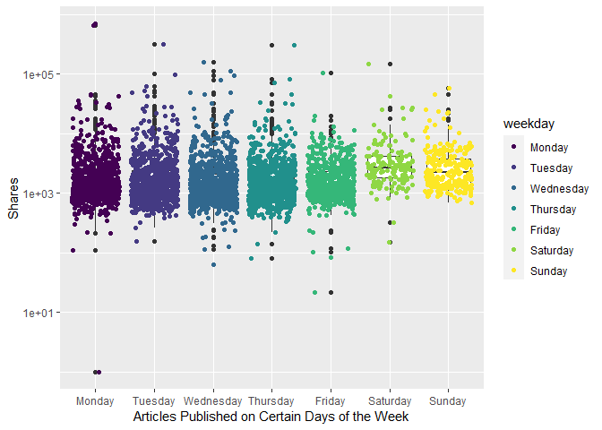<!-- -->

``` r
# when we take the log of the data, we can see easier... Poisson...
# plot scatter after boxplot because we want to see where the majority of the dots are...
#total articles published is actually higher Monday and fewer on the weekend. but boxplots look like they are lower on the weekdays because more articles are published but less shares are occurring...
#plots - scatter plot with boxplot overlayed
# 31. weekday_is_monday: Was the article published on a Monday?
#this one doesnt work bc we need levels...
#ggplot(data=ChannelTrain, aes(y=shares, x=weekday_is_monday)) + geom_point()
# the y - axis is using a log axis not a linear axis, but the plots are more easily interpretable /  visually more ituitive with this transformation.
ggplot(data=ChannelTrain %>% 
              mutate(weekday_fctr = factor(x=weekday_is_monday,  
              levels=c(0,1), labels = c("No", "Yes"))), 
            aes(y=shares, x=weekday_fctr)) + 
            labs(x="Articles Published on Monday", y="Shares", color = "Published") +
            geom_boxplot() + scale_y_log10() +
            geom_point(aes(color=weekday_fctr), position="jitter", alpha=0.4) 
```

<!-- -->

``` r
# 32. weekday_is_tuesday: Was the article published on a Tuesday
ggplot(data=ChannelTrain %>% 
              mutate(weekday_fctr = factor(x=weekday_is_tuesday,  
              levels=c(0,1), labels = c("No", "Yes"))), 
            aes(y=shares, x=weekday_fctr)) + 
            labs(x="Articles Published on Tuesday", y="Shares", color = "Published") +
            geom_boxplot() + scale_y_log10() +
            geom_point(aes(color=weekday_fctr), position="jitter", alpha=0.4) 
```

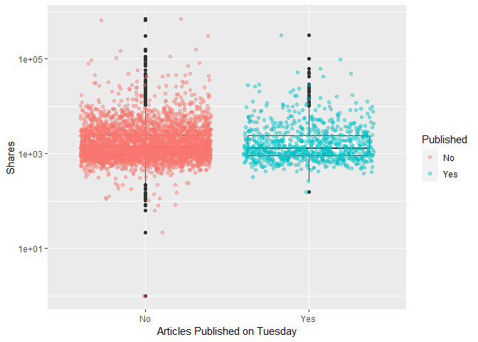<!-- -->

``` r
# 33. weekday_is_wednesday: Was the article published on a Wednesday?
ggplot(data=ChannelTrain %>% 
              mutate(weekday_fctr = factor(x=weekday_is_wednesday,  
              levels=c(0,1), labels = c("No", "Yes"))), 
            aes(y=shares, x=weekday_fctr)) + 
            labs(x="Articles Published on Wednesday", y="Shares", color = "Published") +
            geom_boxplot() + scale_y_log10() +
            geom_point(aes(color=weekday_fctr), position="jitter", alpha=0.4) 
```

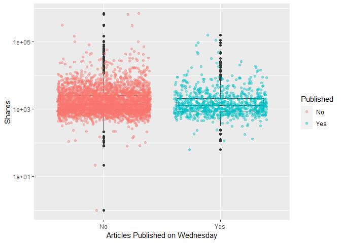<!-- -->

``` r
# 34. weekday_is_thursday: Was the article published on a Thursday?
ggplot(data=ChannelTrain %>% 
              mutate(weekday_fctr = factor(x=weekday_is_thursday,  
              levels=c(0,1), labels = c("No", "Yes"))), 
            aes(y=shares, x=weekday_fctr)) + 
            labs(x="Articles Published on Thursday", y="Shares", color = "Published") +
            geom_boxplot() + scale_y_log10() +
            geom_point(aes(color=weekday_fctr), position="jitter", alpha=0.4) 
```

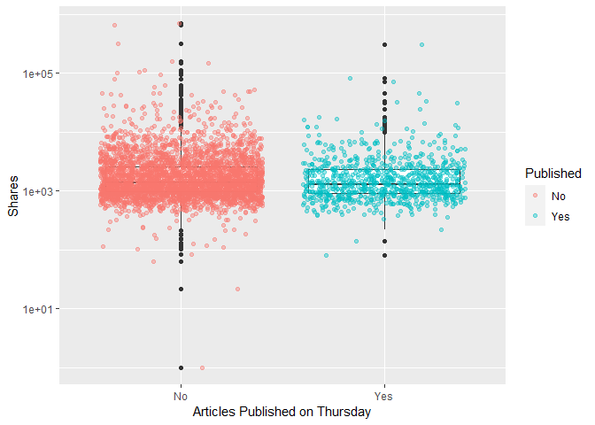<!-- -->

``` r
# 35. weekday_is_friday: Was the article published on a Friday?
ggplot(data=ChannelTrain %>% 
              mutate(weekday_fctr = factor(x=weekday_is_friday,  
              levels=c(0,1), labels = c("No", "Yes"))), 
            aes(y=shares, x=weekday_fctr)) + 
            labs(x="Articles Published on Friday", y="Shares", color = "Published") +
            geom_boxplot() + scale_y_log10() +
            geom_point(aes(color=weekday_fctr), position="jitter", alpha=0.4) 
```

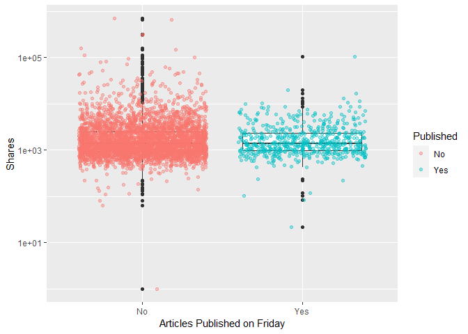<!-- -->

``` r
# 36. weekday_is_saturday: Was the article published on a Saturday?
ggplot(data=ChannelTrain %>% 
              mutate(weekday_fctr = factor(x=weekday_is_saturday,  
              levels=c(0,1), labels = c("No", "Yes"))), 
            aes(y=shares, x=weekday_fctr)) + 
            labs(x="Articles Published on Saturday", y="Shares", color = "Published") +
            geom_boxplot() + scale_y_log10() +
            geom_point(aes(color=weekday_fctr), position="jitter", alpha=0.4) 
```

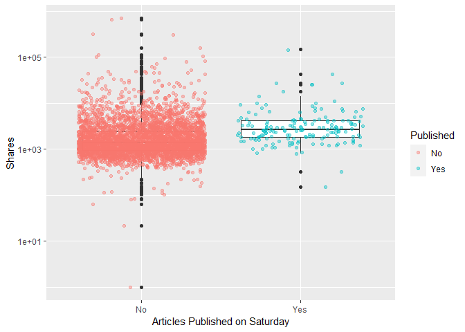<!-- -->

``` r
# 37. weekday_is_sunday: Was the article published on a Sunday?
ggplot(data=ChannelTrain %>% 
              mutate(weekday_fctr = factor(x=weekday_is_sunday,  
              levels=c(0,1), labels = c("No", "Yes"))), 
            aes(y=shares, x=weekday_fctr)) + 
            labs(x="Articles Published on Sunday", y="Shares", color = "Published") +
            geom_boxplot() + scale_y_log10() +
            geom_point(aes(color=weekday_fctr), position="jitter", alpha=0.4) 
```

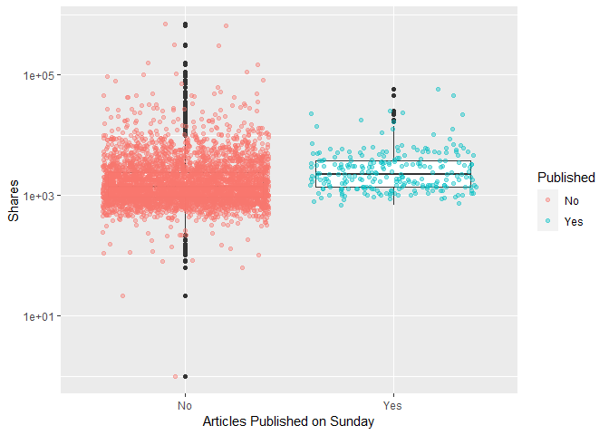<!-- -->

``` r
# # 38. is_weekend: Was the article published on the weekend? 
# ggplot(data=ChannelTrain %>% 
#               mutate(weekday_fctr = factor(x=is_weekend,  
#               levels=c(0,1), labels = c("No", "Yes"))), 
#             aes(y=shares, x=weekday_fctr)) + 
#             labs(x="Articles Published on Monday", y="Shares", color = "Published") +
#             geom_boxplot() + scale_y_log10() +
#             geom_point(aes(color=weekday_fctr), position="jitter") 
# i can make conclusions based on summary() median, min, max, bc i trasfomred for visibility
```

The y - axis is using a log axis not a linear axis, but the plots are
more easily interpretable / visually more intuitive with this
transformation.The general shape of the plots is correct.

We can inspect the trend of shares as a function of the different days
of the week that the articles are published.

If you see a presence of outliers, this may cause the mean to shift in
that direction, but the meidan will not be effected as much. If you see
that the median is not centered within the box, then there is a presence
of skewness in that particular direction. Also, if you see that there
are more observations / dots on one graph while comparing publication
(Yes/No), this is meaningful within the plot itself and also across the
different days of the week.

<!-- might use this later dont delete yet -->

``` r
#what question are we trying to answer here? 
# how to predict shares given the variables you have...
#fitting the model
fit_Channel <- lm(shares ~ . , data = Channel)
#call fit_Lifestyle object - remember this is an lm object
fit_Channel
```

    ## 
    ## Call:
    ## lm(formula = shares ~ ., data = Channel)
    ## 
    ## Coefficients:
    ##                   (Intercept)                 n_tokens_title               n_tokens_content  
    ##                    -8.723e+03                      9.821e+01                      5.690e-01  
    ##               n_unique_tokens               n_non_stop_words       n_non_stop_unique_tokens  
    ##                     5.731e+03                     -8.431e+02                      3.754e+03  
    ##                     num_hrefs                 num_self_hrefs                       num_imgs  
    ##                     3.628e+01                      4.804e+01                      8.900e+01  
    ##                    num_videos           average_token_length                   num_keywords  
    ##                     9.767e+01                     -1.705e+03                      2.111e+02  
    ##     data_channel_is_lifestyle  data_channel_is_entertainment            data_channel_is_bus  
    ##                            NA                             NA                             NA  
    ##        data_channel_is_socmed           data_channel_is_tech          data_channel_is_world  
    ##                            NA                             NA                             NA  
    ##                    kw_min_min                     kw_max_min                     kw_avg_min  
    ##                     4.363e+00                     -8.902e-02                      1.195e+00  
    ##                    kw_min_max                     kw_max_max                     kw_avg_max  
    ##                    -4.611e-03                     -9.355e-04                      1.908e-03  
    ##                    kw_min_avg                     kw_max_avg                     kw_avg_avg  
    ##                    -1.343e-01                     -2.583e-01                      1.779e+00  
    ##     self_reference_min_shares      self_reference_max_shares     self_reference_avg_sharess  
    ##                     5.197e-02                     -5.127e-03                      1.892e-02  
    ##             weekday_is_monday             weekday_is_tuesday           weekday_is_wednesday  
    ##                     4.882e+02                     -4.025e+02                     -5.401e+02  
    ##           weekday_is_thursday              weekday_is_friday            weekday_is_saturday  
    ##                    -2.550e+02                     -8.538e+02                      3.915e+02  
    ##             weekday_is_sunday                     is_weekend                         LDA_00  
    ##                            NA                             NA                      8.355e+02  
    ##                        LDA_01                         LDA_02                         LDA_03  
    ##                     6.966e+02                      1.515e+02                      5.826e+03  
    ##                        LDA_04            global_subjectivity      global_sentiment_polarity  
    ##                            NA                      3.289e+03                     -3.445e+03  
    ##    global_rate_positive_words     global_rate_negative_words            rate_positive_words  
    ##                     1.909e+03                      1.452e+04                      3.914e+03  
    ##           rate_negative_words          avg_positive_polarity          min_positive_polarity  
    ##                     3.013e+03                     -2.126e+03                     -1.957e+03  
    ##         max_positive_polarity          avg_negative_polarity          min_negative_polarity  
    ##                     6.086e+02                      2.110e+03                     -2.423e+03  
    ##         max_negative_polarity             title_subjectivity       title_sentiment_polarity  
    ##                    -3.051e+03                     -2.986e+01                      7.915e+02  
    ##        abs_title_subjectivity   abs_title_sentiment_polarity  
    ##                     2.515e+03                      8.725e+02

``` r
# check fit_Lifestyle attributes
attributes(fit_Channel)
```

    ## $names
    ##  [1] "coefficients"  "residuals"     "effects"       "rank"          "fitted.values"
    ##  [6] "assign"        "qr"            "df.residual"   "xlevels"       "call"         
    ## [11] "terms"         "model"        
    ## 
    ## $class
    ## [1] "lm"

``` r
fit_Channel[["residuals"]]
```

    ##            1            2            3            4            5            6            7 
    ##   2646.91317   2094.54501   5107.13439   1481.68901   2096.35382   3121.25753   -237.93634 
    ##            8            9           10           11           12           13           14 
    ##     15.94027   1831.45155    172.12914  -1405.66294   2938.79945    607.03642   3182.68478 
    ##           15           16           17           18           19           20           21 
    ##   2261.51007  -2013.66628   1050.25315    375.96887   -143.68253    578.05244  -1354.15945 
    ##           22           23           24           25           26           27           28 
    ##   1860.81379    956.72387  -2384.56847  -1730.75351   -916.32181  -2084.77149    943.59622 
    ##           29           30           31           32           33           34           35 
    ##    676.68193    799.23827    506.03070  -1125.44716  -3553.80143   2523.17689  -1057.08131 
    ##           36           37           38           39           40           41           42 
    ##    148.77642     75.18548    361.40495    236.99181    738.03544  -1300.07436  -4429.76079 
    ##           43           44           45           46           47           48           49 
    ##  -1288.00330   3454.13150  -1522.90921  -1660.08387  -2255.11144  -1566.62557  -1496.87580 
    ##           50           51           52           53           54           55           56 
    ##  -1196.01122  -2364.51613   -721.02669  -1277.65871  -1427.00922  -2502.28053   -656.00142 
    ##           57           58           59           60           61           62           63 
    ##  -2877.42688    556.99178  -5459.64319    334.36691   -372.08610   3210.14031  -2285.66620 
    ##           64           65           66           67           68           69           70 
    ##  -1048.99730  -1774.74701    372.58152    702.99562   1470.19312   1557.95140  -1162.33180 
    ##           71           72           73           74           75           76           77 
    ##  -1112.32765  -1018.89203    343.66941  -2397.99790  -1639.61686   2860.36433    730.51494 
    ##           78           79           80           81           82           83           84 
    ##   1638.83258   2309.51291  -2848.63023    302.55023  -3613.10687  -1154.37385  -2897.77350 
    ##           85           86           87           88           89           90           91 
    ##   6679.36239   -107.45708  -1988.81112    554.22573   1327.21773    268.57491  -1658.55810 
    ##           92           93           94           95           96           97           98 
    ##   -504.70067   -772.70297    370.42671    237.74765  -2421.94609   1817.62775   1259.09310 
    ##           99          100          101          102          103          104          105 
    ##   1093.38490    355.22269   2041.79488   1908.35961   -126.98461   1839.28642   -129.06986 
    ##          106          107          108          109          110          111          112 
    ##   -670.19433    938.57380  -4070.07013   -737.85145   1551.65723  -2451.11474  -1370.30597 
    ##          113          114          115          116          117          118          119 
    ##   -985.54806  -1148.97600  -1802.46542  -2240.93258  -5552.06816  -1633.07932  -1371.94509 
    ##          120          121          122          123          124          125          126 
    ##  -1598.48746  -1262.37244  -2324.78921  -2489.74845    797.38124    559.81619   1495.89817 
    ##          127          128          129          130          131          132          133 
    ##  -1780.70041   -835.54103  -2095.97390  -2777.37325   2812.65201  -1546.27034   1132.74673 
    ##          134          135          136          137          138          139          140 
    ##    593.83100   -844.51203    224.63754   -623.12170  -1305.13164   -280.72510    567.71603 
    ##          141          142          143          144          145          146          147 
    ##    637.07498   1516.85774    201.64110   8940.46311   1964.74658   -476.46932   -194.40895 
    ##          148          149          150          151          152          153          154 
    ##  -3422.51419  -2037.48095   1481.34194    154.56846   8779.15661  -2364.76388  -3105.84699 
    ##          155          156          157          158          159          160          161 
    ##  -4121.95749  -4172.52048  -6411.24928    796.56669    486.96866  -1760.48010  -1931.78936 
    ##          162          163          164          165          166          167          168 
    ##  -2081.15788    587.16252  -4929.12622  -2821.43791   2070.41291   -385.24614   3418.92763 
    ##          169          170          171          172          173          174          175 
    ##    552.34755  -2173.71050    494.10101   -446.37941    276.36053  -1278.28359  -1037.05361 
    ##          176          177          178          179          180          181          182 
    ##   1719.16732    927.47789   6082.37495   -916.69119  -3755.84240  -1692.56922   3635.44963 
    ##          183          184          185          186          187          188          189 
    ##  -4160.91984  -6434.30298   1436.48537  -2179.46630   6912.79769  -2768.03544  -2402.99189 
    ##          190          191          192          193          194          195          196 
    ##  -2713.50063    931.13901  -1652.83061  -1907.13685  10699.17340  -1678.56868   -479.38944 
    ##          197          198          199          200          201          202          203 
    ##  -1276.85383    -99.84469    782.16015   -478.55895   -649.45581   3647.65612   6759.58058 
    ##          204          205          206          207          208          209          210 
    ##    513.94606   -928.57251    337.89892   9938.00264  -2311.47387  -1346.14640   -887.30205 
    ##          211          212          213          214          215          216          217 
    ##  -1769.74131  -1895.20175  -1877.07536  -2368.21587   -799.11881  -1448.13704  -3144.43700 
    ##          218          219          220          221          222          223          224 
    ##  -1408.36053   1758.35434  -1699.71348  -2169.32295   1483.51896   -909.74923    487.28355 
    ##          225          226          227          228          229          230          231 
    ##   -401.53757  -1888.00848  -1167.26601  -1545.02467    492.34002   1051.99644  -4287.72666 
    ##          232          233          234          235          236          237          238 
    ##  -1633.57752  -1233.45987  -1407.78432    156.65970  -1774.52896    575.31673   1404.84463 
    ##          239          240          241          242          243          244          245 
    ##  -1297.89523  -3060.21569  -3406.83564  -4929.00706  -1956.67370  -2076.25413  -3449.00626 
    ##          246          247          248          249          250          251          252 
    ##   -862.91720    525.45074  -1440.15434  -1976.77959  10987.10462   2302.75063    891.22914 
    ##          253          254          255          256          257          258          259 
    ##  -2868.31806    685.93398  -1414.28264  -1073.14185  -1262.89868  -3732.40886   1948.32550 
    ##          260          261          262          263          264          265          266 
    ##  -3602.41208  -1110.81930   -922.41432    365.65705  -2121.33640  -2477.04555  -1415.72259 
    ##          267          268          269          270          271          272          273 
    ##   2705.12784  -2095.10310  -2155.13411   1933.90172  -3599.95529  -4709.33061  -3344.81583 
    ##          274          275          276          277          278          279          280 
    ##  -8951.49272  -2580.81743  -1108.20263  -2781.57850   -978.71823  -1625.10755  -1917.56889 
    ##          281          282          283          284          285          286          287 
    ##  -1589.40017   -425.30932 -10156.99093   1851.54914  -2152.44955  -1296.90302    107.38062 
    ##          288          289          290          291          292          293          294 
    ##  -1034.94164   6807.83837   4052.87711    444.03530   -601.66804   -700.73877  -3388.14177 
    ##          295          296          297          298          299          300          301 
    ##  -6292.97806   2782.79941    121.43935  -2195.33567    428.41863  -1426.09628  -1768.80316 
    ##          302          303          304          305          306          307          308 
    ##  -2355.11283  -2180.76779   2852.21375   1501.30316    374.34509  -3088.53293  -1520.61163 
    ##          309          310          311          312          313          314          315 
    ##   1624.54288   4026.72935   -645.16582  -2037.56290   1732.94051   -180.21734  -2651.06863 
    ##          316          317          318          319          320          321          322 
    ##  -1371.83272   -648.82397  -1324.96738   -242.54177    423.77703  -1985.58039  -1638.37482 
    ##          323          324          325          326          327          328          329 
    ##  -3855.02245  -1663.76476  -1958.22941  -2516.14496   2490.74603    812.15819    747.27221 
    ##          330          331          332          333          334          335          336 
    ##   -387.15598  -3329.19120   -442.09178   -658.47926  -1646.04804   1108.96826    174.85616 
    ##          337          338          339          340          341          342          343 
    ##  -4145.40679  -3685.84278  -2997.26788   -167.55839  -1955.66365   -838.43767   6835.44622 
    ##          344          345          346          347          348          349          350 
    ##  -3734.97177  -1338.90362  -2221.88015  -4032.11428   -484.00798   -679.75737   -727.21238 
    ##          351          352          353          354          355          356          357 
    ##  -5887.49809  -2890.93235    895.55490   1011.14415  -1558.44544   -122.63458    856.33107 
    ##          358          359          360          361          362          363          364 
    ##  -1280.01202  -9163.03502   7470.89283  -2614.97345    107.17021  -2291.57994  -2891.15812 
    ##          365          366          367          368          369          370          371 
    ##   -896.43422    727.38131   -266.52956     12.01118  -1136.81541  -2505.78827  -1073.30468 
    ##          372          373          374          375          376          377          378 
    ##    450.26982    554.19148  -1794.77366   1423.70167  -1910.25225  -3075.16122  -1470.52422 
    ##          379          380          381          382          383          384          385 
    ##  -3076.25059   1790.71511   -779.89269  -1981.89811  -2953.73829  -1834.59318  -3025.91454 
    ##          386          387          388          389          390          391          392 
    ##  -1085.42424   -894.78068   -539.41169  -2532.43652  -1846.15190   -547.70851  -1349.56468 
    ##          393          394          395          396          397          398          399 
    ##     67.03893  -3124.45000  -3355.27781  -1120.77208   1360.48378  -1364.88271  -1493.37315 
    ##          400          401          402          403          404          405          406 
    ##   -625.94113  -1785.39942    286.46167   3052.95419   3500.24609    884.86421  -2039.45995 
    ##          407          408          409          410          411          412          413 
    ##  21167.21474   1328.97398  22372.37763   1454.53487   2163.16442   -996.59452   -686.19022 
    ##          414          415          416          417          418          419          420 
    ##  -5081.88206  -3408.69431   1951.30025  -4086.75686  11435.10812   -405.45796   1302.15827 
    ##          421          422          423          424          425          426          427 
    ##   -913.94969     62.26403   -346.62172  -1083.21839    377.22763   -632.28284   2137.70580 
    ##          428          429          430          431          432          433          434 
    ##  -1701.22629  -1998.66767  -1514.49419    159.92448   7123.37913   -846.07233  -4279.85412 
    ##          435          436          437          438          439          440          441 
    ##    419.34914   -381.05039  -2880.68183  -2739.45576    562.60414   1926.79436    -86.72653 
    ##          442          443          444          445          446          447          448 
    ##    566.30806    -63.26986   -979.70971  -2756.52159    684.67781    514.50215  -3069.83525 
    ##          449          450          451          452          453          454          455 
    ##  -1621.49168    702.60799  -3494.15713     44.20725  -1534.48783   -194.32283  -2279.55509 
    ##          456          457          458          459          460          461          462 
    ##   1330.20910  -1565.15485   -373.35088  77326.63426  -1266.26519  -1608.20282  -2188.52287 
    ##          463          464          465          466          467          468          469 
    ##  -2673.65569    546.15418   2254.81145    761.49364   -260.17644    271.98283  -2904.18426 
    ##          470          471          472          473          474          475          476 
    ##  -1143.88638   2531.04114   2460.02071     28.83784  -1929.78402   -988.40089  -1971.39892 
    ##          477          478          479          480          481          482          483 
    ##   -183.24112   -117.89358  -4444.88543  -1947.07714  -3279.48183   -648.56905  -2634.69036 
    ##          484          485          486          487          488          489          490 
    ##     32.81543  -3689.97312  -1762.01698  -4652.01057   2544.63969   -331.38634     46.78871 
    ##          491          492          493          494          495          496          497 
    ##  -1309.50321  -4779.18117    133.68369  -1589.78711  -2878.88539   -850.86908  -2229.50959 
    ##          498          499          500          501          502          503          504 
    ##    970.51885    960.61465   1702.35705  -1195.12006   -808.32058    226.97027   1024.39589 
    ##          505          506          507          508          509          510          511 
    ##  -1351.91974  -2732.11837  -1243.70703  -3037.22055  -1559.97966    452.95280   -573.36086 
    ##          512          513          514          515          516          517          518 
    ##  -2157.96756  -5191.75673  -2214.54512   1550.73180   -786.48673  -2299.17673  -2811.88757 
    ##          519          520          521          522          523          524          525 
    ##    476.55161    595.16685  -1666.68537   -778.32298   1607.52393   1430.77957  -2341.23624 
    ##          526          527          528          529          530          531          532 
    ##   -148.65482   -549.20407   1814.89262  -1927.30493    867.53352   -363.95604   -674.76061 
    ##          533          534          535          536          537          538          539 
    ##  -4179.80835   -507.92664  -2253.40048  -4163.33792  -1705.26374   -675.01435  -1918.07130 
    ##          540          541          542          543          544          545          546 
    ##   1067.18291  -3487.99847  -1139.51535 136067.34002    607.86640    110.20388  -2348.33156 
    ##          547          548          549          550          551          552          553 
    ##  -1587.83420  -2144.16301   1331.52986  -4170.28922  -2852.57124  -4131.91478  -1830.34195 
    ##          554          555          556          557          558          559          560 
    ##   -869.37226  -4376.29031  -1054.53576  -4645.93138  -5526.43206  -3719.01569  -3669.26334 
    ##          561          562          563          564          565          566          567 
    ##  -3220.26024  -1699.52236    392.37017  -2525.15365   -948.16743   2149.73465   1396.31214 
    ##          568          569          570          571          572          573          574 
    ##  -1314.39500   1636.22172    382.31995   1890.60667  -1452.50409    -85.64595    536.12317 
    ##          575          576          577          578          579          580          581 
    ##  -6935.12660   6437.88088  -1343.05353  -2377.36839  -2531.19657   -578.48073   1257.01942 
    ##          582          583          584          585          586          587          588 
    ##  -3073.60736  -1000.06183    140.61551  -2495.92707  -1058.55168   1432.52856    787.23640 
    ##          589          590          591          592          593          594          595 
    ##   -407.75059  -1280.18853   1633.29952   2477.91549    196.65772  -2234.03494   5511.54365 
    ##          596          597          598          599          600          601          602 
    ##  -4439.19959  -3550.82104   -249.31827   -167.33230  -3146.25212  -3878.20236  -2751.51328 
    ##          603          604          605          606          607          608          609 
    ##   -207.22600   1935.14782   -998.45583  -3355.60717  -1221.90735  -1772.87640   -592.10920 
    ##          610          611          612          613          614          615          616 
    ##  -2135.16463   -320.38358  -5497.17887  -2844.04786   1420.82732  -1171.71232  12984.35080 
    ##          617          618          619          620          621          622          623 
    ##    574.60125   -205.27407    661.99403  -1261.06236  -2775.86194  -1805.77564   4882.47617 
    ##          624          625          626          627          628          629          630 
    ##  -1602.31965  -1317.54321  -3000.83569  -3967.15792  -1841.56007   -555.98681    104.78296 
    ##          631          632          633          634          635          636          637 
    ##  -1902.63559  40228.23866  -1581.81151  -5129.12502  -2944.27183  -1602.04539  -1014.86689 
    ##          638          639          640          641          642          643          644 
    ##    256.83223     90.95898    335.87574   -843.41597  -1995.36735   -753.09634  55551.48130 
    ##          645          646          647          648          649          650          651 
    ##   3589.84817  -2758.31466   -811.49469   -216.65003  -2359.08379  -5545.30747   1380.14144 
    ##          652          653          654          655          656          657          658 
    ##   1389.36737  -3018.62777  -2657.09989  -1122.60964  -4149.57152  -4639.63273    548.11035 
    ##          659          660          661          662          663          664          665 
    ##  -1671.30829   -682.27163  -1373.47074  -3042.85769  -9639.02312   1501.47951  -3563.36496 
    ##          666          667          668          669          670          671          672 
    ##  -3523.97042   -480.33546   1700.11331  -1626.66452  -2756.27657  -2513.02673  -1709.74004 
    ##          673          674          675          676          677          678          679 
    ##  -1480.92904  -2643.77905  -1769.63299   1641.10366  -3864.57669  -1161.69680   7243.58060 
    ##          680          681          682          683          684          685          686 
    ##    963.08607    739.83376    491.58291   2981.50432   -826.19340  -5878.95392  -2679.73513 
    ##          687          688          689          690          691          692          693 
    ##   1218.61808   -941.58271  -1144.81947   1177.06983  -1875.44587  -1938.54305  -2034.66927 
    ##          694          695          696          697          698          699          700 
    ##     93.82509  -4409.03922  -2071.31614  -3803.80694  -5004.51549  -4451.65619  -4298.08900 
    ##          701          702          703          704          705          706          707 
    ##    525.50588  -2841.04765  -1730.83524   -181.26402   1053.98029   -575.80453    528.36917 
    ##          708          709          710          711          712          713          714 
    ##   1034.39056   4032.00330    440.94988   -475.31353   1835.65221   2559.39638  -2306.51485 
    ##          715          716          717          718          719          720          721 
    ##   1588.26584  -6142.33582  -1100.93998    294.33419   1952.76961    803.50604   -153.91957 
    ##          722          723          724          725          726          727          728 
    ##  -2848.66661    757.25763   1001.11693   3591.14524  -4350.57743   1104.35702   1544.09817 
    ##          729          730          731          732          733          734          735 
    ##  -2371.10253  -1025.02900   -304.27223  -2070.10838  -1341.99985  -1070.18940  -7311.16772 
    ##          736          737          738          739          740          741          742 
    ##   -913.25076  -1102.60420  -1397.58588  -1968.30143  -1353.36184   1153.48464   5273.83883 
    ##          743          744          745          746          747          748          749 
    ##  -1475.07439    -53.67382    802.34755  -1378.61838    581.56861   6358.35409 -10318.70853 
    ##          750          751          752          753          754          755          756 
    ##  -3555.56530  -2428.67682  -3995.50308   2008.40398  -1166.33062  -3436.29290  -2585.10330 
    ##          757          758          759          760          761          762          763 
    ##  -5079.26192  -1638.95706    614.45640  -4675.77460   -359.44137  -1389.68340  -1006.84701 
    ##          764          765          766          767          768          769          770 
    ##  -4280.37177  -1729.41045    692.79157    895.55045  -3239.94518   -694.34459   3417.65624 
    ##          771          772          773          774          775          776          777 
    ##  -3874.88238     16.72715  -1084.75426  -3358.83043   1633.52663  -2205.69101  -3011.86384 
    ##          778          779          780          781          782          783          784 
    ##    -11.25446     29.86055 -23135.32342   -285.81305   1884.18281  -1772.56183    493.09387 
    ##          785          786          787          788          789          790          791 
    ##  -2301.47929  -3867.41680  -2516.44715    844.56066   1380.95952  -5429.57777   3771.03156 
    ##          792          793          794          795          796          797          798 
    ##  -1338.01234  -6197.39870 301786.98062   -251.56761   5559.65087   -731.70726    805.92901 
    ##          799          800          801          802          803          804          805 
    ##  -1523.61888   1434.53578  -1830.62197  -2996.60668   -835.78313   -305.40990    -84.51232 
    ##          806          807          808          809          810          811          812 
    ##  -6586.71450  -1847.16247   -194.72667   -891.15074  -2539.48796    -68.95556   4068.74899 
    ##          813          814          815          816          817          818          819 
    ##    868.55945    113.29685    635.76665  -3937.19201  -2841.17793   -394.18963  -2263.12310 
    ##          820          821          822          823          824          825          826 
    ##  -2909.18957    -37.89490  -1567.90772  -3054.22335  -1935.37982  -1954.84190    652.92200 
    ##          827          828          829          830          831          832          833 
    ##  -2004.26481    220.42557  -2348.02152   3642.14967   1111.53538   2922.93904   -346.24792 
    ##          834          835          836          837          838          839          840 
    ##  -2877.92170   -428.46035  -1940.04139    -64.72358   -887.52626  -1728.85431  18181.56715 
    ##          841          842          843          844          845          846          847 
    ##     32.36266   -986.49629    684.08984  -7692.98398  -1134.23558   -354.32455    313.76872 
    ##          848          849          850          851          852          853          854 
    ##    749.16879   1599.93533    387.22889   -344.93312   2643.71635    940.00905  -1677.98127 
    ##          855          856          857          858          859          860          861 
    ##    617.17801   -701.35622  -1127.16691    361.98050   -229.20312     46.39764  -5321.10770 
    ##          862          863          864          865          866          867          868 
    ##   7473.27474    -13.82518  -3722.93935     65.14388    251.82488    788.25070   2229.90449 
    ##          869          870          871          872          873          874          875 
    ##  -2165.16044  -4493.71350    823.11290  -2093.62694   3386.59018  -1390.31975  -5221.47768 
    ##          876          877          878          879          880          881          882 
    ##  -2536.77419   -511.75548  -1847.72221   3392.88385  -1041.24044   1745.33850   -145.25899 
    ##          883          884          885          886          887          888          889 
    ##   1052.09217  -1847.85145    477.96418   -422.35374   5553.06910   -697.10680    597.38937 
    ##          890          891          892          893          894          895          896 
    ##  -3816.42944   1199.52183  -1960.99903    457.21928    286.01986   -278.53628  -2228.94883 
    ##          897          898          899          900          901          902          903 
    ##   -925.69464   -554.61873   -565.27690    461.59263   1597.12342  -1182.62699   3747.41396 
    ##          904          905          906          907          908          909          910 
    ##   3322.48254  -1239.61431  -2030.76788    751.03421  -1700.85837   -799.32769   -260.95970 
    ##          911          912          913          914          915          916          917 
    ##   1652.36900   -815.98180   -298.92243   1520.63794  -2396.87478   7541.42828   -704.81828 
    ##          918          919          920          921          922          923          924 
    ##   5413.88828    477.75395  -5053.80720   1980.51474   1334.06959  -3313.84910   -639.21451 
    ##          925          926          927          928          929          930          931 
    ##   -595.13968  -3038.60153  -2022.81292   6515.54616   6840.93217    214.63174    735.97155 
    ##          932          933          934          935          936          937          938 
    ##  -3127.46221  -2449.27472   -662.42773   1763.34212  -1525.99929   1813.59557   1319.12804 
    ##          939          940          941          942          943          944          945 
    ##   1634.24454   -500.20355   2674.13459    945.37213 679276.06716  -6207.73671   -558.67914 
    ##          946          947          948          949          950          951          952 
    ##   -169.65243  -6051.41598  -3463.85425  -2717.72522   2722.20373     89.18805  -5983.23195 
    ##          953          954          955          956          957          958          959 
    ##  -1045.64387  -2447.88740  -1573.09202  -3105.42091    471.51747   -485.80120  -1381.66180 
    ##          960          961          962          963          964          965          966 
    ##  -1789.11962   -889.75144    -21.37740    -39.56788   6395.54497   3464.36162    272.25233 
    ##          967          968          969          970          971          972          973 
    ## -55557.39970   -104.75871   1412.15109   -868.29032  -1151.24818  -2076.75528  -1574.07105 
    ##          974          975          976          977          978          979          980 
    ##    283.54815    352.76001   -700.27297   -731.43438   -650.91011  -3309.43360  -1955.31795 
    ##          981          982          983          984          985          986          987 
    ##  -2776.41879   -306.73031  -2393.50431    609.66120  -5442.72941  -2630.85893   -587.56041 
    ##          988          989          990          991          992          993          994 
    ##   1602.84565   1453.54351    180.24105  -1393.72206  -1957.23680   -902.03229  -1482.82919 
    ##          995          996          997          998          999         1000 
    ##  -1247.76834  -6527.52612  -2253.45170   -455.25565   1086.27111  -1593.93892 
    ##  [ reached getOption("max.print") -- omitted 5258 entries ]

``` r
#summary stats for vars of interest - 
plot(fit_Channel)
```

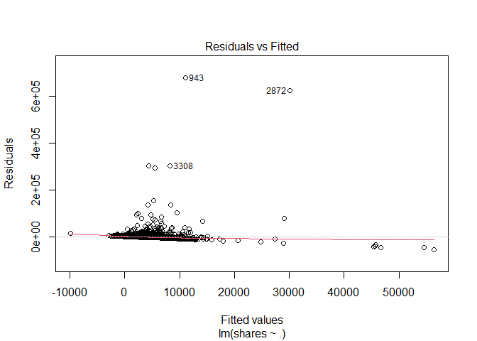<!-- -->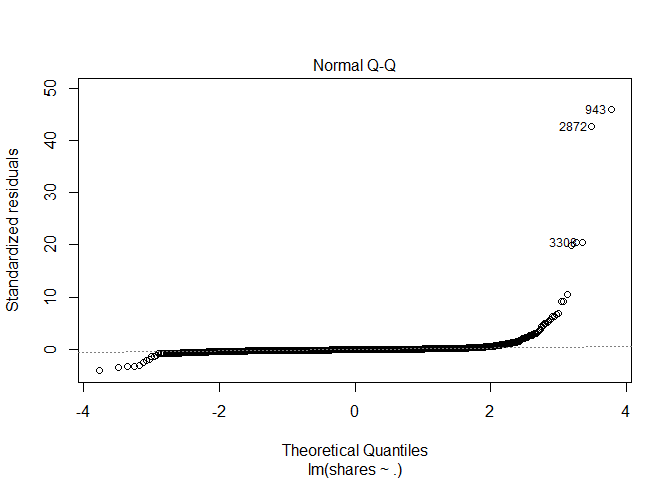<!-- -->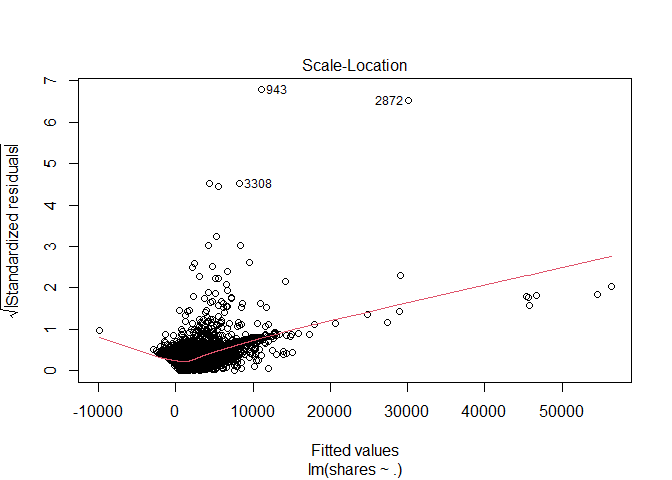<!-- -->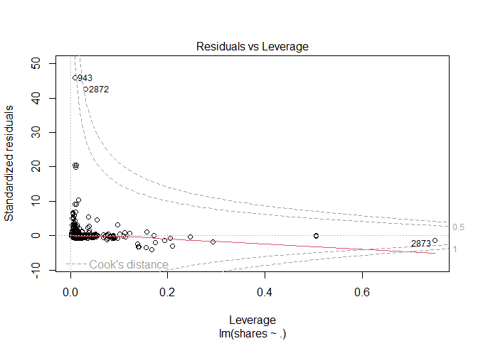<!-- -->

``` r
ggplot(data=fit_Channel, aes(y=shares, x=rate_positive_words)) + geom_point()
```

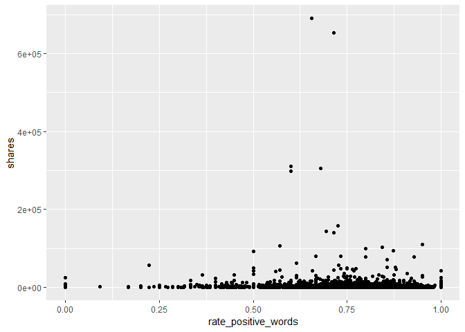<!-- -->

``` r
#EDA
#starting point... correlation - shares vs. each var
#every pairwise combo
Channel_corr <- cor(x=Channel %>% 
                          select (shares, starts_with("weekday_is_") ) )
# cor_mat <- cor(data %>% select(RentedBikeCount, Temperature, Humidity, WindSpeed,
# Hour, Visibility, DewPointTemp,
# Rainfall, Snowfall), method = "pearson")
# corrplot(cor_mat, hc.order = TRUE,
# type = "lower",
# tl.pos = "lt",
# title = "Correlation Coefficients for Bike Rental Data",
# subtitle = "Correlation Coefficients for Bike Rental Data",
# mar=c(0,0,2,0)
# )
#call Channel_corr object to look at correlation between vars and shares response var
#drop to keep in matrix and not turn into a vector
shares_corr <- Channel_corr[ ,"shares", drop=FALSE]
#shares_corr <- Channel_corr[ ,"shares"]
is(shares_corr) #matrix with the drop=TRUE option
```

    ## [1] "matrix"    "array"     "mMatrix"   "structure" "vector"

``` r
#convert to tibble
#shares_corr_tibble <- as.tibble(shares_corr)
shares_corr_tibble <- bind_cols( var_names = rownames(shares_corr), shares_corr ) 
#call shares_corr_tibble object that has correlations with shares and vars...
shares_corr_tibble
```

    ## # A tibble: 8 × 2
    ##   var_names              shares
    ##   <chr>                   <dbl>
    ## 1 shares                1      
    ## 2 weekday_is_monday     0.0260 
    ## 3 weekday_is_tuesday   -0.00419
    ## 4 weekday_is_wednesday -0.0130 
    ## 5 weekday_is_thursday  -0.00586
    ## 6 weekday_is_friday    -0.0182 
    ## 7 weekday_is_saturday   0.0182 
    ## 8 weekday_is_sunday     0.00769

``` r
# condition on +/- 0.9 to see what we should remove as a predictor for the model
# call shares_corr_tibble object
#shares_corr_tibble #this currently does not have row names...
rownames(shares_corr)
```

    ## [1] "shares"               "weekday_is_monday"    "weekday_is_tuesday"  
    ## [4] "weekday_is_wednesday" "weekday_is_thursday"  "weekday_is_friday"   
    ## [7] "weekday_is_saturday"  "weekday_is_sunday"

``` r
#checking structure and type of object
#str(Channel_corr)
#is(Channel_corr)
#finds highly correlated variables and you can set a cutoff (default is +/ 0.9)
#convert to tibble because using drylr chaining / piping
corr_vars <- as.tibble ( Channel_corr[ ,"shares"] ) %>%
             filter ( abs(value) >= 0.9 )
#dont need this anymore...
#corr_vars <- findCorrelation(x=Can_corr, cutoff = +/- 0.9, verbose = TRUE, names = TRUE)
#call corr_vars object
#corr_vars
#columns that are highly correlated and should be removed from the model
#5 13 22
# [1] "n_non_stop_unique_tokens"  "kw_max_min" "self_reference_max_shares"
#response variable is shares, but what does that mean given certain variables available to us?
#maybe look at days of the week variables?
#figure out what kind of object we want to make to answer our question...
#tibble keeping what kind of vars, matrix?
#need to do some sort of type of EDA in order to see if variables are highly correlated
#here we need to summary statistics via summary() and plots
#this shows the summary stats for each variable in our dataset...
Lifestlye_sumstats_Train <- summary(ChannelTrain)
#calling Lifestlye_sumstats_Train object to see our summary stats
Lifestlye_sumstats_Train
```

    ##  n_tokens_title n_tokens_content n_unique_tokens  n_non_stop_words n_non_stop_unique_tokens
    ##  Min.   : 3.0   Min.   :   0.0   Min.   :0.0000   Min.   :0.0000   Min.   :0.0000          
    ##  1st Qu.: 9.0   1st Qu.: 244.0   1st Qu.:0.4782   1st Qu.:1.0000   1st Qu.:0.6486          
    ##  Median :10.0   Median : 395.0   Median :0.5481   Median :1.0000   Median :0.7042          
    ##  Mean   :10.3   Mean   : 540.9   Mean   :0.5460   Mean   :0.9959   Mean   :0.7034          
    ##  3rd Qu.:12.0   3rd Qu.: 730.8   3rd Qu.:0.6109   3rd Qu.:1.0000   3rd Qu.:0.7603          
    ##  Max.   :19.0   Max.   :6336.0   Max.   :0.8732   Max.   :1.0000   Max.   :0.9730          
    ##    num_hrefs       num_self_hrefs      num_imgs        num_videos      average_token_length
    ##  Min.   :  0.000   Min.   : 0.000   Min.   : 0.000   Min.   : 0.0000   Min.   :0.000       
    ##  1st Qu.:  4.000   1st Qu.: 1.000   1st Qu.: 1.000   1st Qu.: 0.0000   1st Qu.:4.527       
    ##  Median :  7.000   Median : 2.000   Median : 1.000   Median : 0.0000   Median :4.689       
    ##  Mean   :  9.321   Mean   : 2.825   Mean   : 1.823   Mean   : 0.6422   Mean   :4.684       
    ##  3rd Qu.: 11.000   3rd Qu.: 4.000   3rd Qu.: 1.000   3rd Qu.: 0.0000   3rd Qu.:4.855       
    ##  Max.   :106.000   Max.   :56.000   Max.   :51.000   Max.   :75.0000   Max.   :5.960       
    ##   num_keywords    data_channel_is_lifestyle data_channel_is_entertainment
    ##  Min.   : 2.000   Min.   :0                 Min.   :0                    
    ##  1st Qu.: 5.000   1st Qu.:0                 1st Qu.:0                    
    ##  Median : 6.000   Median :0                 Median :0                    
    ##  Mean   : 6.489   Mean   :0                 Mean   :0                    
    ##  3rd Qu.: 8.000   3rd Qu.:0                 3rd Qu.:0                    
    ##  Max.   :10.000   Max.   :0                 Max.   :0                    
    ##  data_channel_is_bus data_channel_is_socmed data_channel_is_tech data_channel_is_world
    ##  Min.   :1           Min.   :0              Min.   :0            Min.   :0            
    ##  1st Qu.:1           1st Qu.:0              1st Qu.:0            1st Qu.:0            
    ##  Median :1           Median :0              Median :0            Median :0            
    ##  Mean   :1           Mean   :0              Mean   :0            Mean   :0            
    ##  3rd Qu.:1           3rd Qu.:0              3rd Qu.:0            3rd Qu.:0            
    ##  Max.   :1           Max.   :0              Max.   :0            Max.   :0            
    ##    kw_min_min       kw_max_min       kw_avg_min        kw_min_max       kw_max_max    
    ##  Min.   : -1.00   Min.   :     0   Min.   :   -1.0   Min.   :     0   Min.   :     0  
    ##  1st Qu.: -1.00   1st Qu.:   435   1st Qu.:  151.3   1st Qu.:     0   1st Qu.:690400  
    ##  Median : -1.00   Median :   636   Median :  253.7   Median :  1700   Median :843300  
    ##  Mean   : 28.97   Mean   :  1052   Mean   :  317.3   Mean   : 20647   Mean   :745902  
    ##  3rd Qu.:  4.00   3rd Qu.:  1100   3rd Qu.:  373.6   3rd Qu.:  7700   3rd Qu.:843300  
    ##  Max.   :318.00   Max.   :298400   Max.   :42827.9   Max.   :690400   Max.   :843300  
    ##    kw_avg_max       kw_min_avg     kw_max_avg       kw_avg_avg    self_reference_min_shares
    ##  Min.   :     0   Min.   :   0   Min.   :     0   Min.   :    0   Min.   :     0.0         
    ##  1st Qu.:235375   1st Qu.:   0   1st Qu.:  3487   1st Qu.: 2332   1st Qu.:   454.2         
    ##  Median :313625   Median :1095   Median :  4069   Median : 2770   Median :  1100.0         
    ##  Mean   :316617   Mean   :1119   Mean   :  5309   Mean   : 2964   Mean   :  3499.8         
    ##  3rd Qu.:403117   3rd Qu.:1950   3rd Qu.:  5300   3rd Qu.: 3344   3rd Qu.:  2300.0         
    ##  Max.   :767414   Max.   :3531   Max.   :298400   Max.   :43568   Max.   :690400.0         
    ##  self_reference_max_shares self_reference_avg_sharess weekday_is_monday weekday_is_tuesday
    ##  Min.   :     0            Min.   :     0.0           Min.   :0.0000    Min.   :0.0000    
    ##  1st Qu.:   715            1st Qu.:   683.2           1st Qu.:0.0000    1st Qu.:0.0000    
    ##  Median :  2500            Median :  1990.4           Median :0.0000    Median :0.0000    
    ##  Mean   : 10148            Mean   :  6080.1           Mean   :0.1807    Mean   :0.1899    
    ##  3rd Qu.:  6100            3rd Qu.:  4300.0           3rd Qu.:0.0000    3rd Qu.:0.0000    
    ##  Max.   :690400            Max.   :690400.0           Max.   :1.0000    Max.   :1.0000    
    ##  weekday_is_wednesday weekday_is_thursday weekday_is_friday weekday_is_saturday
    ##  Min.   :0.0000       Min.   :0.0000      Min.   :0.0000    Min.   :0.00000    
    ##  1st Qu.:0.0000       1st Qu.:0.0000      1st Qu.:0.0000    1st Qu.:0.00000    
    ##  Median :0.0000       Median :0.0000      Median :0.0000    Median :0.00000    
    ##  Mean   :0.2013       Mean   :0.1956      Mean   :0.1378    Mean   :0.03811    
    ##  3rd Qu.:0.0000       3rd Qu.:0.0000      3rd Qu.:0.0000    3rd Qu.:0.00000    
    ##  Max.   :1.0000       Max.   :1.0000      Max.   :1.0000    Max.   :1.00000    
    ##  weekday_is_sunday   is_weekend          LDA_00           LDA_01            LDA_02       
    ##  Min.   :0.0000    Min.   :0.00000   Min.   :0.1135   Min.   :0.01820   Min.   :0.01818  
    ##  1st Qu.:0.0000    1st Qu.:0.00000   1st Qu.:0.5081   1st Qu.:0.02857   1st Qu.:0.02857  
    ##  Median :0.0000    Median :0.00000   Median :0.7005   Median :0.04000   Median :0.04000  
    ##  Mean   :0.0566    Mean   :0.09471   Mean   :0.6523   Mean   :0.07683   Mean   :0.08135  
    ##  3rd Qu.:0.0000    3rd Qu.:0.00000   3rd Qu.:0.8400   3rd Qu.:0.05002   3rd Qu.:0.05010  
    ##  Max.   :1.0000    Max.   :1.00000   Max.   :0.9200   Max.   :0.71244   Max.   :0.79897  
    ##      LDA_03            LDA_04        global_subjectivity global_sentiment_polarity
    ##  Min.   :0.01818   Min.   :0.01818   Min.   :0.0000      Min.   :-0.23929         
    ##  1st Qu.:0.02857   1st Qu.:0.02867   1st Qu.:0.3884      1st Qu.: 0.08705         
    ##  Median :0.03339   Median :0.04000   Median :0.4397      Median : 0.13549         
    ##  Mean   :0.06565   Mean   :0.12384   Mean   :0.4359      Mean   : 0.13549         
    ##  3rd Qu.:0.05000   3rd Qu.:0.16958   3rd Qu.:0.4877      3rd Qu.: 0.18441         
    ##  Max.   :0.64661   Max.   :0.79742   Max.   :0.7316      Max.   : 0.62258         
    ##  global_rate_positive_words global_rate_negative_words rate_positive_words
    ##  Min.   :0.00000            Min.   :0.000000           Min.   :0.0000     
    ##  1st Qu.:0.03226            1st Qu.:0.009009           1st Qu.:0.6667     
    ##  Median :0.04217            Median :0.013986           Median :0.7500     
    ##  Mean   :0.04312            Mean   :0.014689           Mean   :0.7375     
    ##  3rd Qu.:0.05343            3rd Qu.:0.019282           3rd Qu.:0.8333     
    ##  Max.   :0.12500            Max.   :0.058824           Max.   :1.0000     
    ##  rate_negative_words avg_positive_polarity min_positive_polarity max_positive_polarity
    ##  Min.   :0.0000      Min.   :0.0000        Min.   :0.00000       Min.   :0.0000       
    ##  1st Qu.:0.1667      1st Qu.:0.3065        1st Qu.:0.03333       1st Qu.:0.6000       
    ##  Median :0.2500      Median :0.3538        Median :0.10000       Median :0.8000       
    ##  Mean   :0.2581      Mean   :0.3531        Mean   :0.08603       Mean   :0.7692       
    ##  3rd Qu.:0.3333      3rd Qu.:0.4023        3rd Qu.:0.10000       3rd Qu.:1.0000       
    ##  Max.   :1.0000      Max.   :0.7740        Max.   :0.70000       Max.   :1.0000       
    ##  avg_negative_polarity min_negative_polarity max_negative_polarity title_subjectivity
    ##  Min.   :-1.0000       Min.   :-1.0000       Min.   :-1.0000       Min.   :0.00000   
    ##  1st Qu.:-0.3018       1st Qu.:-0.7000       1st Qu.:-0.1250       1st Qu.:0.00000   
    ##  Median :-0.2366       Median :-0.5000       Median :-0.1000       Median :0.06667   
    ##  Mean   :-0.2432       Mean   :-0.4807       Mean   :-0.1087       Mean   :0.24907   
    ##  3rd Qu.:-0.1781       3rd Qu.:-0.2500       3rd Qu.:-0.0500       3rd Qu.:0.45455   
    ##  Max.   : 0.0000       Max.   : 0.0000       Max.   : 0.0000       Max.   :1.00000   
    ##  title_sentiment_polarity abs_title_subjectivity abs_title_sentiment_polarity
    ##  Min.   :-1.00000         Min.   :0.0000         Min.   :0.0000              
    ##  1st Qu.: 0.00000         1st Qu.:0.1667         1st Qu.:0.0000              
    ##  Median : 0.00000         Median :0.5000         Median :0.0000              
    ##  Mean   : 0.07893         Mean   :0.3427         Mean   :0.1405              
    ##  3rd Qu.: 0.13636         3rd Qu.:0.5000         3rd Qu.:0.2143              
    ##  Max.   : 1.00000         Max.   :0.5000         Max.   :1.0000              
    ##      shares        
    ##  Min.   :     1.0  
    ##  1st Qu.:   952.2  
    ##  Median :  1400.0  
    ##  Mean   :  3146.5  
    ##  3rd Qu.:  2500.0  
    ##  Max.   :690400.0

``` r
#check structure of objects
str(ChannelTrain)
```

    ## tibble [4,382 × 59] (S3: tbl_df/tbl/data.frame)
    ##  $ n_tokens_title               : num [1:4382] 9 9 8 13 10 12 6 13 9 10 ...
    ##  $ n_tokens_content             : num [1:4382] 255 211 397 244 142 444 109 306 233 468 ...
    ##  $ n_unique_tokens              : num [1:4382] 0.605 0.575 0.625 0.56 0.655 ...
    ##  $ n_non_stop_words             : num [1:4382] 1 1 1 1 1 ...
    ##  $ n_non_stop_unique_tokens     : num [1:4382] 0.792 0.664 0.806 0.68 0.792 ...
    ##  $ num_hrefs                    : num [1:4382] 3 3 11 3 2 9 3 3 5 7 ...
    ##  $ num_self_hrefs               : num [1:4382] 1 1 0 2 1 8 2 2 1 6 ...
    ##  $ num_imgs                     : num [1:4382] 1 1 1 1 1 23 1 1 1 1 ...
    ##  $ num_videos                   : num [1:4382] 0 0 0 0 0 0 0 0 0 0 ...
    ##  $ average_token_length         : num [1:4382] 4.91 4.39 5.45 4.42 4.27 ...
    ##  $ num_keywords                 : num [1:4382] 4 6 6 4 5 10 6 10 4 5 ...
    ##  $ data_channel_is_lifestyle    : num [1:4382] 0 0 0 0 0 0 0 0 0 0 ...
    ##  $ data_channel_is_entertainment: num [1:4382] 0 0 0 0 0 0 0 0 0 0 ...
    ##  $ data_channel_is_bus          : num [1:4382] 1 1 1 1 1 1 1 1 1 1 ...
    ##  $ data_channel_is_socmed       : num [1:4382] 0 0 0 0 0 0 0 0 0 0 ...
    ##  $ data_channel_is_tech         : num [1:4382] 0 0 0 0 0 0 0 0 0 0 ...
    ##  $ data_channel_is_world        : num [1:4382] 0 0 0 0 0 0 0 0 0 0 ...
    ##  $ kw_min_min                   : num [1:4382] 0 0 0 0 0 0 0 217 217 217 ...
    ##  $ kw_max_min                   : num [1:4382] 0 0 0 0 0 0 0 5700 425 425 ...
    ##  $ kw_avg_min                   : num [1:4382] 0 0 0 0 0 ...
    ##  $ kw_min_max                   : num [1:4382] 0 0 0 0 0 0 0 0 0 0 ...
    ##  $ kw_max_max                   : num [1:4382] 0 0 0 0 0 0 0 17100 17100 17100 ...
    ##  $ kw_avg_max                   : num [1:4382] 0 0 0 0 0 ...
    ##  $ kw_min_avg                   : num [1:4382] 0 0 0 0 0 0 0 0 0 0 ...
    ##  $ kw_max_avg                   : num [1:4382] 0 0 0 0 0 ...
    ##  $ kw_avg_avg                   : num [1:4382] 0 0 0 0 0 ...
    ##  $ self_reference_min_shares    : num [1:4382] 0 918 0 2800 0 585 821 0 2000 699 ...
    ##  $ self_reference_max_shares    : num [1:4382] 0 918 0 2800 0 1600 821 0 2000 2000 ...
    ##  $ self_reference_avg_sharess   : num [1:4382] 0 918 0 2800 0 ...
    ##  $ weekday_is_monday            : num [1:4382] 1 1 1 1 1 1 1 0 0 0 ...
    ##  $ weekday_is_tuesday           : num [1:4382] 0 0 0 0 0 0 0 1 0 0 ...
    ##  $ weekday_is_wednesday         : num [1:4382] 0 0 0 0 0 0 0 0 1 1 ...
    ##  $ weekday_is_thursday          : num [1:4382] 0 0 0 0 0 0 0 0 0 0 ...
    ##  $ weekday_is_friday            : num [1:4382] 0 0 0 0 0 0 0 0 0 0 ...
    ##  $ weekday_is_saturday          : num [1:4382] 0 0 0 0 0 0 0 0 0 0 ...
    ##  $ weekday_is_sunday            : num [1:4382] 0 0 0 0 0 0 0 0 0 0 ...
    ##  $ is_weekend                   : num [1:4382] 0 0 0 0 0 0 0 0 0 0 ...
    ##  $ LDA_00                       : num [1:4382] 0.8 0.218 0.867 0.3 0.441 ...
    ##  $ LDA_01                       : num [1:4382] 0.05 0.0333 0.0333 0.05 0.04 ...
    ##  $ LDA_02                       : num [1:4382] 0.0501 0.0334 0.0333 0.05 0.2393 ...
    ##  $ LDA_03                       : num [1:4382] 0.0501 0.0333 0.0333 0.05 0.24 ...
    ##  $ LDA_04                       : num [1:4382] 0.05 0.6822 0.0333 0.5497 0.04 ...
    ##  $ global_subjectivity          : num [1:4382] 0.341 0.702 0.374 0.332 0.443 ...
    ##  $ global_sentiment_polarity    : num [1:4382] 0.1489 0.3233 0.2125 -0.0923 0.1143 ...
    ##  $ global_rate_positive_words   : num [1:4382] 0.0431 0.0569 0.0655 0.0164 0.0211 ...
    ##  $ global_rate_negative_words   : num [1:4382] 0.01569 0.00948 0.01008 0.02459 0.00704 ...
    ##  $ rate_positive_words          : num [1:4382] 0.733 0.857 0.867 0.4 0.75 ...
    ##  $ rate_negative_words          : num [1:4382] 0.267 0.143 0.133 0.6 0.25 ...
    ##  $ avg_positive_polarity        : num [1:4382] 0.287 0.496 0.382 0.292 0.367 ...
    ##  $ min_positive_polarity        : num [1:4382] 0.0333 0.1 0.0333 0.1364 0.2 ...
    ##  $ max_positive_polarity        : num [1:4382] 0.7 1 1 0.433 0.5 ...
    ##  $ avg_negative_polarity        : num [1:4382] -0.119 -0.467 -0.145 -0.456 -0.3 ...
    ##  $ min_negative_polarity        : num [1:4382] -0.125 -0.8 -0.2 -1 -0.3 ...
    ##  $ max_negative_polarity        : num [1:4382] -0.1 -0.133 -0.1 -0.125 -0.3 ...
    ##  $ title_subjectivity           : num [1:4382] 0 0 0 0.7 0 ...
    ##  $ title_sentiment_polarity     : num [1:4382] 0 0 0 -0.4 0 ...
    ##  $ abs_title_subjectivity       : num [1:4382] 0.5 0.5 0.5 0.2 0.5 ...
    ##  $ abs_title_sentiment_polarity : num [1:4382] 0 0 0 0.4 0 ...
    ##  $ shares                       : num [1:4382] 711 1500 3100 852 575 819 732 1200 2000 1900 ...

``` r
str(Lifestlye_sumstats_Train)
```

    ##  'table' chr [1:6, 1:59] "Min.   : 3.0  " "1st Qu.: 9.0  " "Median :10.0  " ...
    ##  - attr(*, "dimnames")=List of 2
    ##   ..$ : chr [1:6] "" "" "" "" ...
    ##   ..$ : chr [1:59] "n_tokens_title" "n_tokens_content" "n_unique_tokens" "n_non_stop_words" ...

``` r
#plots include - scatter plots, correlation plots -- plots for continuous data...
#do we need bar plots?
#A scatter plot with the number of shares on the y-axis and the positive word rate on the x-axis is created below
ggplot(data=ChannelTrain, aes(y=shares, x=rate_positive_words)) + geom_point()
```

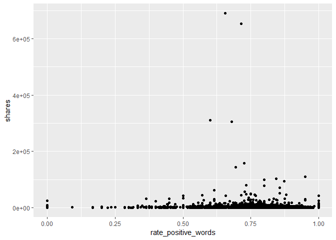<!-- -->
<!-- You’ll be automating the creation of documents using R Markdown (one for each data_channel_is_* setting, i.e. type of article in the data set provided). Each document should be rendered as a github_document from a single .Rmd file. In the README.md file you should create links to each of the documents you will create (Lifestyle analysis, Entertainment analysis, etc.). Links can be made to the sub-documents using relative -->
<!-- paths. For instance, if you have all of the outputted .md files in the main directory you would just use markdown linking: -->

<!-- - The analysis for [Lifestyle articles is available here](LifestyleAnalysis.html). Note we -->
<!-- link to the html file even though the file we create is a .md file - github creates the .html for us. -->
<!-- In the repo’s README.md file (which doesn’t need to be created from a .Rmd file, just use the one you initialize into the repo if you want) give a brief description of the purpose of the repo, a list of R packages used, links to the generated analyses, and the code used to create the analyses from a single .Rmd file (i.e. the render() code). -->

# Modelling

The data is already split into 70% training and 30% test. Our main goal
is to predict the number of shares. This will be our response variable.
We will create four models each using 5-fold cross-validation.

Two models (first linear and random forest) will be multiple linear
regression models, one will be a random forest model and the final model
will be a boosted tree model.

A Linear regression model is a supervised learning technique that is
used to predict the value of a variable based on the value of other
variable(s). The variable you want to predict is called the dependent
variable or the response. The variable(s) you are using to predict is
called the independent variable(s) or the predictor(s).

## First linear model.

We model the number of shares by the selected independent variables

-   “n_tokens_title” (Number of words in the title),

-   “n_tokens_content” (Number of words in the content)

-   “num_imgs” (Number of images)

-   “num_videos” (Number of videos)

-   “is_weekend” (Was the article published on the weekend?)

``` r
#linear regression model 1
l_m1 <- train(shares ~ n_tokens_title +  n_tokens_content + num_imgs + num_videos + 
                       is_weekend, 
              data = ChannelTrain, 
              method = "lm", 
              preProcess = c("center", "scale"),
              trControl = trainControl(method= "cv", number = 5))
#l_m1
#predicting on the ChannelTest data with linear regression model 1
test_pred_l_m1 <- predict(l_m1, newdata = ChannelTest)
#finding the best model - more explicit
m1 <- postResample(test_pred_l_m1, ChannelTest$shares)
m1
```

    ##         RMSE     Rsquared          MAE 
    ## 9.367299e+03 2.700451e-03 2.564012e+03

## Second linear model

We model the number of shares by the selected independent variables

-   “num_hrefs” (Number of links)

-   “weekday_is_monday” (Was the article published on a Monday?)

-   “weekday_is_tuesday” (Was the article published on a Tuesday?)

-   “weekday_is_wednesday” {Was the article published on a Wednesday?)

-   “weekday_is_thursday” (Was the article published on a Thursday?)

-   “weekday_is_friday” (Was the article published on a Friday?)

-   “self_reference_avg_sharess” (Avg. shares of referenced articles in
    Mashable)

``` r
#linear regression model 2
l_m2 <- train(shares ~ num_hrefs + weekday_is_monday + weekday_is_tuesday +
                       weekday_is_wednesday + weekday_is_thursday + weekday_is_friday +
                       self_reference_avg_sharess,
              data = ChannelTrain, 
              method = "lm", 
              preProcess = c("center", "scale"),
              trControl = trainControl(method= "cv", number = 5))
#predictions based on linear model 2 for the ChannelTest data
test_pred_l_m2 <- predict(l_m2, newdata = ChannelTest)
#best model chosen - RMSE reported explicity
#goal is to compare RMSE and see which one is the lowest!
m2 <- postResample(test_pred_l_m2, ChannelTest$shares)
m2
```

    ##         RMSE     Rsquared          MAE 
    ## 9347.8656899    0.0136459 2616.3884567

## Random forest model

The idea behind the random forest model is the same as bagging but we
use a random subset of predictors for each bootstrap sample tree fit
(indicated by “mtry”). More specifically, it involves creating a
boothstrap sample (same size with replacement), training the tree on
this sample (no pruning necessary), repeating the process a large number
of times and the final prediction is the average of those predictions.
Finding the average of predictions decreases variance which improves
predictions but unfortunately we lose interpretability.

For our random forest We model the number of shares by the selected
independent variables

-   “n_tokens_title” (Number of words in the title),

-   “n_tokens_content” (Number of words in the content)

-   “num_imgs” (Number of images)

-   “num_videos” (Number of videos)

-   “is_weekend” (Was the article published on the weekend?)

``` r
r_f <- train(shares ~ n_tokens_title +  n_tokens_content + num_imgs + num_videos + 
                      is_weekend , data = ChannelTrain, method = "rf",
  
             trControl=trainControl(method = "cv", number = 5),
             preProcess = c("center", "scale"),
             tuneGrid = data.frame(mtry = 1:3))
test_pred_r_f <- predict(r_f, newdata = ChannelTest)
m3 <- postResample(test_pred_r_f, ChannelTest$shares)
m3
```

    ##         RMSE     Rsquared          MAE 
    ## 9.426089e+03 5.255047e-03 2.526236e+03

``` r
#bootstrapping will take some time...
```

## Boosted tree model

The idea behind the boosting tree model is to train our tree slowly in a
sequential manner so each tree that is created will be based on the
previous one with predictions updated.

For our boosting tree we model the number of shares by the selected
independent variables

-   “num_hrefs” (Number of links)

-   “weekday_is_monday” (Was the article published on a Monday?)

-   “weekday_is_tuesday” (Was the article published on a Tuesday?)

-   “weekday_is_wednesday” {Was the article published on a Wednesday?)

-   “weekday_is_thursday” (Was the article published on a Thursday?)

-   “weekday_is_friday” (Was the article published on a Friday?)

-   “self_reference_avg_sharess” (Avg. shares of referenced articles in
    Mashable)

Additionally we choose to use all combinations of the tuning parameters
n.trees = c(25, 50, 100, 150, 200), interaction.depth = 1:4, shrinkage =
0.1 and n.minobsinnode = 10.

``` r
tune1<- c(25, 50, 100, 150, 200)
tune2<- 1:4
tune3<- 0.1
tune4<- 10
boosted <- train(shares ~ num_hrefs + weekday_is_monday + weekday_is_tuesday + weekday_is_wednesday + weekday_is_thursday + weekday_is_friday + self_reference_avg_sharess, 
data = ChannelTrain, method = "gbm",
 trControl=trainControl(method = "cv", number = 5),
 preProcess = c("center", "scale"),
 tuneGrid = expand.grid(n.trees = tune1, interaction.depth = tune2, shrinkage = tune3,    n.minobsinnode = tune4))
```

    ## Iter   TrainDeviance   ValidDeviance   StepSize   Improve
    ##      1 341183960.3066             nan     0.1000 -154784.2316
    ##      2 339637560.2416             nan     0.1000 -269831.6797
    ##      3 338348945.0073             nan     0.1000 -689943.3551
    ##      4 338163904.2853             nan     0.1000 213648.8275
    ##      5 337184342.7423             nan     0.1000 -1193981.1752
    ##      6 336626640.3565             nan     0.1000 -1270944.3635
    ##      7 336305597.4478             nan     0.1000 -1491507.6159
    ##      8 336473724.9525             nan     0.1000 -1325659.9040
    ##      9 336644271.4623             nan     0.1000 -773628.2922
    ##     10 336364724.7968             nan     0.1000 -1183769.8328
    ##     20 335898531.0458             nan     0.1000 -1000066.8090
    ##     40 334819932.7683             nan     0.1000 -689531.2893
    ##     60 334465253.8616             nan     0.1000 -929826.5667
    ##     80 333968636.4558             nan     0.1000 -1322571.1265
    ##    100 333089091.5581             nan     0.1000 -2692417.0358
    ##    120 333737946.3411             nan     0.1000 22806.0059
    ##    140 334101261.3500             nan     0.1000 -1200930.6467
    ##    160 332325020.3052             nan     0.1000 -2012097.1256
    ##    180 332715530.8864             nan     0.1000 -1129761.8421
    ##    200 332213298.2651             nan     0.1000 -903658.0798
    ## 
    ## Iter   TrainDeviance   ValidDeviance   StepSize   Improve
    ##      1 341276152.2746             nan     0.1000 1682.7619
    ##      2 339238604.6208             nan     0.1000 -153405.3769
    ##      3 337445525.1234             nan     0.1000 -379172.9669
    ##      4 334734765.0800             nan     0.1000 -240135.0968
    ##      5 334910722.3452             nan     0.1000 -739146.9480
    ##      6 335135588.9589             nan     0.1000 -725525.4232
    ##      7 333802530.3604             nan     0.1000 -1007217.0546
    ##      8 334089283.4752             nan     0.1000 -1000382.7579
    ##      9 334393075.0003             nan     0.1000 -1058715.0680
    ##     10 333261788.9340             nan     0.1000 -1416614.4468
    ##     20 331532645.3874             nan     0.1000 -1563658.0923
    ##     40 330236951.3179             nan     0.1000 -400932.4648
    ##     60 330334410.4395             nan     0.1000 -1269803.6427
    ##     80 330195184.7308             nan     0.1000 -1135366.1833
    ##    100 328466081.6166             nan     0.1000 -1317488.9399
    ##    120 329085232.0068             nan     0.1000 -771171.7849
    ##    140 325329626.1364             nan     0.1000 -339463.9238
    ##    160 324113572.9975             nan     0.1000 -733011.3581
    ##    180 320867746.9166             nan     0.1000 -801520.9980
    ##    200 319218257.9487             nan     0.1000 -1108422.7895
    ## 
    ## Iter   TrainDeviance   ValidDeviance   StepSize   Improve
    ##      1 343313843.6500             nan     0.1000 607550.1738
    ##      2 340686079.9062             nan     0.1000 -61729.7498
    ##      3 339271478.1822             nan     0.1000 62902.9897
    ##      4 336493321.7717             nan     0.1000 -1022707.7604
    ##      5 335199055.9567             nan     0.1000 -548287.5109
    ##      6 333381454.7156             nan     0.1000 -865343.9869
    ##      7 331908362.2739             nan     0.1000 -530780.1533
    ##      8 331988802.4373             nan     0.1000 -406273.7357
    ##      9 329387371.1883             nan     0.1000 -322780.7267
    ##     10 328449746.0648             nan     0.1000 -1102307.9747
    ##     20 319261508.0255             nan     0.1000 -962777.7569
    ##     40 312739240.5739             nan     0.1000 -770599.8011
    ##     60 309131503.0733             nan     0.1000 -2074903.7149
    ##     80 301835809.8983             nan     0.1000 -1031960.9271
    ##    100 295619100.6079             nan     0.1000 -1191067.0753
    ##    120 288538369.6237             nan     0.1000 -1681467.8597
    ##    140 279241990.1667             nan     0.1000 -1648433.2093
    ##    160 276194748.2106             nan     0.1000 -1740080.1449
    ##    180 272734030.6172             nan     0.1000 -1383931.6233
    ##    200 270786600.3989             nan     0.1000 -1195813.7980
    ## 
    ## Iter   TrainDeviance   ValidDeviance   StepSize   Improve
    ##      1 341015209.2113             nan     0.1000 -169340.1090
    ##      2 336068197.2369             nan     0.1000 -845496.7518
    ##      3 335237644.7621             nan     0.1000 483355.9732
    ##      4 331039751.1796             nan     0.1000 -298930.4972
    ##      5 329277428.9105             nan     0.1000 -911734.1099
    ##      6 328880843.5979             nan     0.1000 -963086.1591
    ##      7 327767681.5784             nan     0.1000 -452195.5331
    ##      8 325220490.9492             nan     0.1000 -1897220.0656
    ##      9 325354803.7236             nan     0.1000 -1055628.4948
    ##     10 323263028.3507             nan     0.1000 -1208365.9785
    ##     20 314226278.8054             nan     0.1000 -831832.7317
    ##     40 304929878.5317             nan     0.1000 -1739134.1995
    ##     60 297500637.7782             nan     0.1000 -1114281.0527
    ##     80 284190173.4580             nan     0.1000 485542.4648
    ##    100 275474308.9857             nan     0.1000 -2598344.7336
    ##    120 266640854.5900             nan     0.1000 -850545.6718
    ##    140 260306300.8021             nan     0.1000 -283176.0744
    ##    160 256622240.0868             nan     0.1000 -754058.6798
    ##    180 250585713.4807             nan     0.1000 -1581547.9236
    ##    200 244904171.6070             nan     0.1000 -2702674.5767
    ## 
    ## Iter   TrainDeviance   ValidDeviance   StepSize   Improve
    ##      1 297259465.7491             nan     0.1000 41585.0195
    ##      2 294895949.0120             nan     0.1000 -10283.9733
    ##      3 294614480.4626             nan     0.1000 58120.6780
    ##      4 293128912.5212             nan     0.1000 -469239.0296
    ##      5 292973034.0346             nan     0.1000 -62857.3906
    ##      6 292862913.7823             nan     0.1000 -39589.6710
    ##      7 291589276.7605             nan     0.1000 -1077215.6603
    ##      8 291867486.6732             nan     0.1000 -878495.1714
    ##      9 290548777.3621             nan     0.1000 -762956.1877
    ##     10 290832792.8335             nan     0.1000 -1001689.1669
    ##     20 288529323.5069             nan     0.1000 -1972253.7471
    ##     40 288973753.5543             nan     0.1000 -897043.0783
    ##     60 288273049.1726             nan     0.1000 -1080537.3878
    ##     80 287035782.9276             nan     0.1000 -1754152.6429
    ##    100 287060152.2898             nan     0.1000 -685538.5626
    ##    120 286374602.6114             nan     0.1000 -908053.7746
    ##    140 286741234.0980             nan     0.1000 -2635541.8579
    ##    160 286481665.2117             nan     0.1000 -535506.3671
    ##    180 285436339.5212             nan     0.1000 -1331479.5046
    ##    200 285952218.7052             nan     0.1000 -1201207.5026
    ## 
    ## Iter   TrainDeviance   ValidDeviance   StepSize   Improve
    ##      1 297242887.4499             nan     0.1000 253872.2297
    ##      2 295068990.9639             nan     0.1000 -117003.4946
    ##      3 294808493.6019             nan     0.1000 34597.9296
    ##      4 292790761.4677             nan     0.1000 -332356.9395
    ##      5 291557594.4980             nan     0.1000 -300172.5478
    ##      6 291713897.2536             nan     0.1000 -482212.7217
    ##      7 290611972.6056             nan     0.1000 -1016501.5131
    ##      8 289677173.0266             nan     0.1000 -597891.6561
    ##      9 289117904.2761             nan     0.1000 -1490612.2123
    ##     10 288646782.9819             nan     0.1000 -733117.6256
    ##     20 287789900.3274             nan     0.1000 -486375.6148
    ##     40 284099830.8383             nan     0.1000 -165247.5761
    ##     60 278790863.6411             nan     0.1000 -966832.8232
    ##     80 275325057.1459             nan     0.1000 -569127.1950
    ##    100 274315561.8272             nan     0.1000 -1370035.3532
    ##    120 273071037.9991             nan     0.1000 -872491.5407
    ##    140 273263482.3860             nan     0.1000 -909807.9676
    ##    160 272623921.0452             nan     0.1000 -1502186.5560
    ##    180 271768407.6880             nan     0.1000 -721111.0228
    ##    200 271255737.0280             nan     0.1000 -554191.6703
    ## 
    ## Iter   TrainDeviance   ValidDeviance   StepSize   Improve
    ##      1 294549973.3131             nan     0.1000 -13404.7548
    ##      2 292608146.8623             nan     0.1000 -164744.6071
    ##      3 291472447.8285             nan     0.1000 -513751.7149
    ##      4 291666411.0026             nan     0.1000 -745857.5712
    ##      5 289268117.3082             nan     0.1000 -482934.7286
    ##      6 288043158.6330             nan     0.1000 -467010.3450
    ##      7 287611857.9694             nan     0.1000 -1187476.5017
    ##      8 286431217.8483             nan     0.1000 -1366158.5818
    ##      9 285170495.7570             nan     0.1000 -875272.2790
    ##     10 284768405.0976             nan     0.1000 -1118889.1422
    ##     20 278584983.5995             nan     0.1000 -2206373.6584
    ##     40 271220519.0031             nan     0.1000 -1340830.3346
    ##     60 266172913.6544             nan     0.1000 509514.6760
    ##     80 261893504.2002             nan     0.1000 -1411036.2930
    ##    100 259574283.8751             nan     0.1000 -647823.3324
    ##    120 256327594.9635             nan     0.1000 -215845.7546
    ##    140 250626502.7799             nan     0.1000 -1411660.6342
    ##    160 247558712.8838             nan     0.1000 -548843.4440
    ##    180 243997822.9177             nan     0.1000 -806188.3131
    ##    200 241548047.2290             nan     0.1000 -2493154.6855
    ## 
    ## Iter   TrainDeviance   ValidDeviance   StepSize   Improve
    ##      1 297276344.2224             nan     0.1000 196556.5547
    ##      2 293429207.2745             nan     0.1000 194879.0407
    ##      3 291476759.6409             nan     0.1000 -392835.3402
    ##      4 291095100.6763             nan     0.1000 246265.2720
    ##      5 287327484.3290             nan     0.1000 -575363.5979
    ##      6 285785019.3505             nan     0.1000 -445622.2173
    ##      7 286008910.5709             nan     0.1000 -859463.8809
    ##      8 283692082.3129             nan     0.1000 -267724.4174
    ##      9 283664569.5803             nan     0.1000 -469343.0947
    ##     10 282161796.4864             nan     0.1000 -1039776.6665
    ##     20 273160584.1880             nan     0.1000 -2348126.5727
    ##     40 262994886.5246             nan     0.1000 -1222680.8757
    ##     60 249498649.8108             nan     0.1000 -1199440.2735
    ##     80 235078297.1496             nan     0.1000 -27339.2911
    ##    100 227705720.5383             nan     0.1000 -1313285.1967
    ##    120 219151564.2441             nan     0.1000 -972804.7309
    ##    140 212478689.2802             nan     0.1000 -426735.5501
    ##    160 203305544.1810             nan     0.1000 -1528437.5269
    ##    180 198012142.7217             nan     0.1000 -1071769.9056
    ##    200 192980032.8199             nan     0.1000 -832443.2722
    ## 
    ## Iter   TrainDeviance   ValidDeviance   StepSize   Improve
    ##      1 342226743.7953             nan     0.1000 -130558.1007
    ##      2 340463524.4351             nan     0.1000 -806567.1273
    ##      3 339178402.8867             nan     0.1000 -671708.4531
    ##      4 338456370.6162             nan     0.1000 -1821367.8418
    ##      5 338679921.1524             nan     0.1000 -987468.6002
    ##      6 337878466.8777             nan     0.1000 -416936.9468
    ##      7 338044682.2549             nan     0.1000 -658489.3202
    ##      8 338277329.1832             nan     0.1000 -922245.3667
    ##      9 337836333.2574             nan     0.1000 -1099019.3700
    ##     10 337368041.1632             nan     0.1000 -995072.8584
    ##     20 336926783.4586             nan     0.1000 -921852.0935
    ##     40 335293416.5646             nan     0.1000 -1998885.7538
    ##     60 334675759.7155             nan     0.1000 -1360128.3248
    ##     80 334279333.5089             nan     0.1000 -1221798.9370
    ##    100 333817878.2624             nan     0.1000 -646717.5368
    ##    120 333504241.5233             nan     0.1000 -1443785.2789
    ##    140 333174063.4713             nan     0.1000 -1432778.5815
    ##    160 332753065.1939             nan     0.1000 -575482.6912
    ##    180 332891801.2780             nan     0.1000 -1540960.2922
    ##    200 332761153.8367             nan     0.1000 -1916427.6515
    ## 
    ## Iter   TrainDeviance   ValidDeviance   StepSize   Improve
    ##      1 342322377.5292             nan     0.1000 8612.3702
    ##      2 340359779.2703             nan     0.1000 -654997.6630
    ##      3 340482541.4333             nan     0.1000 -508219.9399
    ##      4 339015032.4995             nan     0.1000 -541009.7013
    ##      5 338050285.9626             nan     0.1000 -1564405.9085
    ##      6 337294208.3078             nan     0.1000 -1018248.2051
    ##      7 337486526.3910             nan     0.1000 -1447145.8836
    ##      8 336623626.1198             nan     0.1000 -519894.3527
    ##      9 336317411.3701             nan     0.1000 -1827973.0554
    ##     10 336255420.4681             nan     0.1000 -1542213.1836
    ##     20 331522349.1296             nan     0.1000 -939548.3282
    ##     40 326041374.7727             nan     0.1000 -983683.5425
    ##     60 323727034.7084             nan     0.1000 -1575694.4469
    ##     80 321611013.6633             nan     0.1000 -1404080.4880
    ##    100 321326758.8539             nan     0.1000 -302219.6851
    ##    120 317342557.1724             nan     0.1000 -612475.7683
    ##    140 315668706.7189             nan     0.1000 -1442562.3441
    ##    160 313955710.5908             nan     0.1000 -458815.1502
    ##    180 313046261.1812             nan     0.1000 -1455359.0940
    ##    200 311727895.1783             nan     0.1000 -908869.2143
    ## 
    ## Iter   TrainDeviance   ValidDeviance   StepSize   Improve
    ##      1 340477241.2339             nan     0.1000 -305805.7168
    ##      2 338026229.4407             nan     0.1000 -304676.1654
    ##      3 335583917.1447             nan     0.1000 -289941.5471
    ##      4 334006702.3561             nan     0.1000 -448304.9230
    ##      5 333987447.3391             nan     0.1000 -819874.7121
    ##      6 331147593.9652             nan     0.1000 -2534583.4427
    ##      7 330964631.2185             nan     0.1000 -1264269.8265
    ##      8 329710386.1970             nan     0.1000 -1750549.5218
    ##      9 328293846.4258             nan     0.1000 -1587338.7015
    ##     10 327498974.5523             nan     0.1000 -1287096.9319
    ##     20 318852871.3791             nan     0.1000 -1956982.6220
    ##     40 312787433.2931             nan     0.1000 -1706198.4942
    ##     60 304929305.5937             nan     0.1000 -1893364.9772
    ##     80 298562761.6440             nan     0.1000 -1694064.0441
    ##    100 295694339.5482             nan     0.1000 -2586591.5714
    ##    120 288010310.1069             nan     0.1000 -858330.8486
    ##    140 279374848.7178             nan     0.1000 -296352.3617
    ##    160 275395756.2667             nan     0.1000 -765560.5725
    ##    180 272530363.4666             nan     0.1000 -820010.0291
    ##    200 266502675.5121             nan     0.1000 -857321.0237
    ## 
    ## Iter   TrainDeviance   ValidDeviance   StepSize   Improve
    ##      1 340031659.3352             nan     0.1000 -456463.0734
    ##      2 337603678.4914             nan     0.1000 -294211.8514
    ##      3 335071837.4565             nan     0.1000 -17559.0889
    ##      4 332004254.8292             nan     0.1000 -1433512.1995
    ##      5 329145505.6650             nan     0.1000 -888174.3070
    ##      6 326657526.3185             nan     0.1000 -1482764.8108
    ##      7 325279397.5136             nan     0.1000 -2644018.2069
    ##      8 323845946.8626             nan     0.1000 -2053972.4159
    ##      9 323484879.6744             nan     0.1000 -1610228.6933
    ##     10 322739019.3082             nan     0.1000 -826648.7291
    ##     20 310620024.9812             nan     0.1000 -2326321.5928
    ##     40 301893568.1042             nan     0.1000 -1681675.8420
    ##     60 294422582.4641             nan     0.1000 -1724563.4306
    ##     80 287060773.9761             nan     0.1000 -1286749.9827
    ##    100 278388396.3940             nan     0.1000 -1338019.2127
    ##    120 270066658.9070             nan     0.1000 -504668.3453
    ##    140 266831928.0835             nan     0.1000 -279144.7187
    ##    160 258824160.5711             nan     0.1000 -1694937.0307
    ##    180 252338935.3243             nan     0.1000 -1576821.0509
    ##    200 245283502.4053             nan     0.1000 1249938.1600
    ## 
    ## Iter   TrainDeviance   ValidDeviance   StepSize   Improve
    ##      1 96054737.9120             nan     0.1000 90322.4486
    ##      2 96019916.8419             nan     0.1000 -35690.9491
    ##      3 95732040.3443             nan     0.1000 15758.0271
    ##      4 95569764.6727             nan     0.1000 68783.2536
    ##      5 95445494.8433             nan     0.1000 55014.6234
    ##      6 95315713.4078             nan     0.1000 59547.1501
    ##      7 95203934.7487             nan     0.1000 49174.0027
    ##      8 95097537.2105             nan     0.1000 10611.7720
    ##      9 95078542.1872             nan     0.1000 -3657.8373
    ##     10 95010079.4331             nan     0.1000 -5286.6437
    ##     20 94533851.3815             nan     0.1000 7643.3960
    ##     40 94228853.0633             nan     0.1000 -35108.6299
    ##     60 94126189.9154             nan     0.1000 -48739.8568
    ##     80 93876717.5936             nan     0.1000 -4692.5211
    ##    100 93719204.7156             nan     0.1000 -97774.0296
    ##    120 93558229.8866             nan     0.1000 -69446.0376
    ##    140 93454945.7287             nan     0.1000 25958.3778
    ##    160 93389929.1531             nan     0.1000 -91714.9509
    ##    180 93304057.1193             nan     0.1000 -58848.4014
    ##    200 93176572.8056             nan     0.1000 50103.2153
    ## 
    ## Iter   TrainDeviance   ValidDeviance   StepSize   Improve
    ##      1 95845947.8794             nan     0.1000 221865.6901
    ##      2 95477103.3981             nan     0.1000 63194.3830
    ##      3 95217694.6467             nan     0.1000 165729.8227
    ##      4 95149437.2164             nan     0.1000 11185.9096
    ##      5 94881352.8941             nan     0.1000 -26231.4368
    ##      6 94786379.6177             nan     0.1000 49061.7561
    ##      7 94603219.1541             nan     0.1000 -82302.4254
    ##      8 94464151.2476             nan     0.1000 -30965.8230
    ##      9 94434858.9854             nan     0.1000 -4737.2499
    ##     10 94106713.1568             nan     0.1000 -133391.0755
    ##     20 92805182.2244             nan     0.1000 -56511.0881
    ##     40 92073575.7389             nan     0.1000 -75753.8993
    ##     60 91105073.7969             nan     0.1000 -40674.9290
    ##     80 90233656.1984             nan     0.1000 -74016.0449
    ##    100 89471074.4384             nan     0.1000 -176533.8518
    ##    120 89075919.6485             nan     0.1000 -165711.4696
    ##    140 88212047.3835             nan     0.1000 -81324.9927
    ##    160 87818136.2769             nan     0.1000 -265858.8031
    ##    180 87118211.8627             nan     0.1000 -128497.8345
    ##    200 86616800.5748             nan     0.1000 -10799.6055
    ## 
    ## Iter   TrainDeviance   ValidDeviance   StepSize   Improve
    ##      1 96026331.2337             nan     0.1000 75632.0184
    ##      2 95707047.1085             nan     0.1000 71432.5180
    ##      3 94995013.7059             nan     0.1000 -86285.3906
    ##      4 94803519.8243             nan     0.1000 29319.3839
    ##      5 93959951.3281             nan     0.1000 -68192.7827
    ##      6 93712316.3583             nan     0.1000 -167344.6785
    ##      7 93320360.0662             nan     0.1000 -388197.9831
    ##      8 93012588.1677             nan     0.1000 95794.9969
    ##      9 92480596.7050             nan     0.1000 -92719.1092
    ##     10 92450152.8421             nan     0.1000 -83704.0683
    ##     20 90570829.9797             nan     0.1000 -141782.9575
    ##     40 88715153.6189             nan     0.1000 -96150.0375
    ##     60 87109771.2322             nan     0.1000 -117603.7953
    ##     80 84763398.8440             nan     0.1000 -270584.2053
    ##    100 83177739.0494             nan     0.1000 -330543.3833
    ##    120 82113926.7745             nan     0.1000 -208653.0714
    ##    140 80596210.9470             nan     0.1000 160854.1758
    ##    160 78998631.2628             nan     0.1000 -25306.2271
    ##    180 78011057.6919             nan     0.1000 -158560.6084
    ##    200 77029333.5445             nan     0.1000 -100491.2164
    ## 
    ## Iter   TrainDeviance   ValidDeviance   StepSize   Improve
    ##      1 95891785.2879             nan     0.1000 188976.7420
    ##      2 95498798.2241             nan     0.1000 19902.6739
    ##      3 95348740.7980             nan     0.1000 28536.6219
    ##      4 94611429.0837             nan     0.1000 -61943.6075
    ##      5 94330846.7991             nan     0.1000 -57811.5920
    ##      6 94129679.4971             nan     0.1000 -42600.8872
    ##      7 93535328.8556             nan     0.1000 -181438.3680
    ##      8 93018055.2297             nan     0.1000 -92714.2211
    ##      9 92981445.7147             nan     0.1000 -81368.1160
    ##     10 92561596.6703             nan     0.1000 -300087.7744
    ##     20 89652734.6247             nan     0.1000 -117760.8955
    ##     40 86282559.1993             nan     0.1000 -170570.7399
    ##     60 83176723.2036             nan     0.1000 -249429.9497
    ##     80 80986450.6758             nan     0.1000 -128331.3765
    ##    100 79036659.0848             nan     0.1000 -233850.6808
    ##    120 76941661.1992             nan     0.1000 -243787.8277
    ##    140 75833182.2680             nan     0.1000 -136600.0241
    ##    160 74413603.4977             nan     0.1000 -57401.3957
    ##    180 73015235.5258             nan     0.1000 -158446.6257
    ##    200 71995811.0992             nan     0.1000 -232817.0081
    ## 
    ## Iter   TrainDeviance   ValidDeviance   StepSize   Improve
    ##      1 346577394.5039             nan     0.1000 222152.4748
    ##      2 346355411.7429             nan     0.1000 16592.1377
    ##      3 343983217.9580             nan     0.1000 -109137.9607
    ##      4 343648518.3509             nan     0.1000 237462.9490
    ##      5 341979979.2154             nan     0.1000 -350677.9244
    ##      6 340477333.2786             nan     0.1000 -1283517.7071
    ##      7 340251437.2344             nan     0.1000 80410.0286
    ##      8 339470854.9118             nan     0.1000 -1263119.5918
    ##      9 338985022.3742             nan     0.1000 -1120527.0238
    ##     10 339182906.7554             nan     0.1000 -930044.0291
    ##     20 339280327.4879             nan     0.1000 34327.6243
    ##     40 337700498.5986             nan     0.1000 -1658965.9275
    ##     60 336951322.8042             nan     0.1000 -1786417.7984
    ##     80 336391734.1753             nan     0.1000 -1373326.1386
    ##    100 336283855.8603             nan     0.1000 -1567634.8720
    ##    120 336013499.7046             nan     0.1000 -146090.6971
    ##    140 335569830.0035             nan     0.1000 -1310082.6973
    ##    160 335150605.2947             nan     0.1000 -508893.7895
    ##    180 334834240.3407             nan     0.1000 -373906.3951
    ##    200 334819304.5003             nan     0.1000 -1008226.6372
    ## 
    ## Iter   TrainDeviance   ValidDeviance   StepSize   Improve
    ##      1 345801257.0123             nan     0.1000 -129012.5527
    ##      2 343385785.1319             nan     0.1000 -199012.5581
    ##      3 341307315.2029             nan     0.1000 -696540.7274
    ##      4 341480648.8426             nan     0.1000 -674877.3853
    ##      5 341163878.3206             nan     0.1000 85946.3938
    ##      6 338956865.0229             nan     0.1000 -164707.5578
    ##      7 337690966.7701             nan     0.1000 -732714.6245
    ##      8 336631234.2737             nan     0.1000 -889378.5364
    ##      9 335693912.4775             nan     0.1000 -560354.9280
    ##     10 335220299.3707             nan     0.1000 -995392.3167
    ##     20 332817794.3855             nan     0.1000 -1665880.2575
    ##     40 331580923.3868             nan     0.1000 -1229523.6850
    ##     60 331457489.5564             nan     0.1000 -1490478.7378
    ##     80 329456038.6882             nan     0.1000 -1062495.5108
    ##    100 324883578.6447             nan     0.1000 -1091895.2623
    ##    120 321915441.0058             nan     0.1000 -1088669.5116
    ##    140 322100933.6642             nan     0.1000 -943678.7859
    ##    160 318230750.4518             nan     0.1000 -671046.3381
    ##    180 316782237.0470             nan     0.1000 -659803.1809
    ##    200 316897554.4460             nan     0.1000 -747748.7441
    ## 
    ## Iter   TrainDeviance   ValidDeviance   StepSize   Improve
    ##      1 344125641.9379             nan     0.1000 -170229.5077
    ##      2 342125049.8941             nan     0.1000 -134496.6187
    ##      3 341979200.4765             nan     0.1000 -738980.9676
    ##      4 339567646.7084             nan     0.1000 -319240.9748
    ##      5 338295215.1117             nan     0.1000 -566804.1694
    ##      6 337178672.8479             nan     0.1000 -1165092.4948
    ##      7 337159283.4811             nan     0.1000 -1036316.2668
    ##      8 336294438.4404             nan     0.1000 -899297.0979
    ##      9 335703483.0512             nan     0.1000 -1907250.7113
    ##     10 335327556.6378             nan     0.1000 -2029051.8077
    ##     20 328459658.0682             nan     0.1000 -1513242.1659
    ##     40 322685073.9687             nan     0.1000 -1711551.0489
    ##     60 313831627.2290             nan     0.1000 -1586482.7854
    ##     80 308943249.9351             nan     0.1000 -1087611.4437
    ##    100 300037733.9474             nan     0.1000 -985161.2553
    ##    120 296061820.1604             nan     0.1000 -1139508.0811
    ##    140 292851718.0449             nan     0.1000 -1474095.1538
    ##    160 289049206.6752             nan     0.1000 -1651805.4262
    ##    180 285941849.8540             nan     0.1000 -2721697.7440
    ##    200 282648621.8570             nan     0.1000 -1188780.7738
    ## 
    ## Iter   TrainDeviance   ValidDeviance   StepSize   Improve
    ##      1 346138073.9440             nan     0.1000 742994.7722
    ##      2 343332354.6213             nan     0.1000 -84742.0284
    ##      3 341167976.6538             nan     0.1000 236724.2904
    ##      4 337024827.2807             nan     0.1000 -609206.4858
    ##      5 334007336.6781             nan     0.1000 -1707393.6215
    ##      6 334196147.0212             nan     0.1000 -937523.2715
    ##      7 331751453.3922             nan     0.1000 -1545512.2108
    ##      8 330638192.0731             nan     0.1000 -923008.3571
    ##      9 330744431.8280             nan     0.1000 -1210078.4493
    ##     10 330082231.9783             nan     0.1000 -1033764.9569
    ##     20 319861789.0130             nan     0.1000 -2116876.2376
    ##     40 307372341.9568             nan     0.1000 -2092914.4365
    ##     60 303361861.0275             nan     0.1000 -1747506.8450
    ##     80 292705869.0305             nan     0.1000 -1239063.0299
    ##    100 286356675.1318             nan     0.1000 -1204423.5669
    ##    120 280130763.9066             nan     0.1000 -1184492.0256
    ##    140 278162171.4842             nan     0.1000 -1294781.3702
    ##    160 272887620.9273             nan     0.1000 -861723.5839
    ##    180 271609403.0446             nan     0.1000 -833722.1018
    ##    200 265697290.5691             nan     0.1000 -1593959.1193
    ## 
    ## Iter   TrainDeviance   ValidDeviance   StepSize   Improve
    ##      1 283874365.5297             nan     0.1000 -135952.4169
    ##      2 283717916.6338             nan     0.1000 202193.9214
    ##      3 283540153.1483             nan     0.1000 -22497.9097
    ##      4 283384941.7975             nan     0.1000 181518.7171
    ##      5 282014410.3370             nan     0.1000 -384968.1991
    ##      6 281840244.3132             nan     0.1000 52862.6870
    ##      7 281619774.0541             nan     0.1000 174728.0690
    ##      8 280672318.4871             nan     0.1000 -596874.8395
    ##      9 280039453.9748             nan     0.1000 -709545.2188
    ##     10 280297791.8027             nan     0.1000 -986809.4065
    ##     20 279306318.8383             nan     0.1000 -1009439.0386
    ##     25 278560508.1555             nan     0.1000 -62100.6782

``` r
test_pred_boosted <- predict(boosted, newdata = ChannelTest)
m4 <- postResample(test_pred_boosted, ChannelTest$shares)
m4
```

    ##         RMSE     Rsquared          MAE 
    ## 9.461004e+03 1.822855e-02 2.641151e+03

Next we do a comparison of the four models

# Comaprison

The `postResample()` function was used to calculate useful statistics
such as rmse and R squared values for each one of the four models. We
summarize them in the tibble below.

``` r
lm1 <- tibble(model = c("First linear regression"), RMSE = c(m1[[1]]), R2 = c(m1[[2]]))
lm2 <- tibble(model = c("Second linear regression"), RMSE = c(m2[[1]]), R2 = c(m2[[2]]))
rf <- tibble(model = c("Random Forest"), RMSE = c(m3[[1]]), R2 = c(m3[[2]]))
Bos <- tibble(model = c("Boosting"), RMSE = c(m4[[1]]), R2 = c(m4[[2]]))
RMSE_table <- rbind(lm1, lm2, rf, Bos)
RMSE_table
```

    ## # A tibble: 4 × 3
    ##   model                     RMSE      R2
    ##   <chr>                    <dbl>   <dbl>
    ## 1 First linear regression  9367. 0.00270
    ## 2 Second linear regression 9348. 0.0136 
    ## 3 Random Forest            9426. 0.00526
    ## 4 Boosting                 9461. 0.0182

RMSE is a metric that tells us how far apart the predicted values are
from the observed values in a dataset, on average. The lower the RMSE,
the better a model fits a dataset.

R2 is a metric that tells us the proportion of the variance in the
response variable of a regression model that can be explained by the
predictor variables. This value ranges from 0 to 1. The higher the R2
value, the better a model fits a dataset.

From the table above the First linear regession model has the lowest
RMSE and the hightest R2 and is therefore our winner.

``` r
#pick the smallest RMSE for the best model...
final_result <- RMSE_table %>%
                filter ( min(RMSE) == RMSE )
final_result
```

    ## # A tibble: 1 × 3
    ##   model                     RMSE     R2
    ##   <chr>                    <dbl>  <dbl>
    ## 1 Second linear regression 9348. 0.0136

When comparing all 4 of our models, we are looking for the smallest
value of RMSE to tell us which model is the best. In this situation, we
can say that the smallest RMSE is 9347.8656899 and this comes from the
Second linear regression model.

<!-- # Project Work -->
<!-- The first step is for the first group member to create a github repo and add the second group member as a collaborator. The second group member then needs to accept the membership. This gives everyone access to push changes up to the repository. All project work should be done within this repo. -->
<!-- Each time you go to work on the project, you should pull down any of the latest changes using git pull. You should then upload any changes you’ve made via the usual workflow done previously. There may occasionally be merge conflicts that have to be dealt with. This can be done with the Git tab in RStudio. Let us know if you are having issues with conflicts that you can’t resolve! -->
<!-- # Repo Setting -->
<!-- On your project repo you should go into the settings and enable github pages (feel free to select a theme too!). This will make it so your repo can be accessed like your blog (username.github.io/repo-name). Be sure to choose the master or main branch as the one to use if you have choices there. -->
<!-- You’ll be automating the creation of documents using R Markdown (one for each data_channel_is_* setting, i.e. type of article in the data set provided). Each document should be rendered as a github_document from a single .Rmd file. In the README.md file you should create links to each of the documents you will create (Lifestyle analysis, Entertainment analysis, etc.). Links can be made to the sub-documents using relative -->
<!-- paths. For instance, if you have all of the outputted .md files in the main directory you would just use markdown linking: -->
<!-- - The analysis for [Lifestyle articles is available here](LifestyleAnalysis.html). Note we -->
<!-- link to the html file even though the file we create is a .md file - github creates the .html for us. -->
<!-- In the repo’s README.md file (which doesn’t need to be created from a .Rmd file, just use the one you initialize into the repo if you want) give a brief description of the purpose of the repo, a list of R packages used, links to the generated analyses, and the code used to create the analyses from a single .Rmd file (i.e. the render() code). -->

# Blog

Once you’ve completed the project each of you should write a brief blog
post outlining your project and two links to the
username.github.io/repo-name site and the repo itself (the username may
correspond to your partner). You should then also reflect on the process
you went through. Discuss the following:

-   what would you do differently?  
-   what was the most difficult part for you?  
-   what are your big take-aways from this project?

<!-- # Topic -->
<!-- What are you actually doing? You’ll read in and analyze an online news popularity data set. You’ll subset the data by data_channel_is_* (one of six groups). Then you’ll summarize the data and try to predict the number of shares using predictive models. -->
<!-- 1. Read in the OnlineNewsPopularity.csv data file -- subset for data_channel_is_lifestyle: Is data channel 'Lifestyle'? -->
<!-- Here, `read_csv()` is used to read in the OnlineNewsPopularity.csv data and we are subsetting for the `data_channel_is_lifestyle`: Is data channel 'Lifestyle'? variable.  -->
<!-- ``` {r, echo=TRUE, eval=TRUE} -->
<!-- #install one time thing -->
<!-- #install.packages("caret") -->
<!-- #read in data set .csv file in full -->
<!-- #OnlineNewsPopularity <- readr::read_csv(file="OnlineNewsPopularity.csv",  -->
<!-- #                                        show_col_types = FALSE) -->
<!-- ``` -->
<!-- ``` {r, echo=TRUE, eval=TRUE} -->
<!-- #subsetting the data for`data_channel_is_lifestyle`: Is data channel 'Lifestyle'? -->
<!-- #Lifestyle <- OnlineNewsPopularity %>%  -->
<!-- #              filter( data_channel_is_lifestyle == 1) -->
<!-- ``` -->
<!-- # Report -->
<!-- Recommendation: At first, consider just using data from a single data_channel_is_* source. Once you have all of the below steps done for that data, then you can automate it to work with any chosen data channel. Note: It may be easier to create a single variable representing the data channel when automating the subsetting (although there are many ways to do this).   -->
<!-- - All code chunks should be shown unless they are setup code chunks.   -->
<!-- # Introduction section -->
<!-- You should have an introduction section that briefly describes the data and the variables you have to work with (just discuss the ones you want to use). Your target variables is the shares variable. -->
<!-- You should also mention the purpose of your analysis and the methods you’ll use to model the response. You’ll describe those in more detail later. -->
<!-- **This section should be done by the ‘second’ group member.** -->
<!-- # Data -->
<!-- Use a relative path to import the data. Subset the data to work on the data channel of interest. -->
<!-- **This section should be done by whoever can get to it first.** -->

# Summarizations

You should produce some basic (but meaningful) summary statistics and
plots about the training data you are working with (especially as it
relates to your response).

As you will automate this same analysis across other data, you can’t
describe the trends you see in the graph (unless you want to try to
automate that!). You should describe what to look for in the summary
statistics/plots to help the reader understand the summary or graph. Ex:
A scatter plot with the number of shares on the y-axis and the positive
word rate on the x-axis is created:

‘We can inspect the trend of shares as a function of the positive word
rate. If the points show an upward trend, then articles with more
positive words tend to be shared more often. If we see a negative trend
then articles with more positive words tend to be shared less often.’

Each group member is responsible for producing some summary statistics
(means, sds, contingency tables, etc.) and for producing at least three
graphs (each) of the data.

# Modeling

You’ll need to split the data into a training (70% of the data) and test
set (30% of the data). Use set.seed() to make things reproducible.

The goal is to create models for predicting the number of shares in some
way. Each group member should contribute a linear regression model and
an ensemble tree-based model. As we are automating things, describing
the chosen model is tough, so no need to worry about that.

The first group member should fit a random forest model and the second
group member should fit a boosted tree model. Both models should be
chosen using cross-validation.

Prior to the models fit using linear regression, the first group member
should provide a short but thorough explanation of the idea of a linear
regression model.

Prior to each ensemble model, you should provide a short but reasonably
thorough explanation of the ensemble model you are using (so one for
each group member).

# Comparison

All four of the models should be compared on the test set and a winner
declared (this should be automated to be correct across all the created
documents).

This can be done by one group member and the automation done by the
other (see below).

# Automation

<!-- Once you’ve completed the above for a particular data channel, adapt the code so that you can use a parameter in your build process. You should be able to automatically generate an analysis report for each data_channel_is_* variable - although again, you may want to create a new variable to help with the subsetting. You’ll end up with six total outputted documents. -->
<!-- This should be done by the group member that doesn’t automate the comparison of models part. -->

# Submission

In the project submission, you should simply put a link to your blog
post (which will have a link to your github pages and github repo).

<!-- # Group Issues -->
<!-- Please notify me ASAP of any group member issues. You should look over your partner’s work/explanations and discuss that with them if you have any issues with what they’ve done. Both group members are graded on all the work done regardless of who was assigned to do it. -->
<!--
Rubric for Grading (total = 100 points)
Item                               Points           Notes
Introduction                       10               Worth either 0, 5, or 10
Data split                          5               Worth either 0 or 5
Summarizations & discussions       20               Worth either 0, 5,. . . , or 20
Modeling, selection, & discussion  35               Worth either 0, 5, . . . , 35
Test set prediction and automation 10               Worth either 0, 5, or 10
Automation                         15               Worth either 0, 5, 10, or 15
Blog post and repo setup           10               Worth either 0, 5, or 10
-->
<!--
Notes on grading:
• For each item in the rubric, your grade will be lowered one level for each each error (syntax, logical, or other) in the code and for each required item that is missing or lacking a description.  
• If your work was not completed and documented using your github repo you will lose 50
points on the project.  
• You should use Good Programming Practices when coding (see wolfware). If you do not follow GPP you can lose up to 40 points on the project.  
• You should use appropriate markdown options/formatting (you can lose up to 20 points) for not doing so.
-->
<!-- code needed to render pdf file -->
