ST558 Project 3
================
Magaritte Nguyen and Matthew Sookoo
2022-11-12

-   <a href="#introduction" id="toc-introduction">Introduction</a>
    -   <a href="#more-about-the-variables"
        id="toc-more-about-the-variables">More about the variables</a>
        -   <a href="#response-variable" id="toc-response-variable">Response
            variable</a>
        -   <a href="#independent-or-predictor-variables"
            id="toc-independent-or-predictor-variables">Independent or predictor
            variables</a>
-   <a href="#required-packages" id="toc-required-packages">Required
    Packages</a>
-   <a href="#data" id="toc-data">Data</a>
    -   <a href="#reading-in-the-data" id="toc-reading-in-the-data">Reading in
        the data</a>
-   <a href="#summarizations" id="toc-summarizations">Summarizations</a>
-   <a href="#modelling" id="toc-modelling">Modelling</a>
    -   <a href="#first-linear-model" id="toc-first-linear-model">First linear
        model.</a>
    -   <a href="#second-linear-model" id="toc-second-linear-model">Second
        linear model</a>
    -   <a href="#random-forest-model" id="toc-random-forest-model">Random
        forest model</a>
    -   <a href="#boosted-tree-model" id="toc-boosted-tree-model">Boosted tree
        model</a>
-   <a href="#comaprison" id="toc-comaprison">Comaprison</a>
-   <a href="#blog" id="toc-blog">Blog</a>
-   <a href="#summarizations-1" id="toc-summarizations-1">Summarizations</a>
-   <a href="#modeling" id="toc-modeling">Modeling</a>
-   <a href="#comparison" id="toc-comparison">Comparison</a>
-   <a href="#automation" id="toc-automation">Automation</a>
-   <a href="#submission" id="toc-submission">Submission</a>

<!-- testing automation form yaml header -->
<!-- it works -->
<!-- 
############################################################# 
#############################################################
### Project 3 Group F
############################################################# 
############################################################# 
-->
<!-- setup -->

# Introduction

Our goal with this project is to take the data about articles published
by Mashable (www.mashable.com) and create predictive models for the
number of shares in social networks (popularity) then automating our
Markdown reports. This dataset summarizes a heterogeneous set of
features in a period of two years.

The way we will summarize the data and try to predict the number of
shares is via linear regression, random forest, and boosting (will add
more later)

-   briefly describes the data and the variables you have to work with
    (just discuss the ones you want to use).

-   Your target variables is the shares variable.

-   mention the purpose of your analysis and the methods you’ll use to
    model the response.

-   You’ll describe those in more detail later.

Data Set Information:

-   The articles were published by Mashable (www.mashable.com) and their
    content as the rights to reproduce it belongs to them. Hence, this
    dataset does not share the original content but some statistics
    associated with it. The original content be publicly accessed and
    retrieved using the provided urls.

-   Acquisition date: January 8, 2015

-   The estimated relative performance values were estimated by the
    authors using a Random Forest classifier and a rolling windows as
    assessment method. See their article for more details on how the
    relative performance values were set.

Our goal with this project is to create predictive models and automating
Markdown reports. We are using this [Online News Popularity Data
Set](https://archive.ics.uci.edu/ml/datasets/Online+News+Popularity).

This dataset summarizes a heterogeneous set of features about articles
published by [Mashable](http://www.mashable.com) in a period of two
years.

## More about the variables

The data contains 39644 observations and 61 variables (58 predictive
attributes, 2 non-predictive, 1 goal field) and we are interested in the
number of shares of the online news. We only mention the one we use in
our project.

### Response variable

-   “shares” (Number of shares (target))

### Independent or predictor variables

-   “data_channel_is\_\*” (Lifestyle, Entertainment, Business, Social
    Media, Tech, World)

-   “n_tokens_title” (Number of words in the title),

-   “n_tokens_content” (Number of words in the content)

-   “num_imgs” (Number of images)

-   “num_videos” (Number of videos)

-   “is_weekend” (Was the article published on the weekend?)

-   “num_hrefs” (Number of links)

-   “weekday_is_monday” (Was the article published on a Monday?)

-   “weekday_is_tuesday” (Was the article published on a Tuesday?)

-   “weekday_is_wednesday” {Was the article published on a Wednesday?)

-   “weekday_is_thursday” (Was the article published on a Thursday?)

-   “weekday_is_friday” (Was the article published on a Friday?)

-   “self_reference_avg_sharess” (Avg. shares of referenced articles in
    Mashable)

# Required Packages

The following packages are used for our data manipulation, prediction,
etc.:

-   `tidyverse`: Tons of useful features for data manipulation and
    visualization!
-   `caret`: Used for predictive modelling.
-   `shiny`
-   `rmarkdown`

MORE ADDED LATER AS REQUIRED…

<!-- packages that we installed and are calling via library() function -->

# Data

## Reading in the data

Read in the OnlineNewsPopularity.csv data file – subset for
data_channel_is_entertainment: Is data channel ’’?
<!-- str_to_title("social media") ->> "Social Media" -->

Here, `read_csv()` is used to read in the OnlineNewsPopularity.csv data
and we are subsetting for the data_channel_is_entertainment: Is data
channel ’’? variable.

Firstly, we read in the data using `read_csv()`.

``` r
#check working directory
getwd()
```

    ## [1] "C:/Users/Home Pc/Desktop/ST558 Project 3 new/ST558_Project3_GroupF"

``` r
#reassign working directory
#Magaritte's directory
#setwd("D:/ST558/Project 3/ST558_Project3_GroupF")
#Matthew's directory
setwd("C:\\Users\\Home Pc\\Desktop\\ST558 Project 3 new\\ST558_Project3_GroupF\\")
#read in data set .csv file in full
#make sure that this is a relative path used...
# ./ stays in the same file directory
OnlineNewsPopularity<-read_csv("./OnlineNewsPopularity.csv", show_col_types = FALSE)
#call object OnlineNewsPopularity - our full raw data
OnlineNewsPopularity
```

    ## # A tibble: 39,644 × 61
    ##    url        timed…¹ n_tok…² n_tok…³ n_uni…⁴ n_non…⁵ n_non…⁶ num_h…⁷ num_s…⁸ num_i…⁹ num_v…˟
    ##    <chr>        <dbl>   <dbl>   <dbl>   <dbl>   <dbl>   <dbl>   <dbl>   <dbl>   <dbl>   <dbl>
    ##  1 http://ma…     731      12     219   0.664    1.00   0.815       4       2       1       0
    ##  2 http://ma…     731       9     255   0.605    1.00   0.792       3       1       1       0
    ##  3 http://ma…     731       9     211   0.575    1.00   0.664       3       1       1       0
    ##  4 http://ma…     731       9     531   0.504    1.00   0.666       9       0       1       0
    ##  5 http://ma…     731      13    1072   0.416    1.00   0.541      19      19      20       0
    ##  6 http://ma…     731      10     370   0.560    1.00   0.698       2       2       0       0
    ##  7 http://ma…     731       8     960   0.418    1.00   0.550      21      20      20       0
    ##  8 http://ma…     731      12     989   0.434    1.00   0.572      20      20      20       0
    ##  9 http://ma…     731      11      97   0.670    1.00   0.837       2       0       0       0
    ## 10 http://ma…     731      10     231   0.636    1.00   0.797       4       1       1       1
    ## # … with 39,634 more rows, 50 more variables: average_token_length <dbl>,
    ## #   num_keywords <dbl>, data_channel_is_lifestyle <dbl>,
    ## #   data_channel_is_entertainment <dbl>, data_channel_is_bus <dbl>,
    ## #   data_channel_is_socmed <dbl>, data_channel_is_tech <dbl>, data_channel_is_world <dbl>,
    ## #   kw_min_min <dbl>, kw_max_min <dbl>, kw_avg_min <dbl>, kw_min_max <dbl>,
    ## #   kw_max_max <dbl>, kw_avg_max <dbl>, kw_min_avg <dbl>, kw_max_avg <dbl>,
    ## #   kw_avg_avg <dbl>, self_reference_min_shares <dbl>, self_reference_max_shares <dbl>, …

We now subset the data for the data channel of interest: .

``` r
#subsetting the OnlineNewsPopularity full raw data for the data channel of interest -- Lifestyle
Channel <- OnlineNewsPopularity %>% 
               #filter(data_channel_is_lifestyle == 1) %>%
               filter(get(params$channel) == 1) %>%
               # removing non-predictive variables per dataset description
               # remove all data_channel_is_* variables because we already filtered on them and we do not want them included in the model!
               #select( ! c(url, timedelta, starts_with("data_channel_is_" ) ) )
                select( ! c(url, timedelta ) )
#tidyverse way of looking at the dataset -- similar to str()
#glimpse(Channel)
#calling the Channel object to view
Channel
```

    ## # A tibble: 7,057 × 59
    ##    n_tokens…¹ n_tok…² n_uni…³ n_non…⁴ n_non…⁵ num_h…⁶ num_s…⁷ num_i…⁸ num_v…⁹ avera…˟ num_k…˟
    ##         <dbl>   <dbl>   <dbl>   <dbl>   <dbl>   <dbl>   <dbl>   <dbl>   <dbl>   <dbl>   <dbl>
    ##  1         12     219   0.664    1.00   0.815       4       2       1       0    4.68       5
    ##  2          9     531   0.504    1.00   0.666       9       0       1       0    4.40       7
    ##  3         14     194   0.765    1.00   0.840       4       4       0       1    4.52       6
    ##  4         12     161   0.669    1.00   0.752       5       4       0       6    4.45      10
    ##  5         11     454   0.566    1.00   0.755       5       3       1       0    4.89       6
    ##  6         12     177   0.741    1.00   0.823       4       3       1       0    5.06       9
    ##  7          5     356   0.618    1.00   0.766       3       3      12       1    4.47      10
    ##  8         11     281   0.611    1.00   0.766       5       4       1       0    4.61       4
    ##  9         10     909   0.450    1.00   0.670       3       2       1       1    4.34       5
    ## 10         10     413   0.606    1.00   0.729       6       1      13       0    4.70       6
    ## # … with 7,047 more rows, 48 more variables: data_channel_is_lifestyle <dbl>,
    ## #   data_channel_is_entertainment <dbl>, data_channel_is_bus <dbl>,
    ## #   data_channel_is_socmed <dbl>, data_channel_is_tech <dbl>, data_channel_is_world <dbl>,
    ## #   kw_min_min <dbl>, kw_max_min <dbl>, kw_avg_min <dbl>, kw_min_max <dbl>,
    ## #   kw_max_max <dbl>, kw_avg_max <dbl>, kw_min_avg <dbl>, kw_max_avg <dbl>,
    ## #   kw_avg_avg <dbl>, self_reference_min_shares <dbl>, self_reference_max_shares <dbl>,
    ## #   self_reference_avg_sharess <dbl>, weekday_is_monday <dbl>, weekday_is_tuesday <dbl>, …

``` r
#testing
#correct - we expect 2099 vars
table(Channel[[params$channel]])
```

    ## 
    ##    1 
    ## 7057

# Summarizations

Now split the data set we’ve created into a training and testing set.
Use p = 0.7.

Here, we are splitting our created data, Channel, into a training and
test set with p = 0.7. These datasets will be called `ChannelTrain` and
`ChannelTest`.

Note: A seed was set for reproducibility purposes.

``` r
#seed is set for reproducibility 
set.seed(123)
#another way to split train and test data below
# #indices to split on
# train <- sample(1:nrow(my_heart), size = nrow(my_heart)*0.70)
# test <- dplyr::setdiff(1:nrow(my_heart), train)
# #subset
# heartTrain <- my_heart[train, ]
# heartTest <- my_heart[test, ]
#indices to split on
ChannelIndex <- createDataPartition(Channel$shares, p = 0.70, list = FALSE)
#subset
ChannelTrain <- Channel[ ChannelIndex, ]
ChannelTest  <- Channel[-ChannelIndex, ]
```

You should produce some basic (but meaningful) summary statistics and
plots about the training data you are working with (especially as it
relates to your response).

As you will automate this same analysis across other data, you can’t
describe the trends you see in the graph (unless you want to try to
automate that!). You should describe what to look for in the summary
statistics/plots to help the reader understand the summary or graph. Ex:
A scatter plot with the number of shares on the y-axis and the positive
word rate on the x-axis is created:

‘We can inspect the trend of shares as a function of the positive word
rate. If the points show an upward trend, then articles with more
positive words tend to be shared more often. If we see a negative trend
then articles with more positive words tend to be shared less often.’

Each group member is responsible for producing some summary statistics
(means, sds, contingency tables, etc.) and for producing at least three
graphs (each) of the data.

Whenever you start thinking about fitting a regression model, the first
think you want to do is data exploration (EDA - exploratory data
analysis). Best think you can do is create scatter plots for each
explanatory variable against the response variable. Scatter plots give
us useful visualizations. we will look at how to fit the line in R
(overlay), then predict a response using that line.

``` r
#this shows the summary stats for each variable in our dataset...
# 31. weekday_is_monday: Was the article published on a Monday?
summary(ChannelTrain$weekday_is_monday)
```

    ##    Min. 1st Qu.  Median    Mean 3rd Qu.    Max. 
    ##  0.0000  0.0000  0.0000  0.1872  0.0000  1.0000

``` r
# 32. weekday_is_tuesday: Was the article published on a Tuesday?
summary(ChannelTrain$weekday_is_tuesday)
```

    ##    Min. 1st Qu.  Median    Mean 3rd Qu.    Max. 
    ##  0.0000  0.0000  0.0000  0.1852  0.0000  1.0000

``` r
# 33. weekday_is_wednesday: Was the article published on a Wednesday?
summary(ChannelTrain$weekday_is_wednesday)
```

    ##    Min. 1st Qu.  Median    Mean 3rd Qu.    Max. 
    ##   0.000   0.000   0.000   0.187   0.000   1.000

``` r
# 34. weekday_is_thursday: Was the article published on a Thursday?
summary(ChannelTrain$weekday_is_thursday)
```

    ##    Min. 1st Qu.  Median    Mean 3rd Qu.    Max. 
    ##  0.0000  0.0000  0.0000  0.1759  0.0000  1.0000

``` r
# 35. weekday_is_friday: Was the article published on a Friday?
summary(ChannelTrain$weekday_is_friday)
```

    ##    Min. 1st Qu.  Median    Mean 3rd Qu.    Max. 
    ##   0.000   0.000   0.000   0.137   0.000   1.000

``` r
# 36. weekday_is_saturday: Was the article published on a Saturday?
summary(ChannelTrain$weekday_is_saturday)
```

    ##    Min. 1st Qu.  Median    Mean 3rd Qu.    Max. 
    ## 0.00000 0.00000 0.00000 0.05485 0.00000 1.00000

``` r
# 37. weekday_is_sunday: Was the article published on a Sunday?
summary(ChannelTrain$weekday_is_sunday)
```

    ##    Min. 1st Qu.  Median    Mean 3rd Qu.    Max. 
    ## 0.00000 0.00000 0.00000 0.07286 0.00000 1.00000

``` r
# 38. is_weekend: Was the article published on the weekend? 
summary(ChannelTrain$is_weekend)
```

    ##    Min. 1st Qu.  Median    Mean 3rd Qu.    Max. 
    ##  0.0000  0.0000  0.0000  0.1277  0.0000  1.0000

``` r
# 60. shares: Number of shares (target)
summary(ChannelTrain$shares)
```

    ##    Min. 1st Qu.  Median    Mean 3rd Qu.    Max. 
    ##      47     833    1200    2958    2100  210300

``` r
#contigency tables
# example: table (crabs$color, crabs$spine, crabs$y)
# monday is the mot published articels... compare to diff of the week
table(ChannelTrain$weekday_is_monday, ChannelTrain$weekday_is_tuesday)
```

    ##    
    ##        0    1
    ##   0 3101  915
    ##   1  925    0

``` r
table(ChannelTrain$weekday_is_monday, ChannelTrain$weekday_is_wednesday)
```

    ##    
    ##        0    1
    ##   0 3092  924
    ##   1  925    0

``` r
table(ChannelTrain$weekday_is_monday, ChannelTrain$weekday_is_thursday)
```

    ##    
    ##        0    1
    ##   0 3147  869
    ##   1  925    0

``` r
table(ChannelTrain$weekday_is_monday, ChannelTrain$weekday_is_friday)
```

    ##    
    ##        0    1
    ##   0 3339  677
    ##   1  925    0

``` r
#sum stats for all 61 vars - not helpful...
#Lifestlye_sumstats_Train <- summary(ChannelTrain)
#calling Lifestlye_sumstats_Train object to see our summary stats
#Lifestlye_sumstats_Train
#check structure of objects
#str(ChannelTrain)
#str(Lifestlye_sumstats_Train)
#plots include - scatter plots, correlation plots -- plots for continuous data...
#do we need bar plots?
#data for descriptive plots:
plot_data_weekday_weekend <- ChannelTrain %>%
                               mutate ( weekday = case_when(
                                          weekday_is_monday    == 1 ~ "Monday"   ,
                                          weekday_is_tuesday   == 1 ~ "Tuesday"  ,
                                          weekday_is_wednesday == 1 ~ "Wednesday",
                                          weekday_is_thursday  == 1 ~ "Thursday" ,
                                          weekday_is_friday    == 1 ~ "Friday"   ,
                                          weekday_is_saturday  == 1 ~ "Saturday" ,
                                          weekday_is_sunday    == 1 ~ "Sunday"   ,
                                          TRUE ~ NA_character_
                                      ),
                                        weekday = factor(
                                          x = weekday,
                                          levels = c("Monday", "Tuesday", "Wednesday",
                                                     "Thursday", "Friday", "Saturday",
                                                     "Sunday"),
                                          ordered = TRUE
                                          ) )
#A scatter plot with the number of shares on the y-axis and the positive word rate on the x-axis is created below
ggplot(data=plot_data_weekday_weekend, 
            aes(y=shares, x=weekday)) + 
            labs(x="Articles Published on Certain Days of the Week", y="Shares") +
            geom_boxplot() + scale_y_log10() +
            geom_point(aes(color=weekday), position="jitter") 
```

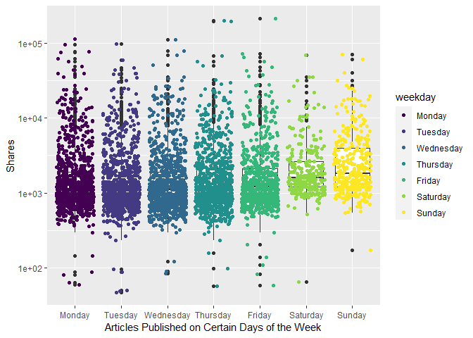<!-- -->

``` r
# when we take the log of the data, we can see easier... Poisson...
# plot scatter after boxplot because we want to see where the majority of the dots are...
#total articles published is actually higher Monday and fewer on the weekend. but boxplots look like they are lower on the weekdays because more articles are published but less shares are occurring...
#plots - scatter plot with boxplot overlayed
# 31. weekday_is_monday: Was the article published on a Monday?
#this one doesnt work bc we need levels...
#ggplot(data=ChannelTrain, aes(y=shares, x=weekday_is_monday)) + geom_point()
# the y - axis is using a log axis not a linear axis, but the plots are more easily interpretable /  visually more ituitive with this transformation.
ggplot(data=ChannelTrain %>% 
              mutate(weekday_fctr = factor(x=weekday_is_monday,  
              levels=c(0,1), labels = c("No", "Yes"))), 
            aes(y=shares, x=weekday_fctr)) + 
            labs(x="Articles Published on Monday", y="Shares", color = "Published") +
            geom_boxplot() + scale_y_log10() +
            geom_point(aes(color=weekday_fctr), position="jitter", alpha=0.4) 
```

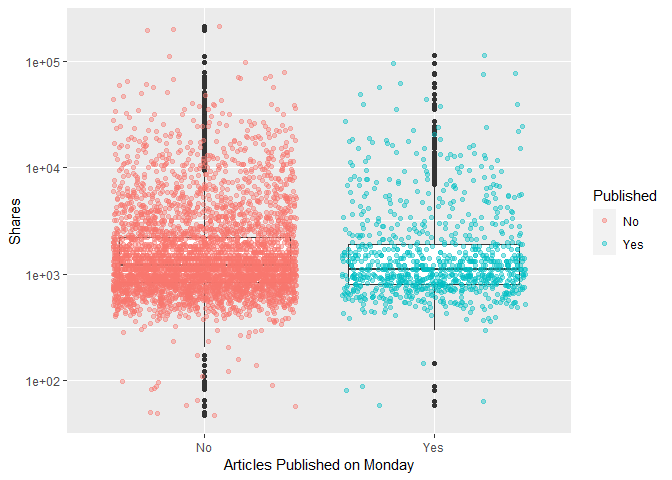<!-- -->

``` r
# 32. weekday_is_tuesday: Was the article published on a Tuesday
ggplot(data=ChannelTrain %>% 
              mutate(weekday_fctr = factor(x=weekday_is_tuesday,  
              levels=c(0,1), labels = c("No", "Yes"))), 
            aes(y=shares, x=weekday_fctr)) + 
            labs(x="Articles Published on Tuesday", y="Shares", color = "Published") +
            geom_boxplot() + scale_y_log10() +
            geom_point(aes(color=weekday_fctr), position="jitter", alpha=0.4) 
```

<!-- -->

``` r
# 33. weekday_is_wednesday: Was the article published on a Wednesday?
ggplot(data=ChannelTrain %>% 
              mutate(weekday_fctr = factor(x=weekday_is_wednesday,  
              levels=c(0,1), labels = c("No", "Yes"))), 
            aes(y=shares, x=weekday_fctr)) + 
            labs(x="Articles Published on Wednesday", y="Shares", color = "Published") +
            geom_boxplot() + scale_y_log10() +
            geom_point(aes(color=weekday_fctr), position="jitter", alpha=0.4) 
```

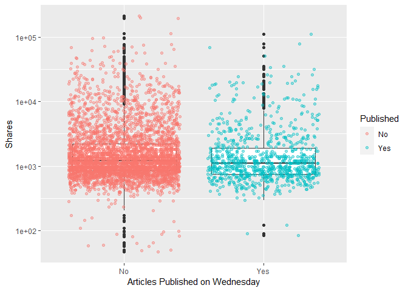<!-- -->

``` r
# 34. weekday_is_thursday: Was the article published on a Thursday?
ggplot(data=ChannelTrain %>% 
              mutate(weekday_fctr = factor(x=weekday_is_thursday,  
              levels=c(0,1), labels = c("No", "Yes"))), 
            aes(y=shares, x=weekday_fctr)) + 
            labs(x="Articles Published on Thursday", y="Shares", color = "Published") +
            geom_boxplot() + scale_y_log10() +
            geom_point(aes(color=weekday_fctr), position="jitter", alpha=0.4) 
```

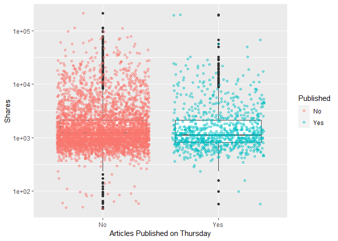<!-- -->

``` r
# 35. weekday_is_friday: Was the article published on a Friday?
ggplot(data=ChannelTrain %>% 
              mutate(weekday_fctr = factor(x=weekday_is_friday,  
              levels=c(0,1), labels = c("No", "Yes"))), 
            aes(y=shares, x=weekday_fctr)) + 
            labs(x="Articles Published on Friday", y="Shares", color = "Published") +
            geom_boxplot() + scale_y_log10() +
            geom_point(aes(color=weekday_fctr), position="jitter", alpha=0.4) 
```

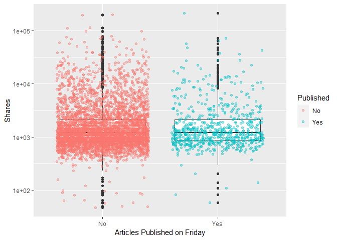<!-- -->

``` r
# 36. weekday_is_saturday: Was the article published on a Saturday?
ggplot(data=ChannelTrain %>% 
              mutate(weekday_fctr = factor(x=weekday_is_saturday,  
              levels=c(0,1), labels = c("No", "Yes"))), 
            aes(y=shares, x=weekday_fctr)) + 
            labs(x="Articles Published on Saturday", y="Shares", color = "Published") +
            geom_boxplot() + scale_y_log10() +
            geom_point(aes(color=weekday_fctr), position="jitter", alpha=0.4) 
```

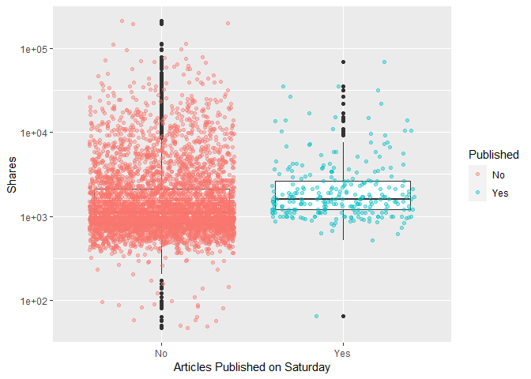<!-- -->

``` r
# 37. weekday_is_sunday: Was the article published on a Sunday?
ggplot(data=ChannelTrain %>% 
              mutate(weekday_fctr = factor(x=weekday_is_sunday,  
              levels=c(0,1), labels = c("No", "Yes"))), 
            aes(y=shares, x=weekday_fctr)) + 
            labs(x="Articles Published on Sunday", y="Shares", color = "Published") +
            geom_boxplot() + scale_y_log10() +
            geom_point(aes(color=weekday_fctr), position="jitter", alpha=0.4) 
```

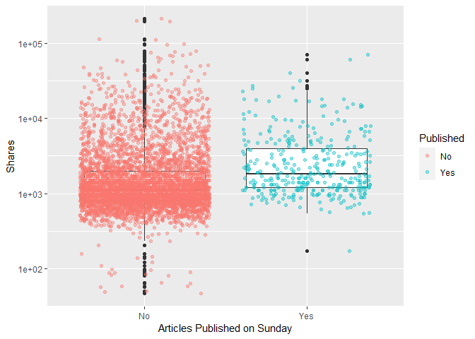<!-- -->

``` r
# # 38. is_weekend: Was the article published on the weekend? 
# ggplot(data=ChannelTrain %>% 
#               mutate(weekday_fctr = factor(x=is_weekend,  
#               levels=c(0,1), labels = c("No", "Yes"))), 
#             aes(y=shares, x=weekday_fctr)) + 
#             labs(x="Articles Published on Monday", y="Shares", color = "Published") +
#             geom_boxplot() + scale_y_log10() +
#             geom_point(aes(color=weekday_fctr), position="jitter") 
# i can make conclusions based on summary() median, min, max, bc i trasfomred for visibility
```

The y - axis is using a log axis not a linear axis, but the plots are
more easily interpretable / visually more intuitive with this
transformation.The general shape of the plots is correct.

We can inspect the trend of shares as a function of the different days
of the week that the articles are published.

If you see a presence of outliers, this may cause the mean to shift in
that direction, but the meidan will not be effected as much. If you see
that the median is not centered within the box, then there is a presence
of skewness in that particular direction. Also, if you see that there
are more observations / dots on one graph while comparing publication
(Yes/No), this is meaningful within the plot itself and also across the
different days of the week.

<!-- might use this later dont delete yet -->

``` r
#what question are we trying to answer here? 
# how to predict shares given the variables you have...
#fitting the model
fit_Channel <- lm(shares ~ . , data = Channel)
#call fit_Lifestyle object - remember this is an lm object
fit_Channel
```

    ## 
    ## Call:
    ## lm(formula = shares ~ ., data = Channel)
    ## 
    ## Coefficients:
    ##                   (Intercept)                 n_tokens_title               n_tokens_content  
    ##                     3.903e+06                      2.166e+01                      1.019e+00  
    ##               n_unique_tokens               n_non_stop_words       n_non_stop_unique_tokens  
    ##                     7.534e+03                     -6.152e+03                     -4.268e+03  
    ##                     num_hrefs                 num_self_hrefs                       num_imgs  
    ##                     2.006e+01                     -7.822e+01                      8.539e+00  
    ##                    num_videos           average_token_length                   num_keywords  
    ##                    -1.598e+01                      5.204e+02                     -5.870e+01  
    ##     data_channel_is_lifestyle  data_channel_is_entertainment            data_channel_is_bus  
    ##                            NA                             NA                             NA  
    ##        data_channel_is_socmed           data_channel_is_tech          data_channel_is_world  
    ##                            NA                             NA                             NA  
    ##                    kw_min_min                     kw_max_min                     kw_avg_min  
    ##                     4.843e+00                      8.716e-01                     -3.910e+00  
    ##                    kw_min_max                     kw_max_max                     kw_avg_max  
    ##                    -6.674e-03                     -9.099e-04                     -1.111e-03  
    ##                    kw_min_avg                     kw_max_avg                     kw_avg_avg  
    ##                    -3.911e-01                     -1.119e-01                      1.682e+00  
    ##     self_reference_min_shares      self_reference_max_shares     self_reference_avg_sharess  
    ##                     4.066e-02                      4.413e-03                      1.972e-02  
    ##             weekday_is_monday             weekday_is_tuesday           weekday_is_wednesday  
    ##                    -6.512e+02                     -8.893e+02                     -6.191e+02  
    ##           weekday_is_thursday              weekday_is_friday            weekday_is_saturday  
    ##                    -7.486e+02                     -5.563e+02                     -2.382e+02  
    ##             weekday_is_sunday                     is_weekend                         LDA_00  
    ##                            NA                             NA                     -3.905e+06  
    ##                        LDA_01                         LDA_02                         LDA_03  
    ##                    -3.903e+06                     -3.904e+06                     -3.904e+06  
    ##                        LDA_04            global_subjectivity      global_sentiment_polarity  
    ##                    -3.904e+06                      3.396e+03                      2.630e+03  
    ##    global_rate_positive_words     global_rate_negative_words            rate_positive_words  
    ##                    -2.209e+04                      2.413e+04                      1.956e+03  
    ##           rate_negative_words          avg_positive_polarity          min_positive_polarity  
    ##                            NA                     -4.115e+02                      5.747e+02  
    ##         max_positive_polarity          avg_negative_polarity          min_negative_polarity  
    ##                    -1.689e+02                     -4.152e+02                     -9.701e+01  
    ##         max_negative_polarity             title_subjectivity       title_sentiment_polarity  
    ##                     5.554e+02                      2.379e+02                     -2.627e+02  
    ##        abs_title_subjectivity   abs_title_sentiment_polarity  
    ##                     2.013e+02                      5.432e+02

``` r
# check fit_Lifestyle attributes
attributes(fit_Channel)
```

    ## $names
    ##  [1] "coefficients"  "residuals"     "effects"       "rank"          "fitted.values"
    ##  [6] "assign"        "qr"            "df.residual"   "xlevels"       "call"         
    ## [11] "terms"         "model"        
    ## 
    ## $class
    ## [1] "lm"

``` r
fit_Channel[["residuals"]]
```

    ##            1            2            3            4            5            6            7 
    ##   1375.02284   2207.19656   1846.30327   1320.75825   5470.02587    754.80792   2217.90185 
    ##            8            9           10           11           12           13           14 
    ##    940.28584    523.44192   -324.87810   5542.20920   1787.36160   1709.04146    326.12076 
    ##           15           16           17           18           19           20           21 
    ##   1509.88841   -899.84345    322.76513  -3786.44408  18146.23417   -687.15857   1032.43344 
    ##           22           23           24           25           26           27           28 
    ##   1980.81568    222.72187   2433.81637   4430.44735  11827.43524    -49.64547   3553.54701 
    ##           29           30           31           32           33           34           35 
    ##  -2488.29862   1700.51751   -131.12182  -6147.37664   6869.94707    227.80919   -753.54300 
    ##           36           37           38           39           40           41           42 
    ##   -566.45921  -1257.75124   -852.03592  -2125.13104  -3199.20729  -3236.94557  32295.99058 
    ##           43           44           45           46           47           48           49 
    ##  16505.00098  -2267.47611  -3503.36350  -3473.03148   -510.14321  -1667.18912  -1163.02088 
    ##           50           51           52           53           54           55           56 
    ##  -3822.06381  -5720.21606  -1983.28073   4827.51987  -2166.21301    378.99628  -2387.95531 
    ##           57           58           59           60           61           62           63 
    ##  -1134.46221    430.65822  -3826.06938  -3716.23681    262.58264  -1228.13303    539.84667 
    ##           64           65           66           67           68           69           70 
    ##  36733.75460   -829.43469  -1698.14136  -1408.02362  -1807.13869  -2293.60597   -895.09382 
    ##           71           72           73           74           75           76           77 
    ##  -1785.48933  -1345.52459  -2668.71593  -1215.87015   3097.04278  -1182.24674  -2202.54096 
    ##           78           79           80           81           82           83           84 
    ##    935.62151  -2427.81515    985.15844  -1520.90466  -6731.38137   -249.52905  -3208.75339 
    ##           85           86           87           88           89           90           91 
    ##    401.13780    945.57866   -123.21566  -1354.95118   2102.20255  -3517.21024   -898.57060 
    ##           92           93           94           95           96           97           98 
    ##   1955.07709  -2472.67999  14547.34940    529.04178  -2211.93808  -5358.65661  -1350.10875 
    ##           99          100          101          102          103          104          105 
    ##    352.36481    115.98326  -1586.12406    -56.52715   -594.68052    169.21223   -860.09741 
    ##          106          107          108          109          110          111          112 
    ##   7537.12801  -1831.27904  -1898.12316  -3288.67829  -6019.51645  -1940.46247   -861.10382 
    ##          113          114          115          116          117          118          119 
    ##  -3231.37264  -1886.96152   2746.06256  -2360.02196  -1529.03883  -2263.31181   -632.04106 
    ##          120          121          122          123          124          125          126 
    ##   -489.85368  -1577.81823  -1372.02448   3242.25878    -44.30600   -738.05857  -1015.58623 
    ##          127          128          129          130          131          132          133 
    ##  -1117.09319  -4346.70173    352.35668   -988.43387  -2375.99738  -1258.54804  -1778.92268 
    ##          134          135          136          137          138          139          140 
    ##  -3565.69502  -1742.99620  -2502.16163  -2497.75063  -2499.40872  -1611.87591   -448.98625 
    ##          141          142          143          144          145          146          147 
    ##   -576.60585   2987.31228  -1026.06967    166.45321  -1120.22414   4539.91840   1632.25688 
    ##          148          149          150          151          152          153          154 
    ##  -1225.49160  -1284.95652  -1707.49860   -855.47233    -93.65633   -508.67656    115.49834 
    ##          155          156          157          158          159          160          161 
    ##  -2814.75367   7864.68069   -718.46096    -97.27751  -1303.07518  -1225.84094   -794.93087 
    ##          162          163          164          165          166          167          168 
    ##  -2672.50677  -1220.19368  -2143.61119  -1733.97398   2432.15324    697.18646  -3714.77808 
    ##          169          170          171          172          173          174          175 
    ##  -2873.23336  -2085.96789  -1205.70935   -248.28564  -1195.08232  -2735.70304  -1655.04063 
    ##          176          177          178          179          180          181          182 
    ##    162.15349  -6949.51179  -3129.41047     69.48683   2820.11763  -1281.36170   -308.87847 
    ##          183          184          185          186          187          188          189 
    ##   -370.93808   -580.21597    954.61631   -756.66564   -897.35255  -3815.51476  -1581.34840 
    ##          190          191          192          193          194          195          196 
    ##  -1124.39465    -71.81789  -1231.34991  -1757.13586  -1889.38570  -1929.34463   -972.50714 
    ##          197          198          199          200          201          202          203 
    ##   1018.28649  -1648.00453  -3219.76873  67147.06975   -787.55038  -1545.84802   -122.20110 
    ##          204          205          206          207          208          209          210 
    ##  -1275.11866   3364.24886  -2024.67552  -1568.24552   1027.98852  -1501.31678  -1264.77538 
    ##          211          212          213          214          215          216          217 
    ##  -1664.46906    410.98646     16.09991   2103.87109  -1496.12941   -372.00845  -2706.42338 
    ##          218          219          220          221          222          223          224 
    ##  -1761.66204  -3498.04729   -172.98069  -7062.66132    875.50738    -62.20315   2495.41577 
    ##          225          226          227          228          229          230          231 
    ##  -1738.14882   -542.84995  -2932.07503   -369.22405  -1612.25317  -3630.33815  -3290.31031 
    ##          232          233          234          235          236          237          238 
    ##   -586.06478  -2138.14135  -3511.10177  -3778.63782   -253.75305   5778.71795  -2313.31086 
    ##          239          240          241          242          243          244          245 
    ##  -2219.66742  -2095.63341   -789.66511  -4232.31092   -607.96927  -2205.13587  -1969.74486 
    ##          246          247          248          249          250          251          252 
    ##  -1885.27600  -1643.40459   1298.30105    363.72088  -2489.94033  -1965.74128   2841.11212 
    ##          253          254          255          256          257          258          259 
    ##    257.37841  -2332.28572   2237.89503   -689.55471   1901.35584   -771.52945    -96.98155 
    ##          260          261          262          263          264          265          266 
    ##   2702.97633   -554.66321  -2103.88466  -6390.85674     82.73929   -416.62701   -141.98778 
    ##          267          268          269          270          271          272          273 
    ##  -1218.03621  -1025.81890    545.42999     44.84078  -1302.32401  -1206.39557   2174.00568 
    ##          274          275          276          277          278          279          280 
    ##  -3588.75999   -392.87241  12174.31783  -1136.00966  -2093.31186   -375.37379   -273.02872 
    ##          281          282          283          284          285          286          287 
    ##  -1069.09355  -2595.74236   -131.60711     20.94182  -1577.00354  -2271.47898    341.01239 
    ##          288          289          290          291          292          293          294 
    ##   -732.27625  -1363.80802  -2741.07769  -1517.79718    896.95658   -873.24359    987.14098 
    ##          295          296          297          298          299          300          301 
    ##    936.69953   -250.32789  -2346.00606  -2425.60415  -1706.02500   -422.78401  -2588.47172 
    ##          302          303          304          305          306          307          308 
    ##   -625.70172  -2212.65655   -970.69972   2709.33617   -250.54948  -2079.25510  -1729.75643 
    ##          309          310          311          312          313          314          315 
    ##  -1244.59178   -836.75977  -2076.96647  -1004.58372  25705.52980  -2988.66225  -2113.28090 
    ##          316          317          318          319          320          321          322 
    ##  -1936.98096  -1546.29484  11708.04521   7825.83610  -5435.28950  -3721.69139  -1550.82416 
    ##          323          324          325          326          327          328          329 
    ##  -3429.85713   -270.52562  -1073.00914  -1434.98930  -1947.40895   -156.98008  -1804.78461 
    ##          330          331          332          333          334          335          336 
    ##  -1207.60802  -2668.14759   7626.31068   -593.38804  62128.89876  -1614.31827  -2008.18093 
    ##          337          338          339          340          341          342          343 
    ##   1135.08514  -5192.24049   -128.54288  -3683.57204   -598.60429  -2152.23906  -1692.45883 
    ##          344          345          346          347          348          349          350 
    ##  -1777.81695  -2043.78668    426.79811  -3817.87983  -1236.19657   1328.06654  11427.64641 
    ##          351          352          353          354          355          356          357 
    ##  -1324.28058  10931.54388  -3439.80742  -1414.25895   5015.96771  -2070.60718   -310.36100 
    ##          358          359          360          361          362          363          364 
    ##  34487.84213   -374.38729   -539.95340  -1658.47648  -3030.92819  -2828.38614  -1898.65573 
    ##          365          366          367          368          369          370          371 
    ##  -2913.12701  -1772.54214   -386.88884  -7234.89811  -1091.18551  -1815.22864  -1055.29081 
    ##          372          373          374          375          376          377          378 
    ##   -854.91061   -935.46765  -2311.21367  -2440.03534    -85.12146  -2764.98369  -2778.27167 
    ##          379          380          381          382          383          384          385 
    ##  -1290.06340  -2059.33275  -1183.27800   -124.71749  -3210.80272  -2082.85611  -5923.14809 
    ##          386          387          388          389          390          391          392 
    ##  -4352.90377  -1240.75223   -277.73632  -2640.72787   -327.38210   8442.97291  -1261.97523 
    ##          393          394          395          396          397          398          399 
    ##   -457.77762  -1421.92878   1922.12492  -2738.93181   1423.13880  -3608.21611  -3260.02777 
    ##          400          401          402          403          404          405          406 
    ##  -2644.61157  -2797.77566   -356.67034  -1725.24936  -2545.56254   -777.68458  -4162.29192 
    ##          407          408          409          410          411          412          413 
    ##  -1425.10079  -4857.98707  -4011.88120  -3656.49831  -1130.82848  -3410.32804  -1934.06257 
    ##          414          415          416          417          418          419          420 
    ##  -2247.83447  -4224.92750  -2044.63842  -1763.57043  10587.31356  -1405.67669  -1783.47566 
    ##          421          422          423          424          425          426          427 
    ##  -1350.55801  -1938.23866  -2894.23243  -2381.97111  -2194.78461   -325.41276   -360.49234 
    ##          428          429          430          431          432          433          434 
    ##   -877.49312   -330.48564   -769.92211  -1027.19375  -3389.45330  -1395.57269    196.10249 
    ##          435          436          437          438          439          440          441 
    ##  -2052.22816  -2259.45016  -1961.27002  -2505.74578  -1122.29944  -2597.16239   -403.21171 
    ##          442          443          444          445          446          447          448 
    ##  -1236.97709  -2004.22099  -3078.90184  -1165.12073  -1119.94563  -1300.42155   4758.51421 
    ##          449          450          451          452          453          454          455 
    ##  -3364.19550  -1169.50640  -3100.16703  -2683.65746  -3216.04917  -3602.58447  -1212.78148 
    ##          456          457          458          459          460          461          462 
    ##  -1618.57187   2556.04808  -1724.88783  31949.81641  -2475.60599  -2863.56283  -1848.96179 
    ##          463          464          465          466          467          468          469 
    ##  -1431.81222  -1142.77875  -4222.11486  23763.75605  -1829.07263   2979.94481  -1786.01227 
    ##          470          471          472          473          474          475          476 
    ##  -2403.70696  -2624.73105  -2311.25764   4268.66521    409.60418  -3439.65548  -1383.43281 
    ##          477          478          479          480          481          482          483 
    ##   -493.44506   -427.72462  -1585.86580  -1983.05550    178.52852  -1292.35793    386.03102 
    ##          484          485          486          487          488          489          490 
    ##   -605.50106  -1493.24039   5720.24558   2270.28494  -1651.22269    189.67283   -338.08247 
    ##          491          492          493          494          495          496          497 
    ##  -1826.28871   9337.81283  18423.93052   -630.99855    -80.63859    178.03228    742.63904 
    ##          498          499          500          501          502          503          504 
    ##     24.50906   6836.35694  -1442.94978   1715.76594    195.96913  -1829.78093  -1462.69846 
    ##          505          506          507          508          509          510          511 
    ##   -566.50316   -798.79448   -828.33726   1970.46066    699.15894   -803.27467  -4410.35284 
    ##          512          513          514          515          516          517          518 
    ##  13632.99301   -777.20295  -1564.77383   2792.70889     28.88067  -5658.81591    750.15948 
    ##          519          520          521          522          523          524          525 
    ##   -622.01643   -965.35202   -610.16456  -1166.04639   2008.28710   -676.70194  -1920.91182 
    ##          526          527          528          529          530          531          532 
    ##    363.07925    -24.01443   -998.06656  -1850.56974  -1599.36121  -1561.41450   -255.41133 
    ##          533          534          535          536          537          538          539 
    ##   1568.34324  -2426.51854    928.30626  -1145.42777  -1532.67091  -1379.72587   -165.53718 
    ##          540          541          542          543          544          545          546 
    ##   9764.73016   -983.88544  -1223.23293  -2837.23969   2184.95487   -759.21346  12574.45292 
    ##          547          548          549          550          551          552          553 
    ##    593.64615  -2821.04425   -322.44383  -1707.74629  -3636.89884  -2640.07663   -470.97359 
    ##          554          555          556          557          558          559          560 
    ##  -4960.41236   -731.52331  10458.35214   -844.23042  -2683.58534   -438.08526   1329.25269 
    ##          561          562          563          564          565          566          567 
    ##  -3101.03136  -3055.91122  -1514.51851  -1882.82720   -233.84366  -1626.17145  -1250.33573 
    ##          568          569          570          571          572          573          574 
    ## -10026.41929  -3491.84968  -2273.19364  -1982.63545  -2553.91587  -1206.02763   2867.36426 
    ##          575          576          577          578          579          580          581 
    ##   -383.02029  -2911.33216  -1427.91520  -2554.26894  -2874.42322  -2108.44939   -478.64087 
    ##          582          583          584          585          586          587          588 
    ##   2491.47869  15647.24947   -373.50424   -248.40186   -987.64394   1622.28075  -1644.14167 
    ##          589          590          591          592          593          594          595 
    ##   -603.77268  -1324.98596   -977.11697  -1662.42889  -3081.07094  -1902.55787   3603.12461 
    ##          596          597          598          599          600          601          602 
    ##  -2409.12610   -243.45236  -1254.55689  17812.69673  -1563.92358   8754.98586  -1588.12897 
    ##          603          604          605          606          607          608          609 
    ##  -1085.44355  -1958.61762  17424.04746  -3669.02082  -1346.38340  -2302.53501  -1428.10222 
    ##          610          611          612          613          614          615          616 
    ##  -2937.47590  12503.33096  -1950.60675  -6943.66536   5614.56738   9053.14404   -356.93398 
    ##          617          618          619          620          621          622          623 
    ##  17177.70195  -1608.68423  -1778.92354  -1569.88631   -218.41354  -1922.20187  -5161.41710 
    ##          624          625          626          627          628          629          630 
    ##  -2226.39685  -1071.88488   -454.42884   -400.19885  -5887.95785  -5141.77432    807.06849 
    ##          631          632          633          634          635          636          637 
    ##  -2521.65595  -1510.65460  10564.83458    701.59668  -1058.46081  -3470.27972   1598.30079 
    ##          638          639          640          641          642          643          644 
    ##  -2107.64038  -2311.85075   -356.23166   1209.98468     27.57583  -3153.31538   -148.96155 
    ##          645          646          647          648          649          650          651 
    ##  -2048.39499  -2448.98175  -1356.91981   2225.81264   -870.75650  -1968.90480  32435.39167 
    ##          652          653          654          655          656          657          658 
    ##  -2678.93762  64695.85640  -1730.88677  -1955.04560  -2879.99936  -2524.21449  -2274.80819 
    ##          659          660          661          662          663          664          665 
    ##  -2793.22921  -7744.69082  -4669.40073  -1081.73282  -3904.76045  -3400.96321  -1526.78113 
    ##          666          667          668          669          670          671          672 
    ##   -996.70721  -3830.70723  -6191.04071   -527.98656   -757.60334   -687.16511   8308.36829 
    ##          673          674          675          676          677          678          679 
    ##  28010.58600   -439.70963   8071.87811   -150.29284    386.96606    515.91334   -170.97690 
    ##          680          681          682          683          684          685          686 
    ##  -1329.97629   -329.42835    778.80235  -8390.23037    463.67218  -1969.00153    228.75989 
    ##          687          688          689          690          691          692          693 
    ##   3366.10591   -872.63679   -517.10118  -1361.89536    566.59478  -1693.82601  -1178.66563 
    ##          694          695          696          697          698          699          700 
    ##   3970.84357   -154.47351   1036.36649   3124.13905   -473.19076   -430.61554   1660.46582 
    ##          701          702          703          704          705          706          707 
    ##   8832.09803   -263.00724  -3042.93087  14002.85009    -59.11973  -2409.91117   4235.75386 
    ##          708          709          710          711          712          713          714 
    ##   -421.05033    508.35680  -2776.44712  -3536.13338    -72.88846    694.80514  -2495.64114 
    ##          715          716          717          718          719          720          721 
    ##  -4051.11612  -2557.69379  -2979.41395  -1629.27364  -1393.19696  -3885.57451   1970.02127 
    ##          722          723          724          725          726          727          728 
    ##   3299.85164   7786.59298   2184.25371  11172.00564   6117.78770  17541.25942  -1103.80199 
    ##          729          730          731          732          733          734          735 
    ##    164.71237    520.46248   1173.60555   -637.73838   1340.46765   -223.17174    528.12995 
    ##          736          737          738          739          740          741          742 
    ##  -2614.15928  -1103.81746   -207.51348   -927.23198   -158.77801   3382.62523    723.26536 
    ##          743          744          745          746          747          748          749 
    ##  -1529.97271  -1815.69603    207.59579  -1959.64746   -212.28701  -2902.60883  -1425.90083 
    ##          750          751          752          753          754          755          756 
    ##    -66.93365  -2258.36299    280.49489   -979.95488   -494.98695    636.33871    267.85290 
    ##          757          758          759          760          761          762          763 
    ##  -1686.31360   -470.92124  -1892.37773   -475.64643   -272.08760   3260.37508    765.74915 
    ##          764          765          766          767          768          769          770 
    ##  -1975.89701   -613.61060   -415.87749   1411.30406   8799.37195  -1444.44785   -841.26194 
    ##          771          772          773          774          775          776          777 
    ##   -199.36937   2876.00234   -544.50358   -628.55237  -1722.05264   -804.34360  15035.94464 
    ##          778          779          780          781          782          783          784 
    ##   -885.07537   5801.25577    621.97478   9932.56110  13370.50313   2696.94846  -1220.35556 
    ##          785          786          787          788          789          790          791 
    ##  -1192.02508   -193.25835  -2750.54174   9130.49300  -1543.05498   2550.76190    298.55004 
    ##          792          793          794          795          796          797          798 
    ##   2911.26803   4615.86006   2488.40580  -2734.88432    563.47397    693.06330   -869.42437 
    ##          799          800          801          802          803          804          805 
    ##    471.44590  18623.29450    -77.50318  -1563.73557  -1653.98857     69.00626   -871.88948 
    ##          806          807          808          809          810          811          812 
    ##  -2082.13156     87.10310   2526.97091  -1213.07785   -426.95747    -98.66337   2464.44579 
    ##          813          814          815          816          817          818          819 
    ##  -2759.61409   3361.37037   -858.52913   -324.15123   2682.33769    154.50436   -285.37470 
    ##          820          821          822          823          824          825          826 
    ##   1049.41124    782.19003   1164.52893  -3373.77443   -171.64981   -464.31689  -1553.19034 
    ##          827          828          829          830          831          832          833 
    ##   -945.37770   1987.38608  -1141.71187   -902.44669   -821.68924   5739.36534   2365.11892 
    ##          834          835          836          837          838          839          840 
    ##   8015.84389  -1370.57175  14501.48914   -359.54700   1140.51046   -963.22072   2467.11406 
    ##          841          842          843          844          845          846          847 
    ## -10573.57467   3114.79412    253.77703    600.10607   -637.59739   -578.83404     80.71340 
    ##          848          849          850          851          852          853          854 
    ##   -680.09392   -719.77625  -1035.36279   -766.57498   4147.99930    972.29673   5628.02023 
    ##          855          856          857          858          859          860          861 
    ##   -638.68517  -1095.50558  15094.01548    366.54209   -455.07507   -985.95250   1399.42582 
    ##          862          863          864          865          866          867          868 
    ##   -238.64329     41.57375  -2013.12586   -263.42122  -1123.72623   1101.70372     41.69011 
    ##          869          870          871          872          873          874          875 
    ##    660.88169   -546.73072    396.47536   -595.83634   -604.15181   -369.01951    -85.99327 
    ##          876          877          878          879          880          881          882 
    ##   -754.06286  -1046.84460  24904.91275     22.74194   -718.28431   -714.59190    410.86373 
    ##          883          884          885          886          887          888          889 
    ##   -564.98978    389.77764  -1080.01206  -3176.51117    837.93794  -4854.11019   -117.72892 
    ##          890          891          892          893          894          895          896 
    ##  18670.58878    610.69418  -1193.72042   1612.59905   1117.52153  -1879.95578    555.42822 
    ##          897          898          899          900          901          902          903 
    ##  -1608.20589   6341.90370    794.98386  -1949.05780   -738.10631  -1620.32353   -887.92205 
    ##          904          905          906          907          908          909          910 
    ##     31.47195   -483.21766    -11.76031   -706.97941  -1185.01790   1476.95919   -124.80259 
    ##          911          912          913          914          915          916          917 
    ##    369.10563  11033.73820   -179.13557   -958.06532  -1571.67292   -515.18702  14077.00700 
    ##          918          919          920          921          922          923          924 
    ##   -805.46486  -6241.46775   1053.39666  -1000.87787   1036.74239  -1941.98442   1166.64679 
    ##          925          926          927          928          929          930          931 
    ##   -491.30042    -55.46800  -1619.83352  -1778.61696  -4629.68598   -829.64925    -97.03074 
    ##          932          933          934          935          936          937          938 
    ##    599.08039  -1406.99872   -298.73538  -2788.40111  -1297.39942  -1368.04128  -1585.16817 
    ##          939          940          941          942          943          944          945 
    ##  -2307.23797    670.52211   1872.89128     84.27845    894.37065   -486.67182     56.07381 
    ##          946          947          948          949          950          951          952 
    ##    486.50281   -306.48661  -2125.43374   -935.18171   6728.10163    -45.95982   2402.30680 
    ##          953          954          955          956          957          958          959 
    ##  -3588.77527  -1913.35087    -78.66215   2307.97811  -1252.43722   3467.17150  17335.68140 
    ##          960          961          962          963          964          965          966 
    ##     38.99666   -837.73538  -1450.26758    762.04375  -1722.04773  -1704.41645    570.99270 
    ##          967          968          969          970          971          972          973 
    ##    -13.75090   -436.77118    654.43626  -1926.81262    759.22975  -1311.84078  -1084.81371 
    ##          974          975          976          977          978          979          980 
    ##  -1373.38710    664.85070   1403.15753   4709.29706    917.26758  -5508.95040   -449.34237 
    ##          981          982          983          984          985          986          987 
    ##    456.79821    112.43934    300.93410  -1631.86952    628.36328  -2462.13181  -1558.54499 
    ##          988          989          990          991          992          993          994 
    ##  -2650.23022  -2239.29630  -2632.34899    455.43240   -928.49012  -2637.74652  -1772.05485 
    ##          995          996          997          998          999         1000 
    ##   6675.00265   -659.91485  -1062.13504  -1112.64412  -1386.52101   7530.49031 
    ##  [ reached getOption("max.print") -- omitted 6057 entries ]

``` r
#summary stats for vars of interest - 
plot(fit_Channel)
```

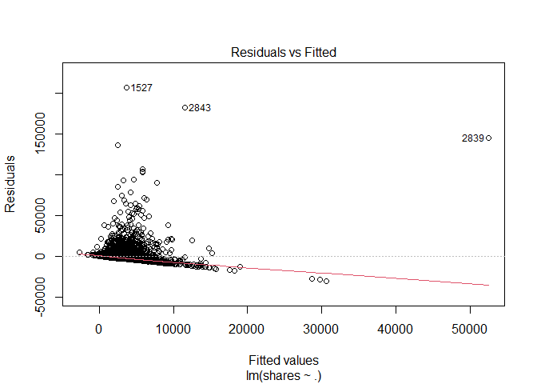<!-- -->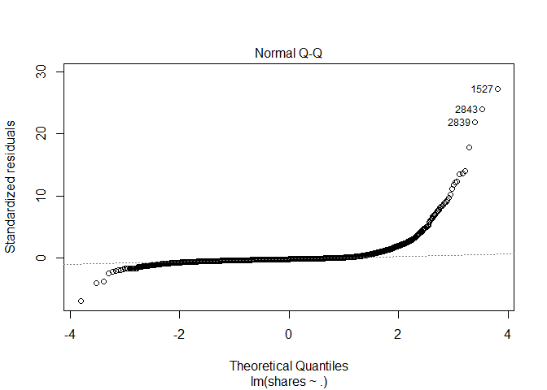<!-- -->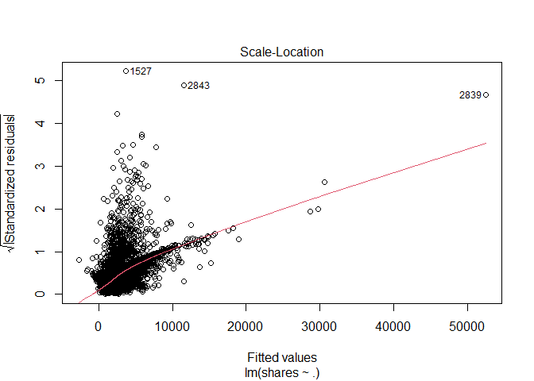<!-- -->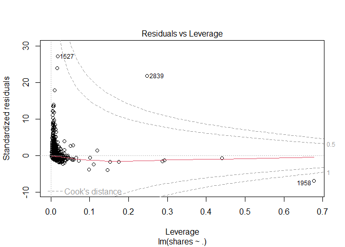<!-- -->

``` r
ggplot(data=fit_Channel, aes(y=shares, x=rate_positive_words)) + geom_point()
```

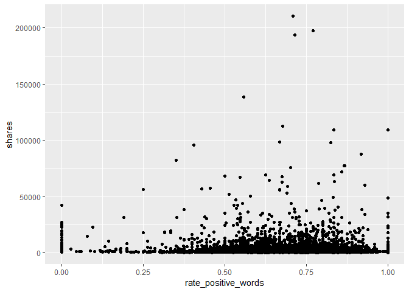<!-- -->

``` r
#EDA
#starting point... correlation - shares vs. each var
#every pairwise combo
Channel_corr <- cor(x=Channel %>% 
                          select (shares, starts_with("weekday_is_") ) )
# cor_mat <- cor(data %>% select(RentedBikeCount, Temperature, Humidity, WindSpeed,
# Hour, Visibility, DewPointTemp,
# Rainfall, Snowfall), method = "pearson")
# corrplot(cor_mat, hc.order = TRUE,
# type = "lower",
# tl.pos = "lt",
# title = "Correlation Coefficients for Bike Rental Data",
# subtitle = "Correlation Coefficients for Bike Rental Data",
# mar=c(0,0,2,0)
# )
#call Channel_corr object to look at correlation between vars and shares response var
#drop to keep in matrix and not turn into a vector
shares_corr <- Channel_corr[ ,"shares", drop=FALSE]
#shares_corr <- Channel_corr[ ,"shares"]
is(shares_corr) #matrix with the drop=TRUE option
```

    ## [1] "matrix"    "array"     "mMatrix"   "structure" "vector"

``` r
#convert to tibble
#shares_corr_tibble <- as.tibble(shares_corr)
shares_corr_tibble <- bind_cols( var_names = rownames(shares_corr), shares_corr ) 
#call shares_corr_tibble object that has correlations with shares and vars...
shares_corr_tibble
```

    ## # A tibble: 8 × 2
    ##   var_names              shares
    ##   <chr>                   <dbl>
    ## 1 shares                1      
    ## 2 weekday_is_monday    -0.00245
    ## 3 weekday_is_tuesday   -0.0158 
    ## 4 weekday_is_wednesday -0.00699
    ## 5 weekday_is_thursday  -0.00516
    ## 6 weekday_is_friday     0.00155
    ## 7 weekday_is_saturday   0.0135 
    ## 8 weekday_is_sunday     0.0307

``` r
# condition on +/- 0.9 to see what we should remove as a predictor for the model
# call shares_corr_tibble object
#shares_corr_tibble #this currently does not have row names...
rownames(shares_corr)
```

    ## [1] "shares"               "weekday_is_monday"    "weekday_is_tuesday"  
    ## [4] "weekday_is_wednesday" "weekday_is_thursday"  "weekday_is_friday"   
    ## [7] "weekday_is_saturday"  "weekday_is_sunday"

``` r
#checking structure and type of object
#str(Channel_corr)
#is(Channel_corr)
#finds highly correlated variables and you can set a cutoff (default is +/ 0.9)
#convert to tibble because using drylr chaining / piping
corr_vars <- as.tibble ( Channel_corr[ ,"shares"] ) %>%
             filter ( abs(value) >= 0.9 )
#dont need this anymore...
#corr_vars <- findCorrelation(x=Can_corr, cutoff = +/- 0.9, verbose = TRUE, names = TRUE)
#call corr_vars object
#corr_vars
#columns that are highly correlated and should be removed from the model
#5 13 22
# [1] "n_non_stop_unique_tokens"  "kw_max_min" "self_reference_max_shares"
#response variable is shares, but what does that mean given certain variables available to us?
#maybe look at days of the week variables?
#figure out what kind of object we want to make to answer our question...
#tibble keeping what kind of vars, matrix?
#need to do some sort of type of EDA in order to see if variables are highly correlated
#here we need to summary statistics via summary() and plots
#this shows the summary stats for each variable in our dataset...
Lifestlye_sumstats_Train <- summary(ChannelTrain)
#calling Lifestlye_sumstats_Train object to see our summary stats
Lifestlye_sumstats_Train
```

    ##  n_tokens_title  n_tokens_content n_unique_tokens  n_non_stop_words n_non_stop_unique_tokens
    ##  Min.   : 2.00   Min.   :   0.0   Min.   :0.0000   Min.   :0.0000   Min.   :0.0000          
    ##  1st Qu.:10.00   1st Qu.: 256.0   1st Qu.:0.4701   1st Qu.:1.0000   1st Qu.:0.6228          
    ##  Median :11.00   Median : 437.0   Median :0.5426   Median :1.0000   Median :0.6918          
    ##  Mean   :10.99   Mean   : 611.5   Mean   :0.5326   Mean   :0.9719   Mean   :0.6724          
    ##  3rd Qu.:12.00   3rd Qu.: 809.0   3rd Qu.:0.6169   3rd Qu.:1.0000   3rd Qu.:0.7604          
    ##  Max.   :18.00   Max.   :6505.0   Max.   :0.9355   Max.   :1.0000   Max.   :1.0000          
    ##    num_hrefs      num_self_hrefs      num_imgs         num_videos     average_token_length
    ##  Min.   :  0.00   Min.   : 0.000   Min.   :  0.000   Min.   : 0.000   Min.   :0.000       
    ##  1st Qu.:  4.00   1st Qu.: 1.000   1st Qu.:  1.000   1st Qu.: 0.000   1st Qu.:4.426       
    ##  Median :  7.00   Median : 3.000   Median :  1.000   Median : 1.000   Median :4.584       
    ##  Mean   : 10.68   Mean   : 3.469   Mean   :  6.237   Mean   : 2.549   Mean   :4.480       
    ##  3rd Qu.: 13.00   3rd Qu.: 5.000   3rd Qu.:  8.000   3rd Qu.: 1.000   3rd Qu.:4.753       
    ##  Max.   :304.00   Max.   :40.000   Max.   :128.000   Max.   :74.000   Max.   :7.696       
    ##   num_keywords    data_channel_is_lifestyle data_channel_is_entertainment
    ##  Min.   : 2.000   Min.   :0                 Min.   :1                    
    ##  1st Qu.: 5.000   1st Qu.:0                 1st Qu.:1                    
    ##  Median : 7.000   Median :0                 Median :1                    
    ##  Mean   : 6.923   Mean   :0                 Mean   :1                    
    ##  3rd Qu.: 8.000   3rd Qu.:0                 3rd Qu.:1                    
    ##  Max.   :10.000   Max.   :0                 Max.   :1                    
    ##  data_channel_is_bus data_channel_is_socmed data_channel_is_tech data_channel_is_world
    ##  Min.   :0           Min.   :0              Min.   :0            Min.   :0            
    ##  1st Qu.:0           1st Qu.:0              1st Qu.:0            1st Qu.:0            
    ##  Median :0           Median :0              Median :0            Median :0            
    ##  Mean   :0           Mean   :0              Mean   :0            Mean   :0            
    ##  3rd Qu.:0           3rd Qu.:0              3rd Qu.:0            3rd Qu.:0            
    ##  Max.   :0           Max.   :0              Max.   :0            Max.   :0            
    ##    kw_min_min       kw_max_min       kw_avg_min        kw_min_max       kw_max_max    
    ##  Min.   : -1.00   Min.   :     0   Min.   :   -1.0   Min.   :     0   Min.   :     0  
    ##  1st Qu.: -1.00   1st Qu.:   417   1st Qu.:  123.7   1st Qu.:     0   1st Qu.:843300  
    ##  Median : -1.00   Median :   603   Median :  209.8   Median :  1500   Median :843300  
    ##  Mean   : 21.17   Mean   :  1030   Mean   :  282.6   Mean   : 13344   Mean   :765875  
    ##  3rd Qu.:  4.00   3rd Qu.:   924   3rd Qu.:  324.5   3rd Qu.: 11500   3rd Qu.:843300  
    ##  Max.   :217.00   Max.   :138700   Max.   :34855.1   Max.   :210300   Max.   :843300  
    ##    kw_avg_max       kw_min_avg     kw_max_avg       kw_avg_avg    self_reference_min_shares
    ##  Min.   :     0   Min.   :   0   Min.   :     0   Min.   :    0   Min.   :     0           
    ##  1st Qu.:180910   1st Qu.:   0   1st Qu.:  3655   1st Qu.: 2543   1st Qu.:   698           
    ##  Median :233014   Median :1046   Median :  4427   Median : 2959   Median :  1100           
    ##  Mean   :243711   Mean   :1125   Mean   :  5582   Mean   : 3147   Mean   :  2657           
    ##  3rd Qu.:304100   3rd Qu.:2072   3rd Qu.:  6010   3rd Qu.: 3541   3rd Qu.:  2000           
    ##  Max.   :670750   Max.   :3281   Max.   :138700   Max.   :36023   Max.   :143100           
    ##  self_reference_max_shares self_reference_avg_sharess weekday_is_monday weekday_is_tuesday
    ##  Min.   :     0            Min.   :     0             Min.   :0.0000    Min.   :0.0000    
    ##  1st Qu.:  1200            1st Qu.:  1036             1st Qu.:0.0000    1st Qu.:0.0000    
    ##  Median :  2700            Median :  2050             Median :0.0000    Median :0.0000    
    ##  Mean   :  8914            Mean   :  5002             Mean   :0.1872    Mean   :0.1852    
    ##  3rd Qu.:  9100            3rd Qu.:  4900             3rd Qu.:0.0000    3rd Qu.:0.0000    
    ##  Max.   :837700            Max.   :346100             Max.   :1.0000    Max.   :1.0000    
    ##  weekday_is_wednesday weekday_is_thursday weekday_is_friday weekday_is_saturday
    ##  Min.   :0.000        Min.   :0.0000      Min.   :0.000     Min.   :0.00000    
    ##  1st Qu.:0.000        1st Qu.:0.0000      1st Qu.:0.000     1st Qu.:0.00000    
    ##  Median :0.000        Median :0.0000      Median :0.000     Median :0.00000    
    ##  Mean   :0.187        Mean   :0.1759      Mean   :0.137     Mean   :0.05485    
    ##  3rd Qu.:0.000        3rd Qu.:0.0000      3rd Qu.:0.000     3rd Qu.:0.00000    
    ##  Max.   :1.000        Max.   :1.0000      Max.   :1.000     Max.   :1.00000    
    ##  weekday_is_sunday   is_weekend         LDA_00            LDA_01            LDA_02       
    ##  Min.   :0.00000   Min.   :0.0000   Min.   :0.01843   Min.   :0.01898   Min.   :0.01819  
    ##  1st Qu.:0.00000   1st Qu.:0.0000   1st Qu.:0.02506   1st Qu.:0.04141   1st Qu.:0.02501  
    ##  Median :0.00000   Median :0.0000   Median :0.03334   Median :0.44142   Median :0.03333  
    ##  Mean   :0.07286   Mean   :0.1277   Mean   :0.06506   Mean   :0.42407   Mean   :0.08919  
    ##  3rd Qu.:0.00000   3rd Qu.:0.0000   3rd Qu.:0.05000   3rd Qu.:0.73153   3rd Qu.:0.05015  
    ##  Max.   :1.00000   Max.   :1.0000   Max.   :0.79221   Max.   :0.91998   Max.   :0.78708  
    ##      LDA_03            LDA_04        global_subjectivity global_sentiment_polarity
    ##  Min.   :0.01833   Min.   :0.01820   Min.   :0.0000      Min.   :-0.37766         
    ##  1st Qu.:0.03369   1st Qu.:0.02500   1st Qu.:0.4122      1st Qu.: 0.04826         
    ##  Median :0.25323   Median :0.03333   Median :0.4637      Median : 0.11100         
    ##  Mean   :0.35815   Mean   :0.06352   Mean   :0.4526      Mean   : 0.11213         
    ##  3rd Qu.:0.69956   3rd Qu.:0.04049   3rd Qu.:0.5121      3rd Qu.: 0.17413         
    ##  Max.   :0.92554   Max.   :0.74302   Max.   :1.0000      Max.   : 0.62500         
    ##  global_rate_positive_words global_rate_negative_words rate_positive_words
    ##  Min.   :0.00000            Min.   :0.00000            Min.   :0.0000     
    ##  1st Qu.:0.02941            1st Qu.:0.01087            1st Qu.:0.5778     
    ##  Median :0.04049            Median :0.01730            Median :0.6875     
    ##  Mean   :0.04043            Mean   :0.01913            Mean   :0.6648     
    ##  3rd Qu.:0.05147            3rd Qu.:0.02482            3rd Qu.:0.7826     
    ##  Max.   :0.10510            Max.   :0.09358            Max.   :1.0000     
    ##  rate_negative_words avg_positive_polarity min_positive_polarity max_positive_polarity
    ##  Min.   :0.0000      Min.   :0.0000        Min.   :0.00000       Min.   :0.0000       
    ##  1st Qu.:0.2000      1st Qu.:0.3203        1st Qu.:0.05000       1st Qu.:0.6000       
    ##  Median :0.3008      Median :0.3729        Median :0.10000       Median :0.9000       
    ##  Mean   :0.3071      Mean   :0.3671        Mean   :0.09384       Mean   :0.8006       
    ##  3rd Qu.:0.4074      3rd Qu.:0.4235        3rd Qu.:0.10000       3rd Qu.:1.0000       
    ##  Max.   :1.0000      Max.   :1.0000        Max.   :1.00000       Max.   :1.0000       
    ##  avg_negative_polarity min_negative_polarity max_negative_polarity title_subjectivity
    ##  Min.   :-1.0000       Min.   :-1.0000       Min.   :-1.0000       Min.   :0.0000    
    ##  1st Qu.:-0.3675       1st Qu.:-0.8000       1st Qu.:-0.1250       1st Qu.:0.0000    
    ##  Median :-0.3000       Median :-0.6000       Median :-0.1000       Median :0.3000    
    ##  Mean   :-0.2933       Mean   :-0.5899       Mean   :-0.1097       Mean   :0.3156    
    ##  3rd Qu.:-0.2213       3rd Qu.:-0.4000       3rd Qu.:-0.0500       3rd Qu.:0.5023    
    ##  Max.   : 0.0000       Max.   : 0.0000       Max.   : 0.0000       Max.   :1.0000    
    ##  title_sentiment_polarity abs_title_subjectivity abs_title_sentiment_polarity
    ##  Min.   :-1.00000         Min.   :0.0000         Min.   :0.000               
    ##  1st Qu.: 0.00000         1st Qu.:0.1250         1st Qu.:0.000               
    ##  Median : 0.00000         Median :0.4000         Median :0.075               
    ##  Mean   : 0.06616         Mean   :0.3223         Mean   :0.173               
    ##  3rd Qu.: 0.16818         3rd Qu.:0.5000         3rd Qu.:0.300               
    ##  Max.   : 1.00000         Max.   :0.5000         Max.   :1.000               
    ##      shares      
    ##  Min.   :    47  
    ##  1st Qu.:   833  
    ##  Median :  1200  
    ##  Mean   :  2958  
    ##  3rd Qu.:  2100  
    ##  Max.   :210300

``` r
#check structure of objects
str(ChannelTrain)
```

    ## tibble [4,941 × 59] (S3: tbl_df/tbl/data.frame)
    ##  $ n_tokens_title               : num [1:4941] 12 9 14 12 11 5 11 10 6 7 ...
    ##  $ n_tokens_content             : num [1:4941] 219 531 194 161 454 356 281 909 241 376 ...
    ##  $ n_unique_tokens              : num [1:4941] 0.664 0.504 0.765 0.669 0.566 ...
    ##  $ n_non_stop_words             : num [1:4941] 1 1 1 1 1 ...
    ##  $ n_non_stop_unique_tokens     : num [1:4941] 0.815 0.666 0.84 0.752 0.755 ...
    ##  $ num_hrefs                    : num [1:4941] 4 9 4 5 5 3 5 3 5 3 ...
    ##  $ num_self_hrefs               : num [1:4941] 2 0 4 4 3 3 4 2 5 2 ...
    ##  $ num_imgs                     : num [1:4941] 1 1 0 0 1 12 1 1 1 0 ...
    ##  $ num_videos                   : num [1:4941] 0 0 1 6 0 1 0 1 0 11 ...
    ##  $ average_token_length         : num [1:4941] 4.68 4.4 4.52 4.45 4.89 ...
    ##  $ num_keywords                 : num [1:4941] 5 7 6 10 6 10 4 5 5 9 ...
    ##  $ data_channel_is_lifestyle    : num [1:4941] 0 0 0 0 0 0 0 0 0 0 ...
    ##  $ data_channel_is_entertainment: num [1:4941] 1 1 1 1 1 1 1 1 1 1 ...
    ##  $ data_channel_is_bus          : num [1:4941] 0 0 0 0 0 0 0 0 0 0 ...
    ##  $ data_channel_is_socmed       : num [1:4941] 0 0 0 0 0 0 0 0 0 0 ...
    ##  $ data_channel_is_tech         : num [1:4941] 0 0 0 0 0 0 0 0 0 0 ...
    ##  $ data_channel_is_world        : num [1:4941] 0 0 0 0 0 0 0 0 0 0 ...
    ##  $ kw_min_min                   : num [1:4941] 0 0 0 0 0 0 217 217 217 217 ...
    ##  $ kw_max_min                   : num [1:4941] 0 0 0 0 0 0 593 593 598 1200 ...
    ##  $ kw_avg_min                   : num [1:4941] 0 0 0 0 0 ...
    ##  $ kw_min_max                   : num [1:4941] 0 0 0 0 0 0 0 0 0 0 ...
    ##  $ kw_max_max                   : num [1:4941] 0 0 0 0 0 0 17100 17100 17100 17100 ...
    ##  $ kw_avg_max                   : num [1:4941] 0 0 0 0 0 ...
    ##  $ kw_min_avg                   : num [1:4941] 0 0 0 0 0 0 0 0 0 0 ...
    ##  $ kw_max_avg                   : num [1:4941] 0 0 0 0 0 ...
    ##  $ kw_avg_avg                   : num [1:4941] 0 0 0 0 0 ...
    ##  $ self_reference_min_shares    : num [1:4941] 496 0 6300 638 0 1700 951 20900 475 1100 ...
    ##  $ self_reference_max_shares    : num [1:4941] 496 0 6300 29200 0 2500 951 20900 4400 1100 ...
    ##  $ self_reference_avg_sharess   : num [1:4941] 496 0 6300 8261 0 ...
    ##  $ weekday_is_monday            : num [1:4941] 1 1 1 1 1 1 0 0 0 0 ...
    ##  $ weekday_is_tuesday           : num [1:4941] 0 0 0 0 0 0 1 1 0 0 ...
    ##  $ weekday_is_wednesday         : num [1:4941] 0 0 0 0 0 0 0 0 1 1 ...
    ##  $ weekday_is_thursday          : num [1:4941] 0 0 0 0 0 0 0 0 0 0 ...
    ##  $ weekday_is_friday            : num [1:4941] 0 0 0 0 0 0 0 0 0 0 ...
    ##  $ weekday_is_saturday          : num [1:4941] 0 0 0 0 0 0 0 0 0 0 ...
    ##  $ weekday_is_sunday            : num [1:4941] 0 0 0 0 0 0 0 0 0 0 ...
    ##  $ is_weekend                   : num [1:4941] 0 0 0 0 0 0 0 0 0 0 ...
    ##  $ LDA_00                       : num [1:4941] 0.5003 0.0286 0.0334 0.1258 0.2003 ...
    ##  $ LDA_01                       : num [1:4941] 0.3783 0.4193 0.0345 0.0203 0.3399 ...
    ##  $ LDA_02                       : num [1:4941] 0.04 0.4947 0.215 0.02 0.0333 ...
    ##  $ LDA_03                       : num [1:4941] 0.0413 0.0289 0.6837 0.8139 0.3931 ...
    ##  $ LDA_04                       : num [1:4941] 0.0401 0.0286 0.0333 0.02 0.0333 ...
    ##  $ global_subjectivity          : num [1:4941] 0.522 0.43 0.396 0.572 0.467 ...
    ##  $ global_sentiment_polarity    : num [1:4941] 0.0926 0.1007 0.3471 0.1662 0.1255 ...
    ##  $ global_rate_positive_words   : num [1:4941] 0.0457 0.0414 0.0567 0.0497 0.0441 ...
    ##  $ global_rate_negative_words   : num [1:4941] 0.0137 0.0207 0 0.0186 0.0132 ...
    ##  $ rate_positive_words          : num [1:4941] 0.769 0.667 1 0.727 0.769 ...
    ##  $ rate_negative_words          : num [1:4941] 0.231 0.333 0 0.273 0.231 ...
    ##  $ avg_positive_polarity        : num [1:4941] 0.379 0.386 0.545 0.427 0.363 ...
    ##  $ min_positive_polarity        : num [1:4941] 0.1 0.136 0.1 0.1 0.1 ...
    ##  $ max_positive_polarity        : num [1:4941] 0.7 0.8 1 0.85 1 1 0.5 1 0.5 0.8 ...
    ##  $ avg_negative_polarity        : num [1:4941] -0.35 -0.37 0 -0.364 -0.215 ...
    ##  $ min_negative_polarity        : num [1:4941] -0.6 -0.6 0 -0.8 -0.5 ...
    ##  $ max_negative_polarity        : num [1:4941] -0.2 -0.167 0 -0.125 -0.1 ...
    ##  $ title_subjectivity           : num [1:4941] 0.5 0 0.4 0.583 0.427 ...
    ##  $ title_sentiment_polarity     : num [1:4941] -0.188 0 0.1 0.25 0.168 ...
    ##  $ abs_title_subjectivity       : num [1:4941] 0 0.5 0.1 0.0833 0.0727 ...
    ##  $ abs_title_sentiment_polarity : num [1:4941] 0.188 0 0.1 0.25 0.168 ...
    ##  $ shares                       : num [1:4941] 593 1200 2100 1200 4600 631 1300 1700 6400 1900 ...

``` r
str(Lifestlye_sumstats_Train)
```

    ##  'table' chr [1:6, 1:59] "Min.   : 2.00  " "1st Qu.:10.00  " "Median :11.00  " ...
    ##  - attr(*, "dimnames")=List of 2
    ##   ..$ : chr [1:6] "" "" "" "" ...
    ##   ..$ : chr [1:59] "n_tokens_title" "n_tokens_content" "n_unique_tokens" "n_non_stop_words" ...

``` r
#plots include - scatter plots, correlation plots -- plots for continuous data...
#do we need bar plots?
#A scatter plot with the number of shares on the y-axis and the positive word rate on the x-axis is created below
ggplot(data=ChannelTrain, aes(y=shares, x=rate_positive_words)) + geom_point()
```

<!-- -->
<!-- You’ll be automating the creation of documents using R Markdown (one for each data_channel_is_* setting, i.e. type of article in the data set provided). Each document should be rendered as a github_document from a single .Rmd file. In the README.md file you should create links to each of the documents you will create (Lifestyle analysis, Entertainment analysis, etc.). Links can be made to the sub-documents using relative -->
<!-- paths. For instance, if you have all of the outputted .md files in the main directory you would just use markdown linking: -->

<!-- - The analysis for [Lifestyle articles is available here](LifestyleAnalysis.html). Note we -->
<!-- link to the html file even though the file we create is a .md file - github creates the .html for us. -->
<!-- In the repo’s README.md file (which doesn’t need to be created from a .Rmd file, just use the one you initialize into the repo if you want) give a brief description of the purpose of the repo, a list of R packages used, links to the generated analyses, and the code used to create the analyses from a single .Rmd file (i.e. the render() code). -->

# Modelling

The data is already split into 70% training and 30% test. Our main goal
is to predict the number of shares. This will be our response variable.
We will create four models each using 5-fold cross-validation.

Two models (first linear and random forest) will be multiple linear
regression models, one will be a random forest model and the final model
will be a boosted tree model.

A Linear regression model is a supervised learning technique that is
used to predict the value of a variable based on the value of other
variable(s). The variable you want to predict is called the dependent
variable or the response. The variable(s) you are using to predict is
called the independent variable(s) or the predictor(s).

## First linear model.

We model the number of shares by the selected independent variables

-   “n_tokens_title” (Number of words in the title),

-   “n_tokens_content” (Number of words in the content)

-   “num_imgs” (Number of images)

-   “num_videos” (Number of videos)

-   “is_weekend” (Was the article published on the weekend?)

``` r
#linear regression model 1
l_m1 <- train(shares ~ n_tokens_title +  n_tokens_content + num_imgs + num_videos + 
                       is_weekend, 
              data = ChannelTrain, 
              method = "lm", 
              preProcess = c("center", "scale"),
              trControl = trainControl(method= "cv", number = 5))
#l_m1
#predicting on the ChannelTest data with linear regression model 1
test_pred_l_m1 <- predict(l_m1, newdata = ChannelTest)
#finding the best model - more explicit
m1 <- postResample(test_pred_l_m1, ChannelTest$shares)
m1
```

    ##         RMSE     Rsquared          MAE 
    ## 7.406041e+03 2.397379e-03 2.959776e+03

## Second linear model

We model the number of shares by the selected independent variables

-   “num_hrefs” (Number of links)

-   “weekday_is_monday” (Was the article published on a Monday?)

-   “weekday_is_tuesday” (Was the article published on a Tuesday?)

-   “weekday_is_wednesday” {Was the article published on a Wednesday?)

-   “weekday_is_thursday” (Was the article published on a Thursday?)

-   “weekday_is_friday” (Was the article published on a Friday?)

-   “self_reference_avg_sharess” (Avg. shares of referenced articles in
    Mashable)

``` r
#linear regression model 2
l_m2 <- train(shares ~ num_hrefs + weekday_is_monday + weekday_is_tuesday +
                       weekday_is_wednesday + weekday_is_thursday + weekday_is_friday +
                       self_reference_avg_sharess,
              data = ChannelTrain, 
              method = "lm", 
              preProcess = c("center", "scale"),
              trControl = trainControl(method= "cv", number = 5))
#predictions based on linear model 2 for the ChannelTest data
test_pred_l_m2 <- predict(l_m2, newdata = ChannelTest)
#best model chosen - RMSE reported explicity
#goal is to compare RMSE and see which one is the lowest!
m2 <- postResample(test_pred_l_m2, ChannelTest$shares)
m2
```

    ##         RMSE     Rsquared          MAE 
    ## 7.350320e+03 1.904407e-02 2.922560e+03

## Random forest model

The idea behind the random forest model is the same as bagging but we
use a random subset of predictors for each bootstrap sample tree fit
(indicated by “mtry”). More specifically, it involves creating a
boothstrap sample (same size with replacement), training the tree on
this sample (no pruning necessary), repeating the process a large number
of times and the final prediction is the average of those predictions.
Finding the average of predictions decreases variance which improves
predictions but unfortunately we lose interpretability.

For our random forest We model the number of shares by the selected
independent variables

-   “n_tokens_title” (Number of words in the title),

-   “n_tokens_content” (Number of words in the content)

-   “num_imgs” (Number of images)

-   “num_videos” (Number of videos)

-   “is_weekend” (Was the article published on the weekend?)

``` r
r_f <- train(shares ~ n_tokens_title +  n_tokens_content + num_imgs + num_videos + 
                      is_weekend , data = ChannelTrain, method = "rf",
  
             trControl=trainControl(method = "cv", number = 5),
             preProcess = c("center", "scale"),
             tuneGrid = data.frame(mtry = 1:3))
test_pred_r_f <- predict(r_f, newdata = ChannelTest)
m3 <- postResample(test_pred_r_f, ChannelTest$shares)
m3
```

    ##         RMSE     Rsquared          MAE 
    ## 7.408096e+03 5.230616e-03 2.922525e+03

``` r
#bootstrapping will take some time...
```

## Boosted tree model

The idea behind the boosting tree model is to train our tree slowly in a
sequential manner so each tree that is created will be based on the
previous one with predictions updated.

For our boosting tree we model the number of shares by the selected
independent variables

-   “num_hrefs” (Number of links)

-   “weekday_is_monday” (Was the article published on a Monday?)

-   “weekday_is_tuesday” (Was the article published on a Tuesday?)

-   “weekday_is_wednesday” {Was the article published on a Wednesday?)

-   “weekday_is_thursday” (Was the article published on a Thursday?)

-   “weekday_is_friday” (Was the article published on a Friday?)

-   “self_reference_avg_sharess” (Avg. shares of referenced articles in
    Mashable)

Additionally we choose to use all combinations of the tuning parameters
n.trees = c(25, 50, 100, 150, 200), interaction.depth = 1:4, shrinkage =
0.1 and n.minobsinnode = 10.

``` r
tune1<- c(25, 50, 100, 150, 200)
tune2<- 1:4
tune3<- 0.1
tune4<- 10
boosted <- train(shares ~ num_hrefs + weekday_is_monday + weekday_is_tuesday + weekday_is_wednesday + weekday_is_thursday + weekday_is_friday + self_reference_avg_sharess, 
data = ChannelTrain, method = "gbm",
 trControl=trainControl(method = "cv", number = 5),
 preProcess = c("center", "scale"),
 tuneGrid = expand.grid(n.trees = tune1, interaction.depth = tune2, shrinkage = tune3,    n.minobsinnode = tune4))
```

    ## Iter   TrainDeviance   ValidDeviance   StepSize   Improve
    ##      1 69449043.2328             nan     0.1000 58377.7660
    ##      2 69302203.9893             nan     0.1000 136670.3074
    ##      3 69122663.2674             nan     0.1000 15474.2974
    ##      4 68996421.8784             nan     0.1000 93947.2372
    ##      5 68922324.1366             nan     0.1000 68532.4796
    ##      6 68834894.2526             nan     0.1000 12053.3635
    ##      7 68749700.5403             nan     0.1000 56881.2065
    ##      8 68652511.6749             nan     0.1000 34720.2429
    ##      9 68614166.1907             nan     0.1000 -97671.7901
    ##     10 68554088.8698             nan     0.1000 12576.5601
    ##     20 68304802.2998             nan     0.1000 -59758.9942
    ##     40 68039481.2330             nan     0.1000 -15007.9617
    ##     60 67855974.2717             nan     0.1000 -33150.8837
    ##     80 67582365.7977             nan     0.1000 -77787.8734
    ##    100 67422217.5032             nan     0.1000 -31423.7149
    ##    120 67311823.6635             nan     0.1000 -5982.7717
    ##    140 67145251.8943             nan     0.1000 -27470.8638
    ##    160 66968527.2548             nan     0.1000 16619.5957
    ##    180 66818803.5360             nan     0.1000 -28555.4656
    ##    200 66690101.8751             nan     0.1000 -22495.8411
    ## 
    ## Iter   TrainDeviance   ValidDeviance   StepSize   Improve
    ##      1 69421927.3533             nan     0.1000 94132.6838
    ##      2 69180241.0676             nan     0.1000 55837.2837
    ##      3 69023167.7619             nan     0.1000 33099.3490
    ##      4 68541548.5137             nan     0.1000 -79981.9981
    ##      5 68353096.5640             nan     0.1000 -12865.4847
    ##      6 68201194.3393             nan     0.1000 67562.4213
    ##      7 68022390.9809             nan     0.1000 108192.9011
    ##      8 67833125.9657             nan     0.1000 -60704.5200
    ##      9 67622572.5065             nan     0.1000 -175587.0503
    ##     10 67537464.7772             nan     0.1000 12217.4998
    ##     20 66862048.8173             nan     0.1000 -677.4541
    ##     40 65704997.4460             nan     0.1000 -208352.3507
    ##     60 64733955.0324             nan     0.1000 -70592.0522
    ##     80 64091871.7544             nan     0.1000 -121189.2739
    ##    100 63572378.8418             nan     0.1000 -28858.7437
    ##    120 62886137.8013             nan     0.1000 -61455.9965
    ##    140 62358367.2166             nan     0.1000 -53109.8060
    ##    160 61898191.3162             nan     0.1000 -111831.5792
    ##    180 61332088.3395             nan     0.1000 -79024.1770
    ##    200 60782989.9766             nan     0.1000 -28094.2850
    ## 
    ## Iter   TrainDeviance   ValidDeviance   StepSize   Improve
    ##      1 68789460.7017             nan     0.1000 124940.9844
    ##      2 68394713.2267             nan     0.1000 87374.9417
    ##      3 68079823.1049             nan     0.1000 44035.6105
    ##      4 67972737.4800             nan     0.1000 36236.4899
    ##      5 67750562.3168             nan     0.1000 -90750.5258
    ##      6 67534602.6987             nan     0.1000 -52762.4567
    ##      7 67443660.4192             nan     0.1000 -45347.5163
    ##      8 67265647.7264             nan     0.1000 -48393.0144
    ##      9 67054933.4068             nan     0.1000 -158285.1728
    ##     10 66963579.9909             nan     0.1000 -66011.8251
    ##     20 65414348.5230             nan     0.1000 -8140.4273
    ##     40 63889554.4750             nan     0.1000 -4148.1446
    ##     60 62616608.8184             nan     0.1000 -96415.5779
    ##     80 61426864.9862             nan     0.1000 -67484.1607
    ##    100 60564390.5425             nan     0.1000 69514.0545
    ##    120 59657459.4216             nan     0.1000 -88379.1208
    ##    140 58896269.7166             nan     0.1000 12874.8297
    ##    160 58132805.4824             nan     0.1000 -72609.8162
    ##    180 57725775.7193             nan     0.1000 -90961.9075
    ##    200 56958254.4666             nan     0.1000 -126404.0860
    ## 
    ## Iter   TrainDeviance   ValidDeviance   StepSize   Improve
    ##      1 69348911.4150             nan     0.1000 195906.6470
    ##      2 69155797.9120             nan     0.1000 143024.1891
    ##      3 68570586.1998             nan     0.1000 351494.2325
    ##      4 68055514.4961             nan     0.1000 -51381.3883
    ##      5 67872860.0521             nan     0.1000 59511.3305
    ##      6 67758198.4608             nan     0.1000 1861.2080
    ##      7 67449369.5206             nan     0.1000 49064.4639
    ##      8 67093378.8564             nan     0.1000 19357.7015
    ##      9 66903855.5078             nan     0.1000 136571.2242
    ##     10 66627375.4517             nan     0.1000 2876.2234
    ##     20 65064898.2841             nan     0.1000 -133686.8410
    ##     40 62988142.9462             nan     0.1000 -235223.0223
    ##     60 61377987.2370             nan     0.1000 -186685.8975
    ##     80 59998445.0205             nan     0.1000 -223660.1889
    ##    100 58639531.2985             nan     0.1000 -192024.3692
    ##    120 57559268.3997             nan     0.1000 -134041.6925
    ##    140 56767696.2314             nan     0.1000 -185597.7506
    ##    160 55668919.2069             nan     0.1000 -128681.1308
    ##    180 55094434.8362             nan     0.1000 -117257.6748
    ##    200 54646905.4951             nan     0.1000 -98757.0764
    ## 
    ## Iter   TrainDeviance   ValidDeviance   StepSize   Improve
    ##      1 71542648.8737             nan     0.1000 121523.4624
    ##      2 71404170.4107             nan     0.1000 119300.3396
    ##      3 71246828.1868             nan     0.1000 89502.3200
    ##      4 71135364.2636             nan     0.1000 -5923.0811
    ##      5 71085406.1648             nan     0.1000 41320.5690
    ##      6 71027021.5536             nan     0.1000 72347.6154
    ##      7 70984210.6543             nan     0.1000 10369.9993
    ##      8 70890182.0718             nan     0.1000 7883.2086
    ##      9 70875243.4626             nan     0.1000 -28684.9156
    ##     10 70839592.1334             nan     0.1000 32324.7931
    ##     20 70409727.2862             nan     0.1000 -17022.7297
    ##     40 70106622.1361             nan     0.1000 -60694.4450
    ##     60 69944031.7176             nan     0.1000 -34801.1281
    ##     80 69736864.7288             nan     0.1000 -55431.7671
    ##    100 69578928.4302             nan     0.1000 -18028.2605
    ##    120 69420208.0088             nan     0.1000 -16292.6912
    ##    140 69272778.6973             nan     0.1000 -29392.8487
    ##    160 69090650.5429             nan     0.1000 -26127.8365
    ##    180 68952492.8561             nan     0.1000 -11603.7514
    ##    200 68829067.0732             nan     0.1000 -44539.4039
    ## 
    ## Iter   TrainDeviance   ValidDeviance   StepSize   Improve
    ##      1 71128466.2992             nan     0.1000 86013.0153
    ##      2 70860725.3372             nan     0.1000 90156.6051
    ##      3 70560213.0627             nan     0.1000 26160.5727
    ##      4 70425004.5857             nan     0.1000 -30457.6464
    ##      5 70316564.6777             nan     0.1000 50336.5808
    ##      6 70122953.3896             nan     0.1000 -12402.3466
    ##      7 69995423.6544             nan     0.1000 -86646.6367
    ##      8 69883652.6996             nan     0.1000 24634.6632
    ##      9 69697231.5940             nan     0.1000 34860.7516
    ##     10 69622954.0118             nan     0.1000 -26716.6376
    ##     20 68807971.7898             nan     0.1000 -105555.5304
    ##     40 67463666.5735             nan     0.1000 -62543.6816
    ##     60 66944576.3686             nan     0.1000 -94937.6146
    ##     80 66192988.3756             nan     0.1000 -75323.5710
    ##    100 65773638.7181             nan     0.1000 -127309.7672
    ##    120 65073704.9036             nan     0.1000 -330579.3074
    ##    140 64605469.4858             nan     0.1000 -51022.5513
    ##    160 64068435.6728             nan     0.1000 -55605.8497
    ##    180 63547131.7470             nan     0.1000 -295607.0744
    ##    200 63080687.9247             nan     0.1000 1378.2109
    ## 
    ## Iter   TrainDeviance   ValidDeviance   StepSize   Improve
    ##      1 71358639.1212             nan     0.1000 102777.9314
    ##      2 70909443.7881             nan     0.1000 81222.2318
    ##      3 70189552.7785             nan     0.1000 -118306.6788
    ##      4 69935349.7866             nan     0.1000 122025.3185
    ##      5 69780171.8365             nan     0.1000 -14383.1059
    ##      6 69615997.6936             nan     0.1000 -5091.0651
    ##      7 69560159.4668             nan     0.1000 -88523.4640
    ##      8 69387388.0046             nan     0.1000 -131272.0755
    ##      9 69168884.5135             nan     0.1000 -82013.0905
    ##     10 69073071.6045             nan     0.1000 -125661.3748
    ##     20 67579939.1487             nan     0.1000 -242782.4937
    ##     40 65542707.0002             nan     0.1000 -66299.1654
    ##     60 64394952.2375             nan     0.1000 -101228.1439
    ##     80 63416234.4009             nan     0.1000 -226519.6839
    ##    100 62428733.6474             nan     0.1000 -170994.1025
    ##    120 61548607.2824             nan     0.1000 -145205.9260
    ##    140 60844913.3787             nan     0.1000 -219698.5039
    ##    160 59936766.1158             nan     0.1000 -35886.2407
    ##    180 59283658.6832             nan     0.1000 -217219.7585
    ##    200 58503758.9624             nan     0.1000 -9083.2190
    ## 
    ## Iter   TrainDeviance   ValidDeviance   StepSize   Improve
    ##      1 71312309.5172             nan     0.1000 287328.7810
    ##      2 71004924.7283             nan     0.1000 45746.6709
    ##      3 70667031.0207             nan     0.1000 15902.0573
    ##      4 70512786.8091             nan     0.1000 74797.4802
    ##      5 70269712.3681             nan     0.1000 -9651.7739
    ##      6 69496197.5119             nan     0.1000 -36283.8009
    ##      7 69328539.5509             nan     0.1000 -15718.2829
    ##      8 69138743.7915             nan     0.1000 -23736.4337
    ##      9 68968194.5845             nan     0.1000 -61732.3995
    ##     10 68861017.2354             nan     0.1000 -62540.3991
    ##     20 67244898.0141             nan     0.1000 -190209.6082
    ##     40 64765371.9559             nan     0.1000 -98800.8626
    ##     60 63134781.3920             nan     0.1000 -41799.6610
    ##     80 61892516.0773             nan     0.1000 -57764.4088
    ##    100 61122516.7662             nan     0.1000 -49084.5240
    ##    120 59914129.6025             nan     0.1000 -122161.5765
    ##    140 59250153.3713             nan     0.1000 -64176.4789
    ##    160 58207402.2122             nan     0.1000 -96199.9214
    ##    180 57390048.3812             nan     0.1000 -153976.7246
    ##    200 56705719.1632             nan     0.1000 -112625.2308
    ## 
    ## Iter   TrainDeviance   ValidDeviance   StepSize   Improve
    ##      1 59803771.0841             nan     0.1000 78117.8533
    ##      2 59729638.5568             nan     0.1000 -12757.3119
    ##      3 59674499.3738             nan     0.1000 -17243.0269
    ##      4 59563871.1022             nan     0.1000 85245.7774
    ##      5 59481857.9356             nan     0.1000 27305.7554
    ##      6 59430597.5893             nan     0.1000 -5765.9965
    ##      7 59361102.9341             nan     0.1000 28756.3100
    ##      8 59332031.2786             nan     0.1000 -30229.1483
    ##      9 59261716.0844             nan     0.1000 -24791.4599
    ##     10 59236363.4722             nan     0.1000 16310.9910
    ##     20 59045059.8320             nan     0.1000 -34110.7964
    ##     40 58788278.9862             nan     0.1000 -14145.4043
    ##     60 58611374.1343             nan     0.1000 -23585.2740
    ##     80 58501431.2034             nan     0.1000 -48577.2473
    ##    100 58371770.9763             nan     0.1000 -19866.2149
    ##    120 58220518.6333             nan     0.1000 -3634.3940
    ##    140 58138929.0792             nan     0.1000 -85262.5391
    ##    160 57967773.4740             nan     0.1000 -24950.5534
    ##    180 57837341.7705             nan     0.1000  904.4618
    ##    200 57750403.0346             nan     0.1000 -13089.1887
    ## 
    ## Iter   TrainDeviance   ValidDeviance   StepSize   Improve
    ##      1 59703967.9025             nan     0.1000 51914.4330
    ##      2 59512651.4027             nan     0.1000 82966.9103
    ##      3 59422725.0550             nan     0.1000 55345.8311
    ##      4 59332505.3928             nan     0.1000 51064.3842
    ##      5 59226256.6655             nan     0.1000 -57165.9911
    ##      6 59191149.7570             nan     0.1000 -44028.1366
    ##      7 59115548.3945             nan     0.1000 22520.7824
    ##      8 59027975.3409             nan     0.1000 25674.1676
    ##      9 58944219.2766             nan     0.1000 -7850.9229
    ##     10 58865530.4611             nan     0.1000 -9027.1775
    ##     20 58308429.8500             nan     0.1000 -49062.8589
    ##     40 57569140.7412             nan     0.1000 -9405.2036
    ##     60 57172245.1118             nan     0.1000 -97023.5218
    ##     80 56667281.7192             nan     0.1000 -72841.3231
    ##    100 56358588.3987             nan     0.1000 -15905.2322
    ##    120 56006909.5613             nan     0.1000 -21324.1844
    ##    140 55551068.6836             nan     0.1000 -89440.1087
    ##    160 55283817.8591             nan     0.1000 -36326.7855
    ##    180 55092163.2539             nan     0.1000 -56131.5707
    ##    200 54808887.6199             nan     0.1000 -42438.1582
    ## 
    ## Iter   TrainDeviance   ValidDeviance   StepSize   Improve
    ##      1 59728563.1383             nan     0.1000 87989.7511
    ##      2 59568739.0869             nan     0.1000 43748.8619
    ##      3 59416626.3622             nan     0.1000 69436.4460
    ##      4 59275690.9172             nan     0.1000 31877.1794
    ##      5 59134445.2395             nan     0.1000 41345.4269
    ##      6 58973127.8488             nan     0.1000 -28840.9315
    ##      7 58857779.1868             nan     0.1000 -11560.9121
    ##      8 58747410.5817             nan     0.1000 -516.8346
    ##      9 58673861.4956             nan     0.1000 -23762.8371
    ##     10 58527684.2241             nan     0.1000 -109661.3409
    ##     20 57477556.2117             nan     0.1000 -35364.8349
    ##     40 56531365.0090             nan     0.1000 -31920.0896
    ##     60 55761428.9301             nan     0.1000 -49267.4184
    ##     80 55011279.8814             nan     0.1000 -99711.4845
    ##    100 54397673.5858             nan     0.1000 -93537.9223
    ##    120 53871607.9859             nan     0.1000 -98464.5379
    ##    140 53231071.9723             nan     0.1000 -55947.6582
    ##    160 52898059.3612             nan     0.1000 -67226.4885
    ##    180 52418520.9970             nan     0.1000 -45920.3852
    ##    200 52136255.9846             nan     0.1000 -73096.3545
    ## 
    ## Iter   TrainDeviance   ValidDeviance   StepSize   Improve
    ##      1 59545476.2289             nan     0.1000 107128.2507
    ##      2 59335212.3346             nan     0.1000 55525.5179
    ##      3 59175188.6355             nan     0.1000 -11166.6459
    ##      4 59003395.4105             nan     0.1000 67428.9884
    ##      5 58835088.4506             nan     0.1000 34208.7518
    ##      6 58625980.3307             nan     0.1000 -39437.0399
    ##      7 58417301.2306             nan     0.1000 -9322.0583
    ##      8 58247759.9070             nan     0.1000  450.3081
    ##      9 58090292.3077             nan     0.1000 -54235.5366
    ##     10 57883495.6606             nan     0.1000 -20603.2609
    ##     20 56915919.8112             nan     0.1000 -53156.7209
    ##     40 55370220.7749             nan     0.1000 -92063.3039
    ##     60 54465049.5729             nan     0.1000 -104533.9099
    ##     80 53670607.2607             nan     0.1000 -175730.8902
    ##    100 52837033.0995             nan     0.1000 -103192.5658
    ##    120 52105987.5297             nan     0.1000 -41342.5121
    ##    140 51552216.3256             nan     0.1000 -76679.3722
    ##    160 50980883.1260             nan     0.1000 -62274.0771
    ##    180 50401477.1502             nan     0.1000 -150051.9646
    ##    200 49807224.9712             nan     0.1000 -55194.3159
    ## 
    ## Iter   TrainDeviance   ValidDeviance   StepSize   Improve
    ##      1 71903641.8008             nan     0.1000 16767.1395
    ##      2 71728546.3663             nan     0.1000 97595.7615
    ##      3 71578153.6790             nan     0.1000 64007.9164
    ##      4 71450065.8244             nan     0.1000 28476.4621
    ##      5 71341115.1140             nan     0.1000 102793.6783
    ##      6 71284888.5316             nan     0.1000 12955.1894
    ##      7 71262963.1614             nan     0.1000 -18300.5617
    ##      8 71185330.7087             nan     0.1000 49675.7509
    ##      9 71101660.3921             nan     0.1000 48308.7020
    ##     10 71020169.2727             nan     0.1000 9175.4785
    ##     20 70664891.9222             nan     0.1000 -18944.5725
    ##     40 70304276.2728             nan     0.1000 1813.9429
    ##     60 70082796.3628             nan     0.1000 -120851.8598
    ##     80 69850286.1634             nan     0.1000 -31395.0273
    ##    100 69678295.0798             nan     0.1000 -19065.9983
    ##    120 69499694.4457             nan     0.1000 -94091.8947
    ##    140 69345927.6872             nan     0.1000 -107496.1131
    ##    160 69112189.8793             nan     0.1000 -91931.4652
    ##    180 69000790.1626             nan     0.1000 -26392.7580
    ##    200 68857136.6857             nan     0.1000 -58500.3463
    ## 
    ## Iter   TrainDeviance   ValidDeviance   StepSize   Improve
    ##      1 71627728.8734             nan     0.1000 229315.1321
    ##      2 71125064.2922             nan     0.1000 145860.8717
    ##      3 70977744.9503             nan     0.1000 -98552.9786
    ##      4 70560812.8644             nan     0.1000 91488.5583
    ##      5 70297383.7671             nan     0.1000 55520.4664
    ##      6 70114392.9302             nan     0.1000  658.6883
    ##      7 69969775.8620             nan     0.1000 -55039.7627
    ##      8 69909008.3674             nan     0.1000 49550.7899
    ##      9 69739354.2413             nan     0.1000 -32344.8678
    ##     10 69672689.4219             nan     0.1000 11284.3005
    ##     20 69159492.7233             nan     0.1000 -5797.0970
    ##     40 67951732.2372             nan     0.1000 -64487.5552
    ##     60 67410919.8496             nan     0.1000 -143539.3322
    ##     80 66670942.3692             nan     0.1000 -44435.1240
    ##    100 66027282.6878             nan     0.1000 -46437.4865
    ##    120 65262285.1631             nan     0.1000 -26700.7738
    ##    140 64769405.1304             nan     0.1000 -80264.1180
    ##    160 64164245.0505             nan     0.1000 -38167.8433
    ##    180 63692137.4143             nan     0.1000 -62430.2070
    ##    200 63195008.6621             nan     0.1000 -103252.2931
    ## 
    ## Iter   TrainDeviance   ValidDeviance   StepSize   Improve
    ##      1 71713440.5480             nan     0.1000 84442.8324
    ##      2 71436688.6136             nan     0.1000 -17661.9510
    ##      3 70946979.6488             nan     0.1000 61468.6907
    ##      4 70774909.8644             nan     0.1000 122683.6408
    ##      5 70445474.0172             nan     0.1000 14017.6715
    ##      6 70173928.1674             nan     0.1000 12762.8997
    ##      7 70023062.8895             nan     0.1000 -69316.6642
    ##      8 69953123.5085             nan     0.1000 14729.0944
    ##      9 69589627.8072             nan     0.1000 -129108.9721
    ##     10 69511001.9162             nan     0.1000 -19608.8198
    ##     20 68017103.9887             nan     0.1000 -238727.4047
    ##     40 66627442.4358             nan     0.1000 -88048.7372
    ##     60 65053156.7802             nan     0.1000 -60758.6187
    ##     80 64075857.9312             nan     0.1000 -137694.7418
    ##    100 63418335.3396             nan     0.1000 -125129.6630
    ##    120 62520803.4085             nan     0.1000 -151790.9394
    ##    140 61894930.1932             nan     0.1000 -31842.2838
    ##    160 60880467.5736             nan     0.1000 -64622.0220
    ##    180 60174467.0073             nan     0.1000 -96146.7269
    ##    200 59635790.6182             nan     0.1000 -77947.2383
    ## 
    ## Iter   TrainDeviance   ValidDeviance   StepSize   Improve
    ##      1 71423966.9549             nan     0.1000 86970.9738
    ##      2 70830049.7421             nan     0.1000 351486.7832
    ##      3 70542823.1197             nan     0.1000 100206.4890
    ##      4 69938142.1626             nan     0.1000 -27699.5963
    ##      5 69697320.6238             nan     0.1000 -47668.5850
    ##      6 69501080.7856             nan     0.1000 -49936.8736
    ##      7 69174863.4239             nan     0.1000 -174632.9780
    ##      8 69036735.7116             nan     0.1000 36209.6139
    ##      9 68834525.4356             nan     0.1000 -147665.6748
    ##     10 68645172.6469             nan     0.1000 -10493.4211
    ##     20 67154279.0667             nan     0.1000 -37457.1740
    ##     40 65272906.6714             nan     0.1000 -70353.4470
    ##     60 63647914.4252             nan     0.1000 -311234.6472
    ##     80 62139773.4636             nan     0.1000 -114518.6182
    ##    100 61052739.7050             nan     0.1000 -279787.7266
    ##    120 60227839.9089             nan     0.1000 -153589.0877
    ##    140 59081773.7552             nan     0.1000 -94779.0724
    ##    160 58494579.9883             nan     0.1000 -42886.5610
    ##    180 57512788.1625             nan     0.1000 -134012.3541
    ##    200 56750783.4377             nan     0.1000 -93143.7856
    ## 
    ## Iter   TrainDeviance   ValidDeviance   StepSize   Improve
    ##      1 49882441.7641             nan     0.1000 78914.2975
    ##      2 49761184.7154             nan     0.1000 62261.6810
    ##      3 49681794.8850             nan     0.1000 77662.4097
    ##      4 49615858.6079             nan     0.1000 60247.6917
    ##      5 49539649.6235             nan     0.1000 92324.0067
    ##      6 49426348.2885             nan     0.1000 79208.1494
    ##      7 49362290.1857             nan     0.1000 47704.6654
    ##      8 49298100.5141             nan     0.1000 -24196.2506
    ##      9 49251844.6184             nan     0.1000 31439.7138
    ##     10 49219244.9495             nan     0.1000 28217.4920
    ##     20 48898316.9552             nan     0.1000 -12186.1727
    ##     40 48710215.1108             nan     0.1000 -40839.3777
    ##     60 48577456.1235             nan     0.1000 -33139.2638
    ##     80 48411537.9532             nan     0.1000 -51927.7139
    ##    100 48270549.4697             nan     0.1000 -33175.0762
    ##    120 48139582.8230             nan     0.1000 -42920.4623
    ##    140 48002960.9597             nan     0.1000 -13202.3266
    ##    160 47850271.7547             nan     0.1000 -77839.2835
    ##    180 47739008.7653             nan     0.1000 -51737.8198
    ##    200 47601834.4271             nan     0.1000 -39042.4353
    ## 
    ## Iter   TrainDeviance   ValidDeviance   StepSize   Improve
    ##      1 49744995.4572             nan     0.1000 173218.7132
    ##      2 49593338.1593             nan     0.1000 -25296.7379
    ##      3 49325569.3285             nan     0.1000 148992.7062
    ##      4 49240087.1614             nan     0.1000 66920.0988
    ##      5 48989186.5632             nan     0.1000 -19833.9743
    ##      6 48679774.5966             nan     0.1000 -72773.3440
    ##      7 48367465.6641             nan     0.1000 -82929.4955
    ##      8 48239473.3436             nan     0.1000 -4779.8250
    ##      9 48164518.3270             nan     0.1000 -1798.4331
    ##     10 48117423.1309             nan     0.1000 3517.2365
    ##     20 47708172.6566             nan     0.1000  200.4323
    ##     40 46752909.3130             nan     0.1000 -171117.9558
    ##     60 46055038.0377             nan     0.1000 -167009.5211
    ##     80 45527285.8257             nan     0.1000 -101332.5406
    ##    100 45013193.0906             nan     0.1000 -38315.5658
    ##    120 44419876.4452             nan     0.1000 -122487.3646
    ##    140 43986916.9260             nan     0.1000 -19593.2421
    ##    160 43485562.0879             nan     0.1000 -66912.5151
    ##    180 42875658.6703             nan     0.1000 -51591.8935
    ##    200 42556696.8057             nan     0.1000 -13588.2943
    ## 
    ## Iter   TrainDeviance   ValidDeviance   StepSize   Improve
    ##      1 49649316.5902             nan     0.1000 50470.7539
    ##      2 49382574.8348             nan     0.1000 59031.3581
    ##      3 48744556.7909             nan     0.1000 40107.7481
    ##      4 48283078.5767             nan     0.1000 -21794.8982
    ##      5 48200224.3670             nan     0.1000 57387.7249
    ##      6 47918083.7486             nan     0.1000 -175775.6567
    ##      7 47873520.6570             nan     0.1000 2987.0700
    ##      8 47610265.4747             nan     0.1000 -74690.2107
    ##      9 47451055.9008             nan     0.1000 -96274.1410
    ##     10 47373987.1008             nan     0.1000 4762.1420
    ##     20 46549059.4913             nan     0.1000 -72640.2205
    ##     40 45268871.8900             nan     0.1000 -5810.6215
    ##     60 44063008.7401             nan     0.1000 -71734.2627
    ##     80 43322872.4748             nan     0.1000 -131700.9646
    ##    100 42741643.2521             nan     0.1000 -96539.3186
    ##    120 41873789.6086             nan     0.1000 -20112.8997
    ##    140 41094117.7197             nan     0.1000 -159932.1791
    ##    160 40548131.6290             nan     0.1000 -173623.9407
    ##    180 39647461.0567             nan     0.1000 -62793.3915
    ##    200 39219960.5417             nan     0.1000 -199665.9584
    ## 
    ## Iter   TrainDeviance   ValidDeviance   StepSize   Improve
    ##      1 49533215.5369             nan     0.1000 287040.0848
    ##      2 48991222.6615             nan     0.1000 5765.2045
    ##      3 48816437.0308             nan     0.1000 43556.5795
    ##      4 48679252.4517             nan     0.1000 4402.9057
    ##      5 48207718.1374             nan     0.1000 -72342.5283
    ##      6 48061353.0547             nan     0.1000 26822.8297
    ##      7 48013386.7997             nan     0.1000 10023.6977
    ##      8 47903878.1936             nan     0.1000 -150101.6156
    ##      9 47823546.6750             nan     0.1000 12284.8156
    ##     10 47777335.7144             nan     0.1000 -18308.2836
    ##     20 46646810.8583             nan     0.1000 -90836.0035
    ##     40 44752177.0461             nan     0.1000 -80596.3284
    ##     60 43555771.6721             nan     0.1000 -133599.3994
    ##     80 42710951.9325             nan     0.1000 -56481.7915
    ##    100 41622788.4255             nan     0.1000 -82938.2882
    ##    120 40664077.6467             nan     0.1000 -147257.8814
    ##    140 40057021.5738             nan     0.1000 -50396.3121
    ##    160 39637520.4367             nan     0.1000 -105832.5958
    ##    180 38947198.5941             nan     0.1000 -91023.2219
    ##    200 38213485.8568             nan     0.1000 -59018.2425
    ## 
    ## Iter   TrainDeviance   ValidDeviance   StepSize   Improve
    ##      1 64509553.8913             nan     0.1000 120784.6879
    ##      2 64355607.1474             nan     0.1000 39373.1845
    ##      3 64212121.3692             nan     0.1000 35546.4503
    ##      4 64116096.9775             nan     0.1000 49043.8797
    ##      5 64054975.7430             nan     0.1000 53309.8449
    ##      6 63931742.8256             nan     0.1000 25818.9826
    ##      7 63894120.7384             nan     0.1000 16490.7364
    ##      8 63829045.1489             nan     0.1000 21227.8960
    ##      9 63803670.5602             nan     0.1000 -8386.9759
    ##     10 63750745.4467             nan     0.1000 7442.5275
    ##     20 63505148.0427             nan     0.1000 -27930.8794
    ##     40 63280641.7068             nan     0.1000 -15701.4090
    ##     50 63172628.4097             nan     0.1000 -30579.2550

``` r
test_pred_boosted <- predict(boosted, newdata = ChannelTest)
m4 <- postResample(test_pred_boosted, ChannelTest$shares)
m4
```

    ##         RMSE     Rsquared          MAE 
    ## 7.327452e+03 2.370871e-02 2.957529e+03

Next we do a comparison of the four models

# Comaprison

The `postResample()` function was used to calculate useful statistics
such as rmse and R squared values for each one of the four models. We
summarize them in the tibble below.

``` r
lm1 <- tibble(model = c("First linear regression"), RMSE = c(m1[[1]]), R2 = c(m1[[2]]))
lm2 <- tibble(model = c("Second linear regression"), RMSE = c(m2[[1]]), R2 = c(m2[[2]]))
rf <- tibble(model = c("Random Forest"), RMSE = c(m3[[1]]), R2 = c(m3[[2]]))
Bos <- tibble(model = c("Boosting"), RMSE = c(m4[[1]]), R2 = c(m4[[2]]))
RMSE_table <- rbind(lm1, lm2, rf, Bos)
RMSE_table
```

    ## # A tibble: 4 × 3
    ##   model                     RMSE      R2
    ##   <chr>                    <dbl>   <dbl>
    ## 1 First linear regression  7406. 0.00240
    ## 2 Second linear regression 7350. 0.0190 
    ## 3 Random Forest            7408. 0.00523
    ## 4 Boosting                 7327. 0.0237

RMSE is a metric that tells us how far apart the predicted values are
from the observed values in a dataset, on average. The lower the RMSE,
the better a model fits a dataset.

R2 is a metric that tells us the proportion of the variance in the
response variable of a regression model that can be explained by the
predictor variables. This value ranges from 0 to 1. The higher the R2
value, the better a model fits a dataset.

From the table above the First linear regession model has the lowest
RMSE and the hightest R2 and is therefore our winner.

``` r
#pick the smallest RMSE for the best model...
final_result <- RMSE_table %>%
                filter ( min(RMSE) == RMSE )
final_result
```

    ## # A tibble: 1 × 3
    ##   model     RMSE     R2
    ##   <chr>    <dbl>  <dbl>
    ## 1 Boosting 7327. 0.0237

When comparing all 4 of our models, we are looking for the smallest
value of RMSE to tell us which model is the best. In this situation, we
can say that the smallest RMSE is 7327.4515775 and this comes from the
Boosting model.

<!-- # Project Work -->
<!-- The first step is for the first group member to create a github repo and add the second group member as a collaborator. The second group member then needs to accept the membership. This gives everyone access to push changes up to the repository. All project work should be done within this repo. -->
<!-- Each time you go to work on the project, you should pull down any of the latest changes using git pull. You should then upload any changes you’ve made via the usual workflow done previously. There may occasionally be merge conflicts that have to be dealt with. This can be done with the Git tab in RStudio. Let us know if you are having issues with conflicts that you can’t resolve! -->
<!-- # Repo Setting -->
<!-- On your project repo you should go into the settings and enable github pages (feel free to select a theme too!). This will make it so your repo can be accessed like your blog (username.github.io/repo-name). Be sure to choose the master or main branch as the one to use if you have choices there. -->
<!-- You’ll be automating the creation of documents using R Markdown (one for each data_channel_is_* setting, i.e. type of article in the data set provided). Each document should be rendered as a github_document from a single .Rmd file. In the README.md file you should create links to each of the documents you will create (Lifestyle analysis, Entertainment analysis, etc.). Links can be made to the sub-documents using relative -->
<!-- paths. For instance, if you have all of the outputted .md files in the main directory you would just use markdown linking: -->
<!-- - The analysis for [Lifestyle articles is available here](LifestyleAnalysis.html). Note we -->
<!-- link to the html file even though the file we create is a .md file - github creates the .html for us. -->
<!-- In the repo’s README.md file (which doesn’t need to be created from a .Rmd file, just use the one you initialize into the repo if you want) give a brief description of the purpose of the repo, a list of R packages used, links to the generated analyses, and the code used to create the analyses from a single .Rmd file (i.e. the render() code). -->

# Blog

Once you’ve completed the project each of you should write a brief blog
post outlining your project and two links to the
username.github.io/repo-name site and the repo itself (the username may
correspond to your partner). You should then also reflect on the process
you went through. Discuss the following:

-   what would you do differently?  
-   what was the most difficult part for you?  
-   what are your big take-aways from this project?

<!-- # Topic -->
<!-- What are you actually doing? You’ll read in and analyze an online news popularity data set. You’ll subset the data by data_channel_is_* (one of six groups). Then you’ll summarize the data and try to predict the number of shares using predictive models. -->
<!-- 1. Read in the OnlineNewsPopularity.csv data file -- subset for data_channel_is_lifestyle: Is data channel 'Lifestyle'? -->
<!-- Here, `read_csv()` is used to read in the OnlineNewsPopularity.csv data and we are subsetting for the `data_channel_is_lifestyle`: Is data channel 'Lifestyle'? variable.  -->
<!-- ``` {r, echo=TRUE, eval=TRUE} -->
<!-- #install one time thing -->
<!-- #install.packages("caret") -->
<!-- #read in data set .csv file in full -->
<!-- #OnlineNewsPopularity <- readr::read_csv(file="OnlineNewsPopularity.csv",  -->
<!-- #                                        show_col_types = FALSE) -->
<!-- ``` -->
<!-- ``` {r, echo=TRUE, eval=TRUE} -->
<!-- #subsetting the data for`data_channel_is_lifestyle`: Is data channel 'Lifestyle'? -->
<!-- #Lifestyle <- OnlineNewsPopularity %>%  -->
<!-- #              filter( data_channel_is_lifestyle == 1) -->
<!-- ``` -->
<!-- # Report -->
<!-- Recommendation: At first, consider just using data from a single data_channel_is_* source. Once you have all of the below steps done for that data, then you can automate it to work with any chosen data channel. Note: It may be easier to create a single variable representing the data channel when automating the subsetting (although there are many ways to do this).   -->
<!-- - All code chunks should be shown unless they are setup code chunks.   -->
<!-- # Introduction section -->
<!-- You should have an introduction section that briefly describes the data and the variables you have to work with (just discuss the ones you want to use). Your target variables is the shares variable. -->
<!-- You should also mention the purpose of your analysis and the methods you’ll use to model the response. You’ll describe those in more detail later. -->
<!-- **This section should be done by the ‘second’ group member.** -->
<!-- # Data -->
<!-- Use a relative path to import the data. Subset the data to work on the data channel of interest. -->
<!-- **This section should be done by whoever can get to it first.** -->

# Summarizations

You should produce some basic (but meaningful) summary statistics and
plots about the training data you are working with (especially as it
relates to your response).

As you will automate this same analysis across other data, you can’t
describe the trends you see in the graph (unless you want to try to
automate that!). You should describe what to look for in the summary
statistics/plots to help the reader understand the summary or graph. Ex:
A scatter plot with the number of shares on the y-axis and the positive
word rate on the x-axis is created:

‘We can inspect the trend of shares as a function of the positive word
rate. If the points show an upward trend, then articles with more
positive words tend to be shared more often. If we see a negative trend
then articles with more positive words tend to be shared less often.’

Each group member is responsible for producing some summary statistics
(means, sds, contingency tables, etc.) and for producing at least three
graphs (each) of the data.

# Modeling

You’ll need to split the data into a training (70% of the data) and test
set (30% of the data). Use set.seed() to make things reproducible.

The goal is to create models for predicting the number of shares in some
way. Each group member should contribute a linear regression model and
an ensemble tree-based model. As we are automating things, describing
the chosen model is tough, so no need to worry about that.

The first group member should fit a random forest model and the second
group member should fit a boosted tree model. Both models should be
chosen using cross-validation.

Prior to the models fit using linear regression, the first group member
should provide a short but thorough explanation of the idea of a linear
regression model.

Prior to each ensemble model, you should provide a short but reasonably
thorough explanation of the ensemble model you are using (so one for
each group member).

# Comparison

All four of the models should be compared on the test set and a winner
declared (this should be automated to be correct across all the created
documents).

This can be done by one group member and the automation done by the
other (see below).

# Automation

<!-- Once you’ve completed the above for a particular data channel, adapt the code so that you can use a parameter in your build process. You should be able to automatically generate an analysis report for each data_channel_is_* variable - although again, you may want to create a new variable to help with the subsetting. You’ll end up with six total outputted documents. -->
<!-- This should be done by the group member that doesn’t automate the comparison of models part. -->

# Submission

In the project submission, you should simply put a link to your blog
post (which will have a link to your github pages and github repo).

<!-- # Group Issues -->
<!-- Please notify me ASAP of any group member issues. You should look over your partner’s work/explanations and discuss that with them if you have any issues with what they’ve done. Both group members are graded on all the work done regardless of who was assigned to do it. -->
<!--
Rubric for Grading (total = 100 points)
Item                               Points           Notes
Introduction                       10               Worth either 0, 5, or 10
Data split                          5               Worth either 0 or 5
Summarizations & discussions       20               Worth either 0, 5,. . . , or 20
Modeling, selection, & discussion  35               Worth either 0, 5, . . . , 35
Test set prediction and automation 10               Worth either 0, 5, or 10
Automation                         15               Worth either 0, 5, 10, or 15
Blog post and repo setup           10               Worth either 0, 5, or 10
-->
<!--
Notes on grading:
• For each item in the rubric, your grade will be lowered one level for each each error (syntax, logical, or other) in the code and for each required item that is missing or lacking a description.  
• If your work was not completed and documented using your github repo you will lose 50
points on the project.  
• You should use Good Programming Practices when coding (see wolfware). If you do not follow GPP you can lose up to 40 points on the project.  
• You should use appropriate markdown options/formatting (you can lose up to 20 points) for not doing so.
-->
<!-- code needed to render pdf file -->
