ST558 Project 3
================
Magaritte Nguyen and Matthew Sookoo
2022-11-12

-   <a href="#introduction" id="toc-introduction">Introduction</a>
    -   <a href="#more-about-the-variables"
        id="toc-more-about-the-variables">More about the variables</a>
        -   <a href="#response-variable" id="toc-response-variable">Response
            variable</a>
        -   <a href="#independent-or-predictor-variables"
            id="toc-independent-or-predictor-variables">Independent or predictor
            variables</a>
-   <a href="#required-packages" id="toc-required-packages">Required
    Packages</a>
-   <a href="#data" id="toc-data">Data</a>
    -   <a href="#reading-in-the-data" id="toc-reading-in-the-data">Reading in
        the data</a>
-   <a href="#summarizations" id="toc-summarizations">Summarizations</a>
-   <a href="#modelling" id="toc-modelling">Modelling</a>
    -   <a href="#first-linear-model" id="toc-first-linear-model">First linear
        model.</a>
    -   <a href="#second-linear-model" id="toc-second-linear-model">Second
        linear model</a>
    -   <a href="#random-forest-model" id="toc-random-forest-model">Random
        forest model</a>
    -   <a href="#boosted-tree-model" id="toc-boosted-tree-model">Boosted tree
        model</a>
-   <a href="#comaprison" id="toc-comaprison">Comaprison</a>
-   <a href="#blog" id="toc-blog">Blog</a>
-   <a href="#summarizations-1" id="toc-summarizations-1">Summarizations</a>
-   <a href="#modeling" id="toc-modeling">Modeling</a>
-   <a href="#comparison" id="toc-comparison">Comparison</a>
-   <a href="#automation" id="toc-automation">Automation</a>
-   <a href="#submission" id="toc-submission">Submission</a>

<!-- testing automation form yaml header -->
<!-- it works -->
<!-- 
############################################################# 
#############################################################
### Project 3 Group F
############################################################# 
############################################################# 
-->
<!-- setup -->

# Introduction

Our goal with this project is to take the data about articles published
by Mashable (www.mashable.com) and create predictive models for the
number of shares in social networks (popularity) then automating our
Markdown reports. This dataset summarizes a heterogeneous set of
features in a period of two years.

The way we will summarize the data and try to predict the number of
shares is via linear regression, random forest, and boosting (will add
more later)

-   briefly describes the data and the variables you have to work with
    (just discuss the ones you want to use).

-   Your target variables is the shares variable.

-   mention the purpose of your analysis and the methods you’ll use to
    model the response.

-   You’ll describe those in more detail later.

Data Set Information:

-   The articles were published by Mashable (www.mashable.com) and their
    content as the rights to reproduce it belongs to them. Hence, this
    dataset does not share the original content but some statistics
    associated with it. The original content be publicly accessed and
    retrieved using the provided urls.

-   Acquisition date: January 8, 2015

-   The estimated relative performance values were estimated by the
    authors using a Random Forest classifier and a rolling windows as
    assessment method. See their article for more details on how the
    relative performance values were set.

Our goal with this project is to create predictive models and automating
Markdown reports. We are using this [Online News Popularity Data
Set](https://archive.ics.uci.edu/ml/datasets/Online+News+Popularity).

This dataset summarizes a heterogeneous set of features about articles
published by [Mashable](http://www.mashable.com) in a period of two
years.

## More about the variables

The data contains 39644 observations and 61 variables (58 predictive
attributes, 2 non-predictive, 1 goal field) and we are interested in the
number of shares of the online news. We only mention the one we use in
our project.

### Response variable

-   “shares” (Number of shares (target))

### Independent or predictor variables

-   “data_channel_is\_\*” (Lifestyle, Entertainment, Business, Social
    Media, Tech, World)

-   “n_tokens_title” (Number of words in the title),

-   “n_tokens_content” (Number of words in the content)

-   “num_imgs” (Number of images)

-   “num_videos” (Number of videos)

-   “is_weekend” (Was the article published on the weekend?)

-   “num_hrefs” (Number of links)

-   “weekday_is_monday” (Was the article published on a Monday?)

-   “weekday_is_tuesday” (Was the article published on a Tuesday?)

-   “weekday_is_wednesday” {Was the article published on a Wednesday?)

-   “weekday_is_thursday” (Was the article published on a Thursday?)

-   “weekday_is_friday” (Was the article published on a Friday?)

-   “self_reference_avg_sharess” (Avg. shares of referenced articles in
    Mashable)

# Required Packages

The following packages are used for our data manipulation, prediction,
etc.:

-   `tidyverse`: Tons of useful features for data manipulation and
    visualization!
-   `caret`: Used for predictive modelling.
-   `shiny`
-   `rmarkdown`

MORE ADDED LATER AS REQUIRED…

<!-- packages that we installed and are calling via library() function -->

# Data

## Reading in the data

Read in the OnlineNewsPopularity.csv data file – subset for
data_channel_is_socmed: Is data channel ’’?
<!-- str_to_title("social media") ->> "Social Media" -->

Here, `read_csv()` is used to read in the OnlineNewsPopularity.csv data
and we are subsetting for the data_channel_is_socmed: Is data channel
’’? variable.

Firstly, we read in the data using `read_csv()`.

``` r
#check working directory
getwd()
```

    ## [1] "C:/Users/Home Pc/Desktop/ST558 Project 3 new/ST558_Project3_GroupF"

``` r
#reassign working directory
#Magaritte's directory
#setwd("D:/ST558/Project 3/ST558_Project3_GroupF")
#Matthew's directory
setwd("C:\\Users\\Home Pc\\Desktop\\ST558 Project 3 new\\ST558_Project3_GroupF\\")
#read in data set .csv file in full
#make sure that this is a relative path used...
# ./ stays in the same file directory
OnlineNewsPopularity<-read_csv("./OnlineNewsPopularity.csv", show_col_types = FALSE)
#call object OnlineNewsPopularity - our full raw data
OnlineNewsPopularity
```

    ## # A tibble: 39,644 × 61
    ##    url        timed…¹ n_tok…² n_tok…³ n_uni…⁴ n_non…⁵ n_non…⁶ num_h…⁷ num_s…⁸ num_i…⁹ num_v…˟
    ##    <chr>        <dbl>   <dbl>   <dbl>   <dbl>   <dbl>   <dbl>   <dbl>   <dbl>   <dbl>   <dbl>
    ##  1 http://ma…     731      12     219   0.664    1.00   0.815       4       2       1       0
    ##  2 http://ma…     731       9     255   0.605    1.00   0.792       3       1       1       0
    ##  3 http://ma…     731       9     211   0.575    1.00   0.664       3       1       1       0
    ##  4 http://ma…     731       9     531   0.504    1.00   0.666       9       0       1       0
    ##  5 http://ma…     731      13    1072   0.416    1.00   0.541      19      19      20       0
    ##  6 http://ma…     731      10     370   0.560    1.00   0.698       2       2       0       0
    ##  7 http://ma…     731       8     960   0.418    1.00   0.550      21      20      20       0
    ##  8 http://ma…     731      12     989   0.434    1.00   0.572      20      20      20       0
    ##  9 http://ma…     731      11      97   0.670    1.00   0.837       2       0       0       0
    ## 10 http://ma…     731      10     231   0.636    1.00   0.797       4       1       1       1
    ## # … with 39,634 more rows, 50 more variables: average_token_length <dbl>,
    ## #   num_keywords <dbl>, data_channel_is_lifestyle <dbl>,
    ## #   data_channel_is_entertainment <dbl>, data_channel_is_bus <dbl>,
    ## #   data_channel_is_socmed <dbl>, data_channel_is_tech <dbl>, data_channel_is_world <dbl>,
    ## #   kw_min_min <dbl>, kw_max_min <dbl>, kw_avg_min <dbl>, kw_min_max <dbl>,
    ## #   kw_max_max <dbl>, kw_avg_max <dbl>, kw_min_avg <dbl>, kw_max_avg <dbl>,
    ## #   kw_avg_avg <dbl>, self_reference_min_shares <dbl>, self_reference_max_shares <dbl>, …

We now subset the data for the data channel of interest: .

``` r
#subsetting the OnlineNewsPopularity full raw data for the data channel of interest -- Lifestyle
Channel <- OnlineNewsPopularity %>% 
               #filter(data_channel_is_lifestyle == 1) %>%
               filter(get(params$channel) == 1) %>%
               # removing non-predictive variables per dataset description
               # remove all data_channel_is_* variables because we already filtered on them and we do not want them included in the model!
               #select( ! c(url, timedelta, starts_with("data_channel_is_" ) ) )
                select( ! c(url, timedelta ) )
#tidyverse way of looking at the dataset -- similar to str()
#glimpse(Channel)
#calling the Channel object to view
Channel
```

    ## # A tibble: 2,323 × 59
    ##    n_tokens…¹ n_tok…² n_uni…³ n_non…⁴ n_non…⁵ num_h…⁶ num_s…⁷ num_i…⁸ num_v…⁹ avera…˟ num_k…˟
    ##         <dbl>   <dbl>   <dbl>   <dbl>   <dbl>   <dbl>   <dbl>   <dbl>   <dbl>   <dbl>   <dbl>
    ##  1          8     257   0.568    1.00   0.671       9       7       0       1    4.64       9
    ##  2          8     218   0.663    1.00   0.688      14       3      11       0    4.44      10
    ##  3          9    1226   0.410    1.00   0.617      10      10       1       1    4.39       7
    ##  4         10    1121   0.451    1.00   0.629      15      11       1       0    4.79       6
    ##  5          9     168   0.778    1.00   0.865       6       4      11       0    4.68       9
    ##  6          9     100   0.760    1.00   0.803       3       2       1       0    4.45       6
    ##  7         10    1596   0.420    1.00   0.632      19      10       8       0    4.63       6
    ##  8          7     518   0.486    1.00   0.654      11       1       1       0    4.79       7
    ##  9          8     358   0.503    1.00   0.687       4       4       1       0    4.25       4
    ## 10          6     358   0.622    1.00   0.777      24       6       1       0    5.39       8
    ## # … with 2,313 more rows, 48 more variables: data_channel_is_lifestyle <dbl>,
    ## #   data_channel_is_entertainment <dbl>, data_channel_is_bus <dbl>,
    ## #   data_channel_is_socmed <dbl>, data_channel_is_tech <dbl>, data_channel_is_world <dbl>,
    ## #   kw_min_min <dbl>, kw_max_min <dbl>, kw_avg_min <dbl>, kw_min_max <dbl>,
    ## #   kw_max_max <dbl>, kw_avg_max <dbl>, kw_min_avg <dbl>, kw_max_avg <dbl>,
    ## #   kw_avg_avg <dbl>, self_reference_min_shares <dbl>, self_reference_max_shares <dbl>,
    ## #   self_reference_avg_sharess <dbl>, weekday_is_monday <dbl>, weekday_is_tuesday <dbl>, …

``` r
#testing
#correct - we expect 2099 vars
table(Channel[[params$channel]])
```

    ## 
    ##    1 
    ## 2323

# Summarizations

Now split the data set we’ve created into a training and testing set.
Use p = 0.7.

Here, we are splitting our created data, Channel, into a training and
test set with p = 0.7. These datasets will be called `ChannelTrain` and
`ChannelTest`.

Note: A seed was set for reproducibility purposes.

``` r
#seed is set for reproducibility 
set.seed(123)
#another way to split train and test data below
# #indices to split on
# train <- sample(1:nrow(my_heart), size = nrow(my_heart)*0.70)
# test <- dplyr::setdiff(1:nrow(my_heart), train)
# #subset
# heartTrain <- my_heart[train, ]
# heartTest <- my_heart[test, ]
#indices to split on
ChannelIndex <- createDataPartition(Channel$shares, p = 0.70, list = FALSE)
#subset
ChannelTrain <- Channel[ ChannelIndex, ]
ChannelTest  <- Channel[-ChannelIndex, ]
```

You should produce some basic (but meaningful) summary statistics and
plots about the training data you are working with (especially as it
relates to your response).

As you will automate this same analysis across other data, you can’t
describe the trends you see in the graph (unless you want to try to
automate that!). You should describe what to look for in the summary
statistics/plots to help the reader understand the summary or graph. Ex:
A scatter plot with the number of shares on the y-axis and the positive
word rate on the x-axis is created:

‘We can inspect the trend of shares as a function of the positive word
rate. If the points show an upward trend, then articles with more
positive words tend to be shared more often. If we see a negative trend
then articles with more positive words tend to be shared less often.’

Each group member is responsible for producing some summary statistics
(means, sds, contingency tables, etc.) and for producing at least three
graphs (each) of the data.

Whenever you start thinking about fitting a regression model, the first
think you want to do is data exploration (EDA - exploratory data
analysis). Best think you can do is create scatter plots for each
explanatory variable against the response variable. Scatter plots give
us useful visualizations. we will look at how to fit the line in R
(overlay), then predict a response using that line.

``` r
#this shows the summary stats for each variable in our dataset...
# 31. weekday_is_monday: Was the article published on a Monday?
summary(ChannelTrain$weekday_is_monday)
```

    ##    Min. 1st Qu.  Median    Mean 3rd Qu.    Max. 
    ##  0.0000  0.0000  0.0000  0.1529  0.0000  1.0000

``` r
# 32. weekday_is_tuesday: Was the article published on a Tuesday?
summary(ChannelTrain$weekday_is_tuesday)
```

    ##    Min. 1st Qu.  Median    Mean 3rd Qu.    Max. 
    ##   0.000   0.000   0.000   0.191   0.000   1.000

``` r
# 33. weekday_is_wednesday: Was the article published on a Wednesday?
summary(ChannelTrain$weekday_is_wednesday)
```

    ##    Min. 1st Qu.  Median    Mean 3rd Qu.    Max. 
    ##  0.0000  0.0000  0.0000  0.1849  0.0000  1.0000

``` r
# 34. weekday_is_thursday: Was the article published on a Thursday?
summary(ChannelTrain$weekday_is_thursday)
```

    ##    Min. 1st Qu.  Median    Mean 3rd Qu.    Max. 
    ##  0.0000  0.0000  0.0000  0.2045  0.0000  1.0000

``` r
# 35. weekday_is_friday: Was the article published on a Friday?
summary(ChannelTrain$weekday_is_friday)
```

    ##    Min. 1st Qu.  Median    Mean 3rd Qu.    Max. 
    ##  0.0000  0.0000  0.0000  0.1357  0.0000  1.0000

``` r
# 36. weekday_is_saturday: Was the article published on a Saturday?
summary(ChannelTrain$weekday_is_saturday)
```

    ##    Min. 1st Qu.  Median    Mean 3rd Qu.    Max. 
    ## 0.00000 0.00000 0.00000 0.07617 0.00000 1.00000

``` r
# 37. weekday_is_sunday: Was the article published on a Sunday?
summary(ChannelTrain$weekday_is_sunday)
```

    ##    Min. 1st Qu.  Median    Mean 3rd Qu.    Max. 
    ## 0.00000 0.00000 0.00000 0.05467 0.00000 1.00000

``` r
# 38. is_weekend: Was the article published on the weekend? 
summary(ChannelTrain$is_weekend)
```

    ##    Min. 1st Qu.  Median    Mean 3rd Qu.    Max. 
    ##  0.0000  0.0000  0.0000  0.1308  0.0000  1.0000

``` r
# 60. shares: Number of shares (target)
summary(ChannelTrain$shares)
```

    ##    Min. 1st Qu.  Median    Mean 3rd Qu.    Max. 
    ##       8    1400    2100    3793    3800  122800

``` r
#contigency tables
# example: table (crabs$color, crabs$spine, crabs$y)
# monday is the mot published articels... compare to diff of the week
table(ChannelTrain$weekday_is_monday, ChannelTrain$weekday_is_tuesday)
```

    ##    
    ##        0    1
    ##   0 1068  311
    ##   1  249    0

``` r
table(ChannelTrain$weekday_is_monday, ChannelTrain$weekday_is_wednesday)
```

    ##    
    ##        0    1
    ##   0 1078  301
    ##   1  249    0

``` r
table(ChannelTrain$weekday_is_monday, ChannelTrain$weekday_is_thursday)
```

    ##    
    ##        0    1
    ##   0 1046  333
    ##   1  249    0

``` r
table(ChannelTrain$weekday_is_monday, ChannelTrain$weekday_is_friday)
```

    ##    
    ##        0    1
    ##   0 1158  221
    ##   1  249    0

``` r
#sum stats for all 61 vars - not helpful...
#Lifestlye_sumstats_Train <- summary(ChannelTrain)
#calling Lifestlye_sumstats_Train object to see our summary stats
#Lifestlye_sumstats_Train
#check structure of objects
#str(ChannelTrain)
#str(Lifestlye_sumstats_Train)
#plots include - scatter plots, correlation plots -- plots for continuous data...
#do we need bar plots?
#data for descriptive plots:
plot_data_weekday_weekend <- ChannelTrain %>%
                               mutate ( weekday = case_when(
                                          weekday_is_monday    == 1 ~ "Monday"   ,
                                          weekday_is_tuesday   == 1 ~ "Tuesday"  ,
                                          weekday_is_wednesday == 1 ~ "Wednesday",
                                          weekday_is_thursday  == 1 ~ "Thursday" ,
                                          weekday_is_friday    == 1 ~ "Friday"   ,
                                          weekday_is_saturday  == 1 ~ "Saturday" ,
                                          weekday_is_sunday    == 1 ~ "Sunday"   ,
                                          TRUE ~ NA_character_
                                      ),
                                        weekday = factor(
                                          x = weekday,
                                          levels = c("Monday", "Tuesday", "Wednesday",
                                                     "Thursday", "Friday", "Saturday",
                                                     "Sunday"),
                                          ordered = TRUE
                                          ) )
#A scatter plot with the number of shares on the y-axis and the positive word rate on the x-axis is created below
ggplot(data=plot_data_weekday_weekend, 
            aes(y=shares, x=weekday)) + 
            labs(x="Articles Published on Certain Days of the Week", y="Shares") +
            geom_boxplot() + scale_y_log10() +
            geom_point(aes(color=weekday), position="jitter") 
```

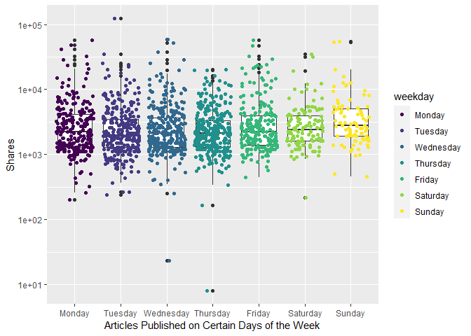<!-- -->

``` r
# when we take the log of the data, we can see easier... Poisson...
# plot scatter after boxplot because we want to see where the majority of the dots are...
#total articles published is actually higher Monday and fewer on the weekend. but boxplots look like they are lower on the weekdays because more articles are published but less shares are occurring...
#plots - scatter plot with boxplot overlayed
# 31. weekday_is_monday: Was the article published on a Monday?
#this one doesnt work bc we need levels...
#ggplot(data=ChannelTrain, aes(y=shares, x=weekday_is_monday)) + geom_point()
# the y - axis is using a log axis not a linear axis, but the plots are more easily interpretable /  visually more ituitive with this transformation.
ggplot(data=ChannelTrain %>% 
              mutate(weekday_fctr = factor(x=weekday_is_monday,  
              levels=c(0,1), labels = c("No", "Yes"))), 
            aes(y=shares, x=weekday_fctr)) + 
            labs(x="Articles Published on Monday", y="Shares", color = "Published") +
            geom_boxplot() + scale_y_log10() +
            geom_point(aes(color=weekday_fctr), position="jitter", alpha=0.4) 
```

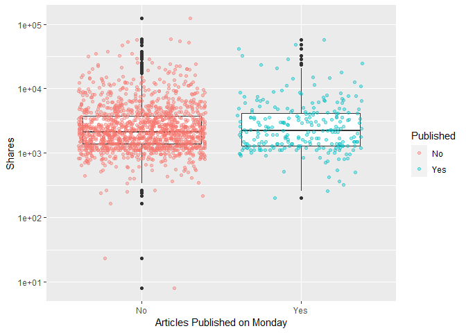<!-- -->

``` r
# 32. weekday_is_tuesday: Was the article published on a Tuesday
ggplot(data=ChannelTrain %>% 
              mutate(weekday_fctr = factor(x=weekday_is_tuesday,  
              levels=c(0,1), labels = c("No", "Yes"))), 
            aes(y=shares, x=weekday_fctr)) + 
            labs(x="Articles Published on Tuesday", y="Shares", color = "Published") +
            geom_boxplot() + scale_y_log10() +
            geom_point(aes(color=weekday_fctr), position="jitter", alpha=0.4) 
```

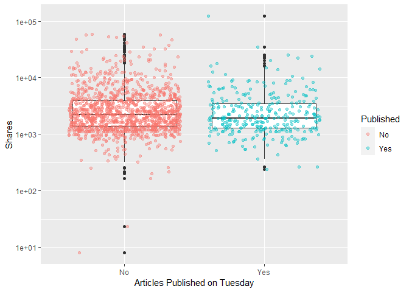<!-- -->

``` r
# 33. weekday_is_wednesday: Was the article published on a Wednesday?
ggplot(data=ChannelTrain %>% 
              mutate(weekday_fctr = factor(x=weekday_is_wednesday,  
              levels=c(0,1), labels = c("No", "Yes"))), 
            aes(y=shares, x=weekday_fctr)) + 
            labs(x="Articles Published on Wednesday", y="Shares", color = "Published") +
            geom_boxplot() + scale_y_log10() +
            geom_point(aes(color=weekday_fctr), position="jitter", alpha=0.4) 
```

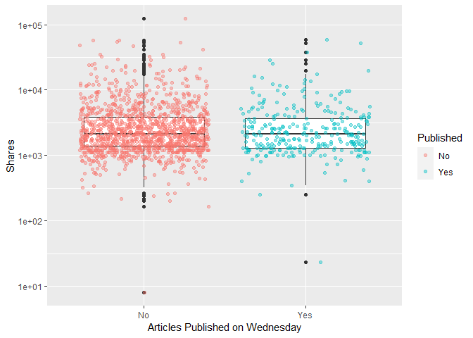<!-- -->

``` r
# 34. weekday_is_thursday: Was the article published on a Thursday?
ggplot(data=ChannelTrain %>% 
              mutate(weekday_fctr = factor(x=weekday_is_thursday,  
              levels=c(0,1), labels = c("No", "Yes"))), 
            aes(y=shares, x=weekday_fctr)) + 
            labs(x="Articles Published on Thursday", y="Shares", color = "Published") +
            geom_boxplot() + scale_y_log10() +
            geom_point(aes(color=weekday_fctr), position="jitter", alpha=0.4) 
```

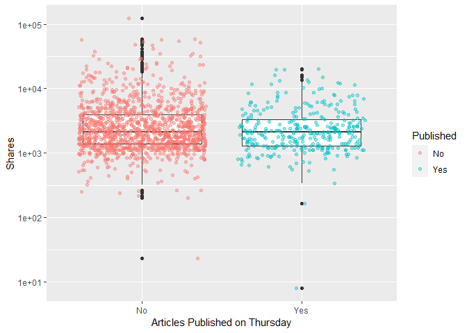<!-- -->

``` r
# 35. weekday_is_friday: Was the article published on a Friday?
ggplot(data=ChannelTrain %>% 
              mutate(weekday_fctr = factor(x=weekday_is_friday,  
              levels=c(0,1), labels = c("No", "Yes"))), 
            aes(y=shares, x=weekday_fctr)) + 
            labs(x="Articles Published on Friday", y="Shares", color = "Published") +
            geom_boxplot() + scale_y_log10() +
            geom_point(aes(color=weekday_fctr), position="jitter", alpha=0.4) 
```

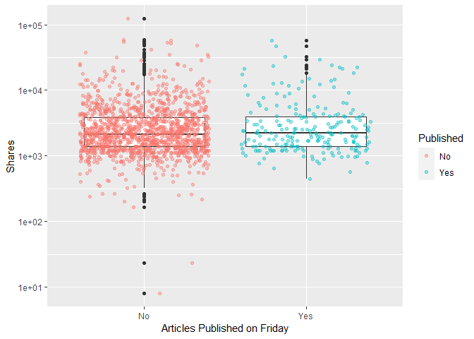<!-- -->

``` r
# 36. weekday_is_saturday: Was the article published on a Saturday?
ggplot(data=ChannelTrain %>% 
              mutate(weekday_fctr = factor(x=weekday_is_saturday,  
              levels=c(0,1), labels = c("No", "Yes"))), 
            aes(y=shares, x=weekday_fctr)) + 
            labs(x="Articles Published on Saturday", y="Shares", color = "Published") +
            geom_boxplot() + scale_y_log10() +
            geom_point(aes(color=weekday_fctr), position="jitter", alpha=0.4) 
```

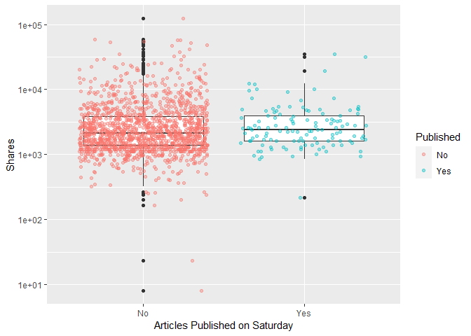<!-- -->

``` r
# 37. weekday_is_sunday: Was the article published on a Sunday?
ggplot(data=ChannelTrain %>% 
              mutate(weekday_fctr = factor(x=weekday_is_sunday,  
              levels=c(0,1), labels = c("No", "Yes"))), 
            aes(y=shares, x=weekday_fctr)) + 
            labs(x="Articles Published on Sunday", y="Shares", color = "Published") +
            geom_boxplot() + scale_y_log10() +
            geom_point(aes(color=weekday_fctr), position="jitter", alpha=0.4) 
```

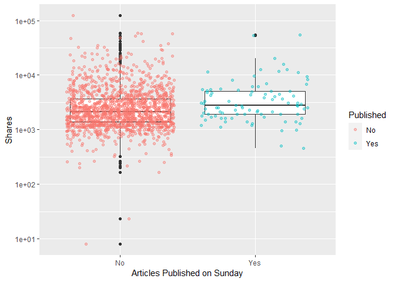<!-- -->

``` r
# # 38. is_weekend: Was the article published on the weekend? 
# ggplot(data=ChannelTrain %>% 
#               mutate(weekday_fctr = factor(x=is_weekend,  
#               levels=c(0,1), labels = c("No", "Yes"))), 
#             aes(y=shares, x=weekday_fctr)) + 
#             labs(x="Articles Published on Monday", y="Shares", color = "Published") +
#             geom_boxplot() + scale_y_log10() +
#             geom_point(aes(color=weekday_fctr), position="jitter") 
# i can make conclusions based on summary() median, min, max, bc i trasfomred for visibility
```

The y - axis is using a log axis not a linear axis, but the plots are
more easily interpretable / visually more intuitive with this
transformation.The general shape of the plots is correct.

We can inspect the trend of shares as a function of the different days
of the week that the articles are published.

If you see a presence of outliers, this may cause the mean to shift in
that direction, but the meidan will not be effected as much. If you see
that the median is not centered within the box, then there is a presence
of skewness in that particular direction. Also, if you see that there
are more observations / dots on one graph while comparing publication
(Yes/No), this is meaningful within the plot itself and also across the
different days of the week.

<!-- might use this later dont delete yet -->

``` r
#what question are we trying to answer here? 
# how to predict shares given the variables you have...
#fitting the model
fit_Channel <- lm(shares ~ . , data = Channel)
#call fit_Lifestyle object - remember this is an lm object
fit_Channel
```

    ## 
    ## Call:
    ## lm(formula = shares ~ ., data = Channel)
    ## 
    ## Coefficients:
    ##                   (Intercept)                 n_tokens_title               n_tokens_content  
    ##                     7.045e+02                     -1.202e+01                      3.745e-02  
    ##               n_unique_tokens               n_non_stop_words       n_non_stop_unique_tokens  
    ##                    -3.601e+03                      2.385e+03                     -1.960e+03  
    ##                     num_hrefs                 num_self_hrefs                       num_imgs  
    ##                    -1.637e+01                     -3.736e+01                     -3.643e+01  
    ##                    num_videos           average_token_length                   num_keywords  
    ##                     5.339e+01                     -5.439e+01                      9.191e+01  
    ##     data_channel_is_lifestyle  data_channel_is_entertainment            data_channel_is_bus  
    ##                            NA                             NA                             NA  
    ##        data_channel_is_socmed           data_channel_is_tech          data_channel_is_world  
    ##                            NA                             NA                             NA  
    ##                    kw_min_min                     kw_max_min                     kw_avg_min  
    ##                     2.973e+00                     -3.012e-01                      1.011e+00  
    ##                    kw_min_max                     kw_max_max                     kw_avg_max  
    ##                    -9.314e-04                      1.415e-04                     -1.769e-03  
    ##                    kw_min_avg                     kw_max_avg                     kw_avg_avg  
    ##                     2.807e-02                     -1.440e-01                      1.219e+00  
    ##     self_reference_min_shares      self_reference_max_shares     self_reference_avg_sharess  
    ##                     1.883e-02                      2.684e-03                     -6.242e-04  
    ##             weekday_is_monday             weekday_is_tuesday           weekday_is_wednesday  
    ##                    -2.334e+02                     -7.195e+02                     -8.582e+02  
    ##           weekday_is_thursday              weekday_is_friday            weekday_is_saturday  
    ##                    -1.184e+03                     -2.859e+02                     -8.476e+02  
    ##             weekday_is_sunday                     is_weekend                         LDA_00  
    ##                            NA                             NA                      4.589e+02  
    ##                        LDA_01                         LDA_02                         LDA_03  
    ##                    -2.349e+03                     -1.153e+03                     -1.361e+03  
    ##                        LDA_04            global_subjectivity      global_sentiment_polarity  
    ##                            NA                     -2.193e+02                      6.613e+02  
    ##    global_rate_positive_words     global_rate_negative_words            rate_positive_words  
    ##                    -2.924e+03                      3.304e+03                      1.954e+03  
    ##           rate_negative_words          avg_positive_polarity          min_positive_polarity  
    ##                     2.921e+03                     -7.604e+02                     -2.164e+03  
    ##         max_positive_polarity          avg_negative_polarity          min_negative_polarity  
    ##                    -1.067e+03                      3.127e+03                     -2.365e+03  
    ##         max_negative_polarity             title_subjectivity       title_sentiment_polarity  
    ##                    -1.696e+03                      5.796e+02                     -5.530e+02  
    ##        abs_title_subjectivity   abs_title_sentiment_polarity  
    ##                     7.828e+02                      1.593e+03

``` r
# check fit_Lifestyle attributes
attributes(fit_Channel)
```

    ## $names
    ##  [1] "coefficients"  "residuals"     "effects"       "rank"          "fitted.values"
    ##  [6] "assign"        "qr"            "df.residual"   "xlevels"       "call"         
    ## [11] "terms"         "model"        
    ## 
    ## $class
    ## [1] "lm"

``` r
fit_Channel[["residuals"]]
```

    ##             1             2             3             4             5             6 
    ## -2.406988e+02  1.366195e+03  3.384900e+03  4.387193e+02  2.004244e+03  8.502232e+03 
    ##             7             8             9            10            11            12 
    ## -1.622405e+03 -2.196522e+03  1.243353e+04 -7.883710e+02  6.038791e+03 -1.171147e+02 
    ##            13            14            15            16            17            18 
    ##  9.847076e+03 -1.072855e+03  1.648383e+03 -2.203439e+03 -2.136876e+03  3.262609e+03 
    ##            19            20            21            22            23            24 
    ## -2.076546e+03 -1.764857e+03 -9.290621e+02  4.235908e+03  7.259151e+02 -1.705461e+03 
    ##            25            26            27            28            29            30 
    ## -3.537554e+03  2.864887e+03 -1.275879e+03 -4.013122e+03 -1.380701e+03  1.234311e+04 
    ##            31            32            33            34            35            36 
    ## -2.765549e+03  5.009105e+04 -1.147679e+03  3.179012e+02 -3.254976e+03  2.728138e+03 
    ##            37            38            39            40            41            42 
    ## -7.171778e+02  7.418363e+01 -3.377882e+03 -1.515879e+03 -2.071135e+03  3.548782e+02 
    ##            43            44            45            46            47            48 
    ## -2.107833e+03 -9.958297e+02 -4.702809e+02  2.434229e+03 -4.130261e+03 -1.576363e+03 
    ##            49            50            51            52            53            54 
    ## -1.602000e+03 -3.721283e+02 -2.115679e+03 -6.927909e+02  1.696772e+03 -2.813244e+03 
    ##            55            56            57            58            59            60 
    ## -2.128157e+03 -1.472538e+03 -1.981500e+03 -2.577764e+03 -1.859327e+03 -1.294928e+03 
    ##            61            62            63            64            65            66 
    ## -1.226262e+03 -3.022862e+03  4.365914e+03 -1.031206e+03 -2.147947e+03  1.408990e+02 
    ##            67            68            69            70            71            72 
    ## -7.396699e+01  1.091082e+03  4.605642e+02 -3.638327e+02 -2.545031e+03 -2.700919e+03 
    ##            73            74            75            76            77            78 
    ## -2.137772e+03 -1.204701e+01  4.045272e+02  1.531723e+03 -2.887462e+03 -3.284041e+03 
    ##            79            80            81            82            83            84 
    ## -2.587440e+03 -3.162147e+03 -2.810669e+03  1.319953e+03 -1.262684e+03 -4.906568e+03 
    ##            85            86            87            88            89            90 
    ##  6.505966e+02 -4.248110e+02 -2.442265e+03 -3.856262e+03  2.135055e+03 -2.934984e+03 
    ##            91            92            93            94            95            96 
    ##  8.939346e+02 -5.326013e+02 -2.849698e+03 -1.644646e+03 -2.644373e+03 -2.277323e+03 
    ##            97            98            99           100           101           102 
    ## -3.613676e+03 -2.377880e+03 -3.790339e+03 -1.833260e+03 -9.171531e+02 -3.371186e+03 
    ##           103           104           105           106           107           108 
    ## -3.011110e+03  2.391868e+04 -1.913483e+03 -3.792796e+03 -9.391860e+01 -1.380286e+02 
    ##           109           110           111           112           113           114 
    ##  4.305060e+03 -1.427268e+03  2.390040e+03 -3.752673e+03 -1.187177e+03 -6.449794e+02 
    ##           115           116           117           118           119           120 
    ## -2.205567e+03 -1.381761e+03 -1.713951e+03 -7.471682e+02 -6.878908e+02 -5.143548e+03 
    ##           121           122           123           124           125           126 
    ## -3.240681e+03 -2.021314e+03 -1.108595e+03 -2.327177e+03  2.647651e+03  1.200681e+03 
    ##           127           128           129           130           131           132 
    ##  1.260021e+04  8.404185e+03  9.328836e+01 -2.340141e+03 -3.773005e+03 -2.651608e+03 
    ##           133           134           135           136           137           138 
    ## -1.287213e+03 -1.509524e+03 -2.576342e+03  1.199337e+03 -7.147350e+03 -3.885592e+03 
    ##           139           140           141           142           143           144 
    ## -2.680406e+03  4.499943e+03 -4.292619e+02 -2.641001e+03 -1.445205e+03 -5.610764e+02 
    ##           145           146           147           148           149           150 
    ## -2.032902e+03 -1.838061e+03 -4.430719e+01 -5.422797e+02  4.479854e+03 -3.564652e+03 
    ##           151           152           153           154           155           156 
    ## -3.701932e+03  6.627604e+01 -2.945299e+02 -1.691103e+02 -1.153412e+03 -3.549039e+02 
    ##           157           158           159           160           161           162 
    ## -2.960600e+03 -2.498991e+03  5.184426e+02 -1.174255e+03 -6.134905e+02  8.811852e+02 
    ##           163           164           165           166           167           168 
    ## -1.465685e+03  1.716135e+03 -4.042012e+03 -2.612504e+03 -1.312464e+03 -3.177548e+03 
    ##           169           170           171           172           173           174 
    ## -3.843999e+03  2.510429e+03 -2.848950e+03  1.730558e+03 -2.568983e+02 -2.792577e+03 
    ##           175           176           177           178           179           180 
    ## -1.811264e+03 -3.797921e+03  5.053805e+02 -3.947748e+03  1.680976e+03 -3.119793e+03 
    ##           181           182           183           184           185           186 
    ## -2.111617e+03 -6.050214e+01 -2.409772e+03 -1.385584e+03  1.151164e+04 -2.284482e+03 
    ##           187           188           189           190           191           192 
    ## -2.869542e+03 -4.010158e+02 -1.749257e+03 -2.086479e+03 -1.651067e+03  4.406813e+03 
    ##           193           194           195           196           197           198 
    ##  2.591667e+03 -1.118924e+03 -1.399279e+03  1.943500e+02 -1.046825e+02  3.074750e+03 
    ##           199           200           201           202           203           204 
    ## -1.417193e+02 -3.800907e+03 -5.210944e+03  2.831948e+04 -3.724809e+03 -3.794124e+03 
    ##           205           206           207           208           209           210 
    ## -1.050420e+03 -2.773209e+03  6.572338e+02 -2.281356e+03 -5.200946e+03 -2.814188e+03 
    ##           211           212           213           214           215           216 
    ## -1.958497e+02 -2.273671e+03 -3.084056e+03 -4.584975e+03  6.617958e+03  1.176118e+04 
    ##           217           218           219           220           221           222 
    ## -5.513655e+02 -1.486238e+03 -1.013259e+03 -7.331170e+02 -1.181582e+03 -7.799163e+02 
    ##           223           224           225           226           227           228 
    ## -3.783876e+03 -1.415317e+03 -1.702155e+03  8.898911e+02 -1.658370e+03 -2.615988e+02 
    ##           229           230           231           232           233           234 
    ##  2.459505e+03 -4.915355e+02 -1.579513e+03 -2.796885e+03  5.192658e+04 -4.776623e+03 
    ##           235           236           237           238           239           240 
    ## -1.037397e+03 -2.211945e+03 -3.917791e+03 -3.742384e+03 -1.615971e+03 -1.726776e+03 
    ##           241           242           243           244           245           246 
    ## -3.970404e+02 -3.181074e+03  2.356508e+04  6.852059e+03  8.279913e+02 -1.609268e+03 
    ##           247           248           249           250           251           252 
    ## -1.599110e+02 -1.829895e+03  1.411290e+04 -1.483820e+03  2.262445e+03 -1.834839e+03 
    ##           253           254           255           256           257           258 
    ##  2.361295e+03  4.959463e+02  6.292397e+02 -1.523870e+03 -2.204180e+03 -1.202365e+03 
    ##           259           260           261           262           263           264 
    ## -3.319452e+03 -1.629382e+03  5.458905e+03  3.164408e+02  5.795268e+01  1.526783e+04 
    ##           265           266           267           268           269           270 
    ## -1.529788e+03  8.017403e+03 -2.888670e+03  8.328064e+02 -2.766626e+02  8.472213e+02 
    ##           271           272           273           274           275           276 
    ## -2.145606e+03  2.313001e+02 -7.017084e+02 -1.794737e+03 -1.265410e+03 -1.251289e+03 
    ##           277           278           279           280           281           282 
    ##  4.988461e+03 -1.743046e+03  7.621744e+02 -2.016559e+03  5.926618e+03  2.501773e+03 
    ##           283           284           285           286           287           288 
    ##  1.827563e+03  1.321354e+03 -4.872262e+02  9.307043e+03 -1.335245e+03 -5.546826e+03 
    ##           289           290           291           292           293           294 
    ## -3.308275e+03 -2.957040e+03 -9.650566e+02  1.510466e+03 -2.658480e+03 -1.970720e+03 
    ##           295           296           297           298           299           300 
    ## -2.637385e+02  6.931796e+02 -2.770434e+02  3.534828e+02 -6.534739e+02  1.827345e+02 
    ##           301           302           303           304           305           306 
    ## -1.885187e+03 -6.429720e+03  1.111503e+04 -1.097750e+02 -1.223337e+03 -4.759998e+03 
    ##           307           308           309           310           311           312 
    ##  3.858575e+03 -3.301947e+03 -2.013626e+03 -4.566730e+03 -9.268046e+02 -8.597534e+02 
    ##           313           314           315           316           317           318 
    ## -1.413123e+03 -3.712684e+03 -6.153763e+02 -8.974111e+02 -3.122228e+03 -1.950922e+03 
    ##           319           320           321           322           323           324 
    ##  3.177080e+03  9.005142e+02  1.635394e+02 -1.190727e+03  2.983839e+03 -2.367304e+03 
    ##           325           326           327           328           329           330 
    ## -2.353008e+03 -1.965131e+02 -4.543813e+03  3.888147e+01 -1.696677e+03  1.479348e+03 
    ##           331           332           333           334           335           336 
    ##  7.300670e+02  1.932757e+02 -2.197576e+03 -3.595898e+02  3.135084e+02  1.788256e+03 
    ##           337           338           339           340           341           342 
    ## -2.665748e+03 -1.166456e+03  4.248066e+03 -5.158804e+03 -3.666797e+03  1.454867e+03 
    ##           343           344           345           346           347           348 
    ## -2.103663e+03 -1.402184e+03  1.236739e+04 -6.261568e+02 -5.816160e+02  3.693075e+03 
    ##           349           350           351           352           353           354 
    ##  1.571997e+03  2.084981e+02 -2.616673e+01  2.637105e+03  1.598522e+04 -5.837489e+02 
    ##           355           356           357           358           359           360 
    ##  5.066520e+02 -1.353352e+03  5.841123e+02 -3.573370e+03 -2.566493e+03 -2.556189e+03 
    ##           361           362           363           364           365           366 
    ##  1.014449e+04 -3.335740e+03  2.338229e+03  1.444766e+03 -2.132300e+03 -2.300860e+03 
    ##           367           368           369           370           371           372 
    ##  6.383997e+02 -7.645274e+02 -1.601292e+03 -5.828103e+03 -2.004547e+03 -7.835164e+01 
    ##           373           374           375           376           377           378 
    ## -2.091508e+03  2.955907e+02 -2.286539e+03  6.324381e+03  2.731897e+03 -2.472631e+03 
    ##           379           380           381           382           383           384 
    ##  3.892410e+02 -5.443734e+03 -2.428167e+03  4.072832e+03 -2.953445e+03 -4.581804e+03 
    ##           385           386           387           388           389           390 
    ## -2.578815e+03 -3.486043e+03  1.081236e+04 -3.110025e+03 -7.919252e+02  6.939276e+03 
    ##           391           392           393           394           395           396 
    ## -4.355064e+03 -3.456220e+03  8.975572e+02 -2.260908e+03  3.753654e+03  1.861403e+03 
    ##           397           398           399           400           401           402 
    ## -5.717005e+02 -2.166237e+03 -4.368165e+02 -2.506674e+03 -1.041774e+03  4.392296e+02 
    ##           403           404           405           406           407           408 
    ##  9.354004e+02 -3.347616e+03  7.654802e+02  1.688348e+03 -2.361530e+03 -2.978537e+03 
    ##           409           410           411           412           413           414 
    ## -3.328096e+02 -8.290107e+02 -1.349910e+03 -1.623471e+03  9.756358e+01 -7.512815e+02 
    ##           415           416           417           418           419           420 
    ##  1.103976e+04 -4.637475e+03 -1.354005e+03  5.265538e+02  9.520431e+02 -3.622998e+02 
    ##           421           422           423           424           425           426 
    ##  2.476426e+02  3.424840e+03 -1.118590e+03  2.898112e+03 -3.304239e+03 -1.908072e+03 
    ##           427           428           429           430           431           432 
    ## -1.898169e+03 -1.687614e+02  1.558792e+03 -1.237619e+03  6.054470e+03 -1.596843e+03 
    ##           433           434           435           436           437           438 
    ## -2.155949e+03 -1.957608e+03 -3.166981e+03 -9.087529e+02 -8.317436e+01  2.154950e+03 
    ##           439           440           441           442           443           444 
    ## -1.440324e+03 -1.607353e+03  1.828516e+03 -2.741828e+03  1.024741e+04 -2.836025e+03 
    ##           445           446           447           448           449           450 
    ##  8.867868e+03  4.734713e+02 -1.789489e+03 -6.823935e+01 -1.831966e+03  5.565290e+02 
    ##           451           452           453           454           455           456 
    ## -1.931129e+03  6.289110e+02 -1.024069e+03 -6.929867e+02 -1.618919e+03  6.653572e+02 
    ##           457           458           459           460           461           462 
    ## -2.575197e+03 -2.996241e+02 -1.518359e+03 -7.281789e+02 -2.082697e+03 -3.806450e+03 
    ##           463           464           465           466           467           468 
    ## -1.014452e+03  1.105169e+03  2.596762e+03  1.051628e+04 -2.883362e+03  5.810923e+02 
    ##           469           470           471           472           473           474 
    ## -1.017209e+03  1.883599e+03  2.271974e+03 -1.374007e+03  8.421319e+03 -3.667640e+03 
    ##           475           476           477           478           479           480 
    ## -4.365530e+03 -1.867649e+03 -1.701721e+03  3.638707e+03  5.759529e+03 -8.706313e+02 
    ##           481           482           483           484           485           486 
    ##  4.828499e+02 -2.892491e+03  9.784267e+03  2.058768e+03  3.923156e+02  1.232013e+02 
    ##           487           488           489           490           491           492 
    ## -7.379048e+02 -1.230140e+03  2.536983e+02  3.447074e+02 -2.815580e+03 -2.014377e+03 
    ##           493           494           495           496           497           498 
    ## -1.209751e+03  3.222343e+03  2.288788e+01 -5.539592e+02 -6.358952e+02 -7.389463e+02 
    ##           499           500           501           502           503           504 
    ## -1.778648e+03 -3.110605e+03 -1.311495e+03 -2.241224e+02  1.847497e+03 -2.362063e+03 
    ##           505           506           507           508           509           510 
    ##  1.221428e+03 -3.624144e+02 -8.443728e+02  5.969308e+02 -4.972718e+02 -2.281408e+03 
    ##           511           512           513           514           515           516 
    ## -9.958938e+02 -2.070326e+03 -1.803868e+03 -1.873023e+03 -7.778375e+02  3.284896e+02 
    ##           517           518           519           520           521           522 
    ## -7.699243e+02 -8.179214e+02 -1.849641e+03  1.409164e+03  1.187513e+03  6.991257e+03 
    ##           523           524           525           526           527           528 
    ## -2.298075e+03 -1.837889e+03  5.549908e+02 -2.802939e+03 -1.365850e+03  3.287268e+03 
    ##           529           530           531           532           533           534 
    ##  6.112735e+02  4.875102e+03 -1.268769e+03 -1.487744e+04  5.154593e+02  2.526764e+03 
    ##           535           536           537           538           539           540 
    ## -1.612312e+03 -6.993277e+02 -4.562219e+02 -2.226694e+03 -4.908426e+02 -2.532826e+03 
    ##           541           542           543           544           545           546 
    ## -6.569281e+02 -3.329130e+02 -1.579168e+03 -2.116310e+02 -4.277017e+03 -4.713549e+01 
    ##           547           548           549           550           551           552 
    ## -3.453073e+02 -9.621795e+02 -4.091371e+03 -7.685083e+02 -1.983509e+03 -1.793324e+03 
    ##           553           554           555           556           557           558 
    ## -2.159111e+03 -2.317764e+03 -8.361327e+02 -1.874204e+03 -2.477704e+03  1.610691e+03 
    ##           559           560           561           562           563           564 
    ## -1.533185e+03  1.701840e+03 -2.427522e+03 -1.225781e+03 -2.136457e+03 -3.215641e+03 
    ##           565           566           567           568           569           570 
    ##  2.290994e+04  2.950377e+01  6.784402e+02  1.192903e+02  7.373085e+02 -3.237028e+01 
    ##           571           572           573           574           575           576 
    ##  4.854613e+03 -9.362840e+02 -6.921852e+02 -5.616068e+02 -3.927891e+03 -1.856229e+03 
    ##           577           578           579           580           581           582 
    ## -3.963310e+03 -1.826329e+03 -1.358597e+03  5.577520e+02  2.299977e+03  2.678362e+03 
    ##           583           584           585           586           587           588 
    ## -1.719430e+03 -3.411126e+03 -1.085318e+03  7.484897e+03  3.718663e+02 -2.067862e+03 
    ##           589           590           591           592           593           594 
    ## -2.857801e+02  2.034191e+03  1.403858e+03 -2.114375e+03 -6.945714e+02  2.648247e+03 
    ##           595           596           597           598           599           600 
    ## -2.813199e+03  1.250674e+02  3.279465e+02 -7.511050e+02 -4.272652e+03  2.015062e+04 
    ##           601           602           603           604           605           606 
    ##  6.433956e+03 -1.742491e+03 -3.964631e+03  1.824174e+02 -1.937161e+03 -1.767463e+03 
    ##           607           608           609           610           611           612 
    ##  3.635488e+03 -1.660407e+03 -1.610467e+03  7.517368e+01  7.653867e+03  1.037495e+04 
    ##           613           614           615           616           617           618 
    ## -1.929306e+03 -2.479837e+03 -1.890794e+03  8.637417e+02 -1.216497e+02 -2.507790e+03 
    ##           619           620           621           622           623           624 
    ## -2.030515e+03  1.195996e+04 -3.488588e+03  1.425060e+03 -1.287765e+03  4.206288e+02 
    ##           625           626           627           628           629           630 
    ## -3.459200e+03 -2.997762e+03 -1.948259e+03 -2.403388e+03 -3.188817e+03  4.217809e+03 
    ##           631           632           633           634           635           636 
    ## -3.006542e+03 -2.602825e+03 -1.427491e+03 -2.337743e+02  1.193817e+03 -2.140970e+03 
    ##           637           638           639           640           641           642 
    ## -1.925753e+03 -2.758465e+03 -1.156134e+03 -2.830092e+03 -4.026687e+02  4.288984e+02 
    ##           643           644           645           646           647           648 
    ## -3.718631e+03 -8.215979e+02  2.623980e+04  8.606637e+01 -3.068895e+03  2.312254e+03 
    ##           649           650           651           652           653           654 
    ##  7.121323e+02 -2.467561e+03 -2.568133e+03 -5.779206e+02 -1.840090e+03 -1.572940e+03 
    ##           655           656           657           658           659           660 
    ## -1.213458e+03 -2.051681e+03  5.288138e+04 -2.281505e+03  1.098791e+03 -1.116420e+03 
    ##           661           662           663           664           665           666 
    ##  8.258261e+00 -1.244535e+03  3.809583e+02  3.475177e+03 -1.790137e+03  1.107347e+03 
    ##           667           668           669           670           671           672 
    ## -1.946629e+03  9.981353e+02 -1.386071e+03 -3.305556e+03 -3.231145e+03 -1.370035e+03 
    ##           673           674           675           676           677           678 
    ## -1.830139e+03 -7.808751e+02 -4.843408e+02 -3.651781e+03  1.524091e+04  1.642578e+03 
    ##           679           680           681           682           683           684 
    ## -5.730750e+02 -3.689439e+03  2.655429e+02 -9.798884e+02 -1.154723e+03  4.533233e+02 
    ##           685           686           687           688           689           690 
    ## -1.602070e+03 -6.636255e+02 -2.537756e+03 -1.098213e+03 -6.013873e+02 -1.990465e+03 
    ##           691           692           693           694           695           696 
    ## -4.845660e+03 -2.021859e+03 -5.902703e+02 -6.168803e+02  1.561574e+03 -1.821900e+03 
    ##           697           698           699           700           701           702 
    ## -1.278528e+03 -2.926180e+03  9.966519e+02 -1.020815e+03 -2.066447e+02  5.071169e+02 
    ##           703           704           705           706           707           708 
    ##  3.248529e+03 -3.338107e+03 -1.659859e+03 -1.478223e+03  2.076619e+03 -2.544624e+03 
    ##           709           710           711           712           713           714 
    ## -3.244605e+03 -3.627791e+03 -1.621509e+03 -4.122640e+03 -2.321283e+02  4.051303e+03 
    ##           715           716           717           718           719           720 
    ## -3.170022e+03 -1.380909e+03  2.170550e+03  1.385125e+03 -2.006813e+03 -9.932042e+02 
    ##           721           722           723           724           725           726 
    ## -4.481653e+02 -3.378632e+03 -1.803199e+03  6.685023e+02 -1.537770e+03 -1.372947e+03 
    ##           727           728           729           730           731           732 
    ## -2.590165e+03 -1.798514e+03 -3.069617e+03 -2.699184e+03 -1.037914e+03 -5.178830e+02 
    ##           733           734           735           736           737           738 
    ##  5.472769e+01  1.286787e+03 -2.195678e+03 -2.654850e+03 -5.088623e+01  1.361230e+03 
    ##           739           740           741           742           743           744 
    ## -4.505067e+03 -1.341498e+02  3.175199e+03 -2.806848e+02  1.940299e+03  2.079617e+03 
    ##           745           746           747           748           749           750 
    ##  1.806114e+03 -1.613608e+03  1.993163e+03  3.249059e+03  3.265240e+02 -1.110548e+03 
    ##           751           752           753           754           755           756 
    ##  4.336588e+03 -1.564430e+03 -1.659531e+03  9.774826e+02 -1.701360e+03  8.869990e+01 
    ##           757           758           759           760           761           762 
    ## -5.868790e+02 -2.884877e+03  7.074356e+01  1.341558e+02  2.545190e+03  7.975271e+02 
    ##           763           764           765           766           767           768 
    ## -6.075639e+01 -1.403158e+02  2.696588e+04  5.618517e+03 -1.357540e+03 -2.552790e+03 
    ##           769           770           771           772           773           774 
    ## -1.363956e+03 -1.766318e+03 -1.044610e+02 -1.351326e+03 -1.619524e+03  2.437257e+02 
    ##           775           776           777           778           779           780 
    ##  1.323501e+03 -6.561365e+02 -1.272314e+03 -4.627658e+02  1.875229e+03 -2.029949e+03 
    ##           781           782           783           784           785           786 
    ## -7.657778e+02 -1.573718e+03 -2.552398e+03 -1.678177e+03 -2.428361e+03  4.286503e+02 
    ##           787           788           789           790           791           792 
    ## -3.296740e+03 -1.862673e+02  2.591300e+03  1.718381e+03 -7.202867e+02 -4.885617e+02 
    ##           793           794           795           796           797           798 
    ## -3.183269e+03  8.458167e+02  4.793546e+03 -1.856564e+03  7.275790e+02  2.223001e+04 
    ##           799           800           801           802           803           804 
    ## -3.986304e+03 -1.984778e+03 -2.249865e+03  4.675890e+02 -4.515109e+03 -1.934383e+03 
    ##           805           806           807           808           809           810 
    ##  7.734933e+01 -1.978953e+02 -1.526705e+03  5.804685e+02 -2.311501e+03 -3.718973e+02 
    ##           811           812           813           814           815           816 
    ## -2.388334e+03 -1.810864e+03  5.664979e+03 -2.325143e+03 -1.310926e+03  1.363907e+02 
    ##           817           818           819           820           821           822 
    ## -7.337383e+02 -1.116461e+02  1.107140e+04  1.310533e+04 -3.522790e+03 -1.935950e+03 
    ##           823           824           825           826           827           828 
    ##  2.529778e+03 -2.315042e+03 -1.414676e+03 -5.509386e+02  9.894216e+03  2.683792e+03 
    ##           829           830           831           832           833           834 
    ## -3.663414e+03 -7.593337e+02  1.907051e+02 -1.381555e+03 -1.482709e+03 -1.289445e+03 
    ##           835           836           837           838           839           840 
    ##  3.678093e+03 -2.567866e+03 -3.610934e+03 -1.157631e+03 -1.721479e+03 -3.112483e+03 
    ##           841           842           843           844           845           846 
    ## -1.896517e+03 -8.344889e+02 -1.994012e+03  3.161913e+02 -3.504714e+03  9.672192e+01 
    ##           847           848           849           850           851           852 
    ## -8.496315e+02 -2.402356e+03 -2.659801e+03 -4.387755e+03  3.862127e+03 -6.240434e+02 
    ##           853           854           855           856           857           858 
    ## -2.562092e+03  1.228404e+03 -1.676268e+03 -8.279313e+02 -2.580392e+03 -5.430853e+02 
    ##           859           860           861           862           863           864 
    ##  5.867875e+03 -4.780509e+03 -7.835835e+02 -1.415547e+03 -7.796229e+02  1.478027e+02 
    ##           865           866           867           868           869           870 
    ##  4.485630e+04 -3.218454e+03 -2.080582e+03 -1.558455e+03 -8.057923e+02 -3.301472e+03 
    ##           871           872           873           874           875           876 
    ## -1.587017e+03  7.259401e+03 -2.694741e+03 -2.314440e+01 -3.963507e+03  4.745932e+04 
    ##           877           878           879           880           881           882 
    ## -1.701559e+02 -3.977304e+03 -1.736570e+03 -3.414920e+03  1.595238e+03  8.193760e+01 
    ##           883           884           885           886           887           888 
    ## -1.121295e+03  2.491748e+03  5.149848e+02 -2.859699e+03 -2.201390e+03 -2.223027e+03 
    ##           889           890           891           892           893           894 
    ## -7.374343e-02 -6.771561e+02 -2.274113e+03 -2.138538e+03 -9.350970e+02  1.339575e+03 
    ##           895           896           897           898           899           900 
    ## -2.577665e+03 -5.640363e+03 -2.036638e+02 -9.947752e+02 -9.862444e+02 -1.349446e+03 
    ##           901           902           903           904           905           906 
    ##  4.309780e+01 -1.845890e+03 -1.884142e+03  5.853889e+03  4.345845e+02 -4.093552e+02 
    ##           907           908           909           910           911           912 
    ## -9.993742e+02  1.148200e+03 -1.272188e+03 -1.239826e+03 -2.002743e+03 -1.580802e+03 
    ##           913           914           915           916           917           918 
    ## -2.583057e+02  5.785758e+02  4.869176e+03 -3.885028e+03  2.140112e+03 -1.303311e+03 
    ##           919           920           921           922           923           924 
    ## -8.162062e+02 -1.665359e+03  1.934378e+03 -8.754820e+02 -2.958880e+03 -8.640298e+02 
    ##           925           926           927           928           929           930 
    ## -1.774450e+03 -2.838213e+03 -2.801814e+03  5.278566e+03 -1.090188e+03 -4.387463e+03 
    ##           931           932           933           934           935           936 
    ## -6.238269e+02 -1.234008e+03  1.616039e+03 -1.272998e+02  1.303177e+03 -1.342347e+03 
    ##           937           938           939           940           941           942 
    ## -1.506212e+03 -1.945287e+03 -7.246475e+02  5.094357e+02 -2.872186e+02 -6.795280e+02 
    ##           943           944           945           946           947           948 
    ## -9.115093e+01  1.654058e+04  2.707018e+03  4.772654e+03 -2.300271e+03 -1.118733e+03 
    ##           949           950           951           952           953           954 
    ## -1.236769e+03  3.945544e+01 -1.185325e+03  3.286346e+03 -7.622127e+02 -1.081224e+03 
    ##           955           956           957           958           959           960 
    ##  8.473588e+02  1.500641e+03  5.993163e+03  5.645234e+03  3.661088e+03 -1.237767e+03 
    ##           961           962           963           964           965           966 
    ## -9.096047e+02 -5.813072e+02 -1.072688e+03  8.095984e+03 -5.199980e+02 -1.565981e+03 
    ##           967           968           969           970           971           972 
    ##  3.450389e+02  2.249191e+03 -3.185596e+03  2.080588e+03 -1.856016e+02  4.460159e+02 
    ##           973           974           975           976           977           978 
    ##  1.091221e+04  3.602775e+03  5.049414e+03 -3.635539e+03  5.690260e+03 -1.576322e+03 
    ##           979           980           981           982           983           984 
    ## -6.341029e+02 -3.134363e+03 -2.887204e+03 -2.105567e+03 -2.027766e+03 -6.915378e+01 
    ##           985           986           987           988           989           990 
    ##  4.698237e+03 -9.196691e+02 -1.826561e+02 -6.639461e+02 -3.955280e+03 -2.113628e+03 
    ##           991           992           993           994           995           996 
    ##  1.809394e+02 -3.422531e+03 -3.033343e+02 -2.702337e+03  2.369461e+02 -3.878891e+02 
    ##           997           998           999          1000 
    ## -9.127809e+02 -5.291678e+03  8.892600e+03 -1.334845e+03 
    ##  [ reached getOption("max.print") -- omitted 1323 entries ]

``` r
#summary stats for vars of interest - 
plot(fit_Channel)
```

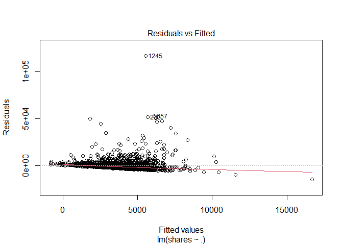<!-- -->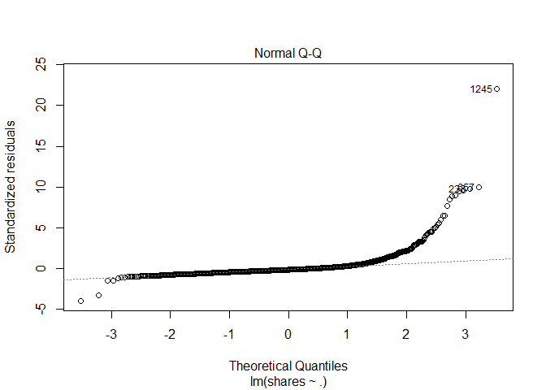<!-- -->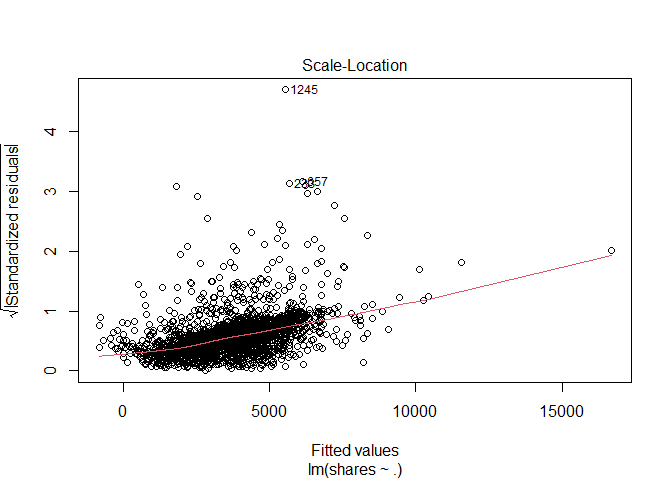<!-- -->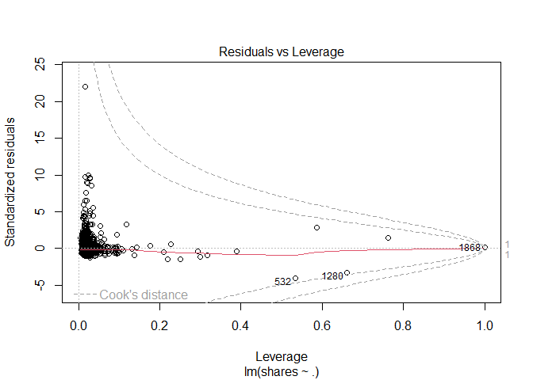<!-- -->

``` r
ggplot(data=fit_Channel, aes(y=shares, x=rate_positive_words)) + geom_point()
```

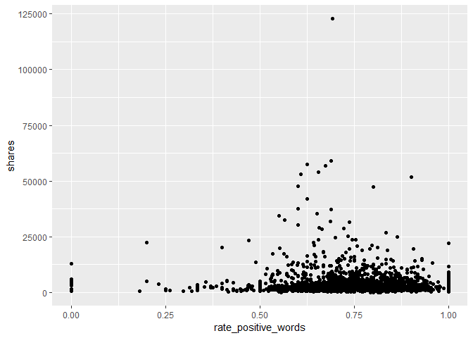<!-- -->

``` r
#EDA
#starting point... correlation - shares vs. each var
#every pairwise combo
Channel_corr <- cor(x=Channel %>% 
                          select (shares, starts_with("weekday_is_") ) )
# cor_mat <- cor(data %>% select(RentedBikeCount, Temperature, Humidity, WindSpeed,
# Hour, Visibility, DewPointTemp,
# Rainfall, Snowfall), method = "pearson")
# corrplot(cor_mat, hc.order = TRUE,
# type = "lower",
# tl.pos = "lt",
# title = "Correlation Coefficients for Bike Rental Data",
# subtitle = "Correlation Coefficients for Bike Rental Data",
# mar=c(0,0,2,0)
# )
#call Channel_corr object to look at correlation between vars and shares response var
#drop to keep in matrix and not turn into a vector
shares_corr <- Channel_corr[ ,"shares", drop=FALSE]
#shares_corr <- Channel_corr[ ,"shares"]
is(shares_corr) #matrix with the drop=TRUE option
```

    ## [1] "matrix"    "array"     "mMatrix"   "structure" "vector"

``` r
#convert to tibble
#shares_corr_tibble <- as.tibble(shares_corr)
shares_corr_tibble <- bind_cols( var_names = rownames(shares_corr), shares_corr ) 
#call shares_corr_tibble object that has correlations with shares and vars...
shares_corr_tibble
```

    ## # A tibble: 8 × 2
    ##   var_names              shares
    ##   <chr>                   <dbl>
    ## 1 shares                1      
    ## 2 weekday_is_monday     0.0284 
    ## 3 weekday_is_tuesday   -0.0113 
    ## 4 weekday_is_wednesday -0.0102 
    ## 5 weekday_is_thursday  -0.0485 
    ## 6 weekday_is_friday     0.0284 
    ## 7 weekday_is_saturday  -0.00633
    ## 8 weekday_is_sunday     0.0406

``` r
# condition on +/- 0.9 to see what we should remove as a predictor for the model
# call shares_corr_tibble object
#shares_corr_tibble #this currently does not have row names...
rownames(shares_corr)
```

    ## [1] "shares"               "weekday_is_monday"    "weekday_is_tuesday"  
    ## [4] "weekday_is_wednesday" "weekday_is_thursday"  "weekday_is_friday"   
    ## [7] "weekday_is_saturday"  "weekday_is_sunday"

``` r
#checking structure and type of object
#str(Channel_corr)
#is(Channel_corr)
#finds highly correlated variables and you can set a cutoff (default is +/ 0.9)
#convert to tibble because using drylr chaining / piping
corr_vars <- as.tibble ( Channel_corr[ ,"shares"] ) %>%
             filter ( abs(value) >= 0.9 )
#dont need this anymore...
#corr_vars <- findCorrelation(x=Can_corr, cutoff = +/- 0.9, verbose = TRUE, names = TRUE)
#call corr_vars object
#corr_vars
#columns that are highly correlated and should be removed from the model
#5 13 22
# [1] "n_non_stop_unique_tokens"  "kw_max_min" "self_reference_max_shares"
#response variable is shares, but what does that mean given certain variables available to us?
#maybe look at days of the week variables?
#figure out what kind of object we want to make to answer our question...
#tibble keeping what kind of vars, matrix?
#need to do some sort of type of EDA in order to see if variables are highly correlated
#here we need to summary statistics via summary() and plots
#this shows the summary stats for each variable in our dataset...
Lifestlye_sumstats_Train <- summary(ChannelTrain)
#calling Lifestlye_sumstats_Train object to see our summary stats
Lifestlye_sumstats_Train
```

    ##  n_tokens_title   n_tokens_content n_unique_tokens  n_non_stop_words
    ##  Min.   : 4.000   Min.   :   0.0   Min.   :0.0000   Min.   :0.0000  
    ##  1st Qu.: 8.000   1st Qu.: 252.8   1st Qu.:0.4639   1st Qu.:1.0000  
    ##  Median : 9.000   Median : 432.5   Median :0.5352   Median :1.0000  
    ##  Mean   : 9.639   Mean   : 606.3   Mean   :0.5340   Mean   :0.9939  
    ##  3rd Qu.:11.000   3rd Qu.: 755.2   3rd Qu.:0.6056   3rd Qu.:1.0000  
    ##  Max.   :18.000   Max.   :4878.0   Max.   :0.9714   Max.   :1.0000  
    ##  n_non_stop_unique_tokens   num_hrefs      num_self_hrefs      num_imgs     
    ##  Min.   :0.0000           Min.   :  0.00   Min.   : 0.000   Min.   : 0.000  
    ##  1st Qu.:0.6180           1st Qu.:  5.00   1st Qu.: 2.000   1st Qu.: 1.000  
    ##  Median :0.6827           Median :  8.00   Median : 3.000   Median : 1.000  
    ##  Mean   :0.6813           Mean   : 12.92   Mean   : 4.484   Mean   : 4.192  
    ##  3rd Qu.:0.7538           3rd Qu.: 14.00   3rd Qu.: 5.000   3rd Qu.: 3.000  
    ##  Max.   :1.0000           Max.   :171.00   Max.   :74.000   Max.   :62.000  
    ##    num_videos     average_token_length  num_keywords    data_channel_is_lifestyle
    ##  Min.   : 0.000   Min.   :0.000        Min.   : 1.000   Min.   :0                
    ##  1st Qu.: 0.000   1st Qu.:4.492        1st Qu.: 5.000   1st Qu.:0                
    ##  Median : 0.000   Median :4.657        Median : 7.000   Median :0                
    ##  Mean   : 1.144   Mean   :4.632        Mean   : 6.539   Mean   :0                
    ##  3rd Qu.: 1.000   3rd Qu.:4.812        3rd Qu.: 8.000   3rd Qu.:0                
    ##  Max.   :73.000   Max.   :5.774        Max.   :10.000   Max.   :0                
    ##  data_channel_is_entertainment data_channel_is_bus data_channel_is_socmed
    ##  Min.   :0                     Min.   :0           Min.   :1             
    ##  1st Qu.:0                     1st Qu.:0           1st Qu.:1             
    ##  Median :0                     Median :0           Median :1             
    ##  Mean   :0                     Mean   :0           Mean   :1             
    ##  3rd Qu.:0                     3rd Qu.:0           3rd Qu.:1             
    ##  Max.   :0                     Max.   :0           Max.   :1             
    ##  data_channel_is_tech data_channel_is_world   kw_min_min       kw_max_min    
    ##  Min.   :0            Min.   :0             Min.   : -1.00   Min.   :     0  
    ##  1st Qu.:0            1st Qu.:0             1st Qu.: -1.00   1st Qu.:   430  
    ##  Median :0            Median :0             Median :  4.00   Median :   676  
    ##  Mean   :0            Mean   :0             Mean   : 36.22   Mean   :  1217  
    ##  3rd Qu.:0            3rd Qu.:0             3rd Qu.:  4.00   3rd Qu.:  1200  
    ##  Max.   :0            Max.   :0             Max.   :217.00   Max.   :158900  
    ##    kw_avg_min        kw_min_max       kw_max_max       kw_avg_max       kw_min_avg  
    ##  Min.   :   -1.0   Min.   :     0   Min.   :     0   Min.   :     0   Min.   :   0  
    ##  1st Qu.:  177.0   1st Qu.:     0   1st Qu.:690400   1st Qu.:143469   1st Qu.:   0  
    ##  Median :  301.2   Median :  2000   Median :843300   Median :198104   Median :1341  
    ##  Mean   :  394.1   Mean   : 27267   Mean   :717853   Mean   :225141   Mean   :1310  
    ##  3rd Qu.:  434.0   3rd Qu.:  9825   3rd Qu.:843300   3rd Qu.:282944   3rd Qu.:2519  
    ##  Max.   :39979.0   Max.   :843300   Max.   :843300   Max.   :843300   Max.   :3607  
    ##    kw_max_avg       kw_avg_avg    self_reference_min_shares self_reference_max_shares
    ##  Min.   :     0   Min.   :    0   Min.   :     0.0          Min.   :     0           
    ##  1st Qu.:  3863   1st Qu.: 2656   1st Qu.:   741.2          1st Qu.:  1600           
    ##  Median :  4389   Median : 3169   Median :  1600.0          Median :  4200           
    ##  Mean   :  5323   Mean   : 3215   Mean   :  5475.2          Mean   : 14770           
    ##  3rd Qu.:  5455   3rd Qu.: 3619   3rd Qu.:  3400.0          3rd Qu.: 12600           
    ##  Max.   :158900   Max.   :33953   Max.   :690400.0          Max.   :690400           
    ##  self_reference_avg_sharess weekday_is_monday weekday_is_tuesday weekday_is_wednesday
    ##  Min.   :     0             Min.   :0.0000    Min.   :0.000      Min.   :0.0000      
    ##  1st Qu.:  1400             1st Qu.:0.0000    1st Qu.:0.000      1st Qu.:0.0000      
    ##  Median :  3200             Median :0.0000    Median :0.000      Median :0.0000      
    ##  Mean   :  8566             Mean   :0.1529    Mean   :0.191      Mean   :0.1849      
    ##  3rd Qu.:  7365             3rd Qu.:0.0000    3rd Qu.:0.000      3rd Qu.:0.0000      
    ##  Max.   :690400             Max.   :1.0000    Max.   :1.000      Max.   :1.0000      
    ##  weekday_is_thursday weekday_is_friday weekday_is_saturday weekday_is_sunday
    ##  Min.   :0.0000      Min.   :0.0000    Min.   :0.00000     Min.   :0.00000  
    ##  1st Qu.:0.0000      1st Qu.:0.0000    1st Qu.:0.00000     1st Qu.:0.00000  
    ##  Median :0.0000      Median :0.0000    Median :0.00000     Median :0.00000  
    ##  Mean   :0.2045      Mean   :0.1357    Mean   :0.07617     Mean   :0.05467  
    ##  3rd Qu.:0.0000      3rd Qu.:0.0000    3rd Qu.:0.00000     3rd Qu.:0.00000  
    ##  Max.   :1.0000      Max.   :1.0000    Max.   :1.00000     Max.   :1.00000  
    ##    is_weekend         LDA_00            LDA_01            LDA_02            LDA_03       
    ##  Min.   :0.0000   Min.   :0.01818   Min.   :0.01818   Min.   :0.01818   Min.   :0.01843  
    ##  1st Qu.:0.0000   1st Qu.:0.16212   1st Qu.:0.02508   1st Qu.:0.02896   1st Qu.:0.02874  
    ##  Median :0.0000   Median :0.38373   Median :0.03337   Median :0.05042   Median :0.04049  
    ##  Mean   :0.1308   Mean   :0.39829   Mean   :0.07542   Mean   :0.19315   Mean   :0.17824  
    ##  3rd Qu.:0.0000   3rd Qu.:0.62129   3rd Qu.:0.05001   3rd Qu.:0.28817   3rd Qu.:0.26108  
    ##  Max.   :1.0000   Max.   :0.92699   Max.   :0.86666   Max.   :0.91962   Max.   :0.91894  
    ##      LDA_04        global_subjectivity global_sentiment_polarity global_rate_positive_words
    ##  Min.   :0.01818   Min.   :0.0000      Min.   :-0.37500          Min.   :0.00000           
    ##  1st Qu.:0.02910   1st Qu.:0.4061      1st Qu.: 0.08816          1st Qu.:0.03487           
    ##  Median :0.05000   Median :0.4609      Median : 0.13931          Median :0.04591           
    ##  Mean   :0.15489   Mean   :0.4585      Mean   : 0.14333          Mean   :0.04669           
    ##  3rd Qu.:0.23047   3rd Qu.:0.5159      3rd Qu.: 0.19404          3rd Qu.:0.05680           
    ##  Max.   :0.91961   Max.   :0.9222      Max.   : 0.56667          Max.   :0.15549           
    ##  global_rate_negative_words rate_positive_words rate_negative_words avg_positive_polarity
    ##  Min.   :0.000000           Min.   :0.0000      Min.   :0.0000      Min.   :0.0000       
    ##  1st Qu.:0.009479           1st Qu.:0.6667      1st Qu.:0.1667      1st Qu.:0.3030       
    ##  Median :0.014540           Median :0.7500      Median :0.2500      Median :0.3558       
    ##  Mean   :0.015803           Mean   :0.7420      Mean   :0.2512      Mean   :0.3560       
    ##  3rd Qu.:0.020566           3rd Qu.:0.8333      3rd Qu.:0.3333      3rd Qu.:0.4123       
    ##  Max.   :0.139831           Max.   :1.0000      Max.   :1.0000      Max.   :0.8333       
    ##  min_positive_polarity max_positive_polarity avg_negative_polarity min_negative_polarity
    ##  Min.   :0.00000       Min.   :0.000         Min.   :-1.0000       Min.   :-1.0000      
    ##  1st Qu.:0.03333       1st Qu.:0.600         1st Qu.:-0.3175       1st Qu.:-0.8000      
    ##  Median :0.05000       Median :0.800         Median :-0.2484       Median :-0.5000      
    ##  Mean   :0.07724       Mean   :0.783         Mean   :-0.2581       Mean   :-0.5212      
    ##  3rd Qu.:0.10000       3rd Qu.:1.000         3rd Qu.:-0.1833       3rd Qu.:-0.3000      
    ##  Max.   :0.60000       Max.   :1.000         Max.   : 0.0000       Max.   : 0.0000      
    ##  max_negative_polarity title_subjectivity title_sentiment_polarity abs_title_subjectivity
    ##  Min.   :-1.0000       Min.   :0.00000    Min.   :-1.00000         Min.   :0.0000        
    ##  1st Qu.:-0.1250       1st Qu.:0.00000    1st Qu.: 0.00000         1st Qu.:0.1872        
    ##  Median :-0.1000       Median :0.06667    Median : 0.00000         Median :0.5000        
    ##  Mean   :-0.1118       Mean   :0.26393    Mean   : 0.09286         Mean   :0.3498        
    ##  3rd Qu.:-0.0500       3rd Qu.:0.46786    3rd Qu.: 0.14659         3rd Qu.:0.5000        
    ##  Max.   : 0.0000       Max.   :1.00000    Max.   : 1.00000         Max.   :0.5000        
    ##  abs_title_sentiment_polarity     shares      
    ##  Min.   :0.00000              Min.   :     8  
    ##  1st Qu.:0.00000              1st Qu.:  1400  
    ##  Median :0.01111              Median :  2100  
    ##  Mean   :0.15533              Mean   :  3793  
    ##  3rd Qu.:0.23750              3rd Qu.:  3800  
    ##  Max.   :1.00000              Max.   :122800

``` r
#check structure of objects
str(ChannelTrain)
```

    ## tibble [1,628 × 59] (S3: tbl_df/tbl/data.frame)
    ##  $ n_tokens_title               : num [1:1628] 8 8 6 10 8 12 8 11 9 11 ...
    ##  $ n_tokens_content             : num [1:1628] 257 358 358 205 701 596 263 372 912 403 ...
    ##  $ n_unique_tokens              : num [1:1628] 0.568 0.503 0.622 0.636 0.499 ...
    ##  $ n_non_stop_words             : num [1:1628] 1 1 1 1 1 ...
    ##  $ n_non_stop_unique_tokens     : num [1:1628] 0.671 0.687 0.777 0.812 0.661 ...
    ##  $ num_hrefs                    : num [1:1628] 9 4 24 3 8 28 14 3 5 4 ...
    ##  $ num_self_hrefs               : num [1:1628] 7 4 6 1 8 28 3 2 5 2 ...
    ##  $ num_imgs                     : num [1:1628] 0 1 1 1 12 9 11 1 1 0 ...
    ##  $ num_videos                   : num [1:1628] 1 0 0 0 0 0 0 0 0 1 ...
    ##  $ average_token_length         : num [1:1628] 4.64 4.25 5.39 4.37 4.69 ...
    ##  $ num_keywords                 : num [1:1628] 9 4 8 5 7 8 10 4 6 6 ...
    ##  $ data_channel_is_lifestyle    : num [1:1628] 0 0 0 0 0 0 0 0 0 0 ...
    ##  $ data_channel_is_entertainment: num [1:1628] 0 0 0 0 0 0 0 0 0 0 ...
    ##  $ data_channel_is_bus          : num [1:1628] 0 0 0 0 0 0 0 0 0 0 ...
    ##  $ data_channel_is_socmed       : num [1:1628] 1 1 1 1 1 1 1 1 1 1 ...
    ##  $ data_channel_is_tech         : num [1:1628] 0 0 0 0 0 0 0 0 0 0 ...
    ##  $ data_channel_is_world        : num [1:1628] 0 0 0 0 0 0 0 0 0 0 ...
    ##  $ kw_min_min                   : num [1:1628] 0 217 217 217 217 217 217 217 217 217 ...
    ##  $ kw_max_min                   : num [1:1628] 0 1900 737 690 2600 1700 690 690 862 862 ...
    ##  $ kw_avg_min                   : num [1:1628] 0 936 526 445 905 ...
    ##  $ kw_min_max                   : num [1:1628] 0 0 0 0 0 0 0 6400 0 0 ...
    ##  $ kw_max_max                   : num [1:1628] 0 28000 28000 37400 37400 37400 37400 37400 39400 39400 ...
    ##  $ kw_avg_max                   : num [1:1628] 0 10725 6550 11400 15771 ...
    ##  $ kw_min_avg                   : num [1:1628] 0 0 0 0 0 ...
    ##  $ kw_max_avg                   : num [1:1628] 0 3800 3784 3596 4156 ...
    ##  $ kw_avg_avg                   : num [1:1628] 0 2210 1398 1455 2621 ...
    ##  $ self_reference_min_shares    : num [1:1628] 1300 4500 1600 0 3300 1300 1200 1100 4100 8900 ...
    ##  $ self_reference_max_shares    : num [1:1628] 2500 15300 1600 0 5200 18200 3400 1100 8900 8900 ...
    ##  $ self_reference_avg_sharess   : num [1:1628] 1775 10400 1600 0 4350 ...
    ##  $ weekday_is_monday            : num [1:1628] 1 0 0 1 1 1 1 1 0 0 ...
    ##  $ weekday_is_tuesday           : num [1:1628] 0 0 0 0 0 0 0 0 1 1 ...
    ##  $ weekday_is_wednesday         : num [1:1628] 0 0 0 0 0 0 0 0 0 0 ...
    ##  $ weekday_is_thursday          : num [1:1628] 0 0 0 0 0 0 0 0 0 0 ...
    ##  $ weekday_is_friday            : num [1:1628] 0 1 1 0 0 0 0 0 0 0 ...
    ##  $ weekday_is_saturday          : num [1:1628] 0 0 0 0 0 0 0 0 0 0 ...
    ##  $ weekday_is_sunday            : num [1:1628] 0 0 0 0 0 0 0 0 0 0 ...
    ##  $ is_weekend                   : num [1:1628] 0 0 0 0 0 0 0 0 0 0 ...
    ##  $ LDA_00                       : num [1:1628] 0.439 0.8 0.189 0.628 0.16 ...
    ##  $ LDA_01                       : num [1:1628] 0.0225 0.05 0.025 0.0401 0.0286 ...
    ##  $ LDA_02                       : num [1:1628] 0.0224 0.0502 0.3192 0.2498 0.0288 ...
    ##  $ LDA_03                       : num [1:1628] 0.0233 0.0501 0.0254 0.0401 0.5892 ...
    ##  $ LDA_04                       : num [1:1628] 0.4926 0.05 0.441 0.0419 0.1938 ...
    ##  $ global_subjectivity          : num [1:1628] 0.4 0.504 0.493 0.385 0.497 ...
    ##  $ global_sentiment_polarity    : num [1:1628] 0.00741 0.06507 0.18971 0.22114 0.18359 ...
    ##  $ global_rate_positive_words   : num [1:1628] 0.0311 0.0391 0.0559 0.0244 0.0585 ...
    ##  $ global_rate_negative_words   : num [1:1628] 0.02724 0.01955 0.02514 0.00488 0.01141 ...
    ##  $ rate_positive_words          : num [1:1628] 0.533 0.667 0.69 0.833 0.837 ...
    ##  $ rate_negative_words          : num [1:1628] 0.467 0.333 0.31 0.167 0.163 ...
    ##  $ avg_positive_polarity        : num [1:1628] 0.36 0.248 0.414 0.467 0.375 ...
    ##  $ min_positive_polarity        : num [1:1628] 0.0333 0.0333 0.1 0.1364 0.0333 ...
    ##  $ max_positive_polarity        : num [1:1628] 0.6 0.55 0.8 0.8 1 1 1 0.7 1 0.5 ...
    ##  $ avg_negative_polarity        : num [1:1628] -0.393 -0.207 -0.257 -0.125 -0.264 ...
    ##  $ min_negative_polarity        : num [1:1628] -0.5 -0.7 -0.5 -0.125 -0.5 -1 -1 -0.3 -1 -0.65 ...
    ##  $ max_negative_polarity        : num [1:1628] -0.125 -0.125 -0.05 -0.125 -0.0714 ...
    ##  $ title_subjectivity           : num [1:1628] 0.667 0 0.333 0 0 ...
    ##  $ title_sentiment_polarity     : num [1:1628] -0.5 0 0.25 0 0 ...
    ##  $ abs_title_subjectivity       : num [1:1628] 0.167 0.5 0.167 0.5 0.5 ...
    ##  $ abs_title_sentiment_polarity : num [1:1628] 0.5 0 0.25 0 0 ...
    ##  $ shares                       : num [1:1628] 2600 18200 1600 992 4900 1400 1100 1200 5400 3800 ...

``` r
str(Lifestlye_sumstats_Train)
```

    ##  'table' chr [1:6, 1:59] "Min.   : 4.000  " "1st Qu.: 8.000  " "Median : 9.000  " ...
    ##  - attr(*, "dimnames")=List of 2
    ##   ..$ : chr [1:6] "" "" "" "" ...
    ##   ..$ : chr [1:59] "n_tokens_title" "n_tokens_content" "n_unique_tokens" "n_non_stop_words" ...

``` r
#plots include - scatter plots, correlation plots -- plots for continuous data...
#do we need bar plots?
#A scatter plot with the number of shares on the y-axis and the positive word rate on the x-axis is created below
ggplot(data=ChannelTrain, aes(y=shares, x=rate_positive_words)) + geom_point()
```

<!-- -->
<!-- You’ll be automating the creation of documents using R Markdown (one for each data_channel_is_* setting, i.e. type of article in the data set provided). Each document should be rendered as a github_document from a single .Rmd file. In the README.md file you should create links to each of the documents you will create (Lifestyle analysis, Entertainment analysis, etc.). Links can be made to the sub-documents using relative -->
<!-- paths. For instance, if you have all of the outputted .md files in the main directory you would just use markdown linking: -->

<!-- - The analysis for [Lifestyle articles is available here](LifestyleAnalysis.html). Note we -->
<!-- link to the html file even though the file we create is a .md file - github creates the .html for us. -->
<!-- In the repo’s README.md file (which doesn’t need to be created from a .Rmd file, just use the one you initialize into the repo if you want) give a brief description of the purpose of the repo, a list of R packages used, links to the generated analyses, and the code used to create the analyses from a single .Rmd file (i.e. the render() code). -->

# Modelling

The data is already split into 70% training and 30% test. Our main goal
is to predict the number of shares. This will be our response variable.
We will create four models each using 5-fold cross-validation.

Two models (first linear and random forest) will be multiple linear
regression models, one will be a random forest model and the final model
will be a boosted tree model.

A Linear regression model is a supervised learning technique that is
used to predict the value of a variable based on the value of other
variable(s). The variable you want to predict is called the dependent
variable or the response. The variable(s) you are using to predict is
called the independent variable(s) or the predictor(s).

## First linear model.

We model the number of shares by the selected independent variables

-   “n_tokens_title” (Number of words in the title),

-   “n_tokens_content” (Number of words in the content)

-   “num_imgs” (Number of images)

-   “num_videos” (Number of videos)

-   “is_weekend” (Was the article published on the weekend?)

``` r
#linear regression model 1
l_m1 <- train(shares ~ n_tokens_title +  n_tokens_content + num_imgs + num_videos + 
                       is_weekend, 
              data = ChannelTrain, 
              method = "lm", 
              preProcess = c("center", "scale"),
              trControl = trainControl(method= "cv", number = 5))
#l_m1
#predicting on the ChannelTest data with linear regression model 1
test_pred_l_m1 <- predict(l_m1, newdata = ChannelTest)
#finding the best model - more explicit
m1 <- postResample(test_pred_l_m1, ChannelTest$shares)
m1
```

    ##         RMSE     Rsquared          MAE 
    ## 3.489128e+03 1.102404e-03 2.381287e+03

## Second linear model

We model the number of shares by the selected independent variables

-   “num_hrefs” (Number of links)

-   “weekday_is_monday” (Was the article published on a Monday?)

-   “weekday_is_tuesday” (Was the article published on a Tuesday?)

-   “weekday_is_wednesday” {Was the article published on a Wednesday?)

-   “weekday_is_thursday” (Was the article published on a Thursday?)

-   “weekday_is_friday” (Was the article published on a Friday?)

-   “self_reference_avg_sharess” (Avg. shares of referenced articles in
    Mashable)

``` r
#linear regression model 2
l_m2 <- train(shares ~ num_hrefs + weekday_is_monday + weekday_is_tuesday +
                       weekday_is_wednesday + weekday_is_thursday + weekday_is_friday +
                       self_reference_avg_sharess,
              data = ChannelTrain, 
              method = "lm", 
              preProcess = c("center", "scale"),
              trControl = trainControl(method= "cv", number = 5))
#predictions based on linear model 2 for the ChannelTest data
test_pred_l_m2 <- predict(l_m2, newdata = ChannelTest)
#best model chosen - RMSE reported explicity
#goal is to compare RMSE and see which one is the lowest!
m2 <- postResample(test_pred_l_m2, ChannelTest$shares)
m2
```

    ##         RMSE     Rsquared          MAE 
    ## 3.467027e+03 1.123714e-02 2.363882e+03

## Random forest model

The idea behind the random forest model is the same as bagging but we
use a random subset of predictors for each bootstrap sample tree fit
(indicated by “mtry”). More specifically, it involves creating a
boothstrap sample (same size with replacement), training the tree on
this sample (no pruning necessary), repeating the process a large number
of times and the final prediction is the average of those predictions.
Finding the average of predictions decreases variance which improves
predictions but unfortunately we lose interpretability.

For our random forest We model the number of shares by the selected
independent variables

-   “n_tokens_title” (Number of words in the title),

-   “n_tokens_content” (Number of words in the content)

-   “num_imgs” (Number of images)

-   “num_videos” (Number of videos)

-   “is_weekend” (Was the article published on the weekend?)

``` r
r_f <- train(shares ~ n_tokens_title +  n_tokens_content + num_imgs + num_videos + 
                      is_weekend , data = ChannelTrain, method = "rf",
  
             trControl=trainControl(method = "cv", number = 5),
             preProcess = c("center", "scale"),
             tuneGrid = data.frame(mtry = 1:3))
test_pred_r_f <- predict(r_f, newdata = ChannelTest)
m3 <- postResample(test_pred_r_f, ChannelTest$shares)
m3
```

    ##         RMSE     Rsquared          MAE 
    ## 3.464870e+03 1.415801e-02 2.327054e+03

``` r
#bootstrapping will take some time...
```

## Boosted tree model

The idea behind the boosting tree model is to train our tree slowly in a
sequential manner so each tree that is created will be based on the
previous one with predictions updated.

For our boosting tree we model the number of shares by the selected
independent variables

-   “num_hrefs” (Number of links)

-   “weekday_is_monday” (Was the article published on a Monday?)

-   “weekday_is_tuesday” (Was the article published on a Tuesday?)

-   “weekday_is_wednesday” {Was the article published on a Wednesday?)

-   “weekday_is_thursday” (Was the article published on a Thursday?)

-   “weekday_is_friday” (Was the article published on a Friday?)

-   “self_reference_avg_sharess” (Avg. shares of referenced articles in
    Mashable)

Additionally we choose to use all combinations of the tuning parameters
n.trees = c(25, 50, 100, 150, 200), interaction.depth = 1:4, shrinkage =
0.1 and n.minobsinnode = 10.

``` r
tune1<- c(25, 50, 100, 150, 200)
tune2<- 1:4
tune3<- 0.1
tune4<- 10
boosted <- train(shares ~ num_hrefs + weekday_is_monday + weekday_is_tuesday + weekday_is_wednesday + weekday_is_thursday + weekday_is_friday + self_reference_avg_sharess, 
data = ChannelTrain, method = "gbm",
 trControl=trainControl(method = "cv", number = 5),
 preProcess = c("center", "scale"),
 tuneGrid = expand.grid(n.trees = tune1, interaction.depth = tune2, shrinkage = tune3,    n.minobsinnode = tune4))
```

    ## Iter   TrainDeviance   ValidDeviance   StepSize   Improve
    ##      1 41294007.8272             nan     0.1000 223634.8503
    ##      2 41097753.7581             nan     0.1000 106812.7568
    ##      3 40988780.5060             nan     0.1000 73961.0075
    ##      4 40897915.1992             nan     0.1000 37792.2151
    ##      5 40748144.5306             nan     0.1000 112951.9242
    ##      6 40612076.0423             nan     0.1000 68782.1481
    ##      7 40577814.5262             nan     0.1000 -11150.9860
    ##      8 40466254.9698             nan     0.1000 -43559.3972
    ##      9 40381441.4744             nan     0.1000 -6727.8447
    ##     10 40342953.1933             nan     0.1000 -26868.4290
    ##     20 40015458.1387             nan     0.1000 5726.0914
    ##     40 39653386.8944             nan     0.1000 -33421.2098
    ##     60 39291459.0963             nan     0.1000 -14790.7566
    ##     80 39034359.2202             nan     0.1000 -43878.5000
    ##    100 38884268.3242             nan     0.1000 -130216.7640
    ##    120 38653529.5450             nan     0.1000 -92106.6310
    ##    140 38554171.6741             nan     0.1000 -111334.0249
    ##    160 38432878.2183             nan     0.1000 -42776.6095
    ##    180 38258399.5680             nan     0.1000 -38085.7093
    ##    200 38129074.9321             nan     0.1000 -33732.7690
    ## 
    ## Iter   TrainDeviance   ValidDeviance   StepSize   Improve
    ##      1 41522350.8086             nan     0.1000 102809.6307
    ##      2 41198296.9790             nan     0.1000 206635.5634
    ##      3 40886958.1435             nan     0.1000 108062.7421
    ##      4 40764580.4671             nan     0.1000 -15493.6991
    ##      5 40627453.4229             nan     0.1000 5162.6493
    ##      6 40478071.1371             nan     0.1000 -25813.7471
    ##      7 40297679.8039             nan     0.1000 -38784.0901
    ##      8 40238394.8835             nan     0.1000 -1017.2251
    ##      9 40158947.3730             nan     0.1000 20576.0273
    ##     10 39995465.4825             nan     0.1000 82479.4011
    ##     20 39251261.5573             nan     0.1000 28153.1252
    ##     40 38347140.0432             nan     0.1000 -28295.0527
    ##     60 37561033.4042             nan     0.1000 -103499.3155
    ##     80 37141375.8623             nan     0.1000 -94225.2690
    ##    100 36669819.8348             nan     0.1000 -91353.1264
    ##    120 36130667.5357             nan     0.1000 -14034.2284
    ##    140 35804169.8843             nan     0.1000 -98296.6849
    ##    160 35410005.5472             nan     0.1000 -22979.7989
    ##    180 35117047.8282             nan     0.1000 -82521.0448
    ##    200 34838307.1724             nan     0.1000 -36562.1933
    ## 
    ## Iter   TrainDeviance   ValidDeviance   StepSize   Improve
    ##      1 41404106.1064             nan     0.1000 218191.2064
    ##      2 41023181.4359             nan     0.1000 257619.7729
    ##      3 40665545.5158             nan     0.1000 58819.4079
    ##      4 40457823.3583             nan     0.1000 111918.6266
    ##      5 40265266.1366             nan     0.1000 68842.1665
    ##      6 40029575.3803             nan     0.1000 39203.8426
    ##      7 39899327.7864             nan     0.1000 80817.4652
    ##      8 39827234.6544             nan     0.1000 -20840.9965
    ##      9 39677432.1499             nan     0.1000 -27116.4147
    ##     10 39539994.0347             nan     0.1000 1346.1428
    ##     20 38256833.6501             nan     0.1000 -136946.9566
    ##     40 36895460.7179             nan     0.1000 -43167.9590
    ##     60 36065183.2426             nan     0.1000 -198200.4403
    ##     80 35331814.1452             nan     0.1000 -149143.2025
    ##    100 34991409.8527             nan     0.1000 -148809.8521
    ##    120 34622569.3183             nan     0.1000 -115267.4801
    ##    140 34023248.9768             nan     0.1000 -151402.5295
    ##    160 33569665.4545             nan     0.1000 -249631.1957
    ##    180 33258771.5797             nan     0.1000 -111484.3073
    ##    200 32977992.5053             nan     0.1000 -123072.8706
    ## 
    ## Iter   TrainDeviance   ValidDeviance   StepSize   Improve
    ##      1 41350467.5822             nan     0.1000 92281.1065
    ##      2 40831510.7014             nan     0.1000 70569.3764
    ##      3 40503182.0912             nan     0.1000 141513.5576
    ##      4 40162180.9801             nan     0.1000 34234.9637
    ##      5 40057924.8250             nan     0.1000 -28279.5231
    ##      6 39895585.3865             nan     0.1000 89823.1406
    ##      7 39667103.9406             nan     0.1000 64111.9883
    ##      8 39552146.7001             nan     0.1000 -64864.9058
    ##      9 39393075.9600             nan     0.1000 -249546.5792
    ##     10 39207528.1602             nan     0.1000 -11886.9722
    ##     20 37890725.4412             nan     0.1000 -208645.3258
    ##     40 36439618.2663             nan     0.1000 -289851.5048
    ##     60 35431090.3206             nan     0.1000 -142888.3689
    ##     80 34608497.7125             nan     0.1000 -88435.3076
    ##    100 34027635.8678             nan     0.1000 -205953.2628
    ##    120 33411351.5306             nan     0.1000 -97123.6511
    ##    140 32680307.8419             nan     0.1000 -200945.5218
    ##    160 32146554.0084             nan     0.1000 -124617.3825
    ##    180 31738927.0325             nan     0.1000 -110982.0428
    ##    200 31270373.5167             nan     0.1000 -97673.2402
    ## 
    ## Iter   TrainDeviance   ValidDeviance   StepSize   Improve
    ##      1 39509608.5937             nan     0.1000 165432.3314
    ##      2 39385528.9626             nan     0.1000 128039.5220
    ##      3 39261233.5427             nan     0.1000 65696.3954
    ##      4 39090627.9517             nan     0.1000 -34383.1503
    ##      5 39013448.4616             nan     0.1000 72903.0955
    ##      6 38978257.9315             nan     0.1000 21917.2546
    ##      7 38922363.8993             nan     0.1000 11071.3735
    ##      8 38851907.9749             nan     0.1000 45083.3619
    ##      9 38772642.0858             nan     0.1000 -3116.3072
    ##     10 38751331.2168             nan     0.1000 -44139.6458
    ##     20 38470936.2041             nan     0.1000 -28515.2806
    ##     40 38238519.3400             nan     0.1000 -38481.9419
    ##     60 38115831.4909             nan     0.1000 -27687.2205
    ##     80 37917184.2630             nan     0.1000 -26783.6492
    ##    100 37785632.0624             nan     0.1000 -12085.2970
    ##    120 37690625.2361             nan     0.1000 -15262.2908
    ##    140 37607235.3486             nan     0.1000 -43663.0803
    ##    160 37493291.8759             nan     0.1000 -34328.5610
    ##    180 37392621.4879             nan     0.1000 -19762.8991
    ##    200 37292190.0408             nan     0.1000 -30835.1852
    ## 
    ## Iter   TrainDeviance   ValidDeviance   StepSize   Improve
    ##      1 39565541.0542             nan     0.1000 170597.4984
    ##      2 39394059.6464             nan     0.1000 120792.7135
    ##      3 39093676.7181             nan     0.1000 76452.8351
    ##      4 38828354.1970             nan     0.1000 -42873.0988
    ##      5 38756067.9344             nan     0.1000 -20091.5497
    ##      6 38620568.7175             nan     0.1000 31958.8977
    ##      7 38499585.0701             nan     0.1000 92061.0588
    ##      8 38438806.7700             nan     0.1000 -21210.6084
    ##      9 38362436.3040             nan     0.1000 -13095.6940
    ##     10 38307289.7597             nan     0.1000 1416.9584
    ##     20 37805815.4742             nan     0.1000 -131292.6696
    ##     40 36950412.0031             nan     0.1000 -13512.5112
    ##     60 36340164.2982             nan     0.1000 -71206.3272
    ##     80 35832202.9175             nan     0.1000 -47150.6747
    ##    100 35553868.1488             nan     0.1000 -87537.0455
    ##    120 35202575.4925             nan     0.1000 -36871.3261
    ##    140 34980010.7893             nan     0.1000 -63605.8046
    ##    160 34710415.5340             nan     0.1000 -44352.6666
    ##    180 34508738.6740             nan     0.1000 -83354.9115
    ##    200 34265284.8465             nan     0.1000 -85547.6842
    ## 
    ## Iter   TrainDeviance   ValidDeviance   StepSize   Improve
    ##      1 39320684.5841             nan     0.1000 37310.2173
    ##      2 39077562.0909             nan     0.1000 27621.6548
    ##      3 38910989.2814             nan     0.1000 8294.1381
    ##      4 38622531.6160             nan     0.1000 -77915.7424
    ##      5 38440604.3336             nan     0.1000 -96139.0497
    ##      6 38219474.5639             nan     0.1000 33981.9160
    ##      7 38117080.0440             nan     0.1000 -27045.0080
    ##      8 37868062.3249             nan     0.1000 -55855.1183
    ##      9 37740920.8335             nan     0.1000 -116999.5631
    ##     10 37623025.7425             nan     0.1000 -39707.1865
    ##     20 36778605.1971             nan     0.1000 -67271.0390
    ##     40 35505930.6335             nan     0.1000 -68803.5996
    ##     60 34833345.8224             nan     0.1000 -51105.7580
    ##     80 34193784.1683             nan     0.1000 -97712.5740
    ##    100 33855721.2021             nan     0.1000 -169674.1263
    ##    120 33456451.0234             nan     0.1000 -91451.0570
    ##    140 33034585.4309             nan     0.1000 -139430.4772
    ##    160 32833797.7237             nan     0.1000 -33447.7069
    ##    180 32449164.8127             nan     0.1000 -74869.6300
    ##    200 32143898.9149             nan     0.1000 -59722.7903
    ## 
    ## Iter   TrainDeviance   ValidDeviance   StepSize   Improve
    ##      1 39491495.6331             nan     0.1000 195979.8942
    ##      2 39146979.4720             nan     0.1000 241824.7940
    ##      3 38958166.1664             nan     0.1000 38885.9550
    ##      4 38671473.7976             nan     0.1000 103175.9076
    ##      5 38562486.2952             nan     0.1000 -42309.1722
    ##      6 38330124.4893             nan     0.1000 -45686.7110
    ##      7 38031696.3164             nan     0.1000 -638.3677
    ##      8 37882205.9591             nan     0.1000 -83358.3603
    ##      9 37808849.0889             nan     0.1000 -171362.5334
    ##     10 37665208.0229             nan     0.1000 36878.9317
    ##     20 36510253.7326             nan     0.1000 -70964.3314
    ##     40 35355925.3751             nan     0.1000 -156223.8681
    ##     60 34322038.2887             nan     0.1000 -135161.8206
    ##     80 33528271.3766             nan     0.1000 -61375.4362
    ##    100 32771349.4771             nan     0.1000 -82264.1408
    ##    120 32347805.3827             nan     0.1000 -308674.9403
    ##    140 31773659.0617             nan     0.1000 -75337.9297
    ##    160 31428882.7098             nan     0.1000 -235771.8842
    ##    180 31181977.0161             nan     0.1000 -103237.8838
    ##    200 30661093.0810             nan     0.1000 -141227.7897
    ## 
    ## Iter   TrainDeviance   ValidDeviance   StepSize   Improve
    ##      1 41208670.4672             nan     0.1000 244058.9530
    ##      2 41045006.8581             nan     0.1000 181266.5006
    ##      3 40780901.7663             nan     0.1000 42265.5108
    ##      4 40643911.9623             nan     0.1000 118208.1214
    ##      5 40528300.8514             nan     0.1000 72474.1328
    ##      6 40411369.6621             nan     0.1000 111790.4745
    ##      7 40374109.8780             nan     0.1000 -99664.4653
    ##      8 40223373.0198             nan     0.1000 -59353.7696
    ##      9 40136938.8755             nan     0.1000 36890.4669
    ##     10 40069646.7880             nan     0.1000 -19591.3986
    ##     20 39762454.0627             nan     0.1000 -14927.8188
    ##     40 39420911.5642             nan     0.1000 -18643.1305
    ##     60 39209420.4824             nan     0.1000 -21777.7913
    ##     80 39076309.1318             nan     0.1000 -46304.7744
    ##    100 38925976.5281             nan     0.1000 -71371.7267
    ##    120 38798398.7501             nan     0.1000 -49160.9476
    ##    140 38673612.9407             nan     0.1000 -50164.3276
    ##    160 38532536.1628             nan     0.1000 -42019.2924
    ##    180 38433035.4559             nan     0.1000 -43641.8473
    ##    200 38346384.0712             nan     0.1000 -48233.5384
    ## 
    ## Iter   TrainDeviance   ValidDeviance   StepSize   Improve
    ##      1 41073067.2875             nan     0.1000 -8447.5402
    ##      2 40837235.7191             nan     0.1000 87383.2926
    ##      3 40664340.9734             nan     0.1000 38762.9487
    ##      4 40428660.9643             nan     0.1000 -25257.0882
    ##      5 40226893.5661             nan     0.1000 111228.5679
    ##      6 40115299.2165             nan     0.1000 56157.5887
    ##      7 40027702.2635             nan     0.1000 11435.2287
    ##      8 39919089.7247             nan     0.1000 36340.7333
    ##      9 39760200.6105             nan     0.1000 104665.0952
    ##     10 39687783.0659             nan     0.1000 -24706.1730
    ##     20 38965700.9176             nan     0.1000 -157174.1154
    ##     40 38103891.5114             nan     0.1000 -13950.8891
    ##     60 37299480.6908             nan     0.1000 -39287.6455
    ##     80 36792925.9268             nan     0.1000 -57920.0128
    ##    100 36338138.1996             nan     0.1000 -161418.3874
    ##    120 35984172.6825             nan     0.1000 -113733.3426
    ##    140 35742517.7873             nan     0.1000 -63978.6635
    ##    160 35403010.1240             nan     0.1000 1177.5526
    ##    180 35160661.3653             nan     0.1000 -54384.4947
    ##    200 34891119.7711             nan     0.1000 -21005.0812
    ## 
    ## Iter   TrainDeviance   ValidDeviance   StepSize   Improve
    ##      1 41169275.7533             nan     0.1000 197817.9778
    ##      2 40857102.7380             nan     0.1000 193046.1384
    ##      3 40606958.1264             nan     0.1000 2301.8237
    ##      4 40389779.1664             nan     0.1000 57667.3726
    ##      5 40128024.7603             nan     0.1000 9219.2316
    ##      6 39836660.5487             nan     0.1000 -18622.9962
    ##      7 39725300.7908             nan     0.1000 -9406.7268
    ##      8 39594431.4940             nan     0.1000 -49635.9294
    ##      9 39437041.4472             nan     0.1000 14129.5383
    ##     10 39374412.0854             nan     0.1000 -105224.4124
    ##     20 38666598.2197             nan     0.1000 -49028.0646
    ##     40 37430040.2867             nan     0.1000 -125425.6998
    ##     60 36514020.8346             nan     0.1000 -14575.2676
    ##     80 35537048.5109             nan     0.1000 -144943.6968
    ##    100 34800696.3250             nan     0.1000 -45824.0183
    ##    120 34392692.5991             nan     0.1000 -50332.8819
    ##    140 33999575.9333             nan     0.1000 -91378.4431
    ##    160 33521765.5208             nan     0.1000 -312503.5301
    ##    180 33069171.9510             nan     0.1000 -78922.6259
    ##    200 32602631.8026             nan     0.1000 -151687.1881
    ## 
    ## Iter   TrainDeviance   ValidDeviance   StepSize   Improve
    ##      1 41076059.3196             nan     0.1000 318067.6765
    ##      2 40703665.8102             nan     0.1000 64878.9683
    ##      3 40437883.8123             nan     0.1000 193224.6970
    ##      4 40240633.7333             nan     0.1000 47663.6425
    ##      5 40025167.7733             nan     0.1000 14409.7848
    ##      6 39774736.5354             nan     0.1000 -114560.3569
    ##      7 39611489.8674             nan     0.1000 68714.5468
    ##      8 39451844.3910             nan     0.1000 104542.2324
    ##      9 39287319.3178             nan     0.1000 11652.0136
    ##     10 39115430.2077             nan     0.1000 -122938.3171
    ##     20 37759745.2241             nan     0.1000 -108473.9388
    ##     40 35891489.7667             nan     0.1000 -60775.8574
    ##     60 35030644.4263             nan     0.1000 -62464.9195
    ##     80 34434957.8571             nan     0.1000 -163749.4036
    ##    100 33758550.4086             nan     0.1000 -189027.9017
    ##    120 33079716.0292             nan     0.1000 -351337.4176
    ##    140 32461375.3135             nan     0.1000 -156400.0643
    ##    160 31969487.8265             nan     0.1000 -118786.4353
    ##    180 31592075.6397             nan     0.1000 -38434.6813
    ##    200 31134068.4463             nan     0.1000 -111140.1387
    ## 
    ## Iter   TrainDeviance   ValidDeviance   StepSize   Improve
    ##      1 43127072.8872             nan     0.1000 259117.0218
    ##      2 42943913.3542             nan     0.1000 192684.8991
    ##      3 42747531.3141             nan     0.1000 181530.1972
    ##      4 42632434.4577             nan     0.1000 144001.0652
    ##      5 42531499.6160             nan     0.1000 40567.4950
    ##      6 42453974.4119             nan     0.1000 89768.6819
    ##      7 42296915.7483             nan     0.1000 91880.9623
    ##      8 42177404.0785             nan     0.1000 28108.4328
    ##      9 42097125.3368             nan     0.1000 49572.9116
    ##     10 42022191.3899             nan     0.1000 50915.7331
    ##     20 41647915.6942             nan     0.1000 -32306.9312
    ##     40 41414956.5493             nan     0.1000 -37049.9410
    ##     60 41097237.4798             nan     0.1000 -48399.1171
    ##     80 40858293.9970             nan     0.1000 -39676.8342
    ##    100 40610267.9219             nan     0.1000 -82973.5116
    ##    120 40443101.7047             nan     0.1000 -21625.8278
    ##    140 40307231.0656             nan     0.1000 -38118.6641
    ##    160 40168828.1689             nan     0.1000 -25276.1583
    ##    180 40022873.8502             nan     0.1000 -79023.0119
    ##    200 39889911.1199             nan     0.1000 -22898.5021
    ## 
    ## Iter   TrainDeviance   ValidDeviance   StepSize   Improve
    ##      1 43263226.1583             nan     0.1000 213232.9574
    ##      2 42933584.8757             nan     0.1000 103404.2118
    ##      3 42596442.7009             nan     0.1000 283439.1498
    ##      4 42344143.4604             nan     0.1000 210516.9042
    ##      5 42128287.3255             nan     0.1000 181980.3874
    ##      6 41935723.9927             nan     0.1000 -2951.4434
    ##      7 41749515.1938             nan     0.1000 90000.7061
    ##      8 41655070.7442             nan     0.1000 7697.4771
    ##      9 41491177.8315             nan     0.1000 87533.0033
    ##     10 41333292.2744             nan     0.1000 -70188.2756
    ##     20 40655187.5382             nan     0.1000 -156431.6747
    ##     40 39809318.3055             nan     0.1000 -121132.6881
    ##     60 39174655.4995             nan     0.1000 -78472.4054
    ##     80 38723319.0199             nan     0.1000 -112464.9142
    ##    100 38248893.3166             nan     0.1000 -68275.5958
    ##    120 37798246.0850             nan     0.1000 -76215.4584
    ##    140 37354129.0060             nan     0.1000 -121593.3186
    ##    160 36935310.0464             nan     0.1000 -88308.7772
    ##    180 36665348.6247             nan     0.1000 -67642.2923
    ##    200 36375605.2564             nan     0.1000 -132142.2758
    ## 
    ## Iter   TrainDeviance   ValidDeviance   StepSize   Improve
    ##      1 43110600.7851             nan     0.1000 365415.0884
    ##      2 42709137.5447             nan     0.1000 39227.7241
    ##      3 42247234.2098             nan     0.1000 64865.8981
    ##      4 41975572.2442             nan     0.1000 -87971.1112
    ##      5 41858224.7105             nan     0.1000 35042.8228
    ##      6 41783495.6491             nan     0.1000 30697.4882
    ##      7 41521449.6767             nan     0.1000 -202839.6091
    ##      8 41341306.3069             nan     0.1000 62654.2034
    ##      9 41198625.5528             nan     0.1000 -2321.1419
    ##     10 41049623.0982             nan     0.1000 -8205.9690
    ##     20 39853252.6738             nan     0.1000 -193510.5429
    ##     40 38661571.0094             nan     0.1000 -71501.9018
    ##     60 37565749.5616             nan     0.1000 -46781.2088
    ##     80 36917555.1240             nan     0.1000 -106840.7623
    ##    100 36312511.2511             nan     0.1000 -63410.4517
    ##    120 35711898.3639             nan     0.1000 -56239.2542
    ##    140 35277043.8533             nan     0.1000 -68120.2275
    ##    160 34900564.9570             nan     0.1000 -76458.5953
    ##    180 34360822.3677             nan     0.1000 -47799.1027
    ##    200 33962036.7201             nan     0.1000 -44063.9905
    ## 
    ## Iter   TrainDeviance   ValidDeviance   StepSize   Improve
    ##      1 42909893.3709             nan     0.1000 279932.2830
    ##      2 42475202.9862             nan     0.1000 76600.5116
    ##      3 42019239.2994             nan     0.1000 28296.3000
    ##      4 41746310.0176             nan     0.1000 26266.9032
    ##      5 41386859.4581             nan     0.1000 -47152.0535
    ##      6 41089823.8379             nan     0.1000 -66726.9094
    ##      7 40895497.1381             nan     0.1000 -156120.2885
    ##      8 40742173.5266             nan     0.1000 -2981.7881
    ##      9 40579739.9691             nan     0.1000 -138101.0406
    ##     10 40448485.8309             nan     0.1000 14795.8247
    ##     20 39431161.7615             nan     0.1000 -31125.6760
    ##     40 38250409.9765             nan     0.1000 -44921.3740
    ##     60 36822362.2199             nan     0.1000 -225076.6081
    ##     80 35848830.4007             nan     0.1000 -187206.8971
    ##    100 35005219.6347             nan     0.1000 -129008.2645
    ##    120 34275048.7046             nan     0.1000 -114740.1927
    ##    140 33563375.4925             nan     0.1000 -57334.0929
    ##    160 32937674.2798             nan     0.1000 -154318.8431
    ##    180 32433896.8090             nan     0.1000 1961.4268
    ##    200 31929947.6967             nan     0.1000 -119264.2313
    ## 
    ## Iter   TrainDeviance   ValidDeviance   StepSize   Improve
    ##      1 25603355.2720             nan     0.1000 245275.9117
    ##      2 25428334.4603             nan     0.1000 11312.1881
    ##      3 25194117.8390             nan     0.1000 199991.3460
    ##      4 25022109.3907             nan     0.1000 107438.1331
    ##      5 24800618.7488             nan     0.1000 -2815.8204
    ##      6 24679089.7794             nan     0.1000 2641.9544
    ##      7 24570672.5467             nan     0.1000 52303.4539
    ##      8 24549376.4093             nan     0.1000 -5047.1246
    ##      9 24499149.4862             nan     0.1000 48572.3102
    ##     10 24427859.9392             nan     0.1000 56653.6118
    ##     20 24183514.4483             nan     0.1000 -66258.7441
    ##     40 23773186.1272             nan     0.1000 -48974.1104
    ##     60 23531750.6662             nan     0.1000 -20462.1133
    ##     80 23295079.3609             nan     0.1000 -78099.2325
    ##    100 23170828.8990             nan     0.1000 -22258.0574
    ##    120 23055079.4894             nan     0.1000 -33847.6972
    ##    140 22912964.1937             nan     0.1000 -35691.6519
    ##    160 22695301.7031             nan     0.1000 -53448.0606
    ##    180 22569588.7208             nan     0.1000 -19185.8618
    ##    200 22501298.5552             nan     0.1000 -45267.1503
    ## 
    ## Iter   TrainDeviance   ValidDeviance   StepSize   Improve
    ##      1 25599207.6611             nan     0.1000 179774.7912
    ##      2 25155679.1272             nan     0.1000 118251.1608
    ##      3 24957127.2316             nan     0.1000 137193.6505
    ##      4 24694069.0587             nan     0.1000 143473.2929
    ##      5 24518317.7597             nan     0.1000 71972.3473
    ##      6 24450487.5330             nan     0.1000 16960.6354
    ##      7 24353273.3196             nan     0.1000 81632.2767
    ##      8 24107330.7960             nan     0.1000 -49340.2853
    ##      9 24001168.2839             nan     0.1000 73256.9553
    ##     10 23952672.7991             nan     0.1000 -14708.9040
    ##     20 23218976.2914             nan     0.1000 -51390.4191
    ##     40 22613888.6132             nan     0.1000 -52470.5858
    ##     60 22014748.4614             nan     0.1000 -107321.2329
    ##     80 21624996.6250             nan     0.1000 -83349.5018
    ##    100 21278347.5596             nan     0.1000 -83592.4055
    ##    120 20924493.4369             nan     0.1000 -73814.3393
    ##    140 20639038.9543             nan     0.1000 -42052.8195
    ##    160 20287233.7732             nan     0.1000 -25650.4470
    ##    180 20007456.1990             nan     0.1000 -94461.8789
    ##    200 19741394.3552             nan     0.1000 -43655.5366
    ## 
    ## Iter   TrainDeviance   ValidDeviance   StepSize   Improve
    ##      1 25340384.2808             nan     0.1000 143410.9538
    ##      2 25167221.6487             nan     0.1000 86149.8089
    ##      3 24944757.9563             nan     0.1000 107006.5302
    ##      4 24830570.0894             nan     0.1000 119908.0520
    ##      5 24530714.7669             nan     0.1000 64591.8504
    ##      6 24307141.3215             nan     0.1000 65641.1228
    ##      7 24093358.2104             nan     0.1000 -4086.2874
    ##      8 23967437.7821             nan     0.1000 100708.5693
    ##      9 23858644.4424             nan     0.1000 28927.5495
    ##     10 23827772.2654             nan     0.1000 -53956.9245
    ##     20 23017584.7894             nan     0.1000 -41793.6216
    ##     40 22014573.9555             nan     0.1000 -89929.5774
    ##     60 21462723.7372             nan     0.1000 -113242.2929
    ##     80 20944923.5336             nan     0.1000 -71649.1269
    ##    100 20419114.4502             nan     0.1000 -8966.3125
    ##    120 19969818.5024             nan     0.1000 -78242.9344
    ##    140 19517139.4789             nan     0.1000 -40512.7811
    ##    160 19150934.6877             nan     0.1000 -49352.6817
    ##    180 18744966.2377             nan     0.1000 -28964.7058
    ##    200 18444295.0556             nan     0.1000 -150600.7538
    ## 
    ## Iter   TrainDeviance   ValidDeviance   StepSize   Improve
    ##      1 25331907.7702             nan     0.1000 124562.9850
    ##      2 24894565.3502             nan     0.1000 203576.2097
    ##      3 24649535.4035             nan     0.1000 85030.1495
    ##      4 24486133.6374             nan     0.1000 28909.1249
    ##      5 24329821.4350             nan     0.1000 63548.6580
    ##      6 24017585.5806             nan     0.1000 55399.1609
    ##      7 23810088.0432             nan     0.1000 -89021.9839
    ##      8 23621268.1586             nan     0.1000 -98387.1632
    ##      9 23529800.0511             nan     0.1000 46317.3225
    ##     10 23375223.0912             nan     0.1000 -8902.8160
    ##     20 22717395.0040             nan     0.1000 -66138.2142
    ##     40 21582106.1619             nan     0.1000 -122127.0055
    ##     60 20911707.4050             nan     0.1000 -66032.7496
    ##     80 20234224.7714             nan     0.1000 -117305.6576
    ##    100 19633795.3107             nan     0.1000 -125111.3005
    ##    120 19135458.8249             nan     0.1000 -74272.0734
    ##    140 18617229.1373             nan     0.1000 -142018.5774
    ##    160 18181608.4617             nan     0.1000 -47331.9408
    ##    180 17720519.9599             nan     0.1000 -140236.5022
    ##    200 17368265.3555             nan     0.1000 -52372.4287
    ## 
    ## Iter   TrainDeviance   ValidDeviance   StepSize   Improve
    ##      1 38260089.3666             nan     0.1000 202270.5297
    ##      2 38087737.8398             nan     0.1000 185002.4066
    ##      3 37879215.0396             nan     0.1000 126426.1569
    ##      4 37733228.1564             nan     0.1000 104782.2047
    ##      5 37607828.7458             nan     0.1000 94630.2869
    ##      6 37497877.0097             nan     0.1000 42415.5074
    ##      7 37404234.0564             nan     0.1000 82676.3229
    ##      8 37399516.5142             nan     0.1000 -24997.1007
    ##      9 37319104.2759             nan     0.1000 71963.6423
    ##     10 37296047.1397             nan     0.1000 16461.6887
    ##     20 36965293.4198             nan     0.1000 -64676.7131
    ##     25 36893604.5690             nan     0.1000 -50295.3948

``` r
test_pred_boosted <- predict(boosted, newdata = ChannelTest)
m4 <- postResample(test_pred_boosted, ChannelTest$shares)
m4
```

    ##         RMSE     Rsquared          MAE 
    ## 3.457764e+03 2.313775e-02 2.343574e+03

Next we do a comparison of the four models

# Comaprison

The `postResample()` function was used to calculate useful statistics
such as rmse and R squared values for each one of the four models. We
summarize them in the tibble below.

``` r
lm1 <- tibble(model = c("First linear regression"), RMSE = c(m1[[1]]), R2 = c(m1[[2]]))
lm2 <- tibble(model = c("Second linear regression"), RMSE = c(m2[[1]]), R2 = c(m2[[2]]))
rf <- tibble(model = c("Random Forest"), RMSE = c(m3[[1]]), R2 = c(m3[[2]]))
Bos <- tibble(model = c("Boosting"), RMSE = c(m4[[1]]), R2 = c(m4[[2]]))
RMSE_table <- rbind(lm1, lm2, rf, Bos)
RMSE_table
```

    ## # A tibble: 4 × 3
    ##   model                     RMSE      R2
    ##   <chr>                    <dbl>   <dbl>
    ## 1 First linear regression  3489. 0.00110
    ## 2 Second linear regression 3467. 0.0112 
    ## 3 Random Forest            3465. 0.0142 
    ## 4 Boosting                 3458. 0.0231

RMSE is a metric that tells us how far apart the predicted values are
from the observed values in a dataset, on average. The lower the RMSE,
the better a model fits a dataset.

R2 is a metric that tells us the proportion of the variance in the
response variable of a regression model that can be explained by the
predictor variables. This value ranges from 0 to 1. The higher the R2
value, the better a model fits a dataset.

From the table above the First linear regession model has the lowest
RMSE and the hightest R2 and is therefore our winner.

``` r
#pick the smallest RMSE for the best model...
final_result <- RMSE_table %>%
                filter ( min(RMSE) == RMSE )
final_result
```

    ## # A tibble: 1 × 3
    ##   model     RMSE     R2
    ##   <chr>    <dbl>  <dbl>
    ## 1 Boosting 3458. 0.0231

When comparing all 4 of our models, we are looking for the smallest
value of RMSE to tell us which model is the best. In this situation, we
can say that the smallest RMSE is 3457.7643075 and this comes from the
Boosting model.

<!-- # Project Work -->
<!-- The first step is for the first group member to create a github repo and add the second group member as a collaborator. The second group member then needs to accept the membership. This gives everyone access to push changes up to the repository. All project work should be done within this repo. -->
<!-- Each time you go to work on the project, you should pull down any of the latest changes using git pull. You should then upload any changes you’ve made via the usual workflow done previously. There may occasionally be merge conflicts that have to be dealt with. This can be done with the Git tab in RStudio. Let us know if you are having issues with conflicts that you can’t resolve! -->
<!-- # Repo Setting -->
<!-- On your project repo you should go into the settings and enable github pages (feel free to select a theme too!). This will make it so your repo can be accessed like your blog (username.github.io/repo-name). Be sure to choose the master or main branch as the one to use if you have choices there. -->
<!-- You’ll be automating the creation of documents using R Markdown (one for each data_channel_is_* setting, i.e. type of article in the data set provided). Each document should be rendered as a github_document from a single .Rmd file. In the README.md file you should create links to each of the documents you will create (Lifestyle analysis, Entertainment analysis, etc.). Links can be made to the sub-documents using relative -->
<!-- paths. For instance, if you have all of the outputted .md files in the main directory you would just use markdown linking: -->
<!-- - The analysis for [Lifestyle articles is available here](LifestyleAnalysis.html). Note we -->
<!-- link to the html file even though the file we create is a .md file - github creates the .html for us. -->
<!-- In the repo’s README.md file (which doesn’t need to be created from a .Rmd file, just use the one you initialize into the repo if you want) give a brief description of the purpose of the repo, a list of R packages used, links to the generated analyses, and the code used to create the analyses from a single .Rmd file (i.e. the render() code). -->

# Blog

Once you’ve completed the project each of you should write a brief blog
post outlining your project and two links to the
username.github.io/repo-name site and the repo itself (the username may
correspond to your partner). You should then also reflect on the process
you went through. Discuss the following:

-   what would you do differently?  
-   what was the most difficult part for you?  
-   what are your big take-aways from this project?

<!-- # Topic -->
<!-- What are you actually doing? You’ll read in and analyze an online news popularity data set. You’ll subset the data by data_channel_is_* (one of six groups). Then you’ll summarize the data and try to predict the number of shares using predictive models. -->
<!-- 1. Read in the OnlineNewsPopularity.csv data file -- subset for data_channel_is_lifestyle: Is data channel 'Lifestyle'? -->
<!-- Here, `read_csv()` is used to read in the OnlineNewsPopularity.csv data and we are subsetting for the `data_channel_is_lifestyle`: Is data channel 'Lifestyle'? variable.  -->
<!-- ``` {r, echo=TRUE, eval=TRUE} -->
<!-- #install one time thing -->
<!-- #install.packages("caret") -->
<!-- #read in data set .csv file in full -->
<!-- #OnlineNewsPopularity <- readr::read_csv(file="OnlineNewsPopularity.csv",  -->
<!-- #                                        show_col_types = FALSE) -->
<!-- ``` -->
<!-- ``` {r, echo=TRUE, eval=TRUE} -->
<!-- #subsetting the data for`data_channel_is_lifestyle`: Is data channel 'Lifestyle'? -->
<!-- #Lifestyle <- OnlineNewsPopularity %>%  -->
<!-- #              filter( data_channel_is_lifestyle == 1) -->
<!-- ``` -->
<!-- # Report -->
<!-- Recommendation: At first, consider just using data from a single data_channel_is_* source. Once you have all of the below steps done for that data, then you can automate it to work with any chosen data channel. Note: It may be easier to create a single variable representing the data channel when automating the subsetting (although there are many ways to do this).   -->
<!-- - All code chunks should be shown unless they are setup code chunks.   -->
<!-- # Introduction section -->
<!-- You should have an introduction section that briefly describes the data and the variables you have to work with (just discuss the ones you want to use). Your target variables is the shares variable. -->
<!-- You should also mention the purpose of your analysis and the methods you’ll use to model the response. You’ll describe those in more detail later. -->
<!-- **This section should be done by the ‘second’ group member.** -->
<!-- # Data -->
<!-- Use a relative path to import the data. Subset the data to work on the data channel of interest. -->
<!-- **This section should be done by whoever can get to it first.** -->

# Summarizations

You should produce some basic (but meaningful) summary statistics and
plots about the training data you are working with (especially as it
relates to your response).

As you will automate this same analysis across other data, you can’t
describe the trends you see in the graph (unless you want to try to
automate that!). You should describe what to look for in the summary
statistics/plots to help the reader understand the summary or graph. Ex:
A scatter plot with the number of shares on the y-axis and the positive
word rate on the x-axis is created:

‘We can inspect the trend of shares as a function of the positive word
rate. If the points show an upward trend, then articles with more
positive words tend to be shared more often. If we see a negative trend
then articles with more positive words tend to be shared less often.’

Each group member is responsible for producing some summary statistics
(means, sds, contingency tables, etc.) and for producing at least three
graphs (each) of the data.

# Modeling

You’ll need to split the data into a training (70% of the data) and test
set (30% of the data). Use set.seed() to make things reproducible.

The goal is to create models for predicting the number of shares in some
way. Each group member should contribute a linear regression model and
an ensemble tree-based model. As we are automating things, describing
the chosen model is tough, so no need to worry about that.

The first group member should fit a random forest model and the second
group member should fit a boosted tree model. Both models should be
chosen using cross-validation.

Prior to the models fit using linear regression, the first group member
should provide a short but thorough explanation of the idea of a linear
regression model.

Prior to each ensemble model, you should provide a short but reasonably
thorough explanation of the ensemble model you are using (so one for
each group member).

# Comparison

All four of the models should be compared on the test set and a winner
declared (this should be automated to be correct across all the created
documents).

This can be done by one group member and the automation done by the
other (see below).

# Automation

<!-- Once you’ve completed the above for a particular data channel, adapt the code so that you can use a parameter in your build process. You should be able to automatically generate an analysis report for each data_channel_is_* variable - although again, you may want to create a new variable to help with the subsetting. You’ll end up with six total outputted documents. -->
<!-- This should be done by the group member that doesn’t automate the comparison of models part. -->

# Submission

In the project submission, you should simply put a link to your blog
post (which will have a link to your github pages and github repo).

<!-- # Group Issues -->
<!-- Please notify me ASAP of any group member issues. You should look over your partner’s work/explanations and discuss that with them if you have any issues with what they’ve done. Both group members are graded on all the work done regardless of who was assigned to do it. -->
<!--
Rubric for Grading (total = 100 points)
Item                               Points           Notes
Introduction                       10               Worth either 0, 5, or 10
Data split                          5               Worth either 0 or 5
Summarizations & discussions       20               Worth either 0, 5,. . . , or 20
Modeling, selection, & discussion  35               Worth either 0, 5, . . . , 35
Test set prediction and automation 10               Worth either 0, 5, or 10
Automation                         15               Worth either 0, 5, 10, or 15
Blog post and repo setup           10               Worth either 0, 5, or 10
-->
<!--
Notes on grading:
• For each item in the rubric, your grade will be lowered one level for each each error (syntax, logical, or other) in the code and for each required item that is missing or lacking a description.  
• If your work was not completed and documented using your github repo you will lose 50
points on the project.  
• You should use Good Programming Practices when coding (see wolfware). If you do not follow GPP you can lose up to 40 points on the project.  
• You should use appropriate markdown options/formatting (you can lose up to 20 points) for not doing so.
-->
<!-- code needed to render pdf file -->
