ST558 Project 3
================
Magaritte Nguyen and Matthew Sookoo
2022-11-12

-   <a href="#introduction" id="toc-introduction">Introduction</a>
    -   <a href="#more-about-the-variables"
        id="toc-more-about-the-variables">More about the variables</a>
        -   <a href="#response-variable" id="toc-response-variable">Response
            variable</a>
        -   <a href="#independent-or-predictor-variables"
            id="toc-independent-or-predictor-variables">Independent or predictor
            variables</a>
-   <a href="#required-packages" id="toc-required-packages">Required
    Packages</a>
-   <a href="#data" id="toc-data">Data</a>
    -   <a href="#reading-in-the-data" id="toc-reading-in-the-data">Reading in
        the data</a>
-   <a href="#summarizations" id="toc-summarizations">Summarizations</a>
-   <a href="#modelling" id="toc-modelling">Modelling</a>
    -   <a href="#first-linear-model" id="toc-first-linear-model">First linear
        model.</a>
    -   <a href="#second-linear-model" id="toc-second-linear-model">Second
        linear model</a>
    -   <a href="#random-forest-model" id="toc-random-forest-model">Random
        forest model</a>
    -   <a href="#boosted-tree-model" id="toc-boosted-tree-model">Boosted tree
        model</a>
-   <a href="#comaprison" id="toc-comaprison">Comaprison</a>
-   <a href="#blog" id="toc-blog">Blog</a>
-   <a href="#summarizations-1" id="toc-summarizations-1">Summarizations</a>
-   <a href="#modeling" id="toc-modeling">Modeling</a>
-   <a href="#comparison" id="toc-comparison">Comparison</a>
-   <a href="#automation" id="toc-automation">Automation</a>
-   <a href="#submission" id="toc-submission">Submission</a>

<!-- testing automation form yaml header -->
<!-- it works -->
<!-- 
############################################################# 
#############################################################
### Project 3 Group F
############################################################# 
############################################################# 
-->
<!-- setup -->

# Introduction

Our goal with this project is to take the data about articles published
by Mashable (www.mashable.com) and create predictive models for the
number of shares in social networks (popularity) then automating our
Markdown reports. This dataset summarizes a heterogeneous set of
features in a period of two years.

The way we will summarize the data and try to predict the number of
shares is via linear regression, random forest, and boosting (will add
more later)

-   briefly describes the data and the variables you have to work with
    (just discuss the ones you want to use).

-   Your target variables is the shares variable.

-   mention the purpose of your analysis and the methods you’ll use to
    model the response.

-   You’ll describe those in more detail later.

Data Set Information:

-   The articles were published by Mashable (www.mashable.com) and their
    content as the rights to reproduce it belongs to them. Hence, this
    dataset does not share the original content but some statistics
    associated with it. The original content be publicly accessed and
    retrieved using the provided urls.

-   Acquisition date: January 8, 2015

-   The estimated relative performance values were estimated by the
    authors using a Random Forest classifier and a rolling windows as
    assessment method. See their article for more details on how the
    relative performance values were set.

Our goal with this project is to create predictive models and automating
Markdown reports. We are using this [Online News Popularity Data
Set](https://archive.ics.uci.edu/ml/datasets/Online+News+Popularity).

This dataset summarizes a heterogeneous set of features about articles
published by [Mashable](http://www.mashable.com) in a period of two
years.

## More about the variables

The data contains 39644 observations and 61 variables (58 predictive
attributes, 2 non-predictive, 1 goal field) and we are interested in the
number of shares of the online news. We only mention the one we use in
our project.

### Response variable

-   “shares” (Number of shares (target))

### Independent or predictor variables

-   “data_channel_is\_\*” (Lifestyle, Entertainment, Business, Social
    Media, Tech, World)

-   “n_tokens_title” (Number of words in the title),

-   “n_tokens_content” (Number of words in the content)

-   “num_imgs” (Number of images)

-   “num_videos” (Number of videos)

-   “is_weekend” (Was the article published on the weekend?)

-   “num_hrefs” (Number of links)

-   “weekday_is_monday” (Was the article published on a Monday?)

-   “weekday_is_tuesday” (Was the article published on a Tuesday?)

-   “weekday_is_wednesday” {Was the article published on a Wednesday?)

-   “weekday_is_thursday” (Was the article published on a Thursday?)

-   “weekday_is_friday” (Was the article published on a Friday?)

-   “self_reference_avg_sharess” (Avg. shares of referenced articles in
    Mashable)

# Required Packages

The following packages are used for our data manipulation, prediction,
etc.:

-   `tidyverse`: Tons of useful features for data manipulation and
    visualization!
-   `caret`: Used for predictive modelling.
-   `shiny`
-   `rmarkdown`

MORE ADDED LATER AS REQUIRED…

<!-- packages that we installed and are calling via library() function -->

# Data

## Reading in the data

Read in the OnlineNewsPopularity.csv data file – subset for
data_channel_is_tech: Is data channel ’’?
<!-- str_to_title("social media") ->> "Social Media" -->

Here, `read_csv()` is used to read in the OnlineNewsPopularity.csv data
and we are subsetting for the data_channel_is_tech: Is data channel ’’?
variable.

Firstly, we read in the data using `read_csv()`.

``` r
#check working directory
getwd()
```

    ## [1] "C:/Users/Home Pc/Desktop/ST558 Project 3 new/ST558_Project3_GroupF"

``` r
#reassign working directory
#Magaritte's directory
#setwd("D:/ST558/Project 3/ST558_Project3_GroupF")
#Matthew's directory
setwd("C:\\Users\\Home Pc\\Desktop\\ST558 Project 3 new\\ST558_Project3_GroupF\\")
#read in data set .csv file in full
#make sure that this is a relative path used...
# ./ stays in the same file directory
OnlineNewsPopularity<-read_csv("./OnlineNewsPopularity.csv", show_col_types = FALSE)
#call object OnlineNewsPopularity - our full raw data
OnlineNewsPopularity
```

    ## # A tibble: 39,644 × 61
    ##    url        timed…¹ n_tok…² n_tok…³ n_uni…⁴ n_non…⁵ n_non…⁶ num_h…⁷ num_s…⁸ num_i…⁹ num_v…˟
    ##    <chr>        <dbl>   <dbl>   <dbl>   <dbl>   <dbl>   <dbl>   <dbl>   <dbl>   <dbl>   <dbl>
    ##  1 http://ma…     731      12     219   0.664    1.00   0.815       4       2       1       0
    ##  2 http://ma…     731       9     255   0.605    1.00   0.792       3       1       1       0
    ##  3 http://ma…     731       9     211   0.575    1.00   0.664       3       1       1       0
    ##  4 http://ma…     731       9     531   0.504    1.00   0.666       9       0       1       0
    ##  5 http://ma…     731      13    1072   0.416    1.00   0.541      19      19      20       0
    ##  6 http://ma…     731      10     370   0.560    1.00   0.698       2       2       0       0
    ##  7 http://ma…     731       8     960   0.418    1.00   0.550      21      20      20       0
    ##  8 http://ma…     731      12     989   0.434    1.00   0.572      20      20      20       0
    ##  9 http://ma…     731      11      97   0.670    1.00   0.837       2       0       0       0
    ## 10 http://ma…     731      10     231   0.636    1.00   0.797       4       1       1       1
    ## # … with 39,634 more rows, 50 more variables: average_token_length <dbl>,
    ## #   num_keywords <dbl>, data_channel_is_lifestyle <dbl>,
    ## #   data_channel_is_entertainment <dbl>, data_channel_is_bus <dbl>,
    ## #   data_channel_is_socmed <dbl>, data_channel_is_tech <dbl>, data_channel_is_world <dbl>,
    ## #   kw_min_min <dbl>, kw_max_min <dbl>, kw_avg_min <dbl>, kw_min_max <dbl>,
    ## #   kw_max_max <dbl>, kw_avg_max <dbl>, kw_min_avg <dbl>, kw_max_avg <dbl>,
    ## #   kw_avg_avg <dbl>, self_reference_min_shares <dbl>, self_reference_max_shares <dbl>, …

We now subset the data for the data channel of interest: .

``` r
#subsetting the OnlineNewsPopularity full raw data for the data channel of interest -- Lifestyle
Channel <- OnlineNewsPopularity %>% 
               #filter(data_channel_is_lifestyle == 1) %>%
               filter(get(params$channel) == 1) %>%
               # removing non-predictive variables per dataset description
               # remove all data_channel_is_* variables because we already filtered on them and we do not want them included in the model!
               #select( ! c(url, timedelta, starts_with("data_channel_is_" ) ) )
                select( ! c(url, timedelta ) )
#tidyverse way of looking at the dataset -- similar to str()
#glimpse(Channel)
#calling the Channel object to view
Channel
```

    ## # A tibble: 7,346 × 59
    ##    n_tokens…¹ n_tok…² n_uni…³ n_non…⁴ n_non…⁵ num_h…⁶ num_s…⁷ num_i…⁸ num_v…⁹ avera…˟ num_k…˟
    ##         <dbl>   <dbl>   <dbl>   <dbl>   <dbl>   <dbl>   <dbl>   <dbl>   <dbl>   <dbl>   <dbl>
    ##  1         13    1072   0.416    1.00   0.541      19      19      20       0    4.68       7
    ##  2         10     370   0.560    1.00   0.698       2       2       0       0    4.36       9
    ##  3         12     989   0.434    1.00   0.572      20      20      20       0    4.62       9
    ##  4         11      97   0.670    1.00   0.837       2       0       0       0    4.86       7
    ##  5          8    1207   0.411    1.00   0.549      24      24      42       0    4.72       8
    ##  6         13    1248   0.391    1.00   0.523      21      19      20       0    4.69      10
    ##  7         11    1154   0.427    1.00   0.573      20      20      20       0    4.63       7
    ##  8          8     266   0.573    1.00   0.721       5       2       1       0    4.26      10
    ##  9          8     331   0.563    1.00   0.724       5       3       1       0    4.78       9
    ## 10         12    1225   0.385    1.00   0.509      22      22      28       0    4.64       9
    ## # … with 7,336 more rows, 48 more variables: data_channel_is_lifestyle <dbl>,
    ## #   data_channel_is_entertainment <dbl>, data_channel_is_bus <dbl>,
    ## #   data_channel_is_socmed <dbl>, data_channel_is_tech <dbl>, data_channel_is_world <dbl>,
    ## #   kw_min_min <dbl>, kw_max_min <dbl>, kw_avg_min <dbl>, kw_min_max <dbl>,
    ## #   kw_max_max <dbl>, kw_avg_max <dbl>, kw_min_avg <dbl>, kw_max_avg <dbl>,
    ## #   kw_avg_avg <dbl>, self_reference_min_shares <dbl>, self_reference_max_shares <dbl>,
    ## #   self_reference_avg_sharess <dbl>, weekday_is_monday <dbl>, weekday_is_tuesday <dbl>, …

``` r
#testing
#correct - we expect 2099 vars
table(Channel[[params$channel]])
```

    ## 
    ##    1 
    ## 7346

# Summarizations

Now split the data set we’ve created into a training and testing set.
Use p = 0.7.

Here, we are splitting our created data, Channel, into a training and
test set with p = 0.7. These datasets will be called `ChannelTrain` and
`ChannelTest`.

Note: A seed was set for reproducibility purposes.

``` r
#seed is set for reproducibility 
set.seed(123)
#another way to split train and test data below
# #indices to split on
# train <- sample(1:nrow(my_heart), size = nrow(my_heart)*0.70)
# test <- dplyr::setdiff(1:nrow(my_heart), train)
# #subset
# heartTrain <- my_heart[train, ]
# heartTest <- my_heart[test, ]
#indices to split on
ChannelIndex <- createDataPartition(Channel$shares, p = 0.70, list = FALSE)
#subset
ChannelTrain <- Channel[ ChannelIndex, ]
ChannelTest  <- Channel[-ChannelIndex, ]
```

You should produce some basic (but meaningful) summary statistics and
plots about the training data you are working with (especially as it
relates to your response).

As you will automate this same analysis across other data, you can’t
describe the trends you see in the graph (unless you want to try to
automate that!). You should describe what to look for in the summary
statistics/plots to help the reader understand the summary or graph. Ex:
A scatter plot with the number of shares on the y-axis and the positive
word rate on the x-axis is created:

‘We can inspect the trend of shares as a function of the positive word
rate. If the points show an upward trend, then articles with more
positive words tend to be shared more often. If we see a negative trend
then articles with more positive words tend to be shared less often.’

Each group member is responsible for producing some summary statistics
(means, sds, contingency tables, etc.) and for producing at least three
graphs (each) of the data.

Whenever you start thinking about fitting a regression model, the first
think you want to do is data exploration (EDA - exploratory data
analysis). Best think you can do is create scatter plots for each
explanatory variable against the response variable. Scatter plots give
us useful visualizations. we will look at how to fit the line in R
(overlay), then predict a response using that line.

``` r
#this shows the summary stats for each variable in our dataset...
# 31. weekday_is_monday: Was the article published on a Monday?
summary(ChannelTrain$weekday_is_monday)
```

    ##    Min. 1st Qu.  Median    Mean 3rd Qu.    Max. 
    ##  0.0000  0.0000  0.0000  0.1646  0.0000  1.0000

``` r
# 32. weekday_is_tuesday: Was the article published on a Tuesday?
summary(ChannelTrain$weekday_is_tuesday)
```

    ##    Min. 1st Qu.  Median    Mean 3rd Qu.    Max. 
    ##  0.0000  0.0000  0.0000  0.2004  0.0000  1.0000

``` r
# 33. weekday_is_wednesday: Was the article published on a Wednesday?
summary(ChannelTrain$weekday_is_wednesday)
```

    ##    Min. 1st Qu.  Median    Mean 3rd Qu.    Max. 
    ##  0.0000  0.0000  0.0000  0.1946  0.0000  1.0000

``` r
# 34. weekday_is_thursday: Was the article published on a Thursday?
summary(ChannelTrain$weekday_is_thursday)
```

    ##    Min. 1st Qu.  Median    Mean 3rd Qu.    Max. 
    ##  0.0000  0.0000  0.0000  0.1778  0.0000  1.0000

``` r
# 35. weekday_is_friday: Was the article published on a Friday?
summary(ChannelTrain$weekday_is_friday)
```

    ##    Min. 1st Qu.  Median    Mean 3rd Qu.    Max. 
    ##  0.0000  0.0000  0.0000  0.1386  0.0000  1.0000

``` r
# 36. weekday_is_saturday: Was the article published on a Saturday?
summary(ChannelTrain$weekday_is_saturday)
```

    ##    Min. 1st Qu.  Median    Mean 3rd Qu.    Max. 
    ##   0.000   0.000   0.000   0.069   0.000   1.000

``` r
# 37. weekday_is_sunday: Was the article published on a Sunday?
summary(ChannelTrain$weekday_is_sunday)
```

    ##    Min. 1st Qu.  Median    Mean 3rd Qu.    Max. 
    ##   0.000   0.000   0.000   0.055   0.000   1.000

``` r
# 38. is_weekend: Was the article published on the weekend? 
summary(ChannelTrain$is_weekend)
```

    ##    Min. 1st Qu.  Median    Mean 3rd Qu.    Max. 
    ##   0.000   0.000   0.000   0.124   0.000   1.000

``` r
# 60. shares: Number of shares (target)
summary(ChannelTrain$shares)
```

    ##    Min. 1st Qu.  Median    Mean 3rd Qu.    Max. 
    ##      36    1100    1700    3132    3000  663600

``` r
#contigency tables
# example: table (crabs$color, crabs$spine, crabs$y)
# monday is the mot published articels... compare to diff of the week
table(ChannelTrain$weekday_is_monday, ChannelTrain$weekday_is_tuesday)
```

    ##    
    ##        0    1
    ##   0 3267 1031
    ##   1  847    0

``` r
table(ChannelTrain$weekday_is_monday, ChannelTrain$weekday_is_wednesday)
```

    ##    
    ##        0    1
    ##   0 3297 1001
    ##   1  847    0

``` r
table(ChannelTrain$weekday_is_monday, ChannelTrain$weekday_is_thursday)
```

    ##    
    ##        0    1
    ##   0 3383  915
    ##   1  847    0

``` r
table(ChannelTrain$weekday_is_monday, ChannelTrain$weekday_is_friday)
```

    ##    
    ##        0    1
    ##   0 3585  713
    ##   1  847    0

``` r
#sum stats for all 61 vars - not helpful...
#Lifestlye_sumstats_Train <- summary(ChannelTrain)
#calling Lifestlye_sumstats_Train object to see our summary stats
#Lifestlye_sumstats_Train
#check structure of objects
#str(ChannelTrain)
#str(Lifestlye_sumstats_Train)
#plots include - scatter plots, correlation plots -- plots for continuous data...
#do we need bar plots?
#data for descriptive plots:
plot_data_weekday_weekend <- ChannelTrain %>%
                               mutate ( weekday = case_when(
                                          weekday_is_monday    == 1 ~ "Monday"   ,
                                          weekday_is_tuesday   == 1 ~ "Tuesday"  ,
                                          weekday_is_wednesday == 1 ~ "Wednesday",
                                          weekday_is_thursday  == 1 ~ "Thursday" ,
                                          weekday_is_friday    == 1 ~ "Friday"   ,
                                          weekday_is_saturday  == 1 ~ "Saturday" ,
                                          weekday_is_sunday    == 1 ~ "Sunday"   ,
                                          TRUE ~ NA_character_
                                      ),
                                        weekday = factor(
                                          x = weekday,
                                          levels = c("Monday", "Tuesday", "Wednesday",
                                                     "Thursday", "Friday", "Saturday",
                                                     "Sunday"),
                                          ordered = TRUE
                                          ) )
#A scatter plot with the number of shares on the y-axis and the positive word rate on the x-axis is created below
ggplot(data=plot_data_weekday_weekend, 
            aes(y=shares, x=weekday)) + 
            labs(x="Articles Published on Certain Days of the Week", y="Shares") +
            geom_boxplot() + scale_y_log10() +
            geom_point(aes(color=weekday), position="jitter") 
```

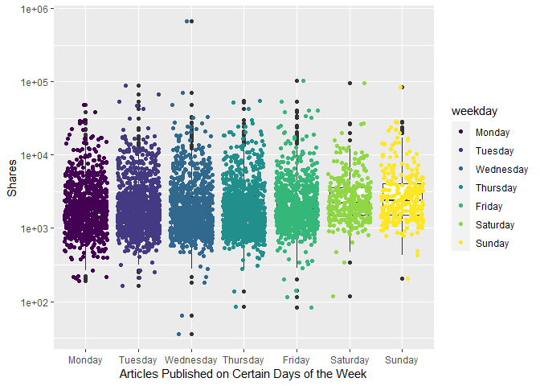<!-- -->

``` r
# when we take the log of the data, we can see easier... Poisson...
# plot scatter after boxplot because we want to see where the majority of the dots are...
#total articles published is actually higher Monday and fewer on the weekend. but boxplots look like they are lower on the weekdays because more articles are published but less shares are occurring...
#plots - scatter plot with boxplot overlayed
# 31. weekday_is_monday: Was the article published on a Monday?
#this one doesnt work bc we need levels...
#ggplot(data=ChannelTrain, aes(y=shares, x=weekday_is_monday)) + geom_point()
# the y - axis is using a log axis not a linear axis, but the plots are more easily interpretable /  visually more ituitive with this transformation.
ggplot(data=ChannelTrain %>% 
              mutate(weekday_fctr = factor(x=weekday_is_monday,  
              levels=c(0,1), labels = c("No", "Yes"))), 
            aes(y=shares, x=weekday_fctr)) + 
            labs(x="Articles Published on Monday", y="Shares", color = "Published") +
            geom_boxplot() + scale_y_log10() +
            geom_point(aes(color=weekday_fctr), position="jitter", alpha=0.4) 
```

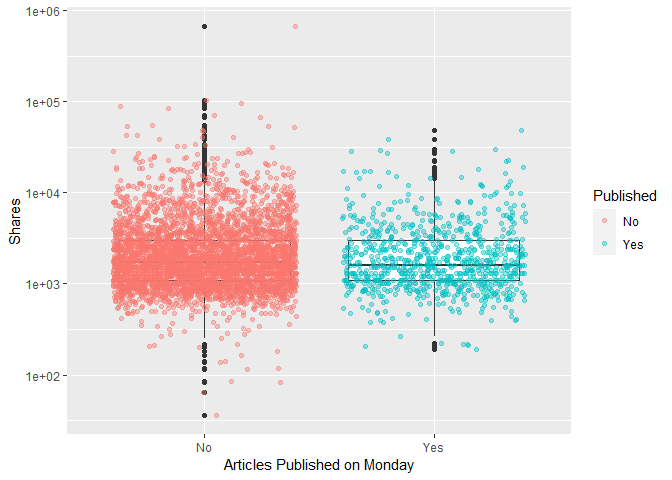<!-- -->

``` r
# 32. weekday_is_tuesday: Was the article published on a Tuesday
ggplot(data=ChannelTrain %>% 
              mutate(weekday_fctr = factor(x=weekday_is_tuesday,  
              levels=c(0,1), labels = c("No", "Yes"))), 
            aes(y=shares, x=weekday_fctr)) + 
            labs(x="Articles Published on Tuesday", y="Shares", color = "Published") +
            geom_boxplot() + scale_y_log10() +
            geom_point(aes(color=weekday_fctr), position="jitter", alpha=0.4) 
```

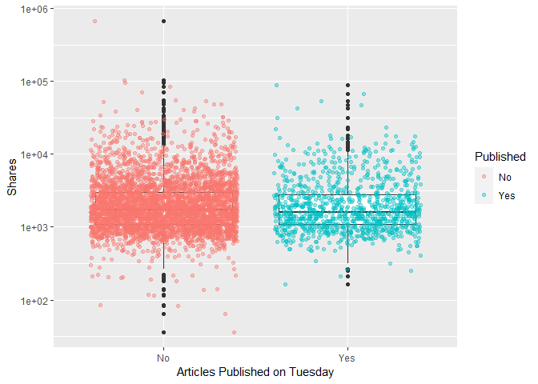<!-- -->

``` r
# 33. weekday_is_wednesday: Was the article published on a Wednesday?
ggplot(data=ChannelTrain %>% 
              mutate(weekday_fctr = factor(x=weekday_is_wednesday,  
              levels=c(0,1), labels = c("No", "Yes"))), 
            aes(y=shares, x=weekday_fctr)) + 
            labs(x="Articles Published on Wednesday", y="Shares", color = "Published") +
            geom_boxplot() + scale_y_log10() +
            geom_point(aes(color=weekday_fctr), position="jitter", alpha=0.4) 
```

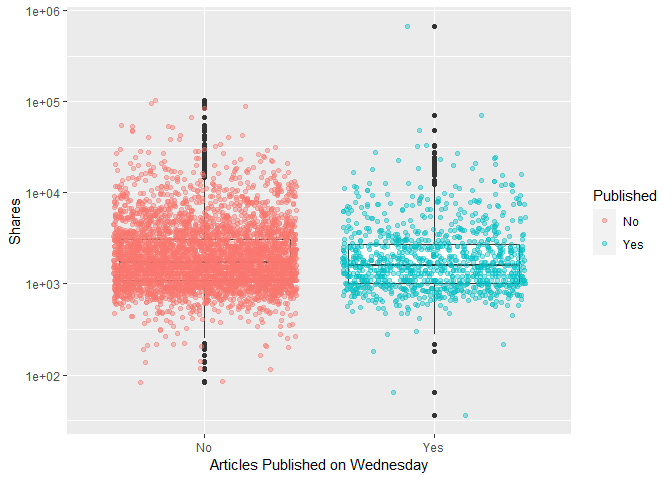<!-- -->

``` r
# 34. weekday_is_thursday: Was the article published on a Thursday?
ggplot(data=ChannelTrain %>% 
              mutate(weekday_fctr = factor(x=weekday_is_thursday,  
              levels=c(0,1), labels = c("No", "Yes"))), 
            aes(y=shares, x=weekday_fctr)) + 
            labs(x="Articles Published on Thursday", y="Shares", color = "Published") +
            geom_boxplot() + scale_y_log10() +
            geom_point(aes(color=weekday_fctr), position="jitter", alpha=0.4) 
```

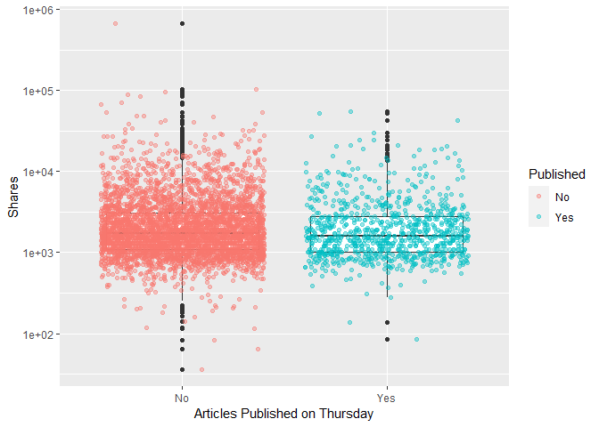<!-- -->

``` r
# 35. weekday_is_friday: Was the article published on a Friday?
ggplot(data=ChannelTrain %>% 
              mutate(weekday_fctr = factor(x=weekday_is_friday,  
              levels=c(0,1), labels = c("No", "Yes"))), 
            aes(y=shares, x=weekday_fctr)) + 
            labs(x="Articles Published on Friday", y="Shares", color = "Published") +
            geom_boxplot() + scale_y_log10() +
            geom_point(aes(color=weekday_fctr), position="jitter", alpha=0.4) 
```

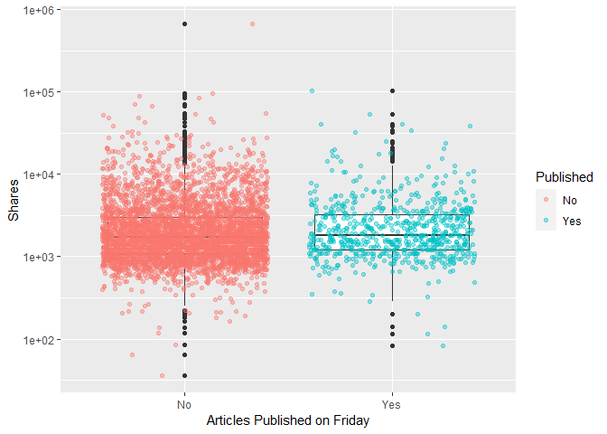<!-- -->

``` r
# 36. weekday_is_saturday: Was the article published on a Saturday?
ggplot(data=ChannelTrain %>% 
              mutate(weekday_fctr = factor(x=weekday_is_saturday,  
              levels=c(0,1), labels = c("No", "Yes"))), 
            aes(y=shares, x=weekday_fctr)) + 
            labs(x="Articles Published on Saturday", y="Shares", color = "Published") +
            geom_boxplot() + scale_y_log10() +
            geom_point(aes(color=weekday_fctr), position="jitter", alpha=0.4) 
```

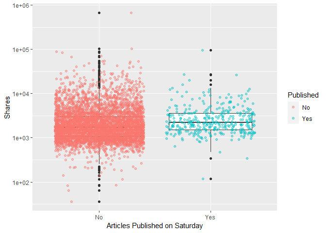<!-- -->

``` r
# 37. weekday_is_sunday: Was the article published on a Sunday?
ggplot(data=ChannelTrain %>% 
              mutate(weekday_fctr = factor(x=weekday_is_sunday,  
              levels=c(0,1), labels = c("No", "Yes"))), 
            aes(y=shares, x=weekday_fctr)) + 
            labs(x="Articles Published on Sunday", y="Shares", color = "Published") +
            geom_boxplot() + scale_y_log10() +
            geom_point(aes(color=weekday_fctr), position="jitter", alpha=0.4) 
```

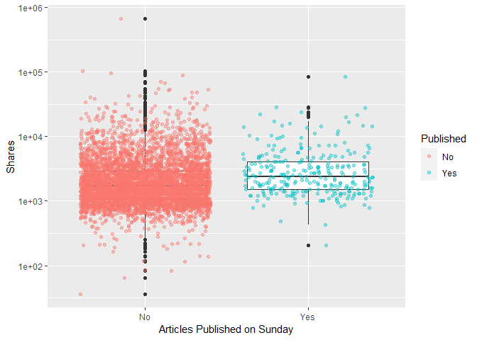<!-- -->

``` r
# # 38. is_weekend: Was the article published on the weekend? 
# ggplot(data=ChannelTrain %>% 
#               mutate(weekday_fctr = factor(x=is_weekend,  
#               levels=c(0,1), labels = c("No", "Yes"))), 
#             aes(y=shares, x=weekday_fctr)) + 
#             labs(x="Articles Published on Monday", y="Shares", color = "Published") +
#             geom_boxplot() + scale_y_log10() +
#             geom_point(aes(color=weekday_fctr), position="jitter") 
# i can make conclusions based on summary() median, min, max, bc i trasfomred for visibility
```

The y - axis is using a log axis not a linear axis, but the plots are
more easily interpretable / visually more intuitive with this
transformation.The general shape of the plots is correct.

We can inspect the trend of shares as a function of the different days
of the week that the articles are published.

If you see a presence of outliers, this may cause the mean to shift in
that direction, but the meidan will not be effected as much. If you see
that the median is not centered within the box, then there is a presence
of skewness in that particular direction. Also, if you see that there
are more observations / dots on one graph while comparing publication
(Yes/No), this is meaningful within the plot itself and also across the
different days of the week.

<!-- might use this later dont delete yet -->

``` r
#what question are we trying to answer here? 
# how to predict shares given the variables you have...
#fitting the model
fit_Channel <- lm(shares ~ . , data = Channel)
#call fit_Lifestyle object - remember this is an lm object
fit_Channel
```

    ## 
    ## Call:
    ## lm(formula = shares ~ ., data = Channel)
    ## 
    ## Coefficients:
    ##                   (Intercept)                 n_tokens_title               n_tokens_content  
    ##                     1.514e+03                      5.520e+01                      1.448e+00  
    ##               n_unique_tokens               n_non_stop_words       n_non_stop_unique_tokens  
    ##                    -3.157e+02                      2.782e+03                     -1.072e+03  
    ##                     num_hrefs                 num_self_hrefs                       num_imgs  
    ##                     8.246e+01                     -1.014e+02                     -3.858e+01  
    ##                    num_videos           average_token_length                   num_keywords  
    ##                     1.332e+02                     -3.552e+02                     -3.191e+01  
    ##     data_channel_is_lifestyle  data_channel_is_entertainment            data_channel_is_bus  
    ##                            NA                             NA                             NA  
    ##        data_channel_is_socmed           data_channel_is_tech          data_channel_is_world  
    ##                            NA                             NA                             NA  
    ##                    kw_min_min                     kw_max_min                     kw_avg_min  
    ##                     4.724e+00                      1.562e-01                     -1.610e+00  
    ##                    kw_min_max                     kw_max_max                     kw_avg_max  
    ##                    -1.831e-03                      7.889e-04                     -4.094e-03  
    ##                    kw_min_avg                     kw_max_avg                     kw_avg_avg  
    ##                    -1.404e-01                     -1.461e-01                      1.381e+00  
    ##     self_reference_min_shares      self_reference_max_shares     self_reference_avg_sharess  
    ##                    -7.069e-03                     -5.286e-03                      1.582e-02  
    ##             weekday_is_monday             weekday_is_tuesday           weekday_is_wednesday  
    ##                    -5.895e+02                     -5.912e+02                     -1.326e+02  
    ##           weekday_is_thursday              weekday_is_friday            weekday_is_saturday  
    ##                    -8.057e+02                     -5.070e+02                     -2.335e+02  
    ##             weekday_is_sunday                     is_weekend                         LDA_00  
    ##                            NA                             NA                      2.013e+03  
    ##                        LDA_01                         LDA_02                         LDA_03  
    ##                     3.255e+01                      5.005e+01                      2.459e+02  
    ##                        LDA_04            global_subjectivity      global_sentiment_polarity  
    ##                            NA                      5.906e+02                      4.768e+02  
    ##    global_rate_positive_words     global_rate_negative_words            rate_positive_words  
    ##                    -1.878e+04                      8.114e+03                     -1.230e+03  
    ##           rate_negative_words          avg_positive_polarity          min_positive_polarity  
    ##                            NA                     -9.890e+02                     -7.232e+02  
    ##         max_positive_polarity          avg_negative_polarity          min_negative_polarity  
    ##                    -5.821e+01                     -1.030e+04                      4.141e+03  
    ##         max_negative_polarity             title_subjectivity       title_sentiment_polarity  
    ##                     7.037e+03                     -2.377e+01                      6.879e+02  
    ##        abs_title_subjectivity   abs_title_sentiment_polarity  
    ##                    -7.892e+02                     -3.252e+02

``` r
# check fit_Lifestyle attributes
attributes(fit_Channel)
```

    ## $names
    ##  [1] "coefficients"  "residuals"     "effects"       "rank"          "fitted.values"
    ##  [6] "assign"        "qr"            "df.residual"   "xlevels"       "call"         
    ## [11] "terms"         "model"        
    ## 
    ## $class
    ## [1] "lm"

``` r
fit_Channel[["residuals"]]
```

    ##             1             2             3             4             5             6 
    ##    791.770148    340.789950   1630.901485   3166.218235  18372.535932   3223.326087 
    ##             7             8             9            10            11            12 
    ##    437.823295     -6.958111   2614.725133   2066.959660   5020.063505   1316.949949 
    ##            13            14            15            16            17            18 
    ##   8850.428844   2274.318592   1303.157401   5480.348732   1391.559757   2654.196902 
    ##            19            20            21            22            23            24 
    ##   1653.908899   1927.585959   5089.171830   1454.657442   2228.014930   3023.044260 
    ##            25            26            27            28            29            30 
    ##   1621.789165   2110.307017   -104.781545   1561.544173   1511.676651   1177.972891 
    ##            31            32            33            34            35            36 
    ##   1237.150359   1298.678196   3250.968408    -32.084053   2943.569180   1911.127927 
    ##            37            38            39            40            41            42 
    ##   3400.996468   -279.870400    523.319123   -374.328569  -1479.463209  -1989.061423 
    ##            43            44            45            46            47            48 
    ##  -1941.721788  -1308.244429   -722.504932  -1337.432730  -1364.990423    195.944890 
    ##            49            50            51            52            53            54 
    ##    149.715092   1476.075286  -1761.465946     -1.643128    705.861601   3798.819091 
    ##            55            56            57            58            59            60 
    ##  -1348.261490   -221.582627   -957.003399  -1414.484867    567.296883   -611.008069 
    ##            61            62            63            64            65            66 
    ##   2217.699948   -678.448592    109.803254   -957.217291   -305.602413   1457.587293 
    ##            67            68            69            70            71            72 
    ##   -518.364029   -385.270537   5105.075166    709.307772     39.595800    587.655055 
    ##            73            74            75            76            77            78 
    ##    353.841442    322.757943    757.531728    199.678891  -1792.816747   -821.775342 
    ##            79            80            81            82            83            84 
    ##  -1628.671269  -1485.901369   -819.779087   2036.892048    171.611039   -594.131255 
    ##            85            86            87            88            89            90 
    ##  -1052.790008    -93.025931   1326.771048   1302.372380    861.218109  -2178.626275 
    ##            91            92            93            94            95            96 
    ##    582.983490  -1026.523088   1404.355934   -839.596402  -2604.458220  -1194.091650 
    ##            97            98            99           100           101           102 
    ##   -956.554053   -128.713602  -1092.090936   -761.520223   -956.988287  -1756.205233 
    ##           103           104           105           106           107           108 
    ##   1355.096181  -1696.089463    926.735175   1084.201002   -590.841493   1335.745268 
    ##           109           110           111           112           113           114 
    ##   8144.350548   -913.681917   6601.835910  -1659.916260  -3414.405309   -106.397276 
    ##           115           116           117           118           119           120 
    ##  -2747.079096   -526.126572   1370.814120  -1429.270800   2873.347177  -2046.654046 
    ##           121           122           123           124           125           126 
    ##   1126.666725  -2204.846487    -73.381910   2210.630601   -469.554815   1292.070610 
    ##           127           128           129           130           131           132 
    ##   -665.833463   -991.885165  14447.120350   -291.310947    703.881325  -2695.433296 
    ##           133           134           135           136           137           138 
    ##   -815.944743  -1825.815394    653.667255    384.417760  -2330.228473  -2683.571270 
    ##           139           140           141           142           143           144 
    ##  -2182.022703  -2667.858171  -3404.064699   2294.768528  -2018.570278  -3606.302939 
    ##           145           146           147           148           149           150 
    ##   9273.418153    -91.073753  -1174.358075  -1323.072610  -1537.792478    604.058851 
    ##           151           152           153           154           155           156 
    ##  -3369.208572   -500.740633   -465.308362  -2019.421211  -2491.380942  -1403.732581 
    ##           157           158           159           160           161           162 
    ##  -1744.348124     13.666415   1747.238587  -1641.088455     96.121212   1165.004564 
    ##           163           164           165           166           167           168 
    ##     -2.572894    439.835532    164.932246   5157.244268    902.901789  -1106.113189 
    ##           169           170           171           172           173           174 
    ##   -578.575662  -1177.224443    848.885736  -1144.234753  -3819.482633    733.750439 
    ##           175           176           177           178           179           180 
    ##   5066.210172   5581.873479   1012.914744  -3911.461287   -448.860226     28.761117 
    ##           181           182           183           184           185           186 
    ##    -15.977669    307.946069   1529.109407    662.853670  -2682.341208   -885.206716 
    ##           187           188           189           190           191           192 
    ##   3251.853565    723.934665   4021.452815   -389.065089   4030.671342    506.184180 
    ##           193           194           195           196           197           198 
    ##   9265.178263   5180.319267  -2246.847036  -1416.378045  20018.423199   1511.462531 
    ##           199           200           201           202           203           204 
    ##  -2677.375574  -1724.821793  -1708.091035  -1607.711542   2503.860851   -974.650196 
    ##           205           206           207           208           209           210 
    ##  -1036.846509   -975.952894  -1033.738514  -1692.853113  -1936.352859    667.536088 
    ##           211           212           213           214           215           216 
    ##  -3909.819323  -1107.138118  -2648.460141  -2127.026877  -4330.455664   4661.469205 
    ##           217           218           219           220           221           222 
    ##  -1147.586731  -1603.406370  -2644.189870   3342.805239  -4166.668006  -3652.771900 
    ##           223           224           225           226           227           228 
    ##  -1288.556265  36321.086017  -3204.673359  -3053.145348    135.473192  -4317.578365 
    ##           229           230           231           232           233           234 
    ##  -1526.913994   1445.166762  -1732.032946  -1663.881076   2423.109399   2063.388600 
    ##           235           236           237           238           239           240 
    ##  -1225.475103    291.461120    388.077708    396.295918  -1727.474427   2135.782643 
    ##           241           242           243           244           245           246 
    ##   5556.224422  -1541.779092  -1235.461666  -2298.918385   -463.683916   1280.859177 
    ##           247           248           249           250           251           252 
    ##   3445.986101  -1650.985834    577.544059  -3076.293522  -2281.941261  -2251.970816 
    ##           253           254           255           256           257           258 
    ##   4826.540980  -1742.562872   5453.696419   3847.187899  -2111.099118  -1496.608266 
    ##           259           260           261           262           263           264 
    ##    914.905108   -808.237719   3774.619133   1105.403491   -671.781788    480.836988 
    ##           265           266           267           268           269           270 
    ##   1517.709784  -2228.412095  -2074.897626  -1440.427076  -2591.741698  -2060.284799 
    ##           271           272           273           274           275           276 
    ##    682.008771  -1069.228095    987.926308   1250.635618   1135.442190  -1255.737778 
    ##           277           278           279           280           281           282 
    ##  -2060.471069  -1624.021014  -1769.168274  -1583.116093   1749.722606   -333.832542 
    ##           283           284           285           286           287           288 
    ##  -3621.898552  -2269.756337  -1850.421486  -1478.381680  -3452.893095  -1223.317302 
    ##           289           290           291           292           293           294 
    ##  -1340.432751  -3013.366824  -3115.621480    -41.678327  -1682.362854   -395.571404 
    ##           295           296           297           298           299           300 
    ##  -2823.902572    -95.664689  -1138.553799     35.383974  -2880.600747   6924.904430 
    ##           301           302           303           304           305           306 
    ##  -1230.748078  -1914.649672   -792.346002  -3708.886904  -3914.341802  -1317.673829 
    ##           307           308           309           310           311           312 
    ##   5875.275929  -2130.493154  -1128.657891  -1733.727442  -4031.385322  -1956.228845 
    ##           313           314           315           316           317           318 
    ##   -868.107262  -1220.211963   -863.075150  -2574.842472    560.008723  -2126.024819 
    ##           319           320           321           322           323           324 
    ##  -1329.959873    353.653467  -1086.224583    -58.528994   -841.004651    396.100279 
    ##           325           326           327           328           329           330 
    ##   -341.514920    926.653037   3766.884563  12170.019427  -1108.393883  -2130.801133 
    ##           331           332           333           334           335           336 
    ##   -467.593002   -366.634335  38957.293678  -3315.665825  -2148.507175  -1807.526688 
    ##           337           338           339           340           341           342 
    ##   -377.927976  -1546.704168    254.945487   1860.274830   3765.876452  -2153.821537 
    ##           343           344           345           346           347           348 
    ##  -1207.317646   1255.202869  -2478.375817  -3042.867494  -1880.392392   -228.578986 
    ##           349           350           351           352           353           354 
    ##    231.819293   1991.869764  -1288.122285  -1454.339761  -2719.538280  -1839.573353 
    ##           355           356           357           358           359           360 
    ##  -2532.029820  -4598.141902  -2118.219557  -1465.890154   -959.326845    233.888507 
    ##           361           362           363           364           365           366 
    ##  -1695.186997  -3067.638905   -633.489320  -1432.713947  -3577.048626   -659.116664 
    ##           367           368           369           370           371           372 
    ##  -3015.185715 -15024.466757  -2244.875543  -1340.985096   -758.624257   3460.246376 
    ##           373           374           375           376           377           378 
    ##    129.417694   2914.318804   1915.631542  -1327.574320  -3903.912814   5031.230321 
    ##           379           380           381           382           383           384 
    ##   -626.529460   -676.471570  -1898.895637  -3158.771274    928.055490   -469.354733 
    ##           385           386           387           388           389           390 
    ##  -1471.447253  -1646.383864  -1160.281340     63.679170  -4695.040741  -2260.063765 
    ##           391           392           393           394           395           396 
    ##  -1191.250244  -1234.584876   1520.663935  -1584.456253    587.105127  -1853.824578 
    ##           397           398           399           400           401           402 
    ##   1658.609971  -2298.230657   5460.498455  -1757.391106   6498.027968   8336.787983 
    ##           403           404           405           406           407           408 
    ##   -887.626726  -3235.676197  13100.946812   -358.981289  -3489.892748  -1514.216581 
    ##           409           410           411           412           413           414 
    ##   -154.760309   -391.771212   -639.760909   -911.681486  -1222.302623  -2647.457070 
    ##           415           416           417           418           419           420 
    ##  -1850.724711   -260.145063   -512.614610  -1505.982253   -740.628285  -3574.367426 
    ##           421           422           423           424           425           426 
    ##   1914.060711    202.267316  -2716.199766     26.781393   -472.086862  15894.079351 
    ##           427           428           429           430           431           432 
    ##  -2228.404323   4494.950971  -2249.142397   -820.148156  -3244.585958  -1714.692203 
    ##           433           434           435           436           437           438 
    ##  -1527.844923  12753.317146  -3034.149750  -2589.392591   4319.440360  -2799.333248 
    ##           439           440           441           442           443           444 
    ##  -1835.102045  -3160.062725  -3087.150369  -3020.810419    701.595462  -2070.175939 
    ##           445           446           447           448           449           450 
    ##   1103.274068  -2069.526844  -2467.663326  -1598.817262  -1427.543248  -1880.549945 
    ##           451           452           453           454           455           456 
    ##   -734.684874   1143.572632   -226.976381  -3240.060685  -1063.789634  -2076.857631 
    ##           457           458           459           460           461           462 
    ##  -1140.867058  -2511.356471  -1790.575302  -2134.829736  -4194.634206    206.694111 
    ##           463           464           465           466           467           468 
    ##  -2602.033232   3121.803400   -991.487416  -1452.368730  -2519.572455   1065.384862 
    ##           469           470           471           472           473           474 
    ##   -566.161072  -4050.132483  -2781.379364  -1373.609944  -1445.760666   2354.996345 
    ##           475           476           477           478           479           480 
    ##  -1516.043841  -1647.574566   -121.230953   1371.761410   3419.268629  -2213.958844 
    ##           481           482           483           484           485           486 
    ##  -2961.553518  -1225.223902  -1242.137073  -8157.609202    236.936418   1017.979889 
    ##           487           488           489           490           491           492 
    ##  -2935.863145   5298.816319  -1561.489770  -1368.992788    454.771677  -1035.787509 
    ##           493           494           495           496           497           498 
    ##   -678.592431  -1343.232594  38773.770295   7605.297968  -2999.117729  -1527.880992 
    ##           499           500           501           502           503           504 
    ##  -3047.316722   1963.078977   -111.979269  -1190.064351  -1275.752065  -1853.894409 
    ##           505           506           507           508           509           510 
    ##  -1472.644079   -279.844238  -3008.646314   -641.853720   1146.337463  -2656.736138 
    ##           511           512           513           514           515           516 
    ##   1378.816335  -1984.840840  -5195.753135  -2211.134103   3752.144163  -2802.648939 
    ##           517           518           519           520           521           522 
    ##  -2153.116848   4230.909010  -3714.356727  -1941.326614  -2553.275364  -2336.856265 
    ##           523           524           525           526           527           528 
    ##  -2740.718428   1679.899888   1427.030156  -2238.753087  23613.198148    478.687908 
    ##           529           530           531           532           533           534 
    ##  -2669.189903  -1191.372459   3956.031411   1045.494790  -4343.889235    451.673566 
    ##           535           536           537           538           539           540 
    ##  -1621.637165   1593.904210  -1735.370822   -736.362115  -2113.343121  -2638.349273 
    ##           541           542           543           544           545           546 
    ##  13549.854230   1025.288439   -365.052901  -1894.035970  -3779.300576  -1310.924150 
    ##           547           548           549           550           551           552 
    ##   -297.449503  -1255.948235   -512.168295  -1576.102434  -1056.564659  -1987.398713 
    ##           553           554           555           556           557           558 
    ##  -2187.350425  -1791.179900  -2064.110827   -634.783683   -838.100571   7626.908532 
    ##           559           560           561           562           563           564 
    ##  -3880.010732  -2609.222971  -1695.797918  -3360.197034    350.703559   1005.337169 
    ##           565           566           567           568           569           570 
    ##     87.440035  -1857.091486  -1984.792148  24473.758729  -2203.491328    -42.288196 
    ##           571           572           573           574           575           576 
    ##  -2041.285024    -60.143805   -808.451461   1130.618995  -2274.502320  -2850.271534 
    ##           577           578           579           580           581           582 
    ##  -1436.780023  -2395.686666   -355.037859  -2287.683051  -1921.535342  -1197.071911 
    ##           583           584           585           586           587           588 
    ##  -7278.824682  -2532.855663  -2102.018202  -1116.577948  -1350.587610  -1091.338293 
    ##           589           590           591           592           593           594 
    ##  -2445.503715  -2123.516692  -1727.569120  -1492.060179  -1465.324515  -1477.849072 
    ##           595           596           597           598           599           600 
    ##   -532.360972    348.334829   -744.360065   3528.373051     92.030777  -2008.393856 
    ##           601           602           603           604           605           606 
    ##  -1671.549618  -1262.294333  -1914.978453    395.918648     -6.724957   -431.851578 
    ##           607           608           609           610           611           612 
    ##   -630.580368  -1354.390365  -2898.418303   -380.657820   6879.285573  -1965.053804 
    ##           613           614           615           616           617           618 
    ##  -3013.008969  -1314.407775   -980.166733   -565.372680  -1340.735107   5442.663605 
    ##           619           620           621           622           623           624 
    ##  28092.299586  -1989.826538  -1477.674366   8400.265490  23511.296379    160.353028 
    ##           625           626           627           628           629           630 
    ##  -3471.038927  -2062.847565  -2314.495449  16416.903597  -1948.423250  -3032.580797 
    ##           631           632           633           634           635           636 
    ##    253.821412  -2315.036093   -999.231392    -26.137122  -1450.513744  -1844.584590 
    ##           637           638           639           640           641           642 
    ##  -2035.799554    959.692655  -2570.630373   -502.868254  -3761.885730    373.362492 
    ##           643           644           645           646           647           648 
    ##   -171.181771  -1509.124112    931.490256   -685.404673  -3876.990741    382.748917 
    ##           649           650           651           652           653           654 
    ##    871.695670  -1795.454876  -3362.845500   3421.259999    135.542013   -992.262830 
    ##           655           656           657           658           659           660 
    ##  -2528.237123  -1625.832684  -3545.033507  -1655.654449   -582.031779    457.034201 
    ##           661           662           663           664           665           666 
    ##  10734.032593  21514.596320   2792.176141  -1750.422958  -4200.082763   -493.113591 
    ##           667           668           669           670           671           672 
    ##  -2007.264283   -874.217403  -2388.693168  -2088.304344  -2455.225589   -741.828461 
    ##           673           674           675           676           677           678 
    ##   -237.275619  -2449.165651   -671.889978   6910.823908  -6020.899317   -538.584368 
    ##           679           680           681           682           683           684 
    ##   -987.169581  -5444.273160  -3225.860158  -3374.239750  -2520.272905   5892.621300 
    ##           685           686           687           688           689           690 
    ##  -2230.792621   1222.834385  -1193.438225    -68.841933  -3228.392913  -2999.076098 
    ##           691           692           693           694           695           696 
    ##   -379.019141  -2727.391991  -4283.772361  -1858.159799  -3529.021267  -1797.080013 
    ##           697           698           699           700           701           702 
    ##   -928.250754  -2070.458219  -4246.077559  -2799.264252   -994.014886   1028.782375 
    ##           703           704           705           706           707           708 
    ##  -1292.933843   7383.027338  -1132.640590   -658.352124  10521.762979   -473.350537 
    ##           709           710           711           712           713           714 
    ##  -1305.936958   -415.071232  -1363.617932   -427.072389  -3333.412051  -2142.008366 
    ##           715           716           717           718           719           720 
    ##  -2271.346795  30458.232966  -1013.642630   -259.519625  -2334.953166   -624.075943 
    ##           721           722           723           724           725           726 
    ##  -2125.226954   -319.763328  -1935.842703  -2404.287241  -1496.097304  -3151.474924 
    ##           727           728           729           730           731           732 
    ##  -3042.025325  -1307.149025  -1308.066635  -1373.811793   -968.708524  -2609.499322 
    ##           733           734           735           736           737           738 
    ##   1181.239983  -1837.161984  -2610.413243  -2638.982270  -2384.356467  11107.887464 
    ##           739           740           741           742           743           744 
    ##   1672.655952  -1397.426331  -4384.165520  -1262.471233    346.176110   -986.017380 
    ##           745           746           747           748           749           750 
    ##  -2136.118798   -227.845330  -2379.224721  -2240.380283  -1726.213117    871.580353 
    ##           751           752           753           754           755           756 
    ##  -1594.234896   -802.625808  -1666.218598     19.251561  -2116.623800  -1305.845463 
    ##           757           758           759           760           761           762 
    ##  -1846.986846    744.398448  -3157.647652   2282.644584  -2046.289419    656.377884 
    ##           763           764           765           766           767           768 
    ##   5889.655148  -1788.824940  -1520.575509    438.203366  -2814.580185  -1672.320245 
    ##           769           770           771           772           773           774 
    ##    610.282245  -2739.312830  -3147.074617  -2775.843269  -3087.993378  -1685.024376 
    ##           775           776           777           778           779           780 
    ##   8800.337444   -883.333157  -2513.528859   7309.062604   -735.518526  -2687.010807 
    ##           781           782           783           784           785           786 
    ##  65187.389838  -1520.643682  -2999.646967  -1845.864113   5299.104598  -1894.902210 
    ##           787           788           789           790           791           792 
    ##  -1055.777116  -2237.569096  12009.781286  -2310.728052   1444.209145   2767.056890 
    ##           793           794           795           796           797           798 
    ##   5777.196472    177.230052   2148.544192    194.845743    418.187581  -3556.646609 
    ##           799           800           801           802           803           804 
    ##  17119.186420  -2437.083809  -4222.842929  -1002.117778  -1729.673130   2717.506473 
    ##           805           806           807           808           809           810 
    ##    466.371736  -3263.826124  -2567.451204    550.324869    -87.965020  -2310.262812 
    ##           811           812           813           814           815           816 
    ##  -1442.212626   -121.686517  33935.778409  30070.770023   -560.296028  -3810.229062 
    ##           817           818           819           820           821           822 
    ##    857.632379   -467.163186  -2081.947404  10377.390211   -900.066658   2289.268898 
    ##           823           824           825           826           827           828 
    ##   5535.627846   -536.508277  -3947.145147     60.432263    137.751430  -3339.270200 
    ##           829           830           831           832           833           834 
    ##   -343.109690  -2273.170377  -2662.259453  -1179.081113  -2983.576081   7902.187182 
    ##           835           836           837           838           839           840 
    ##  -2158.254234  17528.361338    402.267917   1236.624940  -1592.567339   1002.112312 
    ##           841           842           843           844           845           846 
    ##   1449.170089  -2670.733974   9945.872591  -3098.284871  -2019.815149   2758.013611 
    ##           847           848           849           850           851           852 
    ##  25083.217132    545.333137  -3449.064219   1244.859204  -2710.311020  -9244.434489 
    ##           853           854           855           856           857           858 
    ##  -1188.618813  -1944.584381  -1106.229148   2381.470239  -5112.486057  -1401.735421 
    ##           859           860           861           862           863           864 
    ##   -834.646433   5499.969508    -33.719103    541.745428  -1347.041985  -1491.363048 
    ##           865           866           867           868           869           870 
    ##  -2718.729955  -3706.502668  -1837.849764  -1633.636246  -1740.734587  23271.452263 
    ##           871           872           873           874           875           876 
    ##  -2974.839810   -634.343276   -153.954890  -2715.148549  -4759.514138  -2234.640364 
    ##           877           878           879           880           881           882 
    ##   1606.613492  -1035.822207  -4030.185003  -2817.812078  -1474.040265  -3064.008784 
    ##           883           884           885           886           887           888 
    ##  -2251.880035  -2661.190638   -725.962589  -3009.037570   -278.559796  -2968.243042 
    ##           889           890           891           892           893           894 
    ##  -1108.494256  -1150.668120  17470.630701  -3299.478279    587.233409  -2806.891739 
    ##           895           896           897           898           899           900 
    ##   -527.950685    -38.050170  -1967.049822  -1590.976172  29169.416648  -1073.102460 
    ##           901           902           903           904           905           906 
    ##    826.765348  -1022.819561  -1780.225935   -962.023064  -2172.242456    111.398697 
    ##           907           908           909           910           911           912 
    ##  -1589.767382   -345.120870  -1343.832198    500.845241  -1589.077470    891.148680 
    ##           913           914           915           916           917           918 
    ##  -2228.491822  -4023.950340  -3625.959192  -1198.115880  -3197.150298  -2368.494492 
    ##           919           920           921           922           923           924 
    ##  -2492.422807   -249.652847  -3212.860672    761.584834   -833.705016  13603.345111 
    ##           925           926           927           928           929           930 
    ##  -2496.723514   1260.429790   -562.318078  -1209.306514   -863.024356  -2044.179029 
    ##           931           932           933           934           935           936 
    ##  -2628.959418   3987.444326  -4003.141228  -1495.984536  -1730.198323   3188.897401 
    ##           937           938           939           940           941           942 
    ##  -1202.733225   -388.134358   1895.058339   1505.158388  -2289.796163  -2426.339610 
    ##           943           944           945           946           947           948 
    ##   -161.125954  -1707.120251  -3894.476713  -1661.827107  -3331.261467  -2682.298370 
    ##           949           950           951           952           953           954 
    ##  -2733.289448   -905.768875  -2005.915024   -261.252362  -1367.707531  -2894.804578 
    ##           955           956           957           958           959           960 
    ##  -1659.564935  -4644.636183  -1289.478676  -3250.777070  -3217.144575   1046.328239 
    ##           961           962           963           964           965           966 
    ##    928.994944  17759.914682  -3173.459848  -2402.543773  16106.791089  -3040.461875 
    ##           967           968           969           970           971           972 
    ##   -540.777637  -1824.975160    485.593354  -1876.551630   -704.923476  -2575.288216 
    ##           973           974           975           976           977           978 
    ##  -2364.847449  -1322.737291   -836.285163  -1642.126526  -1435.760501   2178.336000 
    ##           979           980           981           982           983           984 
    ##   5646.133961   -997.889340  15876.116180  -3106.976351  -1338.980374  -1436.053674 
    ##           985           986           987           988           989           990 
    ##   -837.505696    641.530320   6472.142034   -625.492044  -3748.118346   1856.580304 
    ##           991           992           993           994           995           996 
    ##   -527.071447  21240.990661  -4043.065509   5011.995234  -3908.375515  -4202.499374 
    ##           997           998           999          1000 
    ##  -1747.438699     11.308294  -3066.439349  -2231.882495 
    ##  [ reached getOption("max.print") -- omitted 6346 entries ]

``` r
#summary stats for vars of interest - 
plot(fit_Channel)
```

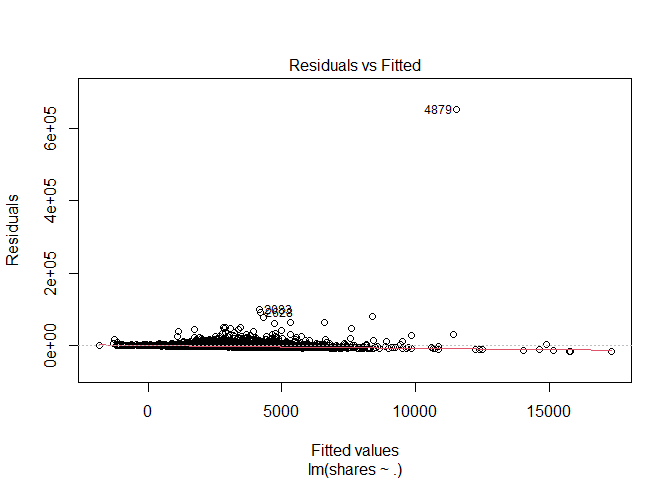<!-- -->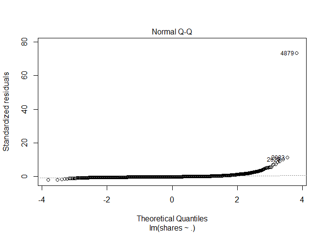<!-- -->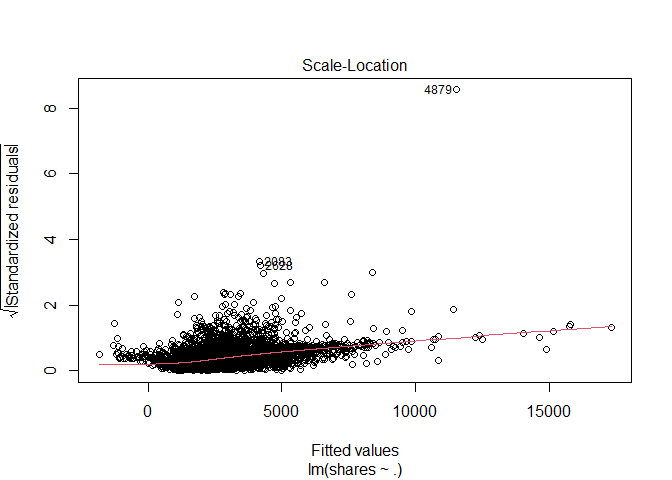<!-- -->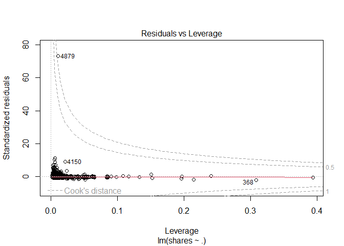<!-- -->

``` r
ggplot(data=fit_Channel, aes(y=shares, x=rate_positive_words)) + geom_point()
```

<!-- -->

``` r
#EDA
#starting point... correlation - shares vs. each var
#every pairwise combo
Channel_corr <- cor(x=Channel %>% 
                          select (shares, starts_with("weekday_is_") ) )
# cor_mat <- cor(data %>% select(RentedBikeCount, Temperature, Humidity, WindSpeed,
# Hour, Visibility, DewPointTemp,
# Rainfall, Snowfall), method = "pearson")
# corrplot(cor_mat, hc.order = TRUE,
# type = "lower",
# tl.pos = "lt",
# title = "Correlation Coefficients for Bike Rental Data",
# subtitle = "Correlation Coefficients for Bike Rental Data",
# mar=c(0,0,2,0)
# )
#call Channel_corr object to look at correlation between vars and shares response var
#drop to keep in matrix and not turn into a vector
shares_corr <- Channel_corr[ ,"shares", drop=FALSE]
#shares_corr <- Channel_corr[ ,"shares"]
is(shares_corr) #matrix with the drop=TRUE option
```

    ## [1] "matrix"    "array"     "mMatrix"   "structure" "vector"

``` r
#convert to tibble
#shares_corr_tibble <- as.tibble(shares_corr)
shares_corr_tibble <- bind_cols( var_names = rownames(shares_corr), shares_corr ) 
#call shares_corr_tibble object that has correlations with shares and vars...
shares_corr_tibble
```

    ## # A tibble: 8 × 2
    ##   var_names               shares
    ##   <chr>                    <dbl>
    ## 1 shares                1       
    ## 2 weekday_is_monday    -0.0125  
    ## 3 weekday_is_tuesday   -0.0105  
    ## 4 weekday_is_wednesday  0.0157  
    ## 5 weekday_is_thursday  -0.0169  
    ## 6 weekday_is_friday    -0.000938
    ## 7 weekday_is_saturday   0.0167  
    ## 8 weekday_is_sunday     0.0228

``` r
# condition on +/- 0.9 to see what we should remove as a predictor for the model
# call shares_corr_tibble object
#shares_corr_tibble #this currently does not have row names...
rownames(shares_corr)
```

    ## [1] "shares"               "weekday_is_monday"    "weekday_is_tuesday"  
    ## [4] "weekday_is_wednesday" "weekday_is_thursday"  "weekday_is_friday"   
    ## [7] "weekday_is_saturday"  "weekday_is_sunday"

``` r
#checking structure and type of object
#str(Channel_corr)
#is(Channel_corr)
#finds highly correlated variables and you can set a cutoff (default is +/ 0.9)
#convert to tibble because using drylr chaining / piping
corr_vars <- as.tibble ( Channel_corr[ ,"shares"] ) %>%
             filter ( abs(value) >= 0.9 )
#dont need this anymore...
#corr_vars <- findCorrelation(x=Can_corr, cutoff = +/- 0.9, verbose = TRUE, names = TRUE)
#call corr_vars object
#corr_vars
#columns that are highly correlated and should be removed from the model
#5 13 22
# [1] "n_non_stop_unique_tokens"  "kw_max_min" "self_reference_max_shares"
#response variable is shares, but what does that mean given certain variables available to us?
#maybe look at days of the week variables?
#figure out what kind of object we want to make to answer our question...
#tibble keeping what kind of vars, matrix?
#need to do some sort of type of EDA in order to see if variables are highly correlated
#here we need to summary statistics via summary() and plots
#this shows the summary stats for each variable in our dataset...
Lifestlye_sumstats_Train <- summary(ChannelTrain)
#calling Lifestlye_sumstats_Train object to see our summary stats
Lifestlye_sumstats_Train
```

    ##  n_tokens_title  n_tokens_content n_unique_tokens  n_non_stop_words n_non_stop_unique_tokens
    ##  Min.   : 4.00   Min.   :   0.0   Min.   :0.0000   Min.   :0.0000   Min.   :0.0000          
    ##  1st Qu.: 9.00   1st Qu.: 255.0   1st Qu.:0.4574   1st Qu.:1.0000   1st Qu.:0.6162          
    ##  Median :10.00   Median : 406.0   Median :0.5330   Median :1.0000   Median :0.6881          
    ##  Mean   :10.17   Mean   : 574.5   Mean   :0.5304   Mean   :0.9973   Mean   :0.6821          
    ##  3rd Qu.:12.00   3rd Qu.: 738.0   3rd Qu.:0.6010   3rd Qu.:1.0000   3rd Qu.:0.7553          
    ##  Max.   :20.00   Max.   :4979.0   Max.   :0.9143   Max.   :1.0000   Max.   :1.0000          
    ##    num_hrefs       num_self_hrefs       num_imgs        num_videos     average_token_length
    ##  Min.   :  0.000   Min.   :  0.000   Min.   : 0.000   Min.   : 0.000   Min.   :0.000       
    ##  1st Qu.:  5.000   1st Qu.:  2.000   1st Qu.: 1.000   1st Qu.: 0.000   1st Qu.:4.424       
    ##  Median :  7.000   Median :  3.000   Median : 1.000   Median : 0.000   Median :4.593       
    ##  Mean   :  9.503   Mean   :  4.635   Mean   : 4.432   Mean   : 0.454   Mean   :4.585       
    ##  3rd Qu.: 11.000   3rd Qu.:  6.000   3rd Qu.: 6.000   3rd Qu.: 1.000   3rd Qu.:4.759       
    ##  Max.   :120.000   Max.   :116.000   Max.   :65.000   Max.   :73.000   Max.   :5.857       
    ##   num_keywords    data_channel_is_lifestyle data_channel_is_entertainment
    ##  Min.   : 2.000   Min.   :0                 Min.   :0                    
    ##  1st Qu.: 7.000   1st Qu.:0                 1st Qu.:0                    
    ##  Median : 8.000   Median :0                 Median :0                    
    ##  Mean   : 7.775   Mean   :0                 Mean   :0                    
    ##  3rd Qu.: 9.000   3rd Qu.:0                 3rd Qu.:0                    
    ##  Max.   :10.000   Max.   :0                 Max.   :0                    
    ##  data_channel_is_bus data_channel_is_socmed data_channel_is_tech data_channel_is_world
    ##  Min.   :0           Min.   :0              Min.   :1            Min.   :0            
    ##  1st Qu.:0           1st Qu.:0              1st Qu.:1            1st Qu.:0            
    ##  Median :0           Median :0              Median :1            Median :0            
    ##  Mean   :0           Mean   :0              Mean   :1            Mean   :0            
    ##  3rd Qu.:0           3rd Qu.:0              3rd Qu.:1            3rd Qu.:0            
    ##  Max.   :0           Max.   :0              Max.   :1            Max.   :0            
    ##    kw_min_min       kw_max_min       kw_avg_min        kw_min_max       kw_max_max    
    ##  Min.   : -1.00   Min.   :     0   Min.   :   -1.0   Min.   :     0   Min.   :     0  
    ##  1st Qu.: -1.00   1st Qu.:   480   1st Qu.:  161.8   1st Qu.:     0   1st Qu.:690400  
    ##  Median :  0.00   Median :   725   Median :  254.7   Median :  1100   Median :843300  
    ##  Mean   : 29.58   Mean   :  1152   Mean   :  317.2   Mean   :  7396   Mean   :738324  
    ##  3rd Qu.:  4.00   3rd Qu.:  1100   3rd Qu.:  370.8   3rd Qu.:  5700   3rd Qu.:843300  
    ##  Max.   :217.00   Max.   :102200   Max.   :14716.9   Max.   :663600   Max.   :843300  
    ##    kw_avg_max       kw_min_avg     kw_max_avg       kw_avg_avg    self_reference_min_shares
    ##  Min.   :     0   Min.   :   0   Min.   :     0   Min.   :    0   Min.   :     0           
    ##  1st Qu.:140030   1st Qu.:   0   1st Qu.:  3437   1st Qu.: 2347   1st Qu.:   787           
    ##  Median :186667   Median : 853   Median :  3738   Median : 2702   Median :  1400           
    ##  Mean   :213153   Mean   :1007   Mean   :  4588   Mean   : 2748   Mean   :  4437           
    ##  3rd Qu.:285078   3rd Qu.:1973   3rd Qu.:  4705   3rd Qu.: 3083   3rd Qu.:  2800           
    ##  Max.   :753450   Max.   :3347   Max.   :102200   Max.   :19429   Max.   :663600           
    ##  self_reference_max_shares self_reference_avg_sharess weekday_is_monday weekday_is_tuesday
    ##  Min.   :     0            Min.   :     0             Min.   :0.0000    Min.   :0.0000    
    ##  1st Qu.:  1700            1st Qu.:  1500             1st Qu.:0.0000    1st Qu.:0.0000    
    ##  Median :  4100            Median :  2800             Median :0.0000    Median :0.0000    
    ##  Mean   : 11822            Mean   :  7208             Mean   :0.1646    Mean   :0.2004    
    ##  3rd Qu.:  8500            3rd Qu.:  5362             3rd Qu.:0.0000    3rd Qu.:0.0000    
    ##  Max.   :663600            Max.   :663600             Max.   :1.0000    Max.   :1.0000    
    ##  weekday_is_wednesday weekday_is_thursday weekday_is_friday weekday_is_saturday
    ##  Min.   :0.0000       Min.   :0.0000      Min.   :0.0000    Min.   :0.000      
    ##  1st Qu.:0.0000       1st Qu.:0.0000      1st Qu.:0.0000    1st Qu.:0.000      
    ##  Median :0.0000       Median :0.0000      Median :0.0000    Median :0.000      
    ##  Mean   :0.1946       Mean   :0.1778      Mean   :0.1386    Mean   :0.069      
    ##  3rd Qu.:0.0000       3rd Qu.:0.0000      3rd Qu.:0.0000    3rd Qu.:0.000      
    ##  Max.   :1.0000       Max.   :1.0000      Max.   :1.0000    Max.   :1.000      
    ##  weekday_is_sunday   is_weekend        LDA_00            LDA_01            LDA_02       
    ##  Min.   :0.000     Min.   :0.000   Min.   :0.01819   Min.   :0.01819   Min.   :0.01818  
    ##  1st Qu.:0.000     1st Qu.:0.000   1st Qu.:0.02230   1st Qu.:0.02224   1st Qu.:0.02500  
    ##  Median :0.000     Median :0.000   Median :0.02860   Median :0.02857   Median :0.03334  
    ##  Mean   :0.055     Mean   :0.124   Mean   :0.07364   Mean   :0.06500   Mean   :0.11086  
    ##  3rd Qu.:0.000     3rd Qu.:0.000   3rd Qu.:0.04007   3rd Qu.:0.04000   3rd Qu.:0.15724  
    ##  Max.   :1.000     Max.   :1.000   Max.   :0.80735   Max.   :0.72201   Max.   :0.82213  
    ##      LDA_03            LDA_04        global_subjectivity global_sentiment_polarity
    ##  Min.   :0.01818   Min.   :0.02007   Min.   :0.0000      Min.   :-0.33912         
    ##  1st Qu.:0.02223   1st Qu.:0.54599   1st Qu.:0.4150      1st Qu.: 0.09815         
    ##  Median :0.02857   Median :0.73332   Median :0.4596      Median : 0.14517         
    ##  Mean   :0.06140   Mean   :0.68910   Mean   :0.4569      Mean   : 0.14578         
    ##  3rd Qu.:0.04000   3rd Qu.:0.86658   3rd Qu.:0.5030      3rd Qu.: 0.19090         
    ##  Max.   :0.74237   Max.   :0.92719   Max.   :0.7693      Max.   : 0.65000         
    ##  global_rate_positive_words global_rate_negative_words rate_positive_words
    ##  Min.   :0.00000            Min.   :0.000000           Min.   :0.0000     
    ##  1st Qu.:0.03306            1st Qu.:0.008696           1st Qu.:0.6667     
    ##  Median :0.04190            Median :0.013582           Median :0.7527     
    ##  Mean   :0.04288            Mean   :0.014411           Mean   :0.7470     
    ##  3rd Qu.:0.05204            3rd Qu.:0.018913           3rd Qu.:0.8333     
    ##  Max.   :0.10714            Max.   :0.082803           Max.   :1.0000     
    ##  rate_negative_words avg_positive_polarity min_positive_polarity max_positive_polarity
    ##  Min.   :0.0000      Min.   :0.0000        Min.   :0.00000       Min.   :0.0000       
    ##  1st Qu.:0.1667      1st Qu.:0.3155        1st Qu.:0.06250       1st Qu.:0.6000       
    ##  Median :0.2453      Median :0.3566        Median :0.10000       Median :0.8000       
    ##  Mean   :0.2503      Mean   :0.3575        Mean   :0.09912       Mean   :0.7724       
    ##  3rd Qu.:0.3293      3rd Qu.:0.4014        3rd Qu.:0.10000       3rd Qu.:1.0000       
    ##  Max.   :1.0000      Max.   :1.0000        Max.   :1.00000       Max.   :1.0000       
    ##  avg_negative_polarity min_negative_polarity max_negative_polarity title_subjectivity
    ##  Min.   :-1.0000       Min.   :-1.0000       Min.   :-1.0000       Min.   :0.0000    
    ##  1st Qu.:-0.2838       1st Qu.:-0.6000       1st Qu.:-0.1250       1st Qu.:0.0000    
    ##  Median :-0.2222       Median :-0.4333       Median :-0.1000       Median :0.0500    
    ##  Mean   :-0.2287       Mean   :-0.4512       Mean   :-0.1028       Mean   :0.2521    
    ##  3rd Qu.:-0.1667       3rd Qu.:-0.2500       3rd Qu.:-0.0500       3rd Qu.:0.4667    
    ##  Max.   : 0.0000       Max.   : 0.0000       Max.   : 0.0000       Max.   :1.0000    
    ##  title_sentiment_polarity abs_title_subjectivity abs_title_sentiment_polarity
    ##  Min.   :-1.00000         Min.   :0.0000         Min.   :0.0000              
    ##  1st Qu.: 0.00000         1st Qu.:0.1667         1st Qu.:0.0000              
    ##  Median : 0.00000         Median :0.5000         Median :0.0000              
    ##  Mean   : 0.08602         Mean   :0.3471         Mean   :0.1356              
    ##  3rd Qu.: 0.15000         3rd Qu.:0.5000         3rd Qu.:0.2000              
    ##  Max.   : 1.00000         Max.   :0.5000         Max.   :1.0000              
    ##      shares      
    ##  Min.   :    36  
    ##  1st Qu.:  1100  
    ##  Median :  1700  
    ##  Mean   :  3132  
    ##  3rd Qu.:  3000  
    ##  Max.   :663600

``` r
#check structure of objects
str(ChannelTrain)
```

    ## tibble [5,145 × 59] (S3: tbl_df/tbl/data.frame)
    ##  $ n_tokens_title               : num [1:5145] 13 10 11 8 13 11 8 8 10 14 ...
    ##  $ n_tokens_content             : num [1:5145] 1072 370 97 1207 1248 ...
    ##  $ n_unique_tokens              : num [1:5145] 0.416 0.56 0.67 0.411 0.391 ...
    ##  $ n_non_stop_words             : num [1:5145] 1 1 1 1 1 ...
    ##  $ n_non_stop_unique_tokens     : num [1:5145] 0.541 0.698 0.837 0.549 0.523 ...
    ##  $ num_hrefs                    : num [1:5145] 19 2 2 24 21 20 5 5 2 0 ...
    ##  $ num_self_hrefs               : num [1:5145] 19 2 0 24 19 20 2 3 2 0 ...
    ##  $ num_imgs                     : num [1:5145] 20 0 0 42 20 20 1 1 19 14 ...
    ##  $ num_videos                   : num [1:5145] 0 0 0 0 0 0 0 0 0 0 ...
    ##  $ average_token_length         : num [1:5145] 4.68 4.36 4.86 4.72 4.69 ...
    ##  $ num_keywords                 : num [1:5145] 7 9 7 8 10 7 10 9 7 9 ...
    ##  $ data_channel_is_lifestyle    : num [1:5145] 0 0 0 0 0 0 0 0 0 0 ...
    ##  $ data_channel_is_entertainment: num [1:5145] 0 0 0 0 0 0 0 0 0 0 ...
    ##  $ data_channel_is_bus          : num [1:5145] 0 0 0 0 0 0 0 0 0 0 ...
    ##  $ data_channel_is_socmed       : num [1:5145] 0 0 0 0 0 0 0 0 0 0 ...
    ##  $ data_channel_is_tech         : num [1:5145] 1 1 1 1 1 1 1 1 1 1 ...
    ##  $ data_channel_is_world        : num [1:5145] 0 0 0 0 0 0 0 0 0 0 ...
    ##  $ kw_min_min                   : num [1:5145] 0 0 0 0 0 0 0 0 0 0 ...
    ##  $ kw_max_min                   : num [1:5145] 0 0 0 0 0 0 0 0 0 0 ...
    ##  $ kw_avg_min                   : num [1:5145] 0 0 0 0 0 0 0 0 0 0 ...
    ##  $ kw_min_max                   : num [1:5145] 0 0 0 0 0 0 0 0 0 0 ...
    ##  $ kw_max_max                   : num [1:5145] 0 0 0 0 0 0 0 0 0 0 ...
    ##  $ kw_avg_max                   : num [1:5145] 0 0 0 0 0 0 0 0 0 0 ...
    ##  $ kw_min_avg                   : num [1:5145] 0 0 0 0 0 0 0 0 0 0 ...
    ##  $ kw_max_avg                   : num [1:5145] 0 0 0 0 0 0 0 0 0 0 ...
    ##  $ kw_avg_avg                   : num [1:5145] 0 0 0 0 0 0 0 0 0 0 ...
    ##  $ self_reference_min_shares    : num [1:5145] 545 8500 0 545 545 545 924 2500 0 0 ...
    ##  $ self_reference_max_shares    : num [1:5145] 16000 8500 0 16000 16000 16000 924 2500 0 0 ...
    ##  $ self_reference_avg_sharess   : num [1:5145] 3151 8500 0 2830 3151 ...
    ##  $ weekday_is_monday            : num [1:5145] 1 1 1 1 1 1 1 1 1 1 ...
    ##  $ weekday_is_tuesday           : num [1:5145] 0 0 0 0 0 0 0 0 0 0 ...
    ##  $ weekday_is_wednesday         : num [1:5145] 0 0 0 0 0 0 0 0 0 0 ...
    ##  $ weekday_is_thursday          : num [1:5145] 0 0 0 0 0 0 0 0 0 0 ...
    ##  $ weekday_is_friday            : num [1:5145] 0 0 0 0 0 0 0 0 0 0 ...
    ##  $ weekday_is_saturday          : num [1:5145] 0 0 0 0 0 0 0 0 0 0 ...
    ##  $ weekday_is_sunday            : num [1:5145] 0 0 0 0 0 0 0 0 0 0 ...
    ##  $ is_weekend                   : num [1:5145] 0 0 0 0 0 0 0 0 0 0 ...
    ##  $ LDA_00                       : num [1:5145] 0.0286 0.0222 0.4583 0.025 0.0201 ...
    ##  $ LDA_01                       : num [1:5145] 0.0288 0.3067 0.029 0.0252 0.02 ...
    ##  $ LDA_02                       : num [1:5145] 0.0286 0.0222 0.0287 0.025 0.02 ...
    ##  $ LDA_03                       : num [1:5145] 0.0286 0.0222 0.0297 0.025 0.02 ...
    ##  $ LDA_04                       : num [1:5145] 0.885 0.627 0.454 0.9 0.92 ...
    ##  $ global_subjectivity          : num [1:5145] 0.514 0.437 0.539 0.539 0.507 ...
    ##  $ global_sentiment_polarity    : num [1:5145] 0.281 0.0712 0.1611 0.2883 0.2904 ...
    ##  $ global_rate_positive_words   : num [1:5145] 0.0746 0.0297 0.0309 0.0696 0.0681 ...
    ##  $ global_rate_negative_words   : num [1:5145] 0.0121 0.027 0.0206 0.0116 0.0112 ...
    ##  $ rate_positive_words          : num [1:5145] 0.86 0.524 0.6 0.857 0.859 ...
    ##  $ rate_negative_words          : num [1:5145] 0.14 0.476 0.4 0.143 0.141 ...
    ##  $ avg_positive_polarity        : num [1:5145] 0.411 0.351 0.567 0.427 0.408 ...
    ##  $ min_positive_polarity        : num [1:5145] 0.0333 0.1364 0.4 0.1 0.1 ...
    ##  $ max_positive_polarity        : num [1:5145] 1 0.6 0.8 1 1 1 0.35 1 0.6 1 ...
    ##  $ avg_negative_polarity        : num [1:5145] -0.22 -0.195 -0.125 -0.227 -0.207 ...
    ##  $ min_negative_polarity        : num [1:5145] -0.5 -0.4 -0.125 -0.5 -0.5 -0.5 -0.2 -0.5 -0.8 -0.4 ...
    ##  $ max_negative_polarity        : num [1:5145] -0.05 -0.1 -0.125 -0.05 -0.05 ...
    ##  $ title_subjectivity           : num [1:5145] 0.455 0.643 0.125 0.5 0 ...
    ##  $ title_sentiment_polarity     : num [1:5145] 0.136 0.214 0 0 0 ...
    ##  $ abs_title_subjectivity       : num [1:5145] 0.0455 0.1429 0.375 0 0.5 ...
    ##  $ abs_title_sentiment_polarity : num [1:5145] 0.136 0.214 0 0 0 ...
    ##  $ shares                       : num [1:5145] 505 855 3600 17100 2800 445 783 1500 3900 480 ...

``` r
str(Lifestlye_sumstats_Train)
```

    ##  'table' chr [1:6, 1:59] "Min.   : 4.00  " "1st Qu.: 9.00  " "Median :10.00  " ...
    ##  - attr(*, "dimnames")=List of 2
    ##   ..$ : chr [1:6] "" "" "" "" ...
    ##   ..$ : chr [1:59] "n_tokens_title" "n_tokens_content" "n_unique_tokens" "n_non_stop_words" ...

``` r
#plots include - scatter plots, correlation plots -- plots for continuous data...
#do we need bar plots?
#A scatter plot with the number of shares on the y-axis and the positive word rate on the x-axis is created below
ggplot(data=ChannelTrain, aes(y=shares, x=rate_positive_words)) + geom_point()
```

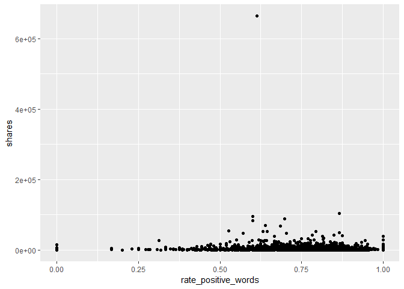<!-- -->
<!-- You’ll be automating the creation of documents using R Markdown (one for each data_channel_is_* setting, i.e. type of article in the data set provided). Each document should be rendered as a github_document from a single .Rmd file. In the README.md file you should create links to each of the documents you will create (Lifestyle analysis, Entertainment analysis, etc.). Links can be made to the sub-documents using relative -->
<!-- paths. For instance, if you have all of the outputted .md files in the main directory you would just use markdown linking: -->

<!-- - The analysis for [Lifestyle articles is available here](LifestyleAnalysis.html). Note we -->
<!-- link to the html file even though the file we create is a .md file - github creates the .html for us. -->
<!-- In the repo’s README.md file (which doesn’t need to be created from a .Rmd file, just use the one you initialize into the repo if you want) give a brief description of the purpose of the repo, a list of R packages used, links to the generated analyses, and the code used to create the analyses from a single .Rmd file (i.e. the render() code). -->

# Modelling

The data is already split into 70% training and 30% test. Our main goal
is to predict the number of shares. This will be our response variable.
We will create four models each using 5-fold cross-validation.

Two models (first linear and random forest) will be multiple linear
regression models, one will be a random forest model and the final model
will be a boosted tree model.

A Linear regression model is a supervised learning technique that is
used to predict the value of a variable based on the value of other
variable(s). The variable you want to predict is called the dependent
variable or the response. The variable(s) you are using to predict is
called the independent variable(s) or the predictor(s).

## First linear model.

We model the number of shares by the selected independent variables

-   “n_tokens_title” (Number of words in the title),

-   “n_tokens_content” (Number of words in the content)

-   “num_imgs” (Number of images)

-   “num_videos” (Number of videos)

-   “is_weekend” (Was the article published on the weekend?)

``` r
#linear regression model 1
l_m1 <- train(shares ~ n_tokens_title +  n_tokens_content + num_imgs + num_videos + 
                       is_weekend, 
              data = ChannelTrain, 
              method = "lm", 
              preProcess = c("center", "scale"),
              trControl = trainControl(method= "cv", number = 5))
#l_m1
#predicting on the ChannelTest data with linear regression model 1
test_pred_l_m1 <- predict(l_m1, newdata = ChannelTest)
#finding the best model - more explicit
m1 <- postResample(test_pred_l_m1, ChannelTest$shares)
m1
```

    ##         RMSE     Rsquared          MAE 
    ## 4.200607e+03 4.024111e-03 2.237754e+03

## Second linear model

We model the number of shares by the selected independent variables

-   “num_hrefs” (Number of links)

-   “weekday_is_monday” (Was the article published on a Monday?)

-   “weekday_is_tuesday” (Was the article published on a Tuesday?)

-   “weekday_is_wednesday” {Was the article published on a Wednesday?)

-   “weekday_is_thursday” (Was the article published on a Thursday?)

-   “weekday_is_friday” (Was the article published on a Friday?)

-   “self_reference_avg_sharess” (Avg. shares of referenced articles in
    Mashable)

``` r
#linear regression model 2
l_m2 <- train(shares ~ num_hrefs + weekday_is_monday + weekday_is_tuesday +
                       weekday_is_wednesday + weekday_is_thursday + weekday_is_friday +
                       self_reference_avg_sharess,
              data = ChannelTrain, 
              method = "lm", 
              preProcess = c("center", "scale"),
              trControl = trainControl(method= "cv", number = 5))
#predictions based on linear model 2 for the ChannelTest data
test_pred_l_m2 <- predict(l_m2, newdata = ChannelTest)
#best model chosen - RMSE reported explicity
#goal is to compare RMSE and see which one is the lowest!
m2 <- postResample(test_pred_l_m2, ChannelTest$shares)
m2
```

    ##         RMSE     Rsquared          MAE 
    ## 4.178216e+03 5.040144e-03 2.239993e+03

## Random forest model

The idea behind the random forest model is the same as bagging but we
use a random subset of predictors for each bootstrap sample tree fit
(indicated by “mtry”). More specifically, it involves creating a
boothstrap sample (same size with replacement), training the tree on
this sample (no pruning necessary), repeating the process a large number
of times and the final prediction is the average of those predictions.
Finding the average of predictions decreases variance which improves
predictions but unfortunately we lose interpretability.

For our random forest We model the number of shares by the selected
independent variables

-   “n_tokens_title” (Number of words in the title),

-   “n_tokens_content” (Number of words in the content)

-   “num_imgs” (Number of images)

-   “num_videos” (Number of videos)

-   “is_weekend” (Was the article published on the weekend?)

``` r
r_f <- train(shares ~ n_tokens_title +  n_tokens_content + num_imgs + num_videos + 
                      is_weekend , data = ChannelTrain, method = "rf",
  
             trControl=trainControl(method = "cv", number = 5),
             preProcess = c("center", "scale"),
             tuneGrid = data.frame(mtry = 1:3))
test_pred_r_f <- predict(r_f, newdata = ChannelTest)
m3 <- postResample(test_pred_r_f, ChannelTest$shares)
m3
```

    ##         RMSE     Rsquared          MAE 
    ## 4.309556e+03 4.589173e-03 2.224270e+03

``` r
#bootstrapping will take some time...
```

## Boosted tree model

The idea behind the boosting tree model is to train our tree slowly in a
sequential manner so each tree that is created will be based on the
previous one with predictions updated.

For our boosting tree we model the number of shares by the selected
independent variables

-   “num_hrefs” (Number of links)

-   “weekday_is_monday” (Was the article published on a Monday?)

-   “weekday_is_tuesday” (Was the article published on a Tuesday?)

-   “weekday_is_wednesday” {Was the article published on a Wednesday?)

-   “weekday_is_thursday” (Was the article published on a Thursday?)

-   “weekday_is_friday” (Was the article published on a Friday?)

-   “self_reference_avg_sharess” (Avg. shares of referenced articles in
    Mashable)

Additionally we choose to use all combinations of the tuning parameters
n.trees = c(25, 50, 100, 150, 200), interaction.depth = 1:4, shrinkage =
0.1 and n.minobsinnode = 10.

``` r
tune1<- c(25, 50, 100, 150, 200)
tune2<- 1:4
tune3<- 0.1
tune4<- 10
boosted <- train(shares ~ num_hrefs + weekday_is_monday + weekday_is_tuesday + weekday_is_wednesday + weekday_is_thursday + weekday_is_friday + self_reference_avg_sharess, 
data = ChannelTrain, method = "gbm",
 trControl=trainControl(method = "cv", number = 5),
 preProcess = c("center", "scale"),
 tuneGrid = expand.grid(n.trees = tune1, interaction.depth = tune2, shrinkage = tune3,    n.minobsinnode = tune4))
```

    ## Iter   TrainDeviance   ValidDeviance   StepSize   Improve
    ##      1 132161217.9546             nan     0.1000 73962.8806
    ##      2 131798884.8134             nan     0.1000 85479.5130
    ##      3 131646765.3058             nan     0.1000 44408.5266
    ##      4 131380343.4288             nan     0.1000 101011.2539
    ##      5 131179357.2829             nan     0.1000 19697.7362
    ##      6 130955255.6026             nan     0.1000 35784.8101
    ##      7 130722318.7563             nan     0.1000 -129237.1085
    ##      8 130610380.8699             nan     0.1000 -45924.8252
    ##      9 130448938.6309             nan     0.1000 31785.1228
    ##     10 130411643.5388             nan     0.1000 40093.7991
    ##     20 130136438.8266             nan     0.1000 -54053.4466
    ##     40 129721272.1948             nan     0.1000 -64271.1136
    ##     60 129463492.0414             nan     0.1000 -41514.5814
    ##     80 129081477.1254             nan     0.1000 -176075.2651
    ##    100 128702629.1027             nan     0.1000 -178215.2094
    ##    120 128346838.2847             nan     0.1000 -123662.1505
    ##    140 127897466.3492             nan     0.1000 -201620.6590
    ##    160 127826640.7252             nan     0.1000 -137488.5151
    ##    180 127607818.8296             nan     0.1000 -92642.6772
    ##    200 127525462.7447             nan     0.1000 -169933.7801
    ## 
    ## Iter   TrainDeviance   ValidDeviance   StepSize   Improve
    ##      1 130066664.4884             nan     0.1000 79832.6268
    ##      2 129904352.1388             nan     0.1000 46002.4810
    ##      3 128171738.9355             nan     0.1000 -111004.2456
    ##      4 128094898.0857             nan     0.1000 48341.9505
    ##      5 128019902.2031             nan     0.1000 32250.4783
    ##      6 127961492.9819             nan     0.1000 48047.4623
    ##      7 126705292.7234             nan     0.1000 -472949.8517
    ##      8 126604425.1079             nan     0.1000 55071.2688
    ##      9 126643266.0403             nan     0.1000 -159418.0744
    ##     10 125679979.0891             nan     0.1000 -493428.2474
    ##     20 118885235.3516             nan     0.1000 -272316.5443
    ##     40 114073196.4706             nan     0.1000 -1201100.2808
    ##     60 111380822.1027             nan     0.1000 -127949.8161
    ##     80 109865540.5722             nan     0.1000 -1544788.6560
    ##    100 106277823.8110             nan     0.1000 -345660.9930
    ##    120 105619686.1475             nan     0.1000 -824874.8727
    ##    140 104539195.4702             nan     0.1000 -858402.7011
    ##    160 102333218.5202             nan     0.1000 -286966.9608
    ##    180 96836535.4501             nan     0.1000 -501562.4642
    ##    200 94898386.0302             nan     0.1000 -70150.2794
    ## 
    ## Iter   TrainDeviance   ValidDeviance   StepSize   Improve
    ##      1 131959115.5324             nan     0.1000 374879.7120
    ##      2 131578590.1828             nan     0.1000 397361.8595
    ##      3 129331024.8688             nan     0.1000 160514.5301
    ##      4 127368902.5194             nan     0.1000 -179798.1232
    ##      5 125758833.7845             nan     0.1000 -643567.5106
    ##      6 124698941.6358             nan     0.1000 -768061.8981
    ##      7 124689236.8713             nan     0.1000 -107009.9133
    ##      8 122693817.2567             nan     0.1000 -188022.0532
    ##      9 122968485.1242             nan     0.1000 -909876.9660
    ##     10 123196115.2727             nan     0.1000 -852857.8366
    ##     20 118732208.0492             nan     0.1000 -73263.7038
    ##     40 111338462.6381             nan     0.1000 -487994.6445
    ##     60 107802083.7660             nan     0.1000 -949533.0677
    ##     80 105130091.5500             nan     0.1000 -249720.3776
    ##    100 97633457.6572             nan     0.1000 -655940.0353
    ##    120 92426268.9675             nan     0.1000 -243016.9849
    ##    140 90251959.6574             nan     0.1000 -749773.7274
    ##    160 85711360.1962             nan     0.1000 -9056.4223
    ##    180 82324170.8401             nan     0.1000 -224846.5997
    ##    200 81447581.9524             nan     0.1000 -514556.0961
    ## 
    ## Iter   TrainDeviance   ValidDeviance   StepSize   Improve
    ##      1 130023291.3640             nan     0.1000 205498.1574
    ##      2 129757211.9111             nan     0.1000 283041.2379
    ##      3 128067468.9580             nan     0.1000 -150200.9109
    ##      4 127980015.8310             nan     0.1000 7984.7047
    ##      5 127989477.0513             nan     0.1000 -82146.1039
    ##      6 126568140.0689             nan     0.1000 -306174.8179
    ##      7 126488626.6734             nan     0.1000 -10227.0013
    ##      8 126771502.3582             nan     0.1000 -789070.9848
    ##      9 124959771.2404             nan     0.1000 -386132.8412
    ##     10 124980146.5025             nan     0.1000 -261163.8581
    ##     20 119781673.5856             nan     0.1000 -368810.9172
    ##     40 109849828.3861             nan     0.1000 -118834.7403
    ##     60 99489882.2503             nan     0.1000 -784750.6020
    ##     80 95526548.1083             nan     0.1000 -157491.1694
    ##    100 88662335.1363             nan     0.1000 -256435.0642
    ##    120 83169736.6108             nan     0.1000 -214042.3339
    ##    140 82861790.3732             nan     0.1000 -899111.3082
    ##    160 80134596.5396             nan     0.1000 -933017.7193
    ##    180 76216996.1419             nan     0.1000 -1257207.8798
    ##    200 70376526.8359             nan     0.1000 -465406.9551
    ## 
    ## Iter   TrainDeviance   ValidDeviance   StepSize   Improve
    ##      1 131357726.8792             nan     0.1000 144194.6909
    ##      2 131065027.5841             nan     0.1000 44261.0011
    ##      3 130965180.4218             nan     0.1000 123012.0386
    ##      4 130895974.2132             nan     0.1000 -40695.9533
    ##      5 130689594.7407             nan     0.1000 -40036.4293
    ##      6 130622567.7837             nan     0.1000 91802.2664
    ##      7 130544025.7532             nan     0.1000 94666.6201
    ##      8 130356711.4111             nan     0.1000 32317.1305
    ##      9 130326181.7349             nan     0.1000 8745.0459
    ##     10 130321095.3365             nan     0.1000 -28787.5244
    ##     20 129644044.6914             nan     0.1000 40359.1192
    ##     40 129059436.4271             nan     0.1000 -20553.6937
    ##     60 128390593.0667             nan     0.1000 38195.9501
    ##     80 128160431.8583             nan     0.1000 -157327.3297
    ##    100 127872815.0977             nan     0.1000 31869.0433
    ##    120 127634813.1639             nan     0.1000 -189321.2015
    ##    140 127382142.1491             nan     0.1000 -199675.6227
    ##    160 127149848.7430             nan     0.1000 -58564.7815
    ##    180 126683993.3529             nan     0.1000 -97077.3650
    ##    200 126414849.9783             nan     0.1000 -127308.6010
    ## 
    ## Iter   TrainDeviance   ValidDeviance   StepSize   Improve
    ##      1 131560412.9068             nan     0.1000 85996.2440
    ##      2 131431537.8294             nan     0.1000 135540.0718
    ##      3 129360533.5784             nan     0.1000 -177553.4172
    ##      4 127818147.8004             nan     0.1000 -380824.9195
    ##      5 127758070.3961             nan     0.1000 -7597.1621
    ##      6 127661464.7339             nan     0.1000 23359.3134
    ##      7 125880618.5770             nan     0.1000 -168790.1040
    ##      8 124837624.8875             nan     0.1000 -684610.7774
    ##      9 124783324.5894             nan     0.1000 -17856.6359
    ##     10 124108039.1955             nan     0.1000 -977839.8563
    ##     20 121840192.1574             nan     0.1000 -35210.5349
    ##     40 116080212.5101             nan     0.1000 -1264345.7490
    ##     60 114473582.1435             nan     0.1000 -626834.4113
    ##     80 112540488.0061             nan     0.1000 -656852.7391
    ##    100 108942450.0349             nan     0.1000 -477955.0825
    ##    120 107356503.7493             nan     0.1000 -629432.5528
    ##    140 106125139.7782             nan     0.1000 -492388.7362
    ##    160 104077877.8195             nan     0.1000 -143587.5628
    ##    180 100584932.7530             nan     0.1000 -999143.0944
    ##    200 98781951.9920             nan     0.1000 -1165511.9274
    ## 
    ## Iter   TrainDeviance   ValidDeviance   StepSize   Improve
    ##      1 131501124.8405             nan     0.1000 117485.8281
    ##      2 131276868.3129             nan     0.1000 -13405.8272
    ##      3 131146577.7768             nan     0.1000 144646.1777
    ##      4 130995450.4264             nan     0.1000 106413.2730
    ##      5 129093859.8463             nan     0.1000 -39575.6521
    ##      6 129058214.4203             nan     0.1000 21785.3643
    ##      7 126824505.4362             nan     0.1000 -310455.0792
    ##      8 126766236.9869             nan     0.1000 -69691.5135
    ##      9 126631941.3933             nan     0.1000 43403.3960
    ##     10 125239758.2400             nan     0.1000 -243184.7042
    ##     20 121088789.2367             nan     0.1000 -1135168.1284
    ##     40 110344691.7127             nan     0.1000 -187424.7543
    ##     60 101445154.4345             nan     0.1000 77158.0629
    ##     80 95820377.7770             nan     0.1000 -382389.0325
    ##    100 91797240.2600             nan     0.1000 -543024.6544
    ##    120 84244112.9435             nan     0.1000 70519.0246
    ##    140 80534636.3093             nan     0.1000 -472486.1285
    ##    160 79093048.2654             nan     0.1000 -292200.5949
    ##    180 77281207.5320             nan     0.1000 -998665.3268
    ##    200 73449839.9397             nan     0.1000 -243710.9887
    ## 
    ## Iter   TrainDeviance   ValidDeviance   StepSize   Improve
    ##      1 129548245.5225             nan     0.1000 17694.2059
    ##      2 127719888.4798             nan     0.1000 -58562.2837
    ##      3 126035345.2472             nan     0.1000 -399778.6391
    ##      4 124356108.3307             nan     0.1000 -37119.0556
    ##      5 124235184.1517             nan     0.1000 96808.6425
    ##      6 122720970.1179             nan     0.1000 -511894.0200
    ##      7 121347835.3406             nan     0.1000 -531959.1979
    ##      8 121550191.2005             nan     0.1000 -676505.2421
    ##      9 121763177.7553             nan     0.1000 -702480.3732
    ##     10 121705385.7609             nan     0.1000 -20272.5341
    ##     20 118627237.3477             nan     0.1000 -740254.0661
    ##     40 112773349.8949             nan     0.1000 -663131.4840
    ##     60 101020526.6707             nan     0.1000 -958718.7893
    ##     80 94307706.4920             nan     0.1000 -377241.3061
    ##    100 86120149.2032             nan     0.1000 -434480.1939
    ##    120 81881792.0264             nan     0.1000 -346514.4322
    ##    140 79272211.0778             nan     0.1000 -427771.9423
    ##    160 76506465.2557             nan     0.1000 -819899.8495
    ##    180 73273015.6506             nan     0.1000 -196889.6399
    ##    200 69970057.1537             nan     0.1000 -174385.1083
    ## 
    ## Iter   TrainDeviance   ValidDeviance   StepSize   Improve
    ##      1 130439675.7968             nan     0.1000 270079.0842
    ##      2 130367042.5479             nan     0.1000 10766.5069
    ##      3 130280164.2348             nan     0.1000 -5278.0571
    ##      4 130186478.6391             nan     0.1000 118328.6265
    ##      5 129868515.9499             nan     0.1000 -48414.6241
    ##      6 129843081.0136             nan     0.1000 3881.0586
    ##      7 129627119.4225             nan     0.1000 -27883.7394
    ##      8 129562231.6977             nan     0.1000 85271.6322
    ##      9 129456797.8307             nan     0.1000 116586.0880
    ##     10 129420144.3663             nan     0.1000 -16396.4845
    ##     20 128666689.6843             nan     0.1000 -98595.2614
    ##     40 128157780.0944             nan     0.1000 59072.9242
    ##     60 127573977.8065             nan     0.1000 -5180.6959
    ##     80 127280993.4348             nan     0.1000 -127408.2065
    ##    100 126849526.9826             nan     0.1000 -99181.3441
    ##    120 126717795.5845             nan     0.1000 -256908.3031
    ##    140 126344396.2337             nan     0.1000 -124698.6882
    ##    160 126107699.1694             nan     0.1000 -98725.2740
    ##    180 125958189.7991             nan     0.1000 -66487.1329
    ##    200 125844721.4223             nan     0.1000 -85278.4859
    ## 
    ## Iter   TrainDeviance   ValidDeviance   StepSize   Improve
    ##      1 130646791.6176             nan     0.1000 251286.5980
    ##      2 128484387.1654             nan     0.1000 5088.7345
    ##      3 126497170.4903             nan     0.1000 -192671.9550
    ##      4 126405803.9444             nan     0.1000 110569.7554
    ##      5 124832287.3640             nan     0.1000 -335914.5834
    ##      6 123813387.3968             nan     0.1000 -722557.1282
    ##      7 121915239.0851             nan     0.1000 -136588.8437
    ##      8 121265129.1458             nan     0.1000 -1459937.6427
    ##      9 121241764.0575             nan     0.1000 -53607.6004
    ##     10 119859606.5619             nan     0.1000 -709844.2538
    ##     20 116874927.9414             nan     0.1000 -678546.3224
    ##     40 113958467.4364             nan     0.1000 -863314.9511
    ##     60 111847907.2242             nan     0.1000 -482399.3046
    ##     80 108045468.7674             nan     0.1000 -412970.3639
    ##    100 105620336.5282             nan     0.1000 -280736.2717
    ##    120 102170987.2371             nan     0.1000 -249517.4506
    ##    140 100118419.8416             nan     0.1000 349102.0852
    ##    160 99380361.0051             nan     0.1000 -490505.1614
    ##    180 97713195.3661             nan     0.1000 -198394.9247
    ##    200 95881254.2445             nan     0.1000 -283354.1015
    ## 
    ## Iter   TrainDeviance   ValidDeviance   StepSize   Improve
    ##      1 128587204.0433             nan     0.1000 -25965.9782
    ##      2 128474132.4328             nan     0.1000 63542.3174
    ##      3 128225174.8963             nan     0.1000 127592.4515
    ##      4 126794569.3922             nan     0.1000 -219067.1147
    ##      5 126985237.0501             nan     0.1000 -662073.9428
    ##      6 127027852.1910             nan     0.1000 -191019.8477
    ##      7 125282832.2175             nan     0.1000 152489.7818
    ##      8 123230453.9825             nan     0.1000 -51565.1377
    ##      9 121879808.2341             nan     0.1000 -226465.0783
    ##     10 121832222.4964             nan     0.1000 -54655.9179
    ##     20 113122234.0611             nan     0.1000 -883756.4566
    ##     40 106893865.5415             nan     0.1000 -456365.0560
    ##     60 98863213.7726             nan     0.1000 -99130.0191
    ##     80 92052996.7440             nan     0.1000 -387085.8779
    ##    100 88384224.2925             nan     0.1000 -826361.4784
    ##    120 83110671.6518             nan     0.1000 -493297.4643
    ##    140 78550879.8889             nan     0.1000 -210673.9571
    ##    160 76390903.2739             nan     0.1000 -186878.2156
    ##    180 73603796.8387             nan     0.1000 -221265.5664
    ##    200 69790724.0367             nan     0.1000 -234956.4104
    ## 
    ## Iter   TrainDeviance   ValidDeviance   StepSize   Improve
    ##      1 128581277.6242             nan     0.1000 86776.0787
    ##      2 128420283.7359             nan     0.1000 138249.5923
    ##      3 128276699.5569             nan     0.1000 86916.9151
    ##      4 128113178.5273             nan     0.1000 29612.9823
    ##      5 126098619.2013             nan     0.1000 -224163.1870
    ##      6 124796032.4099             nan     0.1000 -366270.4758
    ##      7 124988573.1433             nan     0.1000 -543915.3156
    ##      8 124961075.3487             nan     0.1000 -8346.3210
    ##      9 123493060.1668             nan     0.1000 -364990.3751
    ##     10 122270987.6153             nan     0.1000 -866513.6815
    ##     20 112866303.5696             nan     0.1000 -264070.7795
    ##     40 107975544.5640             nan     0.1000 -756156.8827
    ##     60 101100099.1092             nan     0.1000 -780659.2718
    ##     80 93213007.6467             nan     0.1000 -422614.8875
    ##    100 87819139.0672             nan     0.1000 -67967.0050
    ##    120 83669677.0815             nan     0.1000 -501165.4515
    ##    140 80098042.9224             nan     0.1000 -740480.3327
    ##    160 76838331.7168             nan     0.1000 -953040.3365
    ##    180 71347150.0457             nan     0.1000 -551941.7181
    ##    200 66923057.6042             nan     0.1000 -8903.2409
    ## 
    ## Iter   TrainDeviance   ValidDeviance   StepSize   Improve
    ##      1 21696268.7370             nan     0.1000 83045.3349
    ##      2 21633861.7304             nan     0.1000 52990.8212
    ##      3 21546258.6694             nan     0.1000 32969.1406
    ##      4 21491320.0106             nan     0.1000 -11634.9529
    ##      5 21418994.5233             nan     0.1000 -8862.4766
    ##      6 21384921.9789             nan     0.1000 37076.1235
    ##      7 21338135.1911             nan     0.1000 19035.2389
    ##      8 21274129.1756             nan     0.1000 -29088.2917
    ##      9 21240037.1089             nan     0.1000 7986.1030
    ##     10 21208658.4644             nan     0.1000 28428.5081
    ##     20 21014031.0284             nan     0.1000 -7159.6087
    ##     40 20898556.4955             nan     0.1000 -10286.0003
    ##     60 20816307.4700             nan     0.1000 -8107.3432
    ##     80 20782122.7997             nan     0.1000 -55128.2399
    ##    100 20719606.5749             nan     0.1000 -33464.0664
    ##    120 20684592.6405             nan     0.1000 -14429.9843
    ##    140 20647911.1658             nan     0.1000 -30618.2678
    ##    160 20598285.5252             nan     0.1000 -45132.5771
    ##    180 20571690.0330             nan     0.1000 -73521.7409
    ##    200 20575553.5731             nan     0.1000 -36732.0875
    ## 
    ## Iter   TrainDeviance   ValidDeviance   StepSize   Improve
    ##      1 21595978.1594             nan     0.1000 72388.2755
    ##      2 21549446.2766             nan     0.1000 56197.5931
    ##      3 21393042.8053             nan     0.1000 49883.8836
    ##      4 21291938.7763             nan     0.1000 6386.5184
    ##      5 21254452.1414             nan     0.1000 22943.9965
    ##      6 21128711.8898             nan     0.1000 52397.7312
    ##      7 21034963.8483             nan     0.1000 57415.3126
    ##      8 20962388.4308             nan     0.1000 -30946.9842
    ##      9 20926658.0835             nan     0.1000 41484.1485
    ##     10 20848471.4958             nan     0.1000 31139.2953
    ##     20 20524891.1468             nan     0.1000 -47736.6089
    ##     40 20285128.3170             nan     0.1000 -10106.3774
    ##     60 19995580.9656             nan     0.1000 -15441.6395
    ##     80 19874953.4231             nan     0.1000 -31030.6081
    ##    100 19751638.7541             nan     0.1000 -64439.4988
    ##    120 19609701.7713             nan     0.1000 -39990.8784
    ##    140 19512116.8732             nan     0.1000 -23722.0733
    ##    160 19387056.4707             nan     0.1000 -31587.2691
    ##    180 19325131.4505             nan     0.1000 -26500.9957
    ##    200 19273903.2407             nan     0.1000 -5670.6321
    ## 
    ## Iter   TrainDeviance   ValidDeviance   StepSize   Improve
    ##      1 21514356.1280             nan     0.1000 177265.5552
    ##      2 21328907.8095             nan     0.1000 107278.8773
    ##      3 21158140.8125             nan     0.1000 55123.5846
    ##      4 21052453.7054             nan     0.1000 11048.1880
    ##      5 20946896.8947             nan     0.1000 44275.1129
    ##      6 20882135.4021             nan     0.1000 35656.2979
    ##      7 20695834.4630             nan     0.1000 127820.8906
    ##      8 20641150.7301             nan     0.1000 24035.7925
    ##      9 20600342.1049             nan     0.1000 36452.6662
    ##     10 20528534.9955             nan     0.1000 -4051.7262
    ##     20 20156942.2599             nan     0.1000 -34577.3515
    ##     40 19727075.1177             nan     0.1000 -80361.8657
    ##     60 19507158.7481             nan     0.1000 -37182.3700
    ##     80 19295693.8106             nan     0.1000 -53583.7857
    ##    100 19080821.2769             nan     0.1000 -3777.8807
    ##    120 18892032.3642             nan     0.1000 -37353.2798
    ##    140 18716520.5094             nan     0.1000 -10095.5938
    ##    160 18446329.3424             nan     0.1000 -6380.5467
    ##    180 18320140.5667             nan     0.1000 -60919.1823
    ##    200 18117854.7758             nan     0.1000 -19446.0020
    ## 
    ## Iter   TrainDeviance   ValidDeviance   StepSize   Improve
    ##      1 21572800.8487             nan     0.1000 84179.3298
    ##      2 21344278.9023             nan     0.1000 105000.1785
    ##      3 21213464.2560             nan     0.1000 18455.8489
    ##      4 21029195.3933             nan     0.1000 111516.4949
    ##      5 20958465.8599             nan     0.1000 -14413.6546
    ##      6 20814236.3748             nan     0.1000 105649.1301
    ##      7 20720330.3239             nan     0.1000 56889.2995
    ##      8 20574412.9762             nan     0.1000  -83.7909
    ##      9 20480802.4683             nan     0.1000 -36668.6502
    ##     10 20412046.5494             nan     0.1000 -12844.1951
    ##     20 19989859.8207             nan     0.1000 -89017.4403
    ##     40 19379221.9691             nan     0.1000 -50685.7606
    ##     60 18955820.3473             nan     0.1000 -91005.0584
    ##     80 18679129.0780             nan     0.1000 -64300.7696
    ##    100 18466426.1239             nan     0.1000 -56149.3084
    ##    120 18202260.8958             nan     0.1000 -43050.5085
    ##    140 17971838.4207             nan     0.1000 -34036.3892
    ##    160 17762661.3661             nan     0.1000 -44751.8579
    ##    180 17528247.1634             nan     0.1000 -14221.8576
    ##    200 17299484.5936             nan     0.1000 -20016.1083
    ## 
    ## Iter   TrainDeviance   ValidDeviance   StepSize   Improve
    ##      1 127728283.8911             nan     0.1000 71020.8411
    ##      2 127407417.3763             nan     0.1000 37729.0026
    ##      3 127335364.7330             nan     0.1000 87685.2309
    ##      4 127280063.8291             nan     0.1000 75809.3835
    ##      5 127046186.5318             nan     0.1000 36843.8076
    ##      6 126853748.2595             nan     0.1000 -61472.9252
    ##      7 126720844.2031             nan     0.1000 -33303.9015
    ##      8 126567120.6919             nan     0.1000 76320.2480
    ##      9 126409855.7409             nan     0.1000 -21682.3676
    ##     10 126445312.5430             nan     0.1000 -114760.8165
    ##     20 125901584.2557             nan     0.1000 -108972.5357
    ##     40 125174408.3729             nan     0.1000 12017.7454
    ##     60 124723004.9175             nan     0.1000 32610.0910
    ##     80 124357573.9590             nan     0.1000 -87510.9654
    ##    100 124137773.2614             nan     0.1000 -140446.8480
    ##    120 123759958.6532             nan     0.1000 -164577.4427
    ##    140 123411291.5094             nan     0.1000 27648.3516
    ##    160 123258197.4141             nan     0.1000 -130881.1209
    ##    180 123200751.7385             nan     0.1000 -115228.8922
    ##    200 123185519.7938             nan     0.1000 -156989.3321
    ## 
    ## Iter   TrainDeviance   ValidDeviance   StepSize   Improve
    ##      1 125675334.1882             nan     0.1000 -45083.2978
    ##      2 125608176.9931             nan     0.1000 39710.1847
    ##      3 123801170.1349             nan     0.1000 -701283.8771
    ##      4 123845879.1893             nan     0.1000 -163355.4087
    ##      5 124130255.0443             nan     0.1000 -768464.6961
    ##      6 122350170.7464             nan     0.1000 -248146.8990
    ##      7 121084311.8664             nan     0.1000 -387946.9517
    ##      8 120167497.0590             nan     0.1000 -938700.9520
    ##      9 118680649.0400             nan     0.1000 -141009.7708
    ##     10 117573014.1726             nan     0.1000 -205611.4903
    ##     20 116280930.9014             nan     0.1000 -906023.5558
    ##     40 108420573.5971             nan     0.1000 -132403.5044
    ##     60 107660548.7300             nan     0.1000 -641916.9697
    ##     80 103451985.8548             nan     0.1000 -1035517.8049
    ##    100 101553661.6111             nan     0.1000 -350227.3157
    ##    120 101100043.4341             nan     0.1000 -920850.2789
    ##    140 100152915.6113             nan     0.1000 -684786.0441
    ##    160 98644465.6973             nan     0.1000 -453129.4766
    ##    180 97156565.8388             nan     0.1000 95411.9443
    ##    200 95833542.9524             nan     0.1000 -618688.9726
    ## 
    ## Iter   TrainDeviance   ValidDeviance   StepSize   Improve
    ##      1 127565429.8891             nan     0.1000 171465.4355
    ##      2 127183796.2110             nan     0.1000 577094.4158
    ##      3 124866090.6327             nan     0.1000 -109698.9276
    ##      4 123075315.9786             nan     0.1000 -117773.1054
    ##      5 121534730.5035             nan     0.1000 -232956.9294
    ##      6 121717208.1283             nan     0.1000 -493439.8263
    ##      7 119919810.8513             nan     0.1000 -294434.9023
    ##      8 120070195.0709             nan     0.1000 -459127.6418
    ##      9 120214715.6435             nan     0.1000 -354078.0760
    ##     10 119340955.0215             nan     0.1000 -128989.9557
    ##     20 115368424.5745             nan     0.1000 -751725.9919
    ##     40 110711006.0211             nan     0.1000 -1204495.2780
    ##     60 106058523.8023             nan     0.1000 -563878.3264
    ##     80 100784037.7543             nan     0.1000 -489730.6288
    ##    100 96966500.4686             nan     0.1000 -432847.5484
    ##    120 94647342.5542             nan     0.1000 -1036200.9689
    ##    140 89662239.9749             nan     0.1000 -248316.1859
    ##    160 85692303.0281             nan     0.1000 -200671.6012
    ##    180 80446650.4896             nan     0.1000 -104922.0639
    ##    200 77716750.4387             nan     0.1000 -787416.4407
    ## 
    ## Iter   TrainDeviance   ValidDeviance   StepSize   Improve
    ##      1 127409421.8906             nan     0.1000 590558.4451
    ##      2 127292150.9361             nan     0.1000 59282.8332
    ##      3 125136630.4085             nan     0.1000 -102595.1555
    ##      4 125103025.3418             nan     0.1000 13398.7951
    ##      5 125172919.6798             nan     0.1000 -233883.4943
    ##      6 125092640.4766             nan     0.1000 75644.1552
    ##      7 123435561.4420             nan     0.1000 -131898.7788
    ##      8 123300869.7422             nan     0.1000 9628.8751
    ##      9 121789423.2775             nan     0.1000 -773779.2401
    ##     10 121715556.2397             nan     0.1000  792.4314
    ##     20 115540581.1046             nan     0.1000 -149488.0227
    ##     40 110329431.8236             nan     0.1000 -443052.8406
    ##     60 106742763.1675             nan     0.1000 -1009982.8669
    ##     80 94976347.4179             nan     0.1000 -1029033.3397
    ##    100 90288977.2031             nan     0.1000 -590347.1391
    ##    120 84031533.4396             nan     0.1000 -535672.1850
    ##    140 80199664.0437             nan     0.1000 -756203.8635
    ##    160 76608272.6002             nan     0.1000 -210292.8960
    ##    180 75031862.7990             nan     0.1000 -209193.2508
    ##    200 72728428.9546             nan     0.1000 -219700.6159
    ## 
    ## Iter   TrainDeviance   ValidDeviance   StepSize   Improve
    ##      1 108773125.6185             nan     0.1000 11833.0238
    ##      2 108440646.9355             nan     0.1000 62533.5326
    ##      3 108387480.6695             nan     0.1000 21461.1230
    ##      4 108305877.9452             nan     0.1000 87712.9453
    ##      5 108082022.2335             nan     0.1000 23415.9868
    ##      6 108042573.3231             nan     0.1000 55919.6107
    ##      7 107918408.2188             nan     0.1000 10553.6389
    ##      8 107867479.7753             nan     0.1000 58579.3819
    ##      9 107852493.8311             nan     0.1000 -26319.8030
    ##     10 107837113.4211             nan     0.1000 -27978.3610
    ##     20 107312579.0388             nan     0.1000 -109147.0767
    ##     25 107179843.5353             nan     0.1000 -24086.8671

``` r
test_pred_boosted <- predict(boosted, newdata = ChannelTest)
m4 <- postResample(test_pred_boosted, ChannelTest$shares)
m4
```

    ##         RMSE     Rsquared          MAE 
    ## 4.176166e+03 9.051662e-03 2.208733e+03

Next we do a comparison of the four models

# Comaprison

The `postResample()` function was used to calculate useful statistics
such as rmse and R squared values for each one of the four models. We
summarize them in the tibble below.

``` r
lm1 <- tibble(model = c("First linear regression"), RMSE = c(m1[[1]]), R2 = c(m1[[2]]))
lm2 <- tibble(model = c("Second linear regression"), RMSE = c(m2[[1]]), R2 = c(m2[[2]]))
rf <- tibble(model = c("Random Forest"), RMSE = c(m3[[1]]), R2 = c(m3[[2]]))
Bos <- tibble(model = c("Boosting"), RMSE = c(m4[[1]]), R2 = c(m4[[2]]))
RMSE_table <- rbind(lm1, lm2, rf, Bos)
RMSE_table
```

    ## # A tibble: 4 × 3
    ##   model                     RMSE      R2
    ##   <chr>                    <dbl>   <dbl>
    ## 1 First linear regression  4201. 0.00402
    ## 2 Second linear regression 4178. 0.00504
    ## 3 Random Forest            4310. 0.00459
    ## 4 Boosting                 4176. 0.00905

RMSE is a metric that tells us how far apart the predicted values are
from the observed values in a dataset, on average. The lower the RMSE,
the better a model fits a dataset.

R2 is a metric that tells us the proportion of the variance in the
response variable of a regression model that can be explained by the
predictor variables. This value ranges from 0 to 1. The higher the R2
value, the better a model fits a dataset.

From the table above the First linear regession model has the lowest
RMSE and the hightest R2 and is therefore our winner.

``` r
#pick the smallest RMSE for the best model...
final_result <- RMSE_table %>%
                filter ( min(RMSE) == RMSE )
final_result
```

    ## # A tibble: 1 × 3
    ##   model     RMSE      R2
    ##   <chr>    <dbl>   <dbl>
    ## 1 Boosting 4176. 0.00905

When comparing all 4 of our models, we are looking for the smallest
value of RMSE to tell us which model is the best. In this situation, we
can say that the smallest RMSE is 4176.1662246 and this comes from the
Boosting model.

<!-- # Project Work -->
<!-- The first step is for the first group member to create a github repo and add the second group member as a collaborator. The second group member then needs to accept the membership. This gives everyone access to push changes up to the repository. All project work should be done within this repo. -->
<!-- Each time you go to work on the project, you should pull down any of the latest changes using git pull. You should then upload any changes you’ve made via the usual workflow done previously. There may occasionally be merge conflicts that have to be dealt with. This can be done with the Git tab in RStudio. Let us know if you are having issues with conflicts that you can’t resolve! -->
<!-- # Repo Setting -->
<!-- On your project repo you should go into the settings and enable github pages (feel free to select a theme too!). This will make it so your repo can be accessed like your blog (username.github.io/repo-name). Be sure to choose the master or main branch as the one to use if you have choices there. -->
<!-- You’ll be automating the creation of documents using R Markdown (one for each data_channel_is_* setting, i.e. type of article in the data set provided). Each document should be rendered as a github_document from a single .Rmd file. In the README.md file you should create links to each of the documents you will create (Lifestyle analysis, Entertainment analysis, etc.). Links can be made to the sub-documents using relative -->
<!-- paths. For instance, if you have all of the outputted .md files in the main directory you would just use markdown linking: -->
<!-- - The analysis for [Lifestyle articles is available here](LifestyleAnalysis.html). Note we -->
<!-- link to the html file even though the file we create is a .md file - github creates the .html for us. -->
<!-- In the repo’s README.md file (which doesn’t need to be created from a .Rmd file, just use the one you initialize into the repo if you want) give a brief description of the purpose of the repo, a list of R packages used, links to the generated analyses, and the code used to create the analyses from a single .Rmd file (i.e. the render() code). -->

# Blog

Once you’ve completed the project each of you should write a brief blog
post outlining your project and two links to the
username.github.io/repo-name site and the repo itself (the username may
correspond to your partner). You should then also reflect on the process
you went through. Discuss the following:

-   what would you do differently?  
-   what was the most difficult part for you?  
-   what are your big take-aways from this project?

<!-- # Topic -->
<!-- What are you actually doing? You’ll read in and analyze an online news popularity data set. You’ll subset the data by data_channel_is_* (one of six groups). Then you’ll summarize the data and try to predict the number of shares using predictive models. -->
<!-- 1. Read in the OnlineNewsPopularity.csv data file -- subset for data_channel_is_lifestyle: Is data channel 'Lifestyle'? -->
<!-- Here, `read_csv()` is used to read in the OnlineNewsPopularity.csv data and we are subsetting for the `data_channel_is_lifestyle`: Is data channel 'Lifestyle'? variable.  -->
<!-- ``` {r, echo=TRUE, eval=TRUE} -->
<!-- #install one time thing -->
<!-- #install.packages("caret") -->
<!-- #read in data set .csv file in full -->
<!-- #OnlineNewsPopularity <- readr::read_csv(file="OnlineNewsPopularity.csv",  -->
<!-- #                                        show_col_types = FALSE) -->
<!-- ``` -->
<!-- ``` {r, echo=TRUE, eval=TRUE} -->
<!-- #subsetting the data for`data_channel_is_lifestyle`: Is data channel 'Lifestyle'? -->
<!-- #Lifestyle <- OnlineNewsPopularity %>%  -->
<!-- #              filter( data_channel_is_lifestyle == 1) -->
<!-- ``` -->
<!-- # Report -->
<!-- Recommendation: At first, consider just using data from a single data_channel_is_* source. Once you have all of the below steps done for that data, then you can automate it to work with any chosen data channel. Note: It may be easier to create a single variable representing the data channel when automating the subsetting (although there are many ways to do this).   -->
<!-- - All code chunks should be shown unless they are setup code chunks.   -->
<!-- # Introduction section -->
<!-- You should have an introduction section that briefly describes the data and the variables you have to work with (just discuss the ones you want to use). Your target variables is the shares variable. -->
<!-- You should also mention the purpose of your analysis and the methods you’ll use to model the response. You’ll describe those in more detail later. -->
<!-- **This section should be done by the ‘second’ group member.** -->
<!-- # Data -->
<!-- Use a relative path to import the data. Subset the data to work on the data channel of interest. -->
<!-- **This section should be done by whoever can get to it first.** -->

# Summarizations

You should produce some basic (but meaningful) summary statistics and
plots about the training data you are working with (especially as it
relates to your response).

As you will automate this same analysis across other data, you can’t
describe the trends you see in the graph (unless you want to try to
automate that!). You should describe what to look for in the summary
statistics/plots to help the reader understand the summary or graph. Ex:
A scatter plot with the number of shares on the y-axis and the positive
word rate on the x-axis is created:

‘We can inspect the trend of shares as a function of the positive word
rate. If the points show an upward trend, then articles with more
positive words tend to be shared more often. If we see a negative trend
then articles with more positive words tend to be shared less often.’

Each group member is responsible for producing some summary statistics
(means, sds, contingency tables, etc.) and for producing at least three
graphs (each) of the data.

# Modeling

You’ll need to split the data into a training (70% of the data) and test
set (30% of the data). Use set.seed() to make things reproducible.

The goal is to create models for predicting the number of shares in some
way. Each group member should contribute a linear regression model and
an ensemble tree-based model. As we are automating things, describing
the chosen model is tough, so no need to worry about that.

The first group member should fit a random forest model and the second
group member should fit a boosted tree model. Both models should be
chosen using cross-validation.

Prior to the models fit using linear regression, the first group member
should provide a short but thorough explanation of the idea of a linear
regression model.

Prior to each ensemble model, you should provide a short but reasonably
thorough explanation of the ensemble model you are using (so one for
each group member).

# Comparison

All four of the models should be compared on the test set and a winner
declared (this should be automated to be correct across all the created
documents).

This can be done by one group member and the automation done by the
other (see below).

# Automation

<!-- Once you’ve completed the above for a particular data channel, adapt the code so that you can use a parameter in your build process. You should be able to automatically generate an analysis report for each data_channel_is_* variable - although again, you may want to create a new variable to help with the subsetting. You’ll end up with six total outputted documents. -->
<!-- This should be done by the group member that doesn’t automate the comparison of models part. -->

# Submission

In the project submission, you should simply put a link to your blog
post (which will have a link to your github pages and github repo).

<!-- # Group Issues -->
<!-- Please notify me ASAP of any group member issues. You should look over your partner’s work/explanations and discuss that with them if you have any issues with what they’ve done. Both group members are graded on all the work done regardless of who was assigned to do it. -->
<!--
Rubric for Grading (total = 100 points)
Item                               Points           Notes
Introduction                       10               Worth either 0, 5, or 10
Data split                          5               Worth either 0 or 5
Summarizations & discussions       20               Worth either 0, 5,. . . , or 20
Modeling, selection, & discussion  35               Worth either 0, 5, . . . , 35
Test set prediction and automation 10               Worth either 0, 5, or 10
Automation                         15               Worth either 0, 5, 10, or 15
Blog post and repo setup           10               Worth either 0, 5, or 10
-->
<!--
Notes on grading:
• For each item in the rubric, your grade will be lowered one level for each each error (syntax, logical, or other) in the code and for each required item that is missing or lacking a description.  
• If your work was not completed and documented using your github repo you will lose 50
points on the project.  
• You should use Good Programming Practices when coding (see wolfware). If you do not follow GPP you can lose up to 40 points on the project.  
• You should use appropriate markdown options/formatting (you can lose up to 20 points) for not doing so.
-->
<!-- code needed to render pdf file -->
