ST558 Project 3
================
Magaritte Nguyen and Matthew Sookoo
2022-11-12

-   <a href="#introduction" id="toc-introduction">Introduction</a>
    -   <a href="#more-about-the-variables"
        id="toc-more-about-the-variables">More about the variables</a>
        -   <a href="#response-variable" id="toc-response-variable">Response
            variable</a>
        -   <a href="#independent-or-predictor-variables"
            id="toc-independent-or-predictor-variables">Independent or predictor
            variables</a>
-   <a href="#required-packages" id="toc-required-packages">Required
    Packages</a>
-   <a href="#data" id="toc-data">Data</a>
    -   <a href="#reading-in-the-data" id="toc-reading-in-the-data">Reading in
        the data</a>
-   <a href="#summarizations" id="toc-summarizations">Summarizations</a>
-   <a href="#modelling" id="toc-modelling">Modelling</a>
    -   <a href="#first-linear-model" id="toc-first-linear-model">First linear
        model.</a>
    -   <a href="#second-linear-model" id="toc-second-linear-model">Second
        linear model</a>
    -   <a href="#random-forest-model" id="toc-random-forest-model">Random
        forest model</a>
    -   <a href="#boosted-tree-model" id="toc-boosted-tree-model">Boosted tree
        model</a>
-   <a href="#comaprison" id="toc-comaprison">Comaprison</a>
-   <a href="#blog" id="toc-blog">Blog</a>
-   <a href="#summarizations-1" id="toc-summarizations-1">Summarizations</a>
-   <a href="#modeling" id="toc-modeling">Modeling</a>
-   <a href="#comparison" id="toc-comparison">Comparison</a>
-   <a href="#automation" id="toc-automation">Automation</a>
-   <a href="#submission" id="toc-submission">Submission</a>

<!-- testing automation form yaml header -->
<!-- it works -->
<!-- 
############################################################# 
#############################################################
### Project 3 Group F
############################################################# 
############################################################# 
-->
<!-- setup -->

# Introduction

Our goal with this project is to take the data about articles published
by Mashable (www.mashable.com) and create predictive models for the
number of shares in social networks (popularity) then automating our
Markdown reports. This dataset summarizes a heterogeneous set of
features in a period of two years.

The way we will summarize the data and try to predict the number of
shares is via linear regression, random forest, and boosting (will add
more later)

-   briefly describes the data and the variables you have to work with
    (just discuss the ones you want to use).

-   Your target variables is the shares variable.

-   mention the purpose of your analysis and the methods you’ll use to
    model the response.

-   You’ll describe those in more detail later.

Data Set Information:

-   The articles were published by Mashable (www.mashable.com) and their
    content as the rights to reproduce it belongs to them. Hence, this
    dataset does not share the original content but some statistics
    associated with it. The original content be publicly accessed and
    retrieved using the provided urls.

-   Acquisition date: January 8, 2015

-   The estimated relative performance values were estimated by the
    authors using a Random Forest classifier and a rolling windows as
    assessment method. See their article for more details on how the
    relative performance values were set.

Our goal with this project is to create predictive models and automating
Markdown reports. We are using this [Online News Popularity Data
Set](https://archive.ics.uci.edu/ml/datasets/Online+News+Popularity).

This dataset summarizes a heterogeneous set of features about articles
published by [Mashable](http://www.mashable.com) in a period of two
years.

## More about the variables

The data contains 39644 observations and 61 variables (58 predictive
attributes, 2 non-predictive, 1 goal field) and we are interested in the
number of shares of the online news. We only mention the one we use in
our project.

### Response variable

-   “shares” (Number of shares (target))

### Independent or predictor variables

-   “data_channel_is\_\*” (Lifestyle, Entertainment, Business, Social
    Media, Tech, World)

-   “n_tokens_title” (Number of words in the title),

-   “n_tokens_content” (Number of words in the content)

-   “num_imgs” (Number of images)

-   “num_videos” (Number of videos)

-   “is_weekend” (Was the article published on the weekend?)

-   “num_hrefs” (Number of links)

-   “weekday_is_monday” (Was the article published on a Monday?)

-   “weekday_is_tuesday” (Was the article published on a Tuesday?)

-   “weekday_is_wednesday” {Was the article published on a Wednesday?)

-   “weekday_is_thursday” (Was the article published on a Thursday?)

-   “weekday_is_friday” (Was the article published on a Friday?)

-   “self_reference_avg_sharess” (Avg. shares of referenced articles in
    Mashable)

# Required Packages

The following packages are used for our data manipulation, prediction,
etc.:

-   `tidyverse`: Tons of useful features for data manipulation and
    visualization!
-   `caret`: Used for predictive modelling.
-   `shiny`
-   `rmarkdown`

MORE ADDED LATER AS REQUIRED…

<!-- packages that we installed and are calling via library() function -->

# Data

## Reading in the data

Read in the OnlineNewsPopularity.csv data file – subset for
data_channel_is_world: Is data channel ’’?
<!-- str_to_title("social media") ->> "Social Media" -->

Here, `read_csv()` is used to read in the OnlineNewsPopularity.csv data
and we are subsetting for the data_channel_is_world: Is data channel ’’?
variable.

Firstly, we read in the data using `read_csv()`.

``` r
#check working directory
getwd()
```

    ## [1] "C:/Users/Home Pc/Desktop/ST558 Project 3 new/ST558_Project3_GroupF"

``` r
#reassign working directory
#Magaritte's directory
#setwd("D:/ST558/Project 3/ST558_Project3_GroupF")
#Matthew's directory
setwd("C:\\Users\\Home Pc\\Desktop\\ST558 Project 3 new\\ST558_Project3_GroupF\\")
#read in data set .csv file in full
#make sure that this is a relative path used...
# ./ stays in the same file directory
OnlineNewsPopularity<-read_csv("./OnlineNewsPopularity.csv", show_col_types = FALSE)
#call object OnlineNewsPopularity - our full raw data
OnlineNewsPopularity
```

    ## # A tibble: 39,644 × 61
    ##    url        timed…¹ n_tok…² n_tok…³ n_uni…⁴ n_non…⁵ n_non…⁶ num_h…⁷ num_s…⁸ num_i…⁹ num_v…˟
    ##    <chr>        <dbl>   <dbl>   <dbl>   <dbl>   <dbl>   <dbl>   <dbl>   <dbl>   <dbl>   <dbl>
    ##  1 http://ma…     731      12     219   0.664    1.00   0.815       4       2       1       0
    ##  2 http://ma…     731       9     255   0.605    1.00   0.792       3       1       1       0
    ##  3 http://ma…     731       9     211   0.575    1.00   0.664       3       1       1       0
    ##  4 http://ma…     731       9     531   0.504    1.00   0.666       9       0       1       0
    ##  5 http://ma…     731      13    1072   0.416    1.00   0.541      19      19      20       0
    ##  6 http://ma…     731      10     370   0.560    1.00   0.698       2       2       0       0
    ##  7 http://ma…     731       8     960   0.418    1.00   0.550      21      20      20       0
    ##  8 http://ma…     731      12     989   0.434    1.00   0.572      20      20      20       0
    ##  9 http://ma…     731      11      97   0.670    1.00   0.837       2       0       0       0
    ## 10 http://ma…     731      10     231   0.636    1.00   0.797       4       1       1       1
    ## # … with 39,634 more rows, 50 more variables: average_token_length <dbl>,
    ## #   num_keywords <dbl>, data_channel_is_lifestyle <dbl>,
    ## #   data_channel_is_entertainment <dbl>, data_channel_is_bus <dbl>,
    ## #   data_channel_is_socmed <dbl>, data_channel_is_tech <dbl>, data_channel_is_world <dbl>,
    ## #   kw_min_min <dbl>, kw_max_min <dbl>, kw_avg_min <dbl>, kw_min_max <dbl>,
    ## #   kw_max_max <dbl>, kw_avg_max <dbl>, kw_min_avg <dbl>, kw_max_avg <dbl>,
    ## #   kw_avg_avg <dbl>, self_reference_min_shares <dbl>, self_reference_max_shares <dbl>, …

We now subset the data for the data channel of interest: .

``` r
#subsetting the OnlineNewsPopularity full raw data for the data channel of interest -- Lifestyle
Channel <- OnlineNewsPopularity %>% 
               #filter(data_channel_is_lifestyle == 1) %>%
               filter(get(params$channel) == 1) %>%
               # removing non-predictive variables per dataset description
               # remove all data_channel_is_* variables because we already filtered on them and we do not want them included in the model!
               #select( ! c(url, timedelta, starts_with("data_channel_is_" ) ) )
                select( ! c(url, timedelta ) )
#tidyverse way of looking at the dataset -- similar to str()
#glimpse(Channel)
#calling the Channel object to view
Channel
```

    ## # A tibble: 8,427 × 59
    ##    n_tokens…¹ n_tok…² n_uni…³ n_non…⁴ n_non…⁵ num_h…⁶ num_s…⁷ num_i…⁸ num_v…⁹ avera…˟ num_k…˟
    ##         <dbl>   <dbl>   <dbl>   <dbl>   <dbl>   <dbl>   <dbl>   <dbl>   <dbl>   <dbl>   <dbl>
    ##  1         10     231   0.636    1.00   0.797       4       1       1       1    5.09       5
    ##  2          9    1248   0.490    1.00   0.732      11       0       1       0    4.62       8
    ##  3         12     682   0.460    1.00   0.635      10       0       1       0    4.62       6
    ##  4          9     391   0.510    1.00   0.650       9       2       1       1    5.30       7
    ##  5         11     125   0.675    1.00   0.797       1       1       1       0    4.82       6
    ##  6         11     799   0.504    1.00   0.738       8       6       1       0    4.70       6
    ##  7         11     317   0.611    1.00   0.729       7       6       1       0    5.24       5
    ##  8         11     399   0.598    1.00   0.806       8       0       1       0    4.58       7
    ##  9          9     443   0.467    1.00   0.589       3       1       1       0    5.01       6
    ## 10         12     288   0.589    1.00   0.726       5       2       0       0    4.38       6
    ## # … with 8,417 more rows, 48 more variables: data_channel_is_lifestyle <dbl>,
    ## #   data_channel_is_entertainment <dbl>, data_channel_is_bus <dbl>,
    ## #   data_channel_is_socmed <dbl>, data_channel_is_tech <dbl>, data_channel_is_world <dbl>,
    ## #   kw_min_min <dbl>, kw_max_min <dbl>, kw_avg_min <dbl>, kw_min_max <dbl>,
    ## #   kw_max_max <dbl>, kw_avg_max <dbl>, kw_min_avg <dbl>, kw_max_avg <dbl>,
    ## #   kw_avg_avg <dbl>, self_reference_min_shares <dbl>, self_reference_max_shares <dbl>,
    ## #   self_reference_avg_sharess <dbl>, weekday_is_monday <dbl>, weekday_is_tuesday <dbl>, …

``` r
#testing
#correct - we expect 2099 vars
table(Channel[[params$channel]])
```

    ## 
    ##    1 
    ## 8427

# Summarizations

Now split the data set we’ve created into a training and testing set.
Use p = 0.7.

Here, we are splitting our created data, Channel, into a training and
test set with p = 0.7. These datasets will be called `ChannelTrain` and
`ChannelTest`.

Note: A seed was set for reproducibility purposes.

``` r
#seed is set for reproducibility 
set.seed(123)
#another way to split train and test data below
# #indices to split on
# train <- sample(1:nrow(my_heart), size = nrow(my_heart)*0.70)
# test <- dplyr::setdiff(1:nrow(my_heart), train)
# #subset
# heartTrain <- my_heart[train, ]
# heartTest <- my_heart[test, ]
#indices to split on
ChannelIndex <- createDataPartition(Channel$shares, p = 0.70, list = FALSE)
#subset
ChannelTrain <- Channel[ ChannelIndex, ]
ChannelTest  <- Channel[-ChannelIndex, ]
```

You should produce some basic (but meaningful) summary statistics and
plots about the training data you are working with (especially as it
relates to your response).

As you will automate this same analysis across other data, you can’t
describe the trends you see in the graph (unless you want to try to
automate that!). You should describe what to look for in the summary
statistics/plots to help the reader understand the summary or graph. Ex:
A scatter plot with the number of shares on the y-axis and the positive
word rate on the x-axis is created:

‘We can inspect the trend of shares as a function of the positive word
rate. If the points show an upward trend, then articles with more
positive words tend to be shared more often. If we see a negative trend
then articles with more positive words tend to be shared less often.’

Each group member is responsible for producing some summary statistics
(means, sds, contingency tables, etc.) and for producing at least three
graphs (each) of the data.

Whenever you start thinking about fitting a regression model, the first
think you want to do is data exploration (EDA - exploratory data
analysis). Best think you can do is create scatter plots for each
explanatory variable against the response variable. Scatter plots give
us useful visualizations. we will look at how to fit the line in R
(overlay), then predict a response using that line.

``` r
#this shows the summary stats for each variable in our dataset...
# 31. weekday_is_monday: Was the article published on a Monday?
summary(ChannelTrain$weekday_is_monday)
```

    ##    Min. 1st Qu.  Median    Mean 3rd Qu.    Max. 
    ##  0.0000  0.0000  0.0000  0.1573  0.0000  1.0000

``` r
# 32. weekday_is_tuesday: Was the article published on a Tuesday?
summary(ChannelTrain$weekday_is_tuesday)
```

    ##    Min. 1st Qu.  Median    Mean 3rd Qu.    Max. 
    ##  0.0000  0.0000  0.0000  0.1861  0.0000  1.0000

``` r
# 33. weekday_is_wednesday: Was the article published on a Wednesday?
summary(ChannelTrain$weekday_is_wednesday)
```

    ##    Min. 1st Qu.  Median    Mean 3rd Qu.    Max. 
    ##  0.0000  0.0000  0.0000  0.1863  0.0000  1.0000

``` r
# 34. weekday_is_thursday: Was the article published on a Thursday?
summary(ChannelTrain$weekday_is_thursday)
```

    ##    Min. 1st Qu.  Median    Mean 3rd Qu.    Max. 
    ##  0.0000  0.0000  0.0000  0.1825  0.0000  1.0000

``` r
# 35. weekday_is_friday: Was the article published on a Friday?
summary(ChannelTrain$weekday_is_friday)
```

    ##    Min. 1st Qu.  Median    Mean 3rd Qu.    Max. 
    ##    0.00    0.00    0.00    0.16    0.00    1.00

``` r
# 36. weekday_is_saturday: Was the article published on a Saturday?
summary(ChannelTrain$weekday_is_saturday)
```

    ##    Min. 1st Qu.  Median    Mean 3rd Qu.    Max. 
    ## 0.00000 0.00000 0.00000 0.06102 0.00000 1.00000

``` r
# 37. weekday_is_sunday: Was the article published on a Sunday?
summary(ChannelTrain$weekday_is_sunday)
```

    ##    Min. 1st Qu.  Median    Mean 3rd Qu.    Max. 
    ## 0.00000 0.00000 0.00000 0.06678 0.00000 1.00000

``` r
# 38. is_weekend: Was the article published on the weekend? 
summary(ChannelTrain$is_weekend)
```

    ##    Min. 1st Qu.  Median    Mean 3rd Qu.    Max. 
    ##  0.0000  0.0000  0.0000  0.1278  0.0000  1.0000

``` r
# 60. shares: Number of shares (target)
summary(ChannelTrain$shares)
```

    ##    Min. 1st Qu.  Median    Mean 3rd Qu.    Max. 
    ##      35     827    1100    2305    1800  284700

``` r
#contigency tables
# example: table (crabs$color, crabs$spine, crabs$y)
# monday is the mot published articels... compare to diff of the week
table(ChannelTrain$weekday_is_monday, ChannelTrain$weekday_is_tuesday)
```

    ##    
    ##        0    1
    ##   0 3874 1098
    ##   1  928    0

``` r
table(ChannelTrain$weekday_is_monday, ChannelTrain$weekday_is_wednesday)
```

    ##    
    ##        0    1
    ##   0 3873 1099
    ##   1  928    0

``` r
table(ChannelTrain$weekday_is_monday, ChannelTrain$weekday_is_thursday)
```

    ##    
    ##        0    1
    ##   0 3895 1077
    ##   1  928    0

``` r
table(ChannelTrain$weekday_is_monday, ChannelTrain$weekday_is_friday)
```

    ##    
    ##        0    1
    ##   0 4028  944
    ##   1  928    0

``` r
#sum stats for all 61 vars - not helpful...
#Lifestlye_sumstats_Train <- summary(ChannelTrain)
#calling Lifestlye_sumstats_Train object to see our summary stats
#Lifestlye_sumstats_Train
#check structure of objects
#str(ChannelTrain)
#str(Lifestlye_sumstats_Train)
#plots include - scatter plots, correlation plots -- plots for continuous data...
#do we need bar plots?
#data for descriptive plots:
plot_data_weekday_weekend <- ChannelTrain %>%
                               mutate ( weekday = case_when(
                                          weekday_is_monday    == 1 ~ "Monday"   ,
                                          weekday_is_tuesday   == 1 ~ "Tuesday"  ,
                                          weekday_is_wednesday == 1 ~ "Wednesday",
                                          weekday_is_thursday  == 1 ~ "Thursday" ,
                                          weekday_is_friday    == 1 ~ "Friday"   ,
                                          weekday_is_saturday  == 1 ~ "Saturday" ,
                                          weekday_is_sunday    == 1 ~ "Sunday"   ,
                                          TRUE ~ NA_character_
                                      ),
                                        weekday = factor(
                                          x = weekday,
                                          levels = c("Monday", "Tuesday", "Wednesday",
                                                     "Thursday", "Friday", "Saturday",
                                                     "Sunday"),
                                          ordered = TRUE
                                          ) )
#A scatter plot with the number of shares on the y-axis and the positive word rate on the x-axis is created below
ggplot(data=plot_data_weekday_weekend, 
            aes(y=shares, x=weekday)) + 
            labs(x="Articles Published on Certain Days of the Week", y="Shares") +
            geom_boxplot() + scale_y_log10() +
            geom_point(aes(color=weekday), position="jitter") 
```

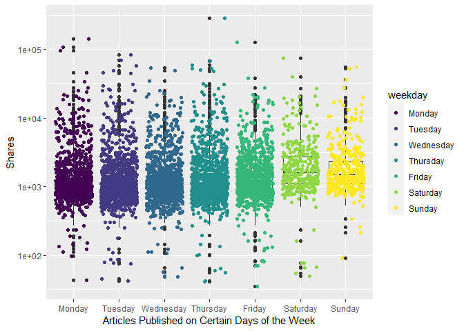<!-- -->

``` r
# when we take the log of the data, we can see easier... Poisson...
# plot scatter after boxplot because we want to see where the majority of the dots are...
#total articles published is actually higher Monday and fewer on the weekend. but boxplots look like they are lower on the weekdays because more articles are published but less shares are occurring...
#plots - scatter plot with boxplot overlayed
# 31. weekday_is_monday: Was the article published on a Monday?
#this one doesnt work bc we need levels...
#ggplot(data=ChannelTrain, aes(y=shares, x=weekday_is_monday)) + geom_point()
# the y - axis is using a log axis not a linear axis, but the plots are more easily interpretable /  visually more ituitive with this transformation.
ggplot(data=ChannelTrain %>% 
              mutate(weekday_fctr = factor(x=weekday_is_monday,  
              levels=c(0,1), labels = c("No", "Yes"))), 
            aes(y=shares, x=weekday_fctr)) + 
            labs(x="Articles Published on Monday", y="Shares", color = "Published") +
            geom_boxplot() + scale_y_log10() +
            geom_point(aes(color=weekday_fctr), position="jitter", alpha=0.4) 
```

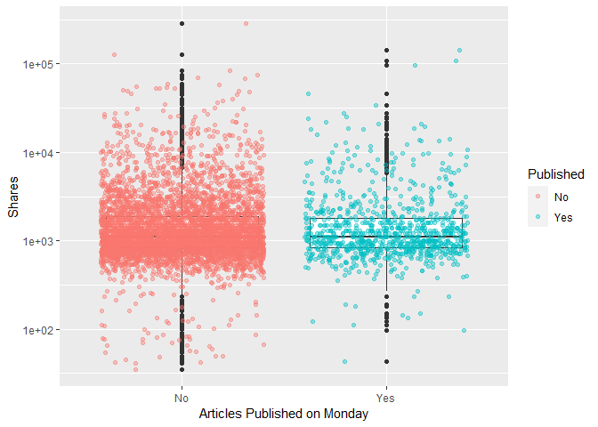<!-- -->

``` r
# 32. weekday_is_tuesday: Was the article published on a Tuesday
ggplot(data=ChannelTrain %>% 
              mutate(weekday_fctr = factor(x=weekday_is_tuesday,  
              levels=c(0,1), labels = c("No", "Yes"))), 
            aes(y=shares, x=weekday_fctr)) + 
            labs(x="Articles Published on Tuesday", y="Shares", color = "Published") +
            geom_boxplot() + scale_y_log10() +
            geom_point(aes(color=weekday_fctr), position="jitter", alpha=0.4) 
```

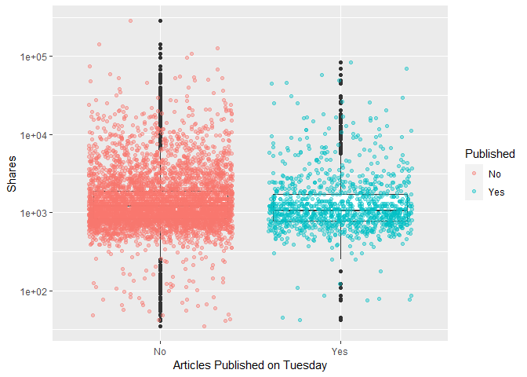<!-- -->

``` r
# 33. weekday_is_wednesday: Was the article published on a Wednesday?
ggplot(data=ChannelTrain %>% 
              mutate(weekday_fctr = factor(x=weekday_is_wednesday,  
              levels=c(0,1), labels = c("No", "Yes"))), 
            aes(y=shares, x=weekday_fctr)) + 
            labs(x="Articles Published on Wednesday", y="Shares", color = "Published") +
            geom_boxplot() + scale_y_log10() +
            geom_point(aes(color=weekday_fctr), position="jitter", alpha=0.4) 
```

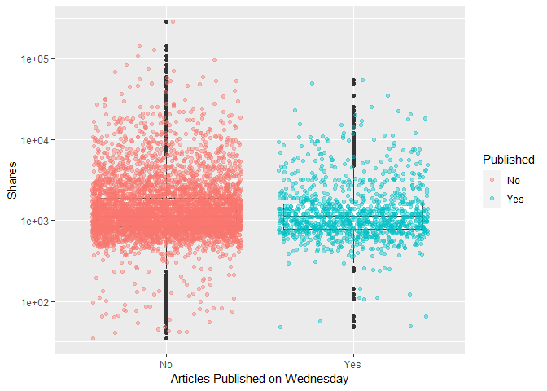<!-- -->

``` r
# 34. weekday_is_thursday: Was the article published on a Thursday?
ggplot(data=ChannelTrain %>% 
              mutate(weekday_fctr = factor(x=weekday_is_thursday,  
              levels=c(0,1), labels = c("No", "Yes"))), 
            aes(y=shares, x=weekday_fctr)) + 
            labs(x="Articles Published on Thursday", y="Shares", color = "Published") +
            geom_boxplot() + scale_y_log10() +
            geom_point(aes(color=weekday_fctr), position="jitter", alpha=0.4) 
```

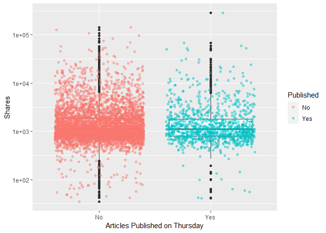<!-- -->

``` r
# 35. weekday_is_friday: Was the article published on a Friday?
ggplot(data=ChannelTrain %>% 
              mutate(weekday_fctr = factor(x=weekday_is_friday,  
              levels=c(0,1), labels = c("No", "Yes"))), 
            aes(y=shares, x=weekday_fctr)) + 
            labs(x="Articles Published on Friday", y="Shares", color = "Published") +
            geom_boxplot() + scale_y_log10() +
            geom_point(aes(color=weekday_fctr), position="jitter", alpha=0.4) 
```

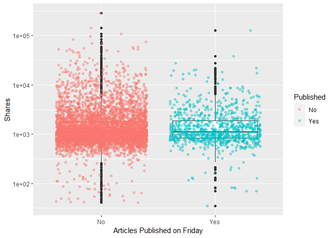<!-- -->

``` r
# 36. weekday_is_saturday: Was the article published on a Saturday?
ggplot(data=ChannelTrain %>% 
              mutate(weekday_fctr = factor(x=weekday_is_saturday,  
              levels=c(0,1), labels = c("No", "Yes"))), 
            aes(y=shares, x=weekday_fctr)) + 
            labs(x="Articles Published on Saturday", y="Shares", color = "Published") +
            geom_boxplot() + scale_y_log10() +
            geom_point(aes(color=weekday_fctr), position="jitter", alpha=0.4) 
```

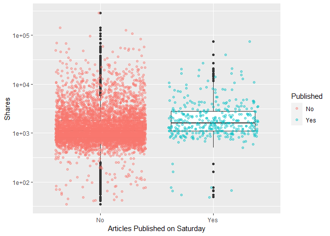<!-- -->

``` r
# 37. weekday_is_sunday: Was the article published on a Sunday?
ggplot(data=ChannelTrain %>% 
              mutate(weekday_fctr = factor(x=weekday_is_sunday,  
              levels=c(0,1), labels = c("No", "Yes"))), 
            aes(y=shares, x=weekday_fctr)) + 
            labs(x="Articles Published on Sunday", y="Shares", color = "Published") +
            geom_boxplot() + scale_y_log10() +
            geom_point(aes(color=weekday_fctr), position="jitter", alpha=0.4) 
```

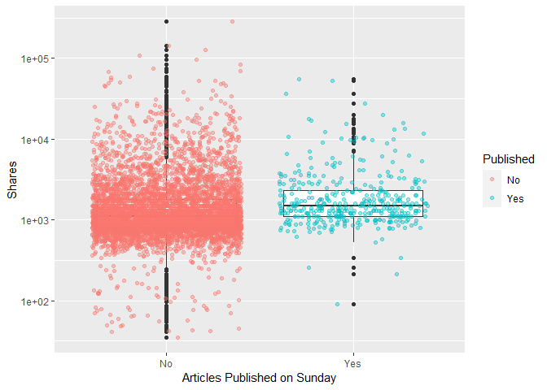<!-- -->

``` r
# # 38. is_weekend: Was the article published on the weekend? 
# ggplot(data=ChannelTrain %>% 
#               mutate(weekday_fctr = factor(x=is_weekend,  
#               levels=c(0,1), labels = c("No", "Yes"))), 
#             aes(y=shares, x=weekday_fctr)) + 
#             labs(x="Articles Published on Monday", y="Shares", color = "Published") +
#             geom_boxplot() + scale_y_log10() +
#             geom_point(aes(color=weekday_fctr), position="jitter") 
# i can make conclusions based on summary() median, min, max, bc i trasfomred for visibility
```

The y - axis is using a log axis not a linear axis, but the plots are
more easily interpretable / visually more intuitive with this
transformation.The general shape of the plots is correct.

We can inspect the trend of shares as a function of the different days
of the week that the articles are published.

If you see a presence of outliers, this may cause the mean to shift in
that direction, but the meidan will not be effected as much. If you see
that the median is not centered within the box, then there is a presence
of skewness in that particular direction. Also, if you see that there
are more observations / dots on one graph while comparing publication
(Yes/No), this is meaningful within the plot itself and also across the
different days of the week.

<!-- might use this later dont delete yet -->

``` r
#what question are we trying to answer here? 
# how to predict shares given the variables you have...
#fitting the model
fit_Channel <- lm(shares ~ . , data = Channel)
#call fit_Lifestyle object - remember this is an lm object
fit_Channel
```

    ## 
    ## Call:
    ## lm(formula = shares ~ ., data = Channel)
    ## 
    ## Coefficients:
    ##                   (Intercept)                 n_tokens_title               n_tokens_content  
    ##                     5.696e+02                      1.118e+02                     -5.003e-01  
    ##               n_unique_tokens               n_non_stop_words       n_non_stop_unique_tokens  
    ##                     2.922e+03                      5.659e+03                     -1.910e+03  
    ##                     num_hrefs                 num_self_hrefs                       num_imgs  
    ##                     3.208e+01                     -4.229e+00                      7.930e+01  
    ##                    num_videos           average_token_length                   num_keywords  
    ##                     5.484e+01                     -1.814e+03                      8.009e-01  
    ##     data_channel_is_lifestyle  data_channel_is_entertainment            data_channel_is_bus  
    ##                            NA                             NA                             NA  
    ##        data_channel_is_socmed           data_channel_is_tech          data_channel_is_world  
    ##                            NA                             NA                             NA  
    ##                    kw_min_min                     kw_max_min                     kw_avg_min  
    ##                     3.165e+00                      1.891e-01                     -1.185e+00  
    ##                    kw_min_max                     kw_max_max                     kw_avg_max  
    ##                    -1.469e-03                      5.597e-04                     -1.455e-03  
    ##                    kw_min_avg                     kw_max_avg                     kw_avg_avg  
    ##                    -4.386e-01                     -1.633e-01                      1.174e+00  
    ##     self_reference_min_shares      self_reference_max_shares     self_reference_avg_sharess  
    ##                    -8.252e-03                     -2.026e-03                      1.323e-02  
    ##             weekday_is_monday             weekday_is_tuesday           weekday_is_wednesday  
    ##                    -8.806e+01                     -3.557e+02                     -6.810e+02  
    ##           weekday_is_thursday              weekday_is_friday            weekday_is_saturday  
    ##                    -1.591e+02                     -4.285e+02                      2.291e+02  
    ##             weekday_is_sunday                     is_weekend                         LDA_00  
    ##                            NA                             NA                     -1.633e+02  
    ##                        LDA_01                         LDA_02                         LDA_03  
    ##                     1.739e+02                     -1.250e+03                      1.024e+03  
    ##                        LDA_04            global_subjectivity      global_sentiment_polarity  
    ##                            NA                      3.094e+03                     -2.868e+03  
    ##    global_rate_positive_words     global_rate_negative_words            rate_positive_words  
    ##                     4.039e+03                      7.062e+03                      1.463e+03  
    ##           rate_negative_words          avg_positive_polarity          min_positive_polarity  
    ##                            NA                     -1.135e+03                      1.279e+03  
    ##         max_positive_polarity          avg_negative_polarity          min_negative_polarity  
    ##                     1.486e+02                      1.416e+03                     -4.080e+02  
    ##         max_negative_polarity             title_subjectivity       title_sentiment_polarity  
    ##                    -3.202e+03                     -1.953e+02                      5.360e+02  
    ##        abs_title_subjectivity   abs_title_sentiment_polarity  
    ##                    -1.074e+02                      6.495e+02

``` r
# check fit_Lifestyle attributes
attributes(fit_Channel)
```

    ## $names
    ##  [1] "coefficients"  "residuals"     "effects"       "rank"          "fitted.values"
    ##  [6] "assign"        "qr"            "df.residual"   "xlevels"       "call"         
    ## [11] "terms"         "model"        
    ## 
    ## $class
    ## [1] "lm"

``` r
fit_Channel[["residuals"]]
```

    ##             1             2             3             4             5             6 
    ##  1198.5281910  1415.2748433  1060.5008181  1408.7482436   447.6142093   714.6086184 
    ##             7             8             9            10            11            12 
    ##  1803.1025962  -262.9199615   404.4644038 -1106.2055834  -333.1022135   280.9330347 
    ##            13            14            15            16            17            18 
    ## -1122.4242432  3610.9926114   888.6769513   305.7373728  1172.4240084  9920.0795373 
    ##            19            20            21            22            23            24 
    ##  -127.2139765  2684.1575384   639.1613757  -118.9126191 -1041.6939168   456.8154355 
    ##            25            26            27            28            29            30 
    ##   426.5459478  4051.1215783  -432.9095252   -19.9011366   367.6892398   379.8811737 
    ##            31            32            33            34            35            36 
    ##  -326.4139652 -1382.5509230     7.3600438   351.5946537  1803.7448018  3327.5877405 
    ##            37            38            39            40            41            42 
    ## 20717.0533711 -1807.0377266  5163.1775086  1208.1615781 -1664.8267949 -1592.3632064 
    ##            43            44            45            46            47            48 
    ##  -191.9365656   920.4462413 -2520.1267651  -343.5667373 -1127.1267316  -738.3401100 
    ##            49            50            51            52            53            54 
    ## -1216.9683935 -2049.8237977 -4088.1913827   278.0275425  -418.1413765 -1373.6655380 
    ##            55            56            57            58            59            60 
    ## -1375.0667419   -42.6718361 -1604.2185831 -1567.7611163 -1719.3100469  -895.4136455 
    ##            61            62            63            64            65            66 
    ## -1627.6586512 -2557.5809866 -1024.4834574  1087.8746901  1827.5751323  -578.2429790 
    ##            67            68            69            70            71            72 
    ##  1278.1180014  -938.9876374  -361.0606197 -1311.6008994  -993.8560140  -439.1273092 
    ##            73            74            75            76            77            78 
    ## -1895.8385847  -208.4202983  2611.7769632 -1236.0451240 -1170.8647185  1342.3780306 
    ##            79            80            81            82            83            84 
    ## -2506.1788174 -1425.5254531  -254.9106254 -2929.3916729 -1326.8492531   171.1147199 
    ##            85            86            87            88            89            90 
    ##   -83.0417884  -713.7690544  4872.4301440 -1267.4179043   531.1781251 -2984.9267680 
    ##            91            92            93            94            95            96 
    ## -1092.8465635    -0.5726951  -871.0270164   604.5721297  6037.3522377 -1554.3123004 
    ##            97            98            99           100           101           102 
    ## -2123.4774769 -3500.4970282   602.5482996  -413.0690977  1158.7086479 -1179.3789510 
    ##           103           104           105           106           107           108 
    ## -2597.7946906  1713.6432653  -415.4504399 -1805.6165886  5256.9335781  -229.1995412 
    ##           109           110           111           112           113           114 
    ## 13836.8775525  -229.3483602  1119.7478788   711.5393571  -799.1348135  -417.7603257 
    ##           115           116           117           118           119           120 
    ## -1038.5637109   114.7250540 -1527.9692820   317.2959077 -1457.1916312 -1201.7738476 
    ##           121           122           123           124           125           126 
    ##    -9.6888158  -968.3599894 -1160.2595694 -1352.6283909  1243.7188284    -8.5853924 
    ##           127           128           129           130           131           132 
    ##  -520.9952561  3045.9744322   848.9825942  1332.7204479  -269.2895949 -3648.8362411 
    ##           133           134           135           136           137           138 
    ##  -827.0991046  -151.9708929   -85.6810591  -372.9755677  -374.5744688 -1731.7350468 
    ##           139           140           141           142           143           144 
    ##   372.0222914    23.1197370  3479.2674929   473.8353408  1463.5649663 -1288.4278590 
    ##           145           146           147           148           149           150 
    ## -6177.7558791 -1006.1566324  -981.3796500 -2858.9396549 -1551.5185809 -3243.0997488 
    ##           151           152           153           154           155           156 
    ## -1168.9806126  -648.2647625  -469.1888290   339.2471757 -1356.4646192  -600.2582833 
    ##           157           158           159           160           161           162 
    ##  -583.7333826 -1619.1328105  1226.4238150   121.4257538  1425.3963499 -2747.8804624 
    ##           163           164           165           166           167           168 
    ##  1011.7933841    -3.9499395   921.1729495  -211.4338899  1095.6249299  8898.3975648 
    ##           169           170           171           172           173           174 
    ##  2555.2285565  7105.4036340 -2731.8527648 -2323.1864447 -1111.8434999  3945.0049418 
    ##           175           176           177           178           179           180 
    ##  1774.2218171   299.9651228  -490.8182495  -506.6860524  -704.0669034  -889.3135045 
    ##           181           182           183           184           185           186 
    ## -1124.0821377  -224.6848464   641.8469894   122.4234774  -375.7372869  -632.1157072 
    ##           187           188           189           190           191           192 
    ##    94.8780292 -1197.5074169  -395.5160101  -740.3220571 -1842.6597102 -3141.6340706 
    ##           193           194           195           196           197           198 
    ##   676.8644390  -879.0942894 -2301.7166070  1121.0500892  -302.6787630  -711.6174440 
    ##           199           200           201           202           203           204 
    ## -1222.3364325  -963.0275674 -1220.4486944  1307.8928997 -1109.3031464 -2154.6720601 
    ##           205           206           207           208           209           210 
    ##  -219.6216333 -2172.9578268 -1485.8274479  -611.9444274 -2533.5359899 -2807.7866195 
    ##           211           212           213           214           215           216 
    ## -1797.4054195    18.5119968   200.6471652   886.1158220 -2083.2098986 -2560.5516698 
    ##           217           218           219           220           221           222 
    ## -2042.1670775  -779.2091332  -736.3049901    87.4087976  -457.6374789   -15.3957380 
    ##           223           224           225           226           227           228 
    ## -1393.6117191  -457.8670736   -12.3004639   -73.2424170  -852.5611839  -818.2182598 
    ##           229           230           231           232           233           234 
    ##  -109.6477103   820.1765402 -2139.3236741  2681.9828748 -1003.7258152 -1602.3320166 
    ##           235           236           237           238           239           240 
    ## -2393.3493900  -875.8769769  5706.4409906   432.8851432  -467.4184227   164.9462702 
    ##           241           242           243           244           245           246 
    ##   616.4064337    48.2836183 -5021.9012545   -12.9702610  -637.2195618  -848.6396628 
    ##           247           248           249           250           251           252 
    ## -1075.8822507  -304.2607992  -655.1870273   198.9185799  -753.9908224  -639.7620233 
    ##           253           254           255           256           257           258 
    ##  1618.0553069  -179.3398870  -773.3354294 -2301.3163689  2728.8509660   422.8790688 
    ##           259           260           261           262           263           264 
    ##  9953.4534709 -2150.6825026 -1209.7917465 -1113.4348780  -486.5630470  1639.7977572 
    ##           265           266           267           268           269           270 
    ##  -526.9607295  -744.9738310   881.6379939    97.4674765  3983.1326837  -322.5408101 
    ##           271           272           273           274           275           276 
    ##  1427.3102424  -712.7510413  1917.9442824 -1704.0385594 -3260.4571846 -2984.7793090 
    ##           277           278           279           280           281           282 
    ## -1848.7189615 -1160.9814905    -0.2600715 -2115.5430761  1961.4209820 -3802.0348932 
    ##           283           284           285           286           287           288 
    ##  -277.1894787  -128.7482814  1576.0965652   212.9317731 -1034.9482529  1195.7152056 
    ##           289           290           291           292           293           294 
    ##   541.8295192  -687.5854383  3159.1983909  -724.5293395    94.4327474   -69.9720488 
    ##           295           296           297           298           299           300 
    ## -2056.4767265   -67.3157697  2871.6966248 -1853.6351822  -226.1773749 -4082.8244056 
    ##           301           302           303           304           305           306 
    ## -1211.6788133  -286.0376225   875.7753260  -667.8329063 -1484.9242460    29.8589644 
    ##           307           308           309           310           311           312 
    ## -1483.3666242   538.3539930 -2116.6804936  -360.7987928  -363.3760506  1910.2438493 
    ##           313           314           315           316           317           318 
    ## -2134.7328640   -39.5317876 -2849.5537336 -1442.8630704  -114.6090960  -759.0167769 
    ##           319           320           321           322           323           324 
    ##   396.7280647 -1910.7586178 -2393.7310265 -1038.3399656  -644.3079744 -2940.0847452 
    ##           325           326           327           328           329           330 
    ##  4097.7757602  -631.2564277  -400.0989392  9577.2797246 -1318.3017081  1357.7273226 
    ##           331           332           333           334           335           336 
    ##    26.6394524 -2091.4777492   218.1913911 -1077.2995147 -2364.7825625  7860.3871572 
    ##           337           338           339           340           341           342 
    ##   147.4505798   190.9868619  1188.3037932 -1614.4066122  4098.1115080    86.0021596 
    ##           343           344           345           346           347           348 
    ## -1783.3430732  3167.7962656   399.2951548  -402.7646302 -2019.1303404 -1890.4521556 
    ##           349           350           351           352           353           354 
    ## -5146.9599354  -969.0681049 -1454.4130092  -818.8668744  2098.3732194   208.0838046 
    ##           355           356           357           358           359           360 
    ## -1975.8813312  -274.9956174   -73.5717237  -688.2435241  -413.5914254   782.7501170 
    ##           361           362           363           364           365           366 
    ## -1178.3248441 -1253.8395409 -1241.9346601 -1291.2183204  -947.2404466  -259.8023529 
    ##           367           368           369           370           371           372 
    ## -2961.4105186 -2162.5179016  7603.2223437  -668.4519105  4093.5591527  2836.6112925 
    ##           373           374           375           376           377           378 
    ## -1915.6231016  -363.1802243 -1023.0292204 -1694.3479975  -390.7642700 -4070.9743561 
    ##           379           380           381           382           383           384 
    ##  -251.3627842   734.9968577 16508.4639375 -2803.0857575 -3651.7847283  -647.0125128 
    ##           385           386           387           388           389           390 
    ## -1907.0641289  -345.7411963 -1829.8013867   996.0507571  -528.6281792   784.8661607 
    ##           391           392           393           394           395           396 
    ## -2969.9594478  6901.1587660   486.5083455 -1154.3218049  -104.0052913  1586.8852032 
    ##           397           398           399           400           401           402 
    ## -1092.5864569   498.3380197  2434.3411895  -323.0033685 -2929.3585734  -302.5336817 
    ##           403           404           405           406           407           408 
    ## -2502.6657040 -1651.9750935   454.7559677 44458.1577411  -893.2259901 -4423.9998063 
    ##           409           410           411           412           413           414 
    ##  -864.4727061  -931.7954275  -395.9730368  1213.8263365  -759.5143215  -847.9999996 
    ##           415           416           417           418           419           420 
    ## -2657.3281685 -2035.9318375  3193.7930136 -1192.3615480  -701.3123135  -626.0227346 
    ##           421           422           423           424           425           426 
    ##  1861.7729527  -154.5053805  8329.5029983   713.5999253  2220.6935489 -2121.0662388 
    ##           427           428           429           430           431           432 
    ## -1260.0721219   533.7960855 -1450.4360987 -3046.6980929 -1561.0800878    58.9207219 
    ##           433           434           435           436           437           438 
    ##  -453.4466783  -683.8927858  -813.2651410  -450.7912509 -1211.2865072  -290.5898277 
    ##           439           440           441           442           443           444 
    ##  -987.0050961 -1314.1468473  -574.5549106  -110.3374620   125.7262366  -366.6433476 
    ##           445           446           447           448           449           450 
    ## -1123.7326482  -160.5656393  -790.8763253  -581.3544645 -1529.4530785 -1213.1220568 
    ##           451           452           453           454           455           456 
    ##  7065.1549829  -547.7273209  -482.2529210 -1817.7623379 -2133.1218254   435.6856538 
    ##           457           458           459           460           461           462 
    ##   394.1449831 -1988.7498615  -182.8034168  2826.4365872 -2526.8830502 -1717.4785072 
    ##           463           464           465           466           467           468 
    ##  1407.9101437 -4602.3035513  -476.8194350 -1661.3264209 -2926.0542090   597.9161059 
    ##           469           470           471           472           473           474 
    ## -2005.6355053 -1785.7445789 -1092.1913603  -599.9728861 17479.0244672 -1718.0227670 
    ##           475           476           477           478           479           480 
    ## -1387.8444978   153.0171206 -1677.5450379 -1876.4326079 -1678.1862955  1762.7248511 
    ##           481           482           483           484           485           486 
    ##  -869.9399732  -459.2937455 -1318.7468988  7386.3096849 -2879.1967013  -437.6026139 
    ##           487           488           489           490           491           492 
    ##  -744.2919194   659.5250723  -362.9791265 -1640.0362241  -616.6534956  -703.7240315 
    ##           493           494           495           496           497           498 
    ##  -565.3368158 -2022.6488774 -1116.3701963  -225.5817986  -244.5616603 -3285.6690046 
    ##           499           500           501           502           503           504 
    ##  -835.7106444 -5114.8014872 -2265.7817917  1439.1705024 -1816.3231073 -4124.9881067 
    ##           505           506           507           508           509           510 
    ## -1804.1637823 -3863.1135544  -810.8691158  -936.2048406  -309.6486969   237.8047352 
    ##           511           512           513           514           515           516 
    ##   158.8691411 -2956.5000702 -1860.2703300  -363.3202177 -2307.1274310 -1447.4863783 
    ##           517           518           519           520           521           522 
    ##  2155.7556116  1564.2465736 -2721.9971264 -2453.4312198 -1263.6263339 -1038.5640746 
    ##           523           524           525           526           527           528 
    ##   869.5338653 -1346.3471291 -2107.0809227   313.4392941   338.7519458 -1361.9638681 
    ##           529           530           531           532           533           534 
    ##   696.3268041  -358.8851718  -470.7137292 -1511.1530033  4957.5659087  -852.5569340 
    ##           535           536           537           538           539           540 
    ##   795.9542922    54.5524504  -376.9325667   971.9270542   -45.6938674  1470.4573802 
    ##           541           542           543           544           545           546 
    ##  1212.1972277  -277.9641836  4625.4753294  6754.4032133 -2383.0600343 -2251.6006572 
    ##           547           548           549           550           551           552 
    ##  -552.1301592 -1032.9802773     7.3411844  1177.5157182 -1074.6861353 -1685.7239189 
    ##           553           554           555           556           557           558 
    ##  -686.7639404  -564.2925355  -190.6236399 -3018.2524045 -1509.5639288 -1920.7395145 
    ##           559           560           561           562           563           564 
    ##  5823.7949590 -1555.3346647   241.0431500  5854.7129388  7342.7499651  -650.1800051 
    ##           565           566           567           568           569           570 
    ## -1265.9672881  1294.4471678 24401.4922229 -3094.9315772  -287.8775735 -5603.8824048 
    ##           571           572           573           574           575           576 
    ## 46493.1409841 -2258.9508453  7041.4725622 -1554.1491357 -1292.8736112  -709.8519548 
    ##           577           578           579           580           581           582 
    ## -1556.3256688  -868.6826992  -159.8032713  -148.1253565 16292.1252806   840.5672148 
    ##           583           584           585           586           587           588 
    ## -1283.8588091  1407.9487077  -612.3271698 -2547.0128205  1055.4206898 -2142.6977882 
    ##           589           590           591           592           593           594 
    ## -1081.5719866   605.8869273  7726.4343648  2751.0991392 -2955.4381545  -693.8817206 
    ##           595           596           597           598           599           600 
    ##  -923.6337101  -910.1259488  -959.9157225 -5791.5570567 -1820.7165999   116.7502532 
    ##           601           602           603           604           605           606 
    ## -1655.3399121  2801.3386225 -1179.2898349    47.4638720 -1161.2449517  2843.1628740 
    ##           607           608           609           610           611           612 
    ## -1747.1113921  -387.3172325 -3451.2775757 -2672.1277136 -1607.2798613 -1733.0422711 
    ##           613           614           615           616           617           618 
    ## -3718.9330960 -1625.2227277 -3146.4321352  -297.8159071  -414.7065736  -265.8808207 
    ##           619           620           621           622           623           624 
    ##  -427.6748194  1417.5696550  1610.8055864   214.5385750  1694.9051420  -986.1305079 
    ##           625           626           627           628           629           630 
    ##    -9.0351032  -295.1535428  -371.6236338   121.2984064  -883.5808883  -292.6567809 
    ##           631           632           633           634           635           636 
    ##  1526.2546014 -2495.4702126   604.0893709  -479.5726801   163.7594321   500.6749143 
    ##           637           638           639           640           641           642 
    ##  -411.9108797 -3557.8765199 -1982.8157331  2354.0933844   519.2493389   168.7189644 
    ##           643           644           645           646           647           648 
    ## 11653.8064286   423.6449188   780.2704669   709.3103100 -1516.4986618  -441.2518841 
    ##           649           650           651           652           653           654 
    ## -1335.9447898    34.4590296  6688.5379786  -464.4568810  3122.6995647   519.8706144 
    ##           655           656           657           658           659           660 
    ##  -100.7299354   635.4732808  2243.3297313 -1720.0532133  -894.8702520  -138.1750505 
    ##           661           662           663           664           665           666 
    ##  1443.4154933  -139.7011580  -154.3434901 -1715.4515604   572.7645688  -199.4385862 
    ##           667           668           669           670           671           672 
    ##  1352.3265212  2435.7083875    30.2431685   413.1559722   123.2296174  -801.5246493 
    ##           673           674           675           676           677           678 
    ##   660.8202875 -1909.4924841  -146.6419091  -315.9142203 -1293.4231876  -593.7746153 
    ##           679           680           681           682           683           684 
    ## -1175.5187437   310.1906552   827.3208982  5549.0595135 -1428.3783113 10512.8397793 
    ##           685           686           687           688           689           690 
    ##   874.3043698  7574.2988470  -932.8589987 -1234.9668944     4.9299820  -493.7507220 
    ##           691           692           693           694           695           696 
    ##   869.2620275  -902.7559030  -146.3909383 -2963.8907297   370.8901386   985.1456325 
    ##           697           698           699           700           701           702 
    ## -4477.6868730  -514.5751683  -915.3915894  2261.3454042  -570.1160541  -584.8514965 
    ##           703           704           705           706           707           708 
    ##  -184.5193808   354.6299850  -427.8771898  -920.4562642  1505.1812004   869.3310637 
    ##           709           710           711           712           713           714 
    ##   923.1034566  -821.0728126 -1956.6221981   -68.1017633    59.1884700  -259.9142110 
    ##           715           716           717           718           719           720 
    ##  -712.9264207   127.1346122  -219.4047808 -1913.3039097  1730.2301663  -875.1335033 
    ##           721           722           723           724           725           726 
    ##  5433.9859723 -2269.3766224 -1659.9116423  4459.1193106  -442.6743066  -996.2337020 
    ##           727           728           729           730           731           732 
    ##  1284.8728571 -5248.0176313 45598.7627859  2491.6912767  2326.5776841   495.1754193 
    ##           733           734           735           736           737           738 
    ## -1826.8515094  -655.6816753   191.6053935   679.2517374  -866.6014931  2224.4837987 
    ##           739           740           741           742           743           744 
    ##   772.0393761  6008.3543185   282.9440785 -1437.3995270  -199.8730481   328.0470587 
    ##           745           746           747           748           749           750 
    ##  1511.4375605 -1177.2616758  -819.6632279  1730.9337836   -37.6230139  -800.1554046 
    ##           751           752           753           754           755           756 
    ## -2335.5900691 -4304.3808366 -1141.4973912  -889.6749366  3531.1712576  -816.2554628 
    ##           757           758           759           760           761           762 
    ##  -838.9249486  -403.5227466 -2987.8184338 -1784.7169579   808.6481760   343.9319160 
    ##           763           764           765           766           767           768 
    ##   -60.1371945 -2951.1142737   565.2816333  -233.6452444 -2105.3802506  3515.9042449 
    ##           769           770           771           772           773           774 
    ##   804.8640439  1854.8938023  -601.3414060  -704.1144615  -428.8791111   374.8558147 
    ##           775           776           777           778           779           780 
    ## -1266.9543005  2781.1721040  -753.3174755  -598.5108794  -462.0606659  1440.4523929 
    ##           781           782           783           784           785           786 
    ## -1803.4726486   146.5867808    71.8824630   -41.3143011  6093.1353934     9.8137036 
    ##           787           788           789           790           791           792 
    ##   806.8659679 -1167.2809234 -2215.8836384   758.3701720  -876.1248500  -834.6815259 
    ##           793           794           795           796           797           798 
    ## -1367.4325061   146.8775966 -2882.2386349 -2555.4183051  -764.5798611 -1215.3201622 
    ##           799           800           801           802           803           804 
    ##  2004.2655812 10965.5482811  -429.3639098   366.9436131  1285.6388558  -443.5252464 
    ##           805           806           807           808           809           810 
    ## -1926.8516158  -477.8636462  -205.7046878   175.4510684   -75.1380696  1411.0542604 
    ##           811           812           813           814           815           816 
    ##   259.8469817  -748.2322225 -1337.4275378   936.2979957   520.9631957   281.6182902 
    ##           817           818           819           820           821           822 
    ##   418.2389999   -49.5055384  4129.2139879   950.0998999  -956.6571894  -410.8884025 
    ##           823           824           825           826           827           828 
    ##   221.1193863 -1581.4441005   660.1199924   362.9411988  1320.3964528   104.0803328 
    ##           829           830           831           832           833           834 
    ##    98.4459453 -1727.4231047  -534.7888497  1402.6528240  -446.9302847  1050.7308701 
    ##           835           836           837           838           839           840 
    ##  5809.0458588    12.8927310   -41.3577417 -1507.2302145 -1184.6155371  -215.6278054 
    ##           841           842           843           844           845           846 
    ##    36.5415492  1058.4651238    39.7119605  -258.6978873  -303.5885919   488.6357542 
    ##           847           848           849           850           851           852 
    ##   701.7244754  -535.4141240   -30.9154945  1054.4570851   217.0975943  -837.0095957 
    ##           853           854           855           856           857           858 
    ##    61.0002874  5289.0353622  -786.3379443  2283.2544945  1991.7630231 -1629.0910710 
    ##           859           860           861           862           863           864 
    ##  -158.0066028  -364.1480182  -609.4298299  -752.8320998 -1653.8344753  2641.2409855 
    ##           865           866           867           868           869           870 
    ## -2879.9617771  -865.7300062  -190.8709242 -1168.8531109  -349.5540953  -239.2518652 
    ##           871           872           873           874           875           876 
    ## -2306.4889765  8815.6722824 -4941.6893384  -665.5503752 -1288.4969024 -1301.6734638 
    ##           877           878           879           880           881           882 
    ## -4062.8428172 -2765.5534993 -2287.2063572 -1797.3823566    11.8718614 -1382.3823933 
    ##           883           884           885           886           887           888 
    ##    41.0416390 -3250.7918028 -1871.4774221  -348.5611283  1702.8596978 -3547.7907036 
    ##           889           890           891           892           893           894 
    ## -1570.1866142  2663.0724997 -1758.9384129  -142.9014405   425.6780608  -658.3055140 
    ##           895           896           897           898           899           900 
    ##  -608.3437809  8372.6323628 -1648.0541087  -320.2595818   864.1240411  3805.0462891 
    ##           901           902           903           904           905           906 
    ##   796.4009391 -1623.9874233   869.8252049 17080.8240054  -751.0553612 -2047.1578898 
    ##           907           908           909           910           911           912 
    ##    78.1104703 -2218.8751222  -729.4051739 -1156.3099935   609.1457129 -1522.9681830 
    ##           913           914           915           916           917           918 
    ##   306.6786527  4792.6864630  -538.7528647 -1843.1091090 -2243.6976569 -2291.1743371 
    ##           919           920           921           922           923           924 
    ##  1638.3820658 -2328.5784902  2112.7043140 -1117.4220869  -926.8686516  -775.5532744 
    ##           925           926           927           928           929           930 
    ## -1267.4154939  1099.7557304  -789.3093146 -1006.7212218 -1663.4343257  7612.3925182 
    ##           931           932           933           934           935           936 
    ##   701.3583749 -1904.8093457  3263.3613941  2003.1605865  -786.3857206  -354.5706228 
    ##           937           938           939           940           941           942 
    ## -2283.8171133  -247.5549791  -677.2951835 -1508.6965796  2157.6253733   264.7593477 
    ##           943           944           945           946           947           948 
    ## -2050.6156183  -370.8102538 -1491.3364950  -671.4118868  -368.1368788  -917.8678934 
    ##           949           950           951           952           953           954 
    ##  1106.1513774  -620.0466579 -1120.4253550   230.0224543  -991.5453121 -1516.1746779 
    ##           955           956           957           958           959           960 
    ##  -550.9618640 -1511.1029906 -5020.9249121 -1282.3538083  -211.9132687   500.0439264 
    ##           961           962           963           964           965           966 
    ##  1314.7758720   875.0336190 -1611.8646181  2450.1861624 -2541.5931111 -1002.5839657 
    ##           967           968           969           970           971           972 
    ## -1618.4503654  1463.9729079 -2991.2082168 -1182.3039809 -2517.2626099  1081.7002933 
    ##           973           974           975           976           977           978 
    ## -3118.9252051 -1048.6514552 -1013.3405498  -536.2493331 -1799.8773951 -2777.3698893 
    ##           979           980           981           982           983           984 
    ##  -858.3782417  -242.8727796   367.0587704  -224.5416217  -455.8867362  -325.9401894 
    ##           985           986           987           988           989           990 
    ##   877.0896687 -3940.1962856 16210.1802606 -1147.6902607  3781.5965603  3949.9108127 
    ##           991           992           993           994           995           996 
    ## -1409.7164017  2196.5914391 -1233.7115711   460.5513105 -1271.8061561   162.7701365 
    ##           997           998           999          1000 
    ##  -803.0731385   158.5989939   144.5844738 -1428.9913607 
    ##  [ reached getOption("max.print") -- omitted 7427 entries ]

``` r
#summary stats for vars of interest - 
plot(fit_Channel)
```

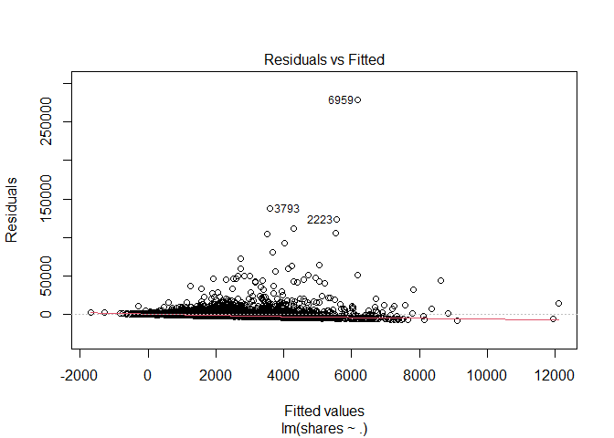<!-- -->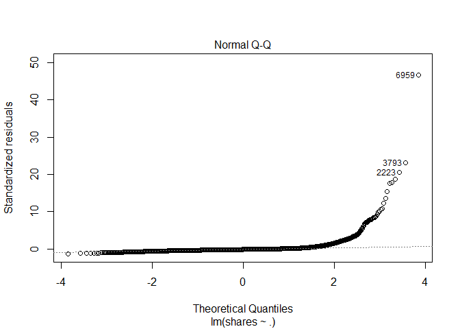<!-- -->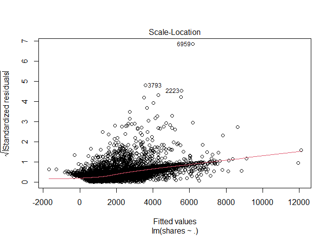<!-- -->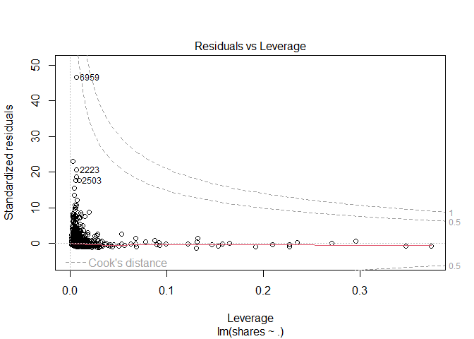<!-- -->

``` r
ggplot(data=fit_Channel, aes(y=shares, x=rate_positive_words)) + geom_point()
```

<!-- -->

``` r
#EDA
#starting point... correlation - shares vs. each var
#every pairwise combo
Channel_corr <- cor(x=Channel %>% 
                          select (shares, starts_with("weekday_is_") ) )
# cor_mat <- cor(data %>% select(RentedBikeCount, Temperature, Humidity, WindSpeed,
# Hour, Visibility, DewPointTemp,
# Rainfall, Snowfall), method = "pearson")
# corrplot(cor_mat, hc.order = TRUE,
# type = "lower",
# tl.pos = "lt",
# title = "Correlation Coefficients for Bike Rental Data",
# subtitle = "Correlation Coefficients for Bike Rental Data",
# mar=c(0,0,2,0)
# )
#call Channel_corr object to look at correlation between vars and shares response var
#drop to keep in matrix and not turn into a vector
shares_corr <- Channel_corr[ ,"shares", drop=FALSE]
#shares_corr <- Channel_corr[ ,"shares"]
is(shares_corr) #matrix with the drop=TRUE option
```

    ## [1] "matrix"    "array"     "mMatrix"   "structure" "vector"

``` r
#convert to tibble
#shares_corr_tibble <- as.tibble(shares_corr)
shares_corr_tibble <- bind_cols( var_names = rownames(shares_corr), shares_corr ) 
#call shares_corr_tibble object that has correlations with shares and vars...
shares_corr_tibble
```

    ## # A tibble: 8 × 2
    ##   var_names              shares
    ##   <chr>                   <dbl>
    ## 1 shares                1      
    ## 2 weekday_is_monday     0.0121 
    ## 3 weekday_is_tuesday   -0.00526
    ## 4 weekday_is_wednesday -0.0320 
    ## 5 weekday_is_thursday   0.00835
    ## 6 weekday_is_friday    -0.00417
    ## 7 weekday_is_saturday   0.0199 
    ## 8 weekday_is_sunday     0.0140

``` r
# condition on +/- 0.9 to see what we should remove as a predictor for the model
# call shares_corr_tibble object
#shares_corr_tibble #this currently does not have row names...
rownames(shares_corr)
```

    ## [1] "shares"               "weekday_is_monday"    "weekday_is_tuesday"  
    ## [4] "weekday_is_wednesday" "weekday_is_thursday"  "weekday_is_friday"   
    ## [7] "weekday_is_saturday"  "weekday_is_sunday"

``` r
#checking structure and type of object
#str(Channel_corr)
#is(Channel_corr)
#finds highly correlated variables and you can set a cutoff (default is +/ 0.9)
#convert to tibble because using drylr chaining / piping
corr_vars <- as.tibble ( Channel_corr[ ,"shares"] ) %>%
             filter ( abs(value) >= 0.9 )
#dont need this anymore...
#corr_vars <- findCorrelation(x=Can_corr, cutoff = +/- 0.9, verbose = TRUE, names = TRUE)
#call corr_vars object
#corr_vars
#columns that are highly correlated and should be removed from the model
#5 13 22
# [1] "n_non_stop_unique_tokens"  "kw_max_min" "self_reference_max_shares"
#response variable is shares, but what does that mean given certain variables available to us?
#maybe look at days of the week variables?
#figure out what kind of object we want to make to answer our question...
#tibble keeping what kind of vars, matrix?
#need to do some sort of type of EDA in order to see if variables are highly correlated
#here we need to summary statistics via summary() and plots
#this shows the summary stats for each variable in our dataset...
Lifestlye_sumstats_Train <- summary(ChannelTrain)
#calling Lifestlye_sumstats_Train object to see our summary stats
Lifestlye_sumstats_Train
```

    ##  n_tokens_title  n_tokens_content n_unique_tokens  n_non_stop_words n_non_stop_unique_tokens
    ##  Min.   : 4.00   Min.   :   0.0   Min.   :0.0000   Min.   :0.0000   Min.   :0.0000          
    ##  1st Qu.: 9.00   1st Qu.: 330.0   1st Qu.:0.4655   1st Qu.:1.0000   1st Qu.:0.6269          
    ##  Median :11.00   Median : 507.5   Median :0.5201   Median :1.0000   Median :0.6835          
    ##  Mean   :10.58   Mean   : 596.9   Mean   :0.5102   Mean   :0.9676   Mean   :0.6639          
    ##  3rd Qu.:12.00   3rd Qu.: 768.0   3rd Qu.:0.5751   3rd Qu.:1.0000   3rd Qu.:0.7352          
    ##  Max.   :23.00   Max.   :4661.0   Max.   :0.9762   Max.   :1.0000   Max.   :1.0000          
    ##    num_hrefs     num_self_hrefs      num_imgs         num_videos      average_token_length
    ##  Min.   :  0.0   Min.   : 0.000   Min.   :  0.000   Min.   : 0.0000   Min.   :0.000       
    ##  1st Qu.:  5.0   1st Qu.: 1.000   1st Qu.:  1.000   1st Qu.: 0.0000   1st Qu.:4.655       
    ##  Median :  8.0   Median : 2.000   Median :  1.000   Median : 0.0000   Median :4.821       
    ##  Mean   : 10.2   Mean   : 2.426   Mean   :  2.923   Mean   : 0.5353   Mean   :4.670       
    ##  3rd Qu.: 13.0   3rd Qu.: 3.000   3rd Qu.:  2.000   3rd Qu.: 1.0000   3rd Qu.:4.972       
    ##  Max.   :161.0   Max.   :38.000   Max.   :100.000   Max.   :22.0000   Max.   :6.124       
    ##   num_keywords    data_channel_is_lifestyle data_channel_is_entertainment
    ##  Min.   : 2.000   Min.   :0                 Min.   :0                    
    ##  1st Qu.: 6.000   1st Qu.:0                 1st Qu.:0                    
    ##  Median : 7.000   Median :0                 Median :0                    
    ##  Mean   : 7.296   Mean   :0                 Mean   :0                    
    ##  3rd Qu.: 9.000   3rd Qu.:0                 3rd Qu.:0                    
    ##  Max.   :10.000   Max.   :0                 Max.   :0                    
    ##  data_channel_is_bus data_channel_is_socmed data_channel_is_tech data_channel_is_world
    ##  Min.   :0           Min.   :0              Min.   :0            Min.   :1            
    ##  1st Qu.:0           1st Qu.:0              1st Qu.:0            1st Qu.:1            
    ##  Median :0           Median :0              Median :0            Median :1            
    ##  Mean   :0           Mean   :0              Mean   :0            Mean   :1            
    ##  3rd Qu.:0           3rd Qu.:0              3rd Qu.:0            3rd Qu.:1            
    ##  Max.   :0           Max.   :0              Max.   :0            Max.   :1            
    ##    kw_min_min       kw_max_min       kw_avg_min        kw_min_max       kw_max_max    
    ##  Min.   : -1.00   Min.   :     0   Min.   :   -1.0   Min.   :     0   Min.   :     0  
    ##  1st Qu.: -1.00   1st Qu.:   427   1st Qu.:  116.6   1st Qu.:     0   1st Qu.:843300  
    ##  Median : -1.00   Median :   627   Median :  203.9   Median :  1000   Median :843300  
    ##  Mean   : 14.93   Mean   :  1020   Mean   :  265.8   Mean   :  7028   Mean   :787432  
    ##  3rd Qu.:  4.00   3rd Qu.:   928   3rd Qu.:  320.5   3rd Qu.:  5100   3rd Qu.:843300  
    ##  Max.   :217.00   Max.   :139600   Max.   :18687.8   Max.   :141400   Max.   :843300  
    ##    kw_avg_max       kw_min_avg       kw_max_avg       kw_avg_avg   
    ##  Min.   :     0   Min.   :  -1.0   Min.   :     0   Min.   :    0  
    ##  1st Qu.:179456   1st Qu.:   0.0   1st Qu.:  3457   1st Qu.: 2074  
    ##  Median :222079   Median : 822.7   Median :  3588   Median : 2403  
    ##  Mean   :229343   Mean   : 836.2   Mean   :  4751   Mean   : 2528  
    ##  3rd Qu.:274975   3rd Qu.:1593.5   3rd Qu.:  4733   3rd Qu.: 2783  
    ##  Max.   :685260   Max.   :3009.0   Max.   :139600   Max.   :17839  
    ##  self_reference_min_shares self_reference_max_shares self_reference_avg_sharess
    ##  Min.   :     0.0          Min.   :     0.0          Min.   :     0.0          
    ##  1st Qu.:   470.5          1st Qu.:   700.5          1st Qu.:   677.1          
    ##  Median :   978.0          Median :  1700.0          Median :  1400.0          
    ##  Mean   :  2815.5          Mean   :  6329.2          Mean   :  4195.7          
    ##  3rd Qu.:  1800.0          3rd Qu.:  4500.0          3rd Qu.:  3200.0          
    ##  Max.   :690400.0          Max.   :690400.0          Max.   :690400.0          
    ##  weekday_is_monday weekday_is_tuesday weekday_is_wednesday weekday_is_thursday
    ##  Min.   :0.0000    Min.   :0.0000     Min.   :0.0000       Min.   :0.0000     
    ##  1st Qu.:0.0000    1st Qu.:0.0000     1st Qu.:0.0000       1st Qu.:0.0000     
    ##  Median :0.0000    Median :0.0000     Median :0.0000       Median :0.0000     
    ##  Mean   :0.1573    Mean   :0.1861     Mean   :0.1863       Mean   :0.1825     
    ##  3rd Qu.:0.0000    3rd Qu.:0.0000     3rd Qu.:0.0000       3rd Qu.:0.0000     
    ##  Max.   :1.0000    Max.   :1.0000     Max.   :1.0000       Max.   :1.0000     
    ##  weekday_is_friday weekday_is_saturday weekday_is_sunday   is_weekend         LDA_00       
    ##  Min.   :0.00      Min.   :0.00000     Min.   :0.00000   Min.   :0.0000   Min.   :0.01818  
    ##  1st Qu.:0.00      1st Qu.:0.00000     1st Qu.:0.00000   1st Qu.:0.0000   1st Qu.:0.02500  
    ##  Median :0.00      Median :0.00000     Median :0.00000   Median :0.0000   Median :0.02972  
    ##  Mean   :0.16      Mean   :0.06102     Mean   :0.06678   Mean   :0.1278   Mean   :0.06598  
    ##  3rd Qu.:0.00      3rd Qu.:0.00000     3rd Qu.:0.00000   3rd Qu.:0.0000   3rd Qu.:0.04001  
    ##  Max.   :1.00      Max.   :1.00000     Max.   :1.00000   Max.   :1.0000   Max.   :0.81801  
    ##      LDA_01            LDA_02           LDA_03            LDA_04        global_subjectivity
    ##  Min.   :0.01818   Min.   :0.0200   Min.   :0.01820   Min.   :0.02000   Min.   :0.0000     
    ##  1st Qu.:0.02240   1st Qu.:0.5261   1st Qu.:0.02500   1st Qu.:0.02857   1st Qu.:0.3562     
    ##  Median :0.02858   Median :0.7298   Median :0.02962   Median :0.04000   Median :0.4128     
    ##  Mean   :0.05473   Mean   :0.6698   Mean   :0.07323   Mean   :0.13625   Mean   :0.4012     
    ##  3rd Qu.:0.04000   3rd Qu.:0.8599   3rd Qu.:0.04011   3rd Qu.:0.20061   3rd Qu.:0.4648     
    ##  Max.   :0.81511   Max.   :0.9200   Max.   :0.81603   Max.   :0.91954   Max.   :0.9500     
    ##  global_sentiment_polarity global_rate_positive_words global_rate_negative_words
    ##  Min.   :-0.32273          Min.   :0.00000            Min.   :0.00000           
    ##  1st Qu.: 0.02165          1st Qu.:0.02184            1st Qu.:0.01092           
    ##  Median : 0.07315          Median :0.03058            Median :0.01644           
    ##  Mean   : 0.07690          Mean   :0.03126            Mean   :0.01693           
    ##  3rd Qu.: 0.12708          3rd Qu.:0.03967            3rd Qu.:0.02222           
    ##  Max.   : 0.52000          Max.   :0.11273            Max.   :0.07143           
    ##  rate_positive_words rate_negative_words avg_positive_polarity min_positive_polarity
    ##  Min.   :0.0000      Min.   :0.0000      Min.   :0.0000        Min.   :0.00000      
    ##  1st Qu.:0.5333      1st Qu.:0.2432      1st Qu.:0.2800        1st Qu.:0.05000      
    ##  Median :0.6429      Median :0.3450      Median :0.3309        Median :0.10000      
    ##  Mean   :0.6232      Mean   :0.3444      Mean   :0.3240        Mean   :0.08845      
    ##  3rd Qu.:0.7445      3rd Qu.:0.4483      3rd Qu.:0.3793        3rd Qu.:0.10000      
    ##  Max.   :1.0000      Max.   :1.0000      Max.   :0.8667        Max.   :0.80000      
    ##  max_positive_polarity avg_negative_polarity min_negative_polarity max_negative_polarity
    ##  Min.   :0.0000        Min.   :-1.0000       Min.   :-1.0000       Min.   :-1.00000     
    ##  1st Qu.:0.5000        1st Qu.:-0.3088       1st Qu.:-0.8000       1st Qu.:-0.10000     
    ##  Median :0.7000        Median :-0.2460       Median :-0.5000       Median :-0.10000     
    ##  Mean   :0.6975        Mean   :-0.2515       Mean   :-0.5599       Mean   :-0.09356     
    ##  3rd Qu.:0.9000        3rd Qu.:-0.1908       3rd Qu.:-0.4000       3rd Qu.:-0.05000     
    ##  Max.   :1.0000        Max.   : 0.0000       Max.   : 0.0000       Max.   : 0.00000     
    ##  title_subjectivity title_sentiment_polarity abs_title_subjectivity
    ##  Min.   :0.00000    Min.   :-1.00000         Min.   :0.0000        
    ##  1st Qu.:0.00000    1st Qu.: 0.00000         1st Qu.:0.2000        
    ##  Median :0.03542    Median : 0.00000         Median :0.5000        
    ##  Mean   :0.24826    Mean   : 0.02920         Mean   :0.3603        
    ##  3rd Qu.:0.45455    3rd Qu.: 0.06818         3rd Qu.:0.5000        
    ##  Max.   :1.00000    Max.   : 1.00000         Max.   :0.5000        
    ##  abs_title_sentiment_polarity     shares      
    ##  Min.   :0.0000               Min.   :    35  
    ##  1st Qu.:0.0000               1st Qu.:   827  
    ##  Median :0.0000               Median :  1100  
    ##  Mean   :0.1297               Mean   :  2305  
    ##  3rd Qu.:0.2000               3rd Qu.:  1800  
    ##  Max.   :1.0000               Max.   :284700

``` r
#check structure of objects
str(ChannelTrain)
```

    ## tibble [5,900 × 59] (S3: tbl_df/tbl/data.frame)
    ##  $ n_tokens_title               : num [1:5900] 10 9 12 9 11 9 10 10 12 6 ...
    ##  $ n_tokens_content             : num [1:5900] 231 1248 682 391 317 ...
    ##  $ n_unique_tokens              : num [1:5900] 0.636 0.49 0.46 0.51 0.611 ...
    ##  $ n_non_stop_words             : num [1:5900] 1 1 1 1 1 ...
    ##  $ n_non_stop_unique_tokens     : num [1:5900] 0.797 0.732 0.635 0.65 0.729 ...
    ##  $ num_hrefs                    : num [1:5900] 4 11 10 9 7 3 8 7 1 9 ...
    ##  $ num_self_hrefs               : num [1:5900] 1 0 0 2 6 1 0 0 1 5 ...
    ##  $ num_imgs                     : num [1:5900] 1 1 1 1 1 1 1 1 10 1 ...
    ##  $ num_videos                   : num [1:5900] 1 0 0 1 0 0 0 0 0 1 ...
    ##  $ average_token_length         : num [1:5900] 5.09 4.62 4.62 5.3 5.24 ...
    ##  $ num_keywords                 : num [1:5900] 5 8 6 7 5 6 6 6 10 7 ...
    ##  $ data_channel_is_lifestyle    : num [1:5900] 0 0 0 0 0 0 0 0 0 0 ...
    ##  $ data_channel_is_entertainment: num [1:5900] 0 0 0 0 0 0 0 0 0 0 ...
    ##  $ data_channel_is_bus          : num [1:5900] 0 0 0 0 0 0 0 0 0 0 ...
    ##  $ data_channel_is_socmed       : num [1:5900] 0 0 0 0 0 0 0 0 0 0 ...
    ##  $ data_channel_is_tech         : num [1:5900] 0 0 0 0 0 0 0 0 0 0 ...
    ##  $ data_channel_is_world        : num [1:5900] 1 1 1 1 1 1 1 1 1 1 ...
    ##  $ kw_min_min                   : num [1:5900] 0 0 0 0 0 0 217 217 217 217 ...
    ##  $ kw_max_min                   : num [1:5900] 0 0 0 0 0 0 504 3600 598 495 ...
    ##  $ kw_avg_min                   : num [1:5900] 0 0 0 0 0 ...
    ##  $ kw_min_max                   : num [1:5900] 0 0 0 0 0 0 0 0 0 0 ...
    ##  $ kw_max_max                   : num [1:5900] 0 0 0 0 0 0 17100 17100 17100 17100 ...
    ##  $ kw_avg_max                   : num [1:5900] 0 0 0 0 0 ...
    ##  $ kw_min_avg                   : num [1:5900] 0 0 0 0 0 0 0 0 0 0 ...
    ##  $ kw_max_avg                   : num [1:5900] 0 0 0 0 0 ...
    ##  $ kw_avg_avg                   : num [1:5900] 0 0 0 0 0 ...
    ##  $ self_reference_min_shares    : num [1:5900] 0 0 0 704 638 0 0 0 0 1300 ...
    ##  $ self_reference_max_shares    : num [1:5900] 0 0 0 704 3300 0 0 0 0 1300 ...
    ##  $ self_reference_avg_sharess   : num [1:5900] 0 0 0 704 1560 ...
    ##  $ weekday_is_monday            : num [1:5900] 1 1 1 1 1 1 0 0 0 0 ...
    ##  $ weekday_is_tuesday           : num [1:5900] 0 0 0 0 0 0 1 0 0 0 ...
    ##  $ weekday_is_wednesday         : num [1:5900] 0 0 0 0 0 0 0 1 1 1 ...
    ##  $ weekday_is_thursday          : num [1:5900] 0 0 0 0 0 0 0 0 0 0 ...
    ##  $ weekday_is_friday            : num [1:5900] 0 0 0 0 0 0 0 0 0 0 ...
    ##  $ weekday_is_saturday          : num [1:5900] 0 0 0 0 0 0 0 0 0 0 ...
    ##  $ weekday_is_sunday            : num [1:5900] 0 0 0 0 0 0 0 0 0 0 ...
    ##  $ is_weekend                   : num [1:5900] 0 0 0 0 0 0 0 0 0 0 ...
    ##  $ LDA_00                       : num [1:5900] 0.04 0.025 0.0333 0.0288 0.04 ...
    ##  $ LDA_01                       : num [1:5900] 0.04 0.2873 0.0333 0.0286 0.04 ...
    ##  $ LDA_02                       : num [1:5900] 0.84 0.401 0.867 0.681 0.84 ...
    ##  $ LDA_03                       : num [1:5900] 0.04 0.2619 0.0333 0.0286 0.04 ...
    ##  $ LDA_04                       : num [1:5900] 0.04 0.025 0.0333 0.2334 0.04 ...
    ##  $ global_subjectivity          : num [1:5900] 0.314 0.482 0.473 0.284 0.375 ...
    ##  $ global_sentiment_polarity    : num [1:5900] 0.0519 0.1024 0.0622 0.0333 0.0913 ...
    ##  $ global_rate_positive_words   : num [1:5900] 0.039 0.0385 0.0499 0.0179 0.0379 ...
    ##  $ global_rate_negative_words   : num [1:5900] 0.0303 0.02083 0.03959 0.00512 0.01893 ...
    ##  $ rate_positive_words          : num [1:5900] 0.562 0.649 0.557 0.778 0.667 ...
    ##  $ rate_negative_words          : num [1:5900] 0.438 0.351 0.443 0.222 0.333 ...
    ##  $ avg_positive_polarity        : num [1:5900] 0.298 0.404 0.343 0.15 0.316 ...
    ##  $ min_positive_polarity        : num [1:5900] 0.1 0.1 0.05 0.05 0.0333 ...
    ##  $ max_positive_polarity        : num [1:5900] 0.5 1 0.6 0.35 0.8 0.5 0.5 0.7 1 1 ...
    ##  $ avg_negative_polarity        : num [1:5900] -0.238 -0.415 -0.22 -0.108 -0.189 ...
    ##  $ min_negative_polarity        : num [1:5900] -0.5 -1 -0.6 -0.167 -0.3 ...
    ##  $ max_negative_polarity        : num [1:5900] -0.1 -0.1 -0.05 -0.05 -0.125 ...
    ##  $ title_subjectivity           : num [1:5900] 0 0 0.75 0 0.483 ...
    ##  $ title_sentiment_polarity     : num [1:5900] 0 0 -0.25 0 0.417 ...
    ##  $ abs_title_subjectivity       : num [1:5900] 0.5 0.5 0.25 0.5 0.0167 ...
    ##  $ abs_title_sentiment_polarity : num [1:5900] 0 0 0.25 0 0.417 ...
    ##  $ shares                       : num [1:5900] 710 2200 1600 598 1800 495 468 971 1400 5600 ...

``` r
str(Lifestlye_sumstats_Train)
```

    ##  'table' chr [1:6, 1:59] "Min.   : 4.00  " "1st Qu.: 9.00  " "Median :11.00  " ...
    ##  - attr(*, "dimnames")=List of 2
    ##   ..$ : chr [1:6] "" "" "" "" ...
    ##   ..$ : chr [1:59] "n_tokens_title" "n_tokens_content" "n_unique_tokens" "n_non_stop_words" ...

``` r
#plots include - scatter plots, correlation plots -- plots for continuous data...
#do we need bar plots?
#A scatter plot with the number of shares on the y-axis and the positive word rate on the x-axis is created below
ggplot(data=ChannelTrain, aes(y=shares, x=rate_positive_words)) + geom_point()
```

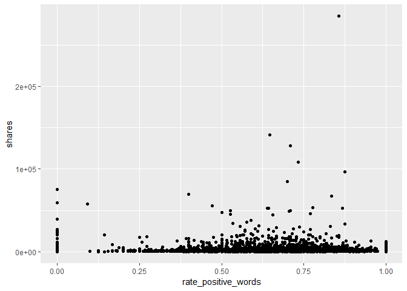<!-- -->
<!-- You’ll be automating the creation of documents using R Markdown (one for each data_channel_is_* setting, i.e. type of article in the data set provided). Each document should be rendered as a github_document from a single .Rmd file. In the README.md file you should create links to each of the documents you will create (Lifestyle analysis, Entertainment analysis, etc.). Links can be made to the sub-documents using relative -->
<!-- paths. For instance, if you have all of the outputted .md files in the main directory you would just use markdown linking: -->

<!-- - The analysis for [Lifestyle articles is available here](LifestyleAnalysis.html). Note we -->
<!-- link to the html file even though the file we create is a .md file - github creates the .html for us. -->
<!-- In the repo’s README.md file (which doesn’t need to be created from a .Rmd file, just use the one you initialize into the repo if you want) give a brief description of the purpose of the repo, a list of R packages used, links to the generated analyses, and the code used to create the analyses from a single .Rmd file (i.e. the render() code). -->

# Modelling

The data is already split into 70% training and 30% test. Our main goal
is to predict the number of shares. This will be our response variable.
We will create four models each using 5-fold cross-validation.

Two models (first linear and random forest) will be multiple linear
regression models, one will be a random forest model and the final model
will be a boosted tree model.

A Linear regression model is a supervised learning technique that is
used to predict the value of a variable based on the value of other
variable(s). The variable you want to predict is called the dependent
variable or the response. The variable(s) you are using to predict is
called the independent variable(s) or the predictor(s).

## First linear model.

We model the number of shares by the selected independent variables

-   “n_tokens_title” (Number of words in the title),

-   “n_tokens_content” (Number of words in the content)

-   “num_imgs” (Number of images)

-   “num_videos” (Number of videos)

-   “is_weekend” (Was the article published on the weekend?)

``` r
#linear regression model 1
l_m1 <- train(shares ~ n_tokens_title +  n_tokens_content + num_imgs + num_videos + 
                       is_weekend, 
              data = ChannelTrain, 
              method = "lm", 
              preProcess = c("center", "scale"),
              trControl = trainControl(method= "cv", number = 5))
#l_m1
#predicting on the ChannelTest data with linear regression model 1
test_pred_l_m1 <- predict(l_m1, newdata = ChannelTest)
#finding the best model - more explicit
m1 <- postResample(test_pred_l_m1, ChannelTest$shares)
m1
```

    ##         RMSE     Rsquared          MAE 
    ## 5.160365e+03 1.268899e-02 1.897436e+03

## Second linear model

We model the number of shares by the selected independent variables

-   “num_hrefs” (Number of links)

-   “weekday_is_monday” (Was the article published on a Monday?)

-   “weekday_is_tuesday” (Was the article published on a Tuesday?)

-   “weekday_is_wednesday” {Was the article published on a Wednesday?)

-   “weekday_is_thursday” (Was the article published on a Thursday?)

-   “weekday_is_friday” (Was the article published on a Friday?)

-   “self_reference_avg_sharess” (Avg. shares of referenced articles in
    Mashable)

``` r
#linear regression model 2
l_m2 <- train(shares ~ num_hrefs + weekday_is_monday + weekday_is_tuesday +
                       weekday_is_wednesday + weekday_is_thursday + weekday_is_friday +
                       self_reference_avg_sharess,
              data = ChannelTrain, 
              method = "lm", 
              preProcess = c("center", "scale"),
              trControl = trainControl(method= "cv", number = 5))
#predictions based on linear model 2 for the ChannelTest data
test_pred_l_m2 <- predict(l_m2, newdata = ChannelTest)
#best model chosen - RMSE reported explicity
#goal is to compare RMSE and see which one is the lowest!
m2 <- postResample(test_pred_l_m2, ChannelTest$shares)
m2
```

    ##         RMSE     Rsquared          MAE 
    ## 5.193550e+03 1.274165e-03 1.931547e+03

## Random forest model

The idea behind the random forest model is the same as bagging but we
use a random subset of predictors for each bootstrap sample tree fit
(indicated by “mtry”). More specifically, it involves creating a
boothstrap sample (same size with replacement), training the tree on
this sample (no pruning necessary), repeating the process a large number
of times and the final prediction is the average of those predictions.
Finding the average of predictions decreases variance which improves
predictions but unfortunately we lose interpretability.

For our random forest We model the number of shares by the selected
independent variables

-   “n_tokens_title” (Number of words in the title),

-   “n_tokens_content” (Number of words in the content)

-   “num_imgs” (Number of images)

-   “num_videos” (Number of videos)

-   “is_weekend” (Was the article published on the weekend?)

``` r
r_f <- train(shares ~ n_tokens_title +  n_tokens_content + num_imgs + num_videos + 
                      is_weekend , data = ChannelTrain, method = "rf",
  
             trControl=trainControl(method = "cv", number = 5),
             preProcess = c("center", "scale"),
             tuneGrid = data.frame(mtry = 1:3))
test_pred_r_f <- predict(r_f, newdata = ChannelTest)
m3 <- postResample(test_pred_r_f, ChannelTest$shares)
m3
```

    ##         RMSE     Rsquared          MAE 
    ## 5.171464e+03 9.617930e-03 1.855813e+03

``` r
#bootstrapping will take some time...
```

## Boosted tree model

The idea behind the boosting tree model is to train our tree slowly in a
sequential manner so each tree that is created will be based on the
previous one with predictions updated.

For our boosting tree we model the number of shares by the selected
independent variables

-   “num_hrefs” (Number of links)

-   “weekday_is_monday” (Was the article published on a Monday?)

-   “weekday_is_tuesday” (Was the article published on a Tuesday?)

-   “weekday_is_wednesday” {Was the article published on a Wednesday?)

-   “weekday_is_thursday” (Was the article published on a Thursday?)

-   “weekday_is_friday” (Was the article published on a Friday?)

-   “self_reference_avg_sharess” (Avg. shares of referenced articles in
    Mashable)

Additionally we choose to use all combinations of the tuning parameters
n.trees = c(25, 50, 100, 150, 200), interaction.depth = 1:4, shrinkage =
0.1 and n.minobsinnode = 10.

``` r
tune1<- c(25, 50, 100, 150, 200)
tune2<- 1:4
tune3<- 0.1
tune4<- 10
boosted <- train(shares ~ num_hrefs + weekday_is_monday + weekday_is_tuesday + weekday_is_wednesday + weekday_is_thursday + weekday_is_friday + self_reference_avg_sharess, 
data = ChannelTrain, method = "gbm",
 trControl=trainControl(method = "cv", number = 5),
 preProcess = c("center", "scale"),
 tuneGrid = expand.grid(n.trees = tune1, interaction.depth = tune2, shrinkage = tune3,    n.minobsinnode = tune4))
```

    ## Iter   TrainDeviance   ValidDeviance   StepSize   Improve
    ##      1 49585721.5250             nan     0.1000 99811.2061
    ##      2 49458408.7663             nan     0.1000 89949.6054
    ##      3 49374135.3778             nan     0.1000 64836.7229
    ##      4 49343897.7887             nan     0.1000 -8402.8311
    ##      5 49293964.6977             nan     0.1000 15036.0971
    ##      6 49256459.6258             nan     0.1000 6736.7866
    ##      7 49215788.5889             nan     0.1000 3109.4848
    ##      8 49149264.8163             nan     0.1000 37060.9388
    ##      9 49123024.1569             nan     0.1000 -27416.3191
    ##     10 49102787.6894             nan     0.1000 2124.4655
    ##     20 48804363.0657             nan     0.1000 -12483.9429
    ##     40 48579965.7791             nan     0.1000 -2184.6759
    ##     60 48469032.3135             nan     0.1000 -11268.0991
    ##     80 48344790.2569             nan     0.1000 -9178.4000
    ##    100 48247490.4831             nan     0.1000 -21102.0671
    ##    120 48157888.1789             nan     0.1000 -3390.6363
    ##    140 48002593.2087             nan     0.1000 -4888.2153
    ##    160 47913223.4640             nan     0.1000 -26372.4017
    ##    180 47807662.1950             nan     0.1000 -21229.4795
    ##    200 47751552.0793             nan     0.1000 11728.7276
    ## 
    ## Iter   TrainDeviance   ValidDeviance   StepSize   Improve
    ##      1 49584174.9816             nan     0.1000 -17046.0607
    ##      2 49295900.7991             nan     0.1000 41019.4697
    ##      3 48997480.2419             nan     0.1000 -24668.0350
    ##      4 48756842.8246             nan     0.1000 -52456.5744
    ##      5 48609320.2999             nan     0.1000 -21249.2279
    ##      6 48538254.2412             nan     0.1000 11443.2563
    ##      7 48465894.4390             nan     0.1000 1539.1420
    ##      8 48332043.2075             nan     0.1000 23923.4629
    ##      9 48299785.4698             nan     0.1000 -14535.3710
    ##     10 48262313.7026             nan     0.1000 16019.1847
    ##     20 47694988.4533             nan     0.1000 -15471.6367
    ##     40 46871944.0464             nan     0.1000 -107012.8952
    ##     60 46515817.2559             nan     0.1000 -43062.8328
    ##     80 46064965.8564             nan     0.1000 -68900.9329
    ##    100 45798544.0548             nan     0.1000 -52357.1548
    ##    120 45470158.7330             nan     0.1000 -149424.0146
    ##    140 45161540.5234             nan     0.1000 -35277.5832
    ##    160 44721139.8961             nan     0.1000 -47281.3991
    ##    180 44460877.7118             nan     0.1000 -75450.3524
    ##    200 44172326.0932             nan     0.1000 -29286.0698
    ## 
    ## Iter   TrainDeviance   ValidDeviance   StepSize   Improve
    ##      1 49219849.6894             nan     0.1000 6751.5063
    ##      2 48844507.8069             nan     0.1000 -35771.7896
    ##      3 48750463.0892             nan     0.1000 69470.0901
    ##      4 48454456.2024             nan     0.1000 -55000.4780
    ##      5 48377778.7553             nan     0.1000 -22432.2676
    ##      6 48320789.6866             nan     0.1000 30018.9133
    ##      7 48268809.0971             nan     0.1000 -3440.0130
    ##      8 48201742.9786             nan     0.1000 56597.4112
    ##      9 48022222.2165             nan     0.1000 52648.2918
    ##     10 47876444.3302             nan     0.1000 20881.3398
    ##     20 47052481.5692             nan     0.1000 -60938.1478
    ##     40 45460654.8039             nan     0.1000 -18042.4400
    ##     60 44702598.6546             nan     0.1000 -77720.9209
    ##     80 43850911.5184             nan     0.1000 -46150.8965
    ##    100 43329753.6529             nan     0.1000 -245405.1600
    ##    120 42808906.8606             nan     0.1000 -212892.7978
    ##    140 42375131.6880             nan     0.1000 -91101.4581
    ##    160 42210186.3605             nan     0.1000 -161108.2364
    ##    180 41715544.3214             nan     0.1000 -213496.7186
    ##    200 41341362.1259             nan     0.1000 -69301.8184
    ## 
    ## Iter   TrainDeviance   ValidDeviance   StepSize   Improve
    ##      1 49466931.4689             nan     0.1000 135598.5282
    ##      2 49350876.1852             nan     0.1000 30590.2785
    ##      3 49094318.1634             nan     0.1000 11745.9003
    ##      4 49008782.5512             nan     0.1000 43397.5988
    ##      5 48574882.2483             nan     0.1000 36204.3810
    ##      6 48271975.9542             nan     0.1000 -20329.7789
    ##      7 47987506.9477             nan     0.1000 19568.1589
    ##      8 47720839.6115             nan     0.1000 -117110.9215
    ##      9 47637231.7630             nan     0.1000 37836.8812
    ##     10 47341901.6503             nan     0.1000 -62745.7809
    ##     20 46015348.1151             nan     0.1000 -88829.4613
    ##     40 45182978.1944             nan     0.1000 -37581.6253
    ##     60 43998435.9864             nan     0.1000 -212264.0244
    ##     80 43148854.5503             nan     0.1000 -188022.2204
    ##    100 42126042.6514             nan     0.1000 -41690.5065
    ##    120 41149853.9817             nan     0.1000 -37567.5389
    ##    140 40603914.9087             nan     0.1000 -79194.8139
    ##    160 40058477.6184             nan     0.1000 -105677.0744
    ##    180 39459875.1832             nan     0.1000 -109740.6437
    ##    200 38684730.5497             nan     0.1000 -52928.2212
    ## 
    ## Iter   TrainDeviance   ValidDeviance   StepSize   Improve
    ##      1 28639955.5272             nan     0.1000 82282.9468
    ##      2 28553691.4780             nan     0.1000 57067.8190
    ##      3 28511600.3443             nan     0.1000 41126.0373
    ##      4 28465282.7808             nan     0.1000 46160.4973
    ##      5 28425709.8781             nan     0.1000 37702.2488
    ##      6 28399342.5779             nan     0.1000 28665.7677
    ##      7 28369519.8630             nan     0.1000 -11003.2815
    ##      8 28345781.3899             nan     0.1000 16944.5717
    ##      9 28304904.8539             nan     0.1000 3409.3465
    ##     10 28264663.6218             nan     0.1000 23985.1065
    ##     20 28062119.6501             nan     0.1000 -13616.2648
    ##     40 27933691.8829             nan     0.1000 -14794.1006
    ##     60 27849799.3375             nan     0.1000 -18453.0558
    ##     80 27794482.2085             nan     0.1000 -1342.6295
    ##    100 27687513.6582             nan     0.1000 -2013.9623
    ##    120 27629288.8069             nan     0.1000 -18699.1113
    ##    140 27588082.0424             nan     0.1000 -15066.2297
    ##    160 27511813.7032             nan     0.1000 -22103.4265
    ##    180 27467267.5320             nan     0.1000 -23378.0915
    ##    200 27406093.8818             nan     0.1000 -26964.4709
    ## 
    ## Iter   TrainDeviance   ValidDeviance   StepSize   Improve
    ##      1 28641936.7577             nan     0.1000 120994.5667
    ##      2 28512449.4899             nan     0.1000 29154.8819
    ##      3 28457707.6087             nan     0.1000 44304.6886
    ##      4 28341051.9408             nan     0.1000 27690.6049
    ##      5 28252430.8339             nan     0.1000 41621.4568
    ##      6 28201387.1620             nan     0.1000 -355.8783
    ##      7 28108309.6025             nan     0.1000 -35346.1758
    ##      8 28059158.2201             nan     0.1000 -62488.9615
    ##      9 27976448.0150             nan     0.1000 1774.3925
    ##     10 27950736.8411             nan     0.1000 -25118.4136
    ##     20 27534278.0657             nan     0.1000  879.0736
    ##     40 27107796.3348             nan     0.1000 -21419.5779
    ##     60 26839447.8704             nan     0.1000 -34736.0072
    ##     80 26624746.8221             nan     0.1000 -30100.9939
    ##    100 26462266.5223             nan     0.1000 -16256.5191
    ##    120 26239090.4789             nan     0.1000 -19399.6994
    ##    140 26066782.5126             nan     0.1000 -30245.9226
    ##    160 25937545.5240             nan     0.1000 -8409.0443
    ##    180 25733874.2874             nan     0.1000 -11233.7891
    ##    200 25597093.7044             nan     0.1000 -27324.1054
    ## 
    ## Iter   TrainDeviance   ValidDeviance   StepSize   Improve
    ##      1 28642684.0062             nan     0.1000 68423.3757
    ##      2 28519140.6216             nan     0.1000 71340.1565
    ##      3 28424705.2642             nan     0.1000 97970.7472
    ##      4 28257257.1264             nan     0.1000 26055.0019
    ##      5 28119343.2493             nan     0.1000 58403.5493
    ##      6 28048055.8598             nan     0.1000 5801.3448
    ##      7 27906297.8666             nan     0.1000 4796.1455
    ##      8 27834178.0782             nan     0.1000 6730.4282
    ##      9 27764455.5420             nan     0.1000 -7514.4850
    ##     10 27682957.0053             nan     0.1000 -4977.4917
    ##     20 27008583.3662             nan     0.1000 -133881.4346
    ##     40 26512961.7736             nan     0.1000 -69964.9578
    ##     60 26229670.8194             nan     0.1000 -28944.5431
    ##     80 25915144.3533             nan     0.1000 -42643.0686
    ##    100 25585602.2989             nan     0.1000 -34948.7329
    ##    120 25358396.6111             nan     0.1000 -102920.6185
    ##    140 25160018.8849             nan     0.1000 -50437.4464
    ##    160 24966920.4941             nan     0.1000 -74564.0438
    ##    180 24771125.3770             nan     0.1000 -23397.8169
    ##    200 24591968.6787             nan     0.1000 -64522.9868
    ## 
    ## Iter   TrainDeviance   ValidDeviance   StepSize   Improve
    ##      1 28509377.8338             nan     0.1000 67110.2720
    ##      2 28315031.0548             nan     0.1000 12060.5306
    ##      3 28064839.6594             nan     0.1000 77756.9433
    ##      4 27915436.1812             nan     0.1000 14779.7020
    ##      5 27837078.4582             nan     0.1000 53403.1928
    ##      6 27719766.1412             nan     0.1000 -58444.0723
    ##      7 27617163.4155             nan     0.1000 -32106.3571
    ##      8 27511542.9941             nan     0.1000  346.3820
    ##      9 27382880.2581             nan     0.1000 -45304.8781
    ##     10 27349503.4067             nan     0.1000 -10298.0193
    ##     20 26766629.5196             nan     0.1000 -54686.9517
    ##     40 26227219.9050             nan     0.1000 -95021.9094
    ##     60 25643858.8320             nan     0.1000 -49696.2299
    ##     80 25281160.2035             nan     0.1000 -80311.6712
    ##    100 24944500.0727             nan     0.1000 -66967.4010
    ##    120 24669138.8953             nan     0.1000 -51018.8123
    ##    140 24323257.5494             nan     0.1000 -25571.2111
    ##    160 24002007.2600             nan     0.1000 -69596.1583
    ##    180 23711350.6749             nan     0.1000 -23058.1084
    ##    200 23407259.1615             nan     0.1000 -38216.4029
    ## 
    ## Iter   TrainDeviance   ValidDeviance   StepSize   Improve
    ##      1 40797154.5081             nan     0.1000 58113.1447
    ##      2 40687509.7454             nan     0.1000 38837.4315
    ##      3 40643968.0958             nan     0.1000 9226.7561
    ##      4 40592434.8019             nan     0.1000 31468.8639
    ##      5 40552144.9541             nan     0.1000 30109.7710
    ##      6 40515494.1847             nan     0.1000 28438.4796
    ##      7 40468609.6373             nan     0.1000 7810.3942
    ##      8 40443979.7164             nan     0.1000 6524.7429
    ##      9 40413091.0002             nan     0.1000 6499.1175
    ##     10 40372384.3473             nan     0.1000 2654.6905
    ##     20 40194155.2188             nan     0.1000 -11840.7209
    ##     40 40038242.1968             nan     0.1000 -10828.7195
    ##     60 39949199.8462             nan     0.1000 4405.7276
    ##     80 39915366.3397             nan     0.1000 -26559.6949
    ##    100 39824319.8584             nan     0.1000 -6304.5580
    ##    120 39769729.9934             nan     0.1000 -19107.9381
    ##    140 39629327.6875             nan     0.1000 -2488.7897
    ##    160 39535589.8680             nan     0.1000 -35093.7555
    ##    180 39459221.3204             nan     0.1000 -16717.6427
    ##    200 39386784.6164             nan     0.1000 6622.6223
    ## 
    ## Iter   TrainDeviance   ValidDeviance   StepSize   Improve
    ##      1 40745798.2859             nan     0.1000 40160.2534
    ##      2 40605432.3821             nan     0.1000 58072.7558
    ##      3 40551540.0703             nan     0.1000 19113.8315
    ##      4 40360334.6216             nan     0.1000 -1206.0024
    ##      5 40292222.8099             nan     0.1000 20890.7106
    ##      6 40027205.6787             nan     0.1000 -70041.8652
    ##      7 39889958.8620             nan     0.1000 -86196.3574
    ##      8 39831276.6384             nan     0.1000 -17298.8279
    ##      9 39787097.2394             nan     0.1000 30248.5447
    ##     10 39630499.6038             nan     0.1000 -136278.2409
    ##     20 39028797.1794             nan     0.1000 -11270.3946
    ##     40 38491322.3511             nan     0.1000 -44989.5347
    ##     60 37967421.4180             nan     0.1000 -31350.1679
    ##     80 37569991.4749             nan     0.1000 -277074.9455
    ##    100 37165100.3093             nan     0.1000 -30197.5118
    ##    120 36794689.0141             nan     0.1000 -162544.7214
    ##    140 36469470.7388             nan     0.1000 -113735.0272
    ##    160 36160061.4706             nan     0.1000 -16176.6868
    ##    180 36007665.4943             nan     0.1000 -16708.1835
    ##    200 35904339.8809             nan     0.1000 -63892.2817
    ## 
    ## Iter   TrainDeviance   ValidDeviance   StepSize   Improve
    ##      1 40744080.0154             nan     0.1000 60691.5534
    ##      2 40599942.3566             nan     0.1000 112476.1298
    ##      3 40428036.2139             nan     0.1000 21907.0149
    ##      4 40353834.8813             nan     0.1000 -26019.1118
    ##      5 40060299.0193             nan     0.1000 -12208.9662
    ##      6 39822706.7045             nan     0.1000 -67160.4760
    ##      7 39699251.4560             nan     0.1000 32573.6568
    ##      8 39384136.9773             nan     0.1000 -42276.0674
    ##      9 39332220.4344             nan     0.1000 35937.7384
    ##     10 39275489.1758             nan     0.1000 54639.8349
    ##     20 38475844.9946             nan     0.1000 -15843.1281
    ##     40 37387902.5584             nan     0.1000 -50041.7185
    ##     60 36492988.1444             nan     0.1000 -241243.7639
    ##     80 36118611.2959             nan     0.1000 -1440.2730
    ##    100 35679408.6121             nan     0.1000 -14784.4454
    ##    120 35199873.2570             nan     0.1000 -112935.4169
    ##    140 34897111.1323             nan     0.1000 -38317.8616
    ##    160 34482403.4509             nan     0.1000 -9255.2461
    ##    180 34082074.0718             nan     0.1000 -46791.5627
    ##    200 33671531.9124             nan     0.1000 -20173.1014
    ## 
    ## Iter   TrainDeviance   ValidDeviance   StepSize   Improve
    ##      1 40779465.1881             nan     0.1000 51413.5925
    ##      2 40366732.4829             nan     0.1000 3333.7738
    ##      3 40276754.2769             nan     0.1000 40527.7902
    ##      4 40000574.5477             nan     0.1000 32248.9536
    ##      5 39723850.1696             nan     0.1000 -13912.3200
    ##      6 39438135.3144             nan     0.1000 -87195.3750
    ##      7 39370484.1178             nan     0.1000 -46733.5606
    ##      8 39318967.1878             nan     0.1000 -18741.4161
    ##      9 38954420.3334             nan     0.1000 -204021.1535
    ##     10 38758374.6966             nan     0.1000 -197233.6144
    ##     20 37586902.5993             nan     0.1000 -27756.5819
    ##     40 36408787.9546             nan     0.1000 -121157.7729
    ##     60 35461495.9221             nan     0.1000 18463.9489
    ##     80 34640625.8519             nan     0.1000 -25659.7041
    ##    100 33959095.8657             nan     0.1000 -65557.0506
    ##    120 33487610.5610             nan     0.1000 -58979.0626
    ##    140 33173509.1573             nan     0.1000 -31080.5227
    ##    160 32499505.1247             nan     0.1000 -136411.7391
    ##    180 32058038.4672             nan     0.1000 -8757.9380
    ##    200 31477903.7961             nan     0.1000 -36062.9843
    ## 
    ## Iter   TrainDeviance   ValidDeviance   StepSize   Improve
    ##      1 41673943.1022             nan     0.1000 74276.1949
    ##      2 41582571.5341             nan     0.1000 64000.9594
    ##      3 41507316.0395             nan     0.1000 16824.4649
    ##      4 41473096.2739             nan     0.1000 35717.4746
    ##      5 41434546.4862             nan     0.1000 30119.1238
    ##      6 41407314.8285             nan     0.1000 26229.0628
    ##      7 41381352.8551             nan     0.1000 19148.8179
    ##      8 41357086.9451             nan     0.1000 12245.6691
    ##      9 41320495.1478             nan     0.1000 -27461.8625
    ##     10 41283380.2514             nan     0.1000 16232.3040
    ##     20 41129469.7366             nan     0.1000 9520.3353
    ##     40 40961718.3469             nan     0.1000 -11236.9728
    ##     60 40851578.3272             nan     0.1000 -5149.7922
    ##     80 40766280.5282             nan     0.1000 1261.9991
    ##    100 40700277.4268             nan     0.1000 2128.4263
    ##    120 40654585.3061             nan     0.1000 -7064.7502
    ##    140 40594495.6640             nan     0.1000 -1948.4322
    ##    160 40553163.6494             nan     0.1000 -15572.4079
    ##    180 40526421.5831             nan     0.1000 -21484.2681
    ##    200 40510378.6962             nan     0.1000 -6070.6279
    ## 
    ## Iter   TrainDeviance   ValidDeviance   StepSize   Improve
    ##      1 41672228.7455             nan     0.1000 97564.0012
    ##      2 41484149.1701             nan     0.1000 81886.0323
    ##      3 41413402.4040             nan     0.1000 34496.2053
    ##      4 41372387.4328             nan     0.1000 18104.0768
    ##      5 41327340.2579             nan     0.1000 33357.7071
    ##      6 41211466.3797             nan     0.1000 -1903.2354
    ##      7 41011084.7724             nan     0.1000 -15555.6259
    ##      8 40758439.3130             nan     0.1000 -53844.2464
    ##      9 40570241.6795             nan     0.1000 -77844.8684
    ##     10 40517142.9041             nan     0.1000 -16515.6744
    ##     20 39787498.5467             nan     0.1000 -299156.0449
    ##     40 39356088.6875             nan     0.1000 -96651.3932
    ##     60 38888010.4506             nan     0.1000 -11066.6022
    ##     80 38597020.8233             nan     0.1000 -17058.2654
    ##    100 38205347.3984             nan     0.1000 -117384.1155
    ##    120 37898248.2229             nan     0.1000 -62165.5643
    ##    140 37619135.2839             nan     0.1000 -103106.7243
    ##    160 37428646.4773             nan     0.1000 -169416.4506
    ##    180 37174970.0601             nan     0.1000 -8475.3210
    ##    200 36912740.5042             nan     0.1000 -44090.6436
    ## 
    ## Iter   TrainDeviance   ValidDeviance   StepSize   Improve
    ##      1 41722607.6874             nan     0.1000 70669.4025
    ##      2 41609148.8938             nan     0.1000 54295.0720
    ##      3 41512224.3065             nan     0.1000 55008.7537
    ##      4 41384637.2798             nan     0.1000 49886.4945
    ##      5 40988484.1341             nan     0.1000 35750.6126
    ##      6 40392755.9423             nan     0.1000 15114.2637
    ##      7 40316633.0158             nan     0.1000 8690.7207
    ##      8 40062357.4551             nan     0.1000 -166423.9316
    ##      9 39883773.6864             nan     0.1000 -126086.9993
    ##     10 39838626.4052             nan     0.1000 18124.0395
    ##     20 38640488.8512             nan     0.1000 -208792.4645
    ##     40 37257361.4560             nan     0.1000 -7293.0632
    ##     60 36564890.3874             nan     0.1000 -213160.6360
    ##     80 35739540.2961             nan     0.1000 -39566.0271
    ##    100 35351939.9085             nan     0.1000 -64617.7899
    ##    120 34647274.9102             nan     0.1000 -247486.7543
    ##    140 34103921.3133             nan     0.1000 -166257.4024
    ##    160 33845068.1835             nan     0.1000 -249432.8732
    ##    180 33449339.3774             nan     0.1000 -50589.1729
    ##    200 33157158.2886             nan     0.1000 -86782.5854
    ## 
    ## Iter   TrainDeviance   ValidDeviance   StepSize   Improve
    ##      1 41643643.3622             nan     0.1000 56300.5577
    ##      2 41468675.9800             nan     0.1000 34956.8157
    ##      3 41192887.4225             nan     0.1000 53158.5547
    ##      4 40855755.0237             nan     0.1000 -56006.0665
    ##      5 40819783.6989             nan     0.1000 -56405.6780
    ##      6 40754844.2652             nan     0.1000 44487.3008
    ##      7 40694405.6246             nan     0.1000 19848.1182
    ##      8 40495875.0908             nan     0.1000 -53948.3085
    ##      9 40402306.9434             nan     0.1000  323.2538
    ##     10 40351009.7327             nan     0.1000 -90589.3959
    ##     20 39057656.6753             nan     0.1000 -140648.0610
    ##     40 37453928.1229             nan     0.1000 -217400.3267
    ##     60 36010306.1392             nan     0.1000 -136410.8052
    ##     80 34923353.5452             nan     0.1000 -101206.4160
    ##    100 34246421.9931             nan     0.1000 -220602.2828
    ##    120 33581387.9693             nan     0.1000 -95909.6063
    ##    140 32846664.7845             nan     0.1000 -295718.8898
    ##    160 32293836.1881             nan     0.1000 -92310.4472
    ##    180 31969957.9723             nan     0.1000 -124561.2803
    ##    200 31582942.4350             nan     0.1000 -205145.6984
    ## 
    ## Iter   TrainDeviance   ValidDeviance   StepSize   Improve
    ##      1 45722563.4198             nan     0.1000 85494.1565
    ##      2 45660171.3854             nan     0.1000 9199.6444
    ##      3 45549602.4489             nan     0.1000 82372.5311
    ##      4 45494451.4391             nan     0.1000 66764.7038
    ##      5 45412358.0318             nan     0.1000 33830.0209
    ##      6 45382885.7107             nan     0.1000 20735.6069
    ##      7 45331874.7113             nan     0.1000 -11500.4741
    ##      8 45255754.5845             nan     0.1000 15266.1793
    ##      9 45244228.2487             nan     0.1000 7091.1113
    ##     10 45220658.8621             nan     0.1000 16518.3757
    ##     20 44964327.8012             nan     0.1000 -3009.7590
    ##     40 44727827.1967             nan     0.1000 -10155.4407
    ##     60 44606961.7692             nan     0.1000 -22553.7418
    ##     80 44504605.5903             nan     0.1000 -5749.2157
    ##    100 44420263.6294             nan     0.1000 -28391.9794
    ##    120 44313402.8457             nan     0.1000 -7791.3674
    ##    140 44242291.5530             nan     0.1000 -28314.4844
    ##    160 44178210.0817             nan     0.1000 -39278.0906
    ##    180 44084661.3389             nan     0.1000 -8057.5474
    ##    200 44018626.5077             nan     0.1000 -9901.9154
    ## 
    ## Iter   TrainDeviance   ValidDeviance   StepSize   Improve
    ##      1 45811240.8237             nan     0.1000 81767.2180
    ##      2 45560290.5793             nan     0.1000 7217.6406
    ##      3 45351426.3762             nan     0.1000 -9409.2907
    ##      4 45070319.4977             nan     0.1000 -7545.1478
    ##      5 45002537.9668             nan     0.1000 73692.6604
    ##      6 44938356.4293             nan     0.1000 -21088.9821
    ##      7 44871495.8893             nan     0.1000 50562.7657
    ##      8 44786894.8997             nan     0.1000 20670.1134
    ##      9 44705613.8752             nan     0.1000 2485.1516
    ##     10 44599552.4345             nan     0.1000 9166.9793
    ##     20 43629350.3569             nan     0.1000 -180183.4688
    ##     40 42933243.7515             nan     0.1000 -42955.9916
    ##     60 42471946.6894             nan     0.1000 -85352.7243
    ##     80 41733628.1848             nan     0.1000 -33749.2936
    ##    100 41312331.6922             nan     0.1000 -28922.3302
    ##    120 40888803.2958             nan     0.1000 -152182.7902
    ##    140 40607666.1633             nan     0.1000 -48266.7626
    ##    160 40339852.8543             nan     0.1000 -58911.1149
    ##    180 40002159.8032             nan     0.1000 -21921.5681
    ##    200 39718775.8499             nan     0.1000 -41255.2425
    ## 
    ## Iter   TrainDeviance   ValidDeviance   StepSize   Improve
    ##      1 45741461.7687             nan     0.1000 89973.7054
    ##      2 45504933.4855             nan     0.1000 47870.0016
    ##      3 45384904.6269             nan     0.1000 17457.0556
    ##      4 45127861.4906             nan     0.1000 -65565.7904
    ##      5 45029150.0958             nan     0.1000 42535.8064
    ##      6 44882259.5614             nan     0.1000 61109.3746
    ##      7 44749695.0853             nan     0.1000 15177.8889
    ##      8 44478558.0895             nan     0.1000 -10507.6587
    ##      9 44382233.6984             nan     0.1000 24517.7521
    ##     10 44063452.1399             nan     0.1000 -99893.8297
    ##     20 43147315.5694             nan     0.1000 -40691.7071
    ##     40 41898689.1172             nan     0.1000 -78251.2780
    ##     60 41022865.1952             nan     0.1000 -185426.9948
    ##     80 40110847.0625             nan     0.1000 -17129.9364
    ##    100 39237493.9610             nan     0.1000 -121424.9149
    ##    120 38687210.8487             nan     0.1000 -52864.5468
    ##    140 38129447.0157             nan     0.1000 -88032.0258
    ##    160 37658782.5225             nan     0.1000 10471.9465
    ##    180 37202052.6365             nan     0.1000 -18407.7802
    ##    200 36826918.2308             nan     0.1000 13518.6601
    ## 
    ## Iter   TrainDeviance   ValidDeviance   StepSize   Improve
    ##      1 45378233.9588             nan     0.1000 98150.7336
    ##      2 45208766.9735             nan     0.1000 88097.6750
    ##      3 44872344.0728             nan     0.1000 -22188.4243
    ##      4 44726050.8736             nan     0.1000 136893.5280
    ##      5 44518506.1997             nan     0.1000 68544.3250
    ##      6 44353847.1953             nan     0.1000 1043.2233
    ##      7 44250497.3697             nan     0.1000 41200.0411
    ##      8 44135961.3443             nan     0.1000 -13033.0774
    ##      9 44023152.7539             nan     0.1000 -3206.9866
    ##     10 43527567.8493             nan     0.1000 -68665.2411
    ##     20 42123361.3382             nan     0.1000 -42163.0747
    ##     40 40336910.0885             nan     0.1000 -29261.4750
    ##     60 39070796.2434             nan     0.1000 -173196.7713
    ##     80 38452352.2724             nan     0.1000 -144539.4562
    ##    100 37952385.5118             nan     0.1000 -34042.7536
    ##    120 37308027.8603             nan     0.1000 -52197.5239
    ##    140 36455500.9285             nan     0.1000 -43000.6982
    ##    160 35737145.4118             nan     0.1000 -205733.9010
    ##    180 35312285.5687             nan     0.1000 -21914.0525
    ##    200 34886240.6698             nan     0.1000 -125897.4036
    ## 
    ## Iter   TrainDeviance   ValidDeviance   StepSize   Improve
    ##      1 41289778.8692             nan     0.1000 90527.2220
    ##      2 41232313.4456             nan     0.1000 74601.5181
    ##      3 41158709.3771             nan     0.1000 41294.6354
    ##      4 41093005.0259             nan     0.1000 24883.3049
    ##      5 41016082.7018             nan     0.1000 -7423.1704
    ##      6 40977640.7206             nan     0.1000 13417.7075
    ##      7 40942997.4421             nan     0.1000 12784.6314
    ##      8 40917956.1683             nan     0.1000 17982.4428
    ##      9 40900645.1156             nan     0.1000 12196.1885
    ##     10 40879898.9687             nan     0.1000 -6271.7184
    ##     20 40684197.7090             nan     0.1000  922.2296
    ##     25 40614605.5755             nan     0.1000 -188.4844

``` r
test_pred_boosted <- predict(boosted, newdata = ChannelTest)
m4 <- postResample(test_pred_boosted, ChannelTest$shares)
m4
```

    ##         RMSE     Rsquared          MAE 
    ## 5.172796e+03 8.761744e-03 1.867260e+03

Next we do a comparison of the four models

# Comaprison

The `postResample()` function was used to calculate useful statistics
such as rmse and R squared values for each one of the four models. We
summarize them in the tibble below.

``` r
lm1 <- tibble(model = c("First linear regression"), RMSE = c(m1[[1]]), R2 = c(m1[[2]]))
lm2 <- tibble(model = c("Second linear regression"), RMSE = c(m2[[1]]), R2 = c(m2[[2]]))
rf <- tibble(model = c("Random Forest"), RMSE = c(m3[[1]]), R2 = c(m3[[2]]))
Bos <- tibble(model = c("Boosting"), RMSE = c(m4[[1]]), R2 = c(m4[[2]]))
RMSE_table <- rbind(lm1, lm2, rf, Bos)
RMSE_table
```

    ## # A tibble: 4 × 3
    ##   model                     RMSE      R2
    ##   <chr>                    <dbl>   <dbl>
    ## 1 First linear regression  5160. 0.0127 
    ## 2 Second linear regression 5194. 0.00127
    ## 3 Random Forest            5171. 0.00962
    ## 4 Boosting                 5173. 0.00876

RMSE is a metric that tells us how far apart the predicted values are
from the observed values in a dataset, on average. The lower the RMSE,
the better a model fits a dataset.

R2 is a metric that tells us the proportion of the variance in the
response variable of a regression model that can be explained by the
predictor variables. This value ranges from 0 to 1. The higher the R2
value, the better a model fits a dataset.

From the table above the First linear regession model has the lowest
RMSE and the hightest R2 and is therefore our winner.

``` r
#pick the smallest RMSE for the best model...
final_result <- RMSE_table %>%
                filter ( min(RMSE) == RMSE )
final_result
```

    ## # A tibble: 1 × 3
    ##   model                    RMSE     R2
    ##   <chr>                   <dbl>  <dbl>
    ## 1 First linear regression 5160. 0.0127

When comparing all 4 of our models, we are looking for the smallest
value of RMSE to tell us which model is the best. In this situation, we
can say that the smallest RMSE is 5160.3649905 and this comes from the
First linear regression model.

<!-- # Project Work -->
<!-- The first step is for the first group member to create a github repo and add the second group member as a collaborator. The second group member then needs to accept the membership. This gives everyone access to push changes up to the repository. All project work should be done within this repo. -->
<!-- Each time you go to work on the project, you should pull down any of the latest changes using git pull. You should then upload any changes you’ve made via the usual workflow done previously. There may occasionally be merge conflicts that have to be dealt with. This can be done with the Git tab in RStudio. Let us know if you are having issues with conflicts that you can’t resolve! -->
<!-- # Repo Setting -->
<!-- On your project repo you should go into the settings and enable github pages (feel free to select a theme too!). This will make it so your repo can be accessed like your blog (username.github.io/repo-name). Be sure to choose the master or main branch as the one to use if you have choices there. -->
<!-- You’ll be automating the creation of documents using R Markdown (one for each data_channel_is_* setting, i.e. type of article in the data set provided). Each document should be rendered as a github_document from a single .Rmd file. In the README.md file you should create links to each of the documents you will create (Lifestyle analysis, Entertainment analysis, etc.). Links can be made to the sub-documents using relative -->
<!-- paths. For instance, if you have all of the outputted .md files in the main directory you would just use markdown linking: -->
<!-- - The analysis for [Lifestyle articles is available here](LifestyleAnalysis.html). Note we -->
<!-- link to the html file even though the file we create is a .md file - github creates the .html for us. -->
<!-- In the repo’s README.md file (which doesn’t need to be created from a .Rmd file, just use the one you initialize into the repo if you want) give a brief description of the purpose of the repo, a list of R packages used, links to the generated analyses, and the code used to create the analyses from a single .Rmd file (i.e. the render() code). -->

# Blog

Once you’ve completed the project each of you should write a brief blog
post outlining your project and two links to the
username.github.io/repo-name site and the repo itself (the username may
correspond to your partner). You should then also reflect on the process
you went through. Discuss the following:

-   what would you do differently?  
-   what was the most difficult part for you?  
-   what are your big take-aways from this project?

<!-- # Topic -->
<!-- What are you actually doing? You’ll read in and analyze an online news popularity data set. You’ll subset the data by data_channel_is_* (one of six groups). Then you’ll summarize the data and try to predict the number of shares using predictive models. -->
<!-- 1. Read in the OnlineNewsPopularity.csv data file -- subset for data_channel_is_lifestyle: Is data channel 'Lifestyle'? -->
<!-- Here, `read_csv()` is used to read in the OnlineNewsPopularity.csv data and we are subsetting for the `data_channel_is_lifestyle`: Is data channel 'Lifestyle'? variable.  -->
<!-- ``` {r, echo=TRUE, eval=TRUE} -->
<!-- #install one time thing -->
<!-- #install.packages("caret") -->
<!-- #read in data set .csv file in full -->
<!-- #OnlineNewsPopularity <- readr::read_csv(file="OnlineNewsPopularity.csv",  -->
<!-- #                                        show_col_types = FALSE) -->
<!-- ``` -->
<!-- ``` {r, echo=TRUE, eval=TRUE} -->
<!-- #subsetting the data for`data_channel_is_lifestyle`: Is data channel 'Lifestyle'? -->
<!-- #Lifestyle <- OnlineNewsPopularity %>%  -->
<!-- #              filter( data_channel_is_lifestyle == 1) -->
<!-- ``` -->
<!-- # Report -->
<!-- Recommendation: At first, consider just using data from a single data_channel_is_* source. Once you have all of the below steps done for that data, then you can automate it to work with any chosen data channel. Note: It may be easier to create a single variable representing the data channel when automating the subsetting (although there are many ways to do this).   -->
<!-- - All code chunks should be shown unless they are setup code chunks.   -->
<!-- # Introduction section -->
<!-- You should have an introduction section that briefly describes the data and the variables you have to work with (just discuss the ones you want to use). Your target variables is the shares variable. -->
<!-- You should also mention the purpose of your analysis and the methods you’ll use to model the response. You’ll describe those in more detail later. -->
<!-- **This section should be done by the ‘second’ group member.** -->
<!-- # Data -->
<!-- Use a relative path to import the data. Subset the data to work on the data channel of interest. -->
<!-- **This section should be done by whoever can get to it first.** -->

# Summarizations

You should produce some basic (but meaningful) summary statistics and
plots about the training data you are working with (especially as it
relates to your response).

As you will automate this same analysis across other data, you can’t
describe the trends you see in the graph (unless you want to try to
automate that!). You should describe what to look for in the summary
statistics/plots to help the reader understand the summary or graph. Ex:
A scatter plot with the number of shares on the y-axis and the positive
word rate on the x-axis is created:

‘We can inspect the trend of shares as a function of the positive word
rate. If the points show an upward trend, then articles with more
positive words tend to be shared more often. If we see a negative trend
then articles with more positive words tend to be shared less often.’

Each group member is responsible for producing some summary statistics
(means, sds, contingency tables, etc.) and for producing at least three
graphs (each) of the data.

# Modeling

You’ll need to split the data into a training (70% of the data) and test
set (30% of the data). Use set.seed() to make things reproducible.

The goal is to create models for predicting the number of shares in some
way. Each group member should contribute a linear regression model and
an ensemble tree-based model. As we are automating things, describing
the chosen model is tough, so no need to worry about that.

The first group member should fit a random forest model and the second
group member should fit a boosted tree model. Both models should be
chosen using cross-validation.

Prior to the models fit using linear regression, the first group member
should provide a short but thorough explanation of the idea of a linear
regression model.

Prior to each ensemble model, you should provide a short but reasonably
thorough explanation of the ensemble model you are using (so one for
each group member).

# Comparison

All four of the models should be compared on the test set and a winner
declared (this should be automated to be correct across all the created
documents).

This can be done by one group member and the automation done by the
other (see below).

# Automation

<!-- Once you’ve completed the above for a particular data channel, adapt the code so that you can use a parameter in your build process. You should be able to automatically generate an analysis report for each data_channel_is_* variable - although again, you may want to create a new variable to help with the subsetting. You’ll end up with six total outputted documents. -->
<!-- This should be done by the group member that doesn’t automate the comparison of models part. -->

# Submission

In the project submission, you should simply put a link to your blog
post (which will have a link to your github pages and github repo).

<!-- # Group Issues -->
<!-- Please notify me ASAP of any group member issues. You should look over your partner’s work/explanations and discuss that with them if you have any issues with what they’ve done. Both group members are graded on all the work done regardless of who was assigned to do it. -->
<!--
Rubric for Grading (total = 100 points)
Item                               Points           Notes
Introduction                       10               Worth either 0, 5, or 10
Data split                          5               Worth either 0 or 5
Summarizations & discussions       20               Worth either 0, 5,. . . , or 20
Modeling, selection, & discussion  35               Worth either 0, 5, . . . , 35
Test set prediction and automation 10               Worth either 0, 5, or 10
Automation                         15               Worth either 0, 5, 10, or 15
Blog post and repo setup           10               Worth either 0, 5, or 10
-->
<!--
Notes on grading:
• For each item in the rubric, your grade will be lowered one level for each each error (syntax, logical, or other) in the code and for each required item that is missing or lacking a description.  
• If your work was not completed and documented using your github repo you will lose 50
points on the project.  
• You should use Good Programming Practices when coding (see wolfware). If you do not follow GPP you can lose up to 40 points on the project.  
• You should use appropriate markdown options/formatting (you can lose up to 20 points) for not doing so.
-->
<!-- code needed to render pdf file -->
